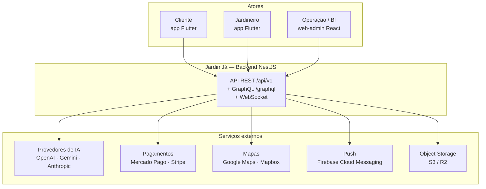
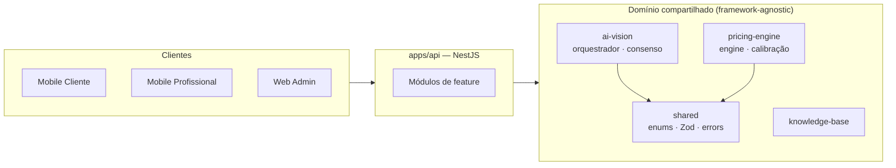
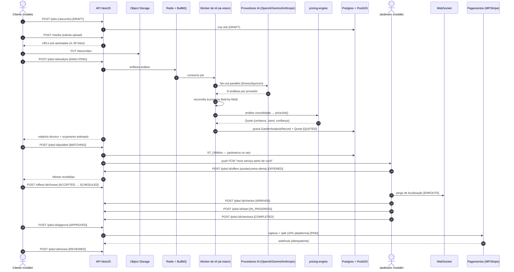
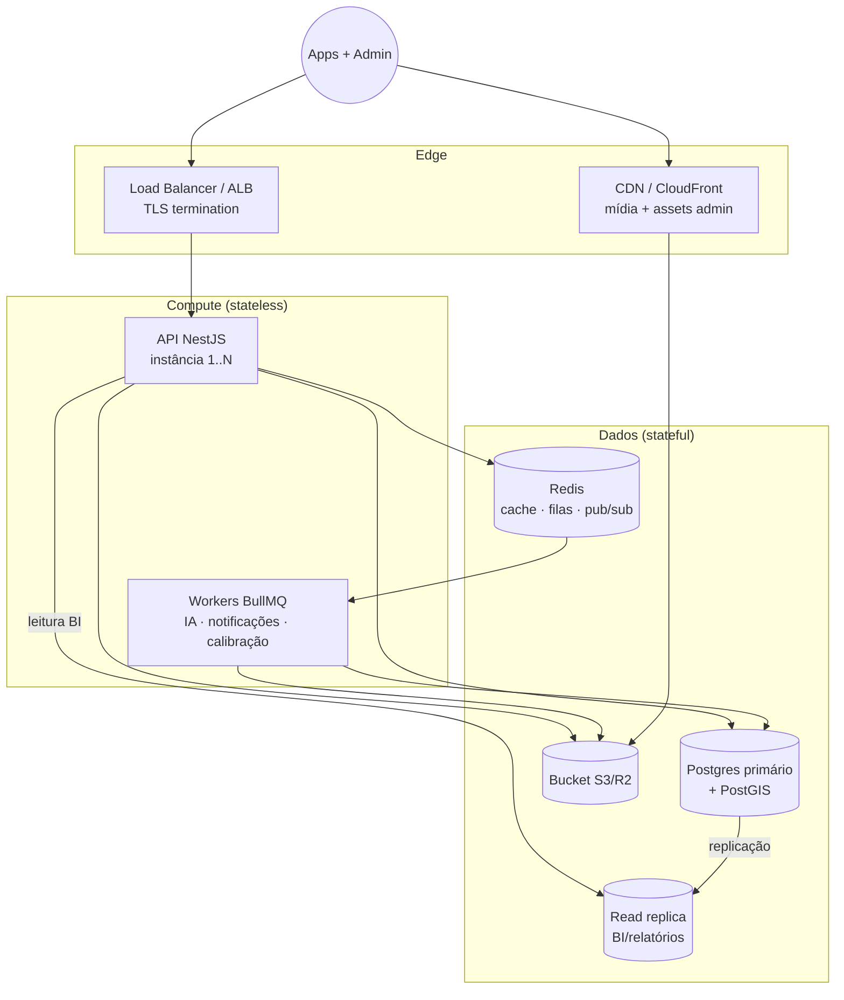

# 01 — Arquitetura de Software

> Documento técnico de arquitetura do **JardimJá** — o "Uber da Jardinagem": orçamento por IA a
> partir de fotos, marketplace de jardineiros e acompanhamento em tempo real com pagamento e split
> automático.

Documentos relacionados: [Banco de dados](02-database.md) · [APIs](03-api.md) ·
[Pipeline de IA](04-ai-pipeline.md) · [Motor de precificação](05-pricing-engine.md) ·
[Segurança & LGPD](06-security-lgpd.md) · [Deploy](07-deployment.md) · [CI/CD](08-cicd.md) ·
[Testes](09-testing.md) · [Especificação funcional](14-functional-spec.md)

---

## 1. Visão geral (contexto do sistema)

O JardimJá conecta **clientes** que precisam de serviços de jardinagem a **jardineiros/empresas**
próximos, mediado por dois componentes de inteligência: uma **IA multimodal de visão** que analisa
fotos/vídeo do jardim e um **motor de precificação determinístico** que transforma a análise em um
orçamento auditável. O cliente publica o serviço, jardineiros do raio ofertam, o cliente escolhe,
acompanha em tempo real e paga com **split** automático (comissão de 10% da plataforma).



### Princípios norteadores

| Princípio | Consequência de projeto |
| --- | --- |
| **Um vocabulário único** | Enums, DTOs e schemas Zod vivem em [`packages/shared`](../packages/shared) e são espelhados pelo Prisma e pelos clientes. |
| **Determinismo e auditabilidade** | Orçamentos são reproduzíveis a partir dos insumos armazenados; nada de "caixa-preta". |
| **Resiliência do estimador** | Um provedor de IA lento/quebrado nunca bloqueia o orçamento (fan-out com timeout + quorum). |
| **Modular, extraível** | Monolito modular NestJS cujos módulos podem virar serviços quando a escala exigir. |
| **Dinheiro sem drift** | Todo valor monetário é **inteiro em centavos (BRL)**. |

---

## 2. Estrutura do monorepo

O repositório é um monorepo **pnpm workspaces + Turborepo** (Node 22+, pnpm 10.33).

```
jardimja/
├── apps/
│   ├── api/            # Backend NestJS (REST + GraphQL) + Prisma + BullMQ
│   ├── web-admin/      # Painel administrativo React + Vite + Tailwind
│   └── mobile/         # Apps Flutter (cliente + profissional, feature-first)
├── packages/
│   ├── shared/         # Contratos de domínio: enums, DTOs, tipos, Zod schemas
│   ├── ai-vision/      # Orquestração multimodal com consenso (o "cérebro" visual)
│   ├── pricing-engine/ # Motor de orçamento determinístico + hook de ML
│   └── knowledge-base/ # Base de conhecimento (espécies, pragas, custos, produtividade)
├── infra/              # docker-compose, Dockerfiles, Terraform (AWS), k8s
├── docs/               # Documentação técnica e de negócio
└── .github/workflows/  # CI/CD
```

O grafo de tarefas do Turbo (`turbo.json`) encadeia `build → typecheck/test` respeitando
dependências (`^build`), com cache de artefatos (`dist/**`, `coverage/**`). Os pacotes `packages/*`
são consumidos via `workspace:*` — ex.: `@jardimja/api` depende de `@jardimja/shared`,
`@jardimja/ai-vision`, `@jardimja/pricing-engine` e `@jardimja/knowledge-base`.

### Camadas lógicas



---

## 3. Fluxo principal — foto → análise → orçamento → marketplace → booking → pagamento

Este é o caminho feliz de ponta a ponta. Os estados citados correspondem ao enum `JobStatus` (ver
[máquina de estados](14-functional-spec.md#3-máquina-de-estados-do-job)).



Pontos-chave do fluxo:

- **Assíncrono onde importa**: a análise de IA roda em **fila BullMQ** (não bloqueia a request HTTP).
  O cliente recebe o resultado por polling/WS quando `QUOTED`.
- **Quorum**: o orçamento só é confiável se ≥ `AI_VISION_MIN_QUORUM` provedores (default **2**)
  responderem; caso contrário retorna-se `AI_QUORUM_NOT_MET` (HTTP 422).
- **Busca geoespacial**: o `publish` seleciona jardineiros por `ST_DWithin` sobre a localização do
  job e o `serviceRadiusKm` do profissional.
- **Escrow**: os fundos são autorizados na escolha e **capturados/splitados só na aprovação** do
  cliente.

---

## 4. Diagrama de componentes

```mermaid
graph TB
    subgraph Mobile["Apps Flutter"]
        MC[App Cliente]
        MG[App Profissional]
    end
    subgraph Admin["Web Admin (React+Vite)"]
        WA[Painel operação/BI]
    end

    subgraph API["apps/api — NestJS 10"]
        AUTH[AuthModule<br/>JWT + refresh + argon2]
        USERS[Users / Gardeners]
        JOBS[Jobs<br/>máquina de estados]
        MEDIA[Media<br/>URLs pré-assinadas]
        ANALYZE[Analysis<br/>usa ai-vision]
        QUOTES[Quotes<br/>usa pricing-engine]
        MARKET[Marketplace<br/>offers · ST_DWithin]
        TRACK[Tracking<br/>Gateway WebSocket]
        CHAT[Chat<br/>Gateway WebSocket]
        PAYM[Payments<br/>intent + webhook]
        NOTIF[Notifications<br/>FCM]
        ADMINM[Admin<br/>stats · moderação]
        GQL[GraphQL<br/>read models BI]
    end

    subgraph Domain["Pacotes de domínio"]
        SH[shared]
        AV[ai-vision]
        PR[pricing-engine]
        KB[knowledge-base]
    end

    subgraph Infra["Infraestrutura"]
        PG[(PostgreSQL<br/>+ PostGIS)]
        RD[(Redis<br/>cache + BullMQ)]
        OBJ[(S3 / R2<br/>mídia)]
    end

    subgraph Ext["Provedores externos"]
        AIP[OpenAI · Gemini · Anthropic]
        PP[Mercado Pago · Stripe]
        MP[Google Maps · Mapbox]
        FB[FCM]
    end

    MC & MG & WA --> AUTH
    MC --> JOBS & MEDIA & ANALYZE & MARKET & TRACK & CHAT & PAYM
    MG --> MARKET & TRACK & CHAT
    WA --> ADMINM & GQL

    ANALYZE --> AV --> AIP
    QUOTES --> PR
    JOBS & MARKET --> PG
    MEDIA --> OBJ
    ANALYZE & NOTIF --> RD
    TRACK & CHAT --> RD
    PAYM --> PP
    NOTIF --> FB
    JOBS --> MP
    AV & PR --> SH
    ANALYZE --> KB
```



### Módulos da API (feature-first)

| Módulo | Responsabilidade | Dependências |
| --- | --- | --- |
| **Auth** | Login/registro, JWT access+refresh, rotação, roles | argon2, `@nestjs/jwt`, passport-jwt |
| **Users / Gardeners** | Perfis, verificação de jardineiro, especialidades | Prisma |
| **Jobs** | Ciclo de vida do serviço (máquina de estados) | Prisma, shared |
| **Media** | Emissão de URLs pré-assinadas, metadados de mídia | S3 |
| **Analysis** | Orquestra a IA de visão e persiste o laudo | [`ai-vision`](../packages/ai-vision), BullMQ |
| **Quotes** | Gera o orçamento a partir do laudo | [`pricing-engine`](../packages/pricing-engine) |
| **Marketplace** | Publicação, busca por raio, ofertas/contra-ofertas | PostGIS |
| **Tracking** | Pings de localização em tempo real (ENROUTE→ARRIVED) | socket.io, Redis |
| **Chat** | Mensagens job-a-job (cliente ↔ jardineiro) | socket.io, Redis |
| **Payments** | Intent, escrow, captura, split, webhooks | Mercado Pago / Stripe |
| **Notifications** | Push FCM + inbox persistente | FCM |
| **Admin / BI** | Estatísticas, moderação, calibração de preços | GraphQL |

---

## 5. Visão de contêineres (estilo C4)



- **Contêiner API** (`apps/api`): expõe REST (`/api/v1`), GraphQL (`/graphql`), Swagger (`/docs`) e
  gateways WebSocket. Sem estado local — escala horizontal.
- **Contêiner Worker**: mesmo código, processa filas BullMQ (análise de IA, envio de push,
  job noturno de calibração). Pode escalar independentemente da API.
- **Postgres + PostGIS**: fonte da verdade relacional. Colunas/índices geoespaciais adicionados por
  migração SQL. Ver [banco de dados](02-database.md).
- **Redis**: cache de leitura (ex.: feed do marketplace, configs de preço), backend das filas
  BullMQ e pub/sub para fan-out de eventos WebSocket entre instâncias.
- **S3/R2 + CDN**: mídia dos jobs (fotos/vídeo), assets do admin.

Ver a topologia AWS de referência em [Deploy](07-deployment.md).

---

## 6. Estratégia de escalabilidade

| Vetor | Estratégia |
| --- | --- |
| **API stateless** | Escala horizontal atrás do ALB; nenhuma afinidade de sessão (JWT no header). |
| **Leituras pesadas / BI** | **Read replica** (`DATABASE_REPLICA_URL`) para GraphQL/relatórios sem impactar o primário. |
| **Cache** | Redis para respostas quentes (feed, `PricingConfig`, `CalibrationFactor`) com TTL curto. |
| **Trabalho assíncrono** | Filas **BullMQ**: análise de IA, notificações e calibração fora do caminho da request. |
| **Workers dedicados** | O consumo de fila roda em contêineres separados, escaláveis por profundidade de fila. |
| **Mídia via CDN** | Uploads diretos ao S3 por URL pré-assinada; entrega por CDN, sem passar pela API. |
| **WebSocket horizontal** | socket.io com adapter Redis para propagar eventos entre instâncias. |
| **Rate limiting** | `@nestjs/throttler` protege endpoints caros (analyze, auth) contra abuso e picos. |
| **Índices geoespaciais** | GIST + `ST_DWithin` mantêm a busca por raio sub-linear conforme a base cresce. |

Gargalos previsíveis e mitigação:

- **Chamadas de IA** são o passo mais caro/lento → isoladas em fila, com timeout por provedor e
  fallback determinístico (`mock`) quando não há chaves.
- **Feed do marketplace** é altamente lido → cacheado em Redis por `(cidade, estado, status)`.
- **Webhooks de pagamento** precisam ser idempotentes → deduplicados por `externalId`.

---

## 7. Decisões arquiteturais (ADRs)

Lista resumida no estilo ADR — decisão + racional.

### ADR-001 — Monolito modular NestJS, extraível para serviços
NestJS oferece modularidade forte (módulos, providers, DI) mantendo simplicidade operacional de um
único deployable. Cada feature é um módulo com fronteira clara; quando um domínio (ex.: pagamentos,
IA) exigir escala/isolamento próprios, ele é extraído para um serviço sem reescrever o domínio.

### ADR-002 — Prisma como ORM
Schema declarativo, migrações versionadas, cliente tipado e suporte a extensões (`postgis`). O
`schema.prisma` é a fonte relacional da verdade e espelha 1:1 os enums de `@jardimja/shared`.

### ADR-003 — Dinheiro como inteiro em centavos (BRL)
Elimina erros de ponto flutuante em somas/splits. Todos os campos `*Cents` são `Int`; helpers
`money.toCents/fromCents/format` em `shared` cuidam da conversão na borda de apresentação.

### ADR-004 — Consenso multi-provedor de IA (fan-out + quorum)
Um único modelo de visão é frágil e enviesado. Rodamos OpenAI/Gemini/Anthropic em paralelo,
reconciliamos **campo a campo** (mediana ponderada / maioria / moda) e exigimos um **quorum mínimo**.
Nenhum provedor sozinho define o preço; a divergência vira `confidence` e `warnings`. Ver
[pipeline de IA](04-ai-pipeline.md).

### ADR-005 — Motor de precificação determinístico + hook de ML (calibração)
O preço é calculado por uma fórmula explicável (mão de obra, equipamentos, deslocamento, descarte,
urgência, dificuldade, surge oferta/demanda). O "aprendizado" é um **fator de calibração por cohort
`(cidade, serviço)`** aplicado multiplicativamente — auditável, nunca uma caixa-preta que substitui
a fórmula. Ver [motor de precificação](05-pricing-engine.md).

### ADR-006 — PostgreSQL + PostGIS para geolocalização
A busca "jardineiros perto do job" é um requisito central. PostGIS (`GEOGRAPHY`, índice GIST,
`ST_DWithin`) resolve isso no banco, sem serviço geoespacial separado.

### ADR-007 — Redis + BullMQ para trabalho assíncrono
Filas confiáveis com retries/backoff para os passos lentos (IA, push, calibração noturna), além de
cache e pub/sub para WebSocket — tudo sobre uma única dependência de infraestrutura.

### ADR-008 — Pacote `shared` como vocabulário único
Enums declarados como `const` objects (não `enum` TS) para servirem como valores em runtime, entradas
de Zod e espelhos do Prisma sem quirks de transpilação. Um só lugar para o domínio → DB, API e apps
falam a mesma língua.

### ADR-009 — REST como API primária; GraphQL para leitura de BI/admin
O ciclo transacional (jobs, ofertas, pagamentos) usa REST versionado (`/api/v1`), simples de cachear
e versionar. GraphQL entra para **read models** flexíveis do admin/BI, onde a forma da consulta varia
muito. Ver [APIs](03-api.md).

### ADR-010 — Object storage S3-compatível com upload direto assinado
Fotos/vídeo não passam pela API: o cliente recebe URL pré-assinada e envia direto ao S3/R2, servido
por CDN. Reduz custo/latência da API e simplifica escala de mídia.

---

## 8. Ambientes e configuração

Toda a configuração vem de variáveis de ambiente (ver [`.env.example`](../.env.example)),
carregadas por `@nestjs/config` e validadas na inicialização. Chaves relevantes:

| Grupo | Variáveis | Uso |
| --- | --- | --- |
| Runtime | `NODE_ENV`, `API_PORT`, `API_BASE_URL` | Boot da API |
| Banco | `DATABASE_URL`, `DATABASE_REPLICA_URL` | Primário + réplica |
| Cache/filas | `REDIS_URL` | Redis / BullMQ |
| Auth | `JWT_SECRET`, `JWT_ACCESS_TTL`, `JWT_REFRESH_TTL`, `SUPABASE_*`, `FIREBASE_*` | Autenticação |
| IA | `OPENAI_API_KEY`, `GEMINI_API_KEY`, `ANTHROPIC_API_KEY`, `AI_VISION_PROVIDERS`, `AI_VISION_MIN_QUORUM` | Consenso |
| Storage | `S3_ENDPOINT`, `S3_BUCKET`, `S3_*` | Mídia |
| Pagamentos | `PAYMENTS_PROVIDER`, `STRIPE_*`, `MERCADOPAGO_*`, `PLATFORM_FEE_PERCENT` | Split 10% |
| Push | `FCM_*` | Notificações |
| Observability | `SENTRY_DSN`, `OTEL_EXPORTER_OTLP_ENDPOINT`, `LOG_LEVEL` | Logs/traces |
| Precificação | `PRICING_DEFAULT_CITY`, `PRICING_FUEL_PRICE_PER_LITER`, `PRICING_CURRENCY` | Tuning |

> Em desenvolvimento sem chaves de IA, o `ai-vision` cai automaticamente para um provider de
> simulação determinístico (`mock`), então todo o fluxo funciona offline.

---

Próximo: [02 — Modelagem do banco de dados »](02-database.md)
