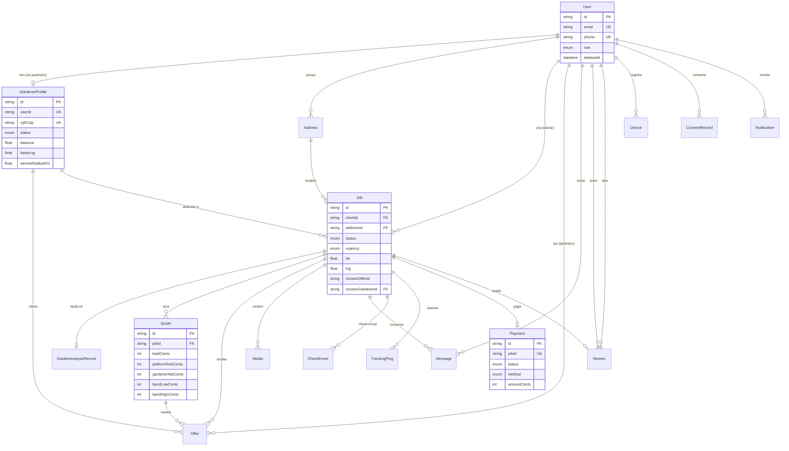
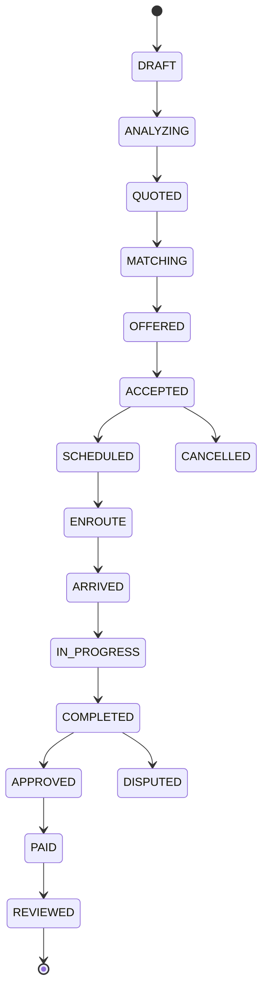

# 02 — Modelagem do Banco de Dados

> Modelo de dados do JardimJá. **PostgreSQL + PostGIS**, modelado com **Prisma 6**. Os enums espelham
> exatamente [`@jardimja/shared`](../packages/shared/src/enums.ts) para que banco, API e clientes
> compartilhem um único vocabulário. Fonte: [`apps/api/prisma/schema.prisma`](../apps/api/prisma/schema.prisma).

Relacionados: [Arquitetura](01-architecture.md) · [APIs](03-api.md) ·
[Pipeline de IA](04-ai-pipeline.md) · [Precificação](05-pricing-engine.md) ·
[Segurança & LGPD](06-security-lgpd.md) · [Especificação funcional](14-functional-spec.md)

---

## 1. Convenções globais

| Convenção | Detalhe |
| --- | --- |
| **IDs** | `String @id @default(cuid())` — identificadores opacos, ordenáveis, seguros para URL. |
| **Dinheiro** | **Sempre inteiro em centavos (BRL)**, sufixo `*Cents`. Nunca `float`/`decimal` para moeda. Ver [`quote.ts`](../packages/shared/src/quote.ts). |
| **Timestamps** | `createdAt @default(now())` e `updatedAt @updatedAt` na maioria das entidades. |
| **Soft-delete** | `User.deletedAt DateTime?` — base do "direito ao esquecimento" da LGPD. |
| **JSONB** | Payloads grandes/flexíveis (laudos de IA, line items, disponibilidade) em `Json`, validados na borda por schemas **Zod** do `shared`. |
| **Geo** | `lat`/`lng` como `Float` no Prisma; a coluna `GEOGRAPHY` + índice **GIST** para `ST_DWithin` é adicionada por **migração SQL** (`prisma/migrations/*_postgis`). |
| **Enums** | Declarados no Prisma e espelhando 1:1 o `shared`. |

O modelo relacional é gerado pelo Prisma; a camada geoespacial (colunas `GEOGRAPHY`, índices GIST,
funções `ST_DWithin`/`ST_Area`) é sobreposta via migração SQL, pois o Prisma não modela tipos PostGIS
nativamente.

---

## 2. Diagrama entidade-relacionamento



> As tabelas de **precificação** (`PricingConfig`, `CalibrationFactor`, `PricingOutcome`), a
> **base de conhecimento** (`PlantSpecies`, `Pest`) e a **auditoria** (`AuditLog`) são independentes
> do grafo transacional acima e aparecem detalhadas nas seções 5–7.

---

## 3. Vocabulário de enums

| Enum | Valores | Uso |
| --- | --- | --- |
| `UserRole` | CLIENT · GARDENER · ADMIN · SUPPORT | RBAC |
| `ServiceType` | CORTE_GRAMA · PODA · PAISAGISMO · LIMPEZA · RETIRADA_FOLHAS · ADUBACAO · PLANTIO · CONTROLE_PRAGAS · IRRIGACAO · JARDIM_COMPLETO · OUTRO | Catálogo de serviços |
| `JobStatus` | DRAFT · ANALYZING · QUOTED · MATCHING · OFFERED · ACCEPTED · SCHEDULED · ENROUTE · ARRIVED · IN_PROGRESS · COMPLETED · APPROVED · PAID · REVIEWED · CANCELLED · DISPUTED | Máquina de estados do job |
| `OfferStatus` | PENDING · ACCEPTED_BY_GARDENER · COUNTERED · DECLINED · CHOSEN · EXPIRED · WITHDRAWN | Ciclo da oferta |
| `PaymentStatus` | PENDING · AUTHORIZED · CAPTURED · SPLIT · REFUNDED · FAILED | Escrow + split |
| `PaymentMethod` | PIX · CREDIT_CARD · GOOGLE_PAY · APPLE_PAY | Métodos aceitos |
| `Equipment` | ROCADEIRA · CORTADOR_GRAMA · MOTOSSERRA · SOPRADOR · TRITURADOR · ESCADA · CAMINHAO · PULVERIZADOR · PODADOR_ALTURA | Equipamentos |
| `UrgencyLevel` | FLEXIBLE · NORMAL · URGENT · EMERGENCY | Surge por urgência |
| `MediaKind` | PHOTO · VIDEO · AUDIO · DOCUMENT | Tipos de mídia |
| `QuoteSource` | AI · GARDENER | Origem do orçamento |
| `CheckEventType` | CHECKIN · CHECKOUT | Presença no local |
| `MessageKind` | TEXT · PHOTO · VIDEO · AUDIO · LOCATION · DOCUMENT · SYSTEM | Chat |
| `GardenerStatus` | PENDING_VERIFICATION · ACTIVE · SUSPENDED · REJECTED | Verificação do jardineiro |

O `shared` traz ainda enums usados apenas no domínio de IA/preço (`DifficultyLevel`, `RiskLevel`,
`TerrainSlope`, `AccessDifficulty`, `AiProviderId`) que vivem dentro dos JSONB de análise e não têm
coluna dedicada.

---

## 4. Modelos — identidade e núcleo transacional

### 4.1 `User` — identidade e perfis

Raiz de identidade de todos os atores (cliente, jardineiro, admin, suporte).

| Campo | Tipo | Notas |
| --- | --- | --- |
| `id` | String (cuid) | PK |
| `email` | String **unique** | Login |
| `phone` | String? unique | Opcional |
| `passwordHash` | String? | argon2 (nulo quando usa provedor externo) |
| `role` | `UserRole` @default(CLIENT) | RBAC |
| `authProvider` / `authSubject` | String? | Vínculo Supabase/Firebase quando não há senha local |
| `emailVerified` | Boolean | Verificação |
| `twoFactorEnabled` | Boolean | 2FA |
| `deletedAt` | DateTime? | **Soft-delete (LGPD)** |

Relações: `gardenerProfile` (0..1), `addresses`, `jobsAsClient`, `offers` (como jardineiro),
`messages`, `reviewsAuthored`/`reviewsReceived`, `devices`, `consents`, `notifications`.
Índices: `@@index([role])`, `@@index([authProvider, authSubject])`.

### 4.2 `GardenerProfile` — perfil profissional

Estende um `User` com dados de prestador. Chave para o **matching geoespacial** e para os pisos de
preço do jardineiro.

| Campo | Tipo | Notas |
| --- | --- | --- |
| `userId` | String **unique** | 1:1 com `User` (onDelete: Cascade) |
| `cpfCnpj` | String **unique** | Documento fiscal |
| `documentsJson` | Json? | URLs de documentos + metadados de verificação |
| `status` | `GardenerStatus` | Fluxo de verificação |
| `city` / `state` | String / Char(2) | Localização base |
| `baseLat` / `baseLng` | Float | Ponto base para raio de atendimento |
| `serviceRadiusKm` | Float @default(15) | Raio atendido (usado no `ST_DWithin`) |
| `specialties` | `ServiceType[]` | Serviços que executa |
| `equipment` | `Equipment[]` | Equipamentos disponíveis |
| `crewSize` | Int @default(1) | Tamanho da equipe |
| `minPriceCents` | Int @default(8000) | Piso (R$ 80,00) |
| `hourlyRateCents` | Int @default(4500) | Hora (R$ 45,00) |
| `pricePerM2Cents` | Int? | Preço por m² opcional |
| `availabilityJson` | Json? | Grade dias/horas |
| `ratingAvg` / `ratingCount` / `jobsCompleted` | Float / Int / Int | Reputação (denormalizada) |

Índices: `@@index([city, state])`, `@@index([status])`.

### 4.3 `Address`

Endereços do usuário; um job referencia opcionalmente um endereço.

Campos principais: `label`, `street`, `number`, `complement`, `neighborhood`, `city`,
`state Char(2)`, `zipCode`, `country @default("BR")`, `lat`, `lng`. Índices: `@@index([userId])`,
`@@index([city, state])`.

### 4.4 `Job` — o coração do sistema

Uma solicitação de serviço, do rascunho à avaliação. Concentra a máquina de estados.

| Campo | Tipo | Notas |
| --- | --- | --- |
| `clientId` | String FK | Cliente dono |
| `addressId` | String? FK | Endereço (opcional) |
| `serviceTypes` | `ServiceType[]` | Serviços pedidos |
| `status` | `JobStatus` @default(DRAFT) | Estado atual |
| `urgency` | `UrgencyLevel` @default(NORMAL) | Urgência |
| `note` | String? | Observação livre do cliente |
| `lat` / `lng` / `city` / `state` | Float?/Char(2) | **Snapshot** de localização (denormalizado para a busca por raio) |
| `drawnAreaM2` | Float? | Área que o cliente desenhou no mapa (m²) — prior forte para a IA |
| `drawnPolygon` | Json? | Polígono desenhado |
| `chosenOfferId` | String? **unique** | Oferta escolhida |
| `chosenGardenerId` | String? FK | Jardineiro atribuído |
| `scheduledAt` / `startedAt` / `completedAt` | DateTime? | Marcos temporais |

Relações: `analysis` (0..1), `quotes`, `offers`, `media`, `messages`, `checkEvents`,
`trackingPings`, `payment` (0..1), `review` (0..1), `chosenGardener`.
Índices: `@@index([clientId])`, `@@index([status])`, **`@@index([city, state, status])`** (feed do
marketplace), `@@index([createdAt])`.

### 4.5 `Media`

Fotos/vídeo/áudio de um job (onDelete: Cascade). Campos: `kind` (`MediaKind`), `url`, `mimeType`,
`sizeBytes?`, `width?`, `height?`, `durationS?`. Índice: `@@index([jobId])`. As **4–30 fotos** são a
entrada do pipeline de IA.

### 4.6 `GardenAnalysisRecord` — laudo da IA (JSONB)

O relatório técnico consolidado que a IA de visão produz (1:1 com o job).

| Campo | Tipo | Conteúdo |
| --- | --- | --- |
| `jobId` | String **unique** | 1:1 |
| `featuresJson` | Json | `GardenFeatures` (área, altura, árvores, terreno…) |
| `workJson` | Json | `WorkEstimate` (serviços, equipamentos, horas, equipe, dificuldade) |
| `summary` | String | Resumo em pt-BR para o cliente |
| `confidence` | Float | Confiança global [0,1] |
| `fieldAgreement` | Json | Concordância entre provedores por campo |
| `providersJson` | Json | Proveniência (quem respondeu, latência, erro) |
| `warnings` | String[] | Alertas (poucas fotos, área ambígua…) |

Os JSONB seguem os schemas `GardenFeaturesSchema`/`WorkEstimateSchema`/`GardenAnalysisSchema` de
[`garden-analysis.ts`](../packages/shared/src/garden-analysis.ts), validados antes de persistir.

### 4.7 `Quote` — orçamento

Saída do [motor de precificação](05-pricing-engine.md). Um job pode ter várias quotes (IA + contra-ofertas).

| Campo | Tipo | Notas |
| --- | --- | --- |
| `source` | `QuoteSource` @default(AI) | `AI` ou `GARDENER` |
| `gardenerId` | String? | Preenchido quando um jardineiro contra-oferta |
| `currency` | String @default("BRL") | Moeda |
| `lineItemsJson` | Json | Itens (mão de obra, equipamentos, deslocamento, descarte) |
| `subtotalCents` / `platformFeeCents` / `totalCents` / `gardenerNetCents` | Int | **Centavos** |
| `confidence` | Float | Confiança do estimador |
| `bandLowCents` / `bandHighCents` | Int | Faixa de preço anunciada |
| `breakdownVersion` | String | Versão do algoritmo (ex.: `pricing-1.0.0`) para reprodutibilidade |

Índice: `@@index([jobId])`.

### 4.8 `Offer` — oferta no marketplace

Proposta de um jardineiro para um job publicado.

| Campo | Tipo | Notas |
| --- | --- | --- |
| `jobId` / `gardenerId` | String FK | **@@unique([jobId, gardenerId])** — 1 oferta por jardineiro/job |
| `gardenerUserId` | String FK | Denormalizado para checagens rápidas de auth |
| `quoteId` | String? FK | Quote associada (quando contra-oferta) |
| `status` | `OfferStatus` @default(PENDING) | Ciclo da oferta |
| `priceCents` | Int | Preço proposto |
| `message` | String? | Recado ao cliente |
| `expiresAt` | DateTime? | Expiração |

Índice: `@@index([gardenerId, status])`.

### 4.9 `CheckEvent` e `TrackingPing` — presença e rastreamento

- **`CheckEvent`**: check-in/check-out no local. `type` (`CheckEventType`), `photoUrl?`, `lat`,
  `lng`, `at`. Índice `@@index([jobId])`. Marca as transições ARRIVED (check-in) e COMPLETED (check-out).
- **`TrackingPing`**: posição do jardineiro a caminho. `gardenerId`, `lat`, `lng`, `headingDeg?`,
  `speedKmh?`, `etaSeconds?`, `at`. Índice `@@index([jobId, at])`. Alimenta o mapa em tempo real
  durante ENROUTE via [WebSocket](03-api.md#7-websocket--tempo-real).

### 4.10 `Payment` — escrow + split

Um pagamento por job (1:1).

| Campo | Tipo | Notas |
| --- | --- | --- |
| `jobId` | String **unique** | 1:1 |
| `provider` | String | `mercadopago` \| `stripe` |
| `method` | `PaymentMethod` | PIX/cartão/carteiras |
| `status` | `PaymentStatus` @default(PENDING) | PENDING → AUTHORIZED → CAPTURED → SPLIT |
| `amountCents` / `platformFeeCents` / `gardenerNetCents` | Int | Valor + split |
| `externalId` | String? | ID no provedor (dedupe de webhook / **idempotência**) |
| `pixQrCode` / `pixCopyPaste` | String? | Dados PIX |
| `rawJson` | Json? | Payload cru do provedor (auditoria) |
| `authorizedAt` / `capturedAt` | DateTime? | Marcos do escrow |

Índice: `@@index([status])`.

### 4.11 `Review` e `Message`

- **`Review`**: avaliação pós-serviço (1:1 com job). `authorId`, `targetId`, `rating` (1..5),
  `comment?`, `photosJson?`. Índice `@@index([targetId])`. Alimenta `ratingAvg`/`ratingCount` do perfil.
- **`Message`**: chat job-a-job. `senderId`, `kind` (`MessageKind`), `body?`, `mediaUrl?`,
  `lat?`/`lng?` (compartilhar localização), `readAt?`. Índice `@@index([jobId, createdAt])`.

---

## 5. Inteligência de precificação

Tabelas que sustentam o [motor de precificação](05-pricing-engine.md) e sua calibração contínua.

| Modelo | Papel | Campos-chave |
| --- | --- | --- |
| `PricingConfig` | Overrides de config por cidade/região | `city`, `state`, `overrides` (Json parcial), **@@unique([city, state])** |
| `CalibrationFactor` | Fator de calibração aprendido por cohort `(cidade, serviço)` | `cohortKey` **unique**, `factor` @default(1), `sampleSize` |
| `PricingOutcome` | Registro estimado × real que alimenta a calibração | `jobId` **unique**, `cohortKey`, `estimatedCents`, `actualCents`, `@@index([cohortKey])` |

**Como o "ML" funciona**: um job noturno compara, por cohort, `estimatedCents` (a estimativa) contra
`actualCents` (o preço que o job efetivamente fechou). A razão suavizada e limitada (`clamp` em
[0,75; 1,30]) vira o `factor` do cohort, aplicado multiplicativamente pela engine. Sem dados
suficientes (mín. 8 amostras), o fator é 1,0 (no-op). Ver
[`calibration.ts`](../packages/pricing-engine/src/calibration.ts).

---

## 6. Base de conhecimento

Populada via seed a partir de `@jardimja/knowledge-base` — enriquece o laudo da IA e as recomendações.

| Modelo | Conteúdo | Campos-chave |
| --- | --- | --- |
| `PlantSpecies` | Espécies vegetais | `scientificName` **unique**, `commonNames[]`, `category`, `careJson` (rega, sol, poda, crescimento), `pests[]`, `@@index([category])` |
| `Pest` | Pragas | `name` **unique**, `scientificName?`, `affects[]`, `symptomsJson`, `treatmentJson` |

---

## 7. Notificações, dispositivos e conformidade

| Modelo | Papel | Campos-chave |
| --- | --- | --- |
| `Device` | Tokens FCM por dispositivo | `fcmToken` **unique**, `platform` (ios/android/web), `@@index([userId])` |
| `Notification` | Inbox persistente | `title`, `body`, `dataJson?`, `readAt?`, `@@index([userId, readAt])` |
| `ConsentRecord` | Registro de consentimento LGPD | `purpose` (marketing/analytics/data_processing/location…), `granted`, `version`, `ip`, `@@index([userId, purpose])` |
| `AuditLog` | Trilha de auditoria | `actorId?`, `action`, `entityType`, `entityId?`, `metadata`, `ip`, índices por entidade/ator/data |

`ConsentRecord` e `AuditLog` são pilares da conformidade descrita em
[Segurança & LGPD](06-security-lgpd.md).

---

## 8. PostGIS — busca geoespacial por raio

A busca "jardineiros dentro do raio do job" é resolvida no banco. Sobre `Job.lat/lng` e
`GardenerProfile.baseLat/baseLng/serviceRadiusKm`, uma migração SQL adiciona colunas `GEOGRAPHY` e
índices GIST, permitindo consultas como:

```sql
-- Jardineiros ATIVOS cujo raio de atendimento cobre a localização do job.
SELECT gp.id, gp.user_id,
       ST_Distance(gp.base_geog, j.geog) / 1000.0 AS distance_km
FROM "GardenerProfile" gp
JOIN "Job" j ON j.id = $1
WHERE gp.status = 'ACTIVE'
  AND ST_DWithin(gp.base_geog, j.geog, gp.service_radius_km * 1000)  -- metros
ORDER BY gp.base_geog <-> j.geog   -- índice GIST (KNN)
LIMIT 50;
```

- `ST_DWithin(a, b, metros)` usa o índice GIST e mantém a busca eficiente conforme a base cresce.
- `ST_Area(geom)` valida server-side a área do polígono desenhado (`drawnPolygon`), reforçando o
  prior `drawnAreaM2` que vai à IA.
- Longitude-primeiro é a convenção PostGIS; o `shared` usa objeto `{lat, lng}` explícito
  ([`geo.ts`](../packages/shared/src/geo.ts)) para evitar bugs de ordenação de tupla, com
  `haversineKm` como fallback de cálculo no app.

---

## 9. Máquina de estados no banco

A coluna `Job.status` materializa a máquina de estados. As transições válidas (documentadas em
[especificação funcional](14-functional-spec.md#3-máquina-de-estados-do-job)) são aplicadas na
camada de aplicação — o banco garante o valor do enum, e a lógica de negócio garante que só ocorram
saltos permitidos, gravando cada transição em `AuditLog`.



---

## 10. Migrações e backup

**Migrações**

- Fonte da verdade: `apps/api/prisma/schema.prisma`. Migrações versionadas em `prisma/migrations/`.
- Dev: `pnpm db:migrate` → `prisma migrate dev` (gera + aplica). Prod/CI: `prisma migrate deploy`
  (aplica migrações pendentes de forma idempotente, sem prompts) no passo de deploy — ver
  [CI/CD](08-cicd.md) e [Deploy](07-deployment.md).
- A camada PostGIS entra como **migração SQL manual** (`*_postgis`) com `CREATE EXTENSION postgis`,
  colunas `GEOGRAPHY` e índices GIST.
- Seed idempotente: `pnpm db:seed` (`prisma/seed.ts` via `tsx`), incluindo a base de conhecimento.

**Backup / DR**

- Backups automáticos do Postgres (snapshots + WAL para **point-in-time recovery**), retenção
  alinhada à política de retenção de dados da [LGPD](06-security-lgpd.md).
- Réplica de leitura (`DATABASE_REPLICA_URL`) para BI e como base de recuperação regional.
- Mídia no S3/R2 com versionamento e replicação cross-region.
- Ver estratégia completa de DR em [Deploy](07-deployment.md#8-backup-e-disaster-recovery).

---

Anterior: [« 01 — Arquitetura](01-architecture.md) · Próximo: [03 — APIs »](03-api.md)
