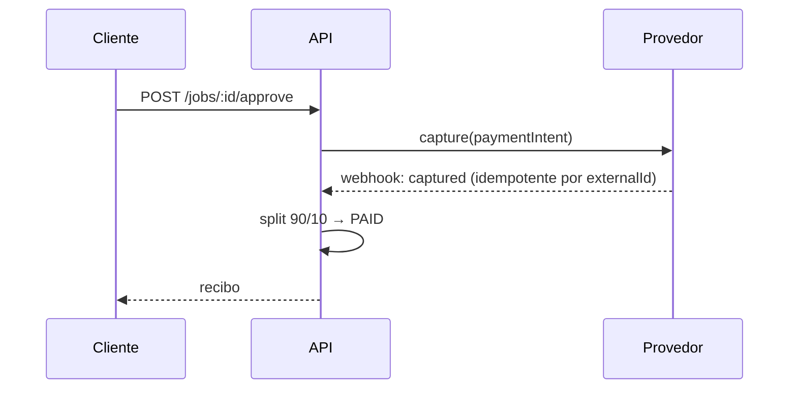

# 03 — APIs REST e GraphQL

> Superfície de API do JardimJá. **REST versionado (`/api/v1`) é primária** para o ciclo
> transacional; **GraphQL (`/graphql`)** serve read models do admin/BI. WebSocket cobre rastreamento
> e chat em tempo real. Backend: NestJS 10 + `@nestjs/swagger` (Swagger em `/docs`).

Relacionados: [Arquitetura](01-architecture.md) · [Banco de dados](02-database.md) ·
[Segurança & LGPD](06-security-lgpd.md) · [Especificação funcional](14-functional-spec.md)

---

## 1. Convenções gerais

| Aspecto | Padrão |
| --- | --- |
| Base URL | `https://api.jardimja.com.br/api/v1` (dev: `http://localhost:3333/api/v1`) |
| Formato | JSON UTF-8; **dinheiro sempre em centavos (BRL)** (`Int`) |
| Datas | ISO-8601 UTC (`2026-07-27T14:03:00Z`) |
| Auth | `Authorization: Bearer <access_token>` (JWT) |
| Versionamento | Prefixo de rota `/api/v1`; mudanças incompatíveis → `/api/v2` |
| Docs | OpenAPI/Swagger em `GET /docs` |
| Rate limit | `@nestjs/throttler` (ver §9) |
| Idempotência | Header `Idempotency-Key` em pagamentos (ver §6) |

### Envelope de erro

Todo erro segue o envelope `{ code, message, details? }`, onde `code` vem da taxonomia de
[`shared/errors.ts`](../packages/shared/src/errors.ts) e mapeia para um status HTTP:

```json
{
  "code": "AI_QUORUM_NOT_MET",
  "message": "Only 1/3 vision providers succeeded; quorum is 2.",
  "details": { "attempts": [{ "id": "openai", "ok": false, "error": "timeout" }] }
}
```

| `code` | HTTP | Quando |
| --- | --- | --- |
| `VALIDATION` | 400 | Payload inválido (class-validator/Zod) |
| `UNAUTHORIZED` | 401 | Sem token / token inválido |
| `FORBIDDEN` | 403 | Papel/propriedade insuficiente |
| `NOT_FOUND` | 404 | Recurso inexistente |
| `CONFLICT` | 409 | Conflito de estado (ex.: transição inválida) |
| `RATE_LIMITED` | 429 | Excedeu o throttler |
| `AI_QUORUM_NOT_MET` | 422 | Quorum de provedores de IA não atingido |
| `PAYMENT_FAILED` | 402 | Falha no provedor de pagamento |
| `INTERNAL` | 500 | Erro não tratado |

### Paginação

Listagens usam paginação por cursor:

```
GET /api/v1/marketplace/feed?limit=20&cursor=clx123
```
```json
{
  "data": [ /* itens */ ],
  "page": { "nextCursor": "clx987", "hasMore": true, "limit": 20 }
}
```

---

## 2. Autenticação e autorização

**JWT access + refresh** com rotação. O access token é curto (`JWT_ACCESS_TTL=900s`), o refresh é
longo (`JWT_REFRESH_TTL=2592000s`). Senhas são hasheadas com **argon2**. Opcionalmente, autenticação
federada via Supabase/Firebase (campos `authProvider`/`authSubject` no `User`). Papéis: `CLIENT`,
`GARDENER`, `ADMIN`, `SUPPORT`. Detalhes de segurança em [06-security-lgpd](06-security-lgpd.md).

| Método | Rota | Descrição |
| --- | --- | --- |
| POST | `/auth/register` | Cria conta (cliente ou jardineiro) |
| POST | `/auth/login` | Retorna access + refresh |
| POST | `/auth/refresh` | Rotaciona o par de tokens |
| POST | `/auth/logout` | Revoga o refresh atual |
| POST | `/auth/2fa/enable` · `/auth/2fa/verify` | Ativa/valida 2FA |
| GET | `/me` | Perfil do usuário autenticado |
| PATCH | `/me` | Atualiza perfil |
| DELETE | `/me` | Soft-delete (LGPD, ver §10) |

**POST `/auth/login`**
```json
// request
{ "email": "cliente@exemplo.com", "password": "••••••••" }
```
```json
// 200
{
  "accessToken": "eyJhbGciOi...",
  "refreshToken": "eyJhbGciOi...",
  "expiresIn": 900,
  "user": { "id": "clx_user1", "role": "CLIENT", "name": "Ana", "locale": "pt-BR" }
}
```

---

## 3. Jobs — ciclo de vida

A entidade central. Cada rota respeita as transições da
[máquina de estados](14-functional-spec.md#3-máquina-de-estados-do-job); uma transição inválida
retorna `409 CONFLICT`.

| Método | Rota | Papel | Transição |
| --- | --- | --- | --- |
| POST | `/jobs` | CLIENT | `[*] → DRAFT` |
| GET | `/jobs/:id` | CLIENT/GARDENER | — |
| GET | `/jobs?role=client&status=...` | CLIENT/GARDENER | — |
| PATCH | `/jobs/:id` | CLIENT | edita rascunho |
| POST | `/jobs/:id/analyze` | CLIENT | `DRAFT → ANALYZING → QUOTED` |
| POST | `/jobs/:id/publish` | CLIENT | `QUOTED → MATCHING` |
| POST | `/jobs/:id/cancel` | CLIENT | `→ CANCELLED` |
| POST | `/jobs/:id/checkin` | GARDENER | `ENROUTE → ARRIVED` |
| POST | `/jobs/:id/start` | GARDENER | `ARRIVED → IN_PROGRESS` |
| POST | `/jobs/:id/checkout` | GARDENER | `IN_PROGRESS → COMPLETED` |
| POST | `/jobs/:id/approve` | CLIENT | `COMPLETED → APPROVED → PAID` |
| POST | `/jobs/:id/dispute` | CLIENT | `COMPLETED → DISPUTED` |
| POST | `/jobs/:id/review` | CLIENT | `PAID → REVIEWED` |

**POST `/jobs`**
```json
// request
{
  "serviceTypes": ["CORTE_GRAMA", "RETIRADA_FOLHAS"],
  "urgency": "NORMAL",
  "note": "Quintal dos fundos, grama alta.",
  "address": { "city": "São Paulo", "state": "SP", "location": { "lat": -23.56, "lng": -46.64 } },
  "drawnAreaM2": 235,
  "drawnPolygon": { "points": [ { "lat": -23.560, "lng": -46.640 } ] }
}
```
```json
// 201
{ "id": "clx_job1", "status": "DRAFT", "serviceTypes": ["CORTE_GRAMA","RETIRADA_FOLHAS"], "createdAt": "2026-07-27T14:00:00Z" }
```

**POST `/jobs/:id/analyze`** — dispara a análise assíncrona (fila BullMQ). Retorna `202` com o job em
`ANALYZING`; o cliente recebe o resultado por polling em `GET /jobs/:id` ou via WebSocket quando
`QUOTED`. Detalhe do consenso em [pipeline de IA](04-ai-pipeline.md).
```json
// 202
{ "id": "clx_job1", "status": "ANALYZING" }
```

Quando `QUOTED`, `GET /jobs/:id` inclui análise + orçamento:
```json
{
  "id": "clx_job1",
  "status": "QUOTED",
  "analysis": {
    "summary": "Jardim de ~235 m² com grama alta.",
    "confidence": 0.86,
    "features": { "grassAreaM2": 188, "grassHeightCm": 32, "treeCount": 3, "greenWasteM3": 2 },
    "work": { "recommendedServices": ["CORTE_GRAMA","RETIRADA_FOLHAS"], "estimatedHours": 5, "estimatedCrewSize": 2, "difficulty": "HIGH" },
    "warnings": []
  },
  "quote": {
    "currency": "BRL",
    "lineItems": [
      { "key": "labor", "label": "Mão de obra", "amountCents": 56250, "explanation": "2 prof. × 5h" },
      { "key": "equipment", "label": "Equipamentos", "amountCents": 6000 },
      { "key": "travel", "label": "Deslocamento", "amountCents": 4640, "explanation": "8 km (ida e volta)" },
      { "key": "disposal", "label": "Descarte", "amountCents": 9000, "explanation": "2 m³ de resíduo verde" }
    ],
    "subtotalCents": 75890,
    "totalCents": 75890,
    "platformFeeCents": 7589,
    "gardenerNetCents": 68301,
    "confidence": 0.83,
    "bandLowCents": 66783,
    "bandHighCents": 84997,
    "breakdownVersion": "pricing-1.0.0"
  }
}
```

---

## 4. Mídia, marketplace e ofertas

### 4.1 Mídia

| Método | Rota | Descrição |
| --- | --- | --- |
| POST | `/jobs/:id/media` | Solicita URLs pré-assinadas de upload (4–30 fotos) |
| GET | `/jobs/:id/media` | Lista mídia do job |
| DELETE | `/media/:id` | Remove uma mídia (rascunho) |

**POST `/jobs/:id/media`**
```json
// request
{ "items": [ { "kind": "PHOTO", "mimeType": "image/jpeg", "sizeBytes": 2400000 } ] }
```
```json
// 201 — o app envia os bytes direto ao S3 via uploadUrl
{ "items": [ { "mediaId": "clx_m1", "uploadUrl": "https://s3.../put?...", "publicUrl": "https://cdn.../m1.jpg" } ] }
```

### 4.2 Marketplace e ofertas

| Método | Rota | Papel | Descrição |
| --- | --- | --- | --- |
| GET | `/marketplace/feed` | GARDENER | Jobs `MATCHING` no raio do jardineiro (`ST_DWithin`) |
| POST | `/jobs/:id/offers` | GARDENER | Cria oferta (aceite ou contra-oferta) |
| GET | `/jobs/:id/offers` | CLIENT | Lista ofertas recebidas |
| POST | `/offers/:id/counter` | GARDENER | Ajusta preço da própria oferta |
| POST | `/offers/:id/withdraw` | GARDENER | Retira a oferta |
| POST | `/offers/:id/choose` | CLIENT | Escolhe a oferta → `ACCEPTED` |

**GET `/marketplace/feed`** — a busca por raio é geoespacial (ver [PostGIS](02-database.md#8-postgis--busca-geoespacial-por-raio)).
```json
{
  "data": [
    {
      "jobId": "clx_job1", "distanceKm": 4.2, "serviceTypes": ["CORTE_GRAMA"],
      "urgency": "NORMAL", "city": "São Paulo",
      "quoteBand": { "lowCents": 66783, "highCents": 84997 }, "photosCount": 8
    }
  ],
  "page": { "nextCursor": null, "hasMore": false, "limit": 20 }
}
```

**POST `/jobs/:id/offers`**
```json
// request (contra-oferta)
{ "priceCents": 72000, "message": "Consigo amanhã de manhã." }
```
```json
// 201
{ "id": "clx_offer1", "jobId": "clx_job1", "status": "COUNTERED", "priceCents": 72000 }
```

---

## 5. Rastreamento, presença, chat e reviews

| Método | Rota | Papel | Descrição |
| --- | --- | --- | --- |
| POST | `/jobs/:id/tracking` | GARDENER | (fallback REST) grava ping de localização |
| GET | `/jobs/:id/tracking/latest` | CLIENT | Última posição/ETA |
| POST | `/jobs/:id/messages` | CLIENT/GARDENER | Envia mensagem de chat |
| GET | `/jobs/:id/messages` | CLIENT/GARDENER | Histórico paginado |
| POST | `/jobs/:id/review` | CLIENT | Avalia (1..5) |

O caminho preferencial de tracking/chat é **WebSocket** (§7); as rotas REST existem como fallback e
para histórico. **POST `/jobs/:id/messages`**:
```json
{ "kind": "TEXT", "body": "Estou chegando em 10 min." }
```

---

## 6. Pagamentos — intent, escrow, split e webhook

Escrow com split de marketplace: os fundos são **autorizados** na escolha da oferta e
**capturados/splitados** só na aprovação do cliente. Comissão da plataforma =
`PLATFORM_FEE_PERCENT` (**10%**). Provedores: Mercado Pago (PIX/cartão) ou Stripe.

| Método | Rota | Descrição |
| --- | --- | --- |
| POST | `/payments/intent` | Cria a intenção de pagamento (escrow) |
| GET | `/payments/:jobId` | Status do pagamento |
| POST | `/payments/webhook/:provider` | **Webhook** do provedor (idempotente) |

**POST `/payments/intent`** — requer header **`Idempotency-Key`** para evitar cobranças duplicadas em
retries de rede.
```json
// request  (Idempotency-Key: 7c1f...-a3)
{ "jobId": "clx_job1", "method": "PIX" }
```
```json
// 201
{
  "paymentId": "clx_pay1", "status": "AUTHORIZED",
  "amountCents": 75890, "platformFeeCents": 7589, "gardenerNetCents": 68301,
  "pix": { "qrCode": "00020126...", "copyPaste": "00020126..." }
}
```

**Webhook** — `POST /payments/webhook/:provider` valida a assinatura (`STRIPE_WEBHOOK_SECRET` /
`MERCADOPAGO_WEBHOOK_SECRET`) e é **idempotente** por `externalId`: eventos repetidos não alteram o
estado novamente. Fluxo de status: `PENDING → AUTHORIZED → CAPTURED → SPLIT` (ou `REFUNDED`/`FAILED`).



---

## 7. WebSocket — tempo real

Dois namespaces socket.io, autenticados por JWT no handshake. Entre instâncias, os eventos são
propagados por um adapter Redis (pub/sub).

| Namespace | Evento (in) | Evento (out) | Uso |
| --- | --- | --- | --- |
| `/tracking` | `join { jobId }`, `ping { lat, lng, headingDeg, speedKmh, etaSeconds }` | `location:update`, `status:changed` | Mapa ao vivo ENROUTE→ARRIVED |
| `/chat` | `join { jobId }`, `message { kind, body?, mediaUrl? }`, `typing` | `message:new`, `message:read`, `typing` | Chat cliente↔jardineiro |

Somente participantes do job (cliente, jardineiro escolhido) podem entrar na sala. Cada `ping`
persiste um `TrackingPing`; cada `message` persiste um `Message`.

---

## 8. Admin / BI

Rotas administrativas (papel `ADMIN`/`SUPPORT`). Operações de leitura complexas migram para GraphQL (§10).

| Método | Rota | Descrição |
| --- | --- | --- |
| GET | `/admin/stats` | KPIs (GMV, take rate, jobs por status, conversão) |
| GET | `/admin/jobs` | Busca/filtra jobs (moderação, disputas) |
| POST | `/admin/jobs/:id/resolve-dispute` | Resolve disputa |
| GET | `/admin/gardeners` | Fila de verificação de jardineiros |
| POST | `/admin/gardeners/:id/verify` | Aprova/reprova (`ACTIVE`/`REJECTED`) |
| GET | `/admin/pricing/config` · PATCH | Lê/edita `PricingConfig` por cidade |

---

## 9. Rate limiting

`@nestjs/throttler` aplica limites por IP + por usuário. Faixas de referência (429 `RATE_LIMITED`):

| Grupo | Limite |
| --- | --- |
| Auth (`/auth/*`) | 10 req / min |
| Analyze (`/jobs/:id/analyze`) | 5 req / min (passo caro de IA) |
| Feed/leitura | 120 req / min |
| Escrita geral | 60 req / min |
| Webhooks | isentos (validados por assinatura) |

---

## 10. GraphQL — read models de admin/BI

REST é primária; **GraphQL (`/graphql`, Apollo via `@nestjs/apollo`) atende consultas flexíveis do
admin/BI**, onde a forma da query varia muito (dashboards, relatórios ad-hoc). Exemplo de schema:

```graphql
scalar DateTime

enum JobStatus { DRAFT ANALYZING QUOTED MATCHING OFFERED ACCEPTED SCHEDULED ENROUTE ARRIVED IN_PROGRESS COMPLETED APPROVED PAID REVIEWED CANCELLED DISPUTED }

type GardenAnalysis {
  summary: String!
  confidence: Float!
  grassAreaM2: Float!
  estimatedHours: Float!
  difficulty: String!
  warnings: [String!]!
}

type Quote {
  totalCents: Int!
  platformFeeCents: Int!
  gardenerNetCents: Int!
  confidence: Float!
  bandLowCents: Int!
  bandHighCents: Int!
  breakdownVersion: String!
}

type Job {
  id: ID!
  status: JobStatus!
  city: String
  urgency: String!
  analysis: GardenAnalysis
  quote: Quote
  createdAt: DateTime!
}

type JobConnection { nodes: [Job!]!, nextCursor: String, hasMore: Boolean! }

type PlatformStats {
  gmvCents: Int!
  takeRateCents: Int!
  jobsByStatus: [StatusCount!]!
  avgQuoteConfidence: Float!
}
type StatusCount { status: JobStatus!, count: Int! }

type Query {
  jobs(status: JobStatus, city: String, limit: Int = 20, cursor: String): JobConnection!
  job(id: ID!): Job
  platformStats(from: DateTime!, to: DateTime!): PlatformStats!
}

type Mutation {
  verifyGardener(id: ID!, approve: Boolean!): Boolean!
  updatePricingConfig(city: String!, state: String!, overrides: JSON!): Boolean!
}
```

Consultas de BI usam a **read replica** (`DATABASE_REPLICA_URL`) para não impactar o primário
transacional (ver [Arquitetura §6](01-architecture.md#6-estratégia-de-escalabilidade)).

---

## 11. Direitos do titular (LGPD)

Endpoints de exercício de direitos, detalhados em [Segurança & LGPD](06-security-lgpd.md#3-direitos-do-titular):

| Método | Rota | Direito |
| --- | --- | --- |
| GET | `/me/export` | Portabilidade / acesso (dump dos dados) |
| DELETE | `/me` | Eliminação (soft-delete → anonimização) |
| GET/PUT | `/me/consents` | Gestão de consentimentos (`ConsentRecord`) |

---

Anterior: [« 02 — Banco de dados](02-database.md) · Próximo: [06 — Segurança & LGPD »](06-security-lgpd.md)
