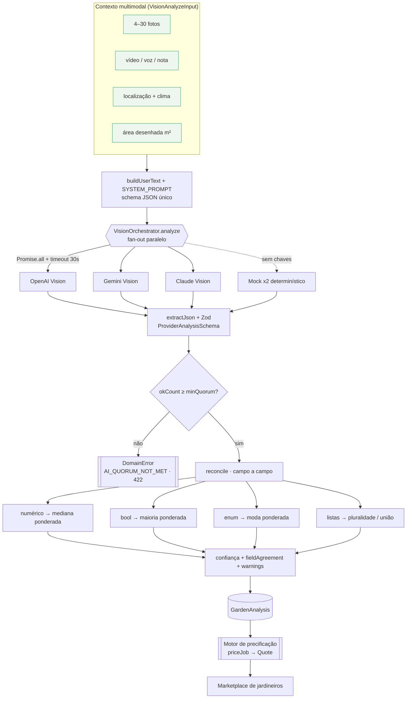

# 04 — Pipeline de IA multimodal

> O "cérebro visual" do JardimJá. Transforma um punhado de fotos (e vídeo, voz,
> nota, localização, clima e área desenhada) num **laudo técnico estruturado** —
> a `GardenAnalysis` — que alimenta o [motor de precificação](05-pricing-engine.md)
> e o relatório mostrado ao cliente. Implementado em
> [`packages/ai-vision`](../packages/ai-vision).

Este documento descreve **o que está implementado de verdade** no pacote, arquivo
por arquivo, e depois o que vem no roadmap ([13](13-roadmap.md)).

---

## 1. Por que consenso multimodal (e não um único modelo)

Um orçamento é um número que o cliente vai pagar e o jardineiro vai receber. Se
esse número sai de um único modelo, herdamos todos os vieses e alucinações dele:
um dia o GPT superestima a área em 40%, no outro o Gemini "vê" uma piscina que não
existe. Não há como auditar, não há faixa de erro, não há sinal de "esta foto está
ambígua".

A resposta do JardimJá é rodar **vários modelos de visão em paralelo sobre o mesmo
prompt e o mesmo schema**, e **reconciliar campo a campo**. O acordo entre modelos
independentes vira um sinal de confiança de primeira classe: quando OpenAI, Gemini
e Claude convergem na área de grama, temos uma estimativa forte; quando divergem, o
próprio produto sabe que precisa avisar o cliente e sugerir revisão humana.

Três propriedades de projeto guiam o pacote:

1. **Um modelo lento ou quebrado nunca trava o orçamento** — timeouts independentes
   por provider.
2. **Um outlier não define o preço sozinho** — quórum mínimo e mediana ponderada.
3. **Toda a proveniência é anexada** — quem respondeu, em quanto tempo, com que erro
   — para auditoria e para o `trace` do preço.

---

## 2. Entradas — o contexto multimodal

O contrato de entrada é `VisionAnalyzeInput` ([`types.ts`](../packages/ai-vision/src/types.ts)).
Nem tudo é obrigatório: quanto mais contexto, mais confiante o laudo.

| Entrada | Campo | Tipo | Papel na análise |
| --- | --- | --- | --- |
| **Fotos (4–30)** | `images` | `MediaRef[]` | Sinal primário. Referenciadas por URL assinada (preferível) ou base64 inline. |
| **Vídeo walkthrough** | `video` | `MediaRef?` | Percurso do jardim. Providers que não aceitam vídeo simplesmente ignoram. |
| **Transcrição de voz** | `audioTranscript` | `string?` | "É pra amanhã, tá alto demais" — captura urgência e detalhes que a foto não mostra. |
| **Nota do cliente** | `clientNote` | `string?` | Texto livre ("quero deixar meu jardim bonito"). Alimenta a IA conversacional (§9). |
| **Localização** | `location` | `{city,state,lat,lng}?` | Contexto local e, adiante, entra na precificação (índice da cidade). |
| **Clima** | `weather` | `string?` | Chuva afeta altura da grama e acesso — o prompt usa isso como pista. |
| **Área desenhada** | `drawnAreaM2` | `number?` | Área que o cliente marcou no mapa. **Prior forte** para `grassAreaM2`. |

O texto do turno de usuário é montado por `buildUserText()`
([`prompt.ts`](../packages/ai-vision/src/prompt.ts)): ele injeta contagem de fotos,
cidade/estado, clima, área desenhada ("use como forte referência"), nota e
transcrição — e sempre encerra pedindo o JSON no formato exato.

As imagens entram no formato nativo de cada provider:
- **OpenAI** — content part `image_url` com `detail: 'low'` (barato, suficiente para estimar área/altura).
- **Anthropic** — bloco `image` com `source` `url` ou `base64`.
- **Gemini** — `inline_data` (base64); URLs remotas precisam ser inlinadas antes pela camada de storage da API.

---

## 3. O prompt e o schema únicos — o que torna o consenso significativo

Todos os providers recebem **exatamente o mesmo** `SYSTEM_PROMPT`
([`prompt.ts`](../packages/ai-vision/src/prompt.ts)): um agrônomo/paisagista sênior
brasileiro que deve responder **somente com JSON**, estimar de forma conservadora,
usar unidades fixas (m², m³, cm), a escala de folhas 0–5, e **atribuir uma confiança
`[0,1]` por campo** em `fieldConfidence`.

O prompt embute o **formato EXATO** do JSON, com os enums literais permitidos
(`terrainSlope`, `accessDifficulty`, `recommendedServices`, `requiredEquipment`,
`difficulty`, `risk`). Forçar a mesma forma é o que faz o acordo entre modelos ser
mensurável: só dá para tirar a mediana de `grassAreaM2` se todos preencherem
`grassAreaM2`.

A saída de cada modelo passa por `extractJson()` (tolerante a cercas ```` ```json ````
e a texto ao redor — pega o primeiro objeto `{...}` balanceado) e é **validada contra
o schema Zod** `ProviderAnalysisSchema`
([`shared/garden-analysis.ts`](../packages/shared/src/garden-analysis.ts)) antes de
entrar no consenso. Um provider que devolve algo fora do contrato é tratado como
falha — não contamina a reconciliação.

> **Contrato compartilhado.** `ProviderAnalysis` (uma resposta) e `GardenAnalysis`
> (o consenso) vivem em `@jardimja/shared`, então API, engine de preço e apps móveis
> falam o mesmo tipo. Ver [`02-database.md`](02-database.md) e [`03-api.md`](03-api.md).

### Reforços do prompt para reduzir temperatura de saída
- `temperature: 0.2` em todos os providers (respostas estáveis, comparáveis).
- OpenAI: `response_format: { type: 'json_object' }`.
- Gemini: `responseMimeType: 'application/json'`.
- Anthropic: `max_tokens: 1500` + system prompt dedicado.

---

## 4. Abstração de provider

Todo provider implementa uma interface mínima ([`types.ts`](../packages/ai-vision/src/types.ts)):

```ts
interface VisionProvider {
  readonly id: AiProviderId;               // 'openai' | 'gemini' | 'anthropic' | 'mock'
  analyze(input: VisionAnalyzeInput): Promise<ProviderAnalysis>;
}
```

Quatro implementações estão prontas:

| Provider | Arquivo | API | Notas |
| --- | --- | --- | --- |
| **OpenAI Vision** | [`providers/openai.ts`](../packages/ai-vision/src/providers/openai.ts) | Chat Completions | `image_url` detail low; `json_object`. Sem SDK — um `fetch` (cold-start mínimo). |
| **Gemini Vision** | [`providers/gemini.ts`](../packages/ai-vision/src/providers/gemini.ts) | `generateContent` | `inline_data` base64; `responseMimeType` JSON. |
| **Claude Vision** | [`providers/anthropic.ts`](../packages/ai-vision/src/providers/anthropic.ts) | Messages API | blocos `image` url/base64; `anthropic-version` header. |
| **Mock determinístico** | [`providers/mock.ts`](../packages/ai-vision/src/providers/mock.ts) | — (offline) | Deriva números plausíveis da área desenhada / nº de fotos. **Nunca aleatório.** |

Todos compartilham `postJson()` ([`providers/http.ts`](../packages/ai-vision/src/providers/http.ts)),
um wrapper de `fetch` **injetável** (`fetchImpl`) — é o que permite testar os
providers sem rede. Erros HTTP viram `Error` com host e trecho do corpo.

### O mock não é enfeite — é infraestrutura
O `MockVisionProvider` é **determinístico**: `area = drawnAreaM2 ?? 120 + fotos×15 + seedNudge`,
`grassArea = area×0.8`, `tall = area > 150`, e daí deriva horas, equipe, equipamentos e
resíduo. Com isso:
- o fluxo inteiro de orçamento roda **sem nenhuma chave de IA** (dev, CI, demos, offline);
- o `factory` sobe **dois** mocks levemente diferentes (`seedNudge` 0 e 20) para que a
  **lógica de quórum e consenso seja exercitada de verdade** mesmo sem provedores reais.

---

## 5. O orquestrador fan-out

[`orchestrator.ts`](../packages/ai-vision/src/orchestrator.ts) — `VisionOrchestrator`.

```ts
const attempts = await Promise.all(
  providers.map((p) => this.runOne(p, input)),   // fan-out paralelo
);
const okCount = attempts.filter((a) => a.ok).length;
if (okCount < this.opts.minQuorum) {
  throw new DomainError(ErrorCode.AI_QUORUM_NOT_MET, ...);   // 422
}
return reconcile(attempts, { weights, imagesCount });
```

Mecânica implementada:

- **Chamadas em paralelo** (`Promise.all`) — a latência total é a do provider mais
  lento, não a soma.
- **Timeout por provider** (`withTimeout`, default **30 s**, `timeoutMs`). Cada
  chamada corre contra seu próprio `setTimeout`; estourar rejeita **só aquele**
  provider e libera o timer. Um modelo travado não segura os outros.
- **Sucesso ou falha capturados como `ProviderAttempt`** — `{ id, ok, result?, error?, latencyMs }`.
  A latência é medida com `performance.now()`. Falhas viram `ok:false` com a mensagem,
  não exceções que abortam o lote.
- **Quórum** (`minQuorum`, default **2**). Se menos que o quórum tiver sucesso, lança
  `DomainError(AI_QUORUM_NOT_MET)` (HTTP **422**, ver [`errors.ts`](../packages/shared/src/errors.ts)),
  com o detalhe de cada tentativa. Regra: **um único modelo nunca fixa o preço sozinho**.
- **Configuração via `factory`** ([`factory.ts`](../packages/ai-vision/src/factory.ts)):
  lê `providers` (lista separada por vírgula), pula qualquer provider sem chave, cai
  para dois mocks se nada estiver configurado, e faz `minQuorum = min(desejado, nº de providers)`
  para nunca pedir quórum impossível.

### Pesos de confiança (weights)
`DEFAULT_ORCHESTRATOR_OPTIONS.weights = { openai: 1, gemini: 1, anthropic: 1, mock: 0.5 }`.
Modelos reais têm peso 1; o mock entra com peso 0,5 — se por acaso um real e um mock
responderem, o real domina a mediana ponderada. Os pesos são o gancho para, no futuro,
subir a confiança de um provider que se prove mais acurado por cohort (ver
[calibração de preço](05-pricing-engine.md#6-o-gancho-de-aprendizado-cont%C3%ADnuo-calibra%C3%A7%C3%A3o)).

---

## 6. O algoritmo de consenso — campo a campo

[`consensus.ts`](../packages/ai-vision/src/consensus.ts) — `reconcile()`. Cada tipo de
campo é reconciliado com a estratégia que faz sentido para ele. Todas as operações
são **ponderadas pelo peso do provider**.

| Tipo de campo | Estratégia | Métrica de acordo | Campos |
| --- | --- | --- | --- |
| **Numérico** | **mediana ponderada** (`weightedMedian`) — resistente a um outlier selvagem | `1 − CV` (coef. de variação), em `[0,1]` | `grassAreaM2`, `totalAreaM2`, `grassHeightCm`, `treeCount`, `shrubCount`, `leafLitterLevel`, `greenWasteM3`, `estimatedHours`, `estimatedCrewSize` |
| **Booleano** | **maioria ponderada** (`weightedMajorityBool`) | fração do peso vencedor | `hasTallWeeds`, `hasRocks`, `hasPool`, `hasSidewalks`, `hasWalls`, `needsSpecialEquipment` |
| **Enum** | **moda ponderada** (`weightedMode`) | fração de peso da moda | `terrainSlope`, `accessDifficulty`, `difficulty`, `risk` |
| **Lista (decisão)** | **pluralidade ponderada** (`majorityList`, corte 0,4) | — (elementos ≥ 40% do peso entram) | `recommendedServices`, `requiredEquipment` |
| **Lista (informativa)** | **união** (`unionList`) | — | `vegetationTypes` |

Detalhes que importam:

- **`weightedMedian`** ordena por valor, acumula peso e devolve o valor onde o peso
  acumulado cruza metade do total — a mediana ponderada verdadeira, não a média.
  Um modelo que dispara "800 m²" contra dois em "190 m²" **não move** o resultado.
  Numéricos inteiros (`treeCount`, `crewSize`, `leafLitterLevel`) são arredondados;
  o resto vai a 1 casa. `estimatedCrewSize` tem piso `max(1, …)`.
- **`numericAgreement`** = `1 − (desvio-padrão / |média|)`, recortado em `[0,1]`.
  Tudo igual → 1. Grande dispersão → perto de 0. É esse número que vira o
  `fieldAgreement` de cada campo numérico.
- **`weightedMode`** para enums: soma peso por categoria e devolve a de maior peso,
  com `agree = pesoDaModa / pesoTotal`.
- **`majorityList`** para serviços/equipamentos: um elemento entra na lista final se
  os providers que o citam somam **≥ 40% do peso total**, e a lista sai ordenada por
  suporte. Isso remove o serviço que só um modelo "chutou".
- **`unionList`** para `vegetationTypes`: é informativo (aparece no laudo, não fixa o
  preço), então preservamos tudo que qualquer modelo viu.

### Peso 5× dos price-drivers na confiança
Três campos **dirigem o preço**: `grassAreaM2`, `estimatedHours`, `estimatedCrewSize`
(`HIGH_IMPACT_FIELDS`). Na confiança geral eles pesam **5×**; qualquer outro campo, 1×.
Racional: se a área e as horas divergem, o **orçamento** é não-confiável mesmo que uma
dúzia de flags menores por acaso batam.

### Confiança geral, `fieldAgreement` e `warnings`
`overallConfidence()` combina três termos:

```
confidence = 0.55 · meanAgreement(ponderado 5× nos price-drivers)
           + 0.30 · selfConf(média das fieldConfidence dos providers, ponderada)
           + 0.15 · coverage
coverage   = min( min(1, okCount/3), min(1, imagesCount/8) )
```

Ou seja: **acordo entre modelos** domina (55%), reforçado pela **autoconfiança** que
cada modelo reportou (30%) e por **cobertura** (15%) — quantos modelos responderam
(satura em 3) e quantas fotos tínhamos (satura em 8). Poucos modelos ou poucas fotos
puxam a confiança para baixo, mesmo com acordo alto.

`fieldAgreement` é devolvido inteiro (um número por campo) para a UI destacar o que
ficou ambíguo. `buildWarnings()` gera avisos em pt-BR:
- `< 4 fotos` → "Poucas fotos enviadas…";
- acordo médio `< 0,6` → "Os modelos divergiram bastante — recomenda-se revisão do jardineiro.";
- `grassAreaM2` com acordo `< 0,7` → "A área de grama ficou ambígua nas fotos.";
- providers que falharam → "Provedores que falharam: …".

O `summary` textual final vem do provider cujo `grassAreaM2` está **mais próximo da
mediana** (`pickSummary`) — o laudo em prosa acompanha o número central, não um outlier.

Por fim, `reconcile()` **valida o próprio output** contra `GardenAnalysisSchema` antes
de devolver — o consenso também respeita o contrato.

---

## 7. Fluxo completo — do fan-out ao orçamento



---

## 8. Exemplo de saída — `GardenAnalysis`

Consenso de OpenAI + Gemini + Claude sobre um quintal de ~235 m² com grama alta em
São Paulo (o mesmo caso do worked example de [preço](05-pricing-engine.md#5-exemplo-trabalhado-235-m²-grama-alta--r545)):

```jsonc
{
  "features": {
    "grassAreaM2": 188,
    "totalAreaM2": 235,
    "grassHeightCm": 31,
    "vegetationTypes": ["grama esmeralda", "arbustos ornamentais", "roseiras"],
    "treeCount": 3,
    "shrubCount": 8,
    "leafLitterLevel": 2,
    "hasTallWeeds": true,
    "hasRocks": false,
    "hasPool": false,
    "hasSidewalks": true,
    "hasWalls": true,
    "terrainSlope": "GENTLE",
    "accessDifficulty": "EASY",
    "greenWasteM3": 1.0
  },
  "work": {
    "recommendedServices": ["CORTE_GRAMA", "RETIRADA_FOLHAS"],
    "requiredEquipment": ["ROCADEIRA", "SOPRADOR"],
    "needsSpecialEquipment": false,
    "estimatedHours": 3,
    "estimatedCrewSize": 2,
    "difficulty": "HIGH",
    "risk": "LOW"
  },
  "summary": "Jardim de ~235 m² (~188 m² de grama esmeralda) com grama alta (~31 cm), exigindo roçadeira. Retirada moderada de folhas. Acesso fácil, terreno levemente inclinado.",
  "confidence": 0.82,
  "fieldAgreement": {
    "grassAreaM2": 0.94, "totalAreaM2": 0.91, "grassHeightCm": 0.74,
    "treeCount": 0.8, "shrubCount": 0.66, "leafLitterLevel": 1,
    "hasTallWeeds": 1, "hasPool": 1, "terrainSlope": 0.66,
    "estimatedHours": 0.88, "estimatedCrewSize": 1, "difficulty": 0.66
  },
  "providers": [
    { "id": "openai",    "ok": true,  "latencyMs": 4120 },
    { "id": "gemini",    "ok": true,  "latencyMs": 2890 },
    { "id": "anthropic", "ok": true,  "latencyMs": 5010 }
  ],
  "warnings": []
}
```

---

## 9. Exemplo de divergência sendo reconciliada

Três modelos, mesma foto, respostas cruas para `grassAreaM2` (pesos iguais = 1):

| Provider | `grassAreaM2` | `estimatedHours` | `terrainSlope` | `hasPool` |
| --- | --- | --- | --- | --- |
| OpenAI | 185 | 3.0 | GENTLE | false |
| Gemini | 191 | 3.5 | MODERATE | false |
| Claude | **320** ⚠️ | 2.5 | GENTLE | **true** ⚠️ |

Reconciliação:
- **`grassAreaM2`** → mediana ponderada de {185, 191, 320} = **191** (não a média 232).
  O "320" do Claude é ignorado como outlier. `agreement = 1 − CV ≈ 0,59` → dispara o
  aviso "área de grama ambígua" e puxa a confiança para baixo (peso 5×).
- **`estimatedHours`** → mediana de {3.0, 3.5, 2.5} = **3.0**, acordo alto (~0,88).
- **`terrainSlope`** → moda ponderada: GENTLE (peso 2) vs MODERATE (peso 1) → **GENTLE**,
  `agree = 0,66`.
- **`hasPool`** → maioria: false (peso 2) vs true (peso 1) → **false**, `agree = 0,66`.
  A "piscina" que só o Claude viu não entra no laudo nem no preço.

Resultado: nenhum outlier isolado moveu a estimativa, e o desacordo virou **sinal
visível** (confiança menor + warning), não erro silencioso.

---

## 10. IA conversacional — da intenção ao serviço

O campo `clientNote` (e a `audioTranscript`) carregam **intenção**, não medida.
Frases como *"quero deixar meu jardim bonito"*, *"tá tudo mato, preciso limpar"* ou
*"o mato tá alto e é pra amanhã"* são injetadas no prompt por `buildUserText()` e
influenciam diretamente `recommendedServices`, `difficulty` e `risk` no laudo.

Na camada de produto isso vira um **assistente conversacional** que traduz desejo em
catálogo de serviços (`ServiceType` em [`enums.ts`](../packages/shared/src/enums.ts)):

| O cliente diz… | A IA infere / sugere |
| --- | --- |
| "quero deixar meu jardim bonito" | `PAISAGISMO` + `PODA` + `ADUBACAO` (pacote estético) |
| "tá tudo mato" | `CORTE_GRAMA` + `LIMPEZA` + `RETIRADA_FOLHAS` |
| "as folhas não param de cair" | `RETIRADA_FOLHAS` recorrente (gancho de assinatura, ver [10](10-monetization.md)) |
| "tem uma árvore encostando no fio" | `PODA` + `risk: HIGH` + `PODADOR_ALTURA`/`MOTOSSERRA` |
| "quero um jardim novo do zero" | `JARDIM_COMPLETO` + `PLANTIO` + `IRRIGACAO` |

O cliente pode aceitar as sugestões ou ajustar — `PricingInput.services` permite que a
seleção do cliente **difira** da recomendação da IA, e o preço é recalculado sobre a
seleção final. O laudo em `summary` é a base da resposta em linguagem natural.

---

## 11. Custo e latência

| Dimensão | Comportamento implementado |
| --- | --- |
| **Latência** | ≈ latência do provider **mais lento** (fan-out paralelo), teto de 30 s por timeout. Tipicamente 3–6 s com 3 providers. |
| **Custo por análise** | Dominado por tokens de imagem. OpenAI usa `detail:'low'` de propósito (estimar área não precisa de alta resolução). Ordem de grandeza: **centavos a ~R$0,20–0,50 por análise** com 3 modelos — ver premissa de custo de inferência no [plano financeiro](11-financial-plan.md#3-cogs). |
| **Resiliência** | Quórum 2 de 3 → tolera a queda de **1** provider sem degradar. Custo controlável reduzindo `providers` para 2. |
| **Dev/CI** | Mock = **custo zero**, latência ~0, resultado determinístico. |

Alavancas de custo/qualidade: (1) nº de providers; (2) resolução das imagens; (3)
`minQuorum`; (4) `weights` (dar mais peso ao provider mais barato/acurado por cohort).

---

## 12. Como adicionar um provider

O ponto de extensão é a interface `VisionProvider` — nada mais precisa mudar no
orquestrador nem no consenso.

1. **Implemente** `providers/<novo>.ts` com `id` (adicione a chave em `AiProviderId`,
   [`enums.ts`](../packages/shared/src/enums.ts)) e `analyze(input)`, reusando
   `SYSTEM_PROMPT`, `buildUserText`, `extractJson`, `postJson` e validando com
   `ProviderAnalysisSchema`.
2. **Registre** no [`factory.ts`](../packages/ai-vision/src/factory.ts): checar chave,
   `new NovoProvider(...)`, incluir na lista `providers`.
3. **Peso** em `DEFAULT_ORCHESTRATOR_OPTIONS.weights` (comece em 1, ajuste por acurácia).
4. **Exporte** em [`index.ts`](../packages/ai-vision/src/index.ts) e adicione um teste
   com `fetchImpl` injetado (sem rede).

O quórum e a reconciliação passam a considerar o novo provider automaticamente.

---

## 13. Roadmap da IA (futuro)

Detalhado em [`13-roadmap.md`](13-roadmap.md); resumo do que o pipeline foi desenhado
para receber:

- **Detecção de pragas e doenças de plantas** — classificador especializado sobre as
  mesmas fotos (folha manchada, fungo, cochonilha), populando `CONTROLE_PRAGAS` e a
  `knowledge-base` de espécies/pragas.
- **Paisagismo 3D generativo** — "antes/depois" do jardim renderizado a partir das
  fotos + intenção do cliente, virando proposta de `PAISAGISMO`/`JARDIM_COMPLETO`.
- **Drone / satélite** — para lotes grandes e áreas rurais, área e cobertura vegetal a
  partir de imagem aérea/orbital, alimentando `drawnAreaM2` e `grassAreaM2` com precisão
  métrica.
- **Vídeo nativo** e **áudio nativo** — providers que consomem o walkthrough e a voz
  diretamente, não só a transcrição.
- **Weights adaptativos por cohort** — reponderar providers pela acurácia histórica,
  espelhando a [calibração do motor de preço](05-pricing-engine.md).

---

### Referências cruzadas
- [`05-pricing-engine.md`](05-pricing-engine.md) — consome a `GardenAnalysis`.
- [`03-api.md`](03-api.md) — endpoints de análise e `AiService`.
- [`06-security-lgpd.md`](06-security-lgpd.md) — tratamento das fotos (dado pessoal).
- [`13-roadmap.md`](13-roadmap.md) — evolução da IA.
</content>
</invoke>
