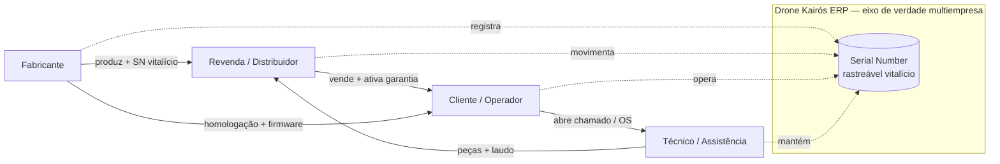
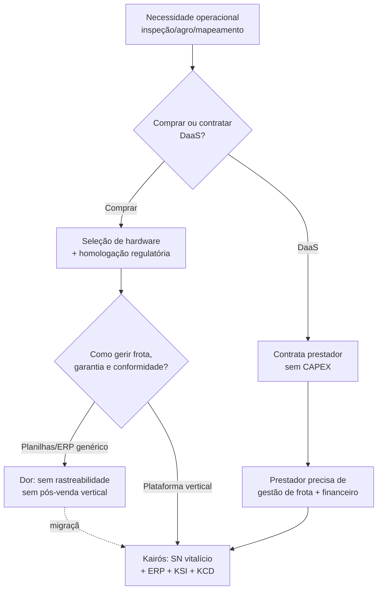
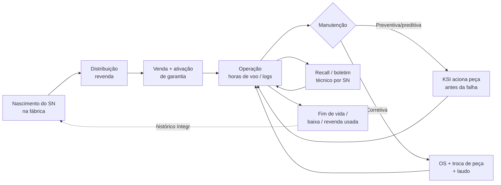

# 04 — Pesquisa Mundial · Drone Kairós ERP

| Campo | Valor |
|---|---|
| **Documento** | 04 — Pesquisa Mundial |
| **Versão** | 1.0 |
| **Data** | 21 de julho de 2026 |
| **Status** | Ativo |
| **Dependências** | 00, 01, 02, 03 |
| **Responsável** | Analista de Mercado |
| **Fonte de verdade** | Project Bible (Doc. 02) |

---

## 1. Resumo Executivo

O mercado global de drones comerciais/enterprise deixou de ser um mercado de *hardware* para se tornar um mercado de **operações de dados e serviços recorrentes**. O valor econômico migrou do ato de voar para o que se faz com o voo: aquisição de dados georreferenciados, inspeção assistida, entrega logística e, cada vez mais, a **gestão do ciclo de vida do ativo** — do fabricante ao cliente final, passando por revenda e assistência técnica.

Nessa cadeia existe uma lacuna estrutural: **não há um sistema de gestão vertical** que trate o drone como um ativo rastreável por toda a sua vida útil (Serial Number vitalício), conectando fabricante, revenda, técnico e cliente sob um mesmo eixo de verdade. Os ERPs horizontais tradicionais ignoram particularidades regulatórias e de segurança do setor; as plataformas de software de drones (fleet management, flight ops, mapeamento) resolvem o voo e o dado operacional, mas **não resolvem pós-venda, peças, garantia, conformidade multiempresa e financeiro**.

O **Drone Kairós ERP** endereça exatamente essa lacuna: um ERP vertical, multiempresa de 1ª classe, com rastreabilidade vitalícia por SN, inteligência offline-first (KCI), cibersegurança Zero Trust (KCD) e estoque inteligente (KSI). Este documento estabelece o panorama mundial que justifica e delimita a oportunidade — segmentos, tendências, regulação, dores e players — e traduz esse panorama em requisitos e oportunidades específicas para o produto.

**Direção de mercado (qualitativa):** crescimento sustentado de dois dígitos ao ano na próxima meia-década para o segmento comercial/enterprise, com aceleração puxada por BVLOS, autonomia e modelos *drone-as-a-service (DaaS)*. O gargalo não é mais técnico nem regulatório apenas — é **operacional e de gestão**. É aí que o Kairós compete.

---

## 2. Objetivos

**Objetivo geral:** fornecer a base factual e analítica de mercado que sustenta as decisões de escopo, priorização e posicionamento do Drone Kairós ERP.

**Objetivos específicos:**

1. Mapear os **segmentos verticais** do mercado de drones enterprise e sua maturidade relativa.
2. Consolidar as **tendências estruturais** (BVLOS, autonomia, U-space/UTM, DaaS, manutenção preditiva) e seu impacto sobre software de gestão.
3. Sistematizar o **quadro regulatório-chave** nas três jurisdições prioritárias (ANAC/Brasil, FAA/EUA, EASA/Europa) e o que ele exige de um ERP do setor.
4. Diagnosticar as **dores do setor** (pós-venda, rastreabilidade, gestão de peças, conformidade) que representam demanda não atendida.
5. Caracterizar o **cenário competitivo** (fabricantes e plataformas de software) e o espaço em branco.
6. Traduzir tudo em **oportunidades acionáveis** para os módulos e aplicações do Kairós, sem inventar números com precisão falsa.

**Fora de objetivo:** projeções financeiras quantitativas do produto (ver Doc. Financeiro), especificação técnica de módulos (ver Project Bible e docs de arquitetura), e plano go-to-market detalhado (ver docs comerciais).

---

## 3. Escopo

### 3.1 Dentro do escopo

- Drones **comerciais e enterprise** (asa fixa, multirrotor, VTOL híbrido) usados em operações profissionais.
- **Software de gestão** para o ecossistema: fleet/asset management, flight ops, mapeamento/fotogrametria, manutenção, e sistemas de gestão empresarial (ERP/CRM/BI).
- Cadeia de valor completa: **fabricante → revenda → técnico → cliente**.
- Jurisdições prioritárias: **Brasil, EUA e União Europeia**, com leitura tangencial de tendências globais.

### 3.2 Fora do escopo

- Drones de **consumo/hobby** puro (relevantes apenas como referência de tecnologia e regulação).
- **Defesa pura/militar classificada** (tratada apenas como vertical de segurança dual-use, sem detalhamento de programas militares).
- Especificação de contramedidas anti-drone (C-UAS) além de menção como tendência adjacente.

### 3.3 Horizonte temporal

Análise válida para o horizonte de **12–36 meses** a partir da data-base, com revisão recomendada a cada dois ciclos de release do produto ou quando houver mudança regulatória material (ver Seção 15).

---

## 4. Regras

Regras que governam a produção e o uso deste documento:

1. **Canon primeiro.** Nada aqui pode contradizer a Project Bible (Doc. 02) nem a Constituição do Projeto (Doc. 01). Em conflito, o canon prevalece.
2. **Conservadorismo numérico.** Nenhuma estatística é apresentada com falsa precisão. Usam-se **faixas, ordens de grandeza e direção** (crescente/estável/decrescente). Onde o dado é incerto, isso é declarado.
3. **Neutralidade de fornecedor de IA.** Não se citam modelos de IA por nome comercial. O KCI é descrito por capacidade (offline-first, IA externa opcional), não por marca.
4. **Rastreabilidade de afirmação.** Toda afirmação de mercado é classificada como *fato consolidado*, *tendência observada* ou *hipótese analítica*.
5. **Separação análise × produto.** Este documento analisa o mercado; decisões de produto derivadas são marcadas explicitamente como "→ Implicação para o Kairós".
6. **Multiempresa e segurança como lentes.** Toda oportunidade é lida também sob as lentes de *multiempresa de 1ª classe* e *segurança por padrão*, princípios inegociáveis do projeto.
7. **Idioma e formato.** Português (BR), Markdown limpo, tabelas e diagramas quando agregam clareza.

---

## 5. Arquitetura da Análise (Metodologia)

A pesquisa segue uma arquitetura em cinco camadas, do macro ao acionável:

```
┌───────────────────────────────────────────────────────────────┐
│ CAMADA 5 — SÍNTESE E OPORTUNIDADE (→ Implicações p/ o Kairós)  │
├───────────────────────────────────────────────────────────────┤
│ CAMADA 4 — COMPETIÇÃO (fabricantes + plataformas de software)  │
├───────────────────────────────────────────────────────────────┤
│ CAMADA 3 — DORES DO SETOR (pós-venda, peças, conformidade)     │
├───────────────────────────────────────────────────────────────┤
│ CAMADA 2 — FORÇAS (tendências + regulação)                     │
├───────────────────────────────────────────────────────────────┤
│ CAMADA 1 — SEGMENTOS VERTICAIS (demanda por vertical)          │
└───────────────────────────────────────────────────────────────┘
```

**Método de leitura por camada:**

| Camada | Pergunta central | Saída |
|---|---|---|
| 1 — Segmentos | Onde está a demanda e qual sua maturidade? | Matriz de segmentos (Seção 11) |
| 2 — Forças | O que move o mercado nos próximos 12–36 meses? | Tendências + quadro regulatório (Seções 8, 9) |
| 3 — Dores | Que problema recorrente ninguém resolve bem? | Casos de uso (Seção 10) |
| 4 — Competição | Quem já atua e onde está o espaço em branco? | Mapa competitivo (Seção 6) |
| 5 — Síntese | O que o Kairós deve construir e por quê? | Oportunidades e checklist (Seções 10, 12) |

**Critério de qualificação de oportunidade (funil):** uma oportunidade só é registrada se (a) resolve uma dor observada em ≥2 segmentos, **ou** (b) é exigida por regulação em ≥1 jurisdição prioritária, **ou** (c) explora espaço em branco competitivo defensável pelos módulos proprietários (KCI/KCD/KSI).

---

## 6. Diagramas

### 6.1 Cadeia de valor do ecossistema de drones (posicionamento do Kairós)



### 6.2 Mapa competitivo — espaço em branco

```
        Amplitude de gestão empresarial (ERP/CRM/Financeiro/Multiempresa)
                    BAIXA ───────────────────────────► ALTA
        ALTA  ┌───────────────────────┬───────────────────────┐
              │ Plataformas de voo/    │   ◄── ESPAÇO EM       │
Profundidade  │ fleet/mapeamento       │       BRANCO          │
   vertical   │ (flight ops, foto-     │   ★ DRONE KAIRÓS ERP  │
  em drones   │  grametria, MRO leve)  │   (vertical + gestão  │
              ├───────────────────────┼─── completa + SN)─────┤
        BAIXA │ Apps de piloto /       │ ERPs horizontais      │
              │ ferramentas pontuais   │ (SAP/TOTVS/genéricos) │
              └───────────────────────┴───────────────────────┘
```

**Leitura:** o quadrante superior-direito — profundidade vertical **e** amplitude de gestão — está estruturalmente vago. Plataformas de software de drones não sobem para ERP; ERPs horizontais não descem para a especificidade do setor. É o território do Kairós.

### 6.3 Pilha funcional do setor (onde cada camada é atendida hoje)

```
┌─────────────────────────────────────────────────────────────┐
│ Gestão empresarial: ERP · CRM · Financeiro · BI · Multiempresa│  ← lacuna vertical
├─────────────────────────────────────────────────────────────┤
│ Pós-venda: garantia · peças · OS · rastreabilidade por SN     │  ← lacuna crítica
├─────────────────────────────────────────────────────────────┤
│ Operação de dados: mapeamento · inspeção · laudos             │  ← bem atendido
├─────────────────────────────────────────────────────────────┤
│ Operação de voo: fleet · flight ops · UTM/U-space             │  ← bem atendido
├─────────────────────────────────────────────────────────────┤
│ Hardware: drone · payload · SN · firmware                     │  ← commoditizando
└─────────────────────────────────────────────────────────────┘
```

---

## 7. Fluxogramas

### 7.1 Fluxo de decisão de compra do operador enterprise (jornada de demanda)



### 7.2 Ciclo de vida do ativo rastreado por SN (dor central que o Kairós resolve)



---

## 8. Boas Práticas (Tendências como práticas emergentes do setor)

As tendências estruturais do mercado, lidas como práticas que o software de gestão do setor precisa suportar:

### 8.1 BVLOS (Beyond Visual Line of Sight)

Voo além da linha visual é o divisor de águas econômico: transforma operações de nicho (uma aeronave, um piloto, um campo) em **operações escaláveis** (uma equipe, muitas aeronaves, área extensa). A liberação progressiva de BVLOS nas três jurisdições é a alavanca de crescimento mais importante do setor.

> → **Implicação para o Kairós:** BVLOS multiplica horas de voo por ativo, o que amplia a demanda por manutenção preditiva (KSI) e por registro rigoroso de conformidade e logs por SN (KCD/ERP).

### 8.2 Autonomia e operação one-to-many

Docas automáticas ("drone-in-a-box"), decolagem/pouso autônomos e um operador supervisionando múltiplas aeronaves. Reduz custo por voo e desloca o gargalo do piloto para a **gestão da frota e dos dados**.

> → **Implicação:** o eixo de valor migra para software de gestão — exatamente a camada do Kairós.

### 8.3 U-space / UTM (Unmanned Traffic Management)

Sistemas de gestão de tráfego não tripulado (U-space na Europa, UTM nos EUA, iniciativas em construção no Brasil) que orquestram identificação remota, geofencing dinâmico e separação de tráfego.

> → **Implicação:** o ERP não gerencia tráfego, mas deve **integrar-se** a provedores UTM/U-space e manter registros de conformidade (Remote ID, autorizações) vinculados ao SN e à empresa.

### 8.4 Drone-as-a-Service (DaaS)

Cliente compra o resultado (o dado, a inspeção, a entrega), não a aeronave. Cresce forte porque elimina CAPEX e complexidade regulatória do lado do cliente.

> → **Implicação:** o Kairós deve suportar o **modelo de prestador de serviço** (contratos, SLA, faturamento recorrente, alocação de frota por projeto) além do modelo de proprietário de ativo — multiempresa e financeiro tornam-se diferenciais.

### 8.5 Manutenção preditiva

Uso de dados de voo (horas, ciclos, telemetria) para antecipar falhas e programar troca de componentes antes da quebra. Reduz downtime e é crítico em BVLOS/autonomia.

> → **Implicação:** núcleo do **KSI** (estoque inteligente) somado ao histórico por SN. Diferencial competitivo direto.

### 8.6 Convergência de dados e edge/offline

Operações em campo com conectividade intermitente exigem processar e sincronizar dados no limite da rede.

> → **Implicação:** o **KCI offline-first** é resposta direta a essa realidade operacional; a IA externa é opcional e desacoplada.

---

## 9. Padrões (Quadro Regulatório-Chave)

Regulação é, no setor de drones, um **padrão de facto** que o software precisa incorporar. Síntese qualitativa das três jurisdições prioritárias.

### 9.1 Comparativo das jurisdições

| Dimensão | Brasil (ANAC + DECEA + ANATEL) | EUA (FAA) | Europa (EASA + autoridades nacionais) |
|---|---|---|---|
| Estrutura | Regulação por classes/risco; registro de aeronave; coordenação de espaço aéreo com DECEA | Regras por peso e finalidade; regime específico para operação comercial | Modelo baseado em risco por categorias (aberta/específica/certificada) |
| Registro do ativo | Cadastro obrigatório da aeronave (identificação) | Registro obrigatório da aeronave | Registro do operador + identificação da aeronave |
| Identificação remota | Em evolução, alinhamento gradual a padrões globais | Remote ID exigido | Remote ID exigido nas categorias aplicáveis |
| BVLOS | Autorização caso a caso, com abertura progressiva | Migrando de waiver para regra mais estruturada | Enquadrado na categoria específica com avaliação de risco |
| Habilitação do operador | Requisitos por tipo de operação | Certificação de piloto remoto | Competência por categoria/subcategoria |
| Espectro/telecom | Homologação de equipamento de radiofrequência | Conformidade de RF | Conformidade de RF e marcação de classe |

> **Nota de conservadorismo:** as regras evoluem rapidamente nas três regiões. A tabela captura **direção e natureza** dos requisitos, não o texto vigente de cada norma. Revalidar a cada ciclo (Seção 15).

### 9.2 O que a regulação exige de um ERP do setor

Padrões que o Kairós precisa suportar por design:

1. **Identidade persistente do ativo** — registro, número de série, identificação remota, associados ao SN vitalício.
2. **Trilha de conformidade por operação** — autorizações, categoria de risco, habilitação do operador, área de voo.
3. **Boletins e recalls por SN** — capacidade de notificar e rastrear ações obrigatórias do fabricante por aeronave.
4. **Segregação multijurisdição** — a mesma plataforma operando empresas sob ANAC, FAA e EASA simultaneamente, com regras distintas por empresa/país.
5. **Retenção e auditabilidade de registros** — logs íntegros, versionados, exportáveis (reforço do KCD/Zero Trust).

> → **Implicação transversal:** conformidade não é um módulo isolado; é uma **propriedade multiempresa** do sistema. Cada empresa carrega seu perfil regulatório.

---

## 10. Casos de Uso (Dores do Setor traduzidas em oportunidade)

Cada caso parte de uma dor observada e termina na resposta do produto.

### CU-01 — Pós-venda cego
**Dor:** fabricante e revenda perdem o rastro do ativo após a venda. Não sabem onde está, quanto voou, se foi mantido, se está em conformidade. Garantia vira disputa; NPS despenca.
**Resposta Kairós:** SN vitalício + histórico de operação e manutenção + garantia ativável. O ativo nunca "some".

### CU-02 — Rastreabilidade fragmentada
**Dor:** informação do ativo espalhada em planilhas, e-mails e sistemas desconexos entre fabricante, revenda e técnico. Nenhuma fonte única de verdade.
**Resposta Kairós:** eixo de verdade multiempresa em torno do SN; cada elo (fabricante/revenda/técnico/cliente) enxerga sua fatia com permissões Zero Trust (KCD).

### CU-03 — Gestão de peças reativa
**Dor:** peças críticas em falta quando a aeronave quebra; ou estoque parado de itens que não giram. Downtime caro, especialmente em operações BVLOS/autônomas.
**Resposta Kairós:** KSI cruza horas de voo, ciclos e histórico por SN para prever demanda de peças e disparar reposição antes da falha (manutenção preditiva).

### CU-04 — Conformidade manual e arriscada
**Dor:** conformidade regulatória gerida à mão, sem trilha auditável; risco de operar fora de norma e de não conseguir provar conformidade em fiscalização.
**Resposta Kairós:** perfil regulatório por empresa (ANAC/FAA/EASA), trilha de conformidade por operação e registros auditáveis por design.

### CU-05 — Prestador DaaS sem gestão de negócio
**Dor:** operador DaaS gerencia voo bem, mas fatura, contratos, SLA e alocação de frota por projeto no improviso.
**Resposta Kairós:** ERP + CRM + Financeiro nativos, com frota alocável por projeto/cliente e faturamento recorrente.

### CU-06 — Operação em campo sem sinal
**Dor:** técnico ou operador em zona rural/remota sem conectividade; dados de OS, laudo e leitura de SN presos até voltar à cobertura.
**Resposta Kairós:** KCI offline-first — App Técnico e App Cliente operam offline e sincronizam depois, sem perda de integridade.

### CU-07 — Recall/boletim técnico sem alcance
**Dor:** fabricante emite boletim de segurança e não consegue garantir que chegou a todas as unidades afetadas.
**Resposta Kairós:** disparo de boletim/recall por faixa de SN, com confirmação de leitura e status de execução por aeronave.

### Matriz dor × módulo

| Caso | Dor | Módulo/App primário | Princípio reforçado |
|---|---|---|---|
| CU-01 | Pós-venda cego | ERP + SN vitalício | Rastreabilidade |
| CU-02 | Rastreabilidade fragmentada | Multiempresa + KCD | Multiempresa 1ª classe |
| CU-03 | Peças reativas | KSI | Segurança/continuidade operacional |
| CU-04 | Conformidade manual | ERP + KCD | Segurança por padrão |
| CU-05 | DaaS sem gestão | ERP/CRM/Financeiro | Multiempresa |
| CU-06 | Campo sem sinal | KCI (offline-first) | Arquitetura antes de código |
| CU-07 | Recall sem alcance | ERP + App Cliente/Técnico | Rastreabilidade |

---

## 11. Modelagem (Segmentação de Mercado)

### 11.1 Segmentos verticais — maturidade, drivers e demanda de gestão

| Vertical | Maturidade | Driver principal | Intensidade de pós-venda | Demanda por ERP vertical |
|---|---|---|---|---|
| **Agro** | Alta / crescente | Pulverização, sensoriamento, produtividade | Alta (uso intenso, peças) | **Muito alta** |
| **Inspeção de infraestrutura** (energia, óleo & gás, telecom, ferrovia) | Alta | Segurança, custo vs. inspeção tripulada, BVLOS | Alta (operação contínua) | **Muito alta** |
| **Mapeamento / topografia** | Alta | Precisão, velocidade, LiDAR/fotogrametria | Média | Alta |
| **Logística / delivery** | Emergente / crescente | Última milha, autonomia, docas | Muito alta (frota + uptime) | **Muito alta** |
| **Segurança / defesa (dual-use)** | Alta | Vigilância, resposta, fronteiras | Alta (disponibilidade crítica) | Alta (com KCD) |
| **Mídia / audiovisual** | Madura | Custo de produção, criatividade | Baixa/Média | Média |

**Leitura de priorização (hipótese analítica):** agro, inspeção de infraestrutura e logística/delivery concentram a maior **interseção entre volume de ativos, intensidade de pós-venda e necessidade de conformidade** — logo, a maior demanda por um ERP vertical. Mapeamento e segurança são fortes secundários; mídia é oportunista.

### 11.2 Segmentação por papel na cadeia (persona × aplicação Kairós)

| Papel | Dor dominante | Aplicação Kairós | Valor entregue |
|---|---|---|---|
| Fabricante | Perde rastro pós-venda; recall difícil | Painel Fabricante (web) | Visibilidade vitalícia por SN; boletins dirigidos |
| Revenda / distribuidor | Estoque, garantia, relacionamento | Painel Revenda (web) + KSI | Giro de estoque; garantia rastreável; CRM |
| Técnico / assistência | OS em campo, peças, laudo offline | App Técnico (Flutter) + KCI | Produtividade offline; histórico por SN |
| Cliente / operador | Frota, conformidade, custo | App Cliente (Flutter) + ERP | Controle de frota, conformidade, financeiro |
| Administrador da plataforma | Governança multiempresa | Portal Administrativo (web) + KCD | Zero Trust, isolamento por empresa, auditoria |

### 11.3 Segmentação por modelo de negócio do operador

```
        Baixo volume de ativos ──────────────► Alto volume de ativos
Serviço  ┌──────────────────────────┬──────────────────────────┐
(DaaS)   │ Prestador nichado         │ Operador DaaS em escala   │
         │ (ex.: topografia local)   │ (inspeção/logística)      │
         │ → CRM + Financeiro        │ → ERP + KSI + Multiempresa │
         ├──────────────────────────┼──────────────────────────┤
Ativo    │ Operador único            │ Frota corporativa          │
próprio  │ (agro individual)         │ (energia, agro em escala)  │
         │ → App Cliente + garantia  │ → ERP completo + KSI + KCD │
         └──────────────────────────┴──────────────────────────┘
```

O Kairós, por ser multiempresa de 1ª classe, cobre os quatro quadrantes **na mesma instância**, adaptando o conjunto de módulos ativos por perfil de empresa.

### 11.4 Players relevantes (referência de mercado, sem endosso)

**Fabricantes de hardware** (referência de cadeia, não parceria pressuposta): atores globais consolidados em multirrotor comercial (ex.: DJI, Autel), players ocidentais com forte tração enterprise e autonomia (ex.: Skydio), e fabricantes históricos de asa fixa/consumo com braço profissional (ex.: Parrot), além de fabricantes especializados por vertical (agro, VTOL de longo alcance, docas autônomas).

**Plataformas de software** (categorias, não concorrentes diretos do ERP): fleet/flight management, mapeamento e fotogrametria, gestão de missão e análise de dados de inspeção, e provedores de UTM/U-space. **Nenhuma delas ocupa o quadrante de gestão empresarial vertical completa** (Seção 6.2) — é o espaço do Kairós.

> **Regra de canon:** a menção a marcas serve para situar a cadeia de valor. O Kairós é **agnóstico de fabricante** e integra-se por SN, não depende de um OEM específico.

---

## 12. Checklist

Checklist de cobertura da pesquisa e de prontidão para uso pelas equipes de produto/arquitetura.

**Cobertura analítica**
- [x] Segmentos verticais mapeados com maturidade e demanda de gestão
- [x] Tendências estruturais (BVLOS, autonomia, UTM/U-space, DaaS, preditiva, offline) cobertas
- [x] Quadro regulatório das três jurisdições prioritárias consolidado (qualitativo)
- [x] Dores do setor traduzidas em casos de uso
- [x] Cenário competitivo e espaço em branco identificados
- [x] Oportunidades vinculadas a módulos/aplicações do Kairós

**Aderência ao canon**
- [x] Sem contradição com Project Bible / Constituição
- [x] Sem estatística de precisão falsa (uso de faixas/direção)
- [x] Sem citação de modelo de IA por nome comercial
- [x] Multiempresa e segurança aplicados como lentes transversais
- [x] Rastreabilidade por SN tratada como eixo central

**Prontidão de uso (handoff)**
- [ ] Revisado pela liderança de produto
- [ ] Requisitos derivados incorporados ao backlog (Doc. Roadmap)
- [ ] Perfis regulatórios por empresa refletidos na modelagem de dados
- [ ] Data de próxima revalidação agendada (Seção 15)

---

## 13. Riscos

| ID | Risco | Prob. | Impacto | Mitigação |
|---|---|---|---|---|
| R-01 | **Volatilidade regulatória** invalida premissas (BVLOS, Remote ID mudam) | Alta | Alto | Perfil regulatório configurável por empresa; revalidação por ciclo; não hard-codar regras |
| R-02 | **Commoditização de hardware** reduz margem e desloca poder para plataformas — favorável, mas exige velocidade | Média | Médio | Focar valor em software/gestão (tese central); acelerar módulos proprietários |
| R-03 | **Dependência de um OEM dominante** distorce integrações | Média | Alto | Agnosticismo de fabricante por design; integração por SN; abstração de fornecedor |
| R-04 | **Entrada de player horizontal** (grande ERP) na vertical | Baixa/Média | Alto | Defensabilidade via KCI/KCD/KSI e rastreabilidade vitalícia; profundidade vertical difícil de replicar |
| R-05 | **Plataforma de software de drones sobe para gestão** | Média | Alto | Vantagem de ERP/Financeiro/Multiempresa nativos; velocidade e foco em pós-venda |
| R-06 | **Superestimar maturidade de logística/delivery** (regulação ainda restringe) | Média | Médio | Priorizar agro e inspeção no curto prazo; delivery como aposta de médio prazo |
| R-07 | **Conectividade em campo** pior que o previsto quebra UX | Média | Alto | KCI offline-first como requisito não-negociável, não como feature |
| R-08 | **Fragmentação de dados de terceiros** (UTM, fabricantes) dificulta integração | Alta | Médio | Camada de integração desacoplada; contratos de dados versionados |
| R-09 | **Falsa precisão em projeções** compromete credibilidade do documento | Baixa | Médio | Regra de conservadorismo numérico (Seção 4) |
| R-10 | **Requisitos de segurança/soberania de dados** por jurisdição | Média | Alto | KCD Zero Trust; isolamento multiempresa; residência de dados configurável |

---

## 14. Melhorias Futuras

Evoluções recomendadas para as próximas versões deste documento e para a inteligência de mercado do projeto:

1. **Instrumentar dados primários.** Substituir gradualmente faixas qualitativas por dados observados do próprio Kairós (uma vez em operação: horas de voo por SN, MTBF de peças, tempo de OS), fechando o ciclo pesquisa → produto → pesquisa.
2. **Observatório regulatório contínuo.** Rotina de monitoramento das mudanças em ANAC/DECEA, FAA e EASA, com alerta quando uma premissa da Seção 9 muda — alimentando o perfil regulatório configurável.
3. **Aprofundar verticais prioritárias.** Documentos-satélite dedicados a agro, inspeção e logística, com jornadas e requisitos específicos por vertical.
4. **Mapa de integrações.** Catálogo de provedores UTM/U-space, fabricantes e plataformas de dados com prioridade de integração e esforço estimado.
5. **Benchmark competitivo vivo.** Ficha por concorrente/categoria atualizada por ciclo, medindo avanço rumo ao quadrante de gestão vertical.
6. **Modelagem de expansão geográfica.** Além de BR/EUA/UE, avaliar jurisdições de crescimento (ex.: Oriente Médio, Ásia-Pacífico) sob a lente multiempresa/multijurisdição.
7. **Cenários de DaaS.** Modelar o impacto do avanço de DaaS sobre o mix de clientes do Kairós (proprietários vs. prestadores).

---

## 15. Auditoria

**Controle de versão**

| Versão | Data | Autor | Mudança |
|---|---|---|---|
| 1.0 | 21/07/2026 | Analista de Mercado | Criação do documento — panorama mundial completo |

**Rastreabilidade de dependências**

| Documento | Papel nesta análise |
|---|---|
| 00 | Índice / estrutura documental |
| 01 — Constituição do Projeto | Princípios inegociáveis (lentes de análise) |
| 02 — Project Bible | Fonte de verdade sobre produto, módulos e escopo |
| 03 — Roadmap | Destino dos requisitos derivados desta pesquisa |

**Classificação das afirmações (amostra de rastreabilidade)**

| Afirmação | Classe |
|---|---|
| Valor do setor migra de hardware para serviços/dados | Tendência observada |
| Quadrante de gestão vertical completa está vago | Hipótese analítica |
| BVLOS é a principal alavanca de crescimento | Tendência observada |
| Regras de ANAC/FAA/EASA seguem modelo baseado em risco | Fato consolidado (direção) |
| Agro/inspeção/logística lideram demanda por ERP vertical | Hipótese analítica |

**Critérios de revalidação obrigatória**
- Mudança material em BVLOS ou Remote ID em qualquer jurisdição prioritária.
- Entrada relevante de concorrente no quadrante de gestão vertical.
- A cada **dois ciclos de release** do produto, no mínimo.

**Próxima revisão recomendada:** ao término do próximo ciclo de planejamento de produto ou mediante gatilho regulatório, o que ocorrer primeiro.

**Assinatura de responsabilidade:** Analista de Mercado — documento produzido sob as regras da Seção 4 e em conformidade com o canon do projeto (Docs. 01 e 02).

---

*Fim do Documento 04 — Pesquisa Mundial · Drone Kairós ERP · v1.0*
