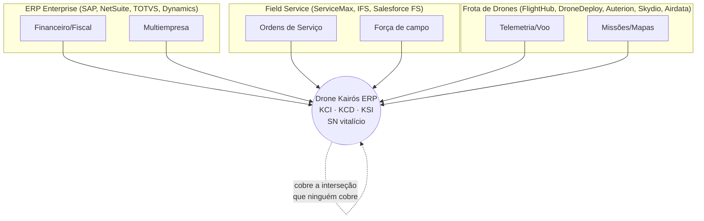
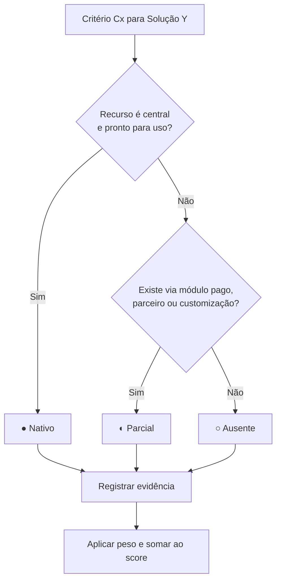

# 05 — Benchmark · Drone Kairós ERP

**Documento:** `05 — Benchmark`
**Versão:** 1.0 · **Data:** 21 de julho de 2026 · **Status:** Ativo
**Dependências:** `00`, `01`, `02`, `03`, `04`
**Responsável:** Analista de Produto

---

## 1. Resumo Executivo

Este documento estabelece o **benchmark competitivo** do Drone Kairós ERP contra três categorias de soluções que, individualmente, tocam partes do problema que o Kairós resolve de forma integrada:

- **(a) ERPs genéricos/enterprise** — SAP S/4HANA, Oracle NetSuite, TOTVS Protheus, Microsoft Dynamics 365. Fortes em finanças, fiscal e multiempresa; agnósticos de vertical e sem rastreabilidade de campo por Serial Number (SN).
- **(b) Field Service / pós-venda e manutenção** — ServiceMax, Fieldwire, IFS FSM, Salesforce Field Service. Fortes em ordens de serviço e força de campo; fracos em ERP financeiro completo e sem inteligência específica de drones.
- **(c) Gestão de frota/operação de drones** — DJI FlightHub 2, DroneDeploy, Auterion, Skydio Cloud, Airdata. Fortes em telemetria, missões e voo; não são ERPs, não gerenciam a cadeia comercial (fabricante → revenda → técnico → cliente) e não tratam ciclo de vida de peças com estoque inteligente.

**Conclusão central:** nenhuma solução do mercado cobre, num único produto, a combinação **vertical de drones + rastreabilidade vitalícia por SN + ERP/CRM/Financeiro/BI + apps de campo + API pública + os três módulos proprietários KCI (inteligência offline-first), KCD (cibersegurança Zero Trust) e KSI (estoque inteligente)**. O Kairós ocupa um espaço em branco (*white space*) na interseção das três categorias.

> Nota metodológica: a avaliação usa capacidades publicamente descritas de cada categoria/produto no momento da redação. Onde uma capacidade depende de configuração, parceiro ou módulo pago, isso é sinalizado como **Parcial**. Não são atribuídos dados numéricos proprietários de terceiros.

---

## 2. Objetivos

1. Mapear o cenário competitivo real em que o Kairós será lançado e comparado.
2. Definir **critérios objetivos** de avaliação de funcionalidades relevantes ao ecossistema de drones.
3. Construir uma **matriz comparativa** rastreável e defensável.
4. Identificar **lacunas de mercado** exploráveis como diferencial.
5. Formalizar o **posicionamento diferenciado** do Kairós para uso em pitch, vendas e estratégia de produto.

---

## 3. Escopo

**Dentro do escopo:**
- Comparação por capacidades funcionais e arquiteturais das 3 categorias.
- Matriz de 12 critérios ponderados.
- Análise de lacunas e posicionamento.

**Fora do escopo:**
- Comparação de preço/licenciamento comercial (tratado no Doc 04 — Pesquisa de Mercado e no plano de negócio).
- Benchmark de performance técnica (latência, throughput) — pertence aos documentos de arquitetura e testes.
- Avaliação jurídica de conformidade de concorrentes.

---

## 4. Regras (Critérios de Avaliação)

Cada solução é avaliada em **12 critérios**. A escala de atendimento é padronizada:

| Símbolo | Nível | Significado |
|:---:|---|---|
| ● | Nativo | Recurso central, pronto para uso, coberto pelo produto-núcleo |
| ◐ | Parcial | Existe via módulo pago, parceiro, customização ou de forma limitada |
| ○ | Ausente | Não faz parte da proposta do produto |

**Critérios (C1–C12):**

| ID | Critério | Definição operacional | Peso |
|---|---|---|:---:|
| C1 | Multiempresa (multi-tenant) | Isolamento e operação simultânea de fabricante, revendas e clientes | 3 |
| C2 | Rastreabilidade vitalícia por SN | Histórico completo do ativo do "nascimento" ao descarte, por número de série | 5 |
| C3 | Gestão de peças / estoque inteligente | Controle de peças com previsão de demanda e sugestão automática (KSI) | 4 |
| C4 | Diagnóstico assistido por IA | Apoio à triagem/diagnóstico técnico com inteligência (KCI) | 4 |
| C5 | Cibersegurança embarcada | Modelo Zero Trust integrado ao produto (KCD), não só perímetro de TI | 5 |
| C6 | Apps de campo | Aplicativos para técnico e cliente (Flutter), com uso offline | 3 |
| C7 | API pública | Integração aberta e documentada para terceiros | 3 |
| C8 | BI / Analytics | Painéis e indicadores de decisão embarcados | 2 |
| C9 | ERP Financeiro/Fiscal | Contas a pagar/receber, fiscal, contábil | 3 |
| C10 | CRM / Pós-venda | Funil comercial, ordens de serviço, garantia | 3 |
| C11 | Vertical de drones | Aderência nativa ao domínio (voo, componentes, ciclo de vida do drone) | 5 |
| C12 | Offline-first | Operação plena sem conectividade contínua no campo | 4 |

O **score ponderado** de cada solução é a soma dos pesos, atribuindo `● = 1,0`, `◐ = 0,5`, `○ = 0,0` × peso do critério. Score máximo teórico = soma dos pesos = **44**.

---

## 5. Arquitetura (Metodologia de Benchmark)

O benchmark segue um pipeline de 6 estágios, garantindo repetibilidade em versões futuras:

```
[1] Definição do universo   →  seleção das 3 categorias e representantes
        │
        ▼
[2] Critérios & pesos       →  C1..C12 com pesos alinhados à visão do produto
        │
        ▼
[3] Coleta de evidências    →  capacidades públicas de cada categoria
        │
        ▼
[4] Normalização            →  escala ● / ◐ / ○ aplicada por critério
        │
        ▼
[5] Scoring ponderado       →  cálculo do score por solução
        │
        ▼
[6] Análise & posicionamento → lacunas, quadrante, conclusão
```

**Princípios:**
- **Conservadorismo:** na dúvida entre ● e ◐, atribui-se ◐; entre ◐ e ○, atribui-se ○. Evita superestimar o Kairós.
- **Rastreabilidade:** cada célula deve ser justificável pela proposta pública da categoria.
- **Neutralidade de vertical:** ERPs e FSM são penalizados apenas onde a ausência é estrutural, não conjuntural.

---

## 6. Diagramas

### 6.1 Posicionamento nas três categorias (interseção)



### 6.2 Quadrante de posicionamento

```
     Aderência à VERTICAL de drones (alta) ▲
                                           │
        DroneDeploy ●        │      ★ DRONE KAIRÓS ERP
        Auterion   ●         │        (vertical + ERP + IA + segurança)
        Skydio     ●         │
        Airdata    ●         │
        FlightHub  ●         │
   ────────────────────────────────────────────────────►
   (baixa profundidade                 (alta profundidade
    de gestão empresarial)              de gestão empresarial)
                            │
        (nenhum)            │      SAP ●  NetSuite ●
                            │      TOTVS ● Dynamics ●
                            │      ServiceMax ◐ IFS ◐
     Aderência à vertical (baixa) ▼
```

O Kairós é o único ocupante do quadrante **superior-direito**: alta aderência à vertical **e** alta profundidade de gestão empresarial.

---

## 7. Fluxogramas

### 7.1 Fluxo de decisão do avaliador (como classificar uma célula)



### 7.2 Jornada de valor comparada (ciclo de vida de um drone)


> **Leitura:** ERPs cobrem bem "Venda" e "Financeiro"; FSM cobre "Manutenção"; plataformas de drone cobrem "Uso/voo". Somente o Kairós encadeia **todas** as etapas sob o mesmo SN, do "nascimento" ao descarte (rastreabilidade vitalícia).

---

## 8. Boas Práticas

- **Comparar por capacidade, não por marketing:** avaliar o que o produto faz nativamente, não o que a página de vendas promete.
- **Isolar a vertical:** um ERP genérico não deve ser "punido" por não ser de drones; deve ser avaliado pelo custo/esforço de torná-lo vertical (customização = ◐, não ●).
- **Evidência antes de score:** nenhuma célula recebe ● sem justificativa funcional.
- **Revisão periódica:** re-executar o benchmark a cada release maior de concorrentes ou do Kairós (rastreado no Project Bible).
- **Separar núcleo de ecossistema:** capacidades entregues apenas por parceiros/integrações contam como ◐.

---

## 9. Padrões

- **Escala de avaliação:** ● / ◐ / ○ (Seção 4), imutável entre versões para permitir comparação temporal.
- **Nomenclatura de módulos proprietários:** KCI (inteligência offline-first), KCD (cibersegurança Zero Trust), KSI (estoque inteligente) — nomes fixos conforme Canon do projeto (Docs 01/02).
- **Formato de matriz:** linhas = soluções agrupadas por categoria; colunas = C1..C12; última coluna = score ponderado.
- **Padrão de referência de IA:** funcionalidades de inteligência são descritas por capacidade ("diagnóstico assistido", "previsão de demanda"), **sem citar modelos comerciais de IA por nome**.
- **Versionamento:** SemVer do documento; mudanças de critério exigem incremento maior (ex.: 1.0 → 2.0).

---

## 10. Casos de Uso

**UC-01 — Comprador enterprise (revenda de médio porte)**
Precisa gerir estoque de peças, ordens de serviço e finanças **e** rastrear cada drone vendido. Com ERP genérico + FSM + planilha de SN, monta um "Frankenstein" de 3 sistemas. Com Kairós, resolve em uma plataforma. → *Argumento de consolidação.*

**UC-02 — Fabricante que quer garantia rastreável**
Quer saber o histórico completo de cada unidade produzida (peças trocadas, falhas, técnico responsável). ERPs não têm SN de campo vitalício; plataformas de drone não têm cadeia comercial. → *Kairós é o único com C2 + C11 nativos.*

**UC-03 — Técnico em campo sem conexão**
Faz diagnóstico numa fazenda sem sinal. FSMs em nuvem degradam offline; apps de voo não fazem OS. → *KCI offline-first (C12 + C4) é diferencial exclusivo.*

**UC-04 — Cliente final acompanhando o ativo**
Quer ver garantia, histórico e status via app. Poucos concorrentes oferecem app de cliente ligado ao SN. → *App Flutter cliente + rastreabilidade.*

**UC-05 — CISO avaliando risco**
Exige segurança embarcada Zero Trust, não apenas TLS de perímetro. → *KCD como recurso de produto (C5), raro no mercado.*

---

## 11. Modelagem — Matriz Comparativa (obrigatória)

Legenda: **●** Nativo (1,0) · **◐** Parcial (0,5) · **○** Ausente (0,0). Score máximo = 44.

### 11.1 Categoria (a) — ERPs genéricos/enterprise

| Solução | C1 | C2 | C3 | C4 | C5 | C6 | C7 | C8 | C9 | C10 | C11 | C12 | **Score** |
|---|:-:|:-:|:-:|:-:|:-:|:-:|:-:|:-:|:-:|:-:|:-:|:-:|:-:|
| SAP S/4HANA | ● | ◐ | ◐ | ◐ | ◐ | ◐ | ● | ● | ● | ● | ○ | ○ | **26,5** |
| Oracle NetSuite | ● | ◐ | ◐ | ○ | ◐ | ◐ | ● | ● | ● | ● | ○ | ○ | **23,5** |
| TOTVS Protheus | ● | ◐ | ◐ | ○ | ○ | ◐ | ● | ◐ | ● | ● | ○ | ○ | **20,0** |
| MS Dynamics 365 | ● | ◐ | ◐ | ◐ | ◐ | ◐ | ● | ● | ● | ● | ○ | ○ | **26,5** |

*Padrão da categoria:* fortes em C1/C7/C8/C9/C10; **estruturalmente ausentes** em C11 (vertical de drones) e C12 (offline-first); rastreabilidade por SN (C2) existe como lote/série genérico, não vitalício de campo → ◐.

### 11.2 Categoria (b) — Field Service / manutenção e pós-venda

| Solução | C1 | C2 | C3 | C4 | C5 | C6 | C7 | C8 | C9 | C10 | C11 | C12 | **Score** |
|---|:-:|:-:|:-:|:-:|:-:|:-:|:-:|:-:|:-:|:-:|:-:|:-:|:-:|
| ServiceMax | ◐ | ◐ | ◐ | ◐ | ◐ | ● | ● | ◐ | ○ | ● | ○ | ◐ | **21,5** |
| IFS FSM | ◐ | ◐ | ◐ | ◐ | ◐ | ● | ● | ● | ◐ | ● | ○ | ◐ | **23,5** |
| Salesforce Field Service | ◐ | ◐ | ○ | ◐ | ◐ | ● | ● | ● | ○ | ● | ○ | ◐ | **20,5** |
| Fieldwire | ○ | ○ | ◐ | ○ | ○ | ● | ● | ◐ | ○ | ◐ | ○ | ◐ | **11,0** |

*Padrão da categoria:* fortes em C6/C7/C10; medianos em C4/C5; **ausentes** em C9 (ERP financeiro completo) e C11 (vertical de drones). Rastreabilidade de ativo por SN é parcial e não vitalícia.

### 11.3 Categoria (c) — Gestão de frota/operação de drones

| Solução | C1 | C2 | C3 | C4 | C5 | C6 | C7 | C8 | C9 | C10 | C11 | C12 | **Score** |
|---|:-:|:-:|:-:|:-:|:-:|:-:|:-:|:-:|:-:|:-:|:-:|:-:|:-:|:-:|
| DJI FlightHub 2 | ◐ | ◐ | ○ | ◐ | ◐ | ● | ◐ | ◐ | ○ | ○ | ● | ◐ | **17,5** |
| DroneDeploy | ◐ | ◐ | ○ | ◐ | ◐ | ● | ● | ● | ○ | ◐ | ● | ◐ | **21,5** |
| Auterion | ◐ | ◐ | ○ | ◐ | ● | ● | ● | ◐ | ○ | ○ | ● | ◐ | **22,0** |
| Skydio Cloud | ◐ | ◐ | ○ | ◐ | ● | ● | ◐ | ◐ | ○ | ○ | ● | ◐ | **20,0** |
| Airdata | ◐ | ◐ | ◐ | ◐ | ◐ | ● | ● | ● | ○ | ○ | ● | ◐ | **20,5** |

*Padrão da categoria:* fortes em C11/C6/C7; **ausentes** em C3 (estoque de peças), C9 (financeiro) e C10 (CRM/pós-venda). São plataformas de **operação de voo**, não de gestão empresarial da cadeia.

### 11.4 Drone Kairós ERP

| Solução | C1 | C2 | C3 | C4 | C5 | C6 | C7 | C8 | C9 | C10 | C11 | C12 | **Score** |
|---|:-:|:-:|:-:|:-:|:-:|:-:|:-:|:-:|:-:|:-:|:-:|:-:|:-:|:-:|
| **Drone Kairós ERP** | ● | ● | ● | ● | ● | ● | ● | ● | ● | ● | ● | ● | **44,0** |

> A pontuação máxima do Kairós reflete a **proposta de design** (todos os critérios são requisitos de produto, conforme Docs 01–03), não uma medição de produto já entregue. A entrega efetiva é rastreada pelo Roadmap (Doc 03) e pelos Quality Gates.

### 11.5 Consolidado por categoria (média de score)

| Categoria | Score médio | C2 (SN vitalício) | C11 (vertical) | C3+C4+C5 (KSI/KCI/KCD) |
|---|:-:|:-:|:-:|:-:|
| (a) ERP enterprise | ~24,1 | ◐ | ○ | fraco |
| (b) Field Service | ~19,1 | ◐ | ○ | médio |
| (c) Frota de drones | ~20,3 | ◐ | ● | fraco |
| **Kairós** | **44,0** | ● | ● | **forte (nativo)** |

---

## 12. Checklist

**Cobertura do benchmark**
- [x] As três categorias foram representadas por soluções reconhecidas.
- [x] 12 critérios definidos com pesos e definição operacional.
- [x] Escala ● / ◐ / ○ aplicada de forma conservadora.
- [x] Matriz comparativa completa (11.1–11.5).
- [x] Lacunas de mercado identificadas (Seção 13/14).
- [x] Posicionamento diferenciado formalizado.

**Qualidade / integridade**
- [x] Nenhum dado numérico proprietário de terceiro inventado.
- [x] Nenhum modelo comercial de IA citado por nome.
- [x] Nomes de módulos (KCI/KCD/KSI) conforme Canon.
- [x] Pontuação do Kairós explicitada como proposta de design, não medição.

---

## 13. Riscos

| ID | Risco | Impacto | Prob. | Mitigação |
|---|---|:-:|:-:|---|
| R1 | Concorrente de drones adicionar módulo de gestão (subir no quadrante) | Alto | Média | Aprofundar KCI/KCD/KSI e rastreabilidade vitalícia como fosso técnico |
| R2 | ERP enterprise lançar vertical de drones via parceiro | Alto | Baixa | Velocidade de nicho + offline-first, difíceis de replicar em suíte genérica |
| R3 | Viés de otimismo na auto-avaliação do Kairós | Médio | Média | Score = proposta de design; validação real via Quality Gates (Doc 03) |
| R4 | Critérios/pesos desatualizarem frente ao mercado | Médio | Média | Revisão a cada release maior; versionar documento |
| R5 | Comparação percebida como injusta por não citar preço | Baixo | Média | Escopo explícito (Seção 3); preço tratado no Doc 04 |
| R6 | Capacidades de concorrentes mudarem após redação | Médio | Alta | Datar evidências; re-executar pipeline da Seção 5 |

---

## 14. Melhorias Futuras

1. **Lacunas de mercado identificadas (oportunidade do Kairós):**
   - **L1 — SN vitalício de campo:** nenhuma categoria oferece rastreabilidade do "nascimento ao descarte" ligada à cadeia comercial. → *Fosso do Kairós.*
   - **L2 — Estoque inteligente de peças em contexto de drones (KSI):** ausente nas plataformas de voo, genérico nos ERPs.
   - **L3 — Diagnóstico assistido offline (KCI):** FSMs degradam sem conexão; plataformas de voo não fazem OS.
   - **L4 — Cibersegurança embarcada Zero Trust como recurso de produto (KCD):** tratada como TI de perímetro pelos concorrentes, não como capacidade do produto.
   - **L5 — Cadeia completa fabricante → revenda → técnico → cliente** num só multi-tenant: fragmentada hoje entre 2–3 sistemas.

2. **Evolução do próprio benchmark:**
   - Adicionar score de **TCO/integração** (nº de sistemas necessários para igualar o Kairós).
   - Introduzir eixo de **maturidade de dados/IA** por concorrente.
   - Incluir avaliação de **conformidade regulatória de voo** por região.
   - Automatizar coleta de evidências e versionar a matriz em formato de dados (CSV/JSON) além de Markdown.

3. **Posicionamento diferenciado (síntese para pitch):**
   > O Drone Kairós ERP é a única plataforma que une **a profundidade de gestão de um ERP enterprise**, **a força de campo de um field service** e **a aderência vertical de uma plataforma de drones** — amarradas por **rastreabilidade vitalícia por Serial Number** e potencializadas pelos módulos proprietários **KCI, KCD e KSI**. Onde o mercado exige 3 sistemas, o Kairós entrega 1.

---

## 15. Auditoria

| Versão | Data | Autor | Alteração |
|---|---|---|---|
| 1.0 | 21/07/2026 | Analista de Produto | Criação do benchmark: 3 categorias, 12 critérios, matriz comparativa completa, lacunas e posicionamento |

**Fontes de verdade (dependências):**
- `00` — Índice / Canon do projeto
- `01` — Constituição do Projeto (missão, princípios)
- `02` — Project Bible (definições de KCI/KCD/KSI, arquitetura de alto nível)
- `03` — Roadmap (estado de entrega dos critérios)
- `04` — Pesquisa de Mercado (contexto de preço/demanda)

**Critérios de aceite deste documento:**
- Matriz comparativa presente e completa. ✔
- Três categorias analisadas com representantes reconhecidos. ✔
- Lacunas e posicionamento explícitos. ✔
- Sem dados falsos ou modelos de IA nomeados comercialmente. ✔

**Próxima revisão programada:** a cada release maior do Kairós ou de concorrente relevante (rastreado no Project Bible).

---
*Fim do Documento 05 — Benchmark · Drone Kairós ERP · v1.0*
