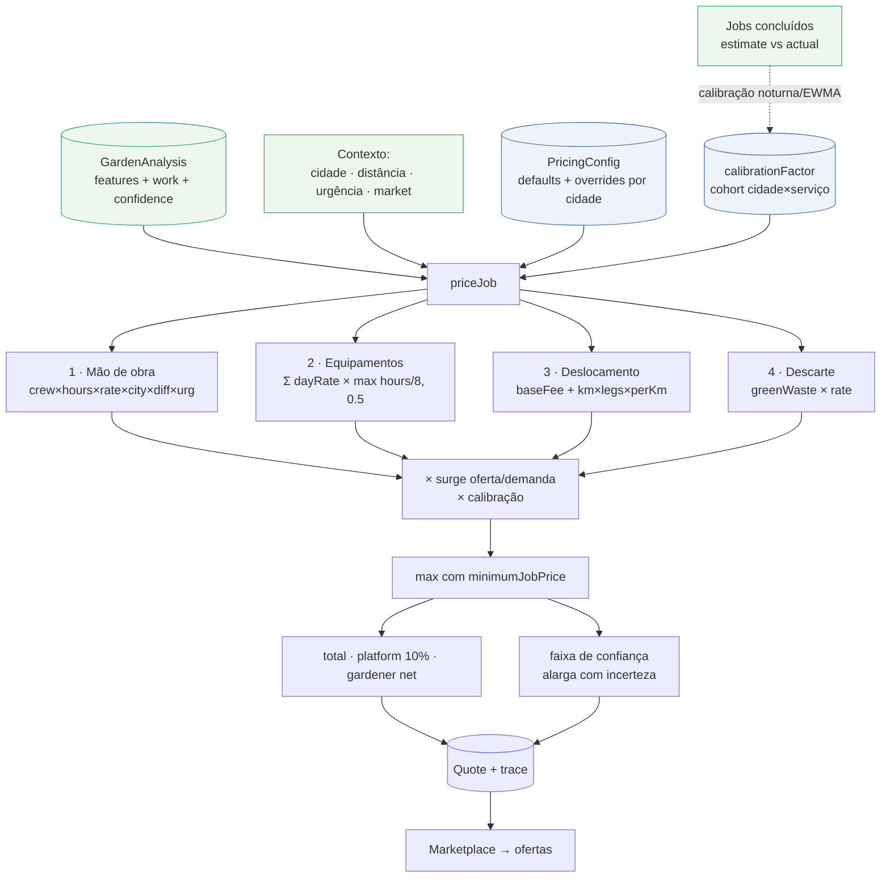

# 05 — Motor inteligente de precificação

> Transforma a [`GardenAnalysis`](04-ai-pipeline.md) + o contexto de mercado num
> `Quote` **determinístico e auditável**: mão de obra, equipamentos, deslocamento,
> descarte, urgência, dificuldade, oferta/demanda, split da plataforma e faixa de
> confiança. Implementado em [`packages/pricing-engine`](../packages/pricing-engine).

**Determinismo é uma feature.** Mesmos insumos → mesmo orçamento, sempre — e cada
centavo é explicável via o `trace` retornado. O "machine learning" que o produto
promete **não** substitui a fórmula: ele entra como **um multiplicador de calibração
por cohort**, clampado, aprendido dos serviços concluídos (§6). Assim conciliamos
duas coisas que normalmente brigam: preços que **melhoram com o uso** e preços que se
pode **auditar linha a linha** perante cliente e jardineiro.

---

## 1. A fórmula, na ordem em que roda

[`engine.ts`](../packages/pricing-engine/src/engine.ts) — `priceJob(input, cfg)`.

```
labour    = crew × hours × baseRate × cityIndex × difficulty × urgency
equipment = Σ  dayRate(eq) × max(hours/8, 0.5)          (por equipamento exigido)
travel    = dispatchFee + km × legs × (fuel/kmPerLiter + wearPerKm)   (legs = 2 se ida-e-volta)
disposal  = greenWasteM3 × disposalPerM3
──────────────────────────────────────────────────────────────────────────
subtotal  = (labour + equipment + travel + disposal) × surge × calibration
            piso em minimumJobPrice
total     = subtotal                       ← o que o cliente paga
platform  = total × feePercent             ← comissão (10%)
gardener  = total − platform               ← líquido do jardineiro
```

Passo a passo, com o que está de fato no código:

### 1. Mão de obra
```
laborBase  = estimatedCrewSize × estimatedHours × baseHourlyRate
laborAfter = laborBase × cityIndex × difficultyMult × urgencyMult
```
`estimatedCrewSize` e `estimatedHours` vêm do consenso da IA; `baseHourlyRate` (R$45)
é o custo-hora do jardineiro antes dos multiplicadores. `cityIndex` ajusta pelo custo
de vida da cidade; `difficultyMult` e `urgencyMult` são tabelas (§2).

### 2. Equipamentos (pró-rata ao dia de trabalho)
```
usageFraction = min(1, estimatedHours / 8)
equipment     = Σ  equipmentDayRate[eq] × max(usageFraction, 0.5)
```
Cada equipamento exigido é cobrado como fração de uma diária de 8h — com **piso de
meia diária** (`0.5`), porque ninguém aluga uma roçadeira por 40 minutos. Percorre
`work.requiredEquipment`; equipamento sem tarifa cadastrada contribui 0.

### 3. Deslocamento
```
perKm  = fuelPricePerLiter / kmPerLiter + wearPerKm
legs   = roundTrip ? 2 : 1
travel = distance > 0 ? baseFee + distance × legs × perKm : baseFee
```
Uma **taxa fixa de despacho** (`baseFee`) mais o custo variável por km: combustível
(preço do litro ÷ consumo) **mais** desgaste/amortização do veículo. Ida e volta dobra
a distância. Sem distância conhecida, cobra só a taxa base.

### 4. Descarte
```
disposal = features.greenWasteM3 × disposalPricePerM3
```
Resíduo verde (m³) estimado pela IA × custo de levar ao ponto de descarte.

### 5. Surge (oferta/demanda), piso e split
```
supplyDemandMult = surgeMultiplier(cfg, input)          // §3
rawSubtotal      = (labour + equipment + travel + disposal) × supplyDemandMult × calibration
subtotal         = max(rawSubtotal, minimumJobPrice)     // piso de visita
total            = subtotal
platformFee      = round(totalCents × feePercent)        // 10%
gardenerNet      = totalCents − platformFee
```
`calibration` é `clampFactor(input.calibrationFactor ?? 1)` — recortado em `[0.5, 2]`
já na entrada da fórmula (o gancho de ML, §6). Tudo é convertido para **centavos
inteiros** na fronteira (`money.toCents`), evitando drift de ponto flutuante.

### Line items que sempre fecham com o subtotal
Surge e calibração são atribuídos **proporcionalmente** às linhas para que a soma
exibida bata com o subtotal:
```
scale = subtotal / (labour + equipment + travel + disposal)
```
Saem 4 linhas (`labor`, `equipment`, `travel`, `disposal`), cada uma com uma
`explanation` legível (ex.: `"2 prof. × 3h"`, `"7 km (ida e volta)"`), filtrando as de
valor zero. Contrato em [`quote.ts`](../packages/shared/src/quote.ts).

---

## 2. As chaves de configuração (`PricingConfig`)

[`config.ts`](../packages/pricing-engine/src/config.ts). Defaults Brasil-wide; a API
sobrescreve por cidade/região a partir da tabela `pricing_config` (ver
[`02-database.md`](02-database.md)) e dobra a calibração por cima.

**Globais**

| Chave | Default | Papel |
| --- | --- | --- |
| `baseHourlyRate` | **R$45** | custo-hora do jardineiro antes de multiplicadores |
| `minimumJobPrice` | **R$80** | piso de qualquer visita, independente do tamanho |
| `platformFeePercent` | **0,10** | comissão da plataforma (10%) — primária no [modelo de monetização](10-monetization.md) |
| `disposalPricePerM3` | **R$45** | descarte por m³ de resíduo verde |
| `bandWidthFraction` | **0,12** | largura base da faixa de preço (± do ponto) |

**Índice de custo por cidade (`cityCostIndex`)**

| Cidade | Índice | | Cidade | Índice |
| --- | --- | --- | --- | --- |
| São Paulo | 1,25 | | Campinas | 1,10 |
| Rio de Janeiro | 1,20 | | Belo Horizonte / Curitiba / Porto Alegre | 1,05 |
| Brasília | 1,18 | | Manaus | 0,98 |
| Salvador | 0,95 | | Goiânia | 0,95 |
| Recife | 0,92 | | Fortaleza | 0,90 |
| `__default` | **1,00** | | | |

`cityIndex(cfg, city)` resolve a cidade e cai no `__default` quando desconhecida.

**Multiplicador de dificuldade** (`difficultyMultiplier`) — sobre a mão de obra:

| `LOW` | `MEDIUM` | `HIGH` | `EXTREME` |
| --- | --- | --- | --- |
| 0,90 | 1,00 | 1,25 | 1,55 |

**Multiplicador de urgência** (`urgencyMultiplier`) — surge do lado da demanda:

| `FLEXIBLE` | `NORMAL` | `URGENT` | `EMERGENCY` |
| --- | --- | --- | --- |
| 0,95 | 1,00 | 1,20 | 1,45 |

**Diárias de equipamento** (`equipmentDayRate`, R$/dia de 8h):

| Roçadeira | Cortador | Motosserra | Soprador | Triturador | Escada | Caminhão | Pulverizador | Podador altura |
| --- | --- | --- | --- | --- | --- | --- | --- | --- |
| 60 | 50 | 90 | 40 | 140 | 20 | 220 | 45 | 55 |

**Deslocamento** (`travel`): `baseFee` R$15 · `fuelPricePerLiter` R$6,20 ·
`kmPerLiter` 10 · `wearPerKm` R$0,35 · `roundTrip` `true`.
→ `perKm = 6,20/10 + 0,35 = R$0,97/km`.

**Oferta/demanda** (`supplyDemand`): `neutralRatio` **3** (jardineiros disponíveis por
vaga aberta em que o multiplicador é 1,0), `minSurge` **0,90**, `maxSurge` **1,35**.

---

## 3. Surge de oferta/demanda

`surgeMultiplier()` usa o sinal de mercado ao vivo (`input.market`):

```
ratio = availableGardeners / openJobs         // > neutral ⇒ oferta abundante
raw   = 1 − 0.35 × ln(ratio / neutralRatio)
surge = clamp(raw, minSurge, maxSurge)         // [0.90, 1.35]
```

- Sem `market` ou sem vagas abertas → **1,0** (neutro).
- **Escassez** (ratio abaixo de 3) → surge **para cima**, até +35%.
- **Abundância** (ratio acima de 3) → **desconto**, até −10%.
- O `ln` mantém a curva **suave** — o preço não salta com pequenas flutuações.

Exemplos (`neutralRatio=3`): 1 jardineiro/vaga → `1 − 0,35·ln(1/3) ≈ 1,38` → clampado a
**1,35**; 3/vaga → **1,00**; 9/vaga → `1 − 0,35·ln(3) ≈ 0,62` → clampado a **0,90**.

---

## 4. Faixa de confiança (price band)

O motor não devolve um número seco; devolve um **ponto + faixa**, e a faixa **alarga
quando a incerteza é maior**:

```
confidence = clamp01( analysis.confidence × max(0.6, coverage) )
coverage   = 1 − 0.05·(sem cidade) − 0.06·(sem distância) − 0.03·(sem market)
bandWidth  = bandWidthFraction × (1 + (1 − confidence))
bandLow    = total × (1 − bandWidth)
bandHigh   = total × (1 + bandWidth)
```

A `confidence` do quote **herda a confiança da IA** ([doc 04, §6](04-ai-pipeline.md#confian%C3%A7a-geral-fieldagreement-e-warnings)) e a
penaliza por **falta de contexto de precificação** (cidade, distância, mercado).
Quanto menor a confiança, mais largo o `bandWidth` — a plataforma anuncia uma faixa
honesta aos jardineiros em vez de fingir precisão. Com `bandWidthFraction = 0,12` e
confiança 0,80, a faixa é ±14,4%.

---

## 5. Exemplo trabalhado — 235 m², grama alta → ~R$545

Reproduz o número do [README](../README.md). Insumos (consenso da IA no [doc 04, §8](04-ai-pipeline.md#8-exemplo-de-sa%C3%ADda--gardenanalysis) + contexto):

| Insumo | Valor |
| --- | --- |
| `estimatedCrewSize` × `estimatedHours` | 2 profissionais × 3 h |
| `difficulty` | `HIGH` → ×1,25 |
| `urgency` | `NORMAL` → ×1,00 |
| Cidade | São Paulo → índice 1,25 |
| `requiredEquipment` | Roçadeira (R$60) + Soprador (R$40) |
| Distância | 7 km (ida e volta) |
| `greenWasteM3` | 1,0 m³ |
| Surge / calibração | 1,0 / 1,0 |

**Cálculo**

| Etapa | Conta | Valor |
| --- | --- | --- |
| Mão de obra (base) | 2 × 3 × 45 | R$270,00 |
| Mão de obra (após mult.) | 270 × 1,25 × 1,25 × 1,00 | **R$421,88** |
| Equipamentos | (60 + 40) × max(3/8, 0,5) = 100 × 0,5 | **R$50,00** |
| Deslocamento | 15 + 7 × 2 × 0,97 | **R$28,58** |
| Descarte | 1,0 × 45 | **R$45,00** |
| **Subtotal** | (421,88 + 50 + 28,58 + 45) × 1,0 × 1,0 | **R$545,45** |
| Piso? | max(545,45, 80) | R$545,45 |
| **Total (cliente paga)** | | **R$545,45** |
| Comissão plataforma (10%) | | **R$54,55** |
| **Líquido do jardineiro** | | **R$490,90** |

**Line items retornados** (`scale = 1,0`, pois surge/calibração = 1):

| key | label | valor | explanation |
| --- | --- | --- | --- |
| `labor` | Mão de obra | R$421,88 | `2 prof. × 3h` |
| `equipment` | Equipamentos | R$50,00 | `ROCADEIRA, SOPRADOR` |
| `travel` | Deslocamento | R$28,58 | `7 km (ida e volta)` |
| `disposal` | Descarte | R$45,00 | `1 m³ de resíduo verde` |

**Faixa** (confiança 0,80 → `bandWidth` = 0,12 × 1,2 = 0,144):
**R$466,91 – R$623,99**, ponto **R$545,45**.

> Nota de arredondamento: os line items são convertidos a centavos individualmente e
> somam R$545,46 (1 centavo a mais que o subtotal R$545,45), diferença esperada de
> arredondamento independente; o `Quote.subtotalCents`/`totalCents` é a autoridade.

### Variação com surge
Numa noite de sábado com 1 jardineiro por vaga (`ratio = 1`), `surge = 1,35`. O
subtotal vira `545,45 × 1,35 ≈ R$736,36`, e o `scale` redistribui esse acréscimo
proporcionalmente entre as 4 linhas — que continuam fechando com o total.

---

## 6. O gancho de aprendizado contínuo (calibração)

[`calibration.ts`](../packages/pricing-engine/src/calibration.ts). A promessa
"**quanto mais serviços, mais preciso**" é entregue **sem** trocar a fórmula por uma
caixa-preta. Um job noturno (`apps/api → pricing/calibration.processor.ts`) compara,
por cohort **(cidade, serviceType)**, o **preço estimado** contra o **preço em que o
job fechou** (oferta aceita / valor pago), e destila um único `calibrationFactor`.

`cohortKey(city, service)` → `"são paulo::CORTE_GRAMA"`.

### Batch — `computeCalibrationFactor(samples)`
```
geoMean = exp( mean( ln(actual / estimate) ) )     // média geométrica dos ratios
trust   = min(1, n / (n + MIN_SAMPLES))             // empirical-Bayes shrinkage
shrunk  = 1 + (geoMean − 1) × trust                 // encolhe rumo a 1,0
factor  = clamp(shrunk, 0.75, 1.30)
```
- **Média geométrica** dos `actual/estimate` — robusta a assimetria e **simétrica**
  para super e subestimativas (subestimar 2× e superestimar 2× se cancelam).
- **Shrinkage empirical-Bayes**: com poucos dados, `trust` é baixo e o fator fica perto
  de 1,0 (o formulário manda); com muitos, `trust → 1` e confiamos no sinal. Abaixo de
  **`MIN_SAMPLES = 8`** amostras, retorna **`factor = 1` (no-op)** — nunca calibramos no
  escuro.
- **Clamp `[0,75; 1,30]`** — a calibração ajusta, não reinventa; um cohort nunca pode
  distorcer o preço além de ±30%.
- Devolve `{ factor, sampleSize, drift }` (`drift = factor − 1`), observável no admin/BI.

### Online — `updateFactorOnline(previous, sample, alpha=0.1)`
Atualização **EWMA** (média móvel exponencial) para streaming em vez de batch:
```
ratio = actual / estimate
next  = previous × (1 − alpha) + ratio × alpha
      = clamp(next, 0.75, 1.30)
```
Cada job concluído empurra suavemente o fator do cohort na direção do mercado real,
sem esperar o job noturno. Amostras inválidas (estimativa ou valor ≤ 0) são ignoradas.

### Como "mais jobs → mais preciso" de fato acontece
1. Cohort novo (cidade × serviço) começa com `factor = 1,0` — puro formulário.
2. Conforme jobs fecham, `sampleSize` cresce → `trust` sobe → o fator sai de 1,0 na
   direção do viés observado (ex.: SP tende a fechar 8% acima do estimado → `factor ≈ 1,08`).
3. O fator entra na fórmula como `× calibration` (clampado `[0,5; 2]` de novo na
   engine, defesa em profundidade), então **estimativas convergem para o preço de
   equilíbrio de mercado** por cidade e por serviço, cada uma no seu ritmo.

É o análogo, no preço, dos **weights por provider** da [IA](04-ai-pipeline.md#pesos-de-confian%C3%A7a-weights): aprender do
histórico sem perder a explicabilidade.

---

## 7. Fluxo do motor



---

## 8. Auditabilidade — o `trace`

Além do `Quote`, `priceJob` devolve um `PricingDebugTrace`
([`types.ts`](../packages/pricing-engine/src/types.ts)) com **cada valor intermediário**:

```jsonc
{
  "laborBase": 270,
  "laborAfterMultipliers": 421.875,
  "equipment": 50,
  "travel": 28.58,
  "disposal": 45,
  "difficultyMultiplier": 1.25,
  "urgencyMultiplier": 1.0,
  "cityIndex": 1.25,
  "supplyDemandMultiplier": 1.0,
  "calibrationFactor": 1.0
}
```

Com o `trace` + `breakdownVersion` (`"pricing-1.0.0"`), qualquer quote é
**reproduzível a partir dos insumos armazenados** e **defensável** perante cliente,
jardineiro ou disputa: dá para mostrar exatamente por que deu R$545,45. O
`breakdownVersion` versiona a fórmula — mudou a lógica, muda a versão, e quotes
antigas continuam explicáveis sob a versão que as gerou.

---

## 9. Propriedades e casos de borda garantidos pelo código

- **Piso de visita**: nenhum job custa menos que `minimumJobPrice` (R$80).
- **Equipe ≥ 1**: o consenso força `max(1, crew)` no [doc 04](04-ai-pipeline.md); a fórmula assume ≥ 1.
- **Sem distância** → cobra só a taxa base; a confiança do quote cai (−0,06).
- **Sem cidade** → índice `__default` 1,0; confiança cai (−0,05).
- **Sem market** → surge 1,0; confiança cai (−0,03).
- **Calibração dupla-clampada** — `[0,75; 1,30]` na origem, `[0,5; 2]` na engine.
- **Centavos inteiros** ponta a ponta; nada de float no valor final.
- **Line items fecham com o subtotal** (via `scale`), a menos de 1 centavo de
  arredondamento independente.

---

### Referências cruzadas
- [`04-ai-pipeline.md`](04-ai-pipeline.md) — origem da `GardenAnalysis`.
- [`10-monetization.md`](10-monetization.md) — os 10% de comissão e take-rate de surge.
- [`11-financial-plan.md`](11-financial-plan.md) — GMV, take rate e margem por transação.
- [`02-database.md`](02-database.md) — `pricing_config`, cohorts e histórico de jobs.
</content>
