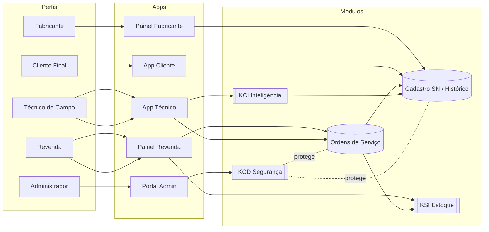
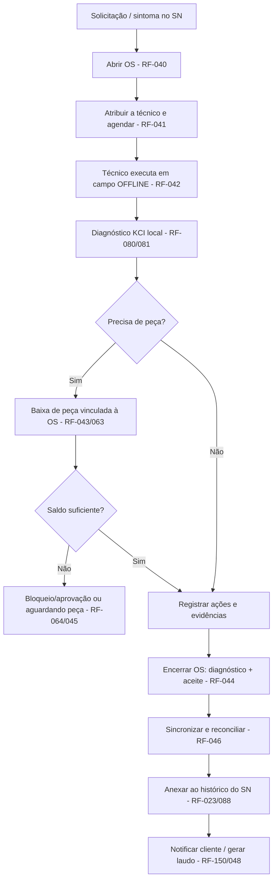
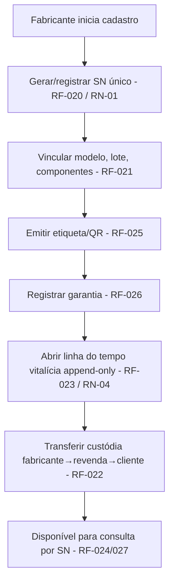
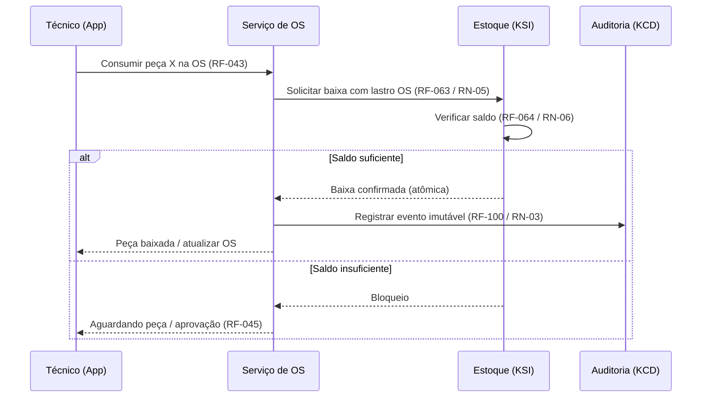
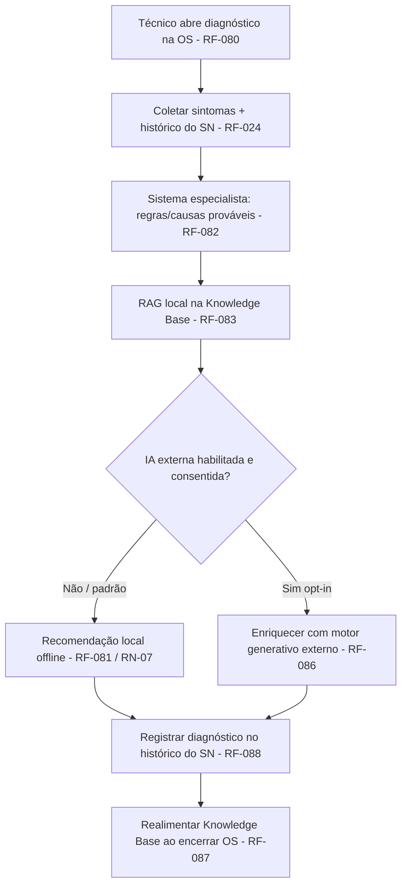

# 06 — Requisitos · Drone Kairós ERP

**Documento:** `06 — Requisitos`
**Versão:** 1.0 · **Data:** 21 de julho de 2026 · **Status:** Ativo
**Dependências:** `00 — Master Prompt`, `01 — Constituição`, `02 — Project Bible`, `03 — Roadmap`, `04 — Pesquisa de Mercado`, `05 — Benchmark de Concorrentes`
**Responsável:** Engenharia de Requisitos

---

## 1. Resumo Executivo

Este documento é a **especificação de requisitos** do Drone Kairós ERP — a ponte formal entre a visão (docs 00–02), o plano (doc 03) e a arquitetura (docs 07+). Ele traduz o propósito constitucional ("plataforma de gestão definitiva do ecossistema de drones, com rastreabilidade vitalícia por Serial Number") em **personas**, **requisitos funcionais (RF)**, **requisitos não-funcionais (RNF)**, **casos de uso**, **priorização MoSCoW**, **definição de MVP** e **matriz de rastreabilidade**.

Cada requisito recebe um **identificador estável** (`RF-NNN`, `RNF-NNN`, `UC-NNN`), uma **prioridade MoSCoW** e um **vínculo de rastreabilidade** para o módulo/documento que o realizará. O documento é a fonte para o backlog (etapa 016), para os critérios de aceite (etapa 013) e para a validação de requisitos (etapa 020). Ele obedece integralmente às cláusulas pétreas da Constituição e ao escopo consolidado do Project Bible; qualquer contradição segue o Procedimento de Conflito (Bible §4).

## 2. Objetivos

- **Definir personas** dos cinco perfis (Fabricante, Revenda, Técnico de Campo, Cliente Final, Administrador da Plataforma) com objetivos, dores e tarefas.
- **Catalogar os Requisitos Funcionais (RF)** por módulo/perfil, com ID, ator, prioridade e MVP.
- **Catalogar os Requisitos Não-Funcionais (RNF)** por atributo de qualidade (segurança, performance, disponibilidade, escalabilidade, multiempresa, offline-first, usabilidade, conformidade), com métrica verificável.
- **Especificar os casos de uso principais** ponta a ponta: fluxo de Ordem de Serviço, cadastro de equipamento com SN, baixa de estoque e diagnóstico KCI.
- **Priorizar** o escopo por MoSCoW e **delimitar o MVP**.
- **Rastrear** cada requisito ao módulo/contexto e ao documento-alvo do roadmap.

## 3. Escopo

### 3.1 Abrangência
Aplica-se a toda a plataforma: as cinco aplicações (App Cliente, App Técnico, Painel Fabricante, Painel Revenda, Portal Administrativo), os serviços transversais (ERP, CRM, Financeiro, BI, API pública, multiempresa, histórico vitalício por SN) e os três módulos proprietários (**KCI** — inteligência offline-first; **KCD** — cibersegurança Zero Trust; **KSI** — estoque inteligente).

### 3.2 Fora de escopo deste documento
- Decisões de estilo arquitetural (monólito modular × microsserviços) → Doc 07.
- Modelagem física de dados e estratégia de SN → Doc 08.
- Contratos de API detalhados (OpenAPI) → Doc 09.
- Detalhamento interno dos módulos → Docs 13 (KCI), 14 (KCD), 15 (KSI).
- Conformidade legal por país → Doc 23.

Este documento define **o quê** (requisitos e critérios de aceite), não **o como** (realização técnica).

### 3.3 Definição do MVP

O MVP entrega o **fluxo de valor mínimo end-to-end** que prova a proposta: rastrear um equipamento por SN, executar uma Ordem de Serviço com diagnóstico assistido e dar baixa de peça no estoque — tudo sob multiempresa e segurança por padrão.

**Inclui (MVP):**
1. Identidade, acesso e perfis (RBAC) + isolamento multiempresa.
2. Cadastro de equipamento com SN e histórico vitalício (linha do tempo de eventos).
3. Ordem de Serviço ponta a ponta (abertura → diagnóstico → execução → baixa de peça → encerramento).
4. KSI base: itens, saldo por depósito e movimentação de entrada/saída com baixa vinculada à OS.
5. KCI base offline-first: diagnóstico por sintomas + base de conhecimento local + sugestão (RAG local); IA externa **opcional e desabilitada por padrão**.
6. App do Técnico (execução de OS offline) e App do Cliente (consulta de histórico do SN).
7. Painéis Fabricante e Revenda (cadastro e acompanhamento) e Portal Administrativo (governança mínima + auditoria).
8. KCD base: autenticação forte, criptografia, trilha de auditoria imutável, isolamento por tenant.

**Adiado (pós-MVP):** motor preditivo/generativo do KCI, RFID/NFC no KSI, reposição automática e Curva ABC, BI avançado, CRM completo, Financeiro completo, webhooks públicos, SOC/threat detection avançado, internacionalização plena.

## 4. Regras (Regras de Negócio que Restringem Requisitos)

Regras de negócio (`RN`) são invariantes de domínio que atravessam múltiplos requisitos. Todo RF deve respeitá-las.

| ID | Regra de Negócio | Origem |
|---|---|---|
| RN-01 | O **Serial Number é único, imutável e vitalício**; identifica o equipamento em todos os contextos e tenants. | Constituição Art. III |
| RN-02 | **Nenhum dado cruza a fronteira do tenant** sem autorização explícita e auditada (isolamento multiempresa). | Constituição Art. IV / Bible §5 |
| RN-03 | **Nada acontece sem registro**: toda operação relevante gera evento de auditoria imutável. | Constituição Art. II.3 |
| RN-04 | O **histórico do equipamento é append-only**; eventos não são apagados, apenas anexados/estornados com rastro. | Constituição Art. V |
| RN-05 | **Baixa de estoque exige lastro**: toda saída referencia origem (OS, venda ou ajuste justificado). | KSI / Financeiro |
| RN-06 | **Saldo de estoque nunca fica negativo** sem bloqueio ou aprovação explícita. | KSI |
| RN-07 | **IA externa é opcional, desligada por padrão** e nunca envia dado sensível sem consentimento do tenant. | KCI / Art. II.2 |
| RN-08 | **Acesso segue menor privilégio** (Zero Trust): toda requisição é autenticada e autorizada por perfil e tenant. | KCD |
| RN-09 | O **cliente tem direito de acesso ao histórico completo** do seu equipamento e à portabilidade dos seus dados. | Constituição Art. V |
| RN-10 | Operações **offline** são reconciliadas na sincronização com resolução determinística de conflitos. | KCI offline-first |
| RN-11 | **Encerramento de OS** exige diagnóstico registrado, peças baixadas e assinatura/aceite quando aplicável. | OS |
| RN-12 | Dados pessoais seguem **minimização e finalidade**; retenção e expurgo conforme conformidade (Doc 23). | LGPD/GDPR |

## 5. Arquitetura da Especificação (Organização dos Requisitos)

### 5.1 Taxonomia e esquema de identificação
Os requisitos são organizados por **contexto de domínio / módulo**, alinhados ao Mapa de Contextos (Bible §10). O identificador é estável e nunca reutilizado.

- **RF-NNN** — Requisito Funcional (o que o sistema faz).
- **RNF-NNN** — Requisito Não-Funcional (atributo de qualidade, com métrica).
- **UC-NNN** — Caso de Uso (comportamento observável de ponta a ponta).
- **RN-NN** — Regra de Negócio (invariante de domínio).

**Faixas de numeração dos RF (por contexto):**

| Faixa | Contexto / Módulo | Perfis primários |
|---|---|---|
| RF-001…019 | Identidade, Acesso e Multiempresa (Tenancy) | Todos / Administrador |
| RF-020…039 | Cadastro de Equipamento (SN) e Histórico Vitalício | Fabricante / Revenda / Cliente |
| RF-040…059 | Ordens de Serviço (OS) | Técnico / Revenda |
| RF-060…079 | KSI — Estoque Inteligente | Revenda / Fabricante |
| RF-080…099 | KCI — Inteligência e Diagnóstico | Técnico |
| RF-100…109 | KCD — Cibersegurança | Administrador |
| RF-110…119 | CRM | Revenda |
| RF-120…129 | Financeiro | Revenda / Fabricante |
| RF-130…139 | BI e Indicadores | Fabricante / Revenda / Admin |
| RF-140…149 | API Pública e Integrações | Integrador / Admin |
| RF-150…159 | Notificações, Documentos e Apps | Cliente / Técnico |

### 5.2 Catálogo de Requisitos Funcionais (RF)

Legenda de prioridade: **M** = Must · **S** = Should · **C** = Could · **W** = Won't (agora). MVP: ✅ dentro / ⬜ fora.

#### 5.2.1 Identidade, Acesso e Multiempresa

| ID | Requisito | Ator | MoSCoW | MVP |
|---|---|---|---|---|
| RF-001 | Autenticar usuário com credenciais e **MFA** opcional/obrigatório por política do tenant. | Todos | M | ✅ |
| RF-002 | Gerenciar **perfis e papéis (RBAC)** por perfil de negócio (Fabricante, Revenda, Técnico, Cliente, Admin). | Administrador | M | ✅ |
| RF-003 | **Isolar dados por tenant** em todas as consultas e operações (multiempresa 1ª classe). | Sistema | M | ✅ |
| RF-004 | Permitir que um usuário pertença a **múltiplos tenants** com contexto ativo selecionável. | Todos | S | ✅ |
| RF-005 | Cadastrar e administrar **empresas (tenants)**: dados, hierarquia fabricante→revenda, status. | Administrador | M | ✅ |
| RF-006 | Convidar e **provisionar usuários** por tenant com atribuição de papéis. | Administrador / Revenda | M | ✅ |
| RF-007 | Registrar **consentimentos e termos** (privacidade, IA externa) por usuário/tenant. | Todos | S | ✅ |
| RF-008 | **Recuperar acesso** (redefinição de senha, revogação de sessão) com auditoria. | Todos | M | ✅ |
| RF-009 | Definir **políticas de sessão** (expiração, dispositivos confiáveis) por tenant. | Administrador | C | ⬜ |

#### 5.2.2 Cadastro de Equipamento (SN) e Histórico Vitalício

| ID | Requisito | Ator | MoSCoW | MVP |
|---|---|---|---|---|
| RF-020 | Cadastrar equipamento gerando/registrando **Serial Number único e imutável** (RN-01). | Fabricante | M | ✅ |
| RF-021 | Vincular ao SN: **modelo, lote, ficha técnica, componentes e data de fabricação**. | Fabricante | M | ✅ |
| RF-022 | Registrar **transferência de posse/custódia** (fabricante→revenda→cliente) mantendo o histórico. | Fabricante / Revenda | M | ✅ |
| RF-023 | Manter **linha do tempo vitalícia (append-only)** de eventos do equipamento (RN-04). | Sistema | M | ✅ |
| RF-024 | Consultar o **histórico completo por SN** (fabricação, vendas, OS, peças, diagnósticos). | Cliente / Técnico | M | ✅ |
| RF-025 | Gerar **etiqueta/QR Code** do SN para identificação física do equipamento. | Fabricante / Revenda | S | ✅ |
| RF-026 | Registrar **garantia** (início, vigência, cobertura) vinculada ao SN. | Fabricante / Revenda | S | ✅ |
| RF-027 | **Buscar equipamento** por SN, QR Code, cliente, modelo ou lote. | Todos | M | ✅ |
| RF-028 | Registrar **recall/campanha de campo** por lote/modelo, notificando afetados. | Fabricante | C | ⬜ |
| RF-029 | Exportar o **dossiê do equipamento** (portabilidade — RN-09). | Cliente | S | ⬜ |

#### 5.2.3 Ordens de Serviço (OS)

| ID | Requisito | Ator | MoSCoW | MVP |
|---|---|---|---|---|
| RF-040 | **Abrir OS** vinculada a um SN, com sintomas, prioridade e solicitante. | Revenda / Técnico / Cliente | M | ✅ |
| RF-041 | **Atribuir OS** a um técnico e agendar atendimento. | Revenda | M | ✅ |
| RF-042 | **Executar OS em campo offline**, registrando diagnóstico, ações e evidências (fotos). | Técnico | M | ✅ |
| RF-043 | **Consumir peças na OS** com baixa vinculada ao estoque (RN-05). | Técnico | M | ✅ |
| RF-044 | **Encerrar OS** exigindo diagnóstico, peças baixadas e aceite quando aplicável (RN-11). | Técnico | M | ✅ |
| RF-045 | Manter **estados da OS** (aberta → atribuída → em execução → aguardando peça → concluída → cancelada). | Sistema | M | ✅ |
| RF-046 | **Sincronizar OS** executada offline com resolução de conflitos (RN-10). | Sistema | M | ✅ |
| RF-047 | Registrar **checklist e procedimentos** por tipo de serviço/modelo. | Técnico | S | ⬜ |
| RF-048 | Gerar **laudo/relatório de OS** (PDF) para cliente e revenda. | Sistema | S | ✅ |
| RF-049 | Vincular OS a **garantia** e classificar como cobertura/cobrança. | Revenda | S | ⬜ |
| RF-050 | Registrar **SLA e prazos** da OS e alertar atrasos. | Revenda | C | ⬜ |

#### 5.2.4 KSI — Estoque Inteligente

| ID | Requisito | Ator | MoSCoW | MVP |
|---|---|---|---|---|
| RF-060 | Cadastrar **itens/peças** com código, unidade, custo e vínculo a modelos compatíveis. | Revenda / Fabricante | M | ✅ |
| RF-061 | Controlar **saldo por depósito/localização** por tenant. | Revenda | M | ✅ |
| RF-062 | Registrar **movimentações** (entrada, saída, transferência, ajuste) com lastro (RN-05). | Revenda / Técnico | M | ✅ |
| RF-063 | **Dar baixa de peça vinculada à OS** de forma atômica e auditável. | Técnico / Sistema | M | ✅ |
| RF-064 | Impedir **saldo negativo** sem bloqueio/aprovação (RN-06). | Sistema | M | ✅ |
| RF-065 | Identificar itens por **código de barras / QR Code**. | Revenda | S | ✅ |
| RF-066 | Identificar itens por **RFID / NFC**. | Revenda | C | ⬜ |
| RF-067 | Definir **ponto de reposição** e gerar sugestão de compra. | Revenda | S | ⬜ |
| RF-068 | **Reposição automática** e classificação **Curva ABC**. | Sistema | C | ⬜ |
| RF-069 | **Previsão de demanda** e integração com Financeiro/Compras. | Sistema | W | ⬜ |
| RF-070 | Realizar **inventário/contagem** com apuração de divergências. | Revenda | S | ⬜ |

#### 5.2.5 KCI — Inteligência e Diagnóstico

| ID | Requisito | Ator | MoSCoW | MVP |
|---|---|---|---|---|
| RF-080 | Iniciar **diagnóstico assistido** a partir de sintomas e do histórico do SN. | Técnico | M | ✅ |
| RF-081 | Operar **offline-first**: base de conhecimento e diagnóstico funcionam sem rede (RN-10). | Técnico | M | ✅ |
| RF-082 | **Sistema especialista**: sugerir causas prováveis e procedimentos por regras. | Técnico | M | ✅ |
| RF-083 | **RAG local**: recuperar trechos da Knowledge Base local relevantes ao caso. | Técnico | S | ✅ |
| RF-084 | **OCR / visão computacional** para ler placas, SN e identificar defeitos em fotos. | Técnico | S | ⬜ |
| RF-085 | **Motor preditivo**: estimar falhas/manutenção com base no histórico. | Sistema | C | ⬜ |
| RF-086 | **Motor generativo** com **IA externa opcional**, desligada por padrão e com consentimento (RN-07). | Técnico | C | ⬜ |
| RF-087 | **Realimentar a Knowledge Base** com desfechos de OS (aprendizado). | Sistema | S | ⬜ |
| RF-088 | Registrar no histórico do SN o **diagnóstico e a recomendação** aplicados. | Sistema | M | ✅ |

#### 5.2.6 KCD — Cibersegurança

| ID | Requisito | Ator | MoSCoW | MVP |
|---|---|---|---|---|
| RF-100 | Manter **trilha de auditoria imutável** de eventos sensíveis (RN-03). | Sistema | M | ✅ |
| RF-101 | Aplicar **autorização Zero Trust** por perfil e tenant em toda requisição (RN-08). | Sistema | M | ✅ |
| RF-102 | **Criptografar** dados em trânsito e em repouso. | Sistema | M | ✅ |
| RF-103 | Consultar **logs e eventos de segurança** no Portal Administrativo. | Administrador | S | ✅ |
| RF-104 | **Detecção de ameaças** e alertas (SOC). | Administrador | C | ⬜ |
| RF-105 | Gerir **backups e recuperação (DR)**. | Administrador | S | ⬜ |
| RF-106 | **Gerir segredos e chaves** com rotação. | Administrador | S | ⬜ |

#### 5.2.7 CRM, Financeiro, BI

| ID | Requisito | Ator | MoSCoW | MVP |
|---|---|---|---|---|
| RF-110 | Manter **cadastro de clientes** e vínculo aos equipamentos (SN). | Revenda | M | ✅ |
| RF-111 | Registrar **interações e atendimentos** por cliente. | Revenda | S | ⬜ |
| RF-112 | Gerir **oportunidades/pós-venda** (renovação de garantia, upsell). | Revenda | C | ⬜ |
| RF-120 | Emitir **documento financeiro** de OS/venda (cobrança). | Revenda | S | ⬜ |
| RF-121 | Conciliar **custos de peças** consumidas com o Financeiro. | Revenda | C | ⬜ |
| RF-122 | Consolidar **faturamento por tenant/período**. | Revenda / Admin | C | ⬜ |
| RF-130 | Apresentar **dashboards** de OS, estoque e equipamentos por tenant. | Fabricante / Revenda | S | ⬜ |
| RF-131 | Indicadores de **confiabilidade por modelo/lote** (taxa de falha, MTBF). | Fabricante | C | ⬜ |
| RF-132 | **Exportar relatórios** (CSV/PDF) respeitando o isolamento de tenant. | Todos | S | ⬜ |

#### 5.2.8 API Pública, Notificações, Documentos e Apps

| ID | Requisito | Ator | MoSCoW | MVP |
|---|---|---|---|---|
| RF-140 | Expor **API pública** (consulta de SN, OS, estoque) autenticada e por tenant. | Integrador | S | ⬜ |
| RF-141 | Emitir **webhooks** de eventos (OS criada/encerrada, movimentação). | Integrador | C | ⬜ |
| RF-142 | Gerir **chaves/escopos de API** por tenant. | Administrador | S | ⬜ |
| RF-150 | Enviar **notificações** (OS, garantia, recall) por push/e-mail. | Sistema | S | ✅ |
| RF-151 | **Anexar e versionar documentos** (fotos, laudos, notas) a SN/OS. | Técnico / Revenda | M | ✅ |
| RF-152 | **App do Cliente**: consultar equipamentos, histórico, garantia e abrir solicitação. | Cliente | M | ✅ |
| RF-153 | **App do Técnico**: fila de OS, execução offline, captura de evidências e sincronização. | Técnico | M | ✅ |
| RF-154 | **Painel do Fabricante**: cadastro de SN/lotes, confiabilidade e campanhas. | Fabricante | M | ✅ |
| RF-155 | **Painel da Revenda**: clientes, OS, estoque e pós-venda. | Revenda | M | ✅ |
| RF-156 | **Portal Administrativo**: tenants, usuários, auditoria e governança. | Administrador | M | ✅ |

### 5.3 Catálogo de Requisitos Não-Funcionais (RNF)

Todo RNF tem **métrica verificável** e **meta**. As metas são de referência (v1.0) e serão refinadas em Doc 20 (testes).

#### 5.3.1 Segurança (KCD)

| ID | Requisito | Métrica / Meta | MoSCoW | MVP |
|---|---|---|---|---|
| RNF-001 | Toda comunicação externa por **TLS 1.2+**; dados em repouso criptografados (AES-256). | 100% dos canais/volumes | M | ✅ |
| RNF-002 | **Autorização Zero Trust** em toda requisição (perfil + tenant), sem confiança implícita. | 0 endpoints sem autorização | M | ✅ |
| RNF-003 | **Trilha de auditoria imutável e à prova de adulteração** para eventos sensíveis. | 100% dos eventos críticos | M | ✅ |
| RNF-004 | Senhas com **hash forte**; segredos fora do código; rotação de chaves. | 0 segredos em repositório | M | ✅ |
| RNF-005 | **MFA** disponível a todos os perfis e imponível por política de tenant. | Cobertura 100% dos perfis | S | ✅ |
| RNF-006 | Registro e resposta a **incidentes** com detecção de anomalias (SOC). | MTTR alvo definido em Doc 14 | C | ⬜ |

#### 5.3.2 Performance

| ID | Requisito | Métrica / Meta | MoSCoW | MVP |
|---|---|---|---|---|
| RNF-010 | Tempo de resposta de operações interativas de leitura. | p95 < 300 ms (API) | M | ✅ |
| RNF-011 | Tempo de resposta de operações de escrita/transação. | p95 < 800 ms | S | ✅ |
| RNF-012 | Consulta de **histórico por SN**. | p95 < 500 ms para 10k eventos | S | ✅ |
| RNF-013 | **Diagnóstico KCI local** (offline). | Resposta < 2 s no dispositivo | M | ✅ |
| RNF-014 | **Sincronização** de OS offline ao reconectar. | 100 OS < 30 s | S | ✅ |

#### 5.3.3 Disponibilidade e Resiliência

| ID | Requisito | Métrica / Meta | MoSCoW | MVP |
|---|---|---|---|---|
| RNF-020 | Disponibilidade dos serviços críticos (ERP/OS/SN). | ≥ 99,9% mensal | M | ✅ |
| RNF-021 | **Degradação graciosa**: apps operam offline sem perda de dados (RN-10). | 0 perda em queda de rede | M | ✅ |
| RNF-022 | **RPO/RTO** para recuperação de desastre. | RPO ≤ 15 min · RTO ≤ 4 h | S | ⬜ |
| RNF-023 | Idempotência e **reprocessamento seguro** de sincronização. | 0 duplicidade após retry | M | ✅ |

#### 5.3.4 Escalabilidade

| ID | Requisito | Métrica / Meta | MoSCoW | MVP |
|---|---|---|---|---|
| RNF-030 | Suportar crescimento de tenants/equipamentos sem redesenho. | 10k tenants · 10M SN (alvo) | M | ✅ |
| RNF-031 | **Escala horizontal** dos serviços de aplicação. | Sem estado em sessão de app | S | ✅ |
| RNF-032 | Preparação para **multi-região** (latência e residência de dados). | Definido em Doc 24 | C | ⬜ |

#### 5.3.5 Multiempresa (Tenancy)

| ID | Requisito | Métrica / Meta | MoSCoW | MVP |
|---|---|---|---|---|
| RNF-040 | **Isolamento lógico total** entre tenants em dados e em processamento (RN-02). | 0 vazamento cross-tenant | M | ✅ |
| RNF-041 | Todo registro persistido carrega **identificador de tenant** e é filtrado por padrão. | 100% das entidades | M | ✅ |
| RNF-042 | Personalização por tenant (marca, políticas) **sem fork de código**. | Config por tenant | S | ⬜ |

#### 5.3.6 Offline-first

| ID | Requisito | Métrica / Meta | MoSCoW | MVP |
|---|---|---|---|---|
| RNF-050 | Apps (Técnico/Cliente) executam **funções críticas offline** e reconciliam depois. | OS e diagnóstico 100% offline | M | ✅ |
| RNF-051 | **Resolução determinística de conflitos** na sincronização (RN-10). | Regra documentada e testável | M | ✅ |
| RNF-052 | **Fila local durável** de operações pendentes, resistente a fechamento do app. | 0 perda em kill do app | M | ✅ |

#### 5.3.7 Usabilidade e Acessibilidade

| ID | Requisito | Métrica / Meta | MoSCoW | MVP |
|---|---|---|---|---|
| RNF-060 | Cada perfil tem **experiência dedicada e coerente** (Constituição Art. III). | 5 perfis atendidos | M | ✅ |
| RNF-061 | Fluxo de OS em campo executável com **poucos toques** e uma mão. | ≤ 5 passos para baixa de peça | S | ✅ |
| RNF-062 | Conformidade de **acessibilidade** (contraste, leitura de tela). | WCAG 2.1 AA (alvo) | S | ⬜ |
| RNF-063 | Suporte a **internacionalização** (idioma, moeda, formato). | i18n desde a base | C | ⬜ |

#### 5.3.8 Conformidade, Observabilidade e Manutenibilidade

| ID | Requisito | Métrica / Meta | MoSCoW | MVP |
|---|---|---|---|---|
| RNF-070 | **LGPD/GDPR**: minimização, finalidade, consentimento, portabilidade e expurgo (RN-12). | Detalhado em Doc 23 | M | ✅ |
| RNF-071 | **Consentimento explícito** para uso de IA externa; nunca por padrão (RN-07). | Opt-in registrado | M | ✅ |
| RNF-072 | **Observabilidade**: logs estruturados, métricas e tracing correlacionados. | Cobertura de serviços críticos | S | ⬜ |
| RNF-073 | **Manutenibilidade**: fronteiras DDD explícitas e contratos versionados. | Alinhado a Docs 07/09/10 | M | ✅ |
| RNF-074 | **Portabilidade** de dados do tenant/equipamento em formato aberto. | Export padronizado | S | ⬜ |

## 6. Diagramas

### 6.1 Perfis × Aplicações × Módulos



### 6.2 Organização e rastreabilidade dos requisitos

```
Regras de Negócio (RN)  ──restringem──►  Requisitos Funcionais (RF)
                                              │
Personas ──originam──► Casos de Uso (UC) ─────┤
                                              ▼
                         Requisitos Não-Funcionais (RNF)
                                              │
                                     Matriz de Rastreabilidade
                                              │
                             Módulo/Contexto  →  Documento-alvo (07–24)
```

## 7. Fluxogramas (Casos de Uso)

### 7.1 Fluxo de Ordem de Serviço (ponta a ponta)



### 7.2 Cadastro de equipamento com SN



### 7.3 Baixa de estoque (vinculada à OS)



### 7.4 Diagnóstico KCI (offline-first)



## 8. Boas Práticas (Engenharia de Requisitos)

- **Um requisito, uma ideia**: atômico, testável e sem ambiguidade ("deve", não "poderia").
- **Rastreável nos dois sentidos**: cada RF/RNF liga-se a uma origem (persona/regra) e a um destino (módulo/documento).
- **Critério de aceite explícito**: todo item Must tem condição de verificação (base do Doc 20).
- **Priorizar valor de negócio** com MoSCoW e revisar a cada onda do roadmap.
- **Não decidir arquitetura aqui**: requisitos descrevem comportamento e qualidade, não solução técnica.
- **Segurança e multiempresa como transversais**: presentes por padrão, não como itens opcionais.
- **Validar com stakeholders** antes de congelar (etapa 020) e registrar mudanças com versão.

## 9. Padrões (Padrão de Escrita de Requisitos)

### 9.1 Sintaxe padrão do RF
> **[ID]** — Como **[perfil/ator]**, o sistema **deve [ação]** **[objeto]** **[condição/restrição]**, respeitando **[RN aplicável]**.

Exemplo: *RF-043 — Como Técnico, o sistema deve consumir peças na OS dando baixa atômica no estoque, respeitando RN-05.*

### 9.2 Sintaxe padrão do RNF (mensurável)
> **[ID]** — O sistema **deve [atributo de qualidade]** medido por **[métrica]** atingindo **[meta]** sob **[contexto/carga]**.

### 9.3 Qualidade do requisito (INVEST + verificável)
Independente · Negociável · Valioso · Estimável · Pequeno · **Testável**. Todo requisito Must possui critério de aceite no formato **Dado / Quando / Então**.

### 9.4 Padrão de priorização — MoSCoW
| Nível | Significado | Regra de uso |
|---|---|---|
| **Must** | Indispensável; sem ele não há produto viável. | Compõe o MVP. |
| **Should** | Importante, mas contornável no curto prazo. | Primeira onda pós-MVP. |
| **Could** | Desejável; entra se houver capacidade. | Backlog priorizado. |
| **Won't (agora)** | Fora do horizonte atual; reavaliar depois. | Registrado para futuro. |

### 9.5 Ciclo de vida do requisito
`proposto → aprovado → em construção → entregue → validado → obsoleto`. IDs nunca são reutilizados; alterações incrementam a versão do documento e são anotadas na Auditoria.

## 10. Casos de Uso (Especificação)

### UC-001 — Executar Ordem de Serviço
- **Ator principal:** Técnico de Campo · **Secundários:** Revenda, Cliente, Sistema.
- **Pré-condições:** OS atribuída; equipamento identificado por SN; app autenticado (pode estar offline).
- **Fluxo principal:** (1) Técnico abre a OS na fila; (2) confirma o SN; (3) inicia diagnóstico KCI local; (4) registra ações e evidências; (5) consome peças com baixa (UC-003); (6) encerra a OS com diagnóstico e aceite; (7) app enfileira sincronização.
- **Fluxos alternativos:** *(A1)* Sem peça em estoque → OS vai a "aguardando peça" (RF-045). *(A2)* Offline → operações ficam em fila local durável (RNF-052) e reconciliam ao reconectar (RF-046). *(A3)* Conflito na sincronização → resolução determinística (RNF-051).
- **Pós-condições:** OS concluída; histórico do SN atualizado (append-only); estoque debitado; evento auditado; cliente notificado.
- **Requisitos:** RF-040..046, RF-048, RF-063, RF-080, RF-100, RF-150; RNF-013, RNF-021, RNF-050..052.

### UC-002 — Cadastrar equipamento com Serial Number
- **Ator principal:** Fabricante.
- **Pré-condições:** Usuário do tenant fabricante autenticado com permissão de cadastro.
- **Fluxo principal:** (1) informa modelo/lote/componentes; (2) sistema gera/registra SN único e imutável; (3) emite etiqueta/QR; (4) registra garantia; (5) abre a linha do tempo vitalícia.
- **Fluxos alternativos:** *(A1)* SN informado já existe → rejeição (RN-01). *(A2)* Lote em recall → marcação e notificação (RF-028).
- **Pós-condições:** Equipamento rastreável por SN; disponível para transferência de custódia.
- **Requisitos:** RF-020..027; RNF-040, RNF-041, RNF-070.

### UC-003 — Dar baixa de peça no estoque
- **Ator principal:** Técnico (ou Revenda) · **Secundário:** Sistema/KSI, Auditoria.
- **Pré-condições:** Peça cadastrada; OS ou lastro válido; permissão no tenant.
- **Fluxo principal:** (1) seleciona peça e quantidade na OS; (2) KSI valida saldo; (3) baixa atômica com lastro; (4) evento auditado; (5) custo disponível para conciliação financeira.
- **Fluxos alternativos:** *(A1)* Saldo insuficiente → bloqueio/aprovação (RF-064/RN-06). *(A2)* Ajuste sem OS → exige justificativa (RN-05).
- **Pós-condições:** Saldo atualizado (nunca negativo sem aprovação); movimentação rastreável.
- **Requisitos:** RF-060..064; RNF-003, RNF-023, RNF-040.

### UC-004 — Diagnóstico assistido pelo KCI
- **Ator principal:** Técnico.
- **Pré-condições:** OS aberta; base de conhecimento local presente no dispositivo.
- **Fluxo principal:** (1) coleta sintomas e histórico do SN; (2) sistema especialista sugere causas; (3) RAG local traz procedimentos; (4) técnico aplica recomendação; (5) diagnóstico é anexado ao histórico do SN.
- **Fluxos alternativos:** *(A1)* IA externa habilitada e consentida → enriquecimento generativo (RF-086/RN-07); caso contrário, tudo permanece local. *(A2)* Foto do defeito → OCR/visão computacional apoia a identificação (RF-084).
- **Pós-condições:** Recomendação registrada; Knowledge Base realimentada no encerramento.
- **Requisitos:** RF-080..088; RNF-013, RNF-050, RNF-071.

## 11. Modelagem — Personas e Matriz de Rastreabilidade

### 11.1 Personas

#### Persona 1 — Fabricante (Marina, Gerente de Produção/Qualidade)
- **Contexto:** indústria que produz drones e componentes; opera o Painel do Fabricante.
- **Objetivos:** garantir rastreabilidade de produção por SN; medir confiabilidade por modelo/lote; gerir garantias e campanhas de recall.
- **Dores:** falta de visibilidade do que acontece com o produto após a venda; recalls lentos e imprecisos; dados de falha dispersos entre revendas.
- **Tarefas-chave:** cadastrar SN/lotes (RF-020..021), acompanhar indicadores de falha (RF-131), abrir recall (RF-028), definir garantia (RF-026).
- **Requisitos associados:** RF-020..028, RF-130..132; RNF-030, RNF-040.

#### Persona 2 — Revenda (Rafael, Gerente de Loja/Assistência)
- **Contexto:** distribui, vende e faz pós-venda; opera o Painel da Revenda.
- **Objetivos:** vender e prestar assistência com eficiência; controlar estoque de peças; manter clientes satisfeitos e recorrentes.
- **Dores:** OS descontroladas e sem histórico; falta de peça no momento do serviço; retrabalho e prejuízo de garantia.
- **Tarefas-chave:** abrir/atribuir OS (RF-040/041), gerir estoque (RF-060..067), cadastro de clientes (RF-110), acompanhar pós-venda (RF-112).
- **Requisitos associados:** RF-040..050, RF-060..070, RF-110..122; RNF-011, RNF-040.

#### Persona 3 — Técnico de Campo (Tiago, Técnico de Manutenção)
- **Contexto:** atende em campo, muitas vezes **sem conectividade**; opera o App do Técnico.
- **Objetivos:** diagnosticar rápido e resolver na primeira visita; registrar tudo sem burocracia; trabalhar mesmo offline.
- **Dores:** sinal instável em campo; diagnósticos por tentativa e erro; retrabalho por falta de peça ou de histórico.
- **Tarefas-chave:** executar OS offline (RF-042/046), diagnóstico KCI (RF-080..088), baixa de peça (RF-043/063), evidências (RF-151).
- **Requisitos associados:** RF-040..048, RF-063, RF-080..088, RF-151..153; RNF-013, RNF-050..052, RNF-061.

#### Persona 4 — Cliente Final (Camila, Operadora de Drone)
- **Contexto:** possui/usa o equipamento; opera o App do Cliente.
- **Objetivos:** saber o estado e o histórico do seu equipamento; acionar suporte facilmente; ter garantia e transparência.
- **Dores:** não saber histórico de manutenções; abrir chamado é confuso; dúvida sobre garantia.
- **Tarefas-chave:** consultar histórico por SN (RF-024/152), verificar garantia (RF-026), abrir solicitação (RF-040), receber notificações (RF-150), exportar dossiê (RF-029).
- **Requisitos associados:** RF-024, RF-026, RF-029, RF-040, RF-150..152; RNF-060, RNF-070, RNF-074.

#### Persona 5 — Administrador da Plataforma (Alex, Admin/SecOps)
- **Contexto:** governa a plataforma multiempresa; opera o Portal Administrativo.
- **Objetivos:** garantir isolamento entre tenants, segurança e conformidade; auditar tudo; provisionar empresas e usuários.
- **Dores:** risco de vazamento cross-tenant; falta de trilha de auditoria; incidentes sem visibilidade.
- **Tarefas-chave:** gerir tenants/usuários (RF-005/006), auditar eventos (RF-103/100), políticas de segurança (RF-101..106), chaves de API (RF-142).
- **Requisitos associados:** RF-001..009, RF-100..106, RF-142, RF-156; RNF-001..006, RNF-040..042, RNF-070.

### 11.2 Matriz de Rastreabilidade (Requisito → Módulo/Contexto → Documento-alvo)

| Requisitos | Módulo / Contexto (Bible §10) | Documento(s)-alvo | Etapa Roadmap |
|---|---|---|---|
| RF-001…009, RNF-002 | Identidade & Acesso | Doc 07, Doc 14 | 036, 047 |
| RF-003..005, RNF-040..042 | Multiempresa / Tenancy | Doc 08 | 024, 037 |
| RF-020…029, RN-01 | Cadastro/Serial Number & Histórico | Doc 08 | 026, 038, 039 |
| RF-040…050 | Ordens de Serviço | Doc 07/10 | 040, 048 |
| RF-060…070 | Estoque (KSI) | Doc 15 | 072–075 |
| RF-080…088 | Inteligência (KCI) | Doc 13 | 061–067 |
| RF-100…106, RNF-001..006 | Segurança (KCD) | Doc 14 | 030, 053, 059, 068–071 |
| RF-110…122 | CRM / Financeiro | Docs 17/18 | 077 |
| RF-130…132 | BI | Doc 16 | 076 |
| RF-140…142 | API Pública | Doc 09 | 054, 055 |
| RF-150…156 | Notificações, Documentos e Apps | Docs 11/12 | 042–046, 051, 052 |
| RNF-010…014, RNF-020..023 | Performance / Disponibilidade | Doc 19, Doc 20 | 081, 085 |
| RNF-030…032 | Escalabilidade / Multi-região | Doc 24 | 098 |
| RNF-050…052 | Offline-first | Doc 12, Doc 13 | 045, 046 |
| RNF-060…063 | Usabilidade / Acessibilidade / i18n | Doc 11, Doc 23 | 033, 050, 096 |
| RNF-070…074 | Conformidade / Observabilidade / Manutenibilidade | Doc 19, Doc 23 | 019, 081, 097 |

> Rastreabilidade reversa: cada documento-alvo, ao ser produzido, referencia de volta os RF/RNF que realiza, fechando o ciclo bidirecional (§8).

## 12. Checklist

- ☑ Cinco personas descritas (objetivos, dores, tarefas, requisitos).
- ☑ RF catalogados por módulo/perfil com ID, MoSCoW e MVP.
- ☑ RNF catalogados por atributo de qualidade com métrica e meta.
- ☑ Casos de uso principais especificados (OS, SN, baixa de estoque, diagnóstico KCI).
- ☑ Fluxogramas dos casos de uso (Mermaid/ASCII).
- ☑ Regras de negócio (RN) declaradas e vinculadas.
- ☑ Priorização MoSCoW aplicada.
- ☑ MVP delimitado (inclui/adia).
- ☑ Matriz de rastreabilidade requisito → módulo → documento.
- ☐ Validação formal com stakeholders (etapa 020) — pendente.

## 13. Riscos

| Risco | Impacto | Mitigação |
|---|---|---|
| **Escopo inflado** (tudo vira Must) | MVP inviável, atraso | MoSCoW disciplinado; revisão por onda; corte defendido pelo valor. |
| **Requisitos ambíguos/sem métrica** | Retrabalho, disputa em aceite | Padrão §9 + critério Dado/Quando/Então em todo Must. |
| **Vazamento cross-tenant** | Quebra de confiança, legal | RNF-040/041 obrigatórios desde o design (RN-02). |
| **Offline mal especificado** | Perda de dados em campo | RNF-050..052 + resolução determinística de conflitos (RN-10). |
| **Dependência de IA externa** | Custo, privacidade, indisponibilidade | KCI offline-first; IA externa opt-in e desligada por padrão (RN-07). |
| **Requisitos desalinhados do Bible** | Contradição de fonte de verdade | Procedimento de Conflito (Bible §4); rastreabilidade §11.2. |
| **Rastreabilidade não mantida** | Requisito órfão sem realização | Matriz §11.2 revisada a cada documento produzido. |

## 14. Melhorias Futuras

- Vincular cada RF a **casos de teste** (Doc 20) e a **user stories/tickets** do backlog.
- Adicionar **critérios de aceite Dado/Quando/Então** completos por requisito Must.
- Automatizar a **matriz de rastreabilidade** a partir de tags nos documentos.
- Detalhar **requisitos de conformidade por país** (Doc 23) e residência de dados (Doc 24).
- Especificar **NFR budgets** por serviço após a arquitetura (Doc 07/19).
- Evoluir personas com **pesquisa de campo** (jornadas, etapa 006).

## 15. Auditoria

- **Consistência com a Constituição:** ✔ SN vitalício (Art. III), multiempresa 1ª classe (Art. IV), segurança por padrão (Art. IV), offline-first (Art. II.4), direitos do usuário (Art. V).
- **Consistência com o Project Bible:** ✔ escopo consolidado (§5), glossário (§6) e mapa de contextos (§10) respeitados; sem contradições.
- **Consistência com o Roadmap:** ✔ produz os entregáveis das etapas 003, 004, 005, 007–011, 013, 014, 016, 017 e 018 do Doc 03.
- **Cobertura:** 5 personas · 70 RF · 32 RNF · 4 UC principais · 12 RN · matriz de rastreabilidade completa.
- **Pendências:** validação formal (etapa 020) e critérios de aceite detalhados (Doc 20).
- **Estado:** aprovado como **v1.0**; base para o backlog e para a Fase 2 (Arquitetura).

---
*Fim do `06 — Requisitos` · v1.0*
