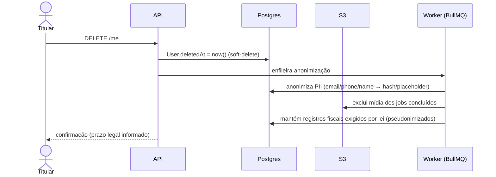
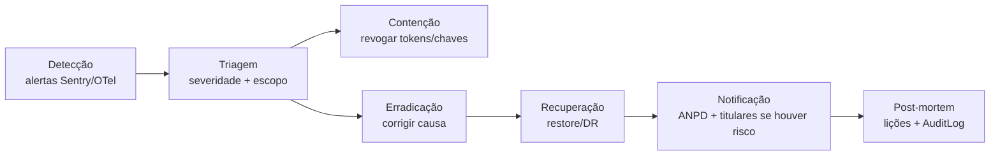

# 06 — Segurança & LGPD

> Postura de segurança e conformidade com a **LGPD (Lei 13.709/2018)** do JardimJá. Cobre bases
> legais, direitos do titular, autenticação, criptografia, RBAC, validação, auditoria, tratamento de
> PII/mídia, resposta a incidentes e o mapeamento OWASP Top 10.

Relacionados: [Arquitetura](01-architecture.md) · [Banco de dados](02-database.md) ·
[APIs](03-api.md) · [Deploy](07-deployment.md)

---

## 1. Conformidade LGPD — visão geral

O JardimJá trata dados pessoais de clientes e jardineiros (identificação, contato, **localização
precisa**, documentos fiscais, mídia do imóvel, dados de pagamento). O tratamento segue os princípios
da LGPD: finalidade, adequação, necessidade (minimização), transparência, segurança e
responsabilização (accountability).

### 1.1 Bases legais (Art. 7º e 11º)

| Finalidade | Base legal | Observação |
| --- | --- | --- |
| Criar conta e prestar o serviço | **Execução de contrato** (Art. 7º, V) | Núcleo da relação |
| Matching geoespacial (localização) | **Execução de contrato** + **consentimento** | Consentimento explícito para localização precisa |
| Pagamentos e split | **Obrigação legal/contratual** | Retenção fiscal aplicável |
| Prevenção a fraude/abuso | **Legítimo interesse** (Art. 10º) | Com teste de proporcionalidade |
| Marketing e comunicações | **Consentimento** (revogável) | Opt-in granular |
| Analytics de produto | **Consentimento** / legítimo interesse | Dados minimizados/pseudonimizados |

### 1.2 Registro de consentimento

Cada consentimento é gravado em `ConsentRecord` (ver [banco](02-database.md#7-notificações-dispositivos-e-conformidade)):
`purpose` (marketing/analytics/data_processing/location…), `granted`, `version` (da política vigente),
`ip` e `createdAt`. Consentimentos são **granulares e revogáveis** via `GET/PUT /me/consents`. A
revogação cessa o tratamento correspondente sem afetar a base contratual do serviço.

### 1.3 Minimização e retenção

- Coleta-se apenas o necessário por finalidade; localização precisa só quando há job ativo.
- **Política de retenção** por categoria:

| Dado | Retenção | Após o prazo |
| --- | --- | --- |
| Conta ativa | Enquanto ativa | — |
| Mídia do job (fotos/vídeo) | 180 dias após conclusão | Exclusão do S3 |
| Registros fiscais/pagamento | Prazo legal (ex.: 5 anos) | Retenção obrigatória |
| Logs de auditoria (`AuditLog`) | 12–24 meses | Purga |
| Conta após exclusão | Anonimização imediata (ver §3.3) | Dados fiscais mantidos por lei |

---

## 2. Papéis e responsabilidades

| Papel LGPD | Quem | Responsabilidade |
| --- | --- | --- |
| **Controlador** | JardimJá | Define finalidades e meios do tratamento |
| **Operadores** | Provedores (S3, IA, pagamentos, FCM, mapas) | Tratam dados em nome do controlador (via DPA) |
| **Encarregado (DPO)** | Contato designado | Canal com titulares e ANPD |

Os provedores externos que atuam como operadores devem ter **DPA** (Data Processing Agreement) e,
quando houver transferência internacional (IA/nuvem), cláusulas de transferência adequadas.

---

## 3. Direitos do titular

Exercidos pelos endpoints de [`/me`](03-api.md#11-direitos-do-titular-lgpd).

### 3.1 Acesso e portabilidade
`GET /me/export` gera um dump estruturado (JSON) de todos os dados do titular — perfil, jobs,
mensagens, avaliações, consentimentos — para acesso e portabilidade.

### 3.2 Correção
`PATCH /me` permite corrigir dados cadastrais; alterações sensíveis geram entrada em `AuditLog`.

### 3.3 Eliminação — direito ao esquecimento (soft-delete)
`DELETE /me` executa o fluxo de esquecimento:

- `User.deletedAt` marca o soft-delete; a conta some das superfícies imediatamente.
- Um worker anonimiza PII e remove mídia, **preservando** o que a lei exige (dados fiscais dos
  pagamentos), de forma pseudonimizada e desvinculada da identidade.
- Relações `onDelete: Cascade` (endereços, dispositivos, consentimentos) são removidas quando
  aplicável.

### 3.4 Revogação de consentimento
`PUT /me/consents` grava novo `ConsentRecord` com `granted:false`; o tratamento vinculado cessa.

### 3.5 Oposição e informação
Solicitações via DPO; toda ação é registrada em `AuditLog` (prova de atendimento no prazo).

---

## 4. Autenticação e gestão de sessão

| Controle | Implementação |
| --- | --- |
| Hash de senha | **argon2** (`argon2` lib) — resistente a GPU/ASIC |
| Tokens | **JWT** access (`JWT_ACCESS_TTL=900s`) + refresh (`JWT_REFRESH_TTL=30d`) |
| Rotação de refresh | Refresh token rotacionado a cada uso; token antigo revogado (detecção de reuso) |
| 2FA | `twoFactorEnabled` no `User`; TOTP no login sensível |
| Federação | Supabase/Firebase opcional (`authProvider`/`authSubject`) |
| Segredo JWT | `JWT_SECRET` (32+ chars) via secret manager, nunca no código |
| Papéis | Guards NestJS por `UserRole` (CLIENT/GARDENER/ADMIN/SUPPORT) |

**Rotação de refresh (detecção de reuso)**: cada refresh emite um novo par e invalida o anterior. Se
um refresh já usado reaparecer, toda a família de tokens é revogada (indício de roubo).

---

## 5. Criptografia

| Camada | Controle |
| --- | --- |
| **Em trânsito** | TLS 1.2+ em todas as conexões (clientes, API, DB, Redis, S3). HSTS via `helmet`. |
| **Em repouso** | **AES-256**: RDS/Postgres criptografado, volumes EBS, buckets S3 (SSE), Redis com encryption-at-rest. |
| **Mídia** | Objetos privados no S3; acesso só por **URL pré-assinada** de curta duração. |
| **Segredos** | Fora do código: AWS Secrets Manager / SSM Parameter Store; injetados como env em runtime. |
| **PII sensível** | CPF/CNPJ e documentos com acesso restrito e mascaramento nos logs. |

---

## 6. RBAC e autorização

- **Autorização por papel**: guards por `UserRole`.
- **Autorização por propriedade**: além do papel, verifica-se posse do recurso (o cliente só acessa
  seus jobs; o jardineiro só os jobs em que ofertou/foi escolhido). O `Offer.gardenerUserId`
  denormalizado agiliza essa checagem.
- **Salas WebSocket**: só participantes do job entram nos namespaces `/tracking` e `/chat`.
- **Admin**: rotas `/admin/*` restritas a `ADMIN`/`SUPPORT`, com auditoria de toda ação.

---

## 7. Validação de entrada e proteção de superfície

| Controle | Implementação |
| --- | --- |
| Validação de DTO | **class-validator** + **class-transformer** (whitelist, forbidNonWhitelisted) |
| Validação de domínio/JSONB | **Zod** (`@jardimja/shared`) na borda — laudos de IA, quotes, geo |
| Cabeçalhos de segurança | **helmet** (CSP, HSTS, no-sniff, frameguard) |
| Rate limiting | **@nestjs/throttler** (ver [APIs §9](03-api.md#9-rate-limiting)) |
| CORS | Origens permitidas por ambiente (`WEB_ADMIN_URL` etc.) |
| Upload | Tipos/limites de mídia validados; verificação de MIME; antivírus opcional no pipeline |
| SQL | Prisma parametrizado; SQL bruto (PostGIS) sempre com bind params |

---

## 8. Auditoria e logging

- **`AuditLog`** registra ações sensíveis: `actorId`, `action`, `entityType`, `entityId`,
  `metadata`, `ip`, `createdAt`. Índices por entidade, ator e data. Cobre transições de estado de
  job, verificações de jardineiro, resolução de disputas, mudanças de config de preço e exercício de
  direitos LGPD.
- **Logs estruturados** com **pino** (`nestjs-pino`/`pino-http`), com **redaction** de PII (email,
  telefone, tokens, CPF). Correlação por request-id.
- Observabilidade (Sentry, OpenTelemetry) em [Deploy](07-deployment.md#6-observabilidade).

---

## 9. Tratamento de mídia e PII

- Mídia do job é **privada por padrão** no S3; entregue via CDN somente por URL assinada.
- Metadados EXIF (incluindo GPS) são **removidos** no processamento antes do armazenamento, exceto o
  necessário ao serviço.
- Retenção de mídia limitada (§1.3) e excluída no fluxo de esquecimento.
- Logs nunca registram PII em claro (redaction do pino).

---

## 10. Resposta a incidentes

Plano de resposta alinhado à LGPD (comunicação à ANPD e titulares em prazo razoável):

1. **Detecção** via monitoramento (Sentry, alertas de segurança, anomalias de rate limit).
2. **Contenção**: revogação de tokens/segredos, isolamento de instâncias comprometidas.
3. **Avaliação de risco** aos titulares; se houver risco relevante, **notificação à ANPD e aos
   titulares** em prazo razoável.
4. **Post-mortem** sem culpa e registro em trilha de auditoria.

---

## 11. Modelo de ameaças — OWASP Top 10

| OWASP 2021 | Mitigação no JardimJá |
| --- | --- |
| A01 Broken Access Control | RBAC por papel + autorização por propriedade; guards; salas WS restritas |
| A02 Cryptographic Failures | TLS em trânsito, AES-256 em repouso, argon2 para senhas, segredos em vault |
| A03 Injection | Prisma parametrizado; PostGIS com bind params; validação class-validator/Zod |
| A04 Insecure Design | Escrow com captura só na aprovação; quorum de IA; determinismo auditável |
| A05 Security Misconfiguration | helmet, CORS restrito, imagens mínimas, secrets fora do código |
| A06 Vulnerable Components | Dependabot/`pnpm audit` + dependency review no CI (ver [CI/CD](08-cicd.md)) |
| A07 Identification & Auth Failures | JWT curto + rotação de refresh com detecção de reuso, 2FA, rate limit no auth |
| A08 Software & Data Integrity | Webhooks assinados e idempotentes; `breakdownVersion` reprodutível; CodeQL |
| A09 Logging & Monitoring Failures | `AuditLog` + pino estruturado + Sentry/OTel; alertas |
| A10 SSRF | Fetch de mídia por URLs controladas/assinadas; egress restrito nos workers de IA |

---

Anterior: [« 03 — APIs](03-api.md) · Próximo: [07 — Deploy »](07-deployment.md)
