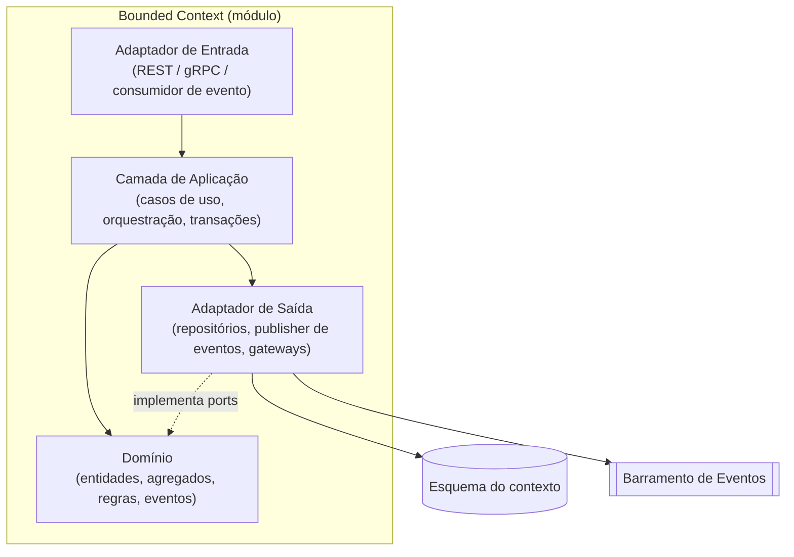
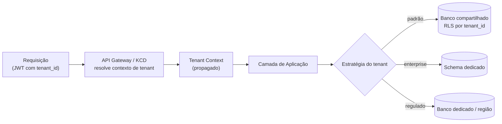
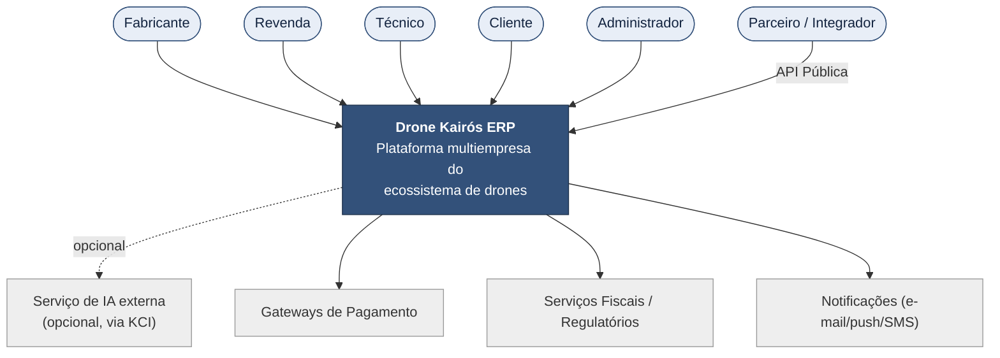
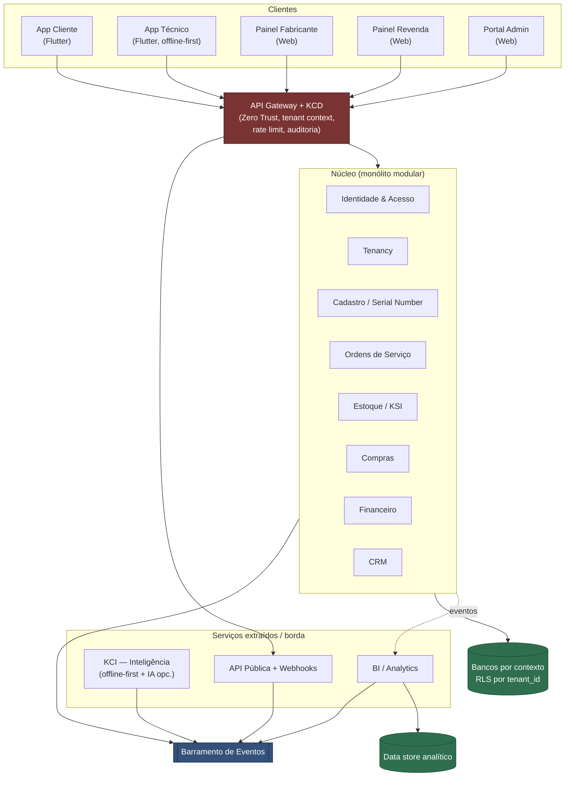
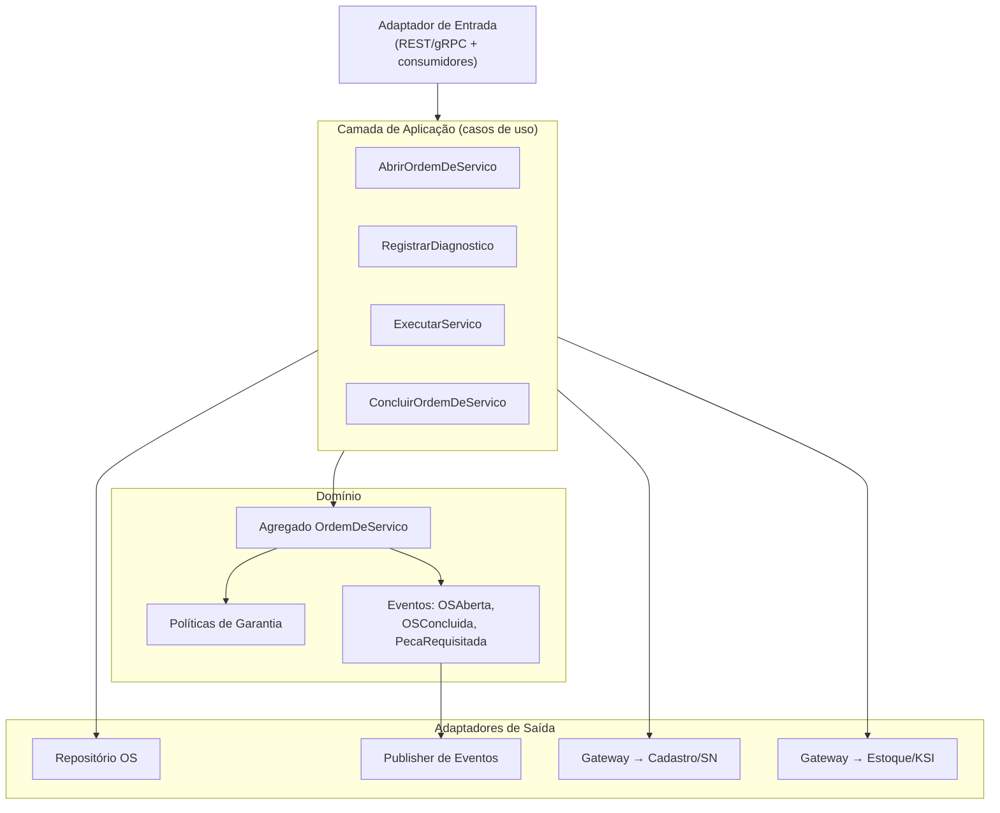
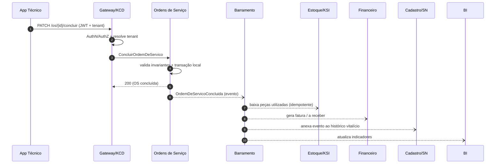
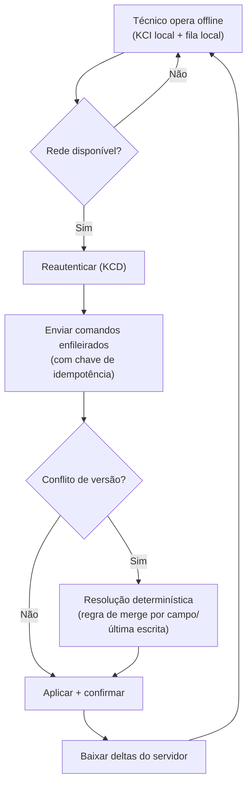
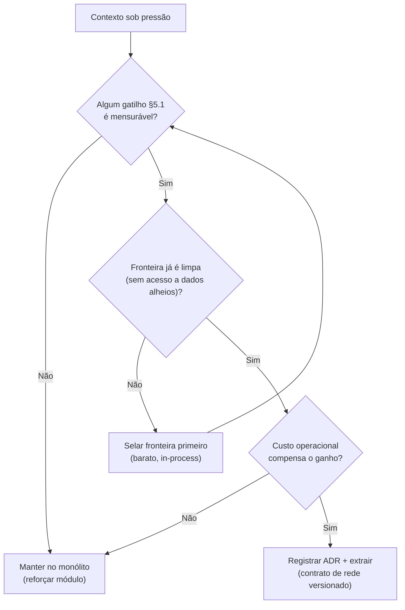
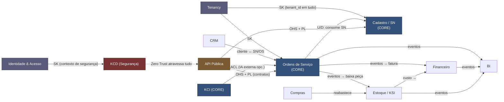

# 07 — Arquitetura · Drone Kairós ERP

**Documento:** `07 — Arquitetura`
**Versão:** 1.0 · **Data:** 21 de julho de 2026 · **Status:** Ativo
**Dependências:** `00 — Master Prompt`, `01 — Constituição`, `02 — Project Bible`, `03 — Roadmap`, `04 — Pesquisa de Mercado`, `05 — Benchmark`, `06 — Requisitos`
**Responsável:** Arquiteto de Software

---

## 1. Resumo Executivo

Este documento define a **arquitetura de referência** do Drone Kairós ERP: a plataforma completa de gestão do ecossistema de drones que conecta **fabricante → revenda → técnico → cliente** sob rastreabilidade vitalícia por **Serial Number (SN)** e isolamento **multiempresa (multi-tenant)** de primeira classe.

A decisão estrutural central é adotar um **monólito modular orientado a Domain-Driven Design (DDD)**, com fronteiras de contexto (*bounded contexts*) explícitas e comunicação interna por contratos, **evoluindo seletivamente para microsserviços** apenas onde a extração seja justificada por escala, isolamento de falha, cadência de deploy independente ou requisito regulatório. Essa escolha equilibra velocidade de entrega nas fases iniciais do roadmap (Fase 3) com a capacidade de escalar por domínio nas fases avançadas (Fases 4–6), sem pagar antecipadamente o custo operacional de um sistema distribuído.

A arquitetura assenta sobre cinco pilares herdados da Constituição (Artigo IV): **arquitetura antes de código**, **DDD com fronteiras explícitas**, **multiempresa como requisito de primeira classe**, **segurança por padrão (Zero Trust via KCD)** e **contratos de API primeiro**. A esses somam-se **observabilidade nativa** e o registro de toda decisão relevante como **ADR**.

O modelo recomendado de multi-tenancy é **isolamento por linha com `tenant_id` (row-level) reforçado por Row-Level Security no banco**, com caminho de **promoção para schema-por-tenant ou banco-por-tenant** para clientes enterprise que exijam isolamento físico ou residência de dados. A comunicação é **híbrida**: síncrona (REST público, gRPC/in-process interno) para consultas e comandos com resposta imediata; assíncrona (eventos de domínio sobre um barramento) para propagação de fatos, integração entre contextos e desacoplamento temporal.

## 2. Objetivos

- Estabelecer a **visão arquitetural em níveis** (estilo C4: contexto, containers, componentes) como linguagem comum entre negócio e engenharia.
- Definir os **bounded contexts** do domínio e o **context map** que os relaciona.
- Fixar a **decisão de estilo arquitetural** (monólito modular → microsserviços) com trade-offs explícitos e critérios de extração.
- Recomendar a **estratégia de multi-tenancy** e seu caminho de evolução.
- Definir os **padrões de comunicação** síncrona e assíncrona entre contextos.
- Integrar **segurança por design** (KCD/Zero Trust) e **observabilidade** desde o núcleo.
- Listar os **ADRs-chave** que esta arquitetura obriga a registrar.

## 3. Escopo

**Coberto:** a arquitetura lógica e de execução de toda a plataforma — ERP, CRM, Financeiro, BI, API pública, apps Flutter (cliente/técnico), painéis web (fabricante/revenda/admin) e os módulos proprietários **KCI** (inteligência offline-first), **KCD** (cibersegurança Zero Trust) e **KSI** (estoque inteligente). Inclui bounded contexts, context map, estilo arquitetural, multi-tenancy, comunicação, segurança por design e observabilidade em nível arquitetural.

**Não coberto aqui (delegado):** modelagem de dados detalhada e estratégia de SN → `08`; contratos de API e mensageria em detalhe → `09`; padrões de código e camadas → `10`; detalhamento do KCI → `13`; do KCD → `14`; do KSI → `15`; observabilidade operacional (stacks, dashboards) → `19`. Este documento estabelece as **fronteiras e princípios**; os documentos citados aprofundam cada eixo.

## 4. Regras (Princípios Arquiteturais)

Princípios inegociáveis, subordinados à Constituição e ao Bible. Cada um é testável e serve de critério em revisão arquitetural (etapa 035).

| # | Princípio | Regra prática | Origem |
|---|---|---|---|
| P1 | **Fronteiras explícitas** | Todo código pertence a exatamente um bounded context; dependências entre contextos só por contrato público (API/evento), nunca por acesso direto a tabelas alheias. | Const. Art. IV |
| P2 | **Multiempresa por padrão** | Nenhuma consulta cruza `tenant_id`; isolamento é imposto por infraestrutura (RLS), não por disciplina do desenvolvedor. | Const. Art. IV |
| P3 | **API-first** | O contrato (OpenAPI/Protobuf) é escrito e revisado antes da implementação. | Const. Art. IV |
| P4 | **Segurança por padrão** | Zero Trust: autenticar e autorizar em cada salto; negar por omissão; criptografar em trânsito e em repouso. | KCD / Art. II.2 |
| P5 | **Rastreabilidade** | Toda mutação de estado relevante emite evento de domínio auditável. | Const. Art. II.3 |
| P6 | **Offline-first onde crítico** | Apps de campo (técnico) e KCI operam sem rede; sincronização é eventual e resolve conflitos de forma determinística. | Const. Art. II.4 |
| P7 | **Observável por construção** | Todo serviço expõe logs estruturados, métricas e tracing correlacionados por `trace_id` e `tenant_id`. | Doc 19 |
| P8 | **Evolução justificada** | Extrair um microsserviço exige ADR com gatilho mensurável; não se distribui por moda. | Este doc §5 |
| P9 | **Idempotência e reprocessamento** | Consumidores de eventos são idempotentes; comandos externos aceitam chave de idempotência. | Este doc §5.5 |
| P10 | **Dados de um contexto pertencem ao contexto** | Sem banco compartilhado entre contextos como canal de integração; cada contexto é dono do seu esquema. | DDD |

## 5. Arquitetura (o núcleo)

### 5.1 Estilo arquitetural: monólito modular → microsserviços

O sistema nasce como **monólito modular**: um único artefato deployável (por camada de aplicação) internamente particionado em módulos que correspondem 1:1 aos bounded contexts. Cada módulo tem seu próprio pacote, seu esquema de dados lógico e uma **API interna explícita** (interface de aplicação). A comunicação entre módulos ocorre **in-process** por essas interfaces ou por **eventos de domínio** publicados num barramento — jamais por acesso direto ao armazenamento de outro módulo (P1, P10).

Essa disciplina cria um **monólito pronto para desmembrar**: como as fronteiras já são reais no código (não apenas convencionais), extrair um módulo para serviço próprio é uma operação de **empacotamento e transporte**, não de reescrita.

**Camadas internas (por bounded context)** — arquitetura hexagonal / ports & adapters:

**Critérios objetivos de extração para microsserviço (gatilhos de ADR — P8):**

| Gatilho | Sinal mensurável | Contexto candidato típico |
|---|---|---|
| Escala assimétrica | Um contexto consome > 40% dos recursos ou precisa escalar horizontalmente sozinho | BI, KCI (inferência) |
| Isolamento de falha | Falha no contexto ameaça disponibilidade do núcleo transacional | Integrações externas, API Pública |
| Cadência de deploy | Necessidade de release independente > 3× a do monólito | KCI, BI |
| Requisito regulatório | Residência/segregação de dados exigida por contrato ou lei | Tenancy enterprise, Financeiro |
| Perfil tecnológico distinto | Runtime/linguagem diferente (ex.: pipeline de visão computacional, modelos) | KCI |
| Fronteira de segurança | Superfície de ataque que se beneficia de isolamento de rede | KCD, API Pública |

**Trade-offs do estilo:**

| Critério | Monólito modular | Microsserviços | Escolha Kairós |
|---|---|---|---|
| Velocidade inicial | Alta | Baixa (overhead de infra) | **Monólito** nas Fases 3–4 |
| Custo operacional | Baixo | Alto (orquestração, malha, observabilidade distribuída) | Monólito enquanto possível |
| Escala independente | Limitada | Nativa | **Extrair** onde gatilho §5.1 |
| Consistência transacional | Forte (transação local) | Eventual (saga) | Manter forte no núcleo (OS, Financeiro) |
| Isolamento de falha | Fraco | Forte | Extrair fronteiras de risco (API Pública, KCI) |
| Complexidade cognitiva | Concentrada | Distribuída | Reduzir com módulos bem selados |
| Refatoração de fronteiras | Barata (in-process) | Cara (contrato de rede) | Monólito permite corrigir fronteiras cedo |

**Candidatos naturais à extração precoce** (já projetados como serviços desde a Fase 4): **KCI** (perfil de runtime distinto e cadência própria), **BI** (escala de leitura assimétrica) e **API Pública** (fronteira de segurança e isolamento de falha). O **núcleo transacional** (Identidade, Cadastro/SN, Ordens de Serviço, Estoque, Compras, Financeiro) permanece coeso pelo maior tempo possível, pois se beneficia de **consistência transacional forte**.

### 5.2 Bounded contexts

Doze contextos delimitados, agrupados por natureza. Cada um é dono do seu modelo e do seu esquema (P10).

| # | Bounded Context | Responsabilidade nuclear | Natureza | Extração |
|---|---|---|---|---|
| 1 | **Identidade & Acesso** | Autenticação, usuários, papéis, permissões, sessões, MFA. | Núcleo/Genérico | Tardia |
| 2 | **Tenancy** | Ciclo de vida de empresas, planos, isolamento, provisionamento, contexto de tenant. | Suporte transversal | Tardia |
| 3 | **Cadastro / Serial Number** | Registro de equipamentos, identidade vitalícia por SN, genealogia, histórico de propriedade. | **Núcleo (core domain)** | Nunca (é o coração) |
| 4 | **Ordens de Serviço (OS)** | Diagnóstico, execução, ciclo de vida do serviço técnico, garantia. | **Núcleo (core domain)** | Tardia |
| 5 | **Estoque / KSI** | Itens, movimentações, saldos, curva ABC, reposição, códigos (barras/QR/RFID/NFC). | Núcleo | Média |
| 6 | **Compras** | Fornecedores, pedidos de compra, recebimento, integração com estoque. | Suporte | Média |
| 7 | **Financeiro** | Contas a pagar/receber, faturamento, fluxo de caixa, conciliação. | Núcleo | Média (regulatório) |
| 8 | **CRM** | Clientes, oportunidades, pós-venda, relacionamento, atendimento. | Suporte | Média |
| 9 | **BI** | Indicadores, dashboards, agregações analíticas, relatórios. | Genérico/Analítico | **Precoce** |
| 10 | **Inteligência / KCI** | Base de conhecimento, RAG local, sistema especialista, OCR/visão, preditivo/generativo, IA externa opcional. | **Núcleo diferenciador** | **Precoce** |
| 11 | **Segurança / KCD** | Zero Trust, autorização, auditoria, detecção de ameaças, criptografia, SOC, backup/DR. | Transversal | Precoce (isolamento) |
| 12 | **API Pública** | Gateway externo, contratos versionados, webhooks, chaves/quotas, integrações de parceiros. | Transversal/Borda | **Precoce** |

Classificação por **Core Domain Chart**: **SN** e **OS** são o *core domain* (vantagem competitiva, rastreabilidade vitalícia); **KCI** é o *core* diferenciador; **KSI/KCD** são diferenciadores de suporte; **Identidade, Tenancy, BI** são genéricos/de suporte (candidatos a soluções consolidadas onde fizer sentido).

### 5.3 Multi-tenancy

Três estratégias possíveis, avaliadas:

| Estratégia | Isolamento | Custo/densidade | Operação | Residência de dados | Uso recomendado |
|---|---|---|---|---|---|
| **Row-level (`tenant_id` + RLS)** | Lógico (imposto pelo banco) | Excelente (alta densidade) | Simples (1 esquema, 1 pipeline de migração) | Compartilhada | **Padrão** — maioria dos tenants |
| **Schema por tenant** | Médio (namespaces separados) | Bom (dezenas–centenas) | Migração multiplicada por tenant | Compartilhada (mesma instância) | Tenants médios com requisito de separação |
| **Banco por tenant** | Forte (físico) | Baixo (custo alto por tenant) | Complexa (N instâncias, N backups) | Dedicada / por região | Enterprise, regulados, residência exigida |

**Recomendação (a formalizar em ADR — etapa 024): row-level com `tenant_id` obrigatório em todas as tabelas de negócio, reforçado por Row-Level Security (RLS) no banco**, de modo que o isolamento não dependa da disciplina do desenvolvedor (P2). A cada requisição, o **contexto de tenant** é resolvido no gateway (a partir do token) e propagado por toda a cadeia; a sessão de banco é configurada com o `tenant_id` corrente, e a RLS impede qualquer vazamento entre empresas — inclusive em caso de bug de query.

O modelo prevê **caminho de promoção**: um tenant pode ser **migrado para schema dedicado ou banco dedicado** (mesmo código, adaptador de persistência distinto) quando o contrato exigir isolamento físico ou residência regional. Isso mantém a densidade e o custo baixos por padrão, sem fechar a porta ao isolamento forte.

### 5.4 Comunicação síncrona × assíncrona

Modelo **híbrido**, escolhido por natureza da interação:

| Dimensão | Síncrona | Assíncrona |
|---|---|---|
| Protocolo | REST (externo, API Pública) · gRPC/in-process (interno) | Eventos de domínio sobre barramento |
| Quando usar | Comando/consulta que exige resposta imediata; leitura sob demanda | Propagação de fato consumado; integração entre contextos; trabalho diferido |
| Acoplamento | Temporal (chamador espera) | Desacoplado no tempo |
| Consistência | Forte (transação) | Eventual (por saga/projeção) |
| Falha | Propaga (timeout, circuit breaker) | Absorvida (fila, retry, DLQ) |
| Exemplo Kairós | Abrir OS, autenticar, consultar saldo de estoque | "OS concluída" → KSI baixa peça, Financeiro fatura, BI agrega |

Regras de uso:
- **Comandos que mudam estado dentro de um contexto** → transação local síncrona.
- **Reações de outros contextos a um fato** → evento de domínio assíncrono (P5). Ex.: `OrdemDeServicoConcluida` dispara baixa de estoque (KSI), faturamento (Financeiro) e agregação (BI).
- **Fluxos multi-contexto com invariantes** (ex.: reserva de peça → execução → faturamento) → **saga** orquestrada, com passos compensatórios; nunca transação distribuída de duas fases no núcleo.
- **Idempotência** obrigatória em todo consumidor e comando externo (P9), via chave de idempotência e `event_id` deduplicado.
- Onde consistência de leitura entre contextos importa, usar **CQRS** com projeções materializadas (especialmente BI e painéis).

### 5.5 Segurança por design (integração com KCD)

O **KCD** não é um módulo periférico: é a **camada de confiança Zero Trust** que atravessa toda requisição (P4). Detalhamento em `14`; aqui, os pontos de integração arquitetural:

- **Autenticação forte** no gateway (tokens de curta duração, MFA, rotação de chaves); **autoriza-se em cada salto**, nunca só na borda.
- **Autorização por política** (RBAC + atributos de tenant/papel) avaliada na camada de aplicação de cada contexto — negar por omissão.
- **Isolamento de tenant** como controle de segurança (RLS), não apenas de dados (P2).
- **Auditoria imutável**: todo evento de domínio sensível alimenta a trilha de auditoria do KCD (append-only), correlacionada por `trace_id` e `tenant_id`.
- **Criptografia** em trânsito (TLS) e em repouso; segredos em cofre; PII segregada.
- **Superfícies isoladas**: API Pública e integrações externas ficam em fronteira de rede própria (candidatas à extração precoce), com quotas, rate limiting e detecção de anomalia.
- **Offline-first seguro** (P6): dados em cache no app do técnico são criptografados; a sincronização reautentica e revalida autorização.

### 5.6 Observabilidade

Três sinais correlacionados, nativos em cada contexto (P7); operacionalização em `19`:

- **Logs estruturados** (JSON) com `trace_id`, `tenant_id`, `context`, `user_id` — nunca PII em claro.
- **Métricas** RED (Rate, Errors, Duration) por caso de uso e por contexto, além de métricas de negócio (OS por status, giro de estoque, latência de inferência KCI).
- **Tracing distribuído** propagado por todos os saltos (síncronos e assíncronos — o `trace_id` viaja no envelope do evento), permitindo reconstruir uma saga ponta a ponta.
- **Correlação obrigatória por tenant**, para diagnosticar problemas isolando a empresa afetada sem violar isolamento.

## 6. Diagramas (C4 / Mermaid)

### 6.1 Nível 1 — Contexto de Sistema (C4)

### 6.2 Nível 2 — Containers (C4)

### 6.3 Nível 3 — Componentes do contexto Ordens de Serviço (C4)

## 7. Fluxogramas

### 7.1 Fluxo transversal — Conclusão de Ordem de Serviço (síncrono + eventos)

### 7.2 Fluxo — Sincronização offline-first do App Técnico

### 7.3 Fluxograma de decisão — Extrair um microsserviço?

## 8. Boas Práticas

- **Selar antes de dividir:** endurecer fronteiras de módulo no monólito é o pré-requisito de qualquer extração; corrigir fronteira in-process é barato, corrigir em rede é caro.
- **Contrato antes de código** (P3): OpenAPI para o externo, Protobuf para gRPC interno, esquema de evento versionado para o barramento.
- **Eventos como fatos no passado**, nomeados no domínio (`OrdemDeServicoConcluida`), nunca comandos disfarçados.
- **Idempotência sempre** em consumidores e comandos externos; toda mensagem carrega `event_id` e `trace_id`.
- **`tenant_id` nunca é opcional** e nunca é parâmetro de query controlado pela aplicação — vem do contexto de tenant resolvido no gateway (P2).
- **Migrações versionadas** e compatíveis para frente; sem *schema* compartilhado como canal de integração (P10).
- **Feature flags** para desacoplar deploy de release e permitir rollout progressivo por tenant.
- **Toda decisão estrutural vira ADR** (Const. Art. VI.4).

## 9. Padrões (Táticos e Estratégicos de DDD)

**Estratégicos:**
- *Bounded Context* + *Ubiquitous Language* por contexto (glossário no Bible).
- *Context Mapping* com padrões de relacionamento explícitos (§11).
- *Core Domain Chart* para priorizar investimento (SN, OS e KCI recebem o melhor esforço de modelagem).
- *Anti-Corruption Layer (ACL)* em toda integração com serviços externos (IA externa, fiscal, pagamento) e entre contextos com modelos divergentes.

**Táticos:**
- *Aggregates* com raiz e invariantes (ex.: `OrdemDeServico`, `Equipamento` por SN); transação nunca cruza agregado.
- *Domain Events* como mecanismo de integração e auditoria (P5).
- *Repositories* por agregado; *Value Objects* para conceitos imutáveis (SN, dinheiro, endereço).
- *Application Services* orquestram casos de uso e transações; *Domain Services* para regras sem dono natural.
- *CQRS* onde leitura e escrita divergem (BI, painéis, projeções).
- *Saga* para consistência entre contextos com passos compensatórios.
- *Outbox pattern* para publicação transacional confiável de eventos (evita evento perdido/duplicado na fronteira banco↔barramento).

## 10. Casos de Uso (Cenários Arquiteturais)

- **CA-1 · Rastreabilidade vitalícia:** ao vender, transferir ou reparar um equipamento, cada fato é anexado ao histórico do SN (contexto Cadastro/SN) via evento — reconstrói-se a vida inteira do drone independentemente de qual contexto originou o fato.
- **CA-2 · Diagnóstico offline:** técnico em campo sem rede usa o KCI local (RAG/sistema especialista) para diagnosticar; comandos ficam em fila idempotente e sincronizam ao reconectar (§7.2), sem perda e sem duplicação.
- **CA-3 · Escala do BI:** relatórios pesados não competem com o núcleo transacional porque o BI é extraído e lê de um *data store* próprio alimentado por eventos (CQRS) — escala de leitura sem impactar OS/Financeiro.
- **CA-4 · Tenant regulado:** cliente enterprise exige residência de dados; o mesmo código serve o tenant via **banco dedicado por região** (§5.3) — sem bifurcar a base de código.
- **CA-5 · Integração de parceiro:** integrador consome a API Pública versionada, isolada em fronteira de rede própria, com quota e webhooks — falha ou abuso do parceiro não degrada o núcleo (isolamento de falha).
- **CA-6 · IA externa opcional:** o KCI pode enriquecer diagnósticos com IA externa, sempre atrás de uma ACL e com *fallback* local — a plataforma nunca fica dependente nem inoperante sem o serviço externo.

## 11. Modelagem (Context Map)

Relacionamentos entre contextos com padrões de DDD estratégico: **U** = *Upstream*, **D** = *Downstream*, **ACL** = *Anti-Corruption Layer*, **OHS** = *Open Host Service*, **PL** = *Published Language*, **CF** = *Conformist*, **SK** = *Shared Kernel*.

**Leitura do mapa:**
- **Tenancy** e **Identidade & Acesso** funcionam como *Shared Kernel* transversal — o `tenant_id` e o modelo de identidade são compartilhados de forma controlada por todos.
- **Cadastro/SN** é *upstream* de quase tudo: OS, CRM e API Pública consomem sua identidade vitalícia.
- **OS** é o grande orquestrador transacional, publicando eventos que KSI, Financeiro, SN e BI consomem.
- **API Pública** expõe os contextos como *Open Host Service* com *Published Language* (contratos versionados) — parceiros nunca falam o modelo interno diretamente.
- **KCI** integra-se via *ACL*, isolando o núcleo de mudanças em provedores de IA externa.
- **KCD** é o único que legitimamente atravessa todos os contextos, como plano de controle de segurança.

## 12. Checklist

- ☑ Visão C4 em três níveis (contexto, containers, componentes) definida.
- ☑ 12 bounded contexts delimitados e classificados (core/suporte/genérico).
- ☑ Context map com padrões estratégicos explícitos.
- ☑ Estilo arquitetural decidido (monólito modular → microsserviços) com gatilhos de extração mensuráveis.
- ☑ Estratégia de multi-tenancy recomendada (row-level + RLS) com caminho de promoção.
- ☑ Modelo de comunicação híbrido (síncrono/assíncrono) com regras de uso.
- ☑ Segurança por design (KCD/Zero Trust) integrada à arquitetura.
- ☑ Observabilidade nativa (logs/métricas/tracing correlacionados) especificada.
- ☑ ADRs-chave listados (§13/§15).
- ☐ Modelagem de dados detalhada → delegada ao `08`.
- ☐ Contratos de API e mensageria detalhados → delegados ao `09`.

## 13. Riscos

| Risco | Impacto | Probab. | Mitigação |
|---|---|---|---|
| **Fronteiras erodidas** (módulos acessando dados alheios) | Alto — impede extração futura e quebra P1 | Média | Testes de arquitetura que proíbem dependências ilegais; revisão de fronteira em cada PR |
| **Monólito distribuído** (extração prematura sem fronteira limpa) | Alto — pior dos dois mundos | Média | Gatilhos §5.1 obrigatórios; ADR antes de extrair |
| **Vazamento entre tenants** | Crítico — quebra P2 e confiança | Baixa | RLS no banco (não só na aplicação); testes de isolamento por tenant |
| **Consistência eventual mal compreendida** | Médio — bugs de estado entre contextos | Média | Sagas explícitas, outbox, idempotência (P9); documentar invariantes |
| **Dependência de IA externa** (KCI) | Médio — indisponibilidade externa | Média | ACL + fallback local offline-first (CA-6) |
| **Explosão de custo operacional** ao distribuir cedo | Médio | Média | Manter núcleo coeso; extrair só BI/KCI/API Pública primeiro |
| **Auditoria incompleta** | Alto — regulatório/confiança | Baixa | Eventos de domínio como fonte de auditoria (P5); trilha append-only no KCD |

## 14. Melhorias Futuras

- **Malha de serviços (service mesh)** quando o número de serviços extraídos justificar mTLS e roteamento centralizados.
- **Event sourcing** para os contextos onde o histórico é o próprio ativo (Cadastro/SN, auditoria KCD) — avaliar após estabilização do modelo de eventos.
- **Multi-região ativa** para tenants regulados, com replicação e roteamento por residência de dados (Doc 24).
- **Plataforma de dados** (lakehouse) alimentando BI e o motor preditivo do KCI a partir do mesmo fluxo de eventos.
- **Contract testing automatizado** (consumidor/produtor) na API Pública e no barramento, como quality gate.
- **Chaos engineering** sobre as fronteiras de falha extraídas (API Pública, KCI) na Fase 5.

## 15. Auditoria

**ADRs-chave a registrar (obrigatórios):**

| ADR | Decisão | Etapa roadmap |
|---|---|---|
| ADR-001 | Estilo arquitetural: monólito modular DDD com extração seletiva | 023 |
| ADR-002 | Multi-tenancy: row-level + RLS, com promoção a schema/banco dedicado | 024 |
| ADR-003 | Identidade universal por Serial Number (estratégia de SN) | 026 |
| ADR-004 | Comunicação híbrida: REST/gRPC síncrono + eventos assíncronos | 029 |
| ADR-005 | Outbox + idempotência como padrão de publicação de eventos | 029 |
| ADR-006 | Zero Trust (KCD) como plano de controle transversal | 030 |
| ADR-007 | Observabilidade: correlação por `trace_id` + `tenant_id` | 031 |
| ADR-008 | Extração precoce de KCI, BI e API Pública como serviços | 027 |

**Consistência:**
- **Com a Constituição:** ✔ atende Art. IV (arquitetura antes de código, DDD, multiempresa, segurança por padrão, API-first) e Art. VI.4 (decisões viram ADR).
- **Com o Roadmap:** ✔ entrega as etapas 021–023 e alimenta 024–035; extração de KCI/BI alinhada à Fase 4.
- **Pendências delegadas:** modelagem de dados (`08`), contratos/mensageria (`09`), padrões de código (`10`), detalhamento KCI/KCD/KSI (`13`/`14`/`15`), observabilidade operacional (`19`).
- **Estado:** aprovado como v1.0; base para as etapas de fundação da Fase 2 e para os ADRs listados.

---
*Fim do `07 — Arquitetura` · v1.0*
