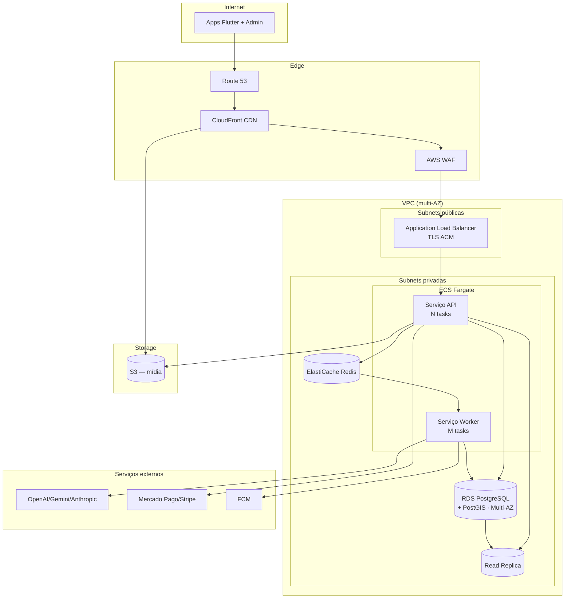
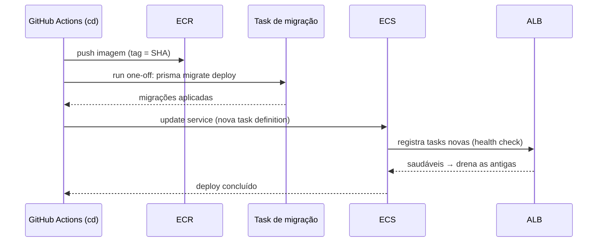

# 07 — Estratégia de Implantação em Nuvem

> Topologia de implantação de referência do JardimJá em **AWS**, com ambientes, imagens de contêiner,
> autoscaling, deploys zero-downtime, observabilidade, backups/DR e notas de custo. Artefatos de infra
> ficam em [`infra/`](../infra) (docker-compose, Dockerfiles, Terraform, k8s).

Relacionados: [Arquitetura](01-architecture.md) · [Banco de dados](02-database.md) ·
[CI/CD](08-cicd.md) · [Segurança & LGPD](06-security-lgpd.md)

---

## 1. Ambientes

| Ambiente | Propósito | Infra | Dados |
| --- | --- | --- | --- |
| **dev** (local) | Desenvolvimento | `docker compose` (Postgres+PostGIS, Redis, MinIO) via `pnpm infra:up` | Seed sintético; IA em modo `mock` |
| **staging** | Homologação/QA, réplica de prod | AWS reduzido (1 task, instâncias pequenas) | Dados anonimizados |
| **prod** | Produção | AWS com autoscaling e multi-AZ | Dados reais (LGPD) |

Configuração 100% por variáveis de ambiente (ver [`.env.example`](../.env.example)); segredos em
AWS Secrets Manager. Cada ambiente tem seu próprio conjunto de segredos e banco.

---

## 2. Imagens de contêiner

Dois artefatos a partir de `apps/api` (mesma base, comandos distintos), mais o admin estático:

| Imagem | Base | Comando | Papel |
| --- | --- | --- | --- |
| `jardimja-api` | `node:22-slim` (multi-stage) | `node dist/main.js` | Serve REST/GraphQL/WS |
| `jardimja-worker` | `node:22-slim` (multi-stage) | processa filas BullMQ | IA, notificações, calibração |
| `jardimja-web-admin` | build Vite → estático em S3/CloudFront | — | Painel React |

Build multi-stage: estágio de build roda `pnpm install` + `turbo run build` (com cache); o estágio
final copia apenas `dist/` + `node_modules` de produção, resultando em imagem enxuta. Os apps
**Flutter** (cliente/profissional) são publicados nas lojas (App Store / Play Store), fora deste
pipeline de contêiner.

---

## 3. Topologia AWS de referência

| Componente AWS | Serviço | Função |
| --- | --- | --- |
| **ECS Fargate** | Compute serverless | Tasks stateless de API e Worker |
| **RDS PostgreSQL + PostGIS** | Banco gerenciado, Multi-AZ | Fonte da verdade relacional/geo |
| **RDS Read Replica** | Réplica de leitura | GraphQL/BI (`DATABASE_REPLICA_URL`) |
| **ElastiCache Redis** | Cache + filas | BullMQ, cache, pub/sub WS |
| **S3 + CloudFront** | Storage + CDN | Mídia dos jobs, assets do admin |
| **ALB** | Load balancer L7 | Roteamento, TLS (ACM), sticky-less |
| **Route 53** | DNS | Domínios |
| **AWS WAF** | Firewall de aplicação | Bloqueia OWASP/abuso na borda |
| **Secrets Manager / SSM** | Segredos | Injeção em runtime |
| **CloudWatch** | Métricas/logs base | Alarmes de autoscaling |

> Alternativa portátil: os mesmos contêineres rodam em **Kubernetes** (manifests em `infra/k8s`),
> com HPA no lugar do autoscaling do ECS. A escolha ECS Fargate reduz overhead operacional inicial.

---

## 4. Autoscaling

| Serviço | Métrica de escala | Política |
| --- | --- | --- |
| API (ECS) | CPU/mem e requests/target | Target tracking (ex.: 60% CPU), min 2 / max N tasks, multi-AZ |
| Worker (ECS) | **Profundidade da fila** BullMQ (via métrica custom no CloudWatch) | Escala com backlog de IA/notificações |
| RDS | Vertical (instância) + Read replicas horizontais | Réplicas para leitura de BI |
| ElastiCache | Cluster mode / réplicas | Conforme throughput |

Separar API e Worker permite escalar o processamento de IA (picos de análise) sem inflar a camada
HTTP, e vice-versa.

---

## 5. Deploys zero-downtime e migrações

Estratégia **rolling / blue-green** no ECS, com health checks no ALB:

- **Migrações** rodam como task one-off (`prisma migrate deploy`) **antes** do rollout das tasks, e
  são escritas para serem **compatíveis para frente** (expand/contract): adiciona-se coluna → deploy
  do código que a usa → remove-se o antigo em release posterior. Assim código antigo e novo coexistem
  durante o rolling.
- **Health/readiness probes**: `GET /health` (liveness) e `GET /health/ready` (checa Postgres, Redis,
  S3) — o ALB só envia tráfego a tasks prontas.
- **Rollback**: reverter para a task definition anterior (imagem por SHA). Migrações expand/contract
  evitam que o rollback quebre o schema. Ver [rollback no CI/CD](08-cicd.md#7-rollback).

---

## 6. Observabilidade

| Pilar | Ferramenta | Detalhe |
| --- | --- | --- |
| **Logs** | **pino** (`nestjs-pino`) → CloudWatch/agregador | Estruturados, com redaction de PII e request-id |
| **Traces** | **OpenTelemetry** (`OTEL_EXPORTER_OTLP_ENDPOINT`) | Instrumentação HTTP/DB/fila; latência ponta-a-ponta |
| **Erros** | **Sentry** (`SENTRY_DSN`) | Captura de exceções + release tracking |
| **Métricas** | CloudWatch + métricas custom | Profundidade de fila, latência de IA, taxa de webhook |
| **Health** | `/health`, `/health/ready` | Probes ALB/ECS |

Dashboards-chave: latência de `analyze`, taxa de quorum de IA não atingido, profundidade das filas
BullMQ, sucesso de webhooks de pagamento, p95 do feed do marketplace.

---

## 7. Rede e segurança de infraestrutura

- API e Worker em **subnets privadas**; acesso à internet via NAT (egress controlado para provedores
  de IA/pagamento).
- RDS e ElastiCache sem exposição pública; security groups mínimos (só a partir das tasks ECS).
- TLS terminado no ALB (ACM); HSTS na aplicação (helmet).
- **WAF** na borda + Route 53. Segredos só via Secrets Manager. Ver [Segurança](06-security-lgpd.md).

---

## 8. Backup e Disaster Recovery

| Ativo | Backup | RPO / RTO alvo |
| --- | --- | --- |
| RDS Postgres | Snapshots automáticos + **PITR** (WAL) | RPO ~5 min / RTO < 1 h |
| Read replica | Promovível a primário | Failover de leitura/DR |
| S3 (mídia) | Versionamento + replicação cross-region | RPO ~min / RTO baixo |
| Redis | Snapshots (dados efêmeros/cache) | Reconstruível |
| IaC (Terraform) | Versionado no Git | Recria ambiente do zero |

- **DR multi-AZ** por padrão (RDS Multi-AZ, tasks em múltiplas AZs).
- Estratégia de retenção alinhada à [política LGPD](06-security-lgpd.md#13-minimização-e-retenção).
- Testes de restauração periódicos (game days).

---

## 9. Notas de custo

| Vetor | Otimização |
| --- | --- |
| Compute | Fargate com autoscaling e mínimos enxutos; Spot para Workers tolerantes a falha |
| **IA** (maior custo variável) | Cache de laudos, timeout por provedor, quorum mínimo, fallback `mock` em dev/CI |
| Egress/mídia | CloudFront reduz egress do S3; upload direto ao S3 evita passar pela API |
| Banco | Réplica de leitura só onde necessário; índices para consultas caras (feed, geo) |
| Observability | Amostragem de traces em prod; retenção de logs por política |

O maior driver de custo variável é a **inferência de IA**; por isso o pipeline é assíncrono,
com timeout, quorum e cache, e cai para `mock` quando não há chaves configuradas.

---

Anterior: [« 06 — Segurança & LGPD](06-security-lgpd.md) · Próximo: [08 — CI/CD »](08-cicd.md)
