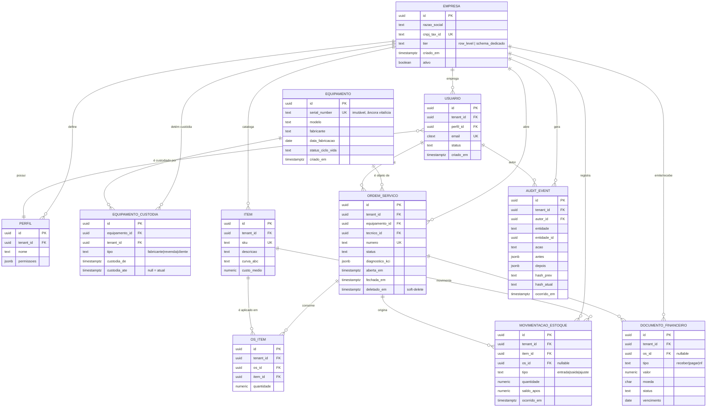

# 08 — Banco de Dados · Drone Kairós ERP

**Documento:** `08 — Banco de Dados`
**Versão:** 1.0 · **Data:** 21 de julho de 2026 · **Status:** Ativo
**Dependências:** `00 — Master Prompt`, `01 — Constituição`, `02 — Project Bible`, `03 — Roadmap`, `04 — Pesquisa de Mercado`, `05 — Benchmark`, `06 — Requisitos`, `07 — Arquitetura`
**Responsável:** Engenharia de Dados / DBA

---

## 1. Resumo Executivo

Este documento define a **camada de persistência** do Drone Kairós ERP: a estratégia de SGBD, o modelo lógico das entidades-âncora, o desenho de multi-tenancy no banco, a estratégia de histórico vitalício e as políticas operacionais (índices, particionamento, retenção, integridade e migrações).

A decisão fundamental é **PostgreSQL 16+ como núcleo relacional transacional** (OLTP), complementado por armazenamentos especializados **apenas onde o modelo relacional não é a melhor ferramenta**: séries temporais para telemetria/observabilidade, busca vetorial para o RAG do KCI, e objetos para documentos e mídias. O relacional permanece a **fonte de verdade** de todo dado de negócio.

Três pilares constitucionais guiam cada decisão desta camada (`01 — Constituição`, Artigos II e III):

1. **Multiempresa de primeira classe** → isolamento por `tenant_id` com **Row-Level Security (RLS)** aplicada por padrão, sem depender da disciplina da aplicação.
2. **Rastreabilidade total** → o **Serial Number (SN)** é a chave de negócio âncora e o **histórico vitalício** é garantido por um modelo híbrido (log append-only imutável + tabelas temporais + projeções).
3. **Segurança por padrão** → criptografia, princípio do menor privilégio, e nenhum dado sai de um tenant sem trilha de auditoria.

> **Recomendação central deste documento:** núcleo PostgreSQL com RLS por `tenant_id` (isolamento *row-level*), SN como *business key* com identidade técnica em `UUID`, e histórico vitalício por **log de auditoria append-only + tabelas temporais (`system-versioned` via triggers)**, reservando *event sourcing* completo apenas aos contextos de OS e Estoque.

## 2. Objetivos

- Definir a **estratégia de SGBD** (relacional como núcleo; complementos NoSQL/time-series/vetorial justificados por caso de uso).
- Especificar o **modelo lógico** das oito entidades-âncora, com relacionamentos, cardinalidades e atributos principais.
- Formalizar a **estratégia de Serial Number** como chave de negócio e âncora de rastreabilidade transversal.
- Escolher e justificar a abordagem de **histórico vitalício** (temporal × event sourcing × append-only).
- Desenhar o **isolamento multi-tenant** no banco (schema × row-level, RLS, políticas e chaves).
- Estabelecer políticas de **índices, particionamento, retenção e arquivamento**.
- Fixar regras de **integridade, constraints, soft-delete e versionamento de registros**.
- Definir o processo de **migrações** de esquema (versionadas, reversíveis, com *quality gate*).

## 3. Escopo

**Coberto:** modelo lógico e físico do banco transacional; multi-tenancy; SN e rastreabilidade; histórico/auditoria; particionamento e retenção; constraints e migrações; DDL ilustrativa das tabelas centrais; interfaces de persistência dos complementos (time-series, vetorial, objetos).

**Não coberto aqui (referências):** contratos de API e eventos (`09`), padrões de código/ORM de acesso (`10`), estratégia de segurança/criptografia detalhada e Zero Trust (`14`), lógica interna do KCI/RAG (`13`), lógica de KSI (`15`), observabilidade e pipelines (`19`), estratégia de testes de dados (`20`), backup/DR operacional (`14`/`19`) e multi-região (`24`). Este documento fornece os **contratos de dados**; os documentos citados fornecem a operação.

## 4. Regras

| # | Regra (inviolável nesta camada) | Origem |
|---|---|---|
| R-01 | **Toda** tabela de negócio possui `tenant_id NOT NULL` e é protegida por política RLS. | Constituição, Art. IV (multiempresa) |
| R-02 | Nenhuma linha cruza a fronteira de tenant sem trilha de auditoria explícita. | Art. II.3 / KCD |
| R-03 | O **Serial Number é imutável**; nunca é reusado, renomeado ou deletado fisicamente. | Art. III (SN universal) |
| R-04 | Nada de `DELETE` físico em dado de negócio: usa-se **soft-delete** + auditoria. Purga só por política de retenção formal. | Art. II.3 |
| R-05 | Chave primária técnica é sempre **`UUID` (v7, ordenável no tempo)**; a chave de negócio (ex.: SN) é *unique constraint* separada. | Padrão de dados |
| R-06 | Todo evento relevante gera registro **append-only imutável** no log de auditoria (`audit_event`). | Art. II.3 / KCD |
| R-07 | Migração de esquema é **versionada, revisável e reversível**; proibido `ALTER` manual em produção. | Art. VI.3 (arquitetura antes de código) |
| R-08 | Dados sensíveis são criptografados em repouso; PII segue minimização e política de retenção. | Art. V / LGPD |
| R-09 | Colunas monetárias usam `NUMERIC` (nunca `float`); tempo é sempre `TIMESTAMPTZ` (UTC). | Padrão de dados |
| R-10 | Toda FK entre entidades de negócio inclui `tenant_id` na relação (evita *cross-tenant join*). | R-01 + integridade |

## 5. Arquitetura de Dados

### 5.1 Estratégia de SGBD — Polyglot Persistence com núcleo relacional

O núcleo do sistema é **transacional e altamente relacional** (equipamentos, OS, estoque, financeiro exigem ACID, integridade referencial e consultas complexas). Portanto, **relacional é o núcleo**; NoSQL/time-series/vetorial entram como **complementos especializados**, nunca como fonte de verdade de negócio.

| Camada | Tecnologia | Papel | Justificativa |
|---|---|---|---|
| **Núcleo OLTP** | **PostgreSQL 16+** | Fonte de verdade de todo dado de negócio. | ACID, RLS nativa, particionamento declarativo, `JSONB`, `TIMESTAMPTZ`, extensões (pgvector, PostGIS), maturidade e ecossistema. |
| **Séries temporais** | **TimescaleDB** (extensão do Postgres) ou banco TSDB dedicado | Telemetria de voo/bateria, métricas de sensores, health-check de equipamentos. | Compressão nativa, *continuous aggregates*, retenção automática. Mantém compatibilidade SQL/Postgres. |
| **Busca vetorial (KCI)** | **pgvector** (extensão) | Embeddings do RAG local do KCI (Knowledge Base, manuais, histórico de diagnósticos). | Colocaliza vetor + metadado relacional no mesmo tenant; evita cópia de dados sensíveis. Escala para índice dedicado (Qdrant/Milvus) se o volume exigir. |
| **Documentos/JSON flexível** | `JSONB` no Postgres (ou DocumentDB se necessário) | Payloads semiestruturados: laudos de diagnóstico KCI, snapshots de configuração, respostas de dispositivos. | Evita explosão de tabelas EAV; indexável por GIN. |
| **Objetos/Mídia** | **Object Storage** (S3-compatível) | Fotos de OS, PDFs, firmwares, anexos. | O banco guarda **apenas metadados e ponteiros** (chave, hash, MIME), nunca o binário. |
| **Cache / filas de leitura** | **Redis** | Sessões, *rate limiting*, cache de projeções e *hot data*. | Latência; não é fonte de verdade (efêmero). |
| **Analytics/BI** | Réplica/Warehouse (ELT para colunar) | Dashboards BI (`16`), agregações pesadas. | Separa OLAP de OLTP; consome de réplica, nunca do primário transacional. |

**Princípio de fronteira:** o dado nasce e é validado no núcleo relacional. Complementos recebem **projeções** ou **cópias derivadas**; se um complemento for perdido, ele é **reconstruível** a partir do núcleo + log de auditoria.

### 5.2 Topologia física (visão)

```
                    ┌──────────────────────────────────────────┐
                    │            APLICAÇÃO (por serviço)         │
                    │   conexão com role de app + SET tenant     │
                    └───────────────┬──────────────────────────┘
                                    │ (RLS força tenant_id)
              ┌─────────────────────┴──────────────────────┐
              │        PostgreSQL 16 — Primário (OLTP)       │
              │  schemas: core, audit, kci, ksi, fin         │
              │  RLS por tenant_id · partições por tempo/tenant│
              └───┬──────────────┬─────────────┬────────────┘
                  │ streaming     │ logical      │ CDC (outbox)
        ┌─────────▼───┐   ┌──────▼──────┐  ┌────▼───────────┐
        │ Réplica RO  │   │ TimescaleDB │  │ Object Storage │
        │ (BI/relatório)│  │ (telemetria)│  │ (mídia/PDF)    │
        └─────────────┘   └─────────────┘  └────────────────┘
                  │
            ┌─────▼──────┐   ┌──────────────┐   ┌────────────┐
            │ pgvector   │   │   Redis      │   │  Warehouse │
            │ (RAG/KCI)  │   │ (cache/filas)│   │  (OLAP/BI) │
            └────────────┘   └──────────────┘   └────────────┘
```

### 5.3 Multi-tenancy no banco — decisão

Três modelos foram avaliados:

| Modelo | Isolamento | Custo operacional | Escala (nº tenants) | Veredito |
|---|---|---|---|---|
| **Banco por tenant** | Máximo | Muito alto (N bancos, N migrações, N backups) | Baixo (dezenas) | ❌ inviável para SaaS de escala |
| **Schema por tenant** | Alto | Alto (N schemas, migração fan-out) | Médio (centenas) | 🟡 opção para *tenants enterprise* dedicados |
| **Row-level (`tenant_id`) + RLS** | Lógico forte (garantido pelo SGBD) | Baixo (1 esquema, 1 migração) | Alto (milhares) | ✅ **padrão adotado** |

**Decisão (ADR-0005, a formalizar):** **row-level com `tenant_id` + RLS nativa do PostgreSQL** como padrão, com **schema dedicado** disponível como *tier* premium para clientes que exijam isolamento físico/compliance específico. RLS transforma o isolamento de "responsabilidade da aplicação" em **garantia do banco** — alinhado a "segurança por padrão".

**Mecânica da RLS:**
- A aplicação conecta com uma *role* sem `BYPASSRLS` e executa `SET app.current_tenant = '<uuid>'` no início da transação (via *pool* consciente de tenant).
- Cada tabela tem `POLICY` que filtra `tenant_id = current_setting('app.current_tenant')::uuid` para `SELECT/INSERT/UPDATE/DELETE`.
- Jobs administrativos usam role separada com escopo auditado.

### 5.4 Estratégia de Serial Number (SN)

O SN é a **âncora de rastreabilidade vitalícia** (Constituição, Art. III). Regras de modelagem:

- **Identidade técnica × chave de negócio:** cada equipamento tem `id UUID` (PK técnica) **e** `serial_number` (business key, `UNIQUE` global — ver nota de unicidade). Chaves estrangeiras internas referenciam o `UUID`; integrações e humanos referenciam o SN.
- **Unicidade:** o SN é **globalmente único no fabricante** e, na prática Kairós, **único na plataforma**. A `UNIQUE` é sobre `(serial_number)` normalizado (uppercase, sem espaços) — pois o histórico do SN é **transversal e vitalício**, podendo atravessar tenants ao longo da vida (fabricante → revenda → cliente). O vínculo de **posse** varia no tempo; o **SN não**.
- **Imutabilidade:** `serial_number` nunca é alterado (constraint + trigger de bloqueio). Correção de cadastro errado gera **novo equipamento + evento de migração**, nunca `UPDATE` do SN.
- **Rastreabilidade transversal:** todas as entidades de evento (OS, movimentação de estoque, telemetria, laudo KCI, documento financeiro) carregam referência ao equipamento (via `equipamento_id`), permitindo montar a **linha do tempo completa por SN** com uma única âncora.
- **Custódia entre tenants:** a relação equipamento↔tenant é **temporal** (tabela `equipamento_custodia`), não um campo fixo. Isso preserva o histórico vitalício mesmo quando o drone muda de dono, respeitando RLS (cada tenant vê apenas o trecho da vida sob sua custódia; o fabricante e o admin veem a linha completa conforme política).

### 5.5 Histórico Vitalício — abordagens e recomendação

Requisito constitucional: **"nada acontece sem registro"** e **"direito ao histórico completo do equipamento"** (Art. II.3, Art. V). Comparação das abordagens:

| Abordagem | O que é | Prós | Contras | Uso no Kairós |
|---|---|---|---|---|
| **Tabelas temporais** (*system-versioned*) | Cada tabela tem par `_history` com `valid_from/valid_to`; toda alteração arquiva a versão anterior. | Consulta "como era em T"; transparente ao domínio; baixo atrito. | Não modela *intenção* (só estados); crescimento das history tables. | ✅ **Padrão** para entidades mestre (equipamento, item, empresa, perfil). |
| **Event Sourcing** | Estado é derivado de um fluxo imutável de eventos de domínio; projeções materializam o "agora". | Auditoria perfeita, *time-travel*, *replay*, CQRS natural. | Complexidade alta, versionamento de eventos, curva de aprendizado. | ✅ **Seletivo** — apenas **OS** e **Movimentação de Estoque** (contextos com fluxo de eventos rico). |
| **Append-only Audit Log** | Log central imutável de eventos técnicos (quem/o quê/quando/antes/depois), fora do domínio. | Universal, à prova de adulteração (hash-chain), independente do modelo. | Não substitui reconstrução de estado; é registro, não fonte primária de projeção. | ✅ **Transversal e obrigatório** para todas as entidades. |

**Recomendação (modelo híbrido em três camadas):**

1. **`audit_event` (append-only, imutável, encadeado por hash)** — camada universal e obrigatória (R-06). Registra *toda* mutação relevante de *toda* entidade, com `hash_prev`/`hash_atual` (encadeamento estilo *blockchain* leve) para detecção de adulteração. É a espinha dorsal da rastreabilidade e da conformidade KCD.
2. **Tabelas temporais (`*_history`)** — para entidades mestre, viabilizando "estado em qualquer instante" sem custo cognitivo para o domínio.
3. **Event sourcing seletivo** — nos *bounded contexts* de **OS** e **Estoque**, onde a sequência de eventos *é* a regra de negócio (ex.: ciclo de vida da OS, movimentações que compõem o saldo).

A **linha do tempo por SN** é servida por uma *view*/projeção que une `audit_event` + eventos de OS + movimentações + telemetria, filtrando por `equipamento_id`.

## 6. Diagramas — Modelo ER (Mermaid)



## 7. Fluxogramas

### 7.1 Escrita transacional com RLS + auditoria

```
Requisição autenticada
   │
   ├─ App abre transação → SET app.current_tenant = <tenant do token>
   │
   ├─ INSERT/UPDATE em tabela de negócio
   │     └─ RLS valida tenant_id  ──(falha)──► ERRO (linha invisível / rejeitada)
   │
   ├─ Trigger AFTER escreve em audit_event (antes/depois + hash encadeado)
   │
   ├─ (contexto OS/Estoque) publica evento no outbox → CDC → projeções
   │
   └─ COMMIT  ──(rollback)──► auditoria da transação falha junto (atômico)
```

### 7.2 Montagem da linha do tempo vitalícia por SN

```
Entrada: serial_number
   │
   ├─ Resolve equipamento_id via UNIQUE(serial_number)
   │
   ├─ Une por equipamento_id:
   │     ├─ eventos de custódia (equipamento_custodia)
   │     ├─ ordens de serviço + eventos de OS (event store)
   │     ├─ movimentações de estoque relacionadas
   │     ├─ laudos/diagnósticos KCI (JSONB / vetorial)
   │     ├─ telemetria (TimescaleDB, agregada)
   │     └─ audit_event (todas as mutações)
   │
   ├─ Aplica RLS/visibilidade por perfil (cliente vê sua janela; fabricante/admin veem tudo)
   │
   └─ Ordena por ocorrido_em → TIMELINE VITALÍCIA
```

### 7.3 Ciclo de migração de esquema

```
Branch de migração → escreve migration UP + DOWN (versionada)
   → CI: aplica em banco efêmero + testa rollback + valida RLS/constraints
   → Revisão (DBA) → Quality Gate
   → Staging (expand) → Deploy código → Backfill → Contract (remove legado)
   → Produção (mesma sequência: expand → migrate → contract)
```

## 8. Boas Práticas

- **Expand-Migrate-Contract** para toda mudança de esquema (zero-downtime): primeiro adiciona o novo, migra dados, depois remove o antigo — nunca em um passo.
- **RLS "negar por padrão":** políticas restritivas; role de app **sem** `BYPASSRLS`; teste automatizado que tenta vazar entre tenants em cada PR.
- **UUID v7** como PK (ordenável no tempo → melhor localidade de índice que v4, sem expor sequência como *bigserial*).
- **`NUMERIC` para dinheiro**, `TIMESTAMPTZ` (UTC) para tempo, `citext`/normalização para e-mail e SN.
- **Índices dirigidos por consulta:** compostos iniciando por `tenant_id`; parciais para `deletado_em IS NULL`; GIN para `JSONB`/busca.
- **FKs sempre com `tenant_id` na relação** (R-10) e `ON DELETE RESTRICT` (soft-delete é a regra; cascata física é proibida em negócio).
- **Outbox pattern** para publicar eventos ao mesmo commit da escrita (consistência com `09 — API/Eventos`).
- **Conexões via pool consciente de tenant**; nunca reutilizar sessão sem resetar `app.current_tenant`.
- **Migrações idempotentes e reversíveis**; proibido DDL manual em produção (R-07).
- **Backup lógico + físico (PITR)**; testar restauração periodicamente (o backup não testado não existe).

## 9. Padrões

### 9.1 Convenções de nomenclatura

| Objeto | Padrão | Exemplo |
|---|---|---|
| Tabela | `snake_case`, singular | `ordem_servico` |
| Coluna | `snake_case` | `serial_number`, `criado_em` |
| PK | `id` (UUID v7) | `id uuid` |
| FK | `<entidade>_id` | `equipamento_id` |
| History | `<tabela>_history` | `equipamento_history` |
| Índice | `ix_<tabela>_<colunas>` | `ix_os_tenant_status` |
| Unique | `uq_<tabela>_<colunas>` | `uq_equipamento_serial` |
| Constraint check | `ck_<tabela>_<regra>` | `ck_mov_quantidade_positiva` |
| Schema | por contexto | `core`, `audit`, `ksi`, `fin`, `kci` |

### 9.2 Colunas de controle (padrão em toda tabela de negócio)

| Coluna | Tipo | Regra |
|---|---|---|
| `id` | `uuid` | PK, v7, `DEFAULT` gerado no banco |
| `tenant_id` | `uuid` | `NOT NULL`, alvo da RLS (R-01) |
| `criado_em` | `timestamptz` | `NOT NULL DEFAULT now()` |
| `atualizado_em` | `timestamptz` | atualizado por trigger |
| `versao` | `bigint` | *optimistic locking* (incrementa a cada update) |
| `deletado_em` | `timestamptz` | `NULL` = ativo; preenchido = soft-delete (R-04) |
| `criado_por` / `atualizado_por` | `uuid` | rastreio de autoria |

### 9.3 Soft-delete e versionamento

- **Soft-delete:** `UPDATE ... SET deletado_em = now()`; todas as *queries* e *views* de negócio filtram `deletado_em IS NULL` (índice parcial). Purga física somente por política de retenção (R-04) e sempre com evento de auditoria.
- **Versionamento otimista:** coluna `versao` no `WHERE` do `UPDATE`; conflito → erro 409 na API (`09`).
- **Versionamento histórico:** trigger *system-versioned* grava a versão anterior em `*_history` com `valid_from/valid_to`.

## 10. Casos de Uso

| # | Caso | Como o modelo atende |
|---|---|---|
| UC-01 | **Cliente pede o histórico completo do drone (SN)** | Resolve `equipamento_id` por SN → *timeline* (7.2) unindo custódia, OS, estoque, KCI, telemetria e `audit_event`. |
| UC-02 | **Drone é vendido de revenda para cliente** | Fecha `custodia_ate` da custódia atual, abre nova custódia; SN e histórico permanecem intactos; evento auditado. |
| UC-03 | **Técnico fecha OS consumindo peças (offline-first)** | OS + `os_item` + `movimentacao_estoque` (event-sourced) sincronizam ao reconectar; saldo recalculado; tudo auditado. |
| UC-04 | **Auditor investiga adulteração** | Verifica o encadeamento `hash_prev → hash_atual` em `audit_event`; quebra da cadeia denuncia manipulação. |
| UC-05 | **Tenant A tenta ler dado do tenant B** | RLS bloqueia no SGBD independentemente de bug na aplicação; tentativa auditada (KCD). |
| UC-06 | **KCI busca casos similares para diagnóstico** | Embedding da falha → busca por similaridade em `pgvector` **dentro do tenant**; resultados ancorados a OS/SN. |
| UC-07 | **BI agrega faturamento por período** | Consulta a réplica RO / warehouse; nunca onera o primário OLTP. |
| UC-08 | **DPO atende pedido de exclusão (LGPD)** | Anonimização de PII do usuário preservando integridade referencial e histórico do equipamento (dado de negócio ≠ PII). |

## 11. Modelagem — Modelo Lógico Detalhado

### 11.1 Entidades-âncora (resumo)

| Entidade | Papel | Chave de negócio | Histórico |
|---|---|---|---|
| **Empresa (Tenant)** | Organização isolada | `cnpj/tax_id` | temporal |
| **Equipamento (SN)** | Drone; âncora vitalícia | `serial_number` | temporal + audit + timeline |
| **Usuário / Perfil** | Identidade e permissões | `email` / nome do perfil | temporal + audit |
| **Ordem de Serviço** | Unidade de trabalho | `numero` | **event sourcing** |
| **Peça / Item** | Catálogo de estoque | `sku` | temporal |
| **Movimentação de Estoque** | Fluxo de saldo | (evento) | **event sourcing** |
| **Documento Financeiro** | Receber/pagar/NF | `numero_documento` | temporal + audit |
| **Evento de Auditoria** | Trilha imutável | (append-only) | **é** o histórico |

### 11.2 DDL ilustrativa — `core.empresa` (tenant) e helper de RLS

```sql
-- Extensões base (uma vez por banco)
CREATE EXTENSION IF NOT EXISTS pgcrypto;   -- gen_random_uuid / hashing
CREATE EXTENSION IF NOT EXISTS citext;     -- e-mail case-insensitive
-- (pg_uuidv7 ou geração v7 na app para PKs ordenáveis)

CREATE SCHEMA IF NOT EXISTS core;
CREATE SCHEMA IF NOT EXISTS audit;

CREATE TABLE core.empresa (
    id            uuid        PRIMARY KEY DEFAULT gen_random_uuid(),
    razao_social  text        NOT NULL,
    cnpj_tax_id   citext      NOT NULL,
    pais          char(2)     NOT NULL DEFAULT 'BR',
    tier          text        NOT NULL DEFAULT 'row_level'
                  CHECK (tier IN ('row_level','schema_dedicado')),
    ativo         boolean     NOT NULL DEFAULT true,
    criado_em     timestamptz NOT NULL DEFAULT now(),
    atualizado_em timestamptz NOT NULL DEFAULT now(),
    versao        bigint      NOT NULL DEFAULT 1,
    deletado_em   timestamptz,
    CONSTRAINT uq_empresa_cnpj UNIQUE (cnpj_tax_id, pais)
);

-- Função de contexto de tenant (usada por todas as políticas RLS)
CREATE OR REPLACE FUNCTION core.current_tenant() RETURNS uuid
LANGUAGE sql STABLE AS $$
  SELECT NULLIF(current_setting('app.current_tenant', true), '')::uuid
$$;
```

### 11.3 DDL ilustrativa — `core.equipamento` (âncora SN) com RLS e imutabilidade

```sql
CREATE TABLE core.equipamento (
    id                uuid        PRIMARY KEY DEFAULT gen_random_uuid(),
    serial_number     text        NOT NULL,          -- BUSINESS KEY (imutável)
    modelo            text        NOT NULL,
    fabricante        text        NOT NULL,
    data_fabricacao   date,
    status_ciclo_vida text        NOT NULL DEFAULT 'ativo'
                      CHECK (status_ciclo_vida IN
                             ('fabricado','ativo','manutencao','baixado')),
    especificacoes    jsonb       NOT NULL DEFAULT '{}'::jsonb,
    criado_em         timestamptz NOT NULL DEFAULT now(),
    atualizado_em     timestamptz NOT NULL DEFAULT now(),
    versao            bigint      NOT NULL DEFAULT 1,
    deletado_em       timestamptz,
    -- SN normalizado e único na plataforma (vitalício, transversal a tenants)
    CONSTRAINT uq_equipamento_serial UNIQUE (serial_number),
    CONSTRAINT ck_equipamento_serial_norm
        CHECK (serial_number = upper(btrim(serial_number)))
);

-- Custódia temporal: o vínculo com o tenant varia no tempo; o SN não.
CREATE TABLE core.equipamento_custodia (
    id            uuid        PRIMARY KEY DEFAULT gen_random_uuid(),
    equipamento_id uuid       NOT NULL REFERENCES core.equipamento(id),
    tenant_id     uuid        NOT NULL REFERENCES core.empresa(id),
    tipo          text        NOT NULL CHECK (tipo IN ('fabricante','revenda','cliente')),
    custodia_de   timestamptz NOT NULL DEFAULT now(),
    custodia_ate  timestamptz,                        -- NULL = custódia atual
    CONSTRAINT ck_custodia_intervalo CHECK (custodia_ate IS NULL OR custodia_ate > custodia_de)
);
-- No máximo uma custódia aberta por equipamento
CREATE UNIQUE INDEX uq_custodia_ativa
    ON core.equipamento_custodia (equipamento_id)
    WHERE custodia_ate IS NULL;

-- RLS: um tenant só enxerga equipamentos sob sua custódia (atual ou passada)
ALTER TABLE core.equipamento_custodia ENABLE ROW LEVEL SECURITY;
CREATE POLICY p_custodia_tenant ON core.equipamento_custodia
    USING (tenant_id = core.current_tenant())
    WITH CHECK (tenant_id = core.current_tenant());

-- Bloqueio de alteração do SN (imutabilidade — R-03)
CREATE OR REPLACE FUNCTION core.bloqueia_alteracao_sn() RETURNS trigger
LANGUAGE plpgsql AS $$
BEGIN
    IF NEW.serial_number <> OLD.serial_number THEN
        RAISE EXCEPTION 'Serial Number é imutável (id=%).', OLD.id;
    END IF;
    NEW.atualizado_em := now();
    NEW.versao := OLD.versao + 1;
    RETURN NEW;
END $$;
CREATE TRIGGER tg_equipamento_sn_imutavel
    BEFORE UPDATE ON core.equipamento
    FOR EACH ROW EXECUTE FUNCTION core.bloqueia_alteracao_sn();

-- Índices de acesso
CREATE INDEX ix_equipamento_ativo ON core.equipamento (id)
    WHERE deletado_em IS NULL;
CREATE INDEX ix_equipamento_especs ON core.equipamento USING gin (especificacoes);
```

### 11.4 DDL ilustrativa — `audit.audit_event` (append-only, hash-encadeado, particionado)

```sql
-- Log de auditoria imutável e particionado por mês (retenção/arquivamento)
CREATE TABLE audit.audit_event (
    id          uuid        NOT NULL DEFAULT gen_random_uuid(),
    tenant_id   uuid        NOT NULL,
    autor_id    uuid,                                  -- usuário/serviço
    entidade    text        NOT NULL,                  -- ex.: 'ordem_servico'
    entidade_id uuid        NOT NULL,
    acao        text        NOT NULL CHECK (acao IN ('insert','update','delete','custom')),
    antes       jsonb,
    depois      jsonb,
    hash_prev   text,                                  -- encadeamento anti-adulteração
    hash_atual  text        NOT NULL,
    ocorrido_em timestamptz NOT NULL DEFAULT now(),
    PRIMARY KEY (id, ocorrido_em)
) PARTITION BY RANGE (ocorrido_em);

-- Partições mensais (criadas por automação; ex. julho/2026)
CREATE TABLE audit.audit_event_2026_07 PARTITION OF audit.audit_event
    FOR VALUES FROM ('2026-07-01') TO ('2026-08-01');

-- Imutabilidade: sem UPDATE/DELETE (apenas INSERT)
CREATE RULE audit_no_update AS ON UPDATE TO audit.audit_event DO INSTEAD NOTHING;
CREATE RULE audit_no_delete AS ON DELETE TO audit.audit_event DO INSTEAD NOTHING;

-- RLS para leitura por tenant (admin/KCD usam role auditada dedicada)
ALTER TABLE audit.audit_event ENABLE ROW LEVEL SECURITY;
CREATE POLICY p_audit_tenant ON audit.audit_event
    FOR SELECT USING (tenant_id = core.current_tenant());

CREATE INDEX ix_audit_entidade ON audit.audit_event (tenant_id, entidade, entidade_id, ocorrido_em);
```

> As demais tabelas (`usuario`, `perfil`, `ordem_servico`, `item`, `movimentacao_estoque`, `documento_financeiro`) seguem o mesmo gabarito: `tenant_id NOT NULL`, RLS `USING/WITH CHECK` por `core.current_tenant()`, colunas de controle (§9.2), soft-delete e trigger de auditoria disparando em `audit.audit_event`.

### 11.5 Índices, Particionamento, Retenção e Arquivamento

| Tema | Política |
|---|---|
| **Índices** | Compostos começando por `tenant_id`; parciais em `deletado_em IS NULL`; GIN para `JSONB`/full-text; `pgvector` HNSW/IVFFlat para embeddings; cobrir *queries* dos casos de uso da §10. |
| **Particionamento** | `audit_event` e telemetria: **RANGE por tempo** (mês). Tabelas muito grandes multi-tenant: considerar **HASH por `tenant_id`** ou LIST para *tenants enterprise*. Partições futuras criadas por automação (pg_partman). |
| **Retenção** | OLTP quente: dado ativo. Auditoria/telemetria: janela quente (ex. 12–18 meses) + arquivamento frio. Dado de negócio de SN: **vitalício** (nunca expira — Art. V), podendo ser movido para *cold storage* consultável. |
| **Arquivamento** | Partições antigas → `DETACH` → exportação para storage barato (Parquet/objeto) mantendo consultabilidade via *foreign data wrapper* ou warehouse. |
| **PII (LGPD)** | Retenção e minimização por finalidade; anonimização atende ao "direito ao esquecimento" **sem** apagar o histórico do equipamento (que é dado de negócio, não PII). |

### 11.6 Integridade e Constraints (síntese)

- **Referencial:** todas as FKs `ON DELETE RESTRICT` (cascata física proibida em negócio); FKs compostas incluindo `tenant_id` onde aplicável.
- **Domínio:** `CHECK` para *enums* de status, quantidades positivas, intervalos temporais coerentes, moeda ISO-4217.
- **Unicidade:** `UNIQUE` sobre chaves de negócio normalizadas (SN, SKU, e-mail, número de OS/documento) — com escopo por tenant onde a chave é local (ex.: `uq_item_sku` sobre `(tenant_id, sku)`).
- **Concorrência:** `versao` (optimistic locking) em toda entidade mutável.

### 11.7 Migrações

- Ferramenta versionada (Flyway/Liigibase/Sqitch ou nativa do ORM) com arquivos **`V<n>__descricao.sql`** e **`DOWN`** correspondente.
- **Toda migração passa por CI:** aplica em banco efêmero, roda testes (incluindo *teste de vazamento entre tenants* e verificação de que RLS continua ativa), valida `UP` e `DOWN`.
- **Zero-downtime:** padrão *expand → migrate/backfill → contract* (§8).
- **Proibido** `ALTER` manual em produção (R-07); toda mudança é rastreável a um *commit* e a um ADR quando estrutural.

## 12. Checklist

- ☑ SGBD núcleo definido (PostgreSQL) e complementos justificados (time-series, vetorial, objetos, cache).
- ☑ Multi-tenancy decidido: **row-level + RLS** (schema dedicado como *tier* premium).
- ☑ SN modelado como *business key* imutável, com identidade técnica em UUID e custódia temporal.
- ☑ Histórico vitalício: híbrido **audit append-only + temporal + event sourcing seletivo**.
- ☑ Entidades-âncora modeladas com relacionamentos, cardinalidades e atributos.
- ☑ Diagrama ER (Mermaid) e DDL ilustrativa de 3 tabelas centrais entregues.
- ☑ Políticas de índice, particionamento, retenção e arquivamento definidas.
- ☑ Integridade, constraints, soft-delete e versionamento padronizados.
- ☑ Processo de migração (versionado, reversível, com *quality gate*) definido.
- ☐ ADR-0005 (multi-tenancy) e ADR-0006 (histórico vitalício) a formalizar.
- ☐ Benchmark de `pgvector` × índice dedicado (a executar na Fase 4, `13`).

## 13. Riscos

| # | Risco | Impacto | Mitigação |
|---|---|---|---|
| RK-01 | **Vazamento entre tenants** por bug de aplicação. | Crítico (confiança) | RLS "negar por padrão" no SGBD + teste de vazamento em cada PR (R-01, UC-05). |
| RK-02 | **Crescimento descontrolado** de auditoria/history. | Alto (custo/perf) | Particionamento por tempo + arquivamento frio + compressão (§11.5). |
| RK-03 | **Hot partition / *skew*** por tenant muito grande. | Médio | HASH por tenant ou schema dedicado para *enterprise* (§5.3). |
| RK-04 | **Divergência de projeção** (event sourcing) vs. estado. | Médio | Reprocessamento (*replay*) idempotente + reconciliação; núcleo reconstruível do log. |
| RK-05 | **Migração destrutiva** em produção. | Alto | Expand-migrate-contract + `DOWN` testado + proibição de DDL manual (R-07). |
| RK-06 | **PII x histórico vitalício** (conflito LGPD). | Alto (legal) | Separar PII de dado de negócio; anonimizar PII preservando SN/histórico (UC-08). |
| RK-07 | **Adulteração do log de auditoria.** | Crítico | Encadeamento por hash + `RULE` anti-UPDATE/DELETE + WORM/cold storage (§11.4). |
| RK-08 | **Acoplamento excessivo aos complementos** (vetorial/TSDB). | Médio | Manter relacional como fonte de verdade; complementos reconstruíveis (§5.1). |

## 14. Melhorias Futuras

- Formalizar **ADR-0005** (multi-tenancy RLS) e **ADR-0006** (histórico vitalício híbrido).
- Avaliar **`pg_partman`** para automação total de partições e **Citus** para *sharding* horizontal na escala multi-região (`24`).
- **PITR + backups geo-redundantes** e testes automáticos de restauração (integra `14`/`19`).
- **Column-level encryption** para PII crítica e *tokenização* de identificadores sensíveis.
- **Data contracts** versionados entre núcleo e complementos (KCI/BI) via schema registry.
- **Catálogo de dados + lineage** automatizado para governança (integra `19`).
- Prova de conceito de **event sourcing** completo em OS/Estoque com *snapshotting* e *projections* materializadas.

## 15. Auditoria

- **Consistência constitucional:** ✔ alinhado aos Artigos II (rastreabilidade, autonomia), III (SN universal), IV (multiempresa, segurança por padrão) e V (histórico e privacidade).
- **Consistência com o Bible:** ✔ cobre as oito entidades-âncora e os módulos KCI/KCD/KSI conforme `02 §5, §11`.
- **Rastreabilidade de roadmap:** entrega as etapas **024** (multi-tenancy), **025** (modelagem de dados) e **026** (estratégia de SN) da Fase 2 (`03`).
- **Pendências abertas:** ADR-0005/0006; benchmark `pgvector`; políticas finais de retenção por país (`23`).
- **Estado:** aprovado como **v1.0**; fornece os contratos de dados para `09` (API/eventos), `10` (padrões de código), `13` (KCI), `14` (KCD), `15` (KSI) e `19` (operação).

---
*Fim do `08 — Banco de Dados` · v1.0*
