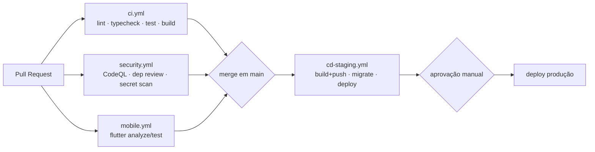
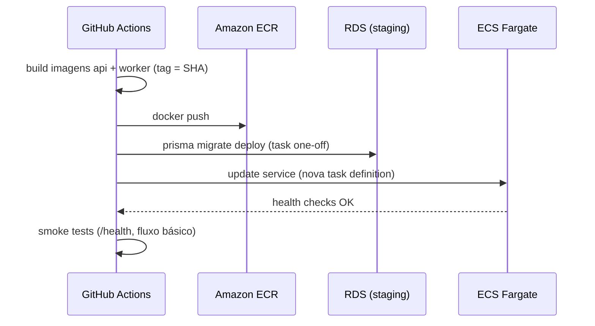
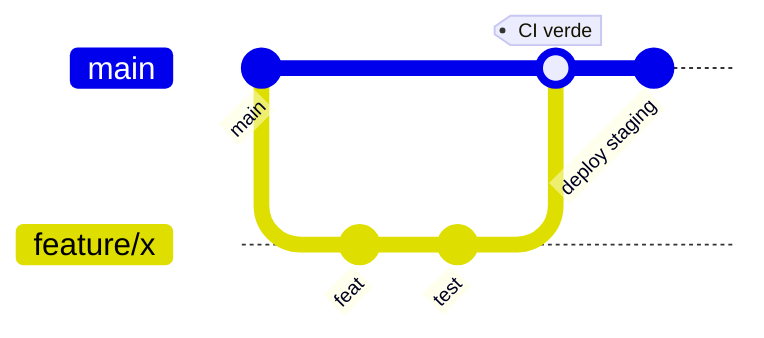

# 08 — Pipeline CI/CD

> Automação de integração e entrega do JardimJá com **GitHub Actions**, orquestrando o monorepo via
> **Turborepo + cache do pnpm**. Cobre pipelines de CI, deploy de staging, segurança e mobile, além
> de estratégia de branches, ambientes/aprovações, versionamento e rollback. Workflows em
> [`.github/workflows/`](../.github/workflows).

Relacionados: [Deploy](07-deployment.md) · [Testes](09-testing.md) · [Segurança & LGPD](06-security-lgpd.md)

---

## 1. Visão geral

Todos os jobs usam Node 22 + pnpm 10.33 (`corepack`), com **cache do store do pnpm** e **cache do
Turbo** para builds/tests incrementais — só o que mudou (e seus dependentes) é reexecutado.

---

## 2. `ci.yml` — integração contínua

Dispara em `pull_request` e em `push` para `main`.

| Passo | Comando | Observação |
| --- | --- | --- |
| Checkout | `actions/checkout` | — |
| Setup | `corepack enable` + `pnpm@10.33.0` | Cache do store pnpm |
| Instalar | `pnpm install --frozen-lockfile` | Determinístico |
| Prisma | `pnpm db:generate` | Gera o client tipado |
| Lint | `pnpm lint` (`turbo run lint`) | ESLint |
| Typecheck | `pnpm typecheck` (`turbo run typecheck`) | `tsc --noEmit` |
| Testes | `pnpm test` (`turbo run test`) | Vitest — ver [Testes](09-testing.md) |
| Build | `pnpm build` (`turbo run build`) | Artefatos `dist/**` |

O Turbo respeita o grafo de dependências (`^build`), então os pacotes de domínio
(`shared` → `ai-vision`/`pricing-engine`) são construídos antes da API. O cache do Turbo é
compartilhado entre execuções (chave por hash de inputs), acelerando PRs subsequentes.

---

## 3. `cd-staging.yml` — entrega em staging

Dispara em `push` para `main` (após CI verde). Ambiente GitHub `staging`.

| Passo | Detalhe |
| --- | --- |
| Autenticar na AWS | OIDC (sem chaves estáticas) → assume role |
| Build & push | Imagens `jardimja-api` e `jardimja-worker`, tag = SHA do commit |
| **Migração** | `prisma migrate deploy` como task one-off, **antes** do rollout (expand/contract) |
| Deploy | Atualiza serviços ECS (rolling/blue-green) |
| Smoke test | Verifica `/health` e um fluxo mínimo pós-deploy |

**Produção** é gated: promoção a prod exige **aprovação manual** (environment protection rule) e usa
a mesma imagem já validada em staging (promote by tag). Ver [Deploy](07-deployment.md#5-deploys-zero-downtime-e-migrações).

---

## 4. `security.yml` — segurança

Dispara em PR, push e agendamento (cron semanal).

| Verificação | Ferramenta | Objetivo |
| --- | --- | --- |
| **CodeQL** | `github/codeql-action` (JS/TS) | Análise estática de vulnerabilidades |
| **Dependency review** | `actions/dependency-review-action` | Bloqueia dependências vulneráveis em PRs |
| **Secret scanning** | GitHub secret scanning + `gitleaks` | Impede vazamento de segredos |
| Auditoria de deps | `pnpm audit` | Alertas de CVEs conhecidas |

Cobre os itens A06/A08 do [modelo de ameaças OWASP](06-security-lgpd.md#11-modelo-de-ameaças--owasp-top-10).

---

## 5. `mobile.yml` — apps Flutter

Dispara em PRs que tocam `apps/mobile/**`.

| Passo | Comando |
| --- | --- |
| Setup | `subosito/flutter-action` (canal stable) |
| Dependências | `flutter pub get` |
| Análise | `flutter analyze` |
| Testes | `flutter test` (widget + unit) |
| Build (opcional) | `flutter build apk --debug` / `ios --no-codesign` para validar compilação |

Builds de release assinados para as lojas (Play/App Store) rodam em um workflow de release dedicado,
com credenciais de assinatura em segredos protegidos.

---

## 6. Estratégia de branches, ambientes e versionamento

**Branches** — trunk-based com PRs curtos:

- `main` sempre deployável; features em branches curtas → PR → review → merge.
- **Branch protection**: CI + security obrigatórios, 1+ review, sem push direto em `main`.
- Releases marcadas por **tags semânticas** (`vMAJOR.MINOR.PATCH`); pacotes usam `0.1.0` hoje.

**Ambientes/aprovações**:

| Ambiente | Gatilho | Aprovação |
| --- | --- | --- |
| staging | merge em `main` | automática |
| prod | promoção de tag | **manual** (reviewers do environment) |

**Versionamento de artefatos**: imagens taggeadas por SHA (imutável) + tag semântica no release. O
schema de banco é versionado por migrações Prisma; o algoritmo de preço carrega `breakdownVersion`
(ex.: `pricing-1.0.0`) para reprodutibilidade dos orçamentos.

---

## 7. Rollback

| Cenário | Ação |
| --- | --- |
| Regressão de app | Redeploy da task definition anterior (imagem por SHA) — segundos/minutos |
| Migração problemática | Como as migrações são **expand/contract**, o código anterior ainda opera; corrige-se para frente com nova migração |
| Incidente de segurança | Revogar segredos/tokens, bloquear no WAF, redeploy limpo (ver [resposta a incidentes](06-security-lgpd.md#10-resposta-a-incidentes)) |

Regra de ouro: **nunca** uma migração destrutiva no mesmo release que introduz o novo código —
sempre expandir, migrar código, e só então contrair em release posterior.

---

Anterior: [« 07 — Deploy](07-deployment.md) · Próximo: [09 — Testes »](09-testing.md)
