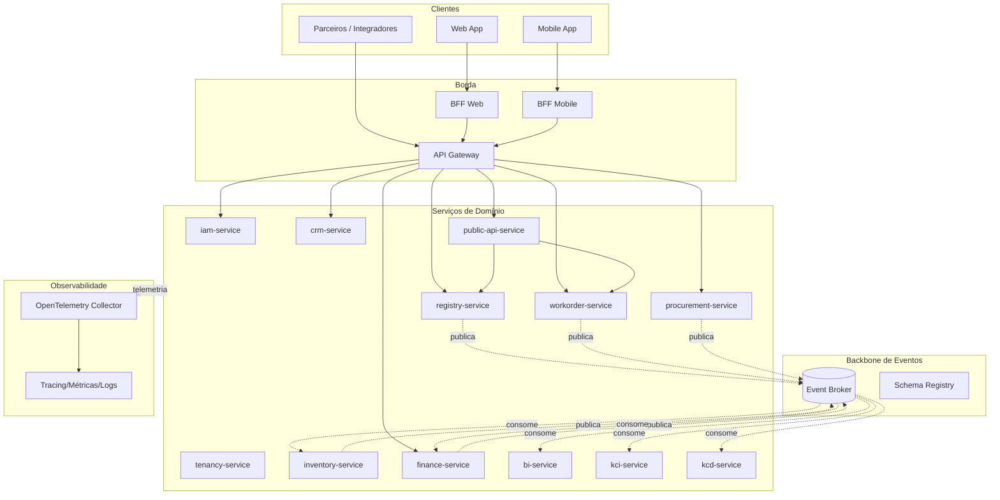
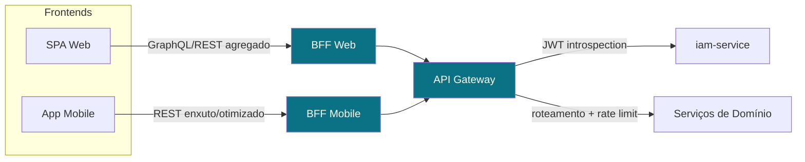
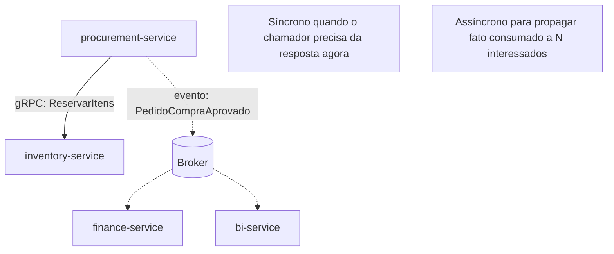
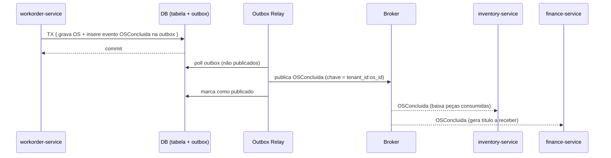
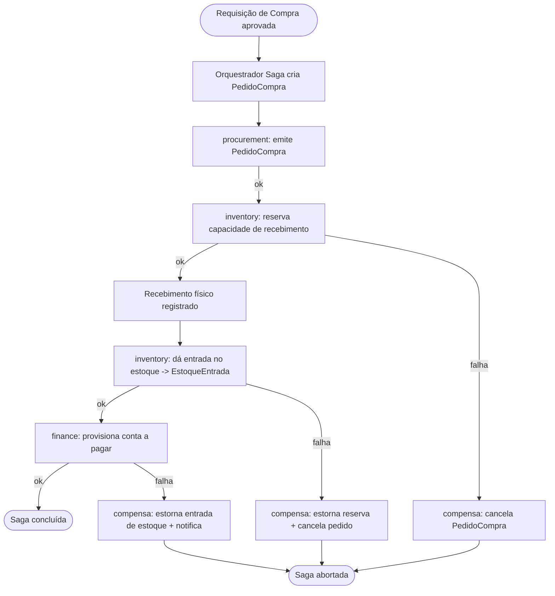
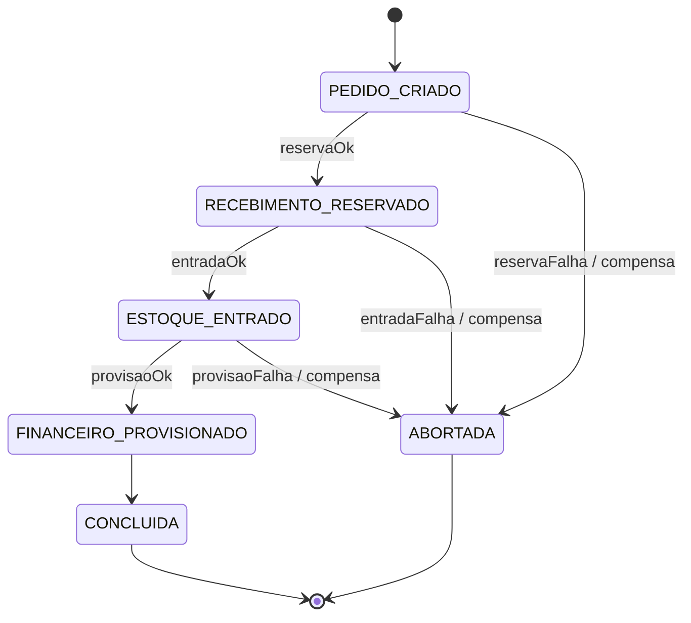
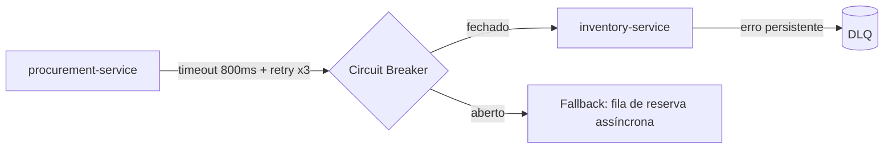

# 09 — Microsserviços · Drone Kairós ERP

**Documento:** `09 — Microsserviços`
**Versão:** 1.0 · **Data:** 21 de julho de 2026 · **Status:** Ativo
**Dependências:** `00`, `01`, `02`, `03`, `04`, `05`, `06`, `07`, `08`
**Responsável:** Arquiteto de Sistemas

---

## 1. Resumo Executivo

Este documento define a **arquitetura de microsserviços** do Drone Kairós ERP, derivada diretamente dos *bounded contexts* estabelecidos no canon do projeto (DDD, API-first, event-driven onde justificado, multiempresa). A estratégia central é **evolutiva**: não nascemos como constelação de serviços, e sim como um **monólito modular** com fronteiras internas rígidas (um módulo por bounded context, banco lógico segregado por schema), do qual extraímos serviços apenas quando um driver mensurável exige — escala independente, cadência de deploy divergente, isolamento de falha ou fronteira de time.

A comunicação segue dois planos: **síncrono** (REST para o mundo externo e parceiros da API Pública; gRPC para chamadas internas de baixa latência e alto volume) e **assíncrono** (broker de eventos como espinha dorsal para desacoplamento temporal, com eventos de domínio versionados como `EquipamentoRegistrado`, `OSConcluida`, `EstoqueBaixado`). A consistência entre serviços é garantida por **outbox pattern** na publicação, **idempotência** no consumo e **sagas** (orquestração para fluxos críticos de negócio, coreografia para reações simples). A borda é protegida por um **API Gateway** e dois **BFFs** (web e mobile). A malha adota **service mesh** para mTLS, descoberta, e políticas de resiliência (circuit breaker, retry com backoff, timeout, bulkhead), e **tracing distribuído** (W3C Trace Context / OpenTelemetry) como requisito não-funcional obrigatório.

O documento entrega o **catálogo de serviços**, o **catálogo de eventos**, contratos de exemplo (OpenAPI e Protobuf), diagramas Mermaid da malha, o fluxograma de uma saga (`Compra → Recebimento → Estoque`), padrões de integração/resiliência, checklist de prontidão para extração, riscos e trilha de auditoria.

## 2. Objetivos

- **O1.** Traduzir os 12 bounded contexts em uma decomposição de serviços com responsabilidade única e propriedade exclusiva de dados (*database-per-service* lógico).
- **O2.** Padronizar contratos: REST/OpenAPI 3.1 na borda, gRPC/Protobuf no interior, com versionamento explícito e compatibilidade retroativa.
- **O3.** Estabelecer o backbone assíncrono: broker, convenção de tópicos, esquema de eventos de domínio e governança de schema.
- **O4.** Garantir consistência distribuída sem 2PC: outbox, idempotência, sagas.
- **O5.** Definir a camada de operação: API Gateway, BFFs, service discovery, service mesh e resiliência.
- **O6.** Tornar a observabilidade distribuída (tracing, métricas, logs correlacionados) um requisito de arquitetura, não um adendo.
- **O7.** Definir a **estratégia de evolução** e os gatilhos objetivos de extração de serviço.

## 3. Escopo

**No escopo:** decomposição em serviços; contratos síncronos e assíncronos; gateway/BFF; broker e eventos de domínio; consistência (saga/outbox/idempotência); descoberta, mesh e resiliência; tracing distribuído; roadmap monólito → serviços.

**Fora do escopo (referência a outros documentos):** modelagem de dados por contexto (Doc 06), segurança/IAM detalhada e KCD (Doc 07), infraestrutura/IaC e topologia de clusters (Doc 08), pipelines de CI/CD (Doc de operação), modelo de tenancy físico (Doc de Tenancy). Aqui tratamos apenas das **interfaces e do comportamento distribuído** desses módulos.

## 4. Regras

- **R1. Contrato primeiro.** Nenhum serviço é implementado antes do contrato (OpenAPI/proto) revisado e versionado no repositório de contratos.
- **R2. Propriedade de dados.** Cada dado tem **um** serviço dono. Nenhum serviço acessa a tabela de outro; integração só por API ou evento.
- **R3. Sem banco compartilhado.** Proibido *shared database*. No monólito modular, isolamento por schema; ao extrair, banco físico próprio.
- **R4. Assíncrono por padrão** para propagação de fatos de domínio; síncrono apenas quando há necessidade de resposta imediata do chamador.
- **R5. Tenant sempre presente.** Todo request e todo evento carrega `tenant_id`; ausência é erro de contrato.
- **R6. Idempotência obrigatória** em todo consumidor de eventos e em endpoints de escrita não naturalmente idempotentes (via `Idempotency-Key`).
- **R7. Compatibilidade retroativa.** Mudança quebra-contrato exige nova versão maior; a antiga é mantida durante a janela de depreciação.
- **R8. Correlação ponta-a-ponta.** `traceparent` (W3C) propagado em REST, gRPC e cabeçalhos de mensagem, sem exceção.
- **R9. Falha isolada.** Toda chamada de saída de serviço tem timeout, retry com jitter e circuit breaker definidos; sem *defaults* infinitos.
- **R10. Extração justificada.** Um serviço só é extraído do monólito com um driver documentado (ver §14 e checklist §12).

## 5. Arquitetura (malha de serviços)

### 5.1 Camadas lógicas

1. **Borda (Edge):** API Gateway (roteamento, authN/Z, rate limit, TLS termination) + BFF Web + BFF Mobile.
2. **Serviços de domínio:** um serviço (ou módulo, na fase monólito) por bounded context.
3. **Backbone assíncrono:** broker de eventos + registry de schema + conectores de outbox.
4. **Plano de dados:** um armazenamento por serviço (PostgreSQL como padrão OLTP; motor de busca/analytics para BI/KCI conforme Doc 06/08).
5. **Plano de malha:** service mesh (sidecars) para mTLS, discovery, políticas de tráfego e telemetria.
6. **Observabilidade:** coletor OpenTelemetry → backend de tracing, métricas e logs.

### 5.2 Mapeamento bounded context → serviço

| Bounded Context | Serviço | Responsabilidade nuclear | Dados que possui | Interface principal |
|---|---|---|---|---|
| Identidade & Acesso | `iam-service` | AuthN, tokens, papéis, permissões, sessões | Usuários, credenciais, roles, escopos | REST (externo) + gRPC (introspecção interna) |
| Tenancy | `tenancy-service` | Ciclo de vida de empresas/tenants, planos, isolamento | Tenants, assinaturas, configuração por tenant | REST + eventos |
| Cadastro / Serial Number | `registry-service` | Cadastro de equipamentos/drones e **serial number** único | Equipamentos, seriais, modelos, fabricantes | REST + gRPC + eventos |
| Ordens de Serviço | `workorder-service` | Ciclo de vida da OS (abertura → execução → conclusão) | Ordens de serviço, itens, apontamentos, status | REST + eventos + saga |
| Estoque / KSI | `inventory-service` | Posição de estoque, movimentações, KSI (índice de estoque) | Itens, saldos, reservas, movimentações | gRPC (interno) + eventos |
| Compras | `procurement-service` | Requisições, cotações, pedidos de compra, recebimento | Requisições, cotações, pedidos, fornecedores | REST + eventos + saga |
| Financeiro | `finance-service` | Contas a pagar/receber, lançamentos, conciliação | Títulos, lançamentos, centros de custo | REST + eventos |
| CRM | `crm-service` | Clientes, contatos, oportunidades, atendimento | Contas, contatos, funil, interações | REST + eventos |
| BI | `bi-service` | Agregações, dashboards, indicadores | Modelos analíticos (read models) | REST (consulta) — consome eventos |
| Inteligência / KCI | `kci-service` | Índice de inteligência/insights, recomendações | Features, scores, modelos | gRPC + eventos |
| Segurança / KCD | `kcd-service` | Índice de conformidade/defesa, auditoria de segurança | Eventos de segurança, achados, políticas | eventos + REST (relatórios) |
| API Pública | `public-api-service` | Fachada externa para parceiros, quotas, chaves | Chaves de API, contratos de parceiro, quotas | REST (público) |

> Na **fase monólito modular**, cada linha acima é um **módulo** com pacote e schema próprios; na fase de serviços, torna-se um *deployable* independente. O contrato entre eles é idêntico em ambos os casos — muda apenas o transporte (chamada in-process vs. rede).

### 5.3 Diagrama da malha



## 6. Diagramas

### 6.1 Contexto de borda (Gateway + BFF)



O **BFF** existe para desacoplar a experiência de cada canal do contrato dos serviços de domínio: o BFF Web agrega múltiplas chamadas em uma resposta rica; o BFF Mobile enxuga payloads, reduz *round-trips* e adapta a modelos de tela pequenos. Nenhum BFF possui dados próprios — é *stateless* e orquestrador.

### 6.2 Comunicação síncrona vs. assíncrona



### 6.3 Fluxo de um evento de domínio (outbox → broker → consumidores)



## 7. Fluxogramas (uma saga)

**Saga: Compra → Recebimento → Estoque → Financeiro** (orquestração, com compensação).



**Máquina de estados da saga (orquestrador):**



**Regra de ouro da saga:** cada passo tem uma **ação** e uma **compensação** semanticamente reversível. Não há rollback distribuído; há compensação de negócio. O orquestrador persiste o estado da saga (também via outbox) para sobreviver a reinícios.

## 8. Boas Práticas

- **Serviço = capacidade de negócio**, não entidade CRUD. `workorder-service` cobre o ciclo da OS, não apenas a tabela.
- **Contratos pequenos e estáveis;** dados internos livres para evoluir. Nunca vaze o modelo interno no contrato.
- **Comandos vs. eventos:** comando é intenção direcionada a **um** serviço (imperativo, pode falhar); evento é fato consumado, no passado, para **N** interessados.
- **Eventos são fatos, não notificações RPC disfarçadas.** `EstoqueBaixado` descreve o que ocorreu; não instrui ninguém a fazer algo.
- **Payload de evento auto-suficiente + versionado.** Inclua `event_id`, `tenant_id`, `occurred_at`, `version`. Evite *chatty callbacks* para reidratar dados.
- **Idempotência sempre:** consumidores deduplicam por `event_id`; endpoints de escrita aceitam `Idempotency-Key`.
- **Timeouts curtos e explícitos;** retry só em erros transitórios e idempotentes; *backoff* com jitter.
- **Falhe rápido na borda, seja resiliente no interior.** Circuit breaker protege o chamador de um dependente doente.
- **Versione desde o v1.** `/api/v1/...` na borda; `package ... v1` no proto.
- **Observabilidade como código:** `traceparent` propagado, spans nomeados por operação de negócio, atributos com `tenant_id` e `service.name`.
- **Segurança por padrão:** mTLS entre serviços (mesh), JWT validado na borda, *least privilege* por escopo de token.

## 9. Padrões (integração/resiliência)

### 9.1 Integração

| Padrão | Quando usar | Observação |
|---|---|---|
| **Request/Response (REST)** | Borda externa, parceiros, leituras interativas | OpenAPI 3.1, JSON, `v` na rota |
| **Request/Response (gRPC)** | Interno, baixa latência, alto volume (ex.: `inventory.ReservarItens`) | Protobuf, HTTP/2, streaming quando útil |
| **Event Notification** | Propagar fato de domínio | Payload magro + link; ou payload completo se auto-suficiente |
| **Event-Carried State Transfer** | Consumidor precisa de dados sem chamar de volta | Reduz acoplamento temporal; cuidado com tamanho |
| **CQRS + read model** | BI, KCI, telas de leitura pesada | Read models materializados por consumo de eventos |
| **API Composition / BFF** | Agregar N serviços para uma tela | No BFF, nunca no cliente |
| **Outbox** | Publicar evento atômico com a transação de negócio | Elimina *dual-write* |
| **Saga (orquestração)** | Fluxo multi-serviço crítico (compra, faturamento) | Orquestrador central, estado persistido |
| **Saga (coreografia)** | Reações simples encadeadas | Sem orquestrador; cuidado com ciclos |

### 9.2 Resiliência

| Padrão | Objetivo | Parâmetro de referência |
|---|---|---|
| **Timeout** | Evitar espera infinita | p.ex. 500 ms–2 s por chamada interna |
| **Retry + backoff/jitter** | Absorver falhas transitórias | máx. 3 tentativas, só em erro idempotente |
| **Circuit Breaker** | Isolar dependente doente | abre em >50% erro/janela; half-open para sondar |
| **Bulkhead** | Conter esgotamento de recursos | pools separados por dependência |
| **Rate limiting / Throttling** | Proteger contra abuso e picos | por tenant e por chave de API |
| **Fallback / Degradação graciosa** | Manter valor parcial | cache, valor default, resposta reduzida |
| **Dead Letter Queue (DLQ)** | Não perder mensagem envenenada | inspeção + reprocesso manual/automático |



## 10. Casos de Uso

**UC-01 — Registro de equipamento com serial único.** Operador cadastra drone → `registry-service` valida unicidade do serial, persiste e publica `EquipamentoRegistrado`. `kci-service` e `bi-service` atualizam índices; `crm-service` associa ao cliente. Idempotência garante que um retry do cliente não gere duplicidade (chave = tenant + serial).

**UC-02 — Conclusão de OS baixando estoque.** Técnico conclui OS → `workorder-service` grava e emite `OSConcluida` (via outbox). `inventory-service` consome e gera `EstoqueBaixado` para as peças; `finance-service` gera título a receber. Se `inventory` falhar, a OS permanece concluída (fato imutável) e o consumo é reprocessado da DLQ — consistência eventual.

**UC-03 — Compra ponta-a-ponta (saga).** Requisição aprovada dispara a saga do §7. Falha no provisionamento financeiro compensa a entrada de estoque e o pedido, deixando o sistema em estado íntegro de negócio.

**UC-04 — Consulta agregada no app mobile.** App pede "resumo do drone X" → BFF Mobile compõe `registry` (dados do equipamento) + `workorder` (últimas OS) + `inventory` (peças associadas) em uma resposta enxuta, com um único `traceparent` cobrindo as três chamadas.

**UC-05 — Parceiro externo via API Pública.** Integrador consulta status de OS → `public-api-service` valida chave/quota, delega a `workorder-service` por gRPC interno e responde REST versionado, sem expor contratos internos.

## 11. Modelagem (catálogo de serviços + eventos)

### 11.1 Catálogo de serviços (síntese)

| Serviço | Transporte de entrada | Publica eventos | Consome eventos | Store |
|---|---|---|---|---|
| `iam-service` | REST + gRPC | `UsuarioCriado`, `PapelAlterado` | — | PostgreSQL |
| `tenancy-service` | REST | `TenantProvisionado`, `PlanoAlterado` | — | PostgreSQL |
| `registry-service` | REST + gRPC | `EquipamentoRegistrado`, `SerialBaixado` | `TenantProvisionado` | PostgreSQL |
| `workorder-service` | REST | `OSAberta`, `OSConcluida`, `OSCancelada` | `EquipamentoRegistrado` | PostgreSQL |
| `inventory-service` | gRPC | `EstoqueEntrada`, `EstoqueBaixado`, `EstoqueReservado` | `OSConcluida`, `PedidoCompraRecebido` | PostgreSQL |
| `procurement-service` | REST | `PedidoCompraAprovado`, `PedidoCompraRecebido` | `EstoqueBaixado` (reposição) | PostgreSQL |
| `finance-service` | REST | `TituloGerado`, `TituloLiquidado` | `OSConcluida`, `PedidoCompraAprovado` | PostgreSQL |
| `crm-service` | REST | `ClienteCriado`, `OportunidadeGanha` | `EquipamentoRegistrado`, `OSConcluida` | PostgreSQL |
| `bi-service` | REST (query) | — | (todos, para read models) | Analytics store |
| `kci-service` | gRPC | `InsightGerado` | `EquipamentoRegistrado`, `OSConcluida`, `EstoqueBaixado` | Feature store |
| `kcd-service` | REST (relatórios) | `AlertaSegurancaGerado` | (eventos de segurança/auditoria) | PostgreSQL |
| `public-api-service` | REST (público) | `ChamadaExternaRegistrada` | — | PostgreSQL |

### 11.2 Catálogo de eventos de domínio

| Evento | Produtor | Consumidores | Chave de partição | Payload (essencial) |
|---|---|---|---|---|
| `EquipamentoRegistrado` | registry | crm, kci, bi | `tenant_id:equipamento_id` | equipamento_id, serial, modelo, cliente_id |
| `OSConcluida` | workorder | inventory, finance, crm, kci | `tenant_id:os_id` | os_id, equipamento_id, itens[], técnico_id |
| `EstoqueBaixado` | inventory | procurement, bi, kci | `tenant_id:item_id` | item_id, quantidade, saldo_atual, origem |
| `EstoqueEntrada` | inventory | bi, finance | `tenant_id:item_id` | item_id, quantidade, pedido_id |
| `PedidoCompraAprovado` | procurement | finance, inventory, bi | `tenant_id:pedido_id` | pedido_id, fornecedor_id, itens[], total |
| `PedidoCompraRecebido` | procurement | inventory, finance | `tenant_id:pedido_id` | pedido_id, itens_recebidos[] |
| `TituloGerado` | finance | bi, crm | `tenant_id:titulo_id` | titulo_id, tipo, valor, vencimento |
| `AlertaSegurancaGerado` | kcd | iam, bi | `tenant_id:alerta_id` | alerta_id, severidade, contexto |

### 11.3 Envelope de evento (contrato canônico)

Todo evento trafega no envelope abaixo (CloudEvents-like), com **schema versionado** no registry:

```json
{
  "event_id": "0f9c2b8e-4c3a-4d2e-9f1a-1b2c3d4e5f60",
  "type": "OSConcluida",
  "version": "1.0",
  "tenant_id": "tnt_00421",
  "occurred_at": "2026-07-21T14:03:11Z",
  "trace_id": "4bf92f3577b34da6a3ce929d0e0e4736",
  "producer": "workorder-service",
  "data": {
    "os_id": "os_88213",
    "equipamento_id": "eqp_00713",
    "itens": [{ "item_id": "itm_501", "quantidade": 2 }],
    "tecnico_id": "usr_3391"
  }
}
```

### 11.4 Contrato REST (trecho OpenAPI 3.1 — `workorder-service`)

```yaml
openapi: 3.1.0
info:
  title: Workorder Service API
  version: "1.0.0"
servers:
  - url: https://api.dronekairos.com/workorder/v1
paths:
  /ordens-servico/{osId}/conclusao:
    post:
      operationId: concluirOrdemServico
      summary: Conclui uma Ordem de Serviço e dispara baixa de estoque
      parameters:
        - name: osId
          in: path
          required: true
          schema: { type: string }
        - name: X-Tenant-Id
          in: header
          required: true
          schema: { type: string }
        - name: Idempotency-Key
          in: header
          required: true
          schema: { type: string, format: uuid }
      requestBody:
        required: true
        content:
          application/json:
            schema:
              $ref: '#/components/schemas/ConclusaoOSRequest'
      responses:
        '200':
          description: OS concluída
          content:
            application/json:
              schema:
                $ref: '#/components/schemas/OrdemServico'
        '409':
          description: OS já concluída (conflito idempotente)
components:
  schemas:
    ConclusaoOSRequest:
      type: object
      required: [tecnicoId, itensConsumidos]
      properties:
        tecnicoId: { type: string }
        itensConsumidos:
          type: array
          items:
            type: object
            required: [itemId, quantidade]
            properties:
              itemId: { type: string }
              quantidade: { type: integer, minimum: 1 }
    OrdemServico:
      type: object
      properties:
        osId: { type: string }
        status: { type: string, enum: [ABERTA, EM_EXECUCAO, CONCLUIDA, CANCELADA] }
        concluidaEm: { type: string, format: date-time }
```

### 11.5 Contrato interno gRPC (trecho Protobuf — `inventory-service`)

```proto
syntax = "proto3";
package dronekairos.inventory.v1;

service InventoryService {
  // Reserva itens de forma idempotente (chave = reservation_id).
  rpc ReservarItens(ReservarItensRequest) returns (ReservarItensResponse);
  rpc ConfirmarBaixa(ConfirmarBaixaRequest) returns (ConfirmarBaixaResponse);
}

message ItemQuantidade {
  string item_id = 1;
  int32  quantidade = 2;
}

message ReservarItensRequest {
  string tenant_id = 1;
  string reservation_id = 2;   // idempotência
  string origem_id = 3;        // ex.: os_id ou pedido_id
  repeated ItemQuantidade itens = 4;
}

message ReservarItensResponse {
  enum Status { OK = 0; INSUFICIENTE = 1; JA_RESERVADO = 2; }
  Status status = 1;
  repeated ItemQuantidade faltantes = 2;
}
```

### 11.6 Versionamento de API

- **REST:** versão maior na rota (`/v1`, `/v2`). Mudanças aditivas (novos campos opcionais) não sobem versão; mudanças quebra-contrato sim. Janela de depreciação mínima anunciada via cabeçalho `Deprecation` + `Sunset`.
- **gRPC/proto:** pacote versionado (`...v1`); campos só adicionados (nunca renumerados/reusados); campos removidos viram `reserved`.
- **Eventos:** `version` no envelope; consumidores toleram campos desconhecidos (tolerant reader). Mudança quebra-contrato = novo `type` ou nova versão maior, coexistindo durante a migração.

## 12. Checklist

**Prontidão de um serviço (Definition of Ready para extração/deploy):**

- [ ] Contrato OpenAPI/proto publicado, revisado e versionado no repo de contratos.
- [ ] Propriedade de dados exclusiva; nenhum acesso cruzado a schema alheio.
- [ ] `tenant_id` presente em todo request, evento e span.
- [ ] Publicação de eventos via **outbox** (sem dual-write).
- [ ] Consumidores **idempotentes** (dedupe por `event_id`); DLQ configurada.
- [ ] Timeout, retry (só idempotente) e circuit breaker definidos para cada dependência.
- [ ] mTLS ativo no mesh; token JWT validado; escopos mínimos.
- [ ] `traceparent` propagado; spans nomeados por operação de negócio; métricas RED expostas.
- [ ] Health checks (`/healthz`, `/readyz`) e sinais de liveness/readiness.
- [ ] Migração de dados e *feature flag* de corte prontas (para extração do módulo).
- [ ] Runbook de falha e reprocesso de DLQ documentado.
- [ ] Testes de contrato (consumer-driven) verdes.

## 13. Riscos

| ID | Risco | Prob. | Impacto | Mitigação |
|---|---|---|---|---|
| RS-01 | Decomposição prematura (nano-serviços) antes de fronteiras claras | Alta | Alto | Começar monólito modular; extrair só com driver (§14) |
| RS-02 | Transação distribuída / dual-write inconsistente | Média | Alto | Outbox + saga + idempotência; proibir 2PC |
| RS-03 | Acoplamento por evento mal versionado quebra consumidores | Média | Alto | Schema registry + tolerant reader + versionamento |
| RS-04 | Falha em cascata por dependência síncrona lenta | Média | Alto | Circuit breaker, timeout, bulkhead, fallback |
| RS-05 | Mensagem envenenada trava partição | Média | Médio | DLQ + limite de retry + alerta |
| RS-06 | Vazamento entre tenants | Baixa | Crítico | `tenant_id` obrigatório, testes de isolamento, mTLS |
| RS-07 | Observabilidade insuficiente para depurar fluxo distribuído | Média | Alto | Tracing obrigatório desde o v1; correlação ponta-a-ponta |
| RS-08 | Explosão operacional (muitos serviços, poucos SREs) | Média | Médio | Mesh + plataforma interna + automação; extração gradual |
| RS-09 | Contrato interno vaza para cliente externo | Baixa | Médio | BFF/API Pública como fachada; nunca expor gRPC interno |
| RS-10 | Divergência de read models (BI/KCI) por evento perdido | Média | Médio | Entrega ao menos uma vez + idempotência + reprocesso |

## 14. Melhorias Futuras

- **Estratégia de evolução (norteadora):**
  1. **Fase 0 — Monólito modular:** um deployable, módulos por bounded context, schemas isolados, contratos internos já definidos, outbox já em uso para eventos.
  2. **Fase 1 — Primeiras extrações:** extrair serviços com maior pressão (candidatos naturais: `inventory-service` por volume, `iam-service` por isolamento de segurança, `bi-service`/`kci-service` por carga analítica assimétrica).
  3. **Fase 2 — Malha completa:** service mesh, discovery dinâmico, BFFs dedicados, API Pública endurecida.
  4. **Fase 3 — Otimização:** CQRS onde compensar, event sourcing seletivo em contextos de auditoria (KCD), autoscaling por serviço.

- **Gatilhos objetivos de extração:** necessidade de escala independente; cadência de deploy divergente; isolamento de falha crítico; fronteira de time (Conway); requisito regulatório de isolamento.
- **Evoluções técnicas:** *schema registry* com validação em CI; testes de contrato consumer-driven no pipeline; *chaos engineering* para validar resiliência; *service catalog* interno; *event sourcing* seletivo para KCD/auditoria; gateway com *canary* e *A/B* por tenant.

## 15. Auditoria

| Item | Descrição |
|---|---|
| **Rastreabilidade** | Cada serviço mapeia 1:1 a um bounded context do canon (§5.2); cada evento tem produtor e consumidores declarados (§11.2). |
| **Trilha técnica** | `trace_id` no envelope de evento e `traceparent` em REST/gRPC permitem reconstruir qualquer fluxo distribuído ponta-a-ponta. |
| **Log de auditoria de negócio** | `kcd-service` e `finance-service` retêm eventos imutáveis; ações sensíveis geram `AlertaSegurancaGerado`. |
| **Governança de contratos** | Toda mudança de contrato passa por revisão, versionamento e teste de compatibilidade antes do merge. |
| **Conformidade multiempresa** | `tenant_id` obrigatório e verificado em borda, mesh e persistência; testes de isolamento no checklist (§12). |
| **Versão do documento** | v1.0 — 21 de julho de 2026. Alterações futuras registradas no controle de versão do repositório de documentação. |
| **Aprovação** | Arquiteto de Sistemas (responsável); dependências 00–08 verificadas e coerentes com o PROJECT CANON. |

---

> **Nota de encerramento.** Este documento estabelece o *contrato arquitetural* de microsserviços do Drone Kairós ERP. Ele é deliberadamente **evolutivo**: as fronteiras aqui descritas valem tanto para o monólito modular inicial quanto para a malha de serviços futura — o que muda é o transporte, não o contrato. Nenhuma extração de serviço deve ocorrer sem driver documentado e checklist (§12) satisfeito.
