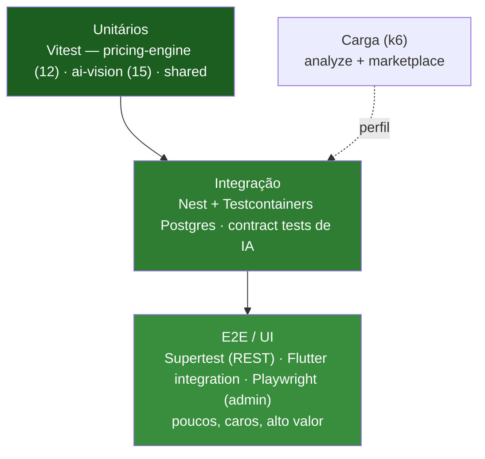

# 09 — Plano de Testes Automatizados

> Estratégia de testes do JardimJá, organizada como pirâmide de testes. Os dois componentes de maior
> valor — **[`pricing-engine`](../packages/pricing-engine)** e **[`ai-vision`](../packages/ai-vision)**
> — já possuem cobertura real: **12 testes** passando no motor de preço e **15 testes** passando no
> consenso/orquestrador de IA.

Relacionados: [CI/CD](08-cicd.md) · [Precificação](05-pricing-engine.md) ·
[Pipeline de IA](04-ai-pipeline.md) · [APIs](03-api.md)

---

## 1. Pirâmide de testes

Runner: **Vitest** (config em cada pacote; `pnpm test` → `turbo run test`). O Turbo só reexecuta o
que mudou. E2E de API roda com `vitest --config vitest.e2e.config.ts` (`pnpm test:e2e`).

---

## 2. Unitários — o núcleo já testado

### 2.1 `pricing-engine` — 12 testes (`test/engine.test.ts`)

Motor **determinístico**, ideal para teste unitário puro (sem I/O). Cobre a fórmula e a calibração.

**`describe('priceJob')` — 9 testes:**

| Teste | Verifica |
| --- | --- |
| lines sum to the total | Os line items (escalonados) somam o subtotal (tolerância de arredondamento) |
| splits the platform fee | `gardenerNet + platformFee = total`; taxa padrão de **10%** |
| never below minimum | Job minúsculo respeita `minimumJobPrice` (piso) |
| higher urgency (surge) | `EMERGENCY` > `NORMAL` |
| high cost-of-living city | São Paulo > Fortaleza (índice de cidade) |
| widens band when context missing | Faixa relativa maior quando falta cidade/distância/mercado |
| surge scarce vs abundant | Supply escassa encarece; abundante desconta |
| deterministic | Mesmo input ⇒ quote idêntica |
| calibration factor multiplicativo | `factor=1.2` eleva o total |

**`describe('calibration')` — 3 testes:**

| Teste | Verifica |
| --- | --- |
| no-op abaixo do mínimo | < 8 amostras ⇒ `factor=1`, `drift=0` |
| aprende subestimação sistemática | 20 amostras (real>estimado) ⇒ `factor>1`, clamp ≤ 1,3 |
| update online converge e permanece clampado | Atualização exponencial tende à razão, respeitando o clamp |

### 2.2 `ai-vision` — 15 testes

**`test/consensus.test.ts` → `describe('reconcile')` — 8 testes:**

| Teste | Verifica |
| --- | --- |
| weighted median (outlier-resistant) | Mediana ponderada ignora outlier (900 m²) |
| booleans by majority | Maioria resolve `hasPool`; `fieldAgreement ≈ 2/3` |
| enums by weighted mode | Moda ponderada escolhe `difficulty=HIGH` |
| equipment por plurality | Mantém item com ≥ 40% de suporte; descarta o raro |
| alta confiança com concordância + fotos | `confidence > 0.8`, sem warnings |
| baixa confiança e warning na divergência | Divergência forte ⇒ `confidence < 0.75` + warnings |
| warning com poucas fotos | < 4 fotos ⇒ warning "Poucas fotos" |
| proveniência incluindo falhas | Registra provedores (inclusive o que falhou) + warning |

**`test/orchestrator.test.ts` — 7 testes:**

| Bloco | Teste | Verifica |
| --- | --- | --- |
| `VisionOrchestrator` | consenso de dois mocks | Produz `GardenAnalysis` com 2 provedores |
| | throws `AI_QUORUM_NOT_MET` | Poucos sucessos ⇒ erro de quorum (422) |
| | provedor falho não bloqueia quorum | 2 OK + 1 falho ⇒ segue |
| | timeout de provedor lento | Provedor lento é marcado `ok:false` sem travar |
| `createOrchestrator` | fallback para mocks | Sem chaves ⇒ dois provedores `mock` |
| `OpenAIVisionProvider` | parseia resposta bem-formada | `fetch` injetado ⇒ `ProviderAnalysis` |
| | surfaces API errors | HTTP 429 ⇒ erro propagado |

Padrões notáveis: injeção de `fetch` (testar HTTP sem rede), `MockVisionProvider` determinístico
(seed nudge), timeouts controlados por `setTimeout`, e validação da própria saída contra o schema Zod
do `shared` dentro de `reconcile`.

### 2.3 `shared`
Testes de contorno para `money` (cents ⇄ display), `haversineKm`, e a coerção `zEnum` dos schemas.

---

## 3. Integração — API + banco real

Testes de integração sobem dependências reais em contêiner com **Testcontainers**:

- **Postgres + PostGIS** efêmero por suíte, migrado com `prisma migrate deploy` e semeado.
- **Redis** para filas/cache quando o caso exige.
- Módulos NestJS instanciados via `@nestjs/testing` (`Test.createTestingModule`), exercitando
  providers, guards e Prisma de verdade.

Alvos: máquina de estados de `Job` (transições válidas/ inválidas ⇒ 409), busca por raio
(`ST_DWithin`), unicidade de oferta (`@@unique([jobId, gardenerId])`), split de pagamento e
idempotência de webhook.

---

## 4. Contract tests — schema dos provedores de IA

Como cada provedor é forçado a devolver **exatamente** o JSON de `ProviderAnalysisSchema`
([`garden-analysis.ts`](../packages/shared/src/garden-analysis.ts)), há testes de contrato que:

- validam respostas gravadas (fixtures) de OpenAI/Gemini/Anthropic contra o schema Zod;
- garantem que mudanças de prompt/modelo não quebrem o contrato;
- exercitam a borda de parsing dos providers com `fetch` injetado (sem chamar a API real).

Isso mantém o consenso robusto a variações de saída dos modelos.

---

## 5. E2E

| Alvo | Ferramenta | Escopo |
| --- | --- | --- |
| **API REST** | **Supertest** (sobre Vitest, `test:e2e`) | Fluxo job: criar → analyze (mock) → publish → offer → choose → checkin/start/checkout → approve → review |
| **Mobile** | **Flutter** widget + integration tests | Telas de captura de fotos, orçamento, marketplace, tracking |
| **Admin** | **Playwright** | Login, dashboard, verificação de jardineiro, resolução de disputa |

Nos E2E de API, a IA roda em modo **`mock`** (determinístico), tornando o fluxo reprodutível e sem
custo/latência de provedores externos.

---

## 6. Testes de carga (k6)

Focados nos endpoints mais caros/quentes:

| Cenário | Endpoint | Objetivo |
| --- | --- | --- |
| Análise sob carga | `POST /jobs/:id/analyze` | Comportamento da fila BullMQ e do quorum sob concorrência |
| Feed do marketplace | `GET /marketplace/feed` | p95 da busca geoespacial + cache Redis |

Métricas alvo (referência): p95 do feed < 300 ms com cache quente; enfileiramento de `analyze`
estável sem crescimento ilimitado de backlog; erro < 1% sob a carga alvo.

---

## 7. Cobertura, gating e dados de teste

**Metas de cobertura**

| Escopo | Meta |
| --- | --- |
| `pricing-engine`, `ai-vision`, `shared` (lógica de domínio) | ≥ 90% linhas/branches |
| Módulos de serviço da API | ≥ 80% |
| Overall do repositório | ≥ 75% |

**Gating no CI** — o job de testes é obrigatório no PR (ver [CI/CD](08-cicd.md#2-ciyml--integração-contínua));
merge bloqueado se testes/coverage falharem. Cobertura é emitida em `coverage/**` (output cacheado
pelo Turbo).

**Dados/fixtures**

- Fábricas de dados determinísticas (o `analysis()`/`pa()` dos testes atuais são o padrão).
- Seed idempotente (`prisma/seed.ts`) para integração/E2E, incluindo a base de conhecimento.
- Provider `mock` como fonte estável de laudos para todo o fluxo de orçamento.

---

Anterior: [« 08 — CI/CD](08-cicd.md) · Próximo: [14 — Especificação funcional »](14-functional-spec.md)
