# 10 — Backend · Drone Kairós ERP

| Campo | Valor |
|---|---|
| **Documento** | 10 — Backend |
| **Versão** | 1.0 |
| **Data** | 21 de julho de 2026 |
| **Status** | Ativo |
| **Dependências** | 00, 01, 02, 03, 04, 05, 06, 07, 08, 09 |
| **Responsável** | Engenharia de Backend |
| **Fonte de verdade** | Project Bible (Doc. 02) · Constituição (Doc. 01) |

---

## 1. Resumo Executivo

Este documento define o **padrão de engenharia de backend** do Drone Kairós ERP: a linguagem e o framework de referência, a arquitetura interna de cada serviço, os padrões táticos de Domain-Driven Design (DDD), a estratégia de segurança e isolamento multiempresa, o tratamento de erros, os padrões de resiliência e transações, e a disciplina de testes e qualidade. É a fonte de verdade para *como* escrevemos serviços — complementa (não substitui) os documentos de arquitetura de solução (visão macro), de dados e de API.

O backend do Kairós é composto por **serviços de domínio autônomos** (ERP, CRM, Financeiro, BI, API Pública, e os módulos proprietários **KCI** — inteligência offline-first, **KCD** — cibersegurança Zero Trust, **KSI** — estoque inteligente), organizados por *bounded context*. Cada serviço é internamente estruturado segundo **Arquitetura Hexagonal (Ports & Adapters)** combinada com **Clean Architecture**, isolando o núcleo de domínio de qualquer detalhe de infraestrutura. A comunicação é **API-first** (contratos antes de código) e **event-driven onde justificado**, com o padrão **Transactional Outbox** garantindo consistência entre estado local e eventos publicados.

**Recomendação de stack padrão:** **Java 21 + Spring Boot 3.x** como padrão corporativo para os serviços de domínio transacionais (ERP, CRM, Financeiro, API Pública), pela maturidade do ecossistema enterprise, força em regras fiscais/financeiras, talento abundante no Brasil e suporte de longo prazo. **Go 1.22+** é adotado como stack secundária, autorizada apenas para serviços de alta vazão, baixa latência ou footprint reduzido — notadamente **ingestão de telemetria**, **sincronização offline-first do KCI** e *edge/gateways*. Todo desvio da stack padrão exige justificativa arquitetural registrada (ADR).

**Princípios não-negociáveis herdados da Constituição:** arquitetura antes de código; segurança por padrão; contratos de API primeiro; observabilidade nativa; **multiempresa como cidadã de primeira classe** — o `tenant` vive no contexto de segurança e é aplicado em todas as camadas, nunca opcional.

---

## 2. Objetivos

**Objetivo geral:** padronizar a construção de serviços de backend de forma que qualquer time possa criar, evoluir e operar um serviço do Kairós com previsibilidade, segurança e qualidade uniformes.

**Objetivos específicos:**

1. **Recomendar** linguagem e framework de referência, com trade-offs explícitos e critérios de exceção.
2. **Definir** a arquitetura interna do serviço (camadas, portas, adaptadores, inversão de dependência).
3. **Codificar** os padrões táticos de DDD (agregados, repositórios, serviços de domínio, eventos de domínio) e o uso de CQRS onde couber.
4. **Estabelecer** a estratégia de segurança: autenticação OIDC/JWT, autorização RBAC/ABAC, isolamento multiempresa e validação de entrada.
5. **Padronizar** o tratamento de erros e a propagação de resultados.
6. **Garantir** resiliência e integridade transacional (Outbox, idempotência, retries, circuit breaker).
7. **Instituir** a pirâmide de testes e as portas de qualidade (quality gates).
8. **Prover** uma estrutura de projeto/pastas de referência, reutilizável entre serviços.

**Fora de objetivo:** topologia de deploy/infraestrutura (Doc. de DevOps/Infra), modelagem física de dados por módulo (Doc. de Dados), especificação de endpoints públicos (Doc. de API), e frontend/apps de campo.

---

## 3. Escopo

**Dentro do escopo:**

- Padrão de linguagem/framework e critérios de exceção.
- Arquitetura interna dos serviços de domínio (Hexagonal + Clean).
- Padrões táticos DDD e CQRS.
- Segurança aplicada no serviço (authN/authZ, tenant, validação).
- Tratamento de erros, resiliência, transações, mensageria (Outbox/idempotência).
- Testes automatizados e qualidade de código.
- Estrutura de pastas de referência.

**Fora do escopo (referenciado em outros documentos):**

- Malha de serviços, ingress, service mesh, CI/CD, Kubernetes → Doc. Infra/DevOps.
- Esquemas de banco por agregado, particionamento, retenção → Doc. Dados.
- Design de endpoints, versionamento externo, SDKs públicos → Doc. API Pública.
- Modelagem estratégica de *bounded contexts* e *context map* → Doc. Arquitetura de Solução.

**Aplicabilidade:** obrigatório para todos os serviços de backend de todos os módulos (KCI/KCD/KSI e ERP/CRM/Financeiro/BI/API Pública).

---

## 4. Regras

Regras normativas. Chaves **DEVE** (obrigatório), **NÃO DEVE** (proibido), **DEVERIA** (recomendado forte).

### 4.1 Arquitetura

- **R-A01 — DEVE** isolar o domínio: nenhuma classe de `domain/` importa framework, ORM, HTTP ou driver de banco.
- **R-A02 — DEVE** apontar todas as dependências para dentro (regra da dependência da Clean Architecture): infraestrutura depende de domínio, nunca o inverso.
- **R-A03 — DEVE** expor a lógica de negócio somente por **casos de uso** (application services); adaptadores de entrada não contêm regra de negócio.
- **R-A04 — NÃO DEVE** vazar entidades de persistência (JPA/entities) para além da camada de infraestrutura; a fronteira usa DTOs/comandos/objetos de domínio.

### 4.2 Multiempresa (Tenancy)

- **R-T01 — DEVE** resolver o `tenant_id` a partir do token de segurança (claim), nunca de parâmetro livre do cliente.
- **R-T02 — DEVE** propagar o `tenant_id` no contexto de execução (security context + contexto assíncrono) até o repositório.
- **R-T03 — DEVE** aplicar filtro de tenant de forma automática e obrigatória na camada de persistência (row-level ou schema-per-tenant conforme Doc. Dados). Consulta sem tenant é um defeito, não uma opção.
- **R-T04 — NÃO DEVE** existir endpoint, job ou consumidor de evento que opere sem tenant resolvido (exceção: rotinas de plataforma, explicitamente marcadas e auditadas).

### 4.3 Segurança

- **R-S01 — DEVE** autenticar via OIDC/OAuth2 com validação de assinatura e claims do JWT (issuer, audience, expiração).
- **R-S02 — DEVE** autorizar por RBAC como base e ABAC para regras contextuais (tenant, propriedade do recurso, escopo).
- **R-S03 — DEVE** validar toda entrada na borda (sintática) e no domínio (invariantes de negócio). Nunca confiar no cliente.
- **R-S04 — NÃO DEVE** registrar segredos, tokens ou PII em log. Mascaramento obrigatório.
- **R-S05 — DEVE** negar por padrão (deny-by-default): ausência de permissão explícita = negado.

### 4.4 Confiabilidade

- **R-C01 — DEVE** usar o padrão **Transactional Outbox** para publicar eventos que precisam ser consistentes com a mudança de estado.
- **R-C02 — DEVE** tornar consumidores de eventos e endpoints de escrita **idempotentes** (chave de idempotência / dedupe).
- **R-C03 — DEVE** retornar erros num formato padronizado (RFC 7807 *Problem Details*) e nunca expor stack trace ao cliente.
- **R-C04 — DEVERIA** aplicar timeouts, retries com backoff+jitter e circuit breaker em toda chamada de saída.

### 4.5 Qualidade

- **R-Q01 — DEVE** ter cobertura mínima de 80% de linhas no núcleo de domínio e aplicação; domínio testado sem mocks de infraestrutura.
- **R-Q02 — DEVE** passar em análise estática, verificação de dependências (regra da dependência) e SAST/SCA antes do merge.
- **R-Q03 — NÃO DEVE** fazer merge com portas de qualidade vermelhas.

---

## 5. Arquitetura (interna do serviço)

### 5.1 Escolha de linguagem/framework

Avaliamos quatro candidatos maduros para serviços transacionais enterprise. A avaliação pondera: adequação a ERP/Financeiro (regras fiscais, transações, precisão decimal), ecossistema DDD/segurança, disponibilidade de talento (Brasil), performance/custo, e maturidade operacional.

| Critério | Java 21 / Spring Boot 3 | .NET 8 / ASP.NET Core | Node 20 / NestJS | Go 1.22 |
|---|---|---|---|---|
| Maturidade enterprise / ERP | ● Altíssima | ● Alta | ◐ Média | ◐ Média |
| Ecossistema DDD/segurança | ● (Spring Security, Modulith) | ● (identidade, EF) | ◐ (bibliotecas fragmentadas) | ◐ (montagem manual) |
| Precisão financeira/decimal | ● `BigDecimal` nativo | ● `decimal` nativo | ○ `number` = risco; precisa lib | ◐ precisa lib/inteiros |
| Talento no Brasil | ● Abundante | ◐ Bom | ● Abundante | ◐ Escasso sênior |
| Performance/latência | ◐ Boa (JIT/GraalVM p/ boot) | ● Muito boa | ◐ I/O bom, CPU fraco | ● Excelente |
| Footprint / edge | ◐ Médio (nativo via GraalVM) | ◐ Médio | ◐ Médio | ● Mínimo |
| Concorrência massiva | ● (virtual threads / Loom) | ● (async/await) | ◐ (event loop, 1 core) | ● (goroutines) |
| Custo de manutenção a longo prazo | ● LTS previsível | ● LTS previsível | ◐ churn de libs | ● simples |

**Decisão (ADR-BE-001):**

- **Padrão corporativo — Java 21 + Spring Boot 3.x** para serviços de domínio transacionais: ERP, CRM, Financeiro, BI (camada de serviço), API Pública. Justificativa: precisão decimal nativa (`BigDecimal`), Spring Security/Spring Modulith para DDD e segurança, *virtual threads* (Project Loom) para concorrência sem complexidade reativa, e o maior pool de talento sênior enterprise no Brasil. LTS e previsibilidade reduzem risco de longo prazo num ERP.
- **Stack secundária autorizada — Go 1.22+** para serviços de alta vazão / baixa latência / footprint reduzido: ingestão de telemetria de frota, endpoints de sincronização offline-first do **KCI**, *gateways* de borda e o plano de dados do **KCD**. Justificativa: goroutines, binários estáticos e consumo de memória mínimo em edge.
- **Exceções** exigem ADR aprovado. Node/NestJS e .NET permanecem como *fallback* estratégico documentado, não como padrão. `number` de JavaScript é explicitamente proibido para valores monetários.

> A recomendação padroniza sem uniformizar à força: um ERP financeiro e um coletor de telemetria têm perfis distintos. A regra é **um padrão forte (Java/Spring) e um caminho de exceção estreito e justificado (Go)**.

### 5.2 Estilo arquitetural: Hexagonal + Clean

Cada serviço adota **Ports & Adapters (Hexagonal)** com as fronteiras da **Clean Architecture**. O núcleo (domínio + aplicação) é agnóstico de tecnologia; tudo que é "detalhe" (HTTP, banco, mensageria, provedor de identidade) é um **adaptador** conectado por meio de **portas** (interfaces).

**As quatro camadas:**

1. **Domínio (`domain`)** — o coração. Agregados, entidades, objetos de valor, eventos de domínio, serviços de domínio, exceções de negócio e **portas de saída** (interfaces de repositório). Zero dependência de framework.
2. **Aplicação (`application`)** — orquestra casos de uso (comandos/consultas), define **portas de entrada** (interfaces de caso de uso), coordena transações e publica eventos. Depende apenas do domínio.
3. **Infraestrutura (`infrastructure`)** — adaptadores de saída: implementações JPA de repositórios, publicador de eventos (Outbox), clientes HTTP, provedor de identidade, cache. Depende de domínio e aplicação (implementa as portas).
4. **Interface / Entrada (`interfaces`)** — adaptadores de entrada: controllers REST/gRPC, consumidores de mensageria, jobs agendados. Traduzem protocolo em comandos/consultas. Depende de aplicação.

**Inversão de dependência (DIP):** a aplicação declara `RepositorioDeOrdemServico` (porta); a infraestrutura fornece `RepositorioDeOrdemServicoJpa` (adaptador). A composição (injeção) ocorre no *bootstrap* (Spring `@Configuration`), o único ponto que conhece todas as camadas.

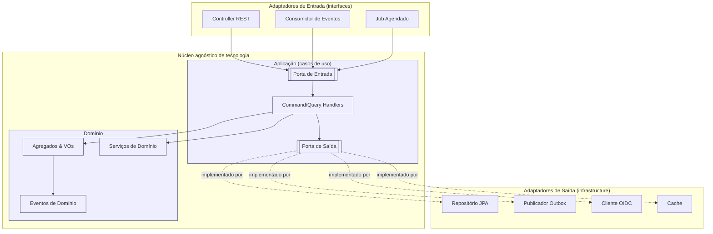

**Regra da dependência (setas sempre apontam para o núcleo):**

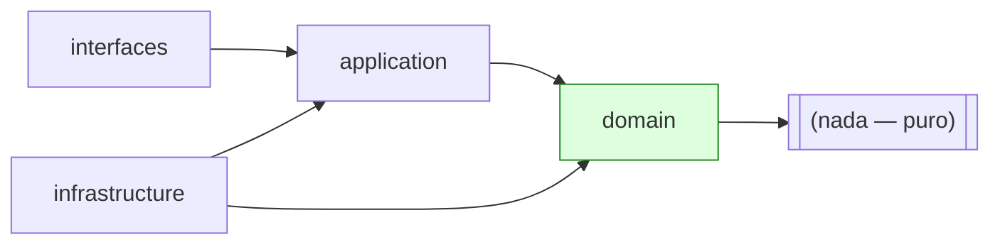

### 5.3 Anatomia de um serviço (visão de execução)

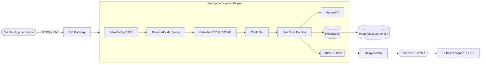

---

## 6. Diagramas

### 6.1 Mapa de contêineres lógicos do backend

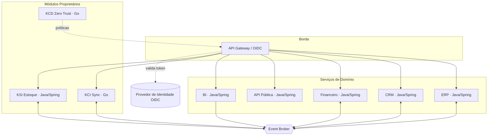

### 6.2 Diagrama de classes — padrões táticos DDD (exemplo: Ordem de Serviço)

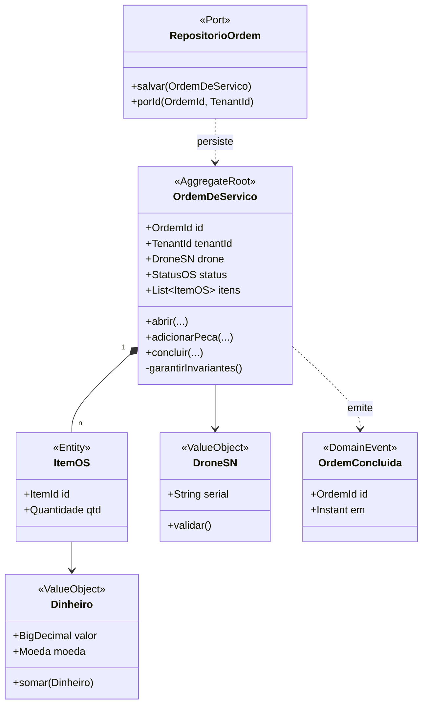

### 6.3 Sequência — comando de escrita com Outbox

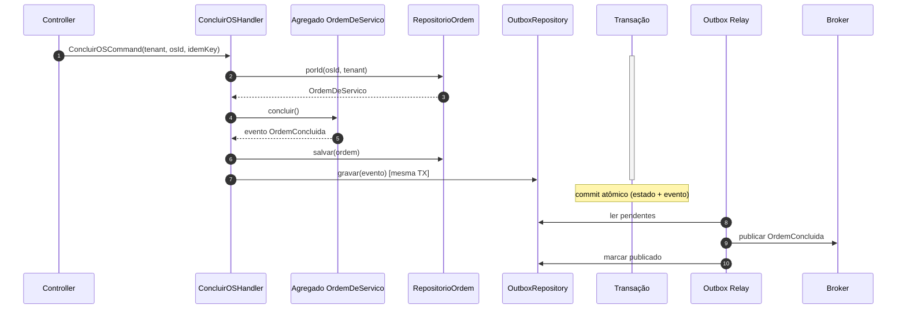

---

## 7. Fluxogramas

### 7.1 Fluxo de uma requisição HTTP de escrita (borda → domínio)

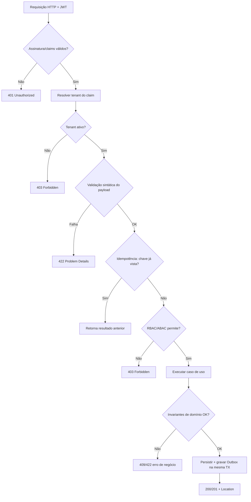

### 7.2 Fluxo de tratamento de erro e resultado

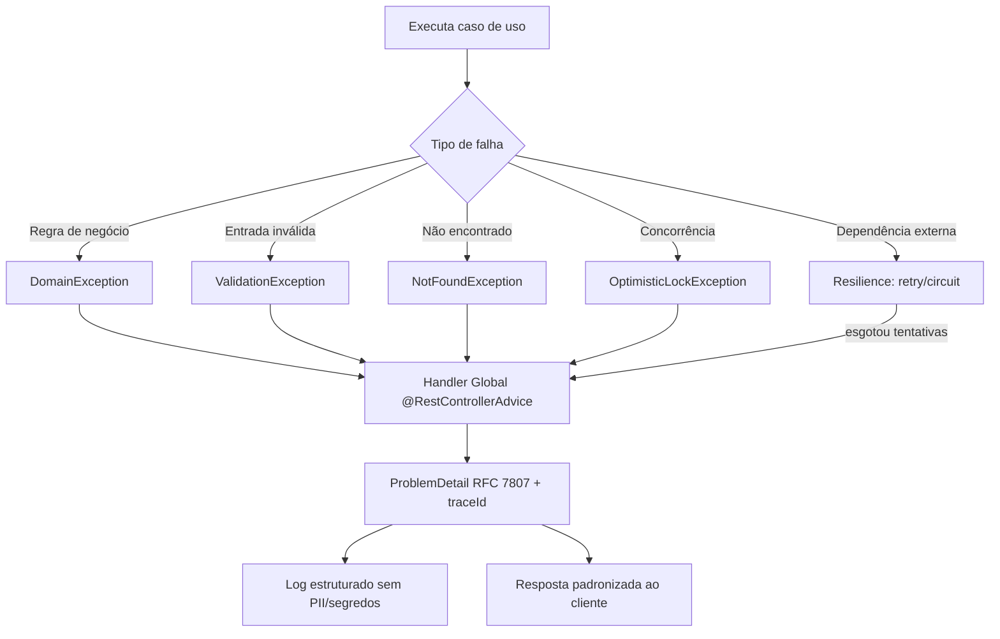

---

## 8. Boas Práticas

1. **Domínio primeiro, framework depois.** Modele agregados e invariantes antes de escolher anotações. O domínio deve compilar sem Spring.
2. **Objetos de valor para tudo que tem regra.** `DroneSN`, `Dinheiro`, `TenantId`, `CNPJ`, `Email` — imutáveis, auto-validados, sem *primitive obsession*.
3. **Agregados pequenos.** Uma transação = um agregado. Consistência entre agregados é *eventual*, via eventos de domínio.
4. **Casos de uso finos.** Um handler = uma intenção de negócio. Sem lógica de negócio em controller ou repositório.
5. **Fronteiras explícitas.** DTO na entrada/saída, comando/consulta na aplicação, agregado no domínio, entity JPA só na infraestrutura. Nunca cruze essas fronteiras com o mesmo objeto.
6. **Tenant é invariante de plataforma.** Toda consulta e escrita carrega tenant. Trate consulta sem tenant como bug de segurança.
7. **Idempotência por padrão em escritas.** Chave de idempotência no cabeçalho; dedupe persistido.
8. **Erros são de negócio ou técnicos.** Exceções de negócio são de primeira classe e mapeadas para respostas claras; exceções técnicas nunca vazam detalhes.
9. **Observabilidade nativa.** Logs estruturados (JSON) com `traceId`, `tenantId`, `userId`; métricas por caso de uso; *tracing* distribuído propagado nos eventos.
10. **Imutabilidade e funções puras no domínio.** Facilita teste e raciocínio; efeitos colaterais só nas bordas.
11. **Migrações versionadas** (Flyway/Liquibase). Nada de schema implícito por ORM em produção.
12. **Feature flags** para desacoplar deploy de release, especialmente em módulos regulatórios (fiscal).

---

## 9. Padrões

### 9.1 Padrões táticos de DDD

**Agregado (raiz + invariantes).** A raiz é a única porta de entrada de escrita; protege invariantes; emite eventos de domínio.

```java
// domain/os/OrdemDeServico.java  — sem qualquer dependência de framework
public final class OrdemDeServico {
    private final OrdemId id;
    private final TenantId tenantId;
    private final DroneSN drone;
    private StatusOS status;
    private final List<ItemOS> itens = new ArrayList<>();
    private final List<EventoDeDominio> eventos = new ArrayList<>();

    public static OrdemDeServico abrir(TenantId tenant, DroneSN drone) {
        var os = new OrdemDeServico(OrdemId.novo(), tenant, drone, StatusOS.ABERTA);
        os.registrar(new OrdemAberta(os.id, tenant, Instant.now()));
        return os;
    }

    public void concluir() {
        if (status != StatusOS.EM_EXECUCAO)
            throw new DomainException("OS só pode ser concluída a partir de EM_EXECUCAO");
        if (itens.isEmpty())
            throw new DomainException("OS sem itens não pode ser concluída");
        this.status = StatusOS.CONCLUIDA;
        registrar(new OrdemConcluida(id, tenantId, Instant.now()));
    }

    private void registrar(EventoDeDominio e) { eventos.add(e); }
    public List<EventoDeDominio> puxarEventos() {
        var copia = List.copyOf(eventos); eventos.clear(); return copia;
    }
    // getters de leitura; sem setters públicos
}
```

**Objeto de Valor (imutável, auto-validado).**

```java
public record Dinheiro(BigDecimal valor, Moeda moeda) {
    public Dinheiro {
        Objects.requireNonNull(valor); Objects.requireNonNull(moeda);
        if (valor.scale() > moeda.casasDecimais())
            throw new DomainException("Escala inválida para " + moeda);
    }
    public Dinheiro somar(Dinheiro outro) {
        if (!moeda.equals(outro.moeda)) throw new DomainException("Moedas divergentes");
        return new Dinheiro(valor.add(outro.valor), moeda);
    }
}
```

**Repositório como porta (interface no domínio, implementação na infraestrutura).**

```java
// domain/os/RepositorioOrdem.java  (PORTA de saída)
public interface RepositorioOrdem {
    Optional<OrdemDeServico> porId(OrdemId id, TenantId tenant);
    void salvar(OrdemDeServico ordem);
}
```

```java
// infrastructure/persistence/RepositorioOrdemJpa.java  (ADAPTADOR)
@Repository
class RepositorioOrdemJpa implements RepositorioOrdem {
    private final JpaOrdemDao dao;
    private final OrdemMapper mapper;

    @Override public Optional<OrdemDeServico> porId(OrdemId id, TenantId tenant) {
        return dao.findByIdAndTenantId(id.valor(), tenant.valor()).map(mapper::paraDominio);
    }
    @Override public void salvar(OrdemDeServico ordem) {
        dao.save(mapper.paraEntity(ordem));
    }
}
```

**Serviço de Domínio** (lógica que não pertence a um único agregado — ex.: cálculo de garantia cruzando drone + peça + política).

```java
public class PoliticaDeGarantia {
    public boolean cobre(DroneSN drone, Peca peca, LocalDate data) { /* regra pura */ }
}
```

**Evento de Domínio** — expressa fato consumado; publicado via Outbox (ver 9.5).

### 9.2 CQRS onde couber

CQRS é aplicado **seletivamente**, não como dogma. Comandos passam pelo agregado (consistência forte). Consultas de leitura pesada (BI, listagens, dashboards) usam **modelos de leitura** dedicados, projetados a partir de eventos, evitando sobrecarregar o modelo transacional.

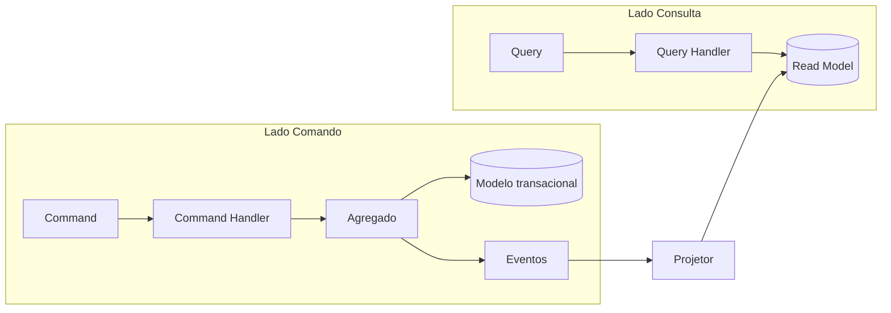

**Diretriz:** usar CQRS *sem* event sourcing por padrão (read models atualizados por projetores). Event sourcing é considerado apenas onde a trilha de eventos é o requisito (ex.: rastreabilidade vitalícia por SN no KSI) — decisão por ADR.

### 9.3 Segurança

**Autenticação (OIDC/JWT).** O gateway e cada serviço validam o token (assinatura via JWKS, `iss`, `aud`, `exp`). O serviço confia no token, não em cabeçalhos arbitrários.

```java
@Configuration
@EnableWebSecurity
class SecurityConfig {
    @Bean SecurityFilterChain chain(HttpSecurity http) throws Exception {
        http
          .csrf(csrf -> csrf.disable())
          .sessionManagement(s -> s.sessionCreationPolicy(STATELESS))
          .authorizeHttpRequests(a -> a
              .requestMatchers("/actuator/health", "/actuator/info").permitAll()
              .anyRequest().authenticated())               // deny-by-default
          .oauth2ResourceServer(o -> o.jwt(j -> j.jwtAuthenticationConverter(conv())));
        http.addFilterAfter(new TenantContextFilter(), BearerTokenAuthenticationFilter.class);
        return http.build();
    }
}
```

**Isolamento multiempresa (tenant no contexto de segurança).** O `tenant_id` vem do claim, é colocado num contexto de escopo de requisição e aplicado automaticamente na persistência (ex.: filtro Hibernate por tenant / RLS no PostgreSQL).

```java
public final class TenantContext {
    private static final ThreadLocal<TenantId> ATUAL = new ThreadLocal<>();
    public static void definir(TenantId t) { ATUAL.set(t); }
    public static TenantId obrigatorio() {
        var t = ATUAL.get();
        if (t == null) throw new SecurityException("Tenant não resolvido"); // R-T04
        return t;
    }
    public static void limpar() { ATUAL.remove(); }
}
```

```java
// Filtro que resolve o tenant do JWT e ativa RLS na conexão
class TenantContextFilter extends OncePerRequestFilter {
    protected void doFilterInternal(HttpServletRequest req, HttpServletResponse res, FilterChain chain)
            throws ServletException, IOException {
        var auth = (JwtAuthenticationToken) SecurityContextHolder.getContext().getAuthentication();
        var tenant = new TenantId(auth.getToken().getClaimAsString("tenant_id"));
        try {
            TenantContext.definir(tenant);          // R-T02
            chain.doFilter(req, res);
        } finally { TenantContext.limpar(); }
    }
}
```

> **Persistência com RLS:** cada conexão executa `SET app.tenant_id = ?` no início da transação; políticas Row-Level Security do PostgreSQL garantem que nenhuma linha de outro tenant seja lida/escrita, mesmo diante de um bug de aplicação — defesa em profundidade (R-T03).

**Autorização (RBAC + ABAC).** RBAC define papéis (`OS_TECNICO`, `FIN_APROVADOR`); ABAC refina por atributos (o recurso pertence ao tenant? o usuário é dono? valor abaixo do limite de alçada?).

```java
@PreAuthorize("hasRole('FIN_APROVADOR')")   // RBAC
public ResultadoAprovacao aprovar(AprovarPagamentoCommand cmd, Jwt jwt) {
    // ABAC contextual
    if (cmd.valor().valor().compareTo(alcada(jwt)) > 0)
        throw new AccessDeniedException("Valor acima da alçada do aprovador");
    ...
}
```

**Validação de entrada em duas camadas.** Sintática na borda (Bean Validation) + semântica/invariante no domínio (nunca só na borda).

```java
public record AbrirOSRequest(
    @NotBlank String serialDrone,
    @NotNull @Size(min = 1) List<@Valid ItemRequest> itens) {}
```

### 9.4 Tratamento de erros e resultados

Erros de negócio são **explícitos**; a resposta é padronizada em **RFC 7807 (Problem Details)** com `traceId`. Duas abordagens coexistem: exceções de domínio (mapeadas por um handler global) e, em fluxos onde a falha é esperada e frequente, um tipo `Result<T>` para evitar controle de fluxo por exceção.

```java
@RestControllerAdvice
class HandlerGlobalDeErros {
    @ExceptionHandler(DomainException.class)
    ProblemDetail negocio(DomainException ex) {
        var pd = ProblemDetail.forStatusAndDetail(HttpStatus.UNPROCESSABLE_ENTITY, ex.getMessage());
        pd.setType(URI.create("https://erros.kairos/negocio"));
        pd.setProperty("traceId", MDC.get("traceId"));
        return pd; // nunca expõe stack trace (R-C03)
    }
    @ExceptionHandler(NotFoundException.class)
    ProblemDetail naoEncontrado(NotFoundException ex) {
        return ProblemDetail.forStatusAndDetail(HttpStatus.NOT_FOUND, ex.getMessage());
    }
    @ExceptionHandler(AccessDeniedException.class)
    ProblemDetail negado(AccessDeniedException ex) {
        return ProblemDetail.forStatus(HttpStatus.FORBIDDEN); // sem detalhar o porquê
    }
}
```

```java
// Result<T> para falhas esperadas (ex.: importação em lote)
public sealed interface Result<T> permits Ok, Falha {
    record Ok<T>(T valor) implements Result<T> {}
    record Falha<T>(String codigo, String mensagem) implements Result<T> {}
}
```

### 9.5 Resiliência e transações (Outbox + Idempotência)

**Transactional Outbox.** O evento é gravado na **mesma transação** da mudança de estado. Um *relay* separado publica no broker e marca como enviado — garante que estado e evento nunca divergem (R-C01).

```java
@Service
class ConcluirOSHandler {
    private final RepositorioOrdem repo;
    private final OutboxRepository outbox;

    @Transactional
    public void handle(ConcluirOSCommand cmd) {
        var tenant = TenantContext.obrigatorio();
        var os = repo.porId(cmd.osId(), tenant)
                     .orElseThrow(() -> new NotFoundException("OS não encontrada"));
        os.concluir();                                   // invariantes no domínio
        repo.salvar(os);
        os.puxarEventos().forEach(e ->                   // mesma TX  (R-C01)
            outbox.gravar(OutboxMessage.de(e, tenant)));
    }
}
```

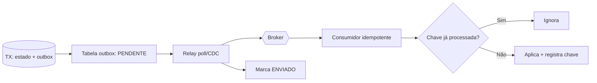

**Idempotência.** Escritas expostas aceitam `Idempotency-Key`; consumidores de eventos usam a `messageId` como chave de dedupe persistida (R-C02).

```java
@Transactional
public Resposta processar(String idempotencyKey, Comando cmd) {
    if (idem.existe(idempotencyKey))
        return idem.resultadoAnterior(idempotencyKey);   // não reexecuta
    var resp = executar(cmd);
    idem.registrar(idempotencyKey, resp);
    return resp;
}
```

**Resiliência de chamadas de saída** (timeout + retry com backoff/jitter + circuit breaker):

```java
@CircuitBreaker(name = "fiscalSefaz", fallbackMethod = "enfileirarParaReenvio")
@Retry(name = "fiscalSefaz")
@TimeLimiter(name = "fiscalSefaz")
public CompletableFuture<Autorizacao> transmitirNfe(Nfe nfe) { ... }
```

### 9.6 Padrões de teste

Pirâmide: muitos testes de unidade de domínio (sem infraestrutura), testes de caso de uso com dublês nas portas, e testes de integração com dependências reais via **Testcontainers**.

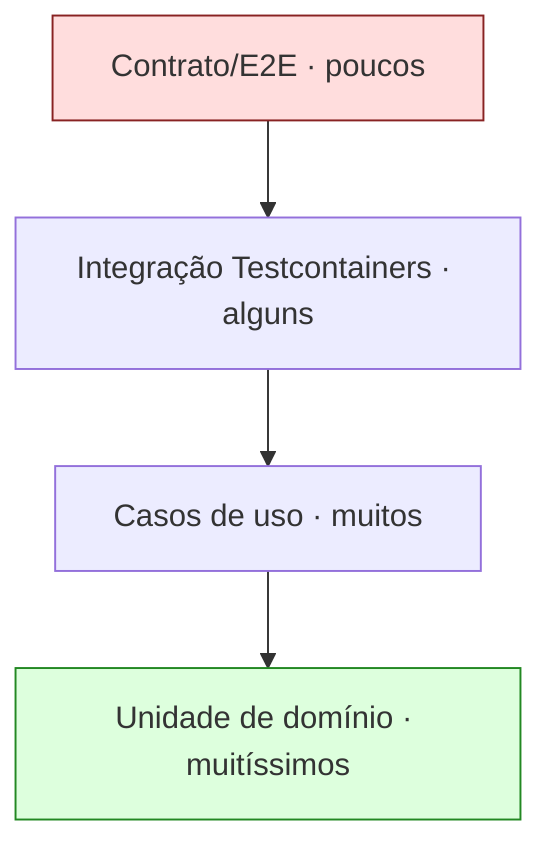

```java
// Teste de domínio: rápido, puro, sem Spring
class OrdemDeServicoTest {
    @Test void nao_conclui_sem_itens() {
        var os = OrdemDeServico.abrir(TenantId.de("t1"), DroneSN.de("SN-123"));
        assertThatThrownBy(os::concluir).isInstanceOf(DomainException.class);
    }
}
```

```java
// Teste de integração com PostgreSQL real + RLS
@SpringBootTest
@Testcontainers
class RepositorioOrdemJpaIT {
    @Container static PostgreSQLContainer<?> pg = new PostgreSQLContainer<>("postgres:16");
    @Test void isola_por_tenant() { /* grava t1, consulta como t2, espera vazio */ }
}
```

**Qualidade de código:** análise estática (SpotBugs/Checkstyle/PMD), verificação da regra da dependência (ArchUnit), cobertura mínima (JaCoCo ≥ 80% no núcleo), SAST/SCA no pipeline, revisão obrigatória por par.

```java
// ArchUnit: proíbe domínio de depender de framework/infra (R-A01)
@ArchTest static final ArchRule dominio_puro =
    noClasses().that().resideInAPackage("..domain..")
      .should().dependOnClassesThat()
      .resideInAnyPackage("..infrastructure..", "org.springframework..", "jakarta.persistence..");
```

---

## 10. Casos de Uso

### 10.1 Concluir Ordem de Serviço (comando transacional + evento)

**Ator:** Técnico de campo (papel `OS_TECNICO`). **Pré:** OS em execução, tenant resolvido.
**Fluxo:** requisição autenticada → tenant do claim → RBAC/ABAC → handler `ConcluirOSHandler` → agregado valida invariantes → persiste + grava Outbox na mesma TX → evento `OrdemConcluida` publicado → **KSI** dá baixa de peças, **Financeiro** gera faturamento. Consistência entre serviços é eventual, orquestrada por eventos.

### 10.2 Aprovar pagamento com alçada (RBAC + ABAC)

**Ator:** Aprovador financeiro (`FIN_APROVADOR`). Autorização em duas etapas: papel (RBAC) e limite de alçada + tenant do recurso (ABAC). Acima da alçada → 403 com Problem Details, sem vazar regra sensível.

### 10.3 Importação de telemetria de frota (stack Go, alta vazão)

**Ator:** Gateway de borda. Serviço em **Go** recebe lotes de telemetria, valida e persiste em store otimizado para série temporal, emitindo eventos agregados para o **BI**. Exemplo de exceção justificada à stack padrão (ADR): perfil de altíssima vazão/baixa latência, sem regra financeira.

### 10.4 Sincronização offline-first (KCI)

**Ator:** App de campo sem conectividade. Registra mutações locais com chave de idempotência; ao reconectar, envia o *log* de mutações ao serviço **KCI**; o backend aplica com dedupe e resolve conflitos por política (last-writer-wins por campo ou merge de domínio). Idempotência (R-C02) é o que torna o *replay* seguro.

### 10.5 Consulta de dashboard (CQRS — read model)

**Ator:** Gestor. Consulta atendida por **read model** projetado de eventos (não toca o modelo transacional), garantindo latência baixa em listagens e agregações do BI.

---

## 11. Modelagem (estrutura de camadas/pastas)

Estrutura de referência para um serviço Java/Spring, organizada por **camada e feature**. A regra da dependência é fisicamente visível nos pacotes.

```
servico-ordens/
├── build.gradle.kts
├── src/main/java/kairos/ordens/
│   ├── OrdensApplication.java            # bootstrap (composição)
│   │
│   ├── domain/                           # NÚCLEO — sem framework
│   │   ├── os/
│   │   │   ├── OrdemDeServico.java        # Aggregate Root
│   │   │   ├── ItemOS.java                # Entity
│   │   │   ├── StatusOS.java
│   │   │   ├── OrdemId.java               # Value Object (id)
│   │   │   ├── RepositorioOrdem.java      # PORTA de saída
│   │   │   └── eventos/OrdemConcluida.java
│   │   ├── shared/
│   │   │   ├── TenantId.java  Dinheiro.java  DroneSN.java
│   │   │   └── DomainException.java  EventoDeDominio.java
│   │   └── servico/PoliticaDeGarantia.java   # Domain Service
│   │
│   ├── application/                      # CASOS DE USO
│   │   ├── os/
│   │   │   ├── ConcluirOSCommand.java
│   │   │   ├── ConcluirOSHandler.java     # implementa porta de entrada
│   │   │   └── port/in/ConcluirOSUseCase.java
│   │   └── port/out/OutboxRepository.java  # PORTA de saída
│   │
│   ├── infrastructure/                   # ADAPTADORES DE SAÍDA
│   │   ├── persistence/
│   │   │   ├── RepositorioOrdemJpa.java
│   │   │   ├── OrdemEntity.java  OrdemMapper.java
│   │   │   ├── OutboxEntity.java  OutboxRepositoryJpa.java
│   │   │   └── rls/TenantConnectionCustomizer.java
│   │   ├── messaging/OutboxRelay.java
│   │   ├── security/SecurityConfig.java  TenantContextFilter.java
│   │   └── config/BeansConfig.java        # injeção/composição
│   │
│   └── interfaces/                       # ADAPTADORES DE ENTRADA
│       ├── rest/OrdemController.java  dto/AbrirOSRequest.java
│       ├── rest/HandlerGlobalDeErros.java
│       └── messaging/OrdemEventListener.java
│
├── src/main/resources/
│   ├── application.yml
│   └── db/migration/V1__schema.sql  V2__outbox.sql  V3__rls_policies.sql
│
└── src/test/java/kairos/ordens/
    ├── domain/OrdemDeServicoTest.java        # unidade pura
    ├── application/ConcluirOSHandlerTest.java # portas dubladas
    └── infrastructure/RepositorioOrdemJpaIT.java # Testcontainers
```

**Mapa camada → responsabilidade:**

| Pasta | Depende de | Contém | Não pode conter |
|---|---|---|---|
| `domain` | nada | agregados, VOs, eventos, portas de saída, serviços de domínio | Spring, JPA, HTTP |
| `application` | `domain` | comandos/consultas, handlers, portas de entrada | JPA, controllers |
| `infrastructure` | `domain`, `application` | repositórios JPA, Outbox relay, segurança, clientes | regra de negócio |
| `interfaces` | `application` | controllers, listeners, DTOs, mapeadores de erro | regra de negócio, JPA |

---

## 12. Checklist

**Arquitetura**
- [ ] Domínio compila sem framework; ArchUnit valida a regra da dependência.
- [ ] Regra de negócio apenas em agregados/serviços de domínio; handlers finos.
- [ ] Portas (interfaces) no núcleo; adaptadores na infraestrutura.
- [ ] Sem vazamento de entities JPA para fora da infraestrutura.

**Multiempresa**
- [ ] `tenant_id` resolvido do JWT, nunca do corpo/parâmetro.
- [ ] Propagação de tenant no contexto (sync e assíncrono).
- [ ] Filtro/RLS de tenant obrigatório na persistência; teste de isolamento verde.

**Segurança**
- [ ] OIDC/JWT validado (assinatura, iss, aud, exp).
- [ ] RBAC base + ABAC contextual; deny-by-default.
- [ ] Validação sintática (borda) + invariantes (domínio).
- [ ] Sem PII/segredos em log; erros sem stack trace.

**Confiabilidade**
- [ ] Outbox na mesma transação da mudança de estado.
- [ ] Idempotência em escritas e consumidores.
- [ ] Problem Details (RFC 7807) com traceId.
- [ ] Timeout + retry(backoff/jitter) + circuit breaker nas chamadas de saída.

**Qualidade**
- [ ] Cobertura ≥ 80% no núcleo; testes de domínio sem mocks de infra.
- [ ] Integração com Testcontainers.
- [ ] SAST/SCA e análise estática verdes; revisão por par.
- [ ] Migrações versionadas (Flyway/Liquibase).

**Observabilidade**
- [ ] Logs estruturados com traceId/tenantId/userId.
- [ ] Métricas por caso de uso; tracing propagado nos eventos.

---

## 13. Riscos

| ID | Risco | Prob. | Impacto | Mitigação |
|---|---|:---:|:---:|---|
| RB-01 | Vazamento entre tenants por consulta sem filtro | Baixa | Crítico | RLS no PostgreSQL (defesa em profundidade) + teste de isolamento obrigatório (R-T03) |
| RB-02 | Divergência entre estado e eventos publicados | Média | Alto | Transactional Outbox + relay idempotente (R-C01/R-C02) |
| RB-03 | Erosão da arquitetura (domínio importando framework) | Média | Alto | ArchUnit no pipeline como quality gate bloqueante |
| RB-04 | Precisão monetária incorreta | Baixa | Crítico | `BigDecimal`/`decimal` obrigatórios; `number` JS proibido; VO `Dinheiro` |
| RB-05 | Escassez de talento sênior em stack secundária (Go) | Média | Médio | Restringir Go a casos justificados; padronizar libs; formação interna |
| RB-06 | Excesso de CQRS/event sourcing sem necessidade | Média | Médio | CQRS seletivo; event sourcing só por ADR onde a trilha é requisito |
| RB-07 | Reprocessamento não-idempotente corrompe estado | Média | Alto | Idempotency-Key + dedupe por messageId persistido |
| RB-08 | Falha de dependência externa (SEFAZ/fiscal) derruba fluxo | Média | Alto | Circuit breaker + fila de reenvio + fallback assíncrono |
| RB-09 | Segredos/PII em logs | Baixa | Alto | Mascaramento, revisão de logs, política R-S04 |
| RB-10 | Acoplamento síncrono excessivo entre serviços | Média | Médio | Preferir eventos; consistência eventual; contratos versionados |

---

## 14. Melhorias Futuras

1. **Compilação nativa (GraalVM)** dos serviços de borda/edge para reduzir *cold start* e footprint, aproximando o custo operacional do Go sem trocar a linguagem.
2. **Spring Modulith** para reforçar limites de módulo e verificar dependências entre *bounded contexts* dentro de um mesmo processo antes de extrair microsserviços.
3. **Outbox via CDC** (Change Data Capture, ex.: Debezium) substituindo *polling*, reduzindo latência de publicação de eventos.
4. **SDK interno de plataforma** (starter Spring) encapsulando tenant, segurança, Outbox, idempotência e observabilidade — reduz *boilerplate* e padroniza por construção.
5. **Contract testing** (consumer-driven) entre produtores e consumidores de eventos, versionando esquemas em *schema registry*.
6. **Testes de segurança automatizados** de isolamento multiempresa como suíte dedicada no pipeline.
7. **Event sourcing seletivo** para a rastreabilidade vitalícia por SN (KSI), onde a trilha de eventos é o próprio ativo de negócio.
8. **Políticas OPA/Rego** para externalizar decisões ABAC complexas do KCD, versionadas como código.

---

## 15. Auditoria

**Rastreabilidade de decisões (ADR):** toda decisão estrutural deste documento é registrada como ADR versionado no repositório (`/docs/adr/`), incluindo ADR-BE-001 (stack padrão Java/Spring + Go secundário) e ADRs de exceção por serviço.

**Trilha de auditoria de execução:** cada serviço emite eventos de auditoria (quem, o quê, quando, tenant) para ações sensíveis (aprovações financeiras, mudanças de configuração, acessos administrativos), com `traceId` correlacionável ao log estruturado e ao tracing distribuído. Registros de auditoria são imutáveis e retidos conforme política de compliance (Doc. Segurança).

**Portas de qualidade verificáveis (quality gates):** o pipeline bloqueia merge se qualquer item falhar — ArchUnit (regra da dependência), cobertura mínima, SAST/SCA, teste de isolamento de tenant, análise estática. O estado das portas é auditável por build.

**Conformidade com o cânone:** este documento não contradiz a Constituição (Doc. 01) nem o Project Bible (Doc. 02); reforça multiempresa de 1ª classe, segurança por padrão, contratos-primeiro e observabilidade.

**Controle de versões do documento:**

| Versão | Data | Autor | Mudança |
|---|---|---|---|
| 1.0 | 21/07/2026 | Engenharia de Backend | Emissão inicial — padrão de backend, stack, arquitetura, DDD, segurança, resiliência e testes. |

---

*Fim do Documento 10 — Backend · Drone Kairós ERP.*
