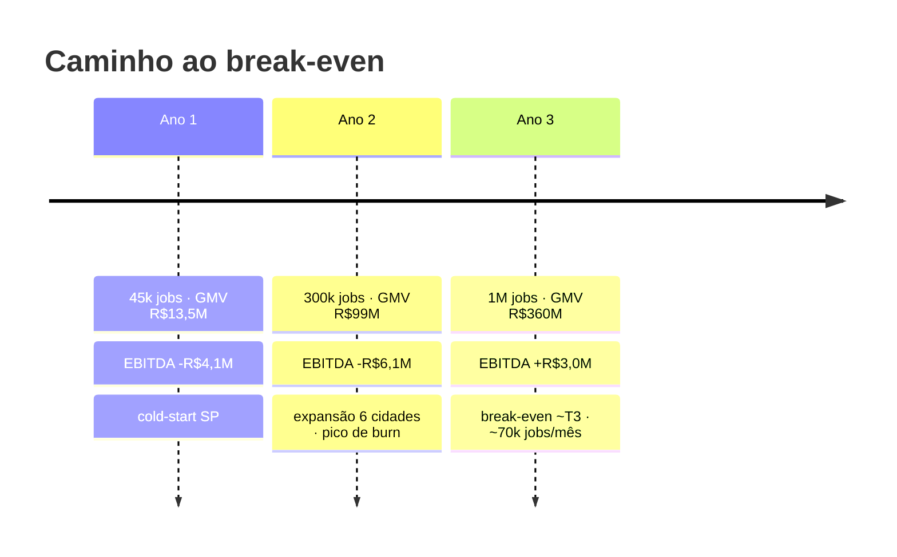

# 11 — Plano financeiro (3 anos, mercado brasileiro)

> Projeção de 3 anos para o JardimJá no Brasil. Todos os números são **ilustrativos
> e explicitamente premissados** — a intenção é mostrar a estrutura econômica e o
> caminho para o break-even, não prever o futuro. Valores em **BRL**. Casa com a
> [monetização](10-monetization.md) e a [aquisição](12-user-acquisition.md).

> ⚠️ **Aviso.** Startup pré-receita; estas são projeções de planejamento, não
> garantias. Cada premissa está declarada abaixo para poder ser contestada e ajustada.

---

## 1. Premissas explícitas

### Funil e crescimento
- **Lançamento city-by-city** começando em **São Paulo** ([playbook no doc 12](12-user-acquisition.md#7-checklist-de-lan%C3%A7amento-por-cidade)).
- Marketplace de duas pontas: só escala uma cidade após atingir **liquidez local**
  (match rate e tempo-até-primeira-oferta saudáveis).
- Ticket médio (GMV por job) sobe levemente com o tempo (mais jobs grandes/recorrentes).
- Take rate **efetivo** sobe de 10% → 12,5% via surge, assinaturas e destaque pago —
  **sem** subir a alíquota-base de 10% ([doc 10](10-monetization.md)).

| Premissa | Ano 1 | Ano 2 | Ano 3 |
| --- | --- | --- | --- |
| Cidades ativas (fim do ano) | 2 | 6 | 15 |
| **Jobs no ano** | **45.000** | **300.000** | **1.000.000** |
| Jobs/mês (run-rate de saída) | ~8.000 | ~40.000 | ~120.000 |
| Ticket médio (GMV/job) | R$300 | R$330 | R$360 |
| **GMV** | **R$13,5M** | **R$99,0M** | **R$360,0M** |
| Take rate efetivo | 10,0% | 11,0% | 12,5% |
| Conversão análise→job | 40% | 42% | 45% |
| CAC blended | R$30 | R$28 | R$25 |
| Jobs por cliente/ano | 4 | 4,5 | 5 |

### Custos variáveis (por job / por GMV)
- **Taxa de pagamento**: ~1,5% do GMV Ano 1 → 1,3% Ano 3 (mais volume migrando de
  **cartão ~2%** para **PIX ~1%**; incide sobre o **GMV inteiro**, pois a plataforma
  processa e faz o split).
- **Inferência de IA**: ~R$0,75 por job (inclui análises que não convertem —
  [doc 04, §11](04-ai-pipeline.md#11-custo-e-lat%C3%AAncia)).
- **Cloud/infra**: storage de fotos/vídeo, filas, banco, tracking.
- **Suporte (ops)**: custo por job cai com automação (R$2,0 → R$0,8).

---

## 2. Demonstração de resultados (anual, R$ milhões)

| Linha | Ano 1 | Ano 2 | Ano 3 |
| --- | ---: | ---: | ---: |
| GMV | 13,50 | 99,00 | 360,00 |
| **Receita líquida** (take + assinaturas) | **1,40** | **11,00** | **45,00** |
| **COGS** | (0,44) | (2,58) | (8,03) |
| **Lucro bruto** | **0,96** | **8,42** | **36,97** |
| Margem bruta | 69% | 77% | 82% |
| OpEx | (5,04) | (14,51) | (34,00) |
| **EBITDA** | **(4,08)** | **(6,09)** | **+2,97** |
| Margem EBITDA (s/ receita) | −291% | −55% | +6,6% |

**Leitura**: negócio de margem bruta alta (software + take), mas **prejuízo operacional
nos anos de investimento** (Ano 1–2), com **EBITDA positivo no Ano 3** conforme o
volume diluí a estrutura fixa. Clássico de marketplace: perde-se para comprar liquidez,
ganha-se quando a liquidez se autossustenta.

---

## 3. COGS

| COGS (R$M) | Ano 1 | Ano 2 | Ano 3 | Direcionador |
| --- | ---: | ---: | ---: | --- |
| Taxas de pagamento | 0,20 | 1,39 | 4,68 | ~1,3–1,5% do GMV |
| Inferência de IA | 0,03 | 0,23 | 0,75 | R$0,75/job |
| Cloud/infra | 0,12 | 0,60 | 1,80 | storage de mídia + compute |
| Suporte (ops) | 0,09 | 0,36 | 0,80 | R$2,0→0,8/job |
| **Total COGS** | **0,44** | **2,58** | **8,03** | |

Taxa de pagamento é o maior custo variável porque incide sobre o **GMV inteiro**.
**Migrar volume para PIX** é a alavanca #1 de margem bruta ([doc 10, §5](10-monetization.md#5-economia-unit%C3%A1ria-por-transa%C3%A7%C3%A3o)).

---

## 4. OpEx e plano de headcount

| OpEx (R$M) | Ano 1 | Ano 2 | Ano 3 |
| --- | ---: | ---: | ---: |
| Time (pessoal, fully-loaded) | 3,24 | 8,01 | 18,00 |
| Marketing / aquisição (CAC + marca) | 1,20 | 5,00 | 13,00 |
| G&A / ferramentas / infra não-cloud | 0,60 | 1,50 | 3,00 |
| **Total OpEx** | **5,04** | **14,51** | **34,00** |

| Headcount (fim do ano) | Ano 1 | Ano 2 | Ano 3 |
| --- | ---: | ---: | ---: |
| Engenharia | 8 | 18 | 34 |
| Produto / Design | 2 | 5 | 9 |
| Operações / Suporte | 4 | 12 | 28 |
| Growth / Marketing | 2 | 6 | 12 |
| G&A / Liderança | 2 | 4 | 7 |
| **Total** | **18** | **45** | **90** |

Custo médio fully-loaded por pessoa ~R$180k/ano (Ano 1) subindo com senioridade. O
**marketing de aquisição** é a maior linha discricionária — pode ser acelerada ou
freada conforme o LTV/CAC observado por cidade.

---

## 5. Fluxo de caixa, burn e captação (seed)

| (R$M) | Ano 1 | Ano 2 | Ano 3 |
| --- | ---: | ---: | ---: |
| EBITDA | (4,08) | (6,09) | +2,97 |
| Burn anual | 4,08 | 6,09 | — |
| **Burn cumulativo** | (4,08) | (10,17) | (7,20) |

- **Pico de burn cumulativo** ≈ **R$10,2M**, no fim do Ano 2 / início do Ano 3.
- **Rodada seed sugerida: R$12M** — cobre o pico com **~20% de buffer** e ~24–27 meses
  de runway até o EBITDA cruzar zero.

### Uso dos recursos (R$12M)

| Uso | % | R$M | Para quê |
| --- | ---: | ---: | --- |
| Produto & Engenharia | 40% | 4,8 | core, IA/pricing, apps, chat, assinaturas |
| Growth & Aquisição | 30% | 3,6 | cold-start SP + expansão de cidades ([doc 12](12-user-acquisition.md)) |
| Operações & Expansão | 20% | 2,4 | onboarding de jardineiros, suporte, city launchers |
| G&A & Buffer | 10% | 1,2 | jurídico/LGPD, contábil, reserva |

---

## 6. Métricas de negócio

Base: contribuição por job ≈ **R$20** (take R$30 − COGS variável ~R$10, ticket R$300).

| Métrica | Valor (regime) | Como sai |
| --- | --- | --- |
| **Take rate** | 10% → 12,5% | `platformFeePercent` + surge/assinaturas ([doc 05](05-pricing-engine.md)) |
| **Margem de contribuição / job** | ~R$20 (~67% do take) | take − pagamento − IA − cloud − suporte |
| **CAC** (blended) | R$30 → R$25 | mix de canais ([doc 12, §5](12-user-acquisition.md#5-cac-alvo-por-canal)) |
| **LTV** | ~R$200–250 | 4–5 jobs/ano × ~2,5 anos × R$20 |
| **LTV / CAC** | ~6–8× | saudável (> 3× é a régua) |
| **Payback de CAC** | ~3–4 meses (≈1,5 job) | CAC ÷ contribuição por job |
| **Margem bruta** | 69% → 82% | ganho de escala + mix PIX |

---

## 7. Análise de break-even

O EBITDA cruza zero quando a **contribuição mensal** cobre a **estrutura fixa**
(time + G&A + marca) mais o CAC do período.

- **Contribuição por job** (regime Ano 3, ticket R$360, take efetivo 12,5%): take ≈ R$45
  − COGS variável ≈ R$8 = **~R$37/job**.
- **Custo fixo mensal** (regime de saída Ano 2 → Ano 3): time + G&A ≈ **R$1,8–2,2M/mês**.
- **Break-even ≈ (custo fixo) ÷ (contribuição por job líquida de CAC)** →
  ordem de **~65.000–75.000 jobs/mês** (~R$23–27M de GMV/mês).

Esse run-rate é atingido em torno do **3º trimestre do Ano 3** — coerente com o EBITDA
anual positivo do Ano 3. Antes disso, o negócio é **deliberadamente deficitário** para
comprar liquidez de mercado; o gatilho de aceleração de marketing deve ser **LTV/CAC > 4
por cidade**, não uma meta de crescimento absoluta.

### Sensibilidade (o que mais move o resultado)
| Variável | −20% | Base | +20% | Impacto |
| --- | --- | --- | --- | --- |
| Take rate efetivo | atrasa break-even ~2 trim. | 10–12,5% | antecipa ~2 trim. | **alto** |
| CAC | acelera | R$25–30 | queima mais caixa | **alto** |
| Ticket médio | comprime contribuição | R$300–360 | melhora margem | médio |
| Retenção (jobs/cliente) | derruba LTV/CAC | 4–5/ano | LTV/CAC dispara | **alto** |
| Taxa de pagamento | +margem | 1,3–1,5% | −margem | médio |

---

### Referências cruzadas
- [`10-monetization.md`](10-monetization.md) — fontes de receita e economia unitária.
- [`12-user-acquisition.md`](12-user-acquisition.md) — CAC por canal e liquidez.
- [`05-pricing-engine.md`](05-pricing-engine.md) — take rate e GMV por job.
- [`13-roadmap.md`](13-roadmap.md) — quando novas receitas entram no modelo.
</content>
