# 11 — Frontend · Drone Kairós ERP

**Documento:** `11 — Frontend`
**Versão:** 1.0 · **Data:** 21 de julho de 2026 · **Status:** Ativo
**Dependências:** `00`, `01`, `02`, `03`, `04`, `05`, `06`, `07`, `08`, `09`, `10`
**Responsável:** Engenharia Frontend / UX

---

## 1. Resumo Executivo

Este documento define a **arquitetura, o design system e os padrões de engenharia frontend** dos painéis web do Drone Kairós ERP. O escopo cobre exclusivamente as **superfícies web** — **Painel do Fabricante**, **Painel da Revenda**, **Portal Administrativo** e **telas de BI**. Os aplicativos de campo (técnico, piloto, cliente) são **Flutter** e estão especificados em documento separado; este documento não os cobre, mas define os contratos de UX compartilhados (tokens, i18n, terminologia) que ambos os mundos consomem.

**Recomendação de stack:** **React 18+ com TypeScript estrito**, empacotado por **Vite**, roteado por **TanStack Router** (type-safe) e com **TanStack Query** para data fetching/cache de estado de servidor. A justificativa detalhada está na seção 5; em resumo, o React oferece o maior ecossistema enterprise, a melhor maturidade de TypeScript, a maior disponibilidade de talento no mercado brasileiro e a flexibilidade arquitetural que a natureza multiempresa e white-label do Kairós exige.

**Pilares inegociáveis** (herdados do Project Canon):

1. **Multiempresa de 1ª classe** — o `tenant` é um contexto de primeira ordem na UI: tema, dados, permissões e navegação derivam dele.
2. **Segurança por padrão** — rotas protegidas por papel, *nenhuma* decisão de autorização confiada apenas ao cliente, tokens de curta duração e isolamento de tenant explícito.
3. **i18n-ready** — nenhuma string *hard-coded*; pt-BR como padrão, en-US e es-ES como alvos imediatos.
4. **Acessibilidade** — meta **WCAG 2.2 nível AA** em todas as telas de produção.

O documento entrega diagramas Mermaid, exemplos de estrutura de componentes, o mapa de telas por perfil e um checklist de auditoria acionável.

---

## 2. Objetivos

1. **Recomendar e justificar** a stack web de forma defensável (React vs. Angular vs. Vue).
2. Especificar um **Design System** versionado — tokens, biblioteca de componentes, temas, white-label e padrões de UI.
3. Definir a **arquitetura frontend**: modularização por domínio, avaliação de micro-frontends, gerenciamento de estado, data fetching e cache.
4. Padronizar os **três painéis por perfil** (fabricante, revenda, admin) e o modelo de navegação.
5. Estabelecer o modelo de **autenticação/autorização na UI** com rotas protegidas por papel e contexto de tenant.
6. Garantir **acessibilidade (WCAG 2.2 AA)** e **internacionalização** por construção.
7. Definir metas e técnicas de **performance** (code splitting, SSR/CSR, orçamento de bundle).
8. Definir a **estratégia de testes** (unitário, componente, integração, E2E, visual, a11y).

---

## 3. Escopo

### 3.1 Dentro do escopo

- Painéis web SPA: Fabricante, Revenda, Portal Administrativo.
- Telas de BI embarcadas (dashboards, relatórios, exportações).
- Design System web (pacote `@kairos/ui`) e biblioteca de tokens (`@kairos/tokens`).
- Camada de autenticação/autorização de UI e o contexto de tenant.
- Estratégia de i18n, a11y, performance e testes das superfícies web.

### 3.2 Fora do escopo (referenciado, não detalhado)

| Item | Onde é tratado |
|---|---|
| Apps de campo (técnico/piloto/cliente) | Documento **Mobile/Flutter** (separado) |
| Contratos de API, GraphQL/REST, paginação | Documento **08 — API/Backend** |
| Modelo de identidade, papéis, escopos OAuth | Documento **07 — Segurança & IAM** |
| Modelo de dados e SN (Serial Number) | Documento **06 — Domínio/Dados** |
| Design visual de marca (logo, ilustração) | Guia de Marca |

### 3.3 Perfis (personas) das superfícies web

- **Fabricante** — gestão de catálogo, produção, homologação, garantia, rede de revendas, BI de fabricação.
- **Revenda** — vendas, CRM, ordens de serviço, estoque local, faturamento, BI comercial.
- **Administrador da plataforma (Kairós)** — operação multiempresa, provisionamento de tenants, auditoria, feature flags, suporte, observabilidade de negócio.

---

## 4. Regras

Regras normativas. Palavras-chave conforme RFC 2119 (**DEVE**, **NÃO DEVE**, **PODE**).

| # | Regra |
|---|---|
| R-01 | Todo texto visível ao usuário **DEVE** vir da camada de i18n. Strings *hard-coded* **NÃO DEVEM** passar no CI (regra de lint). |
| R-02 | Nenhuma tela **DEVE** renderizar dados de outro tenant. O `tenantId` **DEVE** ser derivado do token/sessão, nunca de parâmetro de URL manipulável sem revalidação no servidor. |
| R-03 | Decisões de autorização na UI (ocultar/mostrar) são **conveniência**, não segurança. O backend **DEVE** reautorizar toda ação. |
| R-04 | Todo componente interativo **DEVE** ser operável por teclado e ter nome acessível (WCAG 2.2 AA). |
| R-05 | Todo acesso a dados de servidor **DEVE** passar pela camada TanStack Query (sem `fetch` solto em componentes). |
| R-06 | Tokens de design **DEVEM** ser a única fonte de cor, espaçamento, tipografia e raio. Valores mágicos em CSS **NÃO DEVEM** ser usados. |
| R-07 | Segredos, chaves e tokens de longa duração **NÃO DEVEM** residir no bundle nem no `localStorage`. Tokens de acesso **DEVEM** ser de curta duração; refresh via cookie `HttpOnly`+`SameSite`. |
| R-08 | Toda rota de dados sensíveis **DEVE** ser *lazy-loaded* e protegida por *guard* de papel + tenant. |
| R-09 | O orçamento de performance (seção 7) é um *gate* de CI. Regressões acima do limite **DEVEM** bloquear o merge. |
| R-10 | Todo componente do Design System **DEVE** ter história (Storybook), teste de a11y e teste de snapshot visual antes de ser publicado. |
| R-11 | Erros de rede/servidor **DEVEM** ser tratados com *error boundary* de rota e estado de UI explícito (loading/empty/error/success). |
| R-12 | O tema do tenant (white-label) **DEVE** ser aplicado via CSS custom properties em tempo de execução, sem rebuild. |

---

## 5. Arquitetura (Frontend)

### 5.1 Recomendação de stack — comparação

Avaliação dos três frameworks candidatos sob os critérios que importam para o Kairós: ecossistema enterprise, maturidade de TypeScript, adequação a multiempresa/white-label, disponibilidade de talento (BR) e flexibilidade arquitetural.

| Critério (peso) | **React 18+** | **Angular 17+** | **Vue 3** |
|---|---|---|---|
| Ecossistema enterprise (25%) | Excelente — maior universo de libs (data grid, charts, forms, RBAC) | Muito bom — framework "baterias inclusas", opinativo | Bom — ecossistema sólido, menor que React |
| Maturidade TypeScript (20%) | Excelente — TS de 1ª classe, tipos maduros | Excelente — TS nativo/obrigatório | Muito bom — TS melhorou muito no v3 |
| Multiempresa / white-label (15%) | Excelente — theming via context + CSS vars trivial | Bom — mais cerimônia (DI, módulos) | Muito bom — theming simples |
| Talento no mercado (BR) (15%) | Excelente — maior pool de contratação | Médio — pool menor, mais sênior | Médio — pool crescente, menor |
| Flexibilidade arquitetural (10%) | Excelente — não opinativo, compõe micro-frontends | Médio — opinativo, mais rígido | Muito bom — flexível |
| Curva de aprendizado (10%) | Boa | Íngreme | Suave |
| Performance / bundle (5%) | Muito boa (com Vite + code splitting) | Boa (bundle maior) | Muito boa |
| **Veredito** | **Recomendado** | Alternativa forte para times já Angular | Alternativa leve |

**Decisão: React 18+ com TypeScript estrito.**

Justificativa resumida:

- **Ecossistema enterprise e contratação** — o React tem o maior conjunto de bibliotecas maduras para os problemas concretos do Kairós (data grids densos para estoque/produção, gráficos de BI, formulários complexos de garantia/OS, virtualização de listas de SN) e o maior pool de talentos no Brasil, reduzindo risco de projeto.
- **Flexibilidade para multiempresa/white-label** — theming em tempo de execução via Context + CSS custom properties é idiomático e barato; não exige rebuild por tenant.
- **Arquitetura evolutiva** — o React não nos amarra a uma opinião única; permite começar como monólito modular e extrair micro-frontends se e quando a escala exigir (seção 5.4).
- **Angular** seria a escolha se o time já fosse majoritariamente Angular (opinatividade reduz decisões), mas impõe mais cerimônia para white-label e tem pool de contratação menor. **Vue** é tecnicamente excelente e mais leve, porém com ecossistema enterprise e mercado de talentos menores — risco maior para um ERP de longo ciclo.

### 5.2 Stack de referência

| Camada | Escolha | Papel |
|---|---|---|
| Linguagem | TypeScript (strict) | Segurança de tipos ponta a ponta |
| UI | React 18+ | Biblioteca de renderização |
| Build/Dev | Vite | Bundler rápido, HMR, code splitting |
| Roteamento | TanStack Router | Rotas type-safe, guards, *lazy routes* |
| Estado de servidor | TanStack Query | Fetch, cache, revalidação, retry |
| Estado de cliente | Zustand | Estado global leve (UI, preferências) |
| Formulários | React Hook Form + Zod | Forms performáticos + validação/inferência de tipos |
| Estilo | CSS Modules + Design Tokens (CSS vars) | Escopo local + theming em runtime |
| Componentes base | Radix UI (headless) | Acessibilidade nativa, sem opinião visual |
| i18n | `react-i18next` + ICU MessageFormat | Traduções, pluralização, formatação |
| Data grid | TanStack Table | Tabelas densas, virtualizadas |
| Gráficos/BI | Visx / ECharts | Visualizações de BI |
| Testes | Vitest, Testing Library, Playwright, axe-core | Unit/componente/E2E/a11y |
| Documentação viva | Storybook | Catálogo do Design System |

### 5.3 Arquitetura de aplicação — monólito modular por domínio

A recomendação de **partida** é um **monólito modular** (uma SPA por painel, ou uma SPA única com *feature areas* por perfil), organizado por **domínio de negócio**, não por tipo de arquivo. Isso maximiza velocidade inicial, coesão e simplicidade, mantendo fronteiras claras para futura extração.

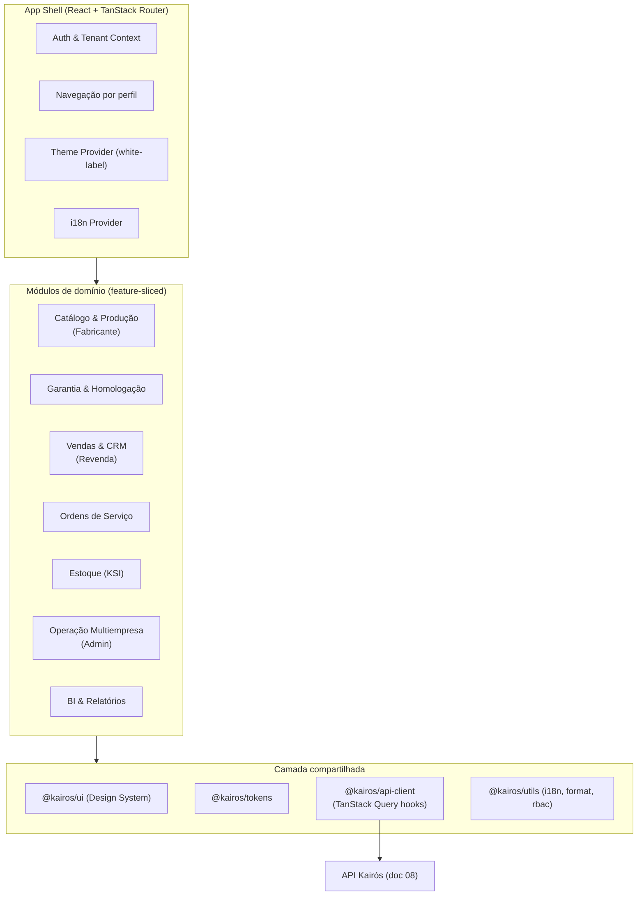

**Estrutura de pastas (feature-sliced por domínio):**

```
src/
  app/                      # shell: providers, router, layouts
    providers/
      AuthProvider.tsx
      TenantProvider.tsx
      ThemeProvider.tsx
      QueryProvider.tsx
    router/
      routes.tsx            # árvore de rotas type-safe
      guards.ts             # role + tenant guards
    layouts/
      ManufacturerLayout.tsx
      ResellerLayout.tsx
      AdminLayout.tsx
  domains/
    catalog/
      components/
      hooks/                # useProducts, useProductMutation (TanStack Query)
      api/                  # endpoints do domínio
      types/
      routes.tsx           # sub-rotas lazy do domínio
      index.ts             # API pública do módulo (barrel controlado)
    warranty/
    sales/
    service-orders/
    inventory/
    admin/
    bi/
  shared/
    ui/                     # re-export de @kairos/ui
    lib/                    # rbac, format, i18n helpers
    config/                 # feature flags, env
  main.tsx
```

**Regras de fronteira:** um domínio **PODE** importar de `shared/` e da sua própria pasta; **NÃO DEVE** importar do interior de outro domínio (só do `index.ts` público). Enforced por ESLint (`import/no-restricted-paths` + `boundaries`).

### 5.4 Micro-frontends — avaliação

Avaliamos micro-frontends (MFE) via Module Federation. **Decisão: não adotar no MVP; reavaliar por gatilho.**

| Aspecto | Monólito modular (recomendado agora) | Micro-frontends |
|---|---|---|
| Velocidade inicial | Alta | Baixa (overhead de infra) |
| Complexidade operacional | Baixa | Alta (versionamento, contratos, orquestração) |
| Deploy independente por time | Não | Sim |
| Consistência de Design System | Trivial | Exige governança forte de versões |
| Adequação ao tamanho de time atual | Ótima | Excessiva |

**Gatilhos que justificariam extrair MFEs** (qualquer um sustentado):

1. Mais de ~3 times de produto autônomos tocando o mesmo repositório com conflitos frequentes.
2. Necessidade de ciclos de release independentes por painel (ex.: BI evoluindo em cadência própria).
3. Um painel com stack divergente justificada.

Quando ocorrer, o candidato natural a primeira extração é **BI & Relatórios** (fronteira mais isolada) via **Module Federation** com o App Shell como host. Até lá, mantemos **um design system compartilhado** e **fronteiras de domínio disciplinadas** — o que torna a futura extração barata.

### 5.5 Gerenciamento de estado

Separação explícita entre **estado de servidor** e **estado de cliente** — a principal decisão de arquitetura de estado.

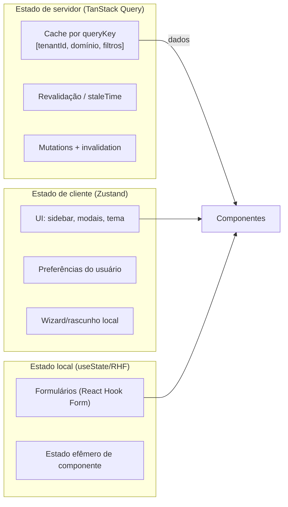

- **Estado de servidor → TanStack Query.** *Nunca* duplicar dados de servidor em store global. A `queryKey` **DEVE** incluir o `tenantId` como primeiro segmento para isolar cache entre tenants (evita vazamento de cache ao trocar de contexto).
- **Estado de cliente global → Zustand.** Apenas UI e preferências (tema selecionado, sidebar colapsada, locale).
- **Estado local → `useState` / React Hook Form.** Formulários e efêmeros.

### 5.6 Data fetching e cache

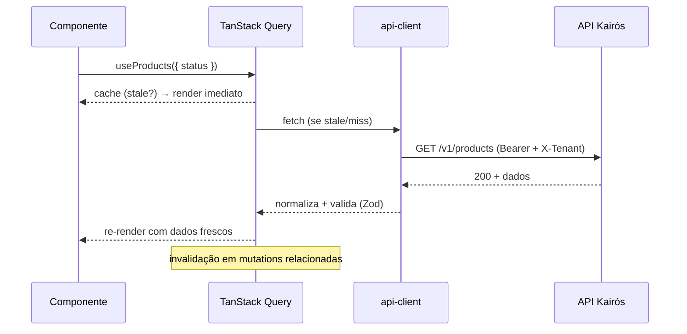

Diretrizes:

- **`queryKey` canônica:** `[tenantId, 'domínio', 'entidade', params]`.
- **`staleTime`** por natureza do dado: catálogo (min. 5–10 min), dados operacionais/OS (30–60 s), BI (configurável).
- **Mutations** disparam `invalidateQueries` das chaves afetadas; usar *optimistic updates* onde o UX exige resposta instantânea (ex.: mudar status de OS).
- **Cliente HTTP** (`@kairos/api-client`) injeta `Authorization` e cabeçalho de tenant, trata refresh de token de forma transparente e valida payloads com **Zod** (defesa contra drift de contrato).
- **Paginação/virtualização** para listas densas (SNs, estoque): cursor-based + TanStack Virtual.

---

## 6. Diagramas

### 6.1 Contexto de sistema (C4 — nível 1)

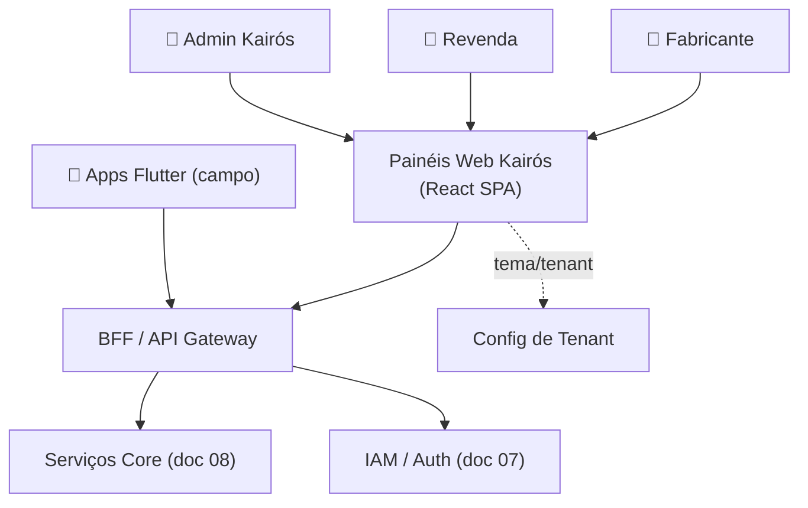

### 6.2 Componentes do frontend (C4 — nível 3)

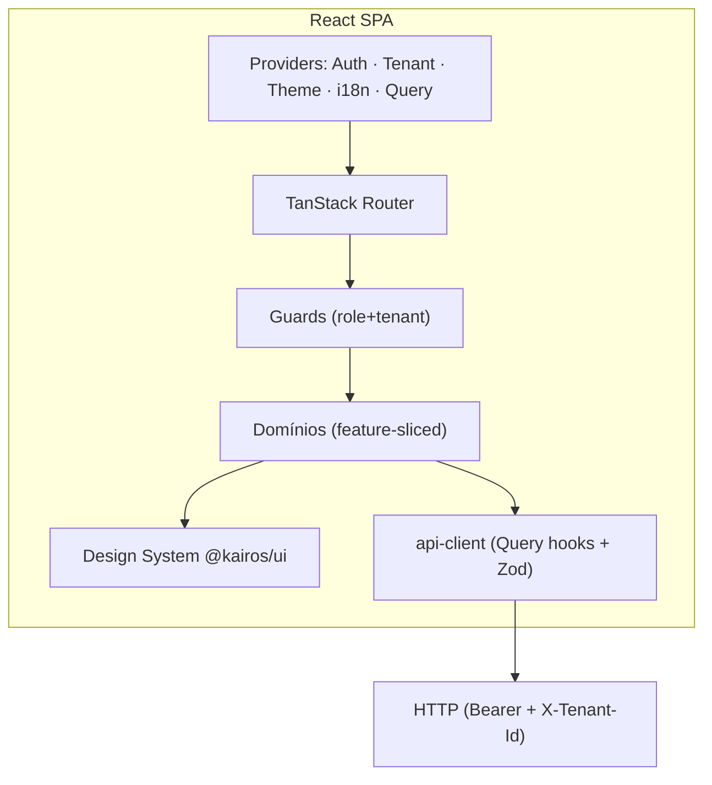

### 6.3 Camadas de theming (white-label)

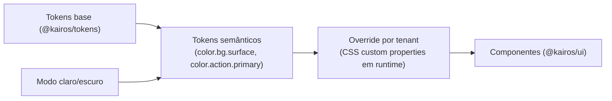

---

## 7. Fluxogramas

### 7.1 Bootstrap da aplicação (auth + tenant + tema)

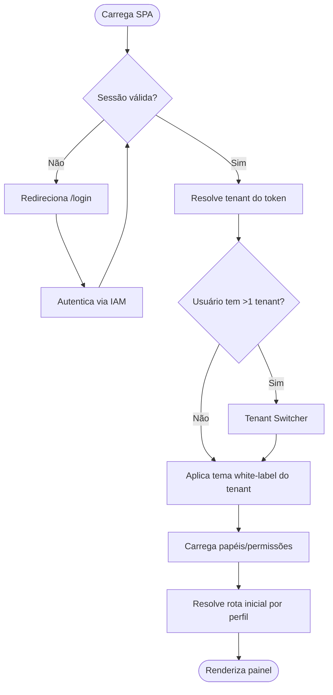

### 7.2 Guard de rota protegida

```mermaid
flowchart TD
  Nav([Navega para rota]) --> Authn{Autenticado?}
  Authn -- Não --> ToLogin[/login]
  Authn -- Sim --> Tenant{Tenant no contexto?}
  Tenant -- Não --> ToPicker[Tenant Switcher]
  Tenant -- Sim --> Role{Papel autorizado p/ rota?}
  Role -- Não --> Forbidden[403 - Acesso negado]
  Role -- Sim --> Lazy[Carrega chunk lazy do domínio]
  Lazy --> Boundary[Error/Suspense boundary]
  Boundary --> Show([Renderiza tela])
```

### 7.3 Ciclo de mutação com invalidação de cache

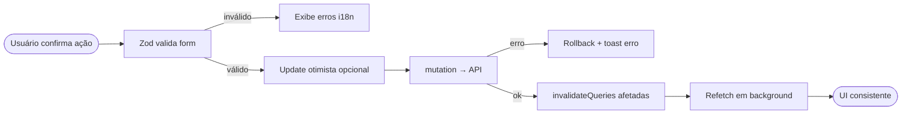

---

## 8. Boas Práticas

### 8.1 Engenharia

- **TypeScript strict** em todo o repositório; `any` proibido por lint (exceções justificadas por comentário).
- **Composição sobre herança**; componentes pequenos e puros; lógica em hooks reutilizáveis.
- **Separação apresentação vs. dados** — componentes "burros" recebem props; hooks concentram acesso a dados.
- **Barrels controlados** (`index.ts`) como única superfície pública de cada domínio.
- **Feature flags** (`@kairos/config`) para lançamento gradual e kill-switch.
- **Error boundaries por rota** + estados de UI explícitos (loading/empty/error/success) em toda tela.

### 8.2 UX

- Estados vazios com ação de saída (nunca uma tela em branco).
- Feedback em ≤ 100 ms para toda interação (skeletons, otimismo).
- Formulários com validação inline, mensagens acionáveis e preservação de rascunho.
- Consistência de terminologia via glossário i18n compartilhado com o Flutter.

### 8.3 Segurança de UI

- Nunca confiar em ocultação de elementos como controle de acesso (R-03).
- Sanitizar toda renderização de HTML dinâmico; CSP estrita; sem `dangerouslySetInnerHTML` sem sanitização.
- Tokens de acesso em memória; refresh via cookie `HttpOnly`.
- Isolamento de cache por `tenantId` na `queryKey` (evita vazamento entre tenants).

---

## 9. Padrões (Design System + Código)

### 9.1 Design System — visão

O Design System Kairós é distribuído como **pacotes versionados** (SemVer), consumidos por todos os painéis web:

- **`@kairos/tokens`** — tokens de design (fonte única de verdade), gerados via **Style Dictionary** para CSS custom properties, TS e (export) para Flutter.
- **`@kairos/ui`** — biblioteca de componentes React (headless Radix + tokens).
- **`@kairos/icons`** — iconografia SVG.
- Documentação viva em **Storybook** (R-10).

### 9.2 Tokens de design (3 camadas)

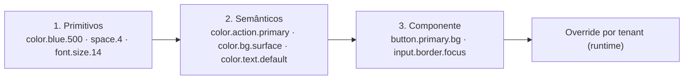

Exemplo (tokens semânticos, formato agnóstico):

```json
{
  "color": {
    "action": { "primary": { "value": "{color.brand.600}" } },
    "bg":     { "surface": { "value": "{color.neutral.0}" },
                "muted":   { "value": "{color.neutral.50}" } },
    "text":   { "default": { "value": "{color.neutral.900}" },
                "inverse": { "value": "{color.neutral.0}" } },
    "feedback": { "danger": { "value": "{color.red.600}" },
                  "success": { "value": "{color.green.600}" } }
  },
  "space": { "4": { "value": "16px" } },
  "radius": { "md": { "value": "8px" } }
}
```

Renderizados como CSS custom properties consumidas por todos os componentes:

```css
:root {
  --color-action-primary: #1E5EFF;
  --color-bg-surface: #FFFFFF;
  --color-text-default: #101828;
  --space-4: 16px;
  --radius-md: 8px;
}
/* Override por tenant, injetado em runtime — sem rebuild */
[data-tenant="acme-drones"] {
  --color-action-primary: #0B7A57; /* verde da marca do tenant */
}
/* Modo escuro */
[data-theme="dark"] {
  --color-bg-surface: #101828;
  --color-text-default: #F2F4F7;
}
```

### 9.3 Temas e white-label multiempresa

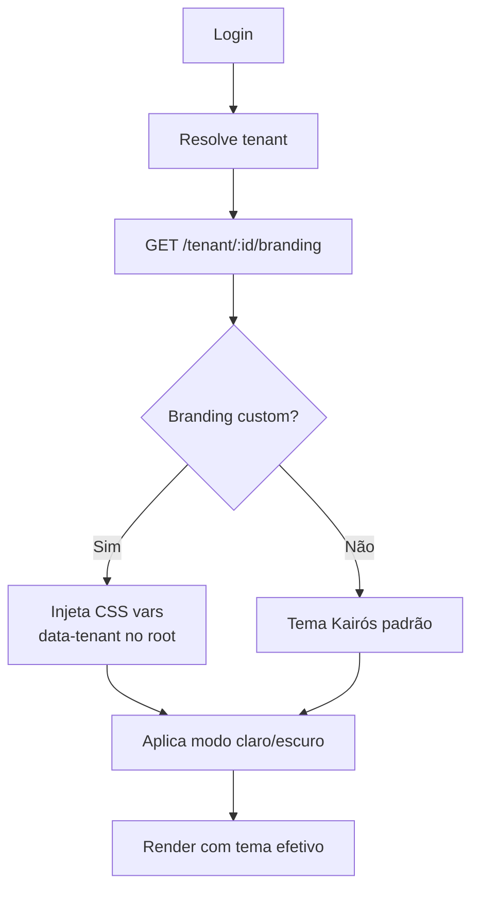

- **White-label por tenant:** logo, cor primária, cor de destaque, raio, densidade — todos como override de tokens semânticos aplicados em runtime via `data-tenant`.
- **Sem rebuild por tenant** (R-12): o branding é dado, não build artifact.
- **Modo claro/escuro** ortogonal ao white-label.
- **Fallback** garantido para o tema Kairós padrão.
- **Acessibilidade:** validação automática de contraste (AA) sobre a paleta do tenant no pipeline de onboarding — um branding que reprove no contraste é sinalizado.

### 9.4 Biblioteca de componentes

Organização por **atomic design** pragmático:

| Nível | Exemplos |
|---|---|
| Primitivos | `Button`, `Input`, `Select`, `Checkbox`, `Badge`, `Icon` |
| Compostos | `FormField`, `DataTable`, `Combobox`, `DatePicker`, `Tabs`, `Dialog`, `Toast` |
| Padrões | `PageHeader`, `FilterBar`, `EntityTable`, `DetailDrawer`, `Wizard`, `StatCard` |
| Layouts | `AppShell`, `SidebarNav`, `TenantSwitcher`, `SplitView` |

**Anatomia de um componente do DS:**

```
packages/ui/src/Button/
  Button.tsx           # implementação (Radix Slot + tokens)
  Button.types.ts      # props tipadas
  Button.module.css    # estilos via CSS vars (tokens)
  Button.stories.tsx   # Storybook (variantes, estados)
  Button.test.tsx      # Testing Library + axe (a11y)
  index.ts             # export público
```

Exemplo (assinatura + uso):

```tsx
// Button.types.ts
export interface ButtonProps
  extends React.ButtonHTMLAttributes<HTMLButtonElement> {
  variant?: 'primary' | 'secondary' | 'ghost' | 'danger';
  size?: 'sm' | 'md' | 'lg';
  loading?: boolean;
  iconStart?: React.ReactNode;
  asChild?: boolean; // composição via Radix Slot
}

// Uso em um domínio
<Button variant="primary" loading={isSubmitting} iconStart={<Icon name="save" />}>
  {t('common.actions.save')}
</Button>
```

### 9.5 Padrões de UI recorrentes

- **Tela de listagem (Entity List):** `PageHeader` + `FilterBar` + `EntityTable` (TanStack Table, virtualizada) + paginação + ações em massa. Estados loading/empty/error padronizados.
- **Tela de detalhe:** `DetailDrawer` ou `SplitView`, abas por aspecto (dados, histórico, garantia, SN).
- **Formulário/Wizard:** React Hook Form + Zod, validação inline, autosave de rascunho.
- **Dashboard/BI:** grid de `StatCard` + gráficos (Visx/ECharts) + filtros globais com sincronização em URL.
- **Sincronização de estado na URL:** filtros, paginação e abas persistem em query params (deep-link e compartilhamento).

---

## 10. Casos de Uso

### CU-01 — Login e resolução de tenant (multiempresa)

Ator: qualquer usuário. Fluxo: autentica → sistema resolve tenant(s) do token → se múltiplos, `TenantSwitcher` → aplica tema white-label → carrega permissões → roteia ao painel do perfil. **Regra:** cache é isolado por `tenantId`; trocar de tenant limpa/reparticiona o cache (R-02).

### CU-02 — Fabricante cadastra produto e vincula série (SN)

Ator: Fabricante. Fluxo: Catálogo → "Novo produto" (Wizard RHF+Zod) → geração/associação de faixa de SN → salva (mutation otimista) → invalida lista. **A11y:** wizard navegável por teclado, foco gerenciado entre passos.

### CU-03 — Revenda abre Ordem de Serviço

Ator: Revenda. Fluxo: OS → "Nova OS" → busca cliente/equipamento por SN (combobox assíncrono) → registra defeito/garantia → status otimista → notifica. **Autorização:** rota protegida por papel `reseller.service`.

### CU-04 — Admin provisiona novo tenant e branding

Ator: Admin Kairós. Fluxo: Portal Admin → Tenants → "Novo tenant" → configura branding (cores, logo) → **validação automática de contraste AA** → publica → tenant recebe tema em runtime sem deploy.

### CU-05 — Análise de BI comercial

Ator: Revenda/Fabricante. Fluxo: BI → dashboard com filtros globais (período, região) sincronizados na URL → drill-down → exporta (CSV/PDF). **Performance:** dados via TanStack Query com `staleTime` configurável e virtualização de tabelas.

### CU-06 — Usuário troca idioma

Ator: qualquer. Fluxo: preferências → seleciona locale (pt-BR/en-US/es-ES) → `react-i18next` recarrega bundle de mensagens (lazy) → formatação de datas/números/moeda segue o locale (Intl). Preferência persistida por usuário.

---

## 11. Modelagem — Mapa de Telas por Perfil

### 11.1 Painel do Fabricante

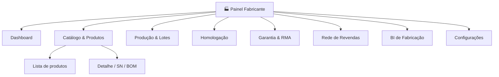

### 11.2 Painel da Revenda

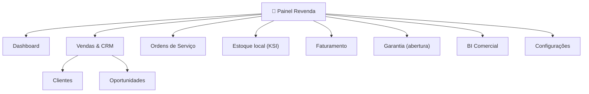

### 11.3 Portal Administrativo

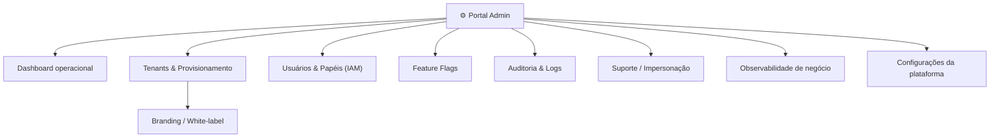

### 11.4 Matriz tela × perfil × permissão (extrato)

| Área / Tela | Fabricante | Revenda | Admin | Papel(is) exigido(s) |
|---|:--:|:--:|:--:|---|
| Dashboard | ✅ | ✅ | ✅ | `*.viewer` |
| Catálogo/Produtos | ✅ (CRUD) | 👁️ (leitura) | 👁️ | `manufacturer.catalog` |
| Produção & Lotes | ✅ | ❌ | 👁️ | `manufacturer.production` |
| Vendas & CRM | ❌ | ✅ | 👁️ | `reseller.sales` |
| Ordens de Serviço | 👁️ | ✅ | 👁️ | `reseller.service` |
| Estoque (KSI) | 👁️ | ✅ | 👁️ | `inventory.manage` |
| Garantia/RMA | ✅ (gestão) | ✅ (abertura) | 👁️ | `warranty.*` |
| Tenants/Branding | ❌ | ❌ | ✅ | `admin.tenant` |
| Feature Flags | ❌ | ❌ | ✅ | `admin.flags` |
| Auditoria | ❌ | ❌ | ✅ | `admin.audit` |

Legenda: ✅ acesso pleno · 👁️ somente leitura · ❌ sem acesso.

### 11.5 Modelo de navegação

- **Sidebar por perfil** (itens derivados de papéis + feature flags): itens sem permissão nem aparecem (R-03 — conveniência, revalidado no servidor).
- **Top bar:** `TenantSwitcher` (se multi-tenant), seletor de idioma, notificações, perfil.
- **Breadcrumbs** + deep-link por URL em todas as telas de listagem/detalhe.

---

## 12. Autenticação, Autorização e Contexto de Tenant na UI

> Consolida a seção 5 do foco de autenticação/autorização. Fonte de verdade de identidade: **doc 07 — Segurança & IAM**.

### 12.1 Modelo

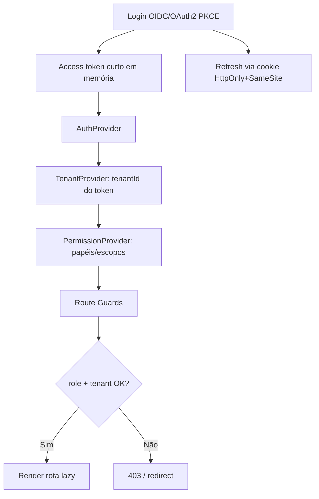

### 12.2 Rotas protegidas por papel (exemplo)

```tsx
// router/guards.ts
export function requireRole(roles: Role[]): RouteGuard {
  return ({ context }) => {
    const { isAuthenticated, tenantId, hasAnyRole } = context.auth;
    if (!isAuthenticated) return redirect({ to: '/login' });
    if (!tenantId)        return redirect({ to: '/select-tenant' });
    if (!hasAnyRole(roles)) return redirect({ to: '/403' });
  };
}

// routes.tsx — rota lazy protegida
const productionRoute = createRoute({
  path: '/production',
  beforeLoad: requireRole(['manufacturer.production']),
  component: lazy(() => import('@/domains/catalog/routes/Production')),
});
```

### 12.3 Componente de autorização declarativa

```tsx
// <Can> — conveniência de UI (não substitui autorização no servidor, R-03)
<Can role="reseller.service" fallback={<EmptyNoAccess />}>
  <NewServiceOrderButton />
</Can>
```

### 12.4 Regras de tenant

- `tenantId` deriva do **token**; parâmetros de URL de tenant são revalidados no servidor (R-02).
- Troca de tenant **reparticiona o cache** (queryKeys prefixadas por `tenantId`).
- Ações de impersonação (Admin) exibem **banner persistente** e são auditadas.

---

## 13. Acessibilidade (WCAG) e Internacionalização

### 13.1 Acessibilidade — meta WCAG 2.2 AA

| Diretriz | Implementação |
|---|---|
| Perceptível | Contraste AA (validado no pipeline, inclusive temas de tenant); texto alternativo; não depender só de cor |
| Operável | Navegação por teclado completa; foco visível; skip links; sem armadilhas de foco |
| Compreensível | Labels e erros associados; linguagem clara; ordem de leitura lógica |
| Robusto | HTML semântico + ARIA via Radix; nomes acessíveis em todo controle |

- **Ferramentas:** Radix (a11y nativa), `axe-core` em testes de componente e E2E, `eslint-plugin-jsx-a11y`, teste manual com leitor de tela nas telas críticas.
- **Gate de CI:** violações axe de severidade *serious/critical* bloqueiam merge (R-10).

### 13.2 Internacionalização

- **`react-i18next` + ICU MessageFormat** (pluralização, gênero, seleção).
- **`Intl`** para datas, números e moeda por locale.
- Locales-alvo: **pt-BR** (padrão), **en-US**, **es-ES**.
- **Bundles de tradução lazy** por locale e por domínio.
- **RTL-ready** por construção (uso de propriedades lógicas CSS — `margin-inline`, `padding-block`), mesmo sem idioma RTL imediato.
- **Sem strings hard-coded** (R-01, enforced por lint). Chaves namespaced: `domínio.contexto.chave`.
- **Glossário compartilhado** com o app Flutter para consistência de terminologia.

```tsx
// pluralização + interpolação (ICU)
t('inventory.items.count', { count }); // "1 item" / "5 itens"
// formatação por locale
new Intl.NumberFormat(locale, { style: 'currency', currency: 'BRL' }).format(v);
```

---

## 14. Performance

### 14.1 Estratégia de renderização — CSR com SSR seletivo

| Superfície | Estratégia | Justificativa |
|---|---|---|
| Painéis autenticados (Fabricante/Revenda/Admin) | **CSR (SPA)** | Apps ricos atrás de login; SEO irrelevante; interatividade alta |
| Páginas públicas (login, marketing, status) | **SSR/SSG** (se aplicável) | TTFB e SEO |
| BI pesado | CSR + virtualização + streaming de dados | Volume de dados |

O Kairós é um **ERP autenticado**: SSR não traz SEO e adiciona complexidade de infra. Adotamos **CSR com Vite**, reservando SSR/SSG apenas para superfícies públicas. Caso um framework SSR (Next/Remix) seja adotado depois, a fronteira de domínio já preparada torna a migração incremental.

### 14.2 Técnicas

- **Code splitting por rota e por domínio** (lazy routes) — cada painel/domínio é um chunk separado.
- **Tree-shaking** e imports granulares (evitar barrels pesados no runtime).
- **Prefetch** de rotas prováveis (hover/idle) via TanStack Router.
- **Virtualização** de listas densas (SN, estoque) com TanStack Virtual.
- **Memoização** criteriosa e `React.lazy`/`Suspense`.
- **Imagens** responsivas + `loading="lazy"`; ícones como SVG sprite.
- **Cache HTTP** e revalidação alinhados ao `staleTime` do Query.

### 14.3 Orçamento de performance (gate de CI — R-09)

| Métrica | Alvo |
|---|---|
| LCP (p75) | ≤ 2,5 s |
| INP (p75) | ≤ 200 ms |
| CLS | ≤ 0,1 |
| Bundle inicial (gzip) do shell | ≤ 200 KB |
| Chunk de domínio (gzip) | ≤ 150 KB |
| Time to Interactive (mid-tier) | ≤ 3,5 s |

Medição contínua via **Lighthouse CI** + **web-vitals** em RUM (Real User Monitoring), segmentado por tenant.

---

## 15. Testes de Frontend

### 15.1 Pirâmide de testes

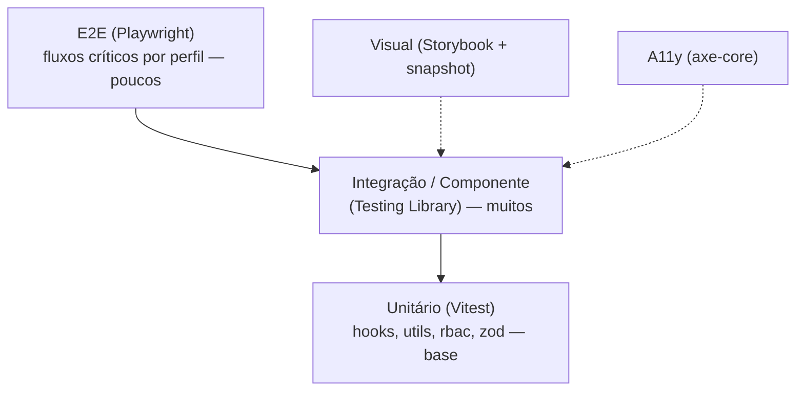

| Camada | Ferramenta | Cobre |
|---|---|---|
| Unitário | Vitest | Hooks, utils, guards RBAC, schemas Zod, tokens |
| Componente/Integração | Testing Library + MSW | Componentes do DS e telas com API mockada |
| Acessibilidade | axe-core (jest-axe) | Violações WCAG por componente/tela |
| Visual | Storybook + snapshot (Chromatic/Playwright) | Regressão visual e temas (inclui white-label) |
| E2E | Playwright | Fluxos críticos: login, tenant switch, CU-02..CU-05 |
| Contrato | MSW + tipos do api-client | Alinhamento com contratos da API (doc 08) |

### 15.2 Metas e gates

- Cobertura mínima: **80%** em `shared/` e domínios críticos (garantia, OS, tenant).
- **E2E** roda por perfil (fabricante/revenda/admin) contra ambiente efêmero com dados semeados.
- **a11y** e **visual** são gates de publicação do DS (R-10).
- **MSW** garante testes determinísticos sem depender do backend real.

### 15.3 Exemplo — teste de componente com a11y

```tsx
test('Button é acessível e responde ao clique', async () => {
  const onClick = vi.fn();
  const { container } = render(
    <Button variant="primary" onClick={onClick}>{'Salvar'}</Button>
  );
  expect(await axe(container)).toHaveNoViolations();
  await userEvent.click(screen.getByRole('button', { name: 'Salvar' }));
  expect(onClick).toHaveBeenCalledOnce();
});
```

---

## 16. Checklist

**Stack & arquitetura**
- [ ] React 18+ com TypeScript strict configurado
- [ ] Vite + TanStack Router (rotas type-safe e lazy)
- [ ] TanStack Query como única camada de estado de servidor (R-05)
- [ ] Fronteiras de domínio enforced por lint (`boundaries`)

**Design System**
- [ ] `@kairos/tokens` gerado (Style Dictionary), 3 camadas
- [ ] `@kairos/ui` publicado com Storybook, testes de a11y e visuais (R-10)
- [ ] White-label por tenant em runtime, com validação de contraste AA (R-12)
- [ ] Modo claro/escuro

**Auth & tenant**
- [ ] Guards por papel + tenant em todas as rotas sensíveis (R-08)
- [ ] Tokens de acesso em memória; refresh via cookie HttpOnly (R-07)
- [ ] Cache isolado por `tenantId` (R-02)
- [ ] `<Can>` como conveniência; autorização revalidada no servidor (R-03)

**A11y & i18n**
- [ ] Zero strings hard-coded (lint) (R-01)
- [ ] pt-BR/en-US/es-ES com bundles lazy
- [ ] axe sem violações serious/critical (gate)
- [ ] Navegação por teclado e foco visível em todas as telas (R-04)

**Performance**
- [ ] Code splitting por rota/domínio
- [ ] Orçamento de bundle e Web Vitals como gate de CI (R-09)
- [ ] RUM segmentado por tenant

**Testes**
- [ ] Vitest + Testing Library + MSW + Playwright configurados
- [ ] Cobertura ≥ 80% em shared/ e domínios críticos
- [ ] E2E por perfil

---

## 17. Riscos

| # | Risco | Prob. | Impacto | Mitigação |
|---|---|:--:|:--:|---|
| RK-01 | Vazamento de cache entre tenants ao trocar de contexto | Média | Alto | `queryKey` prefixada por `tenantId`; reparticionar cache no switch; teste E2E de troca de tenant |
| RK-02 | Branding de tenant reprovando contraste (a11y) | Média | Médio | Validação automática de contraste AA no onboarding; fallback ao tema padrão |
| RK-03 | Crescimento do bundle degradando performance | Alta | Médio | Orçamento como gate de CI; code splitting; auditoria periódica |
| RK-04 | Drift entre contrato de API e frontend | Média | Alto | Validação Zod no api-client; testes de contrato; tipos gerados |
| RK-05 | Adoção prematura de micro-frontends aumentando complexidade | Baixa | Alto | Gatilhos objetivos (5.4); manter monólito modular até atingi-los |
| RK-06 | Autorização confiada apenas ao cliente | Baixa | Crítico | R-03 normativo; revalidação no servidor; testes de segurança |
| RK-07 | Escassez de talento na stack | Baixa | Médio | React = maior pool no BR; padrões documentados; DS reduz curva |
| RK-08 | Inconsistência de terminologia web × Flutter | Média | Médio | Glossário i18n compartilhado; tokens exportados para ambos |
| RK-09 | Regressão visual não detectada | Média | Médio | Snapshots visuais (Storybook) como gate do DS |

---

## 18. Melhorias Futuras

1. **Extração de micro-frontend de BI** via Module Federation quando os gatilhos da seção 5.4 forem atingidos.
2. **SSR/streaming seletivo** (Next/Remix) para superfícies públicas e first paint de dashboards pesados.
3. **Editor visual de branding** self-service para tenants (preview em tempo real + validação AA).
4. **Modo offline parcial** para painéis web (alinhado ao KCI offline-first do ecossistema).
5. **Design tokens dinâmicos por densidade** (compacto/confortável) e temas de alto contraste.
6. **Geração de tipos ponta a ponta** (OpenAPI/GraphQL → TS) para eliminar drift (RK-04).
7. **Teste de performance sintético por tenant** com dados representativos.
8. **Copiloto de UX** (busca/ações assistidas) sobre a camada de dados existente.

---

## 19. Auditoria

### 19.1 Rastreabilidade

| Requisito do canon | Onde é atendido |
|---|---|
| Multiempresa 1ª classe | 5.3, 5.5, 9.3, 12.4; regras R-02, R-12 |
| Segurança por padrão | 8.3, 12; regras R-02, R-03, R-07, R-08 |
| i18n-ready | 13.2; regra R-01 |
| Acessibilidade | 13.1; regras R-04, R-10 |
| Painéis: Fabricante/Revenda/Admin + BI | 5.3, 10, 11 |
| Mobile Flutter fora de escopo (doc separado) | 3.2 |

### 19.2 Critérios de aceite do documento

- [x] Stack recomendada com comparação justificada (React vs Angular vs Vue) — seção 5.1
- [x] Design System: tokens, componentes, temas, white-label — seção 9
- [x] Arquitetura: modularização, micro-frontends avaliados, estado, data fetching, cache — seção 5
- [x] Padrões dos painéis por perfil e navegação — seções 10, 11
- [x] Auth/authz na UI com rotas por papel e contexto de tenant — seção 12
- [x] Acessibilidade (WCAG) e i18n — seção 13
- [x] Performance (code splitting, SSR/CSR) — seção 14
- [x] Testes de frontend — seção 15
- [x] Diagramas Mermaid e exemplos de estrutura de componentes — seções 5, 6, 7, 9, 12, 15

### 19.3 Controle de versão

| Versão | Data | Autor | Alteração |
|---|---|---|---|
| 1.0 | 21 de julho de 2026 | Engenharia Frontend / UX | Versão inicial aprovada |

### 19.4 Cadência de revisão

- **Trimestral** ou a cada mudança relevante de stack/contrato de API.
- Revisores: Engenharia Frontend, UX, Segurança (seção 12), Arquitetura (seção 5).

---

*Fim do documento 11 — Frontend · Drone Kairós ERP.*
