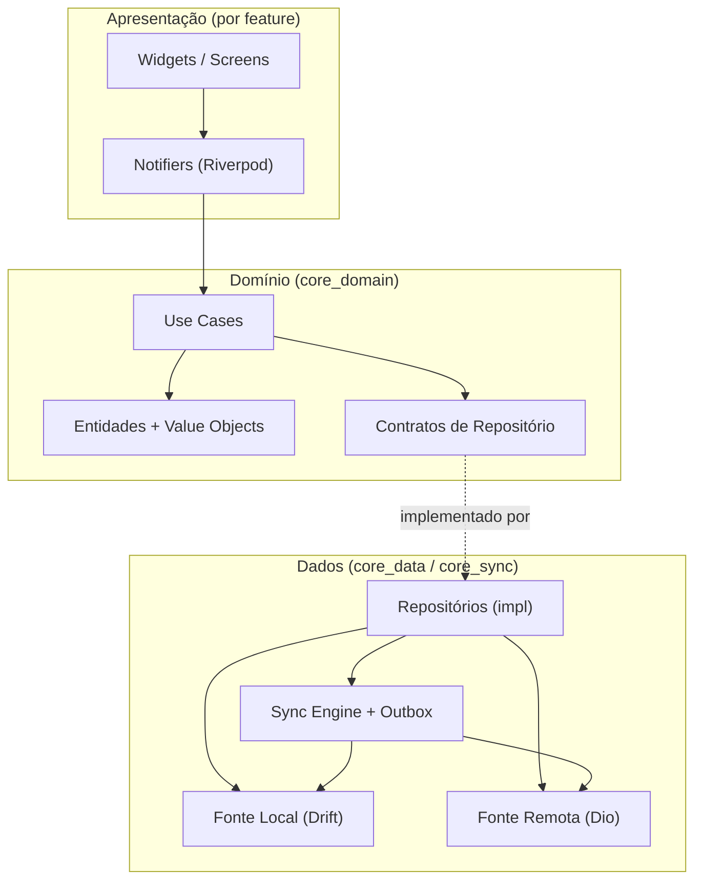
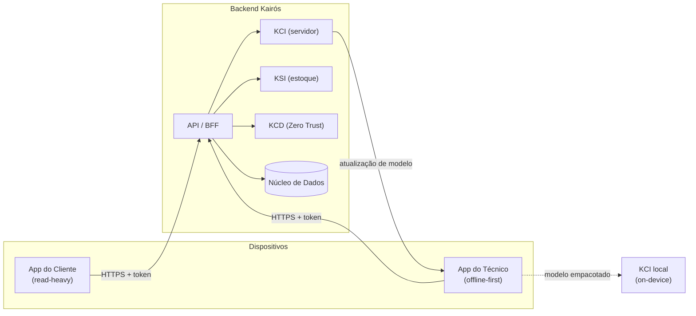
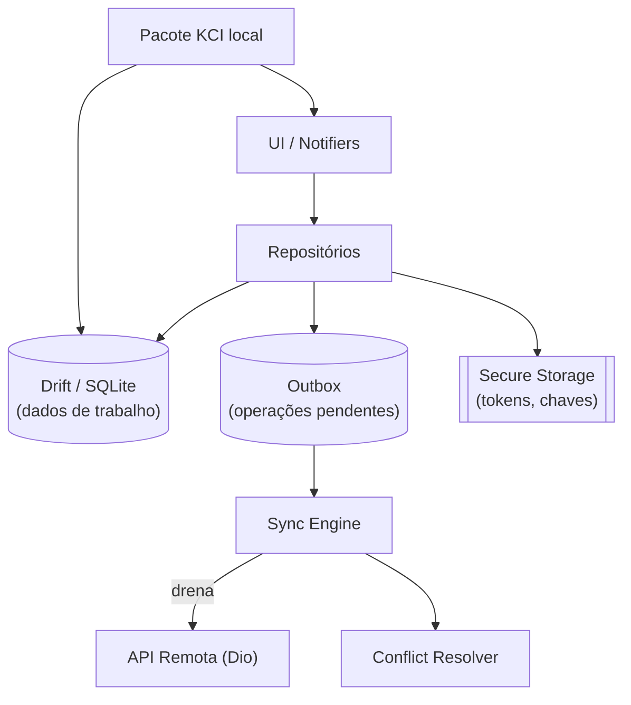
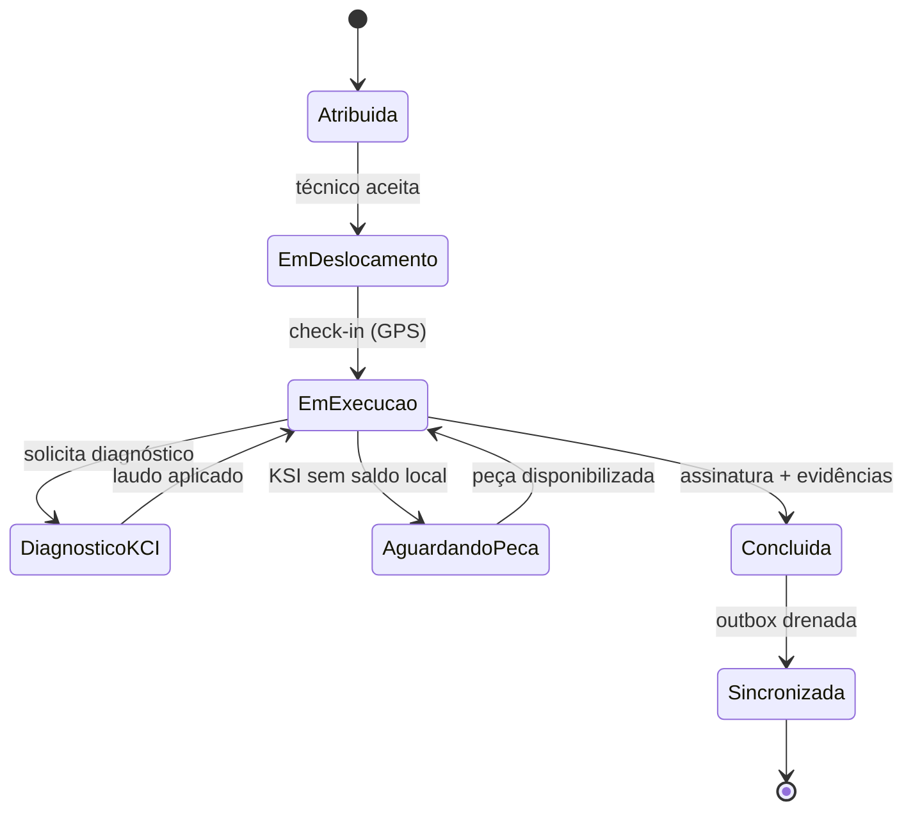
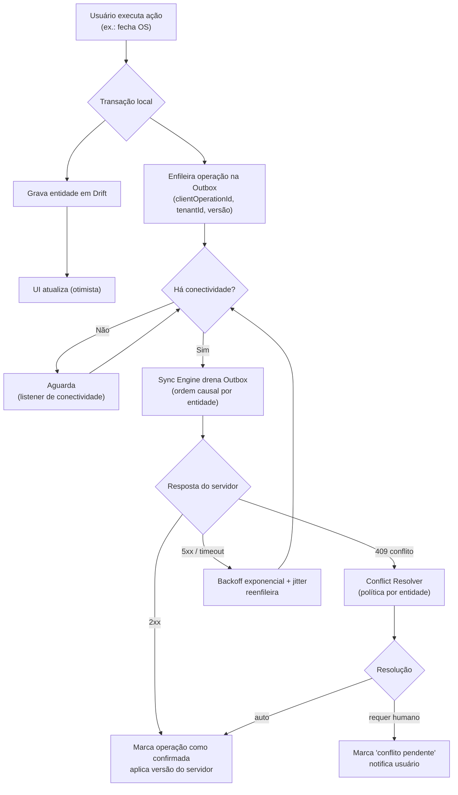
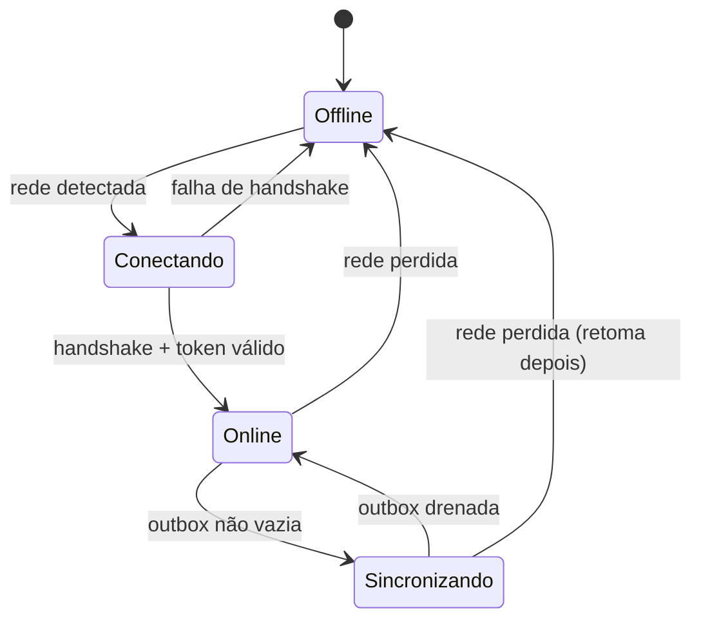
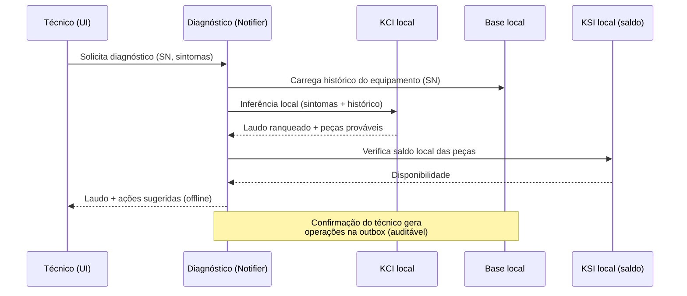
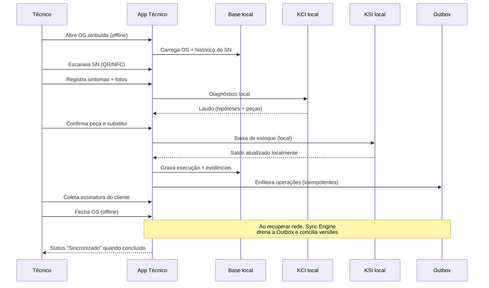
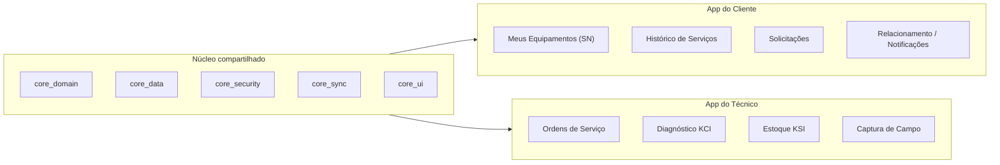

# 12 — Mobile · Drone Kairós ERP

**Documento:** `12 — Mobile`
**Versão:** 1.0 · **Data:** 21 de julho de 2026 · **Status:** Ativo
**Dependências:** `00`, `01`, `02`, `03`, `04`, `05`, `06`, `07`, `08`, `09`, `10`, `11`
**Responsável:** Engenharia Mobile

---

## 1. Resumo Executivo

Este documento especifica a **camada mobile** do Drone Kairós ERP: dois aplicativos nativos construídos em **Flutter**, publicados a partir de um mesmo *monorepo* e compartilhando um núcleo de domínio comum, porém com escopos operacionais deliberadamente distintos.

- **App do Cliente** — canal de relacionamento e transparência. Permite ao cliente final acompanhar seus equipamentos por **Serial Number (SN)**, consultar o histórico de serviços, abrir solicitações, receber notificações de garantia e visualizar o ciclo de vida do ativo. Predominantemente *read-heavy*, com sincronização oportunista.
- **App do Técnico** — ferramenta de produção em campo. Executa **ordens de serviço (OS)**, aciona o **diagnóstico assistido pelo módulo KCI** (inteligência offline-first, capaz de rodar localmente no dispositivo), realiza **baixa de estoque via KSI**, captura evidências (foto, assinatura, código de barras/QR, RFID/NFC quando disponível) e opera de forma **offline-first**, pois a conectividade em campo é intermitente por natureza.

Os três pilares de projeto do Kairós são inegociáveis também no mobile: **offline-first onde crítico**, **segurança por padrão** (armazenamento seguro, biometria, tokens de curta duração) e **multiempresa** (isolamento de dados por *tenant* propagado até o dispositivo).

A recomendação arquitetural central deste documento é a adoção de **Riverpod** como solução de gerência de estado e injeção de dependências, sobre uma arquitetura em camadas (*Clean Architecture* pragmática) organizada por *features*, com um **motor de sincronização baseado em fila de operações (outbox)**, versionamento por vetor lógico e resolução de conflitos determinística. A justificativa comparativa contra BLoC encontra-se na Seção 5.2.

---

## 2. Objetivos

1. Definir uma **arquitetura Flutter única** e reaproveitável para os dois apps, minimizando divergência de código e custo de manutenção.
2. Garantir **operação offline-first** robusta no App do Técnico, com sincronização confiável, idempotente e auditável.
3. Especificar a **integração local com o módulo KCI** para diagnóstico assistido sem dependência de rede.
4. Padronizar o consumo de **recursos de campo** do dispositivo (câmera, código de barras/QR, OCR, RFID/NFC, geolocalização, assinatura).
5. Estabelecer a **postura de segurança no dispositivo**: armazenamento seguro, biometria, ciclo de vida de tokens e proteção multiempresa.
6. Definir a estratégia de **push notifications** transacionais e operacionais.
7. Delimitar com clareza o **escopo de cada app** (Cliente vs. Técnico) para evitar vazamento de responsabilidade.
8. Formalizar a estratégia de **testes automatizados e CI/CD mobile**.

---

## 3. Escopo

**Dentro do escopo:**
- Arquitetura de aplicação Flutter (camadas, modularização, navegação, estado).
- Persistência local, motor de sincronização e resolução de conflitos.
- Integração *on-device* com KCI e baixa de estoque via KSI.
- Recursos de hardware de campo e captura de evidências.
- Segurança do dispositivo e ciclo de vida de credenciais.
- Notificações push e *deep links*.
- Estratégia de testes e pipeline de CI/CD para Android e iOS.

**Fora do escopo (tratado em outros documentos):**
- Contratos de API e *backend for frontend* — Doc. `08` (Integrações/API).
- Especificação interna dos modelos e regras do KCI/KSI/KCD — Docs. de módulos proprietários.
- Modelagem de dados canônica do servidor — Doc. `06`.
- Design system visual e *tokens* de UI — Doc. de Design (referência cruzada).

---

## 4. Regras

| # | Regra | Racional |
|---|---|---|
| R1 | Toda escrita crítica em campo passa **primeiro** pela fila local (outbox) e só depois sincroniza. | Garante offline-first e não perda de dados. |
| R2 | Toda operação de escrita carrega um **`clientOperationId` (UUID v4)** gerado no dispositivo. | Idempotência de ponta a ponta; evita duplicidade em *retries*. |
| R3 | Nenhum dado sensível trafega ou repousa fora do **armazenamento seguro** (Keychain/Keystore). | Segurança por padrão. |
| R4 | O `tenantId` (empresa) é anexado a **todo** registro local e requisição. | Isolamento multiempresa até o dispositivo. |
| R5 | Tokens de acesso têm vida curta; o **refresh** é silencioso e protegido por biometria após inatividade. | Reduz janela de exposição. |
| R6 | O App do Cliente **não** executa baixa de estoque, diagnóstico KCI de execução, nem fechamento de OS. | Separação de escopo (Seção 7 do foco). |
| R7 | Conflitos de sincronização seguem política determinística por tipo de entidade (Seção 7). | Consistência previsível e auditável. |
| R8 | Todo evento relevante gera **trilha de auditoria local** espelhada ao servidor na sincronização. | Rastreabilidade (Seção 15). |
| R9 | O binário é submetido a *checks* de integridade e *pinning* de certificado em produção. | Defesa contra MITM e adulteração. |
| R10 | Recursos de hardware degradam graciosamente quando ausentes (ex.: sem NFC → fallback QR). | Heterogeneidade de aparelhos de campo. |

---

## 5. Arquitetura (mobile)

### 5.1 Organização do monorepo e camadas

Adota-se um **monorepo** gerenciado com `melos`, com pacotes compartilhados e dois *apps runners*. O código de domínio e infraestrutura é comum; a divergência ocorre apenas na camada de apresentação e no conjunto de *features* habilitadas.

```
kairos_mobile/
├─ apps/
│  ├─ cliente/            # runner do App do Cliente
│  └─ tecnico/            # runner do App do Técnico
├─ packages/
│  ├─ core_domain/        # entidades, value objects, contratos de repositório
│  ├─ core_data/          # implementações: DB local, API, sync engine
│  ├─ core_security/      # secure storage, biometria, token manager
│  ├─ core_sync/          # outbox, conflict resolver, connectivity
│  ├─ core_ui/            # design system, widgets compartilhados
│  ├─ feature_equipamentos/
│  ├─ feature_ordens_servico/
│  ├─ feature_kci_diagnostico/
│  ├─ feature_estoque_ksi/
│  └─ feature_captura_campo/  # câmera, barcode, OCR, NFC, assinatura, GPS
└─ melos.yaml
```

As camadas seguem uma **Clean Architecture pragmática** (sem cerimônia excessiva), com fluxo de dependência sempre apontando para dentro:



### 5.2 Decisão: Riverpod vs. BLoC

Ambas são soluções maduras. A recomendação é **Riverpod (v2, com geração de código)** pelos motivos abaixo, ponderados para o perfil do Kairós (offline-first, muitos estados assíncronos e derivados, injeção de dependências como cidadão de primeira classe).

| Critério | Riverpod | BLoC |
|---|---|---|
| Injeção de dependência | Nativa (providers substituem `get_it`) | Requer solução externa |
| Estado assíncrono/derivado | `AsyncValue` + `select` de forma idiomática | Verboso; muitos estados manuais |
| Boilerplate | Baixo (com `riverpod_generator`) | Alto (events + states por caso) |
| Testabilidade | `ProviderContainer` + overrides triviais | Boa, porém mais cerimônia |
| Reatividade a conectividade/sync | Providers compostos e auto-invalidação | Streams manuais entre BLoCs |
| Curva para eventos disciplinados | Menos "trilhos" explícitos | Fluxo evento→estado muito explícito |

**Conclusão:** Riverpod. A disciplina de eventos que o BLoC impõe é substituída por convenções de *Notifier* + *Use Cases*, e o ganho em composição de estado assíncrono é decisivo para a natureza offline-first. Onde um fluxo exigir rastreabilidade de eventos forte (ex.: máquina de estados da OS), usa-se um *StateNotifier* modelado explicitamente como máquina de estados.

Exemplo de *Notifier* de sincronização com estado derivado:

```dart
part 'sync_controller.g.dart';

@riverpod
class SyncController extends _$SyncController {
  @override
  SyncState build() {
    // Observa conectividade e pendências da outbox de forma reativa.
    final online = ref.watch(connectivityProvider).valueOrNull ?? false;
    final pendentes = ref.watch(outboxCountProvider).valueOrNull ?? 0;
    return SyncState(
      online: online,
      pendentes: pendentes,
      fase: pendentes == 0 ? SyncFase.emDia : SyncFase.pendente,
    );
  }

  Future<void> sincronizarAgora() async {
    if (!state.online) return;
    state = state.copyWith(fase: SyncFase.sincronizando);
    final resultado = await ref.read(syncEngineProvider).drenarOutbox();
    state = state.copyWith(
      fase: resultado.temErro ? SyncFase.erro : SyncFase.emDia,
      ultimoErro: resultado.erro,
    );
  }
}
```

### 5.3 Navegação

Navegação declarativa com **`go_router`**, com rotas tipadas, *guards* de autenticação/biometria e suporte a *deep links* (usados por push notifications). Cada *feature* expõe suas rotas; o app *runner* compõe a árvore.

```dart
final router = GoRouter(
  initialLocation: '/',
  redirect: (context, state) {
    final sessao = ref.read(sessaoProvider);
    if (!sessao.autenticado) return '/login';
    if (sessao.exigeBiometria) return '/desbloqueio';
    return null; // segue
  },
  routes: [
    GoRoute(path: '/login', builder: (_, __) => const LoginScreen()),
    GoRoute(path: '/desbloqueio', builder: (_, __) => const BiometriaScreen()),
    // Deep link de push: kairos://os/{id}
    GoRoute(
      path: '/os/:id',
      builder: (_, s) => OrdemServicoScreen(id: s.pathParameters['id']!),
    ),
  ],
);
```

---

## 6. Diagramas

### 6.1 Contexto dos dois apps



### 6.2 Camadas de dados no dispositivo (App do Técnico)



### 6.3 Máquina de estados da Ordem de Serviço



---

## 7. Fluxogramas (sincronização offline)

### 7.1 Modelo de sincronização

O modelo é **offline-first com outbox transacional**. Toda mutação é gravada localmente dentro de uma transação que também enfileira uma operação na *outbox*. A UI é atualizada imediatamente (leitura otimista da base local). Um *engine* drena a fila quando há conectividade, com *backoff* exponencial e *jitter*.



### 7.2 Resolução de conflitos

Cada operação carrega uma **versão** (contador monotônico do servidor) e um **`clientOperationId`**. O servidor rejeita com `409` quando a versão base do cliente está defasada. A política é **por tipo de entidade**:

| Entidade | Política | Racional |
|---|---|---|
| OS — campos de execução (notas, checklist) | *Merge* por campo (LWW por campo com timestamp) | Campos independentes raramente colidem. |
| OS — transição de estado | *Server-wins* + reprocessamento local | Estado é autoridade do servidor (regras de negócio). |
| Baixa de estoque (KSI) | *Append-only* idempotente por `clientOperationId` | Movimentos são fatos imutáveis; nunca sobrescrever. |
| Evidências (foto/assinatura) | *Append-only* (nunca conflita) | Anexos são aditivos. |
| Cadastro de cliente (App Cliente) | *Client-wins* com aprovação assíncrona | Cliente edita seus próprios dados. |

Trecho ilustrativo do resolvedor:

```dart
Future<ResolucaoConflito> resolver(
  OperacaoPendente op,
  RespostaConflito servidor,
) async {
  switch (op.tipoEntidade) {
    case TipoEntidade.movimentoEstoque:
      // Idempotente: se o servidor já registrou este clientOperationId,
      // trata como sucesso (não reaplica).
      return servidor.jaProcessado(op.clientOperationId)
          ? ResolucaoConflito.confirmadoIdempotente
          : ResolucaoConflito.reenviar;

    case TipoEntidade.transicaoOS:
      // Server-wins: adota o estado do servidor e reprocessa localmente.
      await _repo.aplicarEstadoServidor(servidor.estadoAtual);
      return ResolucaoConflito.resolvidoServidor;

    case TipoEntidade.campoOS:
      // Merge por campo com Last-Write-Wins por timestamp de edição.
      final merged = _mesclarCampos(op.payload, servidor.payloadAtual);
      await _repo.aplicarMerge(merged);
      return ResolucaoConflito.mesclado;

    default:
      return ResolucaoConflito.exigeIntervencao;
  }
}
```

### 7.3 Estados de conexão

Modelam-se quatro estados expostos à UI, evitando o binário simplista *online/offline*:



A UI reflete cada estado com um indicador não intrusivo (ex.: chip de status) e **nunca bloqueia** o técnico por ausência de rede.

---

## 8. Boas Práticas

- **Imutabilidade de modelos** com `freezed`; entidades de domínio sem dependência de framework.
- **Idempotência sempre**: nenhuma operação de escrita sem `clientOperationId`.
- **Transações locais** englobando `escrita de dado + enfileiramento na outbox` (nunca uma sem a outra).
- **`AsyncValue` para todo estado assíncrono**, com tratamento explícito de `loading/error/data` na UI.
- **Feature-first**: cada *feature* é um pacote com seus próprios providers, rotas e testes.
- **Degradação graciosa de hardware**: checar disponibilidade de NFC/OCR antes de oferecer o recurso.
- **Observabilidade**: logs estruturados, *crash reporting* e métricas de sincronização (latência de drenagem, taxa de conflito).
- **Sem segredos no binário**: chaves e endpoints sensíveis via *secure storage*/configuração remota assinada.
- **Acessibilidade**: alvos de toque ≥ 48dp, contraste adequado — relevante para uso em campo com luvas e sol.
- **Internacionalização** desde o início (`intl`), mesmo com pt-BR como *default*.

---

## 9. Padrões

### 9.1 Persistência local

**Drift** (SQLite tipado) como banco local, por oferecer *migrations*, consultas reativas (`Stream`) e transações. Tabelas centrais: `entidades_sincronizaveis`, `outbox`, `evidencias`, `trilha_auditoria`.

```dart
class Outbox extends Table {
  TextColumn get clientOperationId => text()();     // UUID v4 (PK)
  TextColumn get tenantId => text()();
  TextColumn get tipoEntidade => text()();
  TextColumn get entidadeId => text()();
  IntColumn  get versaoBase => integer()();
  TextColumn get payloadJson => text()();
  IntColumn  get tentativas => integer().withDefault(const Constant(0))();
  DateTimeColumn get criadoEm => dateTime()();
  TextColumn get status => text().withDefault(const Constant('pendente'))();

  @override
  Set<Column> get primaryKey => {clientOperationId};
}
```

### 9.2 Cliente HTTP

**Dio** com *interceptors* para: injeção de token, `tenantId`, *retry* com *backoff*, *refresh* de token silencioso e **certificate pinning**. Erros de rede são classificados (recuperável vs. definitivo) para orientar a outbox.

### 9.3 Padrões de código

- **Result/Either** para erros de domínio (sem exceções para fluxo de controle esperado).
- **Repository** como fronteira; *Use Cases* orquestram regras; *Notifiers* apenas coordenam UI.
- **Convenção de nomes** em português no domínio de negócio (OS, estoque, equipamento) para alinhamento com o *ubiquitous language* do Kairós.

### 9.4 Integração com KCI local (App do Técnico)

O KCI é **offline-first e pode rodar localmente**. No dispositivo, o KCI é distribuído como um **pacote de inferência empacotado** (modelo + regras + base de conhecimento versionada), atualizável pelo servidor. O App do Técnico invoca o KCI para **diagnóstico assistido** sem depender de rede: dados do equipamento (SN, sintomas, leituras) entram, e o KCI devolve um **laudo sugerido** com hipóteses ranqueadas, peças prováveis e procedimento recomendado.



```dart
class KciDiagnosticoService {
  final KciEngineLocal _engine;          // motor de inferência empacotado
  final EquipamentoRepository _equip;

  Future<Laudo> diagnosticar({
    required String serialNumber,
    required List<Sintoma> sintomas,
    List<Leitura> leituras = const [],
  }) async {
    final historico = await _equip.historicoPorSerial(serialNumber);
    // Inferência 100% local — não requer conectividade.
    final resultado = await _engine.inferir(
      EntradaDiagnostico(
        serialNumber: serialNumber,
        sintomas: sintomas,
        leituras: leituras,
        historico: historico,
      ),
    );
    return Laudo(
      hipoteses: resultado.hipotesesRanqueadas,
      pecasProvaveis: resultado.pecas,
      procedimento: resultado.procedimentoSugerido,
      confianca: resultado.confianca,
      versaoModelo: _engine.versaoModelo,   // para auditoria
    );
  }
}
```

> Observação de governança: o laudo é **sugestão assistida**. A decisão e o fechamento da OS são sempre confirmados pelo técnico, e a `versaoModelo` é registrada na trilha de auditoria para rastreabilidade.

### 9.5 Recursos de campo

Padronizados na *feature* `feature_captura_campo`, com detecção de capacidade e *fallback*:

| Recurso | Pacote/abordagem | Fallback |
|---|---|---|
| Câmera / foto de evidência | `camera` / `image_picker` | — |
| Código de barras / QR | `mobile_scanner` | Entrada manual do SN |
| OCR (placas, etiquetas) | *plugin* OCR *on-device* | Foto + digitação |
| RFID / NFC | `nfc_manager` (se disponível) | QR / código de barras |
| Geolocalização (check-in) | `geolocator` | Check-in manual com aviso |
| Assinatura do cliente | `signature` (canvas → PNG) | Foto de documento assinado |

```dart
Future<String?> lerSerialNumber() async {
  // Preferência: NFC se o aparelho suportar; senão, escaneia QR/barras.
  if (await NfcManager.instance.isAvailable()) {
    final tag = await _lerTagNfc();
    if (tag != null) return tag.serial;
  }
  return _abrirLeitorCodigo(); // mobile_scanner
}
```

Todas as capturas viram **evidências append-only**, associadas à OS e enfileiradas para upload (nunca bloqueiam o fechamento offline).

### 9.6 Segurança no dispositivo

Consolidada em `core_security`, alinhada ao KCD (Zero Trust):

- **Armazenamento seguro** via `flutter_secure_storage` (Keychain no iOS, Keystore/EncryptedSharedPreferences no Android) para tokens, `tenantId` e chave de banco.
- **Banco local criptografado** (SQLCipher via Drift) com chave guardada no *secure storage*.
- **Biometria** (`local_auth`) exigida após inatividade e para operações sensíveis (ex.: liberar dados de outro cliente no App Cliente é bloqueado; no App Técnico, ações de estoque de alto valor).
- **Tokens de curta duração** com *refresh* silencioso; *logout* limpa segredos e apaga cache sensível.
- **Certificate pinning** e *checks* de integridade (root/jailbreak detection) em produção.

```dart
class TokenManager {
  final FlutterSecureStorage _cofre;

  Future<void> salvar(SessaoTokens t) async {
    await _cofre.write(key: 'access', value: t.access);
    await _cofre.write(key: 'refresh', value: t.refresh);
  }

  Future<String?> accessValido() async {
    final access = await _cofre.read(key: 'access');
    if (access == null || _expirado(access)) {
      return _refreshSilencioso(); // usa refresh; pode exigir biometria
    }
    return access;
  }

  Future<void> encerrar() async => _cofre.deleteAll();
}
```

### 9.7 Push notifications

Notificações push transacionais e operacionais via serviço de mensageria multiplataforma (FCM/APNs), com *routing* por *deep link* e respeito ao `tenantId`.

| App | Exemplos de push |
|---|---|
| Cliente | Serviço concluído, garantia a vencer, atualização de status da solicitação, novo laudo disponível. |
| Técnico | Nova OS atribuída, reprogramação, peça liberada no KSI, atualização de modelo KCI disponível. |

O *payload* traz um `deepLink` (ex.: `kairos://os/123`) e `tenantId`; o app valida o *tenant* ativo antes de navegar. Tokens de push são registrados por dispositivo/usuário e revogados no *logout*.

---

## 10. Casos de Uso (fluxo do técnico em campo)

**Cenário:** técnico atende uma OS de manutenção de drone em zona rural, **sem sinal de dados**.



Passos detalhados:
1. **Check-in** com geolocalização (armazenado localmente com timestamp).
2. **Identificação do equipamento** por SN (NFC → QR → manual).
3. **Diagnóstico KCI local**, retornando laudo e peças prováveis.
4. **Baixa de estoque KSI** local (movimento *append-only*, idempotente).
5. **Captura de evidências** (fotos, OCR de etiqueta, assinatura).
6. **Fechamento da OS offline** com transição de estado registrada.
7. **Sincronização diferida** quando a rede retorna, com conciliação de conflitos e confirmação de status.

Todas as etapas funcionam integralmente offline; a rede só é necessária para **propagar** o resultado.

---

## 11. Modelagem (módulos dos apps)

### 11.1 Módulos por app



### 11.2 Escopo comparado (App Cliente vs. App Técnico)

| Capacidade | App do Cliente | App do Técnico |
|---|---|---|
| Acompanhar equipamentos por SN | Sim (leitura) | Sim (contexto da OS) |
| Histórico de serviços | Sim (próprios) | Sim (do equipamento atendido) |
| Abrir solicitação/chamado | Sim | Não (recebe como OS) |
| Executar/fechar OS | Não | Sim |
| Diagnóstico KCI (execução) | Não | Sim (local) |
| Baixa de estoque KSI | Não | Sim |
| Captura (foto, assinatura, barcode, NFC, GPS) | Limitada (foto de solicitação) | Completa |
| Offline-first crítico | Parcial (leitura em cache) | Total |
| Notificações | Relacionamento/garantia | Operacionais |
| Perfil de dados | *Read-heavy* | *Write-heavy* |

### 11.3 Entidade sincronizável (contrato base)

```dart
@freezed
class EntidadeSincronizavel with _$EntidadeSincronizavel {
  const factory EntidadeSincronizavel({
    required String id,
    required String tenantId,
    required int versao,            // versão do servidor (conflito)
    required DateTime atualizadoEm,
    required EstadoSync estadoSync, // emDia | pendente | conflito
  }) = _EntidadeSincronizavel;
}

enum EstadoSync { emDia, pendente, conflito }
```

---

## 12. Checklist

**Arquitetura**
- [ ] Monorepo `melos` com pacotes `core_*` e *features* isoladas.
- [ ] Riverpod v2 com geração de código configurado.
- [ ] `go_router` com *guards* de sessão/biometria e *deep links*.

**Offline-first**
- [ ] Drift com SQLCipher e migrations versionadas.
- [ ] Outbox transacional com `clientOperationId` em toda escrita.
- [ ] Sync Engine com *backoff* + *jitter* e listener de conectividade.
- [ ] Conflict Resolver por tipo de entidade implementado e testado.
- [ ] Quatro estados de conexão refletidos na UI.

**KCI / KSI**
- [ ] Pacote KCI local empacotado e versionado; atualização assinada.
- [ ] `versaoModelo` registrada em auditoria.
- [ ] Baixa KSI *append-only* idempotente.

**Campo**
- [ ] Câmera, barcode/QR, OCR, NFC, GPS e assinatura com *fallbacks*.
- [ ] Evidências *append-only* enfileiradas para upload.

**Segurança**
- [ ] Secure storage para tokens/chave de DB.
- [ ] Biometria por inatividade e operações sensíveis.
- [ ] Certificate pinning e *root/jailbreak detection* em produção.
- [ ] `tenantId` propagado em todo dado e requisição.

**Push**
- [ ] Registro/revogação de token por dispositivo.
- [ ] *Deep link* + validação de *tenant* antes de navegar.

**Qualidade**
- [ ] Cobertura de testes por camada (Seção 14).
- [ ] Pipeline CI/CD com *lint*, testes, *build* assinado e distribuição.

---

## 13. Riscos

| # | Risco | Prob. | Impacto | Mitigação |
|---|---|---|---|---|
| RK1 | Perda de dados de campo por falha antes da sincronização | Média | Alto | Outbox transacional + persistência imediata; nada só em memória. |
| RK2 | Duplicidade de baixa de estoque em *retries* | Média | Alto | Idempotência por `clientOperationId`; movimento *append-only*. |
| RK3 | Conflitos de versão frequentes em OS colaborativas | Baixa | Médio | Merge por campo + server-wins em estado; alerta de conflito. |
| RK4 | Modelo KCI local desatualizado gerando laudo pobre | Média | Médio | Atualização assinada e versionada; `versaoModelo` auditada; laudo é sugestão. |
| RK5 | Heterogeneidade de aparelhos (sem NFC/OCR) | Alta | Baixo | Degradação graciosa com *fallbacks*. |
| RK6 | Vazamento de dados multiempresa no dispositivo | Baixa | Crítico | `tenantId` obrigatório, DB criptografado, limpeza no *logout*. |
| RK7 | Comprometimento de token em aparelho perdido | Média | Alto | Tokens curtos, biometria, revogação remota, *wipe* de segredos. |
| RK8 | Crescimento da outbox em offline prolongado | Média | Médio | Compactação de operações, limites e alerta de backlog. |
| RK9 | Divergência de código entre os dois apps | Média | Médio | Núcleo compartilhado + *features*; CI que testa ambos os *runners*. |

---

## 14. Melhorias Futuras

- **Sincronização delta/CRDT** para campos textuais colaborativos, reduzindo conflitos manuais.
- **Modo kiosk/rugged** otimizado para coletores industriais no App do Técnico.
- **Aprendizado incremental do KCI** com *feedback* do técnico (laudo aceito/rejeitado) enviado para reforço no servidor.
- **Realidade aumentada** para guiar procedimentos de reparo sobre a peça física.
- **Wear OS / watch companion** para notificações de OS.
- **Predição de peças** integrando KSI + histórico do SN para pré-carregar estoque no veículo.
- **Compartilhamento seguro de laudo** com o cliente via App do Cliente (*deep link*).

---

## 15. Auditoria

Toda ação relevante gera um **evento de auditoria local** (tabela `trilha_auditoria`), espelhado ao servidor na sincronização, garantindo rastreabilidade mesmo para operações realizadas offline.

**Campos mínimos do evento:**

| Campo | Descrição |
|---|---|
| `eventoId` | UUID do evento. |
| `tenantId` | Empresa (isolamento multiempresa). |
| `usuarioId` | Autor da ação. |
| `tipoEvento` | Ex.: `os.fechada`, `estoque.baixa`, `kci.diagnostico`, `login.biometria`. |
| `entidadeRef` | SN / OS / movimento referenciado. |
| `ocorridoEm` | Timestamp do dispositivo (offline). |
| `sincronizadoEm` | Timestamp de conciliação no servidor. |
| `versaoModeloKci` | Quando aplicável, versão do modelo usado. |
| `hashCadeia` | Encadeamento (hash do evento anterior) para *tamper-evidence*. |

```dart
Future<void> registrar(EventoAuditoria e) async {
  final anterior = await _repo.ultimoHash(e.tenantId);
  final comHash = e.copyWith(
    hashCadeia: sha256Hex('${anterior ?? ''}|${e.serializar()}'),
  );
  await _repo.inserir(comHash);      // local, append-only
  await _outbox.enfileirar(comHash); // espelha ao servidor
}
```

**Princípios de auditoria:**
- **Append-only local**: eventos nunca são editados ou apagados no dispositivo.
- **Encadeamento por hash** (*tamper-evidence*): adulteração quebra a cadeia.
- **Conciliação idempotente**: o servidor deduplica por `eventoId`.
- **Cobertura**: autenticação/biometria, transições de OS, movimentos de estoque, diagnósticos KCI, captura de evidências e eventos de sincronização.
- **Retenção e privacidade** seguem a política multiempresa; dados sensíveis auditados por referência, não por cópia.

---

> **Rastreabilidade documental:** este documento depende dos Docs. `00`–`11` e é a fonte de verdade para a engenharia dos aplicativos móveis do Drone Kairós ERP. Alterações de escopo entre App do Cliente e App do Técnico exigem revisão conjunta com Produto e Segurança (KCD).
