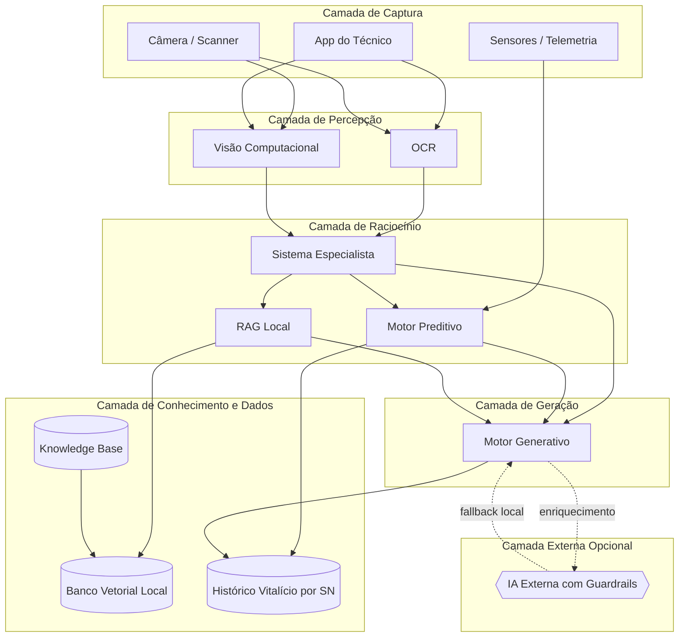
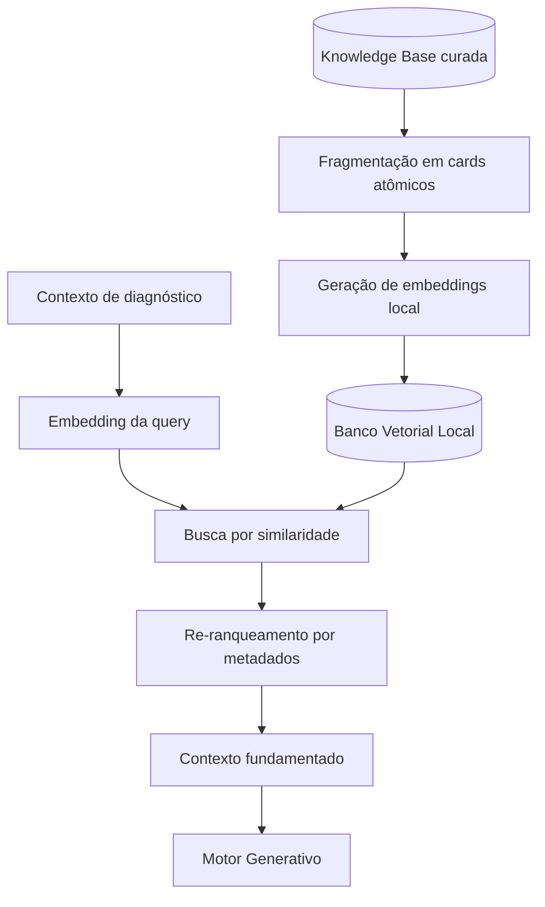
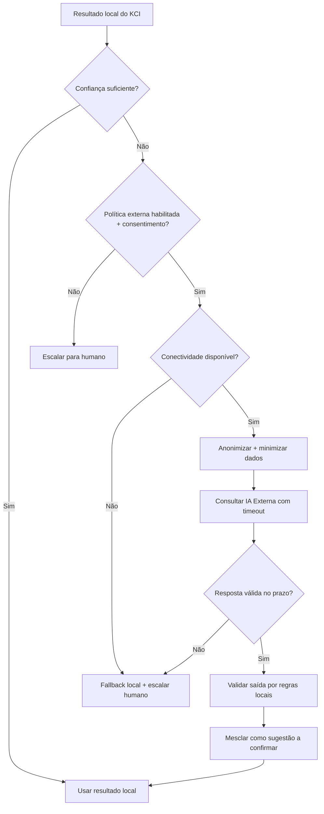
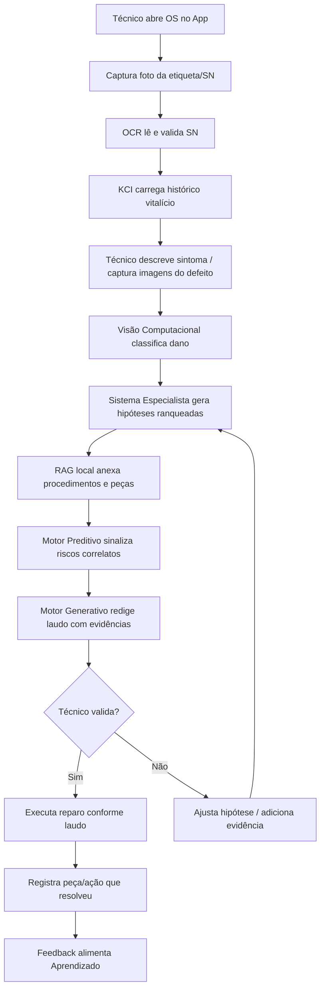
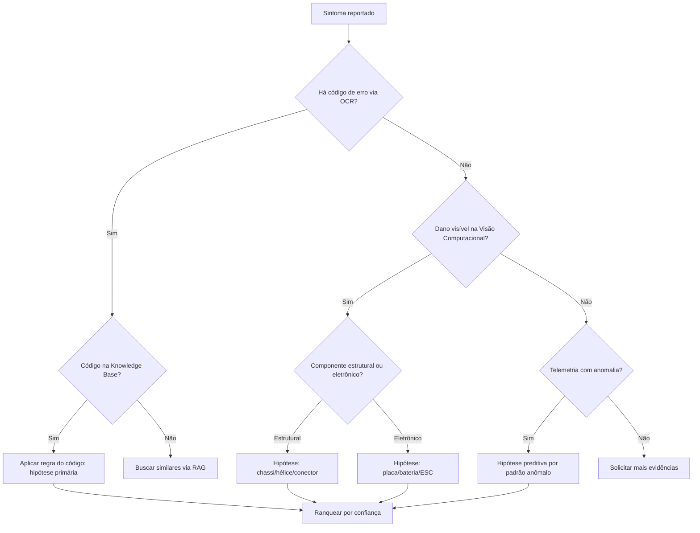
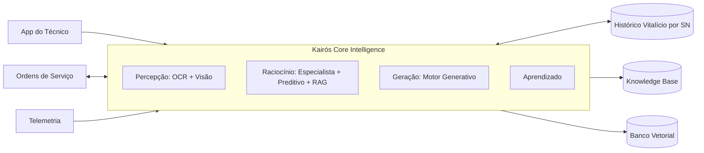
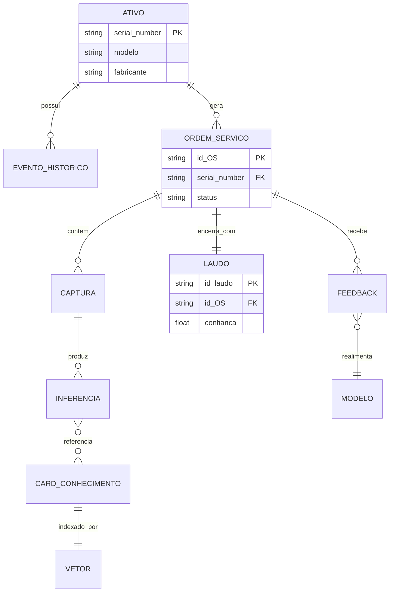
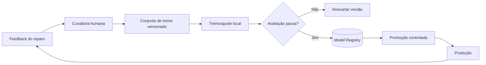
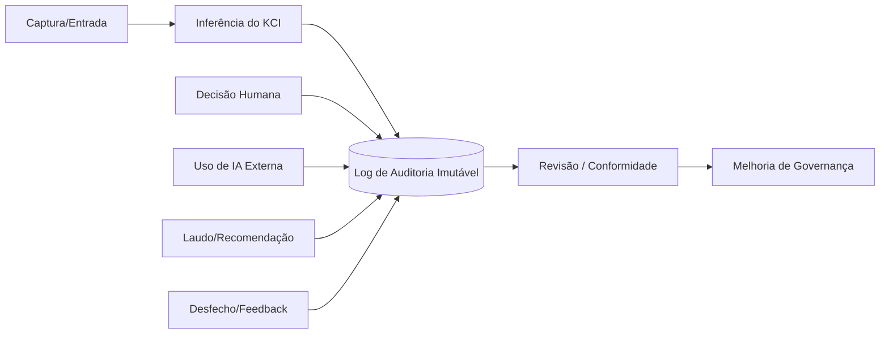

# 13 — Kairós Core Intelligence (KCI) · Drone Kairós ERP

| Campo | Valor |
|---|---|
| **Documento** | 13 — Kairós Core Intelligence (KCI) |
| **Versão** | 1.0 |
| **Data** | 21 de julho de 2026 |
| **Status** | Ativo |
| **Dependências** | 00 a 12 |
| **Responsável** | Especialista IA/ML |

---

## 1. Resumo Executivo

O **Kairós Core Intelligence (KCI)** é o motor inteligente proprietário do **Drone Kairós ERP**, concebido para transformar o diagnóstico técnico de drones em um processo assistido, rastreável e reproduzível. O KCI é o cérebro analítico que suporta o técnico de campo e o técnico de bancada na jornada de reparo: da abertura da Ordem de Serviço (OS) ao encerramento com laudo técnico fundamentado.

O princípio fundador do KCI é ser **offline-first**. Todo o fluxo crítico de diagnóstico — reconhecimento de códigos (OCR), inspeção visual (Visão Computacional), raciocínio por regras (Sistema Especialista), previsão de falhas (Motor Preditivo), recuperação de conhecimento (RAG local sobre banco vetorial) e geração de laudos (Motor Generativo) — opera integralmente em ambiente local, sem dependência de conectividade. A integração com **IA externa é estritamente opcional**, acionada apenas como enriquecimento, sob guardrails, anonimização e com fallback determinístico garantido.

O KCI mantém um **histórico vitalício por Serial Number (SN)**: cada drone possui uma linha do tempo perpétua que agrega OS, telemetria, intervenções, peças substituídas, laudos e feedback de resultado. Essa memória longitudinal alimenta o Motor Preditivo e o ciclo de **Aprendizado (feedback loop)**, tornando o motor progressivamente mais preciso à medida que a base cresce.

O fluxo de referência do módulo é:

**Diagnóstico → OCR → Visão Computacional → Sistema Especialista → Motor Preditivo → Motor Generativo → Knowledge Base → RAG Local → Aprendizado.**

Os três pilares que governam toda decisão de projeto são: **offline-first** (autonomia operacional sem nuvem), **segurança por padrão** (dados protegidos em repouso e em trânsito) e **privacidade** (minimização, anonimização e controle do titular). O KCI adota **human-in-the-loop** como regra inegociável: nenhuma recomendação de alto impacto é executada sem validação humana explícita.

Este documento especifica visão, objetivos, escopo, governança de IA, arquitetura, pipelines, fluxogramas de diagnóstico, casos de uso, modelagem de dados, checklists, riscos, evolução e auditoria do KCI.

---

## 2. Objetivos

### 2.1 Objetivo Geral

Prover um motor de inteligência técnica **offline-first** capaz de assistir o diagnóstico, a manutenção preditiva e a geração de laudos de drones, elevando a taxa de acerto no primeiro reparo (*first-time-fix*) e reduzindo o tempo médio de diagnóstico, com total rastreabilidade e explicabilidade.

### 2.2 Objetivos Específicos

| ID | Objetivo | Métrica de Sucesso (KPI) |
|---|---|---|
| OBJ-01 | Assistir o diagnóstico técnico de drones com sugestões fundamentadas | Taxa de first-time-fix ≥ 85% |
| OBJ-02 | Operar 100% do fluxo crítico offline | 0 dependências externas obrigatórias no caminho crítico |
| OBJ-03 | Reduzir tempo médio de diagnóstico | Redução ≥ 40% vs. baseline manual |
| OBJ-04 | Gerar laudos técnicos padronizados e auditáveis | 100% dos laudos com trilha de evidências |
| OBJ-05 | Antecipar falhas via manutenção preditiva | Antecipação ≥ 30 dias em componentes críticos |
| OBJ-06 | Manter explicabilidade em toda recomendação | 100% das recomendações com justificativa rastreável |
| OBJ-07 | Aprender continuamente com o feedback do técnico | Melhoria mensurável de acurácia a cada ciclo de retreino |
| OBJ-08 | Garantir privacidade e segurança por padrão | 0 vazamentos; 100% dos dados sensíveis anonimizados antes de saída externa |

### 2.3 Não-Objetivos (o que o KCI não é)

- Não é um sistema de decisão autônoma: **não executa reparos nem aprova ações críticas sozinho**.
- Não substitui o julgamento do técnico habilitado; **assiste**, não decide em seu lugar.
- Não depende de IA externa para funcionar; a IA externa é **enriquecimento opcional**.
- Não é um repositório de dados pessoais de clientes além do estritamente necessário à OS.

---

## 3. Escopo

### 3.1 Dentro do Escopo

- Motor de diagnóstico assistido com Sistema Especialista (regras e árvores de decisão).
- **OCR** para leitura de Serial Numbers, etiquetas, códigos de peça, QR/barras e telas de erro.
- **Visão Computacional** para inspeção de danos físicos, desgaste, corrosão, hélices, chassi e placas.
- **Motor Preditivo** de manutenção baseado em histórico vitalício por SN e telemetria.
- **Motor Generativo** local para laudos, recomendações e sumários de OS.
- **Knowledge Base** técnica versionada e curada.
- **RAG local** com banco vetorial embarcado para recuperação aumentada offline.
- **Ciclo de Aprendizado** com feedback do técnico e resultado do reparo.
- Integração com **App do Técnico**, **Ordens de Serviço** e **Telemetria**.
- Camada opcional de **IA externa** com guardrails, anonimização e fallback.

### 3.2 Fora do Escopo

- Controle de voo, pilotagem ou firmware embarcado do drone.
- Operação de e-commerce, faturamento e logística (tratados em módulos próprios).
- Treinamento de modelos de fundação do zero (o KCI usa modelos locais leves e ajustes incrementais).

### 3.3 Interfaces de Fronteira

| Interface | Direção | Conteúdo |
|---|---|---|
| App do Técnico | Bidirecional | Captura de imagens/áudio/códigos, exibição de diagnóstico, coleta de feedback |
| Ordens de Serviço (OS) | Bidirecional | Contexto da OS, laudo gerado, ações recomendadas |
| Telemetria | Entrada | Séries temporais de voo, logs de erro, contadores de uso |
| Histórico por SN | Bidirecional | Linha do tempo vitalícia do ativo |
| IA Externa (opcional) | Saída/Entrada | Consulta anonimizada e resposta de enriquecimento |

---

## 4. Regras (Governança de IA)

A governança de IA do KCI é normativa e vinculante. As regras abaixo têm precedência sobre qualquer otimização de desempenho ou conveniência.

### 4.1 Princípios Normativos

| ID | Regra | Categoria |
|---|---|---|
| GOV-01 | Offline-first é obrigatório: o caminho crítico nunca pode exigir conectividade | Disponibilidade |
| GOV-02 | Toda recomendação deve ser **explicável** (evidências + regra/fonte rastreável) | Explicabilidade |
| GOV-03 | Ações de alto impacto exigem **human-in-the-loop** (aprovação humana) | Controle |
| GOV-04 | Nenhum dado sensível sai do ambiente local sem **anonimização** e consentimento | Privacidade |
| GOV-05 | IA externa é opcional e sempre tem **fallback local determinístico** | Resiliência |
| GOV-06 | Confiança (*confidence*) abaixo do limiar → escalar para humano, nunca autodecidir | Qualidade |
| GOV-07 | Viés deve ser monitorado por segmentos (modelo de drone, fabricante, tipo de dano) | Equidade |
| GOV-08 | Toda inferência é **registrada em trilha de auditoria** imutável | Auditabilidade |
| GOV-09 | Versões de modelo, Knowledge Base e regras são **versionadas e reproduzíveis** | Governança |
| GOV-10 | O técnico pode sempre **sobrepor (override)** a sugestão do KCI, com registro | Autonomia humana |

### 4.2 Limiares e Níveis de Confiança

| Faixa de Confiança | Comportamento do KCI |
|---|---|
| ≥ 0,90 (Alta) | Sugere com destaque; requer confirmação do técnico |
| 0,70 – 0,89 (Média) | Sugere com alternativas ranqueadas; solicita validação explícita |
| 0,50 – 0,69 (Baixa) | Apresenta hipóteses e pede mais evidências (nova foto, nova leitura) |
| < 0,50 (Insuficiente) | Não sugere diagnóstico; encaminha para análise humana / IA externa opcional |

### 4.3 Matriz de Guardrails da IA Externa

| Guardrail | Descrição |
|---|---|
| Anonimização | Remoção de SN real, dados de cliente e identificadores antes do envio; uso de pseudônimos |
| Minimização | Enviar apenas o mínimo necessário para o enriquecimento pretendido |
| Consentimento | Uso externo só ocorre com política/consentimento habilitado na OS |
| Fallback | Timeout ou indisponibilidade → volta ao resultado local sem degradar o fluxo |
| Validação de saída | Resposta externa é tratada como **sugestão não confiável** até validação por regras locais |
| Não-persistência sensível | Respostas externas não sobrescrevem a Knowledge Base sem curadoria humana |

---

## 5. Arquitetura (do Motor)

### 5.1 Visão de Camadas

O KCI é organizado em cinco camadas lógicas, todas executáveis em ambiente local (edge/estação de reparo), com uma camada externa estritamente opcional.

### 5.2 Componentes do Fluxo de Referência

#### 5.2.1 Knowledge Base (Base de Conhecimento Técnico)

Repositório curado e versionado do conhecimento de reparo: manuais, procedimentos, catálogos de peças, códigos de erro por fabricante/modelo, boletins técnicos, soluções validadas e laudos anteriores anonimizados. Estruturada em documentos atômicos ("cards de conhecimento") com metadados (modelo, componente, sintoma, versão, fonte, data de validade). É a fonte de verdade para o RAG e para a manutenção de regras do Sistema Especialista.

#### 5.2.2 RAG Local (Recuperação Aumentada Offline)

Camada de recuperação semântica que indexa a Knowledge Base em um **banco vetorial local (embeddings)** embarcado. Dado um contexto de diagnóstico (sintomas + evidências), o RAG recupera os *cards* mais relevantes por similaridade vetorial, com re-ranqueamento por metadados (modelo/componente). O resultado alimenta o Motor Generativo com **grounding** verificável, reduzindo alucinação e garantindo citação de fonte. Opera 100% offline; o índice é atualizado em background quando a Knowledge Base muda.

#### 5.2.3 Sistema Especialista (Regras / Árvores de Decisão)

Motor simbólico determinístico que aplica **regras de produção** e **árvores de decisão** para converter sintomas e evidências em hipóteses de diagnóstico ranqueadas. Encapsula o conhecimento heurístico do técnico sênior de forma auditável ("se código E13 + hélice trincada → suspeita de desbalanceamento do rotor"). É a espinha dorsal explicável do KCI: cada conclusão aponta a cadeia de regras acionada. Prioritário sobre componentes probabilísticos quando há regra determinística aplicável.

#### 5.2.4 OCR e Visão Computacional

- **OCR**: extrai texto estruturado de etiquetas, Serial Numbers, códigos de peça, QR/códigos de barras e telas de erro capturadas pelo App. Normaliza e valida SN contra o cadastro (checagem de formato e dígito).
- **Visão Computacional**: classifica e localiza danos em imagens — trincas, corrosão, superaquecimento, desgaste de hélice, conectores danificados, componentes ausentes. Retorna *bounding boxes*, rótulo de defeito e score de confiança. Modelos locais leves otimizados para inferência em estação/edge.

#### 5.2.5 Motor Preditivo (Manutenção Preditiva)

Analisa o **histórico vitalício por SN** e a **telemetria** (horas de voo, ciclos de bateria, vibração, temperatura, contadores de erro) para estimar a probabilidade e a janela temporal de falhas futuras. Emprega modelos de séries temporais e detecção de anomalias, produzindo *health scores* por componente e alertas de manutenção antecipada. Realimenta a OS com recomendações preventivas.

#### 5.2.6 Motor Generativo (Laudos / Recomendações)

Sintetiza, a partir do diagnóstico (Sistema Especialista), da previsão (Motor Preditivo) e do conhecimento recuperado (RAG local), um **laudo técnico estruturado** e recomendações de ação em linguagem natural clara. Opera **grounded** nas evidências recuperadas — cada afirmação do laudo referencia sua fonte (regra, card de KB, imagem, telemetria). Gera rascunho; o técnico revisa e aprova (human-in-the-loop).

#### 5.2.7 Aprendizado (Feedback Loop)

Captura o desfecho real de cada OS (diagnóstico confirmado/refutado, peça que efetivamente resolveu, tempo de reparo, override do técnico) e o incorpora à Knowledge Base e aos conjuntos de treino. Fecha o ciclo: melhora regras, re-treina modelos de visão/predição e ajusta ranqueamento do RAG. Retreinos são versionados, avaliados e promovidos apenas após validação (ver Seção 15).

### 5.3 Tabela de Componentes

| Componente | Tipo | Execução | Explicável | Entrada | Saída |
|---|---|---|---|---|---|
| Knowledge Base | Simbólico/Dados | Local | Sim | Curadoria | Cards de conhecimento |
| RAG Local | Vetorial/Semântico | Local | Sim (cita fonte) | Contexto + query | Trechos relevantes |
| Sistema Especialista | Simbólico | Local | Sim (cadeia de regras) | Sintomas/evidências | Hipóteses ranqueadas |
| OCR | Percepção | Local | Parcial | Imagem | Texto/código |
| Visão Computacional | Percepção | Local | Parcial (heatmap) | Imagem | Defeito + score |
| Motor Preditivo | Probabilístico | Local | Parcial (features) | Histórico/telemetria | Health score/janela |
| Motor Generativo | Generativo | Local | Sim (grounded) | Diagnóstico + RAG | Laudo/recomendação |
| Aprendizado | Pipeline | Local (batch) | Sim (versionado) | Feedback/desfecho | Modelos/regras v+1 |
| IA Externa | Generativo | Externo (opcional) | Não confiável | Consulta anonimizada | Sugestão a validar |

---

## 6. Diagramas (Pipeline)

### 6.1 Pipeline End-to-End de Diagnóstico

```mermaid
flowchart LR
    START([Abertura da OS]) --> DIAG[Diagnóstico Inicial]
    DIAG --> OCR[OCR: SN, códigos, erros]
    OCR --> SNCHK{SN válido?}
    SNCHK -- Não --> RECAP[Solicitar nova captura]
    RECAP --> OCR
    SNCHK -- Sim --> HIST[Carregar Histórico Vitalício por SN]
    HIST --> CV[Visão Computacional: inspeção de danos]
    CV --> SE[Sistema Especialista: regras/árvores]
    SE --> PRED[Motor Preditivo: risco futuro]
    PRED --> RAG[RAG Local: recuperar conhecimento]
    RAG --> CONF{Confiança >= limiar?}
    CONF -- Não --> EXT[IA Externa opcional / Escalar humano]
    EXT --> GEN
    CONF -- Sim --> GEN[Motor Generativo: laudo + recomendações]
    GEN --> HITL{Técnico aprova?}
    HITL -- Ajusta/Rejeita --> FEED[Registrar override]
    HITL -- Aprova --> OSUP[Atualizar OS + Laudo]
    OSUP --> FEED[Feedback Loop: desfecho]
    FEED --> LEARN[(Aprendizado: KB + retreino)]
    LEARN --> END([Encerramento])
```

### 6.2 Pipeline de Dados e Indexação (RAG / Knowledge Base)

### 6.3 Decisão de Uso da IA Externa (Opcional)

---

## 7. Fluxogramas (Diagnóstico)

### 7.1 Fluxo de Diagnóstico Assistido (Técnico)

### 7.2 Árvore de Decisão do Sistema Especialista (Exemplo)

---

## 8. Boas Práticas

- **Grounding obrigatório**: o Motor Generativo só afirma o que pode citar (regra, card de KB, imagem ou telemetria). Sem fonte, não afirma.
- **Determinístico primeiro**: preferir o Sistema Especialista quando existir regra aplicável; usar componentes probabilísticos como complemento, não substituto.
- **Modelos locais leves**: priorizar modelos quantizados e otimizados para inferência em edge/estação, com orçamento de latência definido.
- **Confiança sempre visível**: exibir o score e a faixa de confiança ao técnico em toda sugestão.
- **Coleta de feedback de baixo atrito**: capturar desfecho com um toque (confirmou / não confirmou / qual peça resolveu).
- **Anonimização por padrão** antes de qualquer saída externa; nunca enviar SN real ou dados de cliente.
- **Fallback testado**: exercitar periodicamente o caminho offline e o fallback da IA externa.
- **Versionamento de tudo**: modelo, Knowledge Base, regras e índice vetorial versionados e reproduzíveis.
- **Idempotência de pipeline**: reprocessar a mesma evidência deve produzir o mesmo resultado (dado a mesma versão).
- **Observabilidade**: métricas de acurácia, latência, taxa de override e drift monitoradas continuamente.

---

## 9. Padrões

### 9.1 Padrões de Arquitetura e IA

| Padrão | Aplicação no KCI |
|---|---|
| RAG (Retrieval-Augmented Generation) | Grounding do Motor Generativo sobre a Knowledge Base local |
| Sistema Especialista baseado em regras | Diagnóstico determinístico e explicável |
| Embeddings + Busca Vetorial | Recuperação semântica offline |
| Human-in-the-loop | Aprovação obrigatória em ações de alto impacto |
| Circuit Breaker / Fallback | Degradação graciosa quando IA externa falha |
| Event Sourcing | Histórico vitalício por SN como sequência de eventos |
| Feature Store | Consolidação de features de telemetria para o Motor Preditivo |
| Model Registry | Versionamento e promoção controlada de modelos |
| Data Minimization | Envio externo restrito ao mínimo anonimizado |

### 9.2 Padrões de Interface (Contratos)

| Contrato | Formato | Observação |
|---|---|---|
| Evento de captura | Estruturado (imagem + metadados) | Origem: App do Técnico |
| Resultado de percepção | Rótulo + score + região | OCR / Visão Computacional |
| Hipótese de diagnóstico | Lista ranqueada + cadeia de regras | Sistema Especialista |
| Laudo técnico | Documento estruturado + citações | Motor Generativo |
| Registro de feedback | Desfecho + peça resolutiva + override | Aprendizado |

### 9.3 Convenções

- Serial Number como chave primária do histórico vitalício.
- Cada inferência recebe um identificador de correlação para trilha de auditoria.
- Toda saída ao usuário inclui: conclusão, evidências, confiança e fonte.

---

## 10. Casos de Uso

### 10.1 UC-01 — Diagnóstico de Drone com Código de Erro

**Ator**: Técnico de bancada. **Pré-condição**: OS aberta.
1. Técnico fotografa a tela de erro; OCR extrai o código.
2. Sistema Especialista mapeia o código para hipótese primária.
3. RAG local anexa procedimento de reparo e peças compatíveis.
4. Motor Generativo redige laudo com passos e evidências.
5. Técnico valida, executa e registra desfecho.

### 10.2 UC-02 — Inspeção Visual de Dano Físico

**Ator**: Técnico de campo.
1. Técnico captura imagens do drone; Visão Computacional localiza trinca em hélice.
2. Sistema Especialista correlaciona com desbalanceamento de rotor.
3. Motor Preditivo verifica histórico de vibração do SN.
4. Laudo recomenda substituição e recalibração.

### 10.3 UC-03 — Manutenção Preditiva Antecipada

**Ator**: Gestor de manutenção.
1. Motor Preditivo detecta degradação de bateria por ciclos e temperatura.
2. Emite alerta com janela estimada de falha.
3. OS preventiva é sugerida antes da falha em campo.

### 10.4 UC-04 — Enriquecimento por IA Externa (Opcional)

**Ator**: Técnico. **Condição**: confiança local baixa + consentimento habilitado.
1. KCI anonimiza o contexto e consulta a IA externa com timeout.
2. Resposta é validada por regras locais e apresentada como sugestão a confirmar.
3. Em falha/timeout, fallback local + escalonamento humano.

### 10.5 UC-05 — Operação 100% Offline

**Ator**: Técnico em local sem conectividade.
1. Todo o fluxo (OCR → Visão → Especialista → Preditivo → RAG → Generativo) executa localmente.
2. Feedback é armazenado e sincronizado ao reconectar.

### 10.6 Tabela-Resumo

| UC | Componentes-chave | Human-in-the-loop | IA Externa |
|---|---|---|---|
| UC-01 | OCR, Especialista, RAG, Generativo | Sim | Não |
| UC-02 | Visão, Especialista, Preditivo | Sim | Não |
| UC-03 | Preditivo, Histórico SN | Sim (gestor) | Não |
| UC-04 | Todos + externa | Sim | Sim (opcional) |
| UC-05 | Todos locais | Sim | Não |

---

## 11. Modelagem (Componentes + Dados)

### 11.1 Modelo de Componentes

### 11.2 Entidades de Dados

| Entidade | Descrição | Chave |
|---|---|---|
| Ativo (Drone) | Registro do equipamento | Serial Number |
| Evento de Histórico | Item da linha do tempo vitalícia | id_evento + SN |
| Ordem de Serviço | Contexto de reparo | id_OS |
| Captura | Imagem/áudio/código coletado | id_captura |
| Inferência | Resultado de um componente do KCI | id_inferência (correlação) |
| Card de Conhecimento | Unidade da Knowledge Base | id_card + versão |
| Vetor | Embedding de um card | id_vetor |
| Laudo | Documento gerado | id_laudo + id_OS |
| Feedback | Desfecho do reparo | id_feedback + id_OS |
| Modelo | Versão de modelo/regra em produção | id_modelo + versão |

### 11.3 Modelo Entidade-Relacionamento (Simplificado)

### 11.4 Ciclo de Vida do Dado no Aprendizado

---

## 12. Checklist

### 12.1 Checklist de Prontidão (Go-Live)

- [ ] Fluxo crítico validado 100% offline (sem chamadas externas obrigatórias).
- [ ] OCR valida SN com checagem de formato e dígito.
- [ ] Visão Computacional calibrada para os defeitos-alvo com limiar de confiança definido.
- [ ] Sistema Especialista com regras versionadas e cadeia de explicação ativa.
- [ ] Motor Preditivo com features de telemetria consolidadas por SN.
- [ ] RAG local com índice vetorial atualizado e citação de fonte funcionando.
- [ ] Motor Generativo com grounding obrigatório e revisão humana no fluxo.
- [ ] Guardrails da IA externa (anonimização, minimização, fallback, timeout) testados.
- [ ] Trilha de auditoria imutável registrando toda inferência.
- [ ] Feedback loop coletando desfecho e alimentando retreino.

### 12.2 Checklist por Inferência

- [ ] Conclusão apresentada com confiança e faixa.
- [ ] Evidências e fontes anexadas.
- [ ] Confiança abaixo do limiar → escalonamento humano.
- [ ] Identificador de correlação registrado.
- [ ] Override do técnico habilitado e registrado.

### 12.3 Checklist de Privacidade e Segurança

- [ ] Dados sensíveis criptografados em repouso e em trânsito.
- [ ] Anonimização antes de qualquer saída externa.
- [ ] Consentimento verificado para uso externo.
- [ ] Retenção mínima e política de expurgo aplicada.
- [ ] Controle de acesso por papel (técnico, gestor, auditor).

---

## 13. Riscos

| ID | Risco | Prob. | Impacto | Mitigação |
|---|---|---|---|---|
| R-01 | Alucinação do Motor Generativo | Média | Alto | Grounding obrigatório via RAG + human-in-the-loop |
| R-02 | Dependência indevida de IA externa | Baixa | Alto | Fallback local determinístico; externa opcional |
| R-03 | Viés por sub-representação de modelos/danos | Média | Médio | Monitoramento por segmento + curadoria da KB |
| R-04 | Drift de dados/telemetria | Média | Médio | Detecção de drift + retreino versionado |
| R-05 | Vazamento de dados sensíveis | Baixa | Muito alto | Anonimização, criptografia, minimização |
| R-06 | OCR/Visão com baixa qualidade de captura | Média | Médio | Reprocesso guiado + solicitação de nova captura |
| R-07 | Excesso de confiança do técnico na sugestão | Média | Alto | Exibir confiança/limitações; override sempre disponível |
| R-08 | Base de conhecimento desatualizada | Média | Médio | Versão e data de validade nos cards + revisão periódica |
| R-09 | Latência inaceitável em edge | Baixa | Médio | Modelos leves/quantizados + orçamento de latência |
| R-10 | Feedback loop enviesado (aprender erro) | Baixa | Alto | Curadoria humana antes de promover retreino |

---

## 14. Melhorias Futuras

| ID | Melhoria | Benefício Esperado |
|---|---|---|
| MF-01 | Diagnóstico multimodal unificado (imagem + texto + telemetria) | Maior acurácia contextual |
| MF-02 | Aprendizado federado entre estações preservando privacidade | Ganho coletivo sem centralizar dados sensíveis |
| MF-03 | Explicações visuais (heatmaps) na inspeção de danos | Mais confiança e didática ao técnico |
| MF-04 | Detecção proativa de anomalias em tempo quase real | Antecipação de falhas em campo |
| MF-05 | Assistente conversacional offline de reparo | Suporte guiado passo a passo |
| MF-06 | Auto-curadoria assistida da Knowledge Base | Redução do esforço de manutenção da KB |
| MF-07 | Simulação de cenários de manutenção (what-if) | Melhor planejamento preventivo |
| MF-08 | Calibração adaptativa de limiares por tipo de drone | Menos falsos positivos/negativos |

---

## 15. Auditoria

### 15.1 Princípios de Auditoria

Toda decisão do KCI é **rastreável, reproduzível e revisável**. A trilha de auditoria é imutável e correlaciona captura, inferências, versões de modelo/KB/regras, confiança, fontes citadas, decisão humana (aprovação/override) e desfecho.

### 15.2 Itens Auditáveis

| Item | O que é registrado |
|---|---|
| Inferência | Componente, entrada, saída, confiança, versão de modelo, correlação |
| Fonte | Cards de KB e evidências citadas no laudo |
| Decisão humana | Aprovação, ajuste ou override, com identificação e timestamp |
| IA externa | Se usada, dados anonimizados enviados, resposta, validação local |
| Retreino | Conjunto de dados, avaliação, promoção/descartes de versão |
| Privacidade | Consentimento, anonimização aplicada, acessos ao dado |

### 15.3 Fluxo de Trilha de Auditoria

### 15.4 Métricas de Governança Auditadas

| Métrica | Objetivo |
|---|---|
| Taxa de override do técnico | Detectar desalinhamento entre KCI e prática |
| Acurácia por segmento | Monitorar viés por modelo/fabricante/dano |
| Taxa de grounding com fonte válida | Garantir explicabilidade |
| Taxa de fallback da IA externa | Medir resiliência offline |
| Drift de features de telemetria | Antecipar necessidade de retreino |
| Incidentes de privacidade | Meta: zero |

### 15.5 Cadência de Revisão

- **Contínua**: métricas em tempo real (confiança, latência, override).
- **Mensal**: revisão de viés por segmento e qualidade da Knowledge Base.
- **Por retreino**: avaliação obrigatória antes de promoção de modelo.
- **Trimestral**: auditoria de privacidade e conformidade dos guardrails.

---

> **Nota de conformidade ao Project Canon**: o KCI é offline-first, com IA externa estritamente opcional, sob guardrails, anonimização e fallback. O fluxo de referência (Diagnóstico → OCR → Visão Computacional → Sistema Especialista → Motor Preditivo → Motor Generativo → Knowledge Base → RAG Local → Aprendizado), o histórico vitalício por Serial Number e a integração com App do Técnico e Ordens de Serviço são respeitados integralmente. Princípios preservados: offline-first, segurança por padrão e privacidade.
