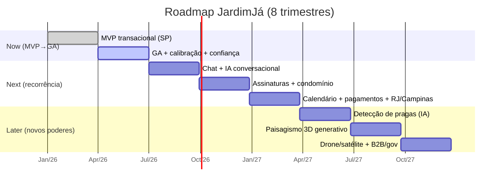

# 13 — Roadmap de evolução do produto

> De onde estamos (o core implementado e testado) a onde vamos (IA de pragas,
> paisagismo 3D, drone/satélite, B2B/prefeitura). Organizado em **Now / Next / Later**
> e detalhado em **8 trimestres (Q1–Q8)** com temas, milestones e métricas de sucesso.
> Casa com [monetização](10-monetization.md), [financeiro](11-financial-plan.md) e
> [aquisição](12-user-acquisition.md).

---

## 1. Horizontes

| Horizonte | Foco | Trimestres |
| --- | --- | --- |
| **Now** (MVP → GA) | Provar o core: orçamento por IA + marketplace + pagamento, em São Paulo | Q1–Q2 |
| **Next** | Recorrência e conveniência: chat, assinaturas, calendário, pagamentos ampliados; expansão de cidades | Q3–Q5 |
| **Later** | Novos superpoderes de IA e novos segmentos: pragas, 3D, drone/satélite, B2B/gov | Q6–Q8 |

O que já está **implementado e testado** neste repositório e ancora o "Now":
- 🧠 **IA multimodal com consenso** — [`packages/ai-vision`](../packages/ai-vision) ([doc 04](04-ai-pipeline.md)).
- 💰 **Motor de precificação determinístico + calibração** — [`packages/pricing-engine`](../packages/pricing-engine) ([doc 05](05-pricing-engine.md)).
- 📦 **Contratos de domínio compartilhados** — [`packages/shared`](../packages/shared) (enums, schemas, `JobStatus`).

---

## 2. Now — MVP → GA (Q1–Q2)

**Tema: fechar o loop transacional numa cidade com liquidez real.**

### Q1 — MVP transacional (São Paulo, soft launch)
- Fluxo ponta a ponta: upload de fotos → **análise por IA** → **quote** → marketplace →
  aceite → **acompanhamento** (`ENROUTE`/`ARRIVED`/`IN_PROGRESS`/`COMPLETED`) → **split** →
  avaliação (máquina de estados `JobStatus` em [`enums.ts`](../packages/shared/src/enums.ts)).
- Providers de IA reais (OpenAI + Gemini + Claude) com **quórum 2/3** e fallback mock.
- Pagamento com **PIX + cartão** e split automático.
- App Cliente + App Profissional (Flutter) + Admin/BI (React) no básico.
- **Milestone**: primeiro job pago com preço 100% gerado pela IA.
- **Métricas**: match rate > 70%, tempo até 1ª oferta < 30 min, ≥ 500 jobs/mês (saída do Q1).

### Q2 — GA e confiança
- **Calibração ligada**: job noturno de `calibrationFactor` por cohort (cidade×serviço) —
  "quanto mais serviços, mais preciso" ([doc 05, §6](05-pricing-engine.md#6-o-gancho-de-aprendizado-cont%C3%ADnuo-calibra%C3%A7%C3%A3o)).
- Disputas/reembolsos (`DISPUTED`/`REFUNDED`), avaliações bidirecionais, verificação de jardineiros.
- Endurecer [segurança/LGPD](06-security-lgpd.md) (dado sensível: fotos, localização).
- **Milestone**: liquidez sustentável em SP (match rate > 80%, LTV/CAC > 4 — [gates do doc 12](12-user-acquisition.md#6-m%C3%A9tricas-de-liquidez-e-marketplace-a-acompanhar)).
- **Métricas**: recompra 90d > 40%, NPS > 50, ~8.000 jobs/mês (saída do Q2).

---

## 3. Next — recorrência e conveniência (Q3–Q5)

**Tema: transformar serviço avulso em relacionamento recorrente e escalar cidades.**

### Q3 — Chat e comunicação
- **Chat cliente↔jardineiro** in-app (detalhes, fotos extras, reagendamento).
- **IA conversacional** de intenção→serviço ("quero deixar meu jardim bonito" → pacote,
  [doc 04, §10](04-ai-pipeline.md#10-ia-conversacional--da-inten%C3%A7%C3%A3o-ao-servi%C3%A7o)).
- Notificações push de ciclo de vida.
- **Métrica**: % de jobs com chat ativo; redução do tempo de reagendamento.

### Q4 — Assinaturas e recorrência
- **JardimJá Recorrente** (casas): corte quinzenal/mensal, mesmo profissional, cobrança automática.
- **JardimJá Condomínio** (áreas comuns) — primeiro produto B2B2C ([doc 10, §4](10-monetization.md#4-planos-e-tiers)).
- **Destaque pago** para jardineiros (take-rate secundário).
- **Métrica**: % de GMV recorrente; LTV por cliente assinante vs avulso.

### Q5 — Calendário e pagamentos ampliados
- Integração **Google Calendar / Apple Calendar** (agenda do jardineiro e do cliente).
- Pagamentos ampliados: **Google Pay / Apple Pay** (`PaymentMethod` já no domínio),
  parcelamento, carteira/crédito de indicação.
- Expansão para **Campinas + Rio de Janeiro** (playbook [doc 12, §8](12-user-acquisition.md#8-ordem-de-expans%C3%A3o-sugerida-nacional)).
- **Métrica**: no-show rate (queda com calendário); mix PIX vs cartão (margem, [doc 11](11-financial-plan.md#3-cogs)).

---

## 4. Later — novos superpoderes de IA e segmentos (Q6–Q8)

**Tema: alargar o fosso de IA e abrir mercados de ticket alto.**

### Q6 — Detecção de pragas e doenças
- Classificador especializado sobre as mesmas fotos (folha manchada, fungo, cochonilha,
  deficiência nutricional) alimentando `CONTROLE_PRAGAS` e a `knowledge-base` de
  espécies/pragas. Estende o pipeline via a interface `VisionProvider` ([doc 04, §12](04-ai-pipeline.md#12-como-adicionar-um-provider)).
- **Métrica**: precisão do diagnóstico validada por jardineiros; novos jobs de controle de pragas.

### Q7 — Paisagismo 3D generativo
- "Antes/depois" do jardim renderizado a partir das fotos + intenção do cliente,
  virando proposta de `PAISAGISMO`/`JARDIM_COMPLETO` de ticket alto.
- Catálogo de espécies/insumos ligado à venda de insumos ([doc 10, §2.3](10-monetization.md#23-fontes-futuras-roadmap-de-monetiza%C3%A7%C3%A3o)).
- **Métrica**: conversão de projeto 3D → job; ticket médio de paisagismo.

### Q8 — Drone/satélite e B2B/prefeitura
- **Drone/satélite** para lotes grandes e **áreas rurais**: área e cobertura vegetal por
  imagem aérea/orbital, com precisão métrica alimentando `drawnAreaM2`/`grassAreaM2`.
- **B2B / prefeituras**: contratos com SLA (praças, escolas, campi), faturamento, painel de BI.
- **Seguro/garantia JardimJá** sobre o serviço.
- **Métrica**: GMV B2B/gov; LTV de contratos recorrentes; cobertura de mercados rurais.

---

## 5. Linha do tempo (Q1–Q8)

---

## 6. Métricas de sucesso por horizonte

| Horizonte | Métrica-âncora | Alvo |
| --- | --- | --- |
| **Now** | Liquidez em SP (match rate, LTV/CAC) | > 80% · > 4 |
| **Now** | Jobs/mês (saída Q2) | ~8.000 |
| **Next** | % de GMV recorrente (assinaturas) | crescente, meta 2 dígitos |
| **Next** | Cidades com liquidez | 6 (fim do Ano 2, [doc 11](11-financial-plan.md#1-premissas-expl%C3%ADcitas)) |
| **Later** | GMV B2B/gov + novos verticais de IA | novo eixo de receita |
| **Later** | EBITDA | positivo no Ano 3 ([doc 11, §7](11-financial-plan.md#7-an%C3%A1lise-de-break-even)) |

---

## 7. Princípios que guiam o roadmap

1. **Liquidez antes de features** — não construir o próximo superpoder enquanto o
   marketplace local não estiver saudável ([gates do doc 12](12-user-acquisition.md#6-m%C3%A9tricas-de-liquidez-e-marketplace-a-acompanhar)).
2. **IA e preço evoluem por dados, não por reescrita** — novos providers entram pela
   interface `VisionProvider`; o preço melhora por calibração, não trocando a fórmula.
3. **Recorrência é o produto** — cada avulso é uma oportunidade de assinatura.
4. **Auditabilidade não é opcional** — todo quote continua explicável via `trace`
   ([doc 05, §8](05-pricing-engine.md#8-auditabilidade--o-trace)), mesmo com a IA ficando mais complexa.

---

### Referências cruzadas
- [`04-ai-pipeline.md`](04-ai-pipeline.md) — roadmap detalhado da IA.
- [`05-pricing-engine.md`](05-pricing-engine.md) — calibração contínua.
- [`10-monetization.md`](10-monetization.md) — quando cada receita entra.
- [`11-financial-plan.md`](11-financial-plan.md) — metas financeiras por ano.
- [`12-user-acquisition.md`](12-user-acquisition.md) — expansão de cidades.
</content>
