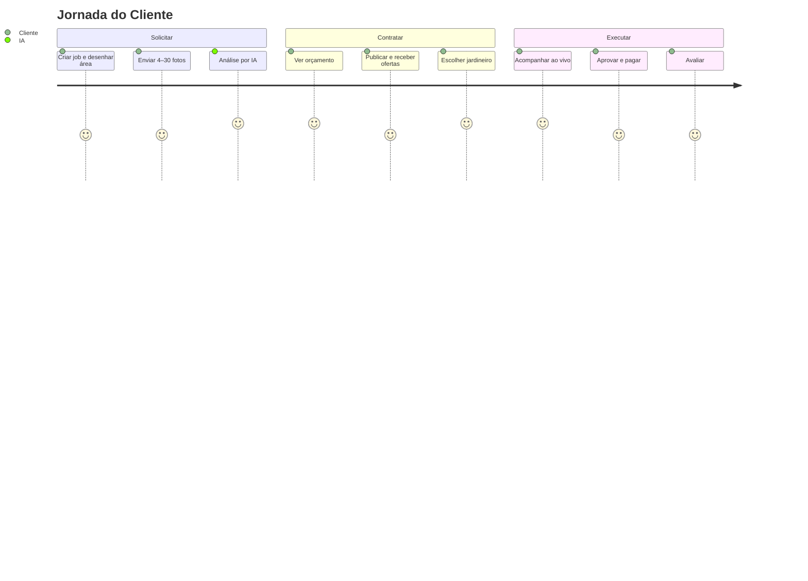
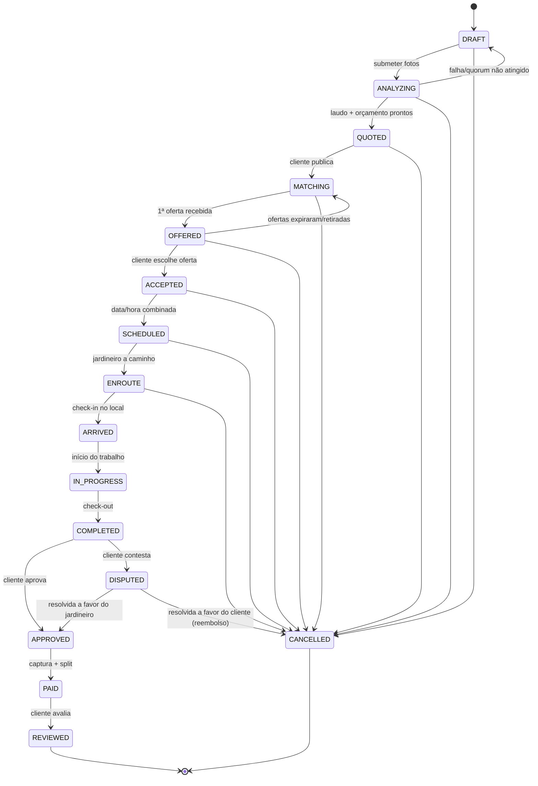

# 14 — Especificação Funcional / Fluxos

> Especificação funcional do JardimJá: personas, jornadas completas de cliente e jardineiro, a
> máquina de estados do serviço com **todas as transições permitidas**, regras de negócio, matriz de
> notificações e casos de borda.

Relacionados: [Arquitetura](01-architecture.md) · [Banco de dados](02-database.md) ·
[APIs](03-api.md) · [Pipeline de IA](04-ai-pipeline.md) · [Precificação](05-pricing-engine.md)

---

## 1. Personas

| Persona | Papel (`UserRole`) | Objetivos | Dores |
| --- | --- | --- | --- |
| **Cliente** | `CLIENT` | Contratar jardinagem sem saber o preço "justo", com rapidez e confiança | Não sabe quanto custa; medo de ser enganado; agenda |
| **Jardineiro / Empresa** | `GARDENER` | Encontrar serviços próximos, precificar bem, receber com segurança | Ociosidade, deslocamento, calote, negociação |
| **Admin / Operação** | `ADMIN` / `SUPPORT` | Operar o marketplace, moderar, resolver disputas, calibrar preços, BI | Fraude, disputas, qualidade, unit economics |

Detalhes de perfil no [modelo de dados](02-database.md#4-modelos--identidade-e-núcleo-transacional)
(`User`, `GardenerProfile`).

---

## 2. Jornadas

### 2.1 Jornada do cliente (passo a passo)

1. **Cadastro/login** (`POST /auth/register|login`) — cria conta `CLIENT`.
2. **Novo serviço** — cria um `Job` em **DRAFT** (`POST /jobs`), informa serviços desejados,
   urgência e endereço; opcionalmente **desenha a área** no mapa (`drawnAreaM2`/`drawnPolygon`).
3. **Fotos** — envia **4 a 30 fotos** (e opcionalmente vídeo/áudio) via URLs pré-assinadas
   (`POST /jobs/:id/media`), enviando os bytes direto ao S3.
4. **Análise por IA** — dispara `POST /jobs/:id/analyze` → **ANALYZING**. Em segundos recebe, quando
   **QUOTED**: relatório técnico (área, altura da grama, árvores, dificuldade) + **orçamento
   estimado** com faixa de preço e confiança.
5. **Publicar no marketplace** — `POST /jobs/:id/publish` → **MATCHING**. Jardineiros do raio são
   notificados.
6. **Receber ofertas** — vê ofertas (**OFFERED**): aceite do preço da IA ou contra-ofertas, com
   reputação e distância de cada jardineiro.
7. **Escolher** — seleciona uma oferta (`POST /offers/:id/choose`) → **ACCEPTED**; combina data/hora
   → **SCHEDULED**.
8. **Acompanhar em tempo real** — vê o jardineiro **ENROUTE** no mapa (WebSocket), **ARRIVED**
   (check-in) e **IN_PROGRESS**.
9. **Aprovar** — ao ver o serviço **COMPLETED** (check-out com foto), aprova
   (`POST /jobs/:id/approve`) → **APPROVED** → captura e split → **PAID**. Ou abre disputa.
10. **Avaliar** — dá nota 1–5 e comentário → **REVIEWED**.

### 2.2 Jornada do jardineiro (passo a passo)

1. **Cadastro** como `GARDENER` — cria `GardenerProfile` com **CPF/CNPJ**, cidade, base
   (`baseLat/baseLng`), **raio de atendimento** (`serviceRadiusKm`), especialidades, equipamentos e
   pisos de preço.
2. **Verificação** — status **PENDING_VERIFICATION**; admin aprova → **ACTIVE** (ou **REJECTED**).
3. **Feed do marketplace** — `GET /marketplace/feed` mostra jobs **MATCHING** dentro do raio
   (`ST_DWithin`), com faixa de preço sugerida, distância e fotos.
4. **Ofertar** — `POST /jobs/:id/offers`: aceita o preço da IA (**ACCEPTED_BY_GARDENER**) ou envia
   **contra-oferta** (**COUNTERED**) com mensagem.
5. **Ser escolhido** — se selecionado, a oferta vira **CHOSEN** e o job vai para **ACCEPTED**.
6. **Deslocar-se** — inicia o trajeto → **ENROUTE**, emitindo pings de localização (WebSocket).
7. **Check-in** — ao chegar, `POST /jobs/:id/checkin` (foto + geo) → **ARRIVED**.
8. **Executar** — `POST /jobs/:id/start` → **IN_PROGRESS**; ao terminar,
   `POST /jobs/:id/checkout` (foto) → **COMPLETED**.
9. **Receber** — após aprovação do cliente, recebe o **valor líquido** (`gardenerNetCents`, total
   menos 10%).
10. **Reputação** — recebe avaliação que atualiza `ratingAvg`/`ratingCount`.

---

## 3. Máquina de estados do Job

O enum `JobStatus` ([enums.ts](../packages/shared/src/enums.ts)) rege o ciclo. A camada de aplicação
só permite as transições abaixo; qualquer outra retorna `409 CONFLICT` e é registrada em `AuditLog`.

### Tabela de transições

| De | Para | Gatilho | Ator |
| --- | --- | --- | --- |
| — | DRAFT | Criar job | Cliente |
| DRAFT | ANALYZING | `analyze` (após 4–30 fotos) | Cliente |
| ANALYZING | QUOTED | Laudo + orçamento prontos | Sistema |
| ANALYZING | DRAFT | Falha / `AI_QUORUM_NOT_MET` | Sistema |
| QUOTED | MATCHING | `publish` | Cliente |
| MATCHING | OFFERED | Primeira oferta | Jardineiro |
| OFFERED | MATCHING | Todas as ofertas expiraram/retiradas | Sistema |
| OFFERED | ACCEPTED | `choose` | Cliente |
| ACCEPTED | SCHEDULED | Combinar data/hora | Cliente/Jardineiro |
| SCHEDULED | ENROUTE | Iniciar deslocamento | Jardineiro |
| ENROUTE | ARRIVED | `checkin` | Jardineiro |
| ARRIVED | IN_PROGRESS | `start` | Jardineiro |
| IN_PROGRESS | COMPLETED | `checkout` | Jardineiro |
| COMPLETED | APPROVED | `approve` | Cliente |
| COMPLETED | DISPUTED | `dispute` | Cliente |
| APPROVED | PAID | Captura + split | Sistema |
| PAID | REVIEWED | `review` | Cliente |
| DRAFT…ENROUTE | CANCELLED | `cancel` (regras de multa por estágio) | Cliente |
| DISPUTED | APPROVED | Disputa resolvida (pró-jardineiro) | Admin |
| DISPUTED | CANCELLED | Disputa resolvida (pró-cliente, reembolso) | Admin |

> Cancelamento não é permitido após **ARRIVED/IN_PROGRESS**; nesse ponto o caminho é COMPLETED e,
> se houver desacordo, **DISPUTED**.

---

## 4. Regras de negócio

| # | Regra | Detalhe / origem |
| --- | --- | --- |
| RN-01 | **4 a 30 fotos** por job | Mínimo recomendado 4 (abaixo disso, warning "Poucas fotos" e confiança menor); teto 30. Ver [`ai-vision types`](../packages/ai-vision/src/types.ts). |
| RN-02 | **Quorum mínimo de provedores de IA** | Default **2** (`AI_VISION_MIN_QUORUM`). Abaixo ⇒ `AI_QUORUM_NOT_MET` (422) e volta a DRAFT. Nenhum provedor único define o preço. |
| RN-03 | **Comissão da plataforma = 10%** | `PLATFORM_FEE_PERCENT`. `platformFeeCents = round(total × 0,10)`; `gardenerNetCents = total − platformFee`. |
| RN-04 | **Escrow: captura só na aprovação** | Fundos autorizados na escolha; **capturados/splitados apenas quando o cliente aprova** (COMPLETED→APPROVED→PAID). |
| RN-05 | **Surge pricing** | Por **urgência** (FLEXIBLE 0,95 … EMERGENCY 1,45) e por **oferta/demanda** (jardineiros disponíveis ÷ jobs abertos), limitado a [0,9; 1,35]. Ver [precificação](05-pricing-engine.md). |
| RN-06 | **Piso de preço** | Todo job respeita `minimumJobPrice` (R$ 80,00 default) e o `minPriceCents` do jardineiro. |
| RN-07 | **Índice por cidade** | Custo de mão de obra ajustado pelo custo de vida da cidade (ex.: São Paulo 1,25). |
| RN-08 | **Calibração contínua** | Fator por cohort `(cidade, serviço)` aprendido de jobs concluídos, aplicado multiplicativamente (clamp [0,75; 1,30], mín. 8 amostras). |
| RN-09 | **Uma oferta por jardineiro/job** | `@@unique([jobId, gardenerId])`. Contra-ofertas atualizam a mesma oferta. |
| RN-10 | **Só jardineiros ACTIVE ofertam** | `GardenerProfile.status = ACTIVE` (verificado) e dentro do raio (`ST_DWithin`). |
| RN-11 | **Confiança e faixa** | A faixa de preço alarga quando falta contexto (cidade/distância/mercado) ou quando a IA diverge. |
| RN-12 | **Reprodutibilidade** | Cada quote guarda `breakdownVersion` e os insumos, permitindo recomputar exatamente o valor. |
| RN-13 | **Avaliação bidirecional** | Cliente avalia jardineiro (atualiza `ratingAvg`/`ratingCount`); modelo suporta avaliação recíproca. |

---

## 5. Matriz de notificações

Canais: **Push** (FCM, `Device.fcmToken`) · **In-app** (`Notification` persistente) · **WebSocket**
(tempo real). Ver [APIs §7](03-api.md#7-websocket--tempo-real) e
[banco](02-database.md#7-notificações-dispositivos-e-conformidade).

| Evento | Destinatário | Push | In-app | WS |
| --- | --- | --- | --- | --- |
| Orçamento pronto (QUOTED) | Cliente | ✅ | ✅ | ✅ |
| Falha na análise (quorum) | Cliente | ✅ | ✅ | — |
| Novo job no raio (MATCHING) | Jardineiros próximos | ✅ | ✅ | — |
| Nova oferta (OFFERED) | Cliente | ✅ | ✅ | — |
| Oferta escolhida (CHOSEN) | Jardineiro | ✅ | ✅ | — |
| Serviço agendado (SCHEDULED) | Ambos | ✅ | ✅ | — |
| Jardineiro a caminho (ENROUTE) | Cliente | ✅ | — | ✅ (posição/ETA) |
| Check-in (ARRIVED) | Cliente | ✅ | ✅ | ✅ |
| Início/conclusão (IN_PROGRESS/COMPLETED) | Cliente | ✅ | ✅ | ✅ |
| Pagamento capturado (PAID) | Ambos | ✅ | ✅ | — |
| Nova mensagem de chat | Contraparte | ✅ | ✅ | ✅ |
| Avaliação recebida (REVIEWED) | Jardineiro | ✅ | ✅ | — |
| Disputa aberta/resolvida | Cliente, Jardineiro, Admin | ✅ | ✅ | — |
| Cancelamento | Contraparte | ✅ | ✅ | — |

---

## 6. Casos de borda

| Caso | Tratamento |
| --- | --- |
| **Poucas fotos** (< 4) | Permite prosseguir, mas com warning e confiança reduzida (RN-01). |
| **Provedores de IA divergem muito** | Consenso reduz `confidence`, adiciona warning "revisão do jardineiro" e alarga a faixa. |
| **Quorum não atingido** | `AI_QUORUM_NOT_MET` (422); job volta a DRAFT para adicionar fotos/tentar de novo. |
| **Sem chaves de IA (dev/CI)** | Fallback para 2 providers `mock` determinísticos; fluxo completo funciona offline. |
| **Nenhum jardineiro no raio** | Feed vazio; sugere ampliar raio/agendar; job permanece MATCHING até expirar. |
| **Todas as ofertas expiram** | OFFERED → MATCHING (recoleta) ou cancelamento pelo cliente. |
| **Jardineiro cancela após aceitar** | Reabre para o marketplace; penalidade de reputação; cliente notificado. |
| **Cliente cancela por estágio** | Regras de multa conforme o estágio; bloqueado após ARRIVED. |
| **Falha/duplicação de pagamento** | Webhook idempotente por `externalId`; `PAYMENT_FAILED` (402) tratado sem cobrança dupla. |
| **Disputa pós-conclusão** | COMPLETED → DISPUTED; admin resolve → APPROVED (paga) ou CANCELLED (reembolsa). |
| **GPS impreciso no check-in** | Check-in exige foto + geo; divergência grande sinaliza revisão/possível fraude. |
| **Área ambígua nas fotos** | Warning específico; o `drawnAreaM2` do cliente serve de prior forte para a IA. |
| **Titular pede exclusão (LGPD)** | Soft-delete + anonimização; jobs em andamento tratados conforme [LGPD](06-security-lgpd.md#33-eliminação--direito-ao-esquecimento-soft-delete). |

---

Anterior: [« 09 — Testes](09-testing.md) · Início: [01 — Arquitetura](01-architecture.md)
