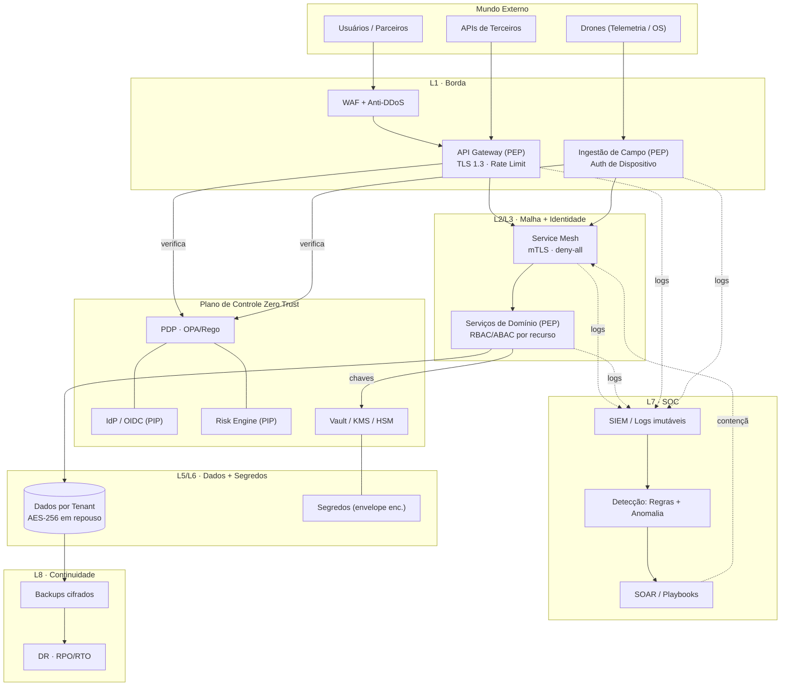
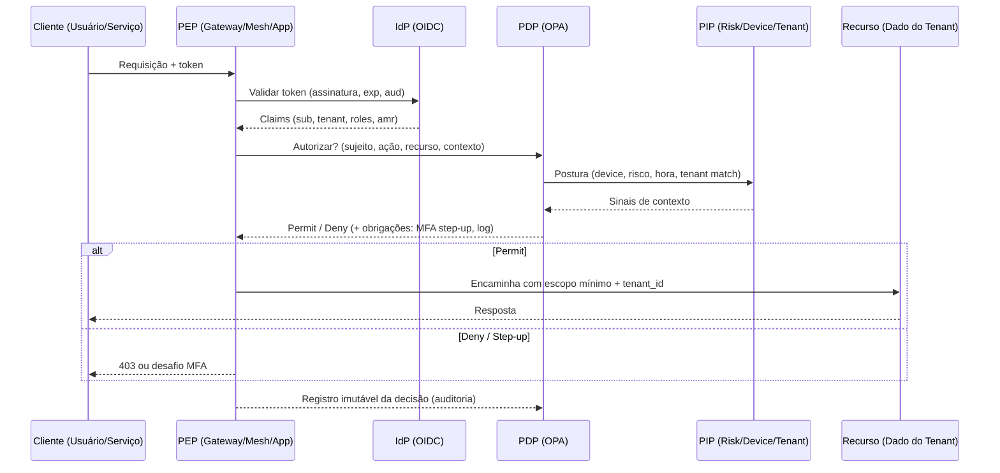
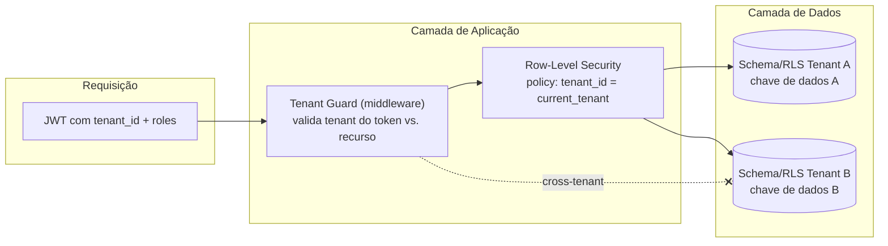
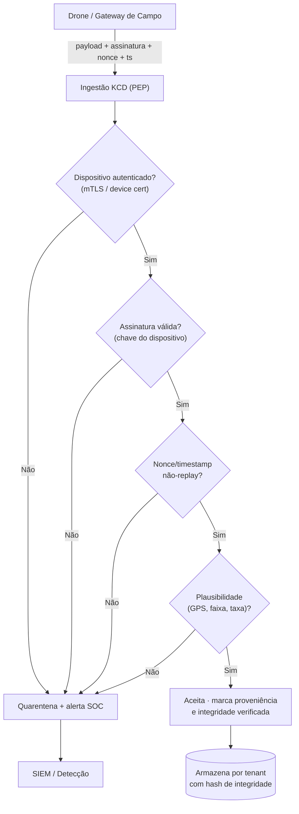
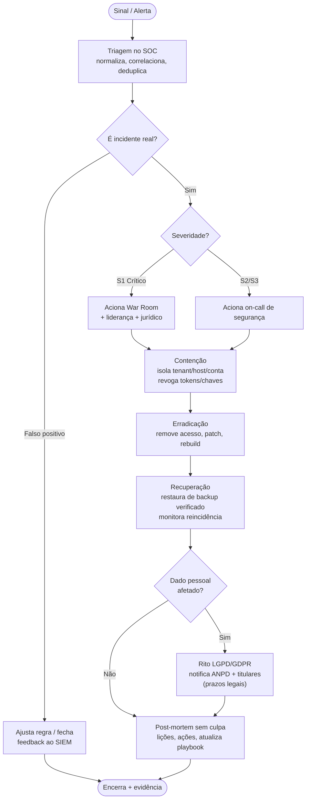

# 14 — Kairós Cyber Defense (KCD) · Drone Kairós ERP

**Documento:** `14 — Kairós Cyber Defense (KCD)`
**Versão:** 1.0 · **Data:** 21 de julho de 2026 · **Status:** Ativo
**Dependências:** `00`, `01`, `02`, `03`, `04`, `05`, `06`, `07`, `08`, `09`, `10`, `11`, `12`, `13`
**Responsável:** Especialista em Cibersegurança (CISO/Arquiteto de Segurança)

---

## 1. Resumo Executivo

O **Kairós Cyber Defense (KCD)** é o módulo proprietário de cibersegurança do **Drone Kairós ERP** — não um acessório, mas uma camada de produto **projetada desde o design** (*security by design*) e integrada ao ciclo de vida completo da plataforma. O KCD materializa a doutrina **Zero Trust** do projeto: nenhuma rede, dispositivo, usuário, serviço ou requisição é confiável por origem; toda interação é **verificada continuamente**, autorizada sob **menor privilégio** e observada sob a premissa de **"assume breach"** (assuma que a violação já ocorreu).

O KCD atravessa o fluxo canônico do produto — **Segurança → Firewall → Criptografia → Auditoria → SOC → Zero Trust → Logs → Backups → Threat Detection** — e o converte em controles operacionais concretos: identidade forte (MFA, OIDC) e autorização granular (RBAC/ABAC); criptografia em repouso e em trânsito com gestão de chaves (KMS/HSM); **isolamento multiempresa** rígido por *tenant*; centro de operações de segurança (SOC) com **logging centralizado/SIEM**, detecção por regras e por anomalia, e resposta a incidentes; **backups, continuidade e Disaster Recovery** com RPO/RTO definidos; *hardening*, gestão de vulnerabilidades e **SDLC seguro** (SAST/DAST/SCA); e **auditoria contínua** com trilhas imutáveis para conformidade **LGPD/GDPR**.

Por operar um ERP que ingere **telemetria e ordens de serviço (OS) de drones**, o KCD adiciona controles específicos de **integridade e proveniência de dados** de dispositivos de campo: autenticação de dispositivo, assinatura de payload, anti-*replay* e validação de plausibilidade de telemetria. O resultado é uma postura defensiva **em profundidade** (*defense in depth*), auditável, alinhada a **NIST CSF 2.0**, **ISO/IEC 27001:2022** e **OWASP ASVS/SAMM**, e mensurável por indicadores (MTTD/MTTR, cobertura de MFA, conformidade de patch).

Os princípios inegociáveis do projeto sustentam todo o documento: **segurança por padrão**, **confiança é direito** (do cliente e do titular de dados) e **auditoria contínua**.

## 2. Objetivos

- **O1.** Estabelecer o **modelo Zero Trust** operacional do produto: verificação contínua de identidade e postura, menor privilégio, microssegmentação e mentalidade *assume breach*.
- **O2.** Definir a **gestão de identidade e acesso (IAM)**: autenticação forte (MFA, OIDC/OAuth2), autorização (RBAC + ABAC), ciclo de vida de identidades e gestão de segredos.
- **O3.** Padronizar a **criptografia** em repouso e em trânsito e a **gestão de chaves** (hierarquia, rotação, custódia, envelope encryption).
- **O4.** Garantir o **isolamento multiempresa** e a proteção de dados por *tenant* em todas as camadas (aplicação, dados, mensageria, observabilidade).
- **O5.** Operacionalizar o **SOC**: logging centralizado/SIEM, detecção de ameaças (regras + anomalia), *threat intelligence* e resposta a incidentes.
- **O6.** Definir **backups, continuidade de negócio (BCP) e Disaster Recovery (DR)** com metas de **RPO/RTO** por classe de dado.
- **O7.** Institucionalizar **hardening**, **gestão de vulnerabilidades** e o **SDLC seguro** (SAST, DAST, SCA, revisão, *secrets scanning*).
- **O8.** Assegurar **auditoria contínua e conformidade** (LGPD/GDPR) com **trilhas imutáveis** e evidências verificáveis.
- **O9.** Proteger a **integridade dos dados de drones** (telemetria/OS): proveniência, assinatura, anti-*replay* e validação semântica.
- **O10.** Tornar a segurança **mensurável**: KPIs/KRIs, metas de SLA de segurança e melhoria contínua.

## 3. Escopo

**No escopo:** arquitetura de defesa em camadas do ERP; políticas de segurança; modelo Zero Trust; IAM (autenticação, autorização, identidades, segredos); criptografia e KMS; isolamento multiempresa; SOC/SIEM, detecção e resposta a incidentes; backup/BCP/DR; hardening e gestão de vulnerabilidades; SDLC seguro; auditoria e conformidade; controles específicos de telemetria/OS de drones.

**Fora do escopo (referência a outros documentos):** modelagem de dados por *bounded context* (Doc `06`); arquitetura macro e microsserviços (Docs `07`, `09`); infraestrutura/IaC, topologia de clusters e rede física (Doc `08`); pipelines de CI/CD e entrega (Docs de operação); firmware embarcado do drone (fora do perímetro do ERP — o KCD trata os dados **recebidos**, não o *firmware*). Aqui o KCD define **como** proteger, detectar, responder e comprovar; a implementação de cada módulo referenciado segue seu documento próprio.

**Interfaces com outros documentos:** consome os *bounded contexts* (Doc `06`), a malha de serviços e o `tenant_id` obrigatório em todo request/evento (Doc `09`), e a plataforma de infraestrutura/observabilidade (Doc `08`).

## 4. Regras (Políticas de Segurança)

- **R1. Zero Trust por padrão.** Nenhuma requisição é autorizada por origem de rede; toda requisição é autenticada, autorizada e registrada. *Deny by default*.
- **R2. Menor privilégio.** Todo sujeito (usuário, serviço, *job*) recebe o mínimo de permissões necessário, com acesso *just-in-time* (JIT) e *just-enough-access* (JEA) para operações privilegiadas.
- **R3. MFA obrigatório.** Acesso humano a qualquer console administrativo, ambiente produtivo ou dado sensível exige **MFA resistente a phishing** (WebAuthn/FIDO2 preferencial).
- **R4. Tenant sempre presente e verificado.** Todo request, evento, log e registro de dado carrega `tenant_id`; o KCD **valida** o *tenant* em cada camada. Acesso *cross-tenant* é negado por padrão e auditado.
- **R5. Criptografia universal.** Dados em trânsito com **TLS 1.3** (mTLS interno); dados em repouso cifrados (AES-256-GCM); segredos nunca em texto claro, nunca no código.
- **R6. Segredos gerenciados.** Nenhum segredo em repositório, imagem, variável de ambiente estática ou log. Uso obrigatório do cofre (Vault/KMS) com rotação e *lease* curto.
- **R7. Tudo é logado, nada é adulterável.** Eventos de segurança e trilhas de auditoria são centralizados, correlacionados por `traceparent` e **imutáveis** (WORM/append-only, *hash chaining*).
- **R8. Assume breach.** Presume-se comprometimento: segmentação, contenção lateral, detecção contínua e *playbooks* de resposta são requisitos, não opções.
- **R9. Integridade de dados de campo.** Telemetria/OS de drones só é aceita com **dispositivo autenticado**, **payload assinado**, *nonce*/timestamp válido (anti-*replay*) e passando na validação de plausibilidade.
- **R10. Privacidade desde a concepção.** Minimização, finalidade, retenção limitada e base legal (LGPD/GDPR) são requisitos de design de qualquer feature que trate dado pessoal.
- **R11. Mudança segura.** Nenhum artefato vai a produção sem *gates* de segurança verdes (SAST/DAST/SCA, *secrets scan*, revisão) e *supply chain* verificada (SBOM, assinatura de imagem).
- **R12. Resposta com prazo.** Todo incidente tem classificação de severidade, SLA de resposta, responsável e registro pós-morte; violações de dados pessoais têm rito de notificação (ANPD/autoridade).
- **R13. Rotação e expiração.** Chaves, certificados, tokens e credenciais têm ciclo de vida com expiração e rotação automáticas; nada é "permanente".
- **R14. Verificabilidade.** Todo controle deve produzir **evidência auditável**; um controle sem evidência é considerado inexistente.

## 5. Arquitetura (Defesa em Camadas)

### 5.1 Princípio: Defense in Depth sob Zero Trust

O KCD organiza controles em **camadas concêntricas**, de modo que a falha de uma camada seja contida pela seguinte. Cada camada tem responsabilidade, controles e evidências próprias. O plano de controle Zero Trust (*Policy Decision Point* — PDP) é consultado por *Policy Enforcement Points* (PEP) distribuídos (gateway, service mesh, aplicação).

| # | Camada | Responsabilidade nuclear | Controles KCD | Evidência |
|---|--------|--------------------------|---------------|-----------|
| L0 | **Governança** | Políticas, risco, conformidade | Políticas §4, matriz de risco §13, RACI | Política versionada, ata de risco |
| L1 | **Perímetro / Borda** | Filtrar e proteger a borda | WAF, API Gateway, rate limit, DDoS, TLS 1.3 | Logs de WAF/gateway |
| L2 | **Rede / Segmentação** | Microssegmentação, mTLS | Service mesh, NetworkPolicy, *deny-all* base | Políticas de rede, telemetria mTLS |
| L3 | **Identidade (IAM)** | Quem é e o que pode | OIDC, MFA, RBAC/ABAC, PDP/OPA | Logs de authN/authZ |
| L4 | **Aplicação** | Código seguro, validação | Input validation, OWASP ASVS, CSRF/XSS/SQLi guards | Relatórios SAST/DAST |
| L5 | **Dados** | Confidencialidade/integridade | Cripto em repouso, isolamento por *tenant*, mascaramento | Chaves KMS, testes de isolamento |
| L6 | **Segredos / Chaves** | Custódia de material sensível | Vault/KMS, HSM, rotação, envelope encryption | Registro de rotação, ACLs do cofre |
| L7 | **Observabilidade / SOC** | Detectar e responder | SIEM, regras+anomalia, SOAR, *playbooks* | Alertas, tickets, pós-mortes |
| L8 | **Continuidade** | Sobreviver e restaurar | Backups, DR, RPO/RTO, testes de restore | Relatórios de restore/DR drill |
| L9 | **Borda de Campo (Drone)** | Integridade de telemetria/OS | Auth de dispositivo, assinatura, anti-*replay* | Verificação de assinatura, quarentena |

### 5.2 Planos de controle e execução (Zero Trust)

- **PDP (Policy Decision Point):** motor central de decisão de autorização (ex.: OPA/Rego) que avalia identidade + postura + contexto (dispositivo, risco, hora, *tenant*) e retorna *permit/deny*.
- **PEP (Policy Enforcement Point):** pontos que **impõem** a decisão — API Gateway (borda), sidecars da malha (leste-oeste), *middleware* da aplicação (nível de recurso/registro).
- **PIP (Policy Information Point):** fontes de contexto — provedor de identidade (IdP/OIDC), *risk engine*, inventário de dispositivos, *threat intel*.
- **PAP (Policy Administration Point):** onde políticas são escritas, versionadas e revisadas (GitOps de políticas).

### 5.3 Fluxo canônico do produto mapeado em controles

| Etapa do fluxo canônico | Camada KCD | Controle principal |
|-------------------------|-----------|--------------------|
| Segurança | L0/L3 | Política + identidade |
| Firewall | L1/L2 | WAF, segmentação, *deny-all* |
| Criptografia | L5/L6 | TLS 1.3 + AES-256 + KMS |
| Auditoria | L7 | Trilha imutável |
| SOC | L7 | SIEM + SOAR |
| Zero Trust | L3 (PDP/PEP) | Verificação contínua |
| Logs | L7 | Logging centralizado |
| Backups | L8 | Backup + DR (RPO/RTO) |
| Threat Detection | L7/L9 | Regras + anomalia + integridade de campo |

## 6. Diagramas

### 6.1 Arquitetura de Defesa em Camadas

### 6.2 Modelo Zero Trust — Decisão de Acesso (PDP/PEP)

### 6.3 Isolamento Multiempresa (Tenancy)

### 6.4 Integridade de Telemetria/OS de Drone

## 7. Fluxogramas (Resposta a Incidente)

### 7.1 Ciclo de Resposta a Incidentes (NIST SP 800-61)

### 7.2 Severidade, SLA e Papéis

| Severidade | Definição | SLA de resposta | Acionamento | Comunicação |
|------------|-----------|-----------------|-------------|-------------|
| **S1 — Crítico** | Vazamento de dados, *ransomware*, indisponibilidade multi-tenant, comprometimento de root/KMS | Reconhecer ≤ 15 min · Conter ≤ 1 h | War Room, CISO, Jurídico, Exec | Cliente + ANPD conforme LGPD |
| **S2 — Alto** | Comprometimento de conta privilegiada, *exploit* ativo em 1 *tenant* | Reconhecer ≤ 30 min · Conter ≤ 4 h | On-call + líder de segurança | Cliente afetado |
| **S3 — Médio** | Tentativa contida, *misconfig* explorável, anomalia relevante | Reconhecer ≤ 2 h · Conter ≤ 24 h | On-call | Interna |
| **S4 — Baixo** | Ruído, varredura, política menor | Reconhecer ≤ 1 dia | Fila do SOC | Interna |

## 8. Boas Práticas

- **Segurança por padrão:** *secure defaults* em todo módulo — TLS on, MFA on, *deny-all* de base, portas fechadas, mínimo de escopo.
- **Menor privilégio sempre:** contas de serviço dedicadas por serviço; acesso humano privilegiado via **JIT** com aprovação e expiração; sem contas compartilhadas.
- **Nunca confie na entrada:** validação e *sanitização* de todo *input*; *output encoding*; *parametrized queries*; *allowlist* > *denylist*.
- **Segredos fora do código:** cofre para todas as credenciais; *pre-commit hooks* e *secrets scanning* no pipeline; rotação automática.
- **Rotação e expiração curtas:** tokens de vida curta + *refresh*; certificados com renovação automática; chaves com rotação programada.
- **Imutabilidade operacional:** infraestrutura imutável, *rebuild* em vez de *patch in place* quando viável; imagens assinadas e verificadas.
- **Observabilidade acionável:** todo alerta tem *runbook*; sem alerta órfão; correlação por `traceparent` de ponta a ponta.
- **Menos é mais superfície:** remover o desnecessário (serviços, portas, dependências, permissões) reduz risco mais do que adicionar controles.
- **Falhar fechado:** em dúvida de autorização ou indisponibilidade do PDP, **negar** (com *fail-safe* documentado para disponibilidade crítica).
- **Privacidade por padrão:** minimização de dado, mascaramento em não-produção, retenção com expurgo automático.
- **Treine o humano:** *awareness* anti-*phishing*, exercícios de mesa (*tabletop*), *red team*/*purple team* periódicos.
- **Documente a evidência:** cada controle gera artefato auditável; o que não é comprovável não conta.

## 9. Padrões (Frameworks de Referência)

| Framework | Uso no KCD | Aplicação principal |
|-----------|-----------|---------------------|
| **NIST CSF 2.0** | Espinha dorsal de governança | Funções Govern, Identify, Protect, Detect, Respond, Recover mapeadas às camadas §5 |
| **NIST SP 800-207** | Modelo Zero Trust | Definição de PDP/PEP/PIP/PAP §5.2 |
| **NIST SP 800-61** | Resposta a incidentes | Ciclo §7.1 |
| **NIST SP 800-53 / 800-63** | Controles / identidade | Baseline de controles e níveis de autenticação (AAL) |
| **ISO/IEC 27001:2022** | SGSI | Anexo A (93 controles) como base do §11 e §15 |
| **ISO/IEC 27017 / 27018** | Nuvem / PII em nuvem | Controles multiempresa e proteção de dados pessoais |
| **ISO 22301** | Continuidade de negócio | BCP/DR §11.6 |
| **OWASP ASVS 4.x** | Verificação de app | *Gates* de aplicação §5 L4 |
| **OWASP SAMM / Top 10 / API Top 10** | Maturidade e riscos | SDLC seguro §11.5 |
| **OWASP CycloneDX / SLSA** | *Supply chain* / SBOM | Integridade da cadeia §11.5 |
| **CIS Benchmarks** | Hardening | Baselines de SO, container, k8s, DB §11 |
| **MITRE ATT&CK** | Detecção baseada em TTPs | Mapeamento de regras do SIEM §11.4 |
| **LGPD (Lei 13.709) / GDPR** | Privacidade e conformidade | Base legal, direitos do titular, notificação §11.8 |

## 10. Casos de Uso

### CU-01 — Login administrativo com MFA e step-up
Administrador de *tenant* acessa o console. OIDC valida credenciais; o PDP exige **MFA resistente a phishing** (WebAuthn). Ao tentar operação sensível (exportar dados pessoais), o *risk engine* detecta novo dispositivo e força **step-up** adicional. Toda a decisão é registrada em trilha imutável.

### CU-02 — Tentativa de acesso cross-tenant
Um token do Tenant A tenta ler uma OS do Tenant B (via manipulação de ID). O *Tenant Guard* compara `tenant_id` do token com o do recurso; RLS no banco impede a leitura; o KCD retorna 403, gera alerta de **acesso cross-tenant** (indicador de IDOR/BOLA) e abre triagem no SOC.

### CU-03 — Injeção detectada por WAF + SAST prévio
Requisição com *payload* de SQLi chega ao gateway; o WAF bloqueia. O SAST/DAST no pipeline já havia coberto o padrão; a aplicação usa *prepared statements*. O evento alimenta a detecção de anomalia (pico de 403 por IP) e dispara *rate limit* adaptativo.

### CU-04 — Telemetria de drone adulterada (replay)
Um atacante reenvia um pacote de telemetria capturado. A ingestão do KCD valida assinatura (ok) mas detecta **nonce/timestamp reutilizado** → rejeita, coloca origem em quarentena e alerta o SOC (possível MITM/replay). O dado não contamina relatórios do *tenant*.

### CU-05 — Credencial vazada em commit
Desenvolvedor comita acidentalmente uma chave. O *secrets scanning* no *pre-commit* e no CI bloqueia o *merge*; o KCD dispara **rotação automática** da credencial exposta e registra o incidente S3, com pós-morte e melhoria de *hook*.

### CU-06 — Ransomware / recuperação
Detecção de cifragem anômala de arquivos em um serviço. *Playbook* S1: isola o host, revoga tokens/chaves, aciona War Room. Recuperação via **backup imutável** verificado (fora do alcance do atacante, *air-gapped*/WORM), restaurando dentro do RTO. Dado pessoal afetado → rito LGPD.

### CU-07 — Direito do titular (LGPD/GDPR)
Titular solicita exclusão de dados. O KCD executa fluxo de *data subject request*: localiza dados por *tenant*, aplica expurgo/anonimização, preserva o mínimo legal, e gera **evidência auditável** do atendimento dentro do prazo legal.

### CU-08 — Detecção por anomalia comportamental
Conta de usuário passa a acessar volumes atípicos de OS em horário incomum a partir de novo país (*impossible travel*). O modelo de anomalia eleva o *risk score*; o PDP força *step-up* e, na falha, suspende a sessão e abre incidente S2.

## 11. Modelagem (Controles por Domínio)

### 11.1 Zero Trust
| Controle | Descrição | Padrão | Evidência |
|----------|-----------|--------|-----------|
| ZT-1 Verificação contínua | Reavaliação de sessão/postura a cada requisição sensível | 800-207 | Logs de decisão do PDP |
| ZT-2 Menor privilégio | RBAC/ABAC + JIT/JEA | 800-53 AC | Matriz de acesso, aprovações JIT |
| ZT-3 Microssegmentação | mTLS + *deny-all* leste-oeste | 800-207 | NetworkPolicy, telemetria de malha |
| ZT-4 Assume breach | Contenção lateral, honeytokens | ATT&CK | Alertas de movimento lateral |

### 11.2 IAM (Identidade e Acesso)
| Controle | Descrição | Padrão | Evidência |
|----------|-----------|--------|-----------|
| IAM-1 OIDC/OAuth2 | Federação de identidade, tokens JWT assinados | 800-63 | Config do IdP, validação de tokens |
| IAM-2 MFA phishing-resistant | WebAuthn/FIDO2 para acesso privilegiado | 800-63 AAL2/3 | Cobertura de MFA (%) |
| IAM-3 RBAC | Papéis por *bounded context* e *tenant* | 27001 A.5.15 | Definição de papéis, revisão de acesso |
| IAM-4 ABAC | Atributos (tenant, sensibilidade, contexto) no PDP | NIST ABAC | Políticas Rego |
| IAM-5 Ciclo de identidade | *Joiner/Mover/Leaver*, *deprovisioning* automático | 27001 A.5.16 | Logs de provisionamento |
| IAM-6 Gestão de segredos | Cofre, rotação, *lease* curto | 27001 A.8.24 | Registro de rotação, ACLs |
| IAM-7 Acesso privilegiado (PAM) | JIT, *break-glass* auditado | 800-53 AC-6 | Trilha de sessão privilegiada |

### 11.3 Criptografia e Chaves
| Controle | Descrição | Padrão | Evidência |
|----------|-----------|--------|-----------|
| CR-1 TLS em trânsito | TLS 1.3, mTLS interno, HSTS | 27001 A.8.24 | Scan de configuração TLS |
| CR-2 Cripto em repouso | AES-256-GCM em DB, objeto e backup | 27001 A.8.24 | Config de cifragem |
| CR-3 Hierarquia de chaves | *Root* (HSM) → KEK → DEK, *envelope encryption* | NIST 800-57 | Diagrama e políticas de KMS |
| CR-4 Rotação | Rotação programada e sob comprometimento | 800-57 | Log de rotação |
| CR-5 Chave por tenant | Isolamento criptográfico entre *tenants* | 27018 | Mapa chave↔tenant |
| CR-6 Gestão de certificados | Emissão/renovação automática, revogação | 27001 A.8.24 | Inventário de certs, expiração |

### 11.4 SOC, Logging e Detecção
| Controle | Descrição | Padrão | Evidência |
|----------|-----------|--------|-----------|
| SOC-1 Logging centralizado | Coleta normalizada, correlação por trace | 27001 A.8.15 | Cobertura de fontes de log |
| SOC-2 Logs imutáveis | WORM/append-only + *hash chaining* | 27001 A.8.15 | Verificação de integridade |
| SOC-3 Detecção por regras | Regras mapeadas a MITRE ATT&CK | ATT&CK | Catálogo de regras |
| SOC-4 Detecção por anomalia | Baselines comportamentais (UEBA) | NIST Detect | Alertas de anomalia |
| SOC-5 Threat intelligence | IOCs, enriquecimento, *feeds* | 800-53 | Fontes de TI integradas |
| SOC-6 SOAR / playbooks | Automação de contenção e triagem | 800-61 | Playbooks versionados |
| SOC-7 Métricas | MTTD, MTTR, cobertura | CSF Detect/Respond | Painel de KPIs |

### 11.5 SDLC Seguro e Vulnerabilidades
| Controle | Descrição | Padrão | Evidência |
|----------|-----------|--------|-----------|
| SDL-1 SAST | Análise estática no CI | ASVS/SAMM | Relatórios por build |
| SDL-2 DAST | Teste dinâmico em ambiente de teste | ASVS | Relatórios DAST |
| SDL-3 SCA / dependências | Varredura de libs, CVEs, licenças | OWASP Dep. | Inventário + alertas |
| SDL-4 Secrets scanning | *Pre-commit* + CI | 27001 A.8.24 | Bloqueios registrados |
| SDL-5 SBOM + assinatura | CycloneDX, imagens assinadas, SLSA | SLSA | SBOM por release |
| SDL-6 Gestão de vulnerabilidades | *Scan*, priorização (CVSS/EPSS), SLA de correção | 800-40 | Painel de vulns + SLA |
| SDL-7 Hardening | CIS Benchmarks (SO, container, k8s, DB) | CIS | Score CIS |

### 11.6 Continuidade e DR
| Controle | Descrição | Padrão | Evidência |
|----------|-----------|--------|-----------|
| BC-1 Backups cifrados | 3-2-1, cifrados, por *tenant* | 27001 A.8.13 | Job de backup + status |
| BC-2 Imutabilidade | Backups WORM/air-gapped anti-ransomware | ISO 22301 | Config de imutabilidade |
| BC-3 Teste de restore | Restauração verificada periodicamente | 22301 | Relatório de restore |
| BC-4 DR / RPO-RTO | Metas por classe de dado (§11.6.1) | 22301 | DR drill |
| BC-5 Plano de continuidade | BCP com papéis e comunicação | 22301 | BCP versionado |

#### 11.6.1 Metas RPO/RTO por classe de dado
| Classe de dado | Exemplo | RPO | RTO |
|----------------|---------|-----|-----|
| Crítico transacional | OS, financeiro, identidade | ≤ 5 min | ≤ 1 h |
| Operacional | Estoque, cadastros | ≤ 1 h | ≤ 4 h |
| Telemetria de drone | Séries de voo/sensor | ≤ 15 min | ≤ 2 h |
| Analítico / BI | Data warehouse | ≤ 24 h | ≤ 24 h |
| Logs / auditoria | Trilhas | ≤ 5 min | ≤ 2 h |

### 11.7 Isolamento Multiempresa
| Controle | Descrição | Padrão | Evidência |
|----------|-----------|--------|-----------|
| MT-1 Tenant guard | Middleware valida *tenant* do token vs. recurso | 27017 | Testes de isolamento |
| MT-2 RLS / schema | Row-Level Security ou schema por *tenant* | 27018 | Policies de RLS |
| MT-3 Chave por tenant | Isolamento criptográfico | 27018 | Mapa de chaves |
| MT-4 Isolamento de observabilidade | Logs/métricas segregados por *tenant* | 27017 | Config do SIEM |
| MT-5 Testes anti-cross-tenant | Testes automatizados de vazamento | ASVS | Suíte de testes |

### 11.8 Auditoria, Privacidade e Conformidade
| Controle | Descrição | Padrão | Evidência |
|----------|-----------|--------|-----------|
| AU-1 Trilha imutável | Quem, o quê, quando, de onde; *append-only* | 27001 A.8.15 | Trilha verificável |
| AU-2 Base legal LGPD/GDPR | Finalidade, consentimento/base, minimização | LGPD art. 7/GDPR art. 6 | Registro de tratamento (RoPA) |
| AU-3 Direitos do titular | Acesso, correção, exclusão, portabilidade | LGPD/GDPR | Fluxo de DSR + prazos |
| AU-4 Notificação de incidente | Rito ANPD/autoridade | LGPD art. 48 | Registro de notificação |
| AU-5 Retenção e expurgo | Ciclo de vida do dado, expurgo automático | 27001 A.5.34 | Política de retenção |
| AU-6 DPIA/RIPD | Avaliação de impacto para tratamentos de risco | GDPR art. 35 | RIPD arquivado |

### 11.9 Segurança de Dados de Drones (Telemetria/OS)
| Controle | Descrição | Padrão | Evidência |
|----------|-----------|--------|-----------|
| DR-1 Autenticação de dispositivo | mTLS / certificado por drone/gateway | 800-207 | Inventário de dispositivos |
| DR-2 Assinatura de payload | Assinatura por chave do dispositivo | 800-57 | Verificação de assinatura |
| DR-3 Anti-replay | *Nonce* + *timestamp* + janela | ASVS | Rejeições registradas |
| DR-4 Plausibilidade | Validação semântica (GPS, faixas, taxas) | — | Regras de validação |
| DR-5 Proveniência/integridade | Hash de integridade + linhagem por *tenant* | 800-53 SI | Selo de proveniência |
| DR-6 Quarentena | Isolamento de dado suspeito antes do uso | 800-61 | Fila de quarentena |

## 12. Checklist

**Zero Trust & IAM**
- [ ] MFA resistente a phishing habilitado para todo acesso privilegiado
- [ ] PDP central (OPA) em produção com políticas versionadas (GitOps)
- [ ] RBAC + ABAC aplicados; nenhuma permissão "*" sem justificativa
- [ ] Acesso privilegiado somente via JIT com expiração e aprovação
- [ ] `tenant_id` validado em gateway, malha e aplicação

**Criptografia & Segredos**
- [ ] TLS 1.3 em toda borda; mTLS interno na malha
- [ ] AES-256 em repouso (DB, objeto, backup); chave por *tenant*
- [ ] Hierarquia root(HSM)→KEK→DEK com *envelope encryption*
- [ ] Rotação automática de chaves, certificados e tokens
- [ ] Zero segredos no código/imagem/env; cofre + *secrets scanning*

**SOC, Logs & Detecção**
- [ ] Logging centralizado cobrindo todas as fontes críticas
- [ ] Trilhas imutáveis (WORM/*hash chain*) verificadas
- [ ] Regras mapeadas a MITRE ATT&CK + detecção por anomalia
- [ ] Playbooks SOAR para S1–S4 testados
- [ ] Painel de MTTD/MTTR ativo

**SDLC & Vulnerabilidades**
- [ ] SAST, DAST, SCA e *secrets scan* como *gates* obrigatórios
- [ ] SBOM (CycloneDX) e imagens assinadas por release
- [ ] SLA de correção por severidade (CVSS/EPSS) cumprido
- [ ] Baselines CIS aplicados e medidos

**Continuidade & DR**
- [ ] Backups 3-2-1 cifrados e imutáveis
- [ ] RPO/RTO definidos por classe e testados
- [ ] DR drill executado no período; *runbook* atualizado

**Multiempresa & Privacidade**
- [ ] Testes automatizados anti-cross-tenant no CI
- [ ] RoPA e bases legais LGPD/GDPR documentadas
- [ ] Fluxo de direitos do titular operante com prazos
- [ ] Retenção e expurgo automáticos configurados

**Drones**
- [ ] Autenticação de dispositivo + assinatura de payload
- [ ] Anti-*replay* e validação de plausibilidade ativos
- [ ] Quarentena de dados suspeitos antes do uso analítico

## 13. Riscos

| ID | Risco | Prob. | Impacto | Exposição | Mitigação (controle) |
|----|-------|-------|---------|-----------|----------------------|
| RK-01 | Vazamento **cross-tenant** por falha de isolamento (BOLA/IDOR) | Média | Crítico | Alta | MT-1..MT-5, testes anti-cross-tenant, RLS + chave por *tenant* |
| RK-02 | Comprometimento de conta privilegiada | Média | Crítico | Alta | IAM-2 (MFA), IAM-7 (PAM/JIT), UEBA (SOC-4) |
| RK-03 | **Ransomware** com destruição de backups | Baixa | Crítico | Média | BC-2 (imutável/air-gap), BC-3 (restore testado), CU-06 |
| RK-04 | Segredo vazado em repositório/imagem | Média | Alto | Alta | SDL-4, IAM-6, rotação automática |
| RK-05 | Vulnerabilidade em dependência (*supply chain*) | Alta | Alto | Alta | SDL-3, SDL-5 (SBOM/assinatura), SLA de patch |
| RK-06 | **Telemetria adulterada/replay** contaminando dados | Média | Alto | Alta | DR-1..DR-6 (auth, assinatura, anti-replay, plausibilidade) |
| RK-07 | Exposição de dado pessoal / não conformidade LGPD | Média | Crítico | Alta | AU-2..AU-6, minimização, DPIA |
| RK-08 | Indisponibilidade de PDP causando *fail-open* | Baixa | Alto | Média | PDP HA, *fail-closed* padrão, cache de decisão seguro |
| RK-09 | Detecção tardia (MTTD alto) | Média | Alto | Alta | SOC-1..SOC-7, cobertura de log, *tuning* contínuo |
| RK-10 | Erro de configuração de nuvem (*misconfig*) | Alta | Alto | Alta | SDL-7 (CIS), *policy as code*, *scanning* de IaC |
| RK-11 | *Phishing*/engenharia social | Alta | Alto | Alta | MFA phishing-resistant, *awareness*, *tabletop* |
| RK-12 | Insider malicioso/negligente | Baixa | Crítico | Média | Menor privilégio, trilha imutável, segregação de funções |

Escala: Prob./Impacto ∈ {Baixa, Média, Alta / Baixo, Alto, Crítico}. Exposição = combinação — reavaliada trimestralmente no comitê de risco.

## 14. Melhorias Futuras

- **MF-1. Zero Trust adaptativo com risco contínuo:** *risk engine* com ML para *step-up* dinâmico e sessões de confiança contínua (CARTA).
- **MF-2. Passwordless amplo:** expansão de WebAuthn/*passkeys* para todos os perfis, redução de senhas a zero.
- **MF-3. Confidential computing:** processamento em enclaves (TEE) para dados de *tenants* de alta sensibilidade.
- **MF-4. Detecção por UEBA/ML avançada:** modelos por *tenant* e por perfil de drone; redução de MTTD.
- **MF-5. Cripto-agilidade e pós-quântica:** inventário de algoritmos e migração planejada para *PQC* (NIST FIPS 203/204).
- **MF-6. SOAR ampliado:** automação de contenção *end-to-end* (revogação, isolamento, *rebuild*) com aprovação humana no *loop* apenas para S1.
- **MF-7. Attestation de dispositivos de campo:** *remote attestation* do gateway do drone para elevar confiança na proveniência.
- **MF-8. Chaos security / purple team contínuo:** exercícios automatizados de resiliência e detecção.
- **MF-9. Data lineage completo:** linhagem criptográfica ponta-a-ponta da telemetria à decisão de negócio.
- **MF-10. Painel de postura por tenant:** *security posture* self-service para o cliente (transparência = confiança é direito).

## 15. Auditoria

### 15.1 Modelo de auditoria contínua
O KCD adota **auditoria contínua**: os controles não são verificados apenas em janelas anuais, mas **monitorados por evidência automatizada** (*compliance as code*). Cada controle de §11 emite artefatos que alimentam painéis de conformidade mapeados a ISO 27001 (Anexo A), NIST CSF 2.0 e LGPD.

### 15.2 Trilha de auditoria (imutável)
- **Conteúdo mínimo por evento:** identidade do sujeito, ação, recurso, `tenant_id`, resultado (permit/deny), origem (IP/dispositivo), `traceparent`, *timestamp* confiável.
- **Integridade:** *append-only* com *hash chaining* (cada registro encadeia o hash do anterior) e selagem periódica; armazenamento WORM.
- **Segregação:** trilhas de auditoria isoladas dos operadores auditados (o SOC não pode apagar o próprio rastro).
- **Retenção:** conforme classe (mín. legal LGPD/setorial), com expurgo controlado e comprovável.

### 15.3 Cadência e responsáveis
| Atividade | Frequência | Responsável | Saída |
|-----------|-----------|-------------|-------|
| Revisão de acessos (*access review*) | Trimestral | Donos de sistema + Segurança | Evidência de recertificação |
| *Pentest* externo | Semestral | Terceiro independente | Relatório + plano de correção |
| DR drill / teste de restore | Semestral | Infra + Segurança | Relatório de RPO/RTO real |
| Revisão de políticas (§4) | Anual ou por mudança | CISO | Política versionada |
| Auditoria ISO 27001 | Anual | Auditor certificado | Certificado / não conformidades |
| *Tabletop* de incidente | Semestral | SOC + liderança | Lições e ajuste de *playbook* |
| Revisão de risco (§13) | Trimestral | Comitê de Risco | Matriz atualizada |
| Verificação de integridade de trilhas | Contínua (automática) | KCD/SIEM | Alerta em caso de quebra |

### 15.4 Métricas de auditoria (KPIs/KRIs)
| Métrica | Meta |
|---------|------|
| Cobertura de MFA (privilegiado) | 100% |
| Cobertura de log de fontes críticas | ≥ 98% |
| MTTD (tempo médio de detecção) | ≤ 30 min (S1/S2) |
| MTTR (tempo médio de resposta) | ≤ 4 h (S2) |
| Conformidade de patch crítico no SLA | ≥ 95% |
| Backups com restore verificado | 100% no período |
| Achados de auditoria em atraso | 0 críticos |
| Testes anti-cross-tenant no CI | 100% verdes |

### 15.5 Encerramento
O KCD só é considerado **conforme** quando cada controle possui **evidência viva** (R14). A ausência de evidência equivale à ausência do controle. Este documento é revisado a cada mudança arquitetural relevante (Docs `07`/`08`/`09`), a cada incidente S1/S2 e, no mínimo, anualmente — sustentando os três princípios do projeto: **segurança por padrão**, **confiança é direito** e **auditoria contínua**.

---

> **Nota de dependências:** este documento consome e referencia os artefatos `00`–`13`. Alterações em modelagem de dados (`06`), arquitetura (`07`), infraestrutura (`08`) ou microsserviços (`09`) exigem reavaliação dos controles correspondentes em §11.
