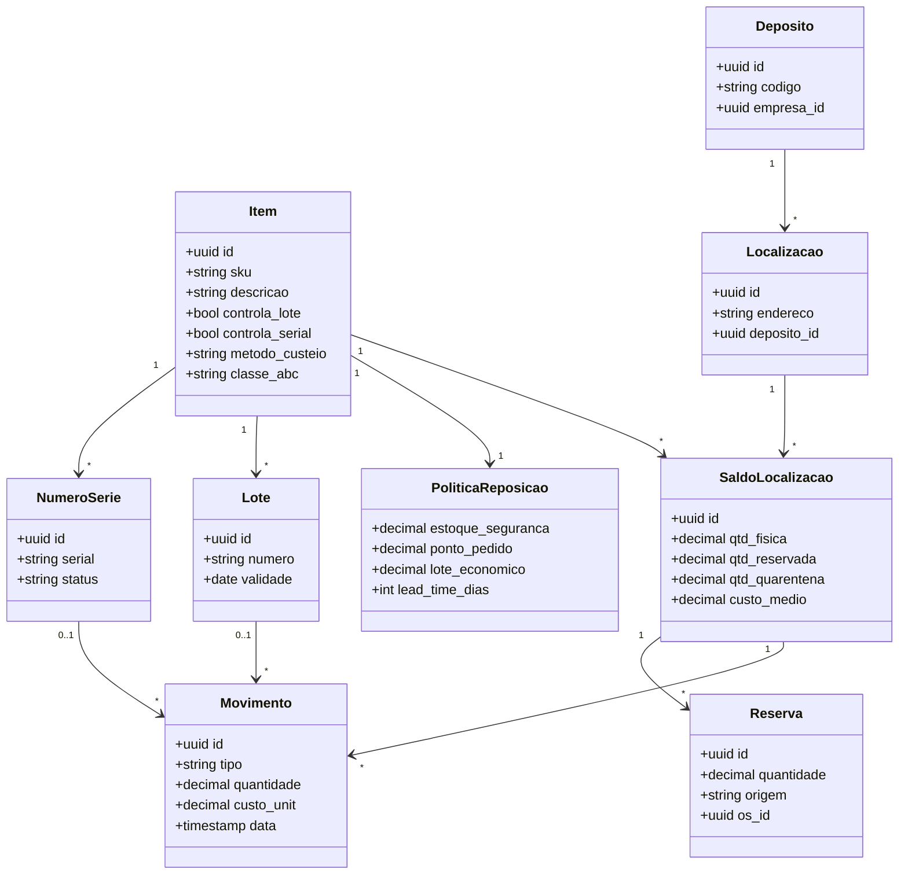
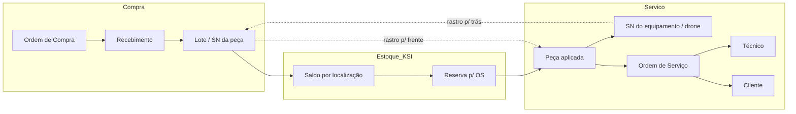
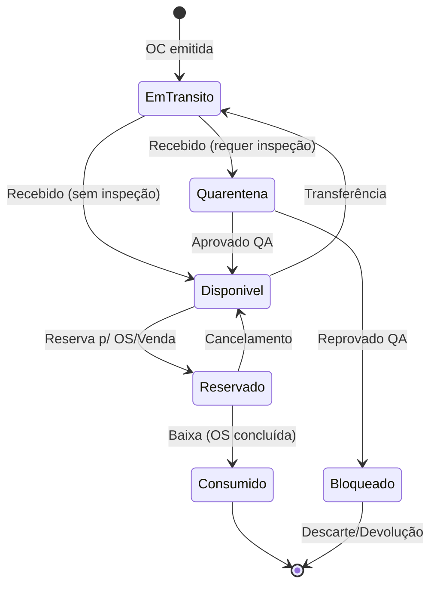
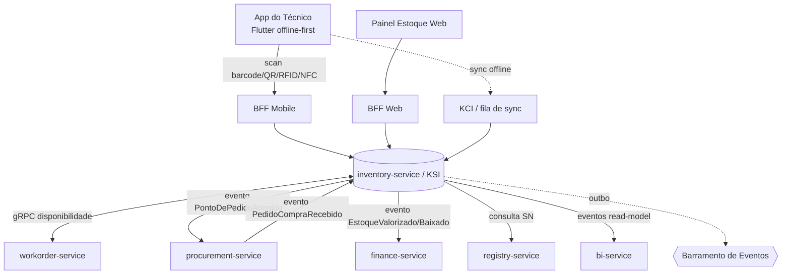
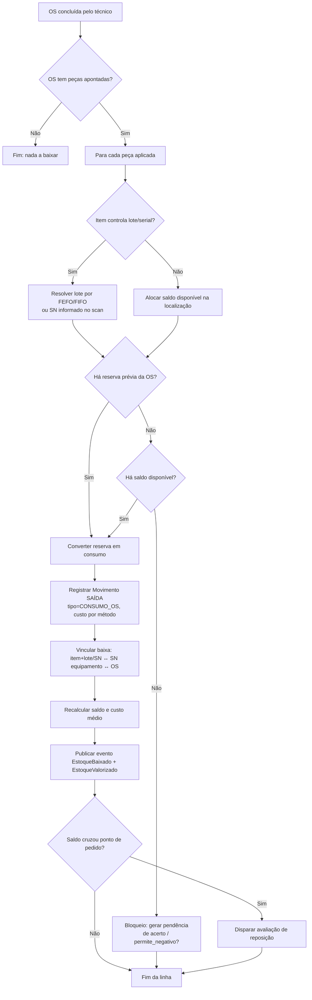
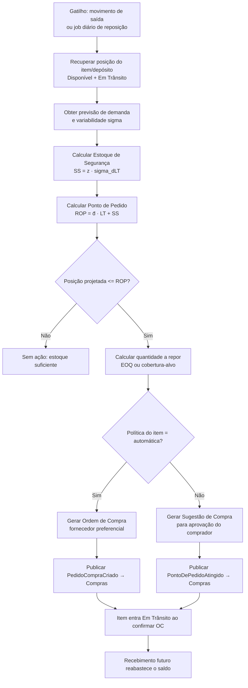
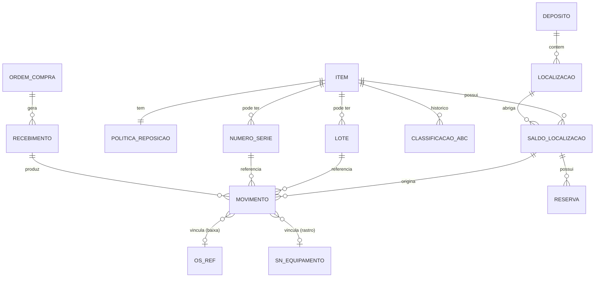

# 15 — Kairós Smart Inventory (KSI) · Drone Kairós ERP

**Documento:** `15 — Kairós Smart Inventory (KSI)`
**Versão:** 1.0 · **Data:** 21 de julho de 2026 · **Status:** Ativo
**Dependências:** `00 — Master Prompt`, `01 — Constituição`, `02 — Project Bible`, `03 — Roadmap`, `04 — Pesquisa de Mercado`, `05 — Benchmark`, `06 — Requisitos`, `07 — Arquitetura`, `08 — Modelagem de Dados`, `09 — Microsserviços`, `10 — Padrões de Código`, `11 — API`, `12 — Frontend/Apps`, `13 — KCI`, `14 — KCD`
**Responsável:** Especialista Supply Chain / Gestão de Estoque

---

## 1. Resumo Executivo

O **KSI — Kairós Smart Inventory** é o módulo proprietário de **estoque inteligente** do Drone Kairós ERP. Ele governa a posição física e contábil de todos os itens que circulam no ecossistema fabricante → revenda → técnico → cliente: peças de reposição, componentes, insumos de campo, kits de manutenção e os próprios equipamentos (drones) enquanto ativos de estoque antes da venda. Sua promessa central é **rastreabilidade vitalícia ponta a ponta** — cada peça que sai do estoque pode ser correlacionada ao **Serial Number (SN)** do equipamento em que foi aplicada e à **Ordem de Serviço (OS)** que a consumiu — combinada com **reposição preditiva** que antecipa a falta antes que ela pare uma manutenção em campo.

O KSI implementa o fluxo de referência canônico do projeto: **Estoque → Código de Barras → QR Code → RFID → NFC → Compras → Reposição Automática → Curva ABC → Previsão → Integração Financeira**. Na prática, isso significa que o técnico identifica a peça por leitura ótica (barcode/QR) ou por radiofrequência (RFID/NFC quando o hardware está disponível) diretamente pelo **app do técnico (Flutter, offline-first via KCI)**; o sistema dá **baixa automática** ao concluir a OS, atualiza saldos e reservas em tempo real, reclassifica a **curva ABC**, recalcula o **ponto de pedido** com base em **previsão de demanda** e, quando o saldo projetado cruza o gatilho, **sugere ou dispara automaticamente uma ordem de compra**. Ao recebimento, a valorização de estoque é lançada no **Financeiro** por **custo médio ponderado ou PEPS**, mantendo a contabilidade de estoque sempre conciliada.

Arquiteturalmente, o KSI é o `inventory-service` (bounded context **Estoque / KSI** do Doc 09), dono exclusivo dos dados de itens, saldos, reservas e movimentações, integrando-se por eventos de domínio (`EstoqueBaixado`, `PontoDePedidoAtingido`, `ItemRecebido`) e por chamadas gRPC internas de baixa latência. É **multiempresa** por construção: todo saldo, movimento e política de reposição é qualificado por `tenant_id`, com isolamento reforçado por Row-Level Security (Doc 07).

Este documento entrega: as regras de negócio de estoque, a arquitetura interna do módulo, os diagramas de domínio, os **fluxogramas de baixa automática e de reposição preditiva**, as fórmulas de classificação ABC / estoque de segurança / ponto de pedido / lote econômico, os casos de uso operacionais, o **modelo de dados resumido do estoque**, o checklist de prontidão, os riscos e a trilha de auditoria.

## 2. Objetivos

- **O1.** Manter uma **posição de estoque única e confiável** (saldo físico, disponível, reservado, em trânsito) por item, lote, número de série, depósito e localização, com atualização em tempo real e conciliação contínua.
- **O2.** Garantir **identificação automática** do item no ponto de uso via código de barras, QR Code, RFID e NFC, capturada pelo app do técnico, minimizando digitação e erro humano.
- **O3.** Assegurar **rastreabilidade ponta a ponta**: peça (item + lote/SN) ↔ SN do equipamento ↔ OS ↔ técnico ↔ cliente, em ambos os sentidos (rastro para frente e para trás).
- **O4.** Executar **baixa automática** de peças ao concluir a OS, com reserva prévia na abertura/planejamento e estorno em caso de cancelamento.
- **O5.** Classificar o portfólio por **Curva ABC** (e critérios complementares XYZ/criticidade) para priorizar políticas de controle, contagem e reposição.
- **O6.** Prover **previsão de demanda e reposição preditiva** — estoque de segurança, ponto de pedido e lote de reposição calculados a partir de histórico, lead time e variabilidade.
- **O7.** Integrar-se a **Compras**: gerar sugestão de compra, converter em ordem de compra (OC) e conciliar o **recebimento** contra a OC (three-way match).
- **O8.** Integrar-se ao **Financeiro**: valorizar o estoque por **custo médio ponderado ou PEPS**, lançar provisões (obsolescência, perdas) e refletir o CMV (custo da mercadoria/peça vendida ou aplicada).
- **O9.** Suportar **inventário cíclico** por classe ABC, com bloqueio/ajuste auditável e sem parar a operação.
- **O10.** Ser **multiempresa** e **offline-first** (o técnico opera sem rede; a sincronização reconcilia via KCI).

## 3. Escopo

**No escopo (coberto por este documento):**
- Cadastro de itens (SKU), unidades de medida e conversões, itens controlados por lote e/ou por número de série.
- Estrutura física de estoque: múltiplas empresas, depósitos, localizações (endereçamento), zonas.
- Saldos e estados de quantidade: físico, disponível, reservado, em trânsito, em quarentena/inspeção, bloqueado.
- Reservas (hard/soft) para OS, venda e transferência.
- Identificação automática: barcode (1D), QR Code (2D), RFID (UHF/HF) e NFC, incluindo captura mobile.
- Movimentações: entrada (recebimento/devolução/ajuste positivo), saída (consumo/venda/ajuste negativo), transferência (entre depósitos/localizações/empresas) e baixa automática por OS.
- Inventário cíclico e geral, contagem e ajuste.
- Rastreabilidade e genealogia (peça ↔ SN ↔ OS).
- Classificação ABC/XYZ e criticidade.
- Previsão de demanda e cálculo de parâmetros de reposição (SS, ROP, EOP/EOQ).
- Sugestão de compra e interface com o módulo de Compras (recebimento e three-way match do ponto de vista do estoque).
- Valorização de estoque e interface com o Financeiro (custo médio/PEPS, provisões, CMV).

**Fora do escopo (delegado a outros documentos):**
- Ciclo completo de aprovação e cotação de compras, gestão de fornecedores e contratos → **módulo Compras / Doc de Compras**.
- Contabilização detalhada, plano de contas, DRE, conciliação bancária → **módulo Financeiro / Doc Financeiro**.
- Ciclo de vida da OS (abertura, execução, apontamento) → **módulo Ordens de Serviço**; aqui tratamos apenas do **consumo de peças** pela OS.
- Cadastro mestre do equipamento e a **autoridade sobre o Serial Number** → **`registry-service`** (Doc 08); o KSI **referencia** o SN, não o cria.
- Sincronização offline e resolução de conflito → **KCI (Doc 13)**; o KSI **consome** essa infraestrutura.
- Autenticação/autorização e trilha criptográfica → **KCD (Doc 14)**.

## 4. Regras de Negócio

| # | Regra | Descrição |
|---|---|---|
| **R1** | **Tenant sempre presente** | Todo item, saldo, movimento, reserva e política carrega `tenant_id`. Nenhuma consulta ou movimento cruza empresas sem uma **transferência interempresa** explícita. |
| **R2** | **Saldo nunca negativo (por padrão)** | O disponível não pode ficar negativo. Saída sem saldo disponível é bloqueada, salvo item/depósito com flag `permite_negativo` (exceção auditada). |
| **R3** | **Toda movimentação é imutável e auditável** | Movimentos são *append-only* (livro-razão de estoque). Correção se faz por **movimento de estorno**, nunca por edição/exclusão do original. |
| **R4** | **Item controlado por lote exige lote** | Se `controla_lote = true`, nenhuma entrada/saída ocorre sem informar o lote. Idem para `controla_serial` e número de série. |
| **R5** | **Serial é único e unitário** | Um número de série representa **uma** unidade. Sua quantidade em qualquer localização é 0 ou 1. Não pode existir em dois lugares simultaneamente. |
| **R6** | **Reserva antecede consumo** | Peça planejada em OS gera **reserva** (reduz o disponível, não o físico). A baixa efetiva ocorre na conclusão; o cancelamento estorna a reserva. |
| **R7** | **Baixa automática ao concluir OS** | Ao evento `OSConcluida`, o KSI baixa as peças **efetivamente aplicadas** apontadas na OS, vinculando cada baixa ao SN do equipamento e à OS. |
| **R8** | **Recebimento passa por inspeção quando exigido** | Itens com `requer_inspecao = true` entram em **quarentena**; só migram para disponível após aprovação de qualidade. |
| **R9** | **Valorização consistente por método** | Cada item tem um **método de custeio** fixo por empresa (**Custo Médio Ponderado** ou **PEPS/FIFO**). Trocar de método é evento controlado, versionado e datado. |
| **R10** | **Reposição respeita política do item** | O gatilho de reposição usa os parâmetros vigentes (SS, ROP, EOQ, lead time, cobertura) da **política do item/depósito**; alterações são versionadas. |
| **R11** | **FEFO/FIFO na separação** | Itens com validade seguem **FEFO** (First-Expired-First-Out); os demais, **FIFO**. A alocação de lote na baixa obedece essa ordem por padrão. |
| **R12** | **Contagem cega no inventário** | O contador **não vê** o saldo teórico ao contar (contagem cega). O ajuste só ocorre após reconciliação e, acima de tolerância, requer recontagem/aprovação. |
| **R13** | **Idempotência de eventos** | A baixa de uma mesma OS/linha é idempotente: reprocessar `OSConcluida` não gera baixa dupla (chave de idempotência por `os_id + linha`). |
| **R14** | **Custo é imutável no passado** | Recebimento retroativo ou correção de custo **não reescreve** movimentos já valorizados; gera lançamento de ajuste no período corrente. |
| **R15** | **Offline reconcilia, não sobrescreve** | Movimentos capturados offline pelo técnico entram como **provisórios**; a sincronização (KCI) os confirma na ordem temporal e resolve conflito por regra determinística. |

## 5. Arquitetura do Módulo

O KSI é o **`inventory-service`** — dono exclusivo dos dados de estoque (Doc 09, R2/R3). Internamente adota **arquitetura em camadas com DDD**: domínio rico (agregados de item, saldo, movimento), aplicação (casos de uso/serviços), infraestrutura (persistência, mensageria, integrações) e adaptadores de entrada (REST, gRPC, consumidores de evento).

### 5.1 Camadas internas

1. **Interface / Adaptadores de entrada**
   - **REST** (via BFF) para telas de gestão de estoque (web) e para o app do técnico (mobile).
   - **gRPC** interno para consultas de disponibilidade de baixa latência (ex.: `workorder-service` pergunta "há saldo para reservar?").
   - **Consumidores de evento**: `OSAberta`, `OSConcluida`, `OSCancelada`, `PedidoCompraRecebido`, `VendaFaturada`.
2. **Aplicação (casos de uso)**
   - Serviços de: Movimentação, Reserva, Recebimento, Inventário, Reposição, Classificação ABC, Previsão, Valorização.
3. **Domínio (agregados)**
   - `Item` (SKU + políticas), `SaldoLocalizacao` (posição por depósito/localização/lote/SN), `Movimento` (livro-razão), `Reserva`, `PoliticaReposicao`, `PlanoInventario`.
4. **Infraestrutura**
   - PostgreSQL (OLTP, banco próprio do serviço), **outbox** para publicação confiável de eventos, cache de leitura para disponibilidade, motor de previsão (job batch / integração KCI-analytics).

### 5.2 Integrações (context map do KSI)

| Contraparte | Direção | Mecanismo | Conteúdo |
|---|---|---|---|
| **Ordens de Serviço** (`workorder-service`) | ⇄ | gRPC (consulta disponibilidade/reserva) + eventos (`OSConcluida` → baixa) | Reserva de peças, baixa automática, devolução de peça não usada |
| **Compras** (`procurement-service`) | ⇄ | Evento `PontoDePedidoAtingido` (KSI→Compras) + `PedidoCompraRecebido` (Compras→KSI) | Sugestão/necessidade de compra e recebimento |
| **Financeiro** (`finance-service`) | → | Evento `EstoqueValorizado`, `EstoqueBaixado` | Valorização, CMV, provisões, custo médio |
| **Cadastro/SN** (`registry-service`) | ← | gRPC/consulta | Validação do SN do equipamento na baixa/rastreio |
| **KCI** (Doc 13) | ⇄ | SDK offline-first + fila de sync | Captura offline no app do técnico, reconciliação |
| **KCD** (Doc 14) | ⇄ | Gateway/mTLS + trilha assinada | AuthZ por papel, assinatura de movimentos sensíveis |
| **BI** (`bi-service`) | → | Eventos (read models) | Giro, cobertura, acuracidade, ruptura |

### 5.3 Estados de quantidade (modelo de saldo)

O saldo de um item numa localização é decomposto em estados que somam o **físico**:

```
Físico = Disponível + Reservado + Quarentena + Bloqueado
Em Trânsito (transferência) é contabilizado à parte, "a caminho" do destino.
Disponível para venda/consumo = Físico − Reservado − Quarentena − Bloqueado
```

### 5.4 Identificação automática — camada de captura

| Tecnologia | Uso típico no KSI | Portador | Alcance/leitura | Observação |
|---|---|---|---|---|
| **Código de barras (1D)** | SKU e etiqueta de prateleira | Etiqueta impressa (Code128/EAN) | Ótica, linha de visão | Universal, barato; base do fluxo |
| **QR Code (2D)** | Lote, SN, endereço de localização, OS | Etiqueta impressa | Ótica, câmera do celular | Alta densidade; codifica payload assinado |
| **RFID (UHF/HF)** | Inventário em massa, ativos de alto valor | Tag RFID | Rádio, sem linha de visão, múltiplas tags | Contagem em lote; requer leitor |
| **NFC** | Ferramenta/kit do técnico, ativo unitário | Tag NFC | Rádio, ~4 cm, toque | Nativo em muitos smartphones; 1:1 |

A captura é abstraída por uma interface única no app (`ScanResult { tipo, payload, assinatura }`), de modo que a origem (câmera, leitor RFID/NFC pareado por Bluetooth) é transparente para os casos de uso de movimentação. Quando RFID/NFC **não** está disponível no dispositivo, o fluxo faz *fallback* automático para QR/barcode.

## 6. Diagramas

### 6.1 Modelo de domínio (agregados de estoque)



### 6.2 Rastreabilidade ponta a ponta (peça ↔ SN ↔ OS)



### 6.3 Ciclo de vida da quantidade



### 6.4 Arquitetura de integração do módulo



## 7. Fluxogramas

### 7.1 Baixa automática de peças ao concluir a OS



### 7.2 Reposição preditiva (ponto de pedido → sugestão/OC)



## 8. Boas Práticas

- **Endereçamento disciplinado.** Toda localização tem endereço legível por máquina (QR na prateleira). Movimento sempre confirma **origem e destino** por scan, não por digitação.
- **Contagem cega e cíclica por classe.** Itens A contados com maior frequência; nunca exibir saldo teórico ao contador (evita viés de confirmação).
- **FEFO como padrão para itens com validade.** Reduz obsolescência e descarte; FIFO para os demais.
- **Reserva antes de prometer.** Só se compromete peça a uma OS/venda com reserva efetiva; evita venda/aplicação de saldo inexistente.
- **Parâmetros de reposição vivos.** SS/ROP/EOQ recalculados periodicamente (não fixos "no chute"); revisados quando lead time ou demanda mudam de patamar.
- **Segregar disponível de reservado nas telas.** O operador vê o que **pode** usar, não só o físico.
- **Movimentos atômicos e idempotentes.** Uma baixa = uma transação; reprocessos não duplicam.
- **Custo por método consistente.** Não misturar custo médio e PEPS no mesmo item; documentar qualquer troca.
- **Offline com confirmação.** Movimento capturado sem rede é **provisório** e visualmente marcado até confirmar na sync.
- **Etiqueta durável no ambiente de campo.** Tags RFID/NFC e QR resistentes a poeira, umidade e vibração (contexto drone/campo).

## 9. Padrões

| Domínio | Padrão adotado |
|---|---|
| **Unidade de medida** | UN base por item + fatores de conversão (ex.: caixa → unidade); toda quantidade persistida em UN base. |
| **Código de barras 1D** | Code128 (interno) / EAN-13 (comercial). |
| **QR Code** | Payload JSON compacto assinado (KCD): `{t:"item|loc|sn|os", id, sig}`. |
| **RFID** | EPC UHF Gen2 (Class 1) para inventário; HF/NFC (ISO 14443/15693) para unitário. |
| **NFC** | NDEF com registro de tipo próprio do Kairós (URI + payload assinado). |
| **Custeio** | Custo Médio Ponderado Móvel (padrão) ou PEPS/FIFO (opcional por item). |
| **Alocação de lote** | FEFO (com validade) / FIFO (default). |
| **Classificação** | ABC por valor de consumo (Pareto) + XYZ por variabilidade + criticidade operacional. |
| **Eventos de domínio** | `EstoqueBaixado`, `EstoqueValorizado`, `PontoDePedidoAtingido`, `ItemRecebido`, `TransferenciaConcluida`, `InventarioAjustado` (versionados, com `tenant_id` e `traceparent`). |
| **Idempotência** | Chave `tenant_id + origem + referencia` em todo consumidor de evento e endpoint de escrita. |
| **Precisão numérica** | Quantidade e custo em `decimal` (nunca `float`); arredondamento contábil documentado. |

## 10. Casos de Uso

### UC-01 — Recebimento de peças de uma OC
**Ator:** Almoxarife. **Fluxo:** escaneia a etiqueta da OC/nota → confere itens → informa lote/validade ou coleta SN → itens com `requer_inspecao` vão para **quarentena**; os demais para **disponível** → three-way match (OC × recebido × nota) → publica `ItemRecebido` e `EstoqueValorizado` (atualiza custo médio). **Resultado:** saldo e custo atualizados, Financeiro provisiona a entrada.

### UC-02 — Reserva de peças na abertura da OS
**Ator:** `workorder-service` (automático) / Planejador. **Fluxo:** OS planeja peças → KSI verifica disponível via gRPC → cria **reserva** (reduz disponível) → se faltar, sinaliza necessidade (aciona reposição). **Resultado:** peças comprometidas para a OS, sem baixa física ainda.

### UC-03 — Baixa automática ao concluir a OS
**Ator:** Técnico (app). **Fluxo:** técnico aponta peças efetivamente aplicadas (scan por barcode/QR/RFID/NFC) → conclui a OS → evento `OSConcluida` → KSI converte reserva em **consumo**, registra movimento de saída vinculado ao **SN do equipamento**, recalcula custo, publica `EstoqueBaixado`. **Resultado:** estoque reduzido, rastro peça↔SN↔OS gravado, CMV para o Financeiro. (Ver fluxograma §7.1.)

### UC-04 — Devolução de peça não utilizada
**Ator:** Técnico. **Fluxo:** peça reservada/retirada e não aplicada → devolução ao estoque via scan → estorno da reserva ou movimento de **entrada por devolução** → saldo restabelecido. **Resultado:** sem perda de acuracidade.

### UC-05 — Transferência entre depósitos/empresas
**Ator:** Logística. **Fluxo:** origem gera saída → item em **trânsito** → destino confirma recebimento por scan → entra como disponível. Interempresa gera lançamento de custo entre `tenant_id`. **Resultado:** posição consistente nas duas pontas.

### UC-06 — Inventário cíclico de itens classe A
**Ator:** Conferente. **Fluxo:** sistema gera plano por classe ABC → contagem **cega** por scan → reconciliação → dentro da tolerância ajusta; acima, recontagem/aprovação → `InventarioAjustado`. **Resultado:** acuracidade mantida sem parar a operação.

### UC-07 — Reposição preditiva dispara compra
**Ator:** Sistema (job) / Comprador. **Fluxo:** saída faz posição cruzar o ROP → cálculo de SS/ROP/EOQ → política automática gera OC; manual gera **sugestão** → evento a Compras. **Resultado:** reabastecimento antes da ruptura. (Ver §7.2.)

### UC-08 — Reclassificação ABC trimestral
**Ator:** Especialista de Estoque. **Fluxo:** job agrega valor de consumo do período → ordena (Pareto) → atribui A/B/C e faixa XYZ → ajusta políticas de contagem/reposição por classe. **Resultado:** foco de controle onde há mais valor/risco.

### UC-09 — Captura offline em campo (sem rede)
**Ator:** Técnico. **Fluxo:** sem conexão, movimentos ficam **provisórios** no app (KCI) → ao reconectar, sync confirma na ordem temporal e resolve conflito determinístico → KSI consolida. **Resultado:** operação de campo não bloqueia por falta de rede.

## 11. Modelagem de Dados (entidades de estoque)

Modelo lógico resumido (banco próprio do `inventory-service`; toda tabela possui `tenant_id`, `criado_em`, `atualizado_em`).

### 11.1 Diagrama Entidade-Relacionamento



### 11.2 Dicionário de entidades

| Entidade | Campos-chave | Descrição |
|---|---|---|
| **item** | `id, tenant_id, sku, descricao, un_base, controla_lote, controla_serial, metodo_custeio, requer_inspecao, ativo` | Cadastro mestre do SKU e suas políticas de controle e custeio. |
| **deposito** | `id, tenant_id, empresa_id, codigo, nome, tipo` | Depósito/almoxarifado de uma empresa (multiempresa). |
| **localizacao** | `id, tenant_id, deposito_id, endereco, zona, qr_endereco` | Posição endereçável dentro do depósito. |
| **saldo_localizacao** | `id, tenant_id, item_id, localizacao_id, lote_id?, serial_id?, qtd_fisica, qtd_reservada, qtd_quarentena, qtd_bloqueada, custo_medio` | Posição do item por localização/lote/série — a "verdade" do saldo. |
| **lote** | `id, tenant_id, item_id, numero, validade, fabricacao, fornecedor_id` | Lote rastreável (FEFO usa `validade`). |
| **numero_serie** | `id, tenant_id, item_id, serial, status, localizacao_atual_id` | Unidade serializada (qtd 0/1); status: `disponivel, reservado, aplicado, defeito`. |
| **movimento** | `id, tenant_id, item_id, tipo, quantidade, custo_unit, valor_total, localizacao_origem_id?, localizacao_destino_id?, lote_id?, serial_id?, os_id?, sn_equipamento?, recebimento_id?, data, chave_idempotencia` | Livro-razão *append-only* de todas as movimentações. |
| **reserva** | `id, tenant_id, item_id, saldo_id, quantidade, origem, os_id?, venda_id?, status` | Compromisso de saldo (hard/soft) antes do consumo. |
| **politica_reposicao** | `id, tenant_id, item_id, deposito_id, estoque_seguranca, ponto_pedido, lote_economico, lead_time_dias, cobertura_dias, fornecedor_preferencial_id, modo` (`sugestao|automatico`) | Parâmetros vigentes de reposição (versionados). |
| **classificacao_abc** | `id, tenant_id, item_id, periodo, classe_abc, faixa_xyz, criticidade, valor_consumo` | Snapshot histórico da classificação. |
| **previsao_demanda** | `id, tenant_id, item_id, deposito_id, periodo, demanda_prevista, sigma, metodo` | Saída do motor de previsão por item/depósito/período. |
| **plano_inventario** | `id, tenant_id, deposito_id, tipo, classe_alvo, status, tolerancia` | Cabeçalho de inventário cíclico/geral. |
| **contagem** | `id, tenant_id, plano_id, saldo_id, qtd_contada, qtd_teorica, divergencia, status` | Linha de contagem (cega) e sua reconciliação. |

### 11.3 Tipos de movimento (`movimento.tipo`)

| Tipo | Sentido | Origem típica |
|---|---|---|
| `ENTRADA_RECEBIMENTO` | + | OC/recebimento |
| `ENTRADA_DEVOLUCAO` | + | Peça não usada retorna |
| `ENTRADA_AJUSTE` | + | Inventário (sobra) |
| `SAIDA_CONSUMO_OS` | − | Baixa automática por OS |
| `SAIDA_VENDA` | − | Venda faturada |
| `SAIDA_AJUSTE` | − | Inventário (falta), perda/descarte |
| `TRANSFERENCIA_SAIDA` / `TRANSFERENCIA_ENTRADA` | − / + | Transferência entre localizações/empresas |
| `RESERVA` / `ESTORNO_RESERVA` | (não altera físico) | Reserva de OS/venda |

## 12. Checklist de Prontidão

**Cadastro & estrutura**
- [ ] Todos os itens têm UN base, método de custeio e flags de lote/serial definidos.
- [ ] Depósitos e localizações endereçados, com QR de prateleira impresso.
- [ ] Fornecedores preferenciais e lead times cadastrados por item.

**Identificação automática**
- [ ] Impressão de etiquetas (1D/QR) integrada ao recebimento.
- [ ] App do técnico lê barcode, QR, RFID e NFC, com *fallback* automático.
- [ ] Payloads QR/NFC assinados (KCD) e validados na leitura.

**Movimentação & rastreabilidade**
- [ ] Baixa automática por `OSConcluida` funcionando e idempotente.
- [ ] Reserva na abertura da OS e estorno no cancelamento.
- [ ] Rastro peça↔lote/SN↔SN equipamento↔OS consultável nos dois sentidos.
- [ ] Inventário cíclico por classe com contagem cega e trilha de ajuste.

**Reposição & compras**
- [ ] SS/ROP/EOQ calculados e revisados por job periódico.
- [ ] Previsão de demanda alimentando os parâmetros.
- [ ] Sugestão/OC disparada ao cruzar ROP; three-way match no recebimento.

**Financeiro**
- [ ] Custo médio/PEPS conciliado a cada movimento valorizado.
- [ ] CMV publicado ao Financeiro na baixa.
- [ ] Provisões de obsolescência/perda parametrizadas.

**Não-funcionais**
- [ ] `tenant_id` em toda linha e evento (RLS ativo).
- [ ] Operação offline-first testada (movimentos provisórios + sync).
- [ ] Trilha de auditoria imutável de todos os movimentos.

## 13. Riscos

| # | Risco | Prob. | Impacto | Mitigação |
|---|---|---|---|---|
| RK1 | **Divergência de saldo** (físico ≠ sistema) por movimento não registrado em campo | Média | Alto | Baixa automática obrigatória, inventário cíclico por classe A, movimentos provisórios offline confirmados na sync. |
| RK2 | **Baixa dupla** ao reprocessar `OSConcluida` | Média | Alto | Idempotência por `os_id+linha`; movimento *append-only* com chave única. |
| RK3 | **Ruptura** de peça crítica em campo | Média | Alto | Reposição preditiva com SS por classe/criticidade; alerta antecipado ao cruzar ROP. |
| RK4 | **Excesso/obsolescência** por previsão superestimada | Média | Médio | XYZ + revisão de parâmetros; provisão de obsolescência; FEFO. |
| RK5 | **Erro de leitura RFID/NFC** (tag danificada, colisão) | Média | Médio | *Fallback* para QR/barcode; leitura com confirmação; verificação de assinatura. |
| RK6 | **Custo médio distorcido** por recebimento retroativo | Baixa | Médio | Regra R14: ajuste no período corrente, sem reescrever passado; conciliação com Financeiro. |
| RK7 | **Conflito de sync offline** (dois técnicos, mesma peça) | Média | Médio | Reserva serializada; resolução determinística por ordem temporal (KCI). |
| RK8 | **Vazamento entre empresas** (multi-tenant) | Baixa | Crítico | RLS por `tenant_id`; testes de isolamento; transferência interempresa explícita. |
| RK9 | **Lead time real ≫ cadastrado** | Média | Alto | Medição contínua do lead time efetivo; recalcular SS/ROP com o realizado. |
| RK10 | **Rastreabilidade incompleta** (peça aplicada sem vincular SN) | Baixa | Alto | Bloquear conclusão da OS sem apontar peça+SN quando o item é rastreável. |

## 14. Melhorias Futuras

- **Reposição com ML (KCI-analytics):** substituir médias móveis por modelos de série temporal (sazonalidade por safra agrícola/uso do drone, promoções, campanhas de recall).
- **Previsão orientada a eventos preditivos:** consumir telemetria/horas de voo do drone para prever falha de componente e **pré-posicionar** peça antes da OS existir.
- **RFID em portal (gate reading):** contagem automática de inventário na passagem por portais, sem contagem manual.
- **Otimização multi-echelon:** balancear estoque entre almoxarifado central e vans dos técnicos (estoque móvel).
- **Digital twin de estoque:** simulação de políticas (SS/ROP/EOQ) antes de aplicá-las em produção.
- **Sugestão de substituto:** ao faltar a peça, sugerir peça equivalente/compatível por catálogo de intercambiabilidade.
- **Sustentabilidade / economia circular:** rastreio de peças recondicionadas e crédito de retorno (core exchange).
- **Contagem por visão computacional:** contagem assistida por câmera no app (estimativa de quantidade em prateleira).

## 15. Auditoria

O KSI mantém **trilha de auditoria imutável** subordinada ao KCD (Doc 14) e ao princípio de movimentos *append-only* (R3).

- **Livro-razão de estoque.** Toda alteração de saldo é um `movimento` imutável, com autor (`usuario_id`/serviço), origem, `traceparent`, timestamp e `chave_idempotencia`. Correções são movimentos de estorno — nunca edição.
- **Assinatura de movimentos sensíveis.** Ajustes de inventário, mudança de método de custeio e transferências interempresa carregam assinatura/registro reforçado (KCD).
- **Genealogia rastreável.** Consulta bidirecional: dado um SN de equipamento, listar todas as peças aplicadas (com lote/SN, OS, data, técnico); dado um lote de peça, listar todos os equipamentos/OS onde foi aplicado (essencial para **recall**).
- **Versionamento de políticas.** Alterações em `politica_reposicao` e no método de custeio são versionadas com vigência (quem, quando, valores anterior/novo).
- **Conciliação contábil.** O valor total do estoque (Σ `qtd_fisica × custo_medio`) é conciliado periodicamente com o razão do Financeiro; divergências geram alerta auditável.
- **Trilha de inventário.** Cada `plano_inventario`/`contagem` guarda saldo teórico, contado, divergência, contador e aprovador do ajuste.
- **Eventos auditáveis.** `EstoqueBaixado`, `InventarioAjustado`, `TransferenciaConcluida`, `PontoDePedidoAtingido` são persistidos com correlação ponta a ponta para reconstrução histórica completa.

---

### Anexo A — Fórmulas de reposição e classificação

**Curva ABC (por valor de consumo):**
```
Valor de consumo do item = demanda_período × custo_unitário
Ordenar itens desc. por valor de consumo → acumular % → Pareto:
  Classe A ≈ itens que somam ~80% do valor  (poucos itens)
  Classe B ≈ próximos ~15% do valor
  Classe C ≈ últimos ~5% do valor           (muitos itens)
```

**Estoque de Segurança (demanda e lead time variáveis):**
```
SS = z · √( LT · σ_d²  +  d̄² · σ_LT² )
  z    = fator de serviço (ex.: 95% ⇒ z ≈ 1,65; 98% ⇒ z ≈ 2,05)
  LT   = lead time médio
  σ_d  = desvio-padrão da demanda
  d̄    = demanda média por período
  σ_LT = desvio-padrão do lead time
```

**Ponto de Pedido (Reorder Point):**
```
ROP = d̄ · LT + SS
```

**Lote Econômico de Compra (EOQ / Wilson):**
```
EOQ = √( 2 · D · S / H )
  D = demanda anual
  S = custo de emitir/pedir por ordem
  H = custo de manter uma unidade em estoque por ano
```

**Custo Médio Ponderado Móvel (na entrada):**
```
custo_medio_novo = ( qtd_atual · custo_medio_atual + qtd_entrada · custo_entrada )
                   / ( qtd_atual + qtd_entrada )
```

**Classificação XYZ (variabilidade da demanda):**
```
Coeficiente de variação CV = σ_d / d̄
  X: CV baixo  → demanda estável   (previsível)
  Y: CV médio  → demanda variável
  Z: CV alto   → demanda errática   (difícil prever)
```
