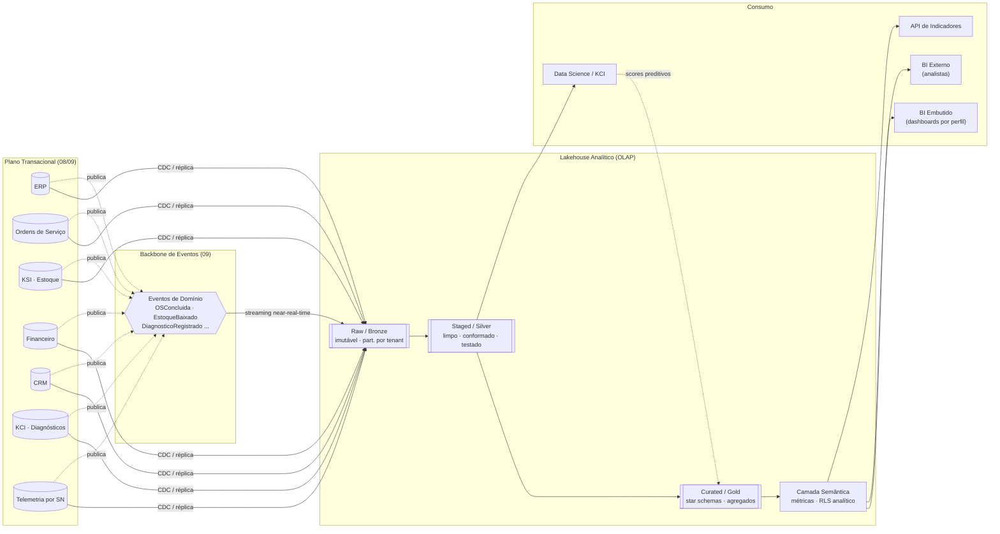
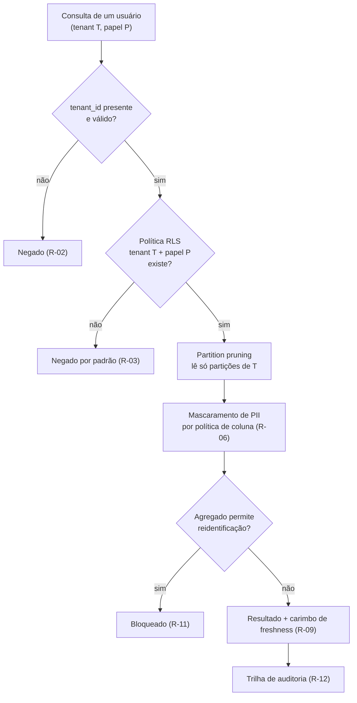
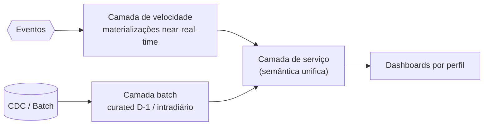
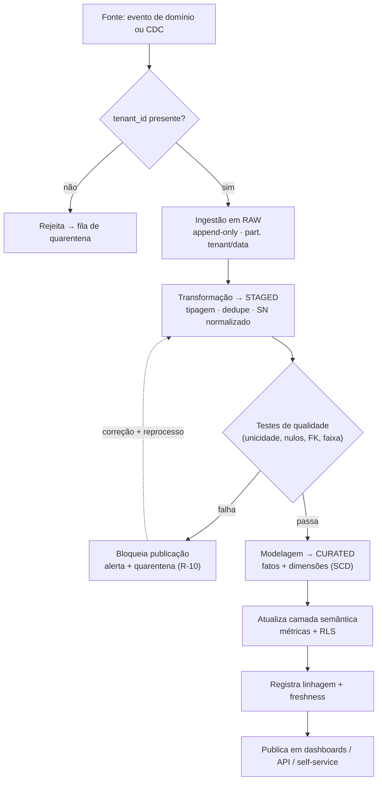
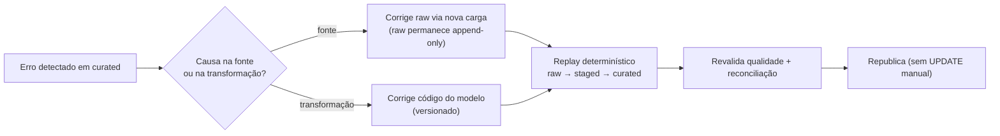
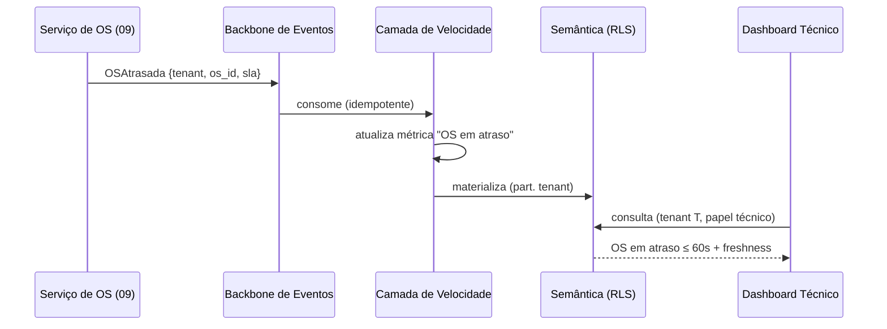
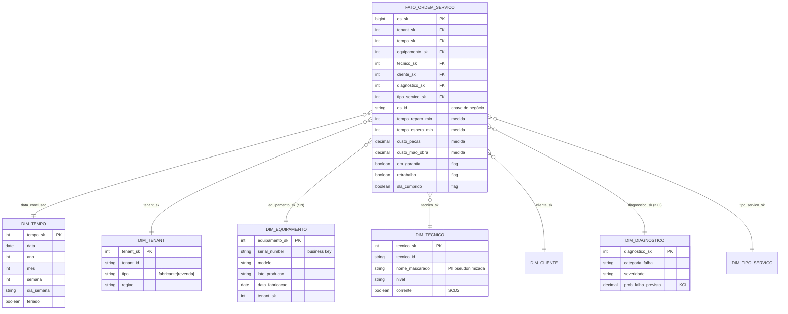
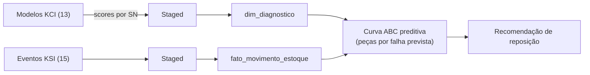

# 16 — Business Intelligence · Drone Kairós ERP

**Documento:** `16 — Business Intelligence`
**Versão:** 1.0 · **Data:** 21 de julho de 2026 · **Status:** Ativo
**Dependências:** `00`, `01`, `02`, `03`, `04`, `05`, `06`, `07`, `08`, `09`, `10`, `11`, `12`, `13`, `14`, `15`
**Responsável:** Especialista BI

---

## 1. Resumo Executivo

Este documento define a **plataforma de Business Intelligence & Analytics** do Drone Kairós ERP: como os dados operacionais gerados pelo ecossistema de drones (ERP, Ordens de Serviço, KSI/estoque, Financeiro, CRM, KCI/diagnósticos e telemetria por Serial Number) são capturados, transformados, modelados e servidos como **indicadores acionáveis por perfil** — fabricante, revenda, técnico, cliente e administrador —, sem jamais violar o princípio constitucional de **multiempresa como cidadã de primeira classe** e **segurança por padrão**.

A tese central é a **separação de planos**: o plano transacional (OLTP, `08`/`09`) permanece otimizado para escrita e consistência; o plano analítico (OLAP) vive em um **lakehouse** próprio, alimentado por **ELT event-driven** a partir do backbone de eventos de domínio (`09`) e por *CDC* (Change Data Capture) dos bancos de serviço. Entre os dois planos há uma fronteira explícita — nenhuma consulta analítica pesada toca o OLTP em produção. O modelo de consumo combina **near-real-time** (métricas operacionais que não podem esperar o *batch*: OS em atraso, ruptura de estoque, alertas KCI) com **batch curado** (indicadores gerenciais, curva ABC, sazonalidade, garantia por lote).

A arquitetura adota **camadas medalhão** (raw → staged → curated), **modelagem dimensional em star schema** na camada de consumo, um **catálogo de dados** com linhagem automatizada e — o requisito não-negociável — **isolamento multiempresa de ponta a ponta**: particionamento físico por `tenant_id` na ingestão, *Row-Level Security analítico* (RLS) na camada semântica e políticas de coluna para PII. Sobre isso se apoiam **dashboards por perfil**, **self-service BI** governado e integrações verticais com **KCI** (indicadores preditivos de falha) e **KSI** (giro e curva ABC).

O documento entrega o **catálogo de KPIs por perfil**, a arquitetura de dados em diagramas Mermaid, o **fluxograma do pipeline** (ingestão → transformação → publicação), um **exemplo completo de modelo dimensional** (star schema de Ordens de Serviço), padrões de governança, avaliação **BI embutido vs. externo**, casos de uso, checklist de prontidão, riscos e trilha de auditoria.

## 2. Objetivos

- **O1.** Definir o **catálogo de KPIs por perfil** com fórmula, granularidade, fonte, frequência e dono de cada métrica — eliminando "números órfãos".
- **O2.** Estabelecer a **arquitetura analítica** (lakehouse, camadas raw/staged/curated, ELT, star schema) desacoplada do plano transacional.
- **O3.** Garantir **isolamento multiempresa** no BI com o mesmo rigor do OLTP: nenhum tenant vê dado de outro, em nenhuma camada, por padrão.
- **O4.** Entregar **near-real-time** para métricas operacionais críticas via consumo dos eventos de domínio, sem sacrificar a consistência do *batch* curado.
- **O5.** Prover **self-service BI governado**: analistas de tenant exploram dados sem escrever SQL bruto e sem furar o isolamento.
- **O6.** Integrar **KCI** (preditivo: probabilidade de falha, MTBF, saúde por SN) e **KSI** (giro, cobertura, curva ABC) como domínios analíticos de primeira classe.
- **O7.** Instituir **governança de dados**: catálogo, glossário de negócio, qualidade (testes), linhagem e trilha de auditoria de acesso a dados.
- **O8.** Decidir a **estratégia de ferramentas** (BI embutido no produto vs. BI externo corporativo) com critérios objetivos e caminho de convivência.

## 3. Escopo

**No escopo:** modelo de camadas do lakehouse; pipelines ELT/CDC e *streaming*; modelagem dimensional (fatos/dimensões, SCD); camada semântica e métricas; RLS analítico e isolamento multiempresa; catálogo, qualidade e linhagem; dashboards por perfil e self-service; integração analítica com KCI e KSI; avaliação de ferramentas (embutido vs. externo); trilha de auditoria de dados.

**Fora do escopo (referência a outros documentos):** modelagem OLTP e estratégia de SN (`08`); contratos de API e catálogo de eventos de domínio (`09`); IAM/RBAC-ABAC e KCD (`07`); motores de ML e *feature engineering* do KCI (`13`); regras de negócio de estoque do KSI (`15`); infraestrutura/IaC, clusters e FinOps de plataforma (`08`/operação). Aqui tratamos do **plano analítico** e de seus contratos de consumo — consumimos os eventos e as tabelas descritas nesses documentos, não os redefinimos.

## 4. Regras

- **R-01. Fronteira OLTP/OLAP.** Nenhuma carga analítica consulta bancos de serviço em produção. A entrada no lakehouse é sempre por evento de domínio ou *CDC* de réplica.
- **R-02. Tenant em toda linha.** Todo registro em toda camada (raw, staged, curated) carrega `tenant_id`. Ausência de `tenant_id` é rejeição na ingestão, não *default*.
- **R-03. RLS analítico "negar por padrão".** A camada semântica nega acesso na ausência de política explícita de tenant + papel. Isolamento não depende de o dashboard "filtrar certo".
- **R-04. Métrica tem dono e definição única.** Todo KPI existe uma vez no catálogo de métricas (camada semântica). Proibido redefinir a mesma métrica em cada dashboard.
- **R-05. Curado é imutável por reprocesso.** A camada *curated* é reconstruível 100% a partir de raw+staged; nunca sofre `UPDATE` manual. Correção = reprocessar.
- **R-06. PII minimizada e mascarada.** Dado pessoal só sobe ao analítico se um KPI exigir; quando sobe, é mascarado/pseudonimizado por política de coluna (LGPD, `08 §11`).
- **R-07. Linhagem obrigatória.** Toda tabela curated e todo KPI têm linhagem rastreável até a fonte. Sem linhagem, não publica.
- **R-08. Contrato de dados versionado.** Mudança de esquema de evento/fonte respeita compatibilidade retroativa; quebra exige nova versão e janela de migração (alinha `09 R-07`).
- **R-09. Freshness declarada.** Todo dashboard/KPI expõe sua **latência de dados** (ex.: "near-real-time ≤ 60 s" ou "batch D-1 04:00"). Número sem carimbo de frescor é proibido.
- **R-10. Qualidade como *gate*.** Nenhuma promoção staged→curated ocorre sem passar nos testes de qualidade (unicidade, não-nulo, integridade referencial, faixa). Falha bloqueia publicação.
- **R-11. Sem exportação que fure isolamento.** Exportações/downloads herdam o RLS do usuário; agregados que permitam reidentificação cruzada entre tenants são bloqueados.
- **R-12. Auditoria de acesso a dado.** Toda consulta a dado sensível e todo acesso administrativo *cross-tenant* (suporte) é registrado em trilha imutável (`§15`).

## 5. Arquitetura (analítica)

### 5.1 Planos e princípios

O sistema opera em **dois planos com contrato explícito entre eles**:

1. **Plano transacional (OLTP)** — bancos por serviço (`08`/`09`), otimizados para escrita/consistência. **Não** é consultado por BI.
2. **Plano analítico (OLAP)** — **lakehouse** próprio, otimizado para varredura, agregação e histórico, com governança e isolamento nativos.

A ponte entre os planos tem **dois caminhos complementares**:

- **Streaming (near-real-time):** o BI é apenas mais um consumidor do **backbone de eventos** (`09`) — `OSConcluida`, `EstoqueBaixado`, `DiagnosticoRegistrado`, `EquipamentoRegistrado`. Latência-alvo de segundos.
- **Batch/CDC (curado):** *Change Data Capture* das réplicas de leitura + cargas incrementais programadas, para consistência e para dimensões de mudança lenta. Latência-alvo D-1 / intradiário.

### 5.2 Camadas do lakehouse (medalhão)

| Camada | Apelido | Conteúdo | Formato/modelo | Consumidor |
|---|---|---|---|---|
| **Raw** (Bronze) | *landing* | Cópia fiel e imutável do evento/registro-fonte, particionada por `tenant_id`/data | Arquivos colunares append-only + tabela de lakehouse (ACID) | Somente pipelines |
| **Staged** (Silver) | *conformed* | Dados limpos, tipados, deduplicados, conformados (chaves de negócio, SN normalizado), testes de qualidade aplicados | Tabelas normalizadas/wide, versionadas | Pipelines, *data scientists* (KCI) |
| **Curated** (Gold) | *serving* | **Star schemas** por domínio, agregados, métricas materializadas, exposição semântica | Modelagem dimensional + camada semântica | Dashboards, self-service, APIs de BI |

- **Raw** é a **fonte de verdade reconstruível**: guarda o dado como chegou, sem interpretação. Retenção longa, custo frio.
- **Staged** aplica **qualidade e conformidade** (R-10): normaliza SN, resolve duplicidade de eventos idempotentes, alinha domínios (status de OS, categorias de estoque).
- **Curated** entrega **modelos dimensionais** e a **camada semântica** onde vivem as métricas (R-04) e o **RLS analítico** (R-03).

### 5.3 Camada semântica e serviço

Sobre a *curated* existe uma **camada semântica** (o "cérebro" do BI): define **métricas versionadas**, **hierarquias** (tempo, geografia, produto, tenant), **relacionamentos** entre fatos e dimensões e — crucialmente — as **políticas de RLS**. Toda ferramenta de consumo (dashboard embutido, BI externo, API de indicadores) atravessa esta camada; **ninguém consulta a curated cru diretamente em produção**. É aqui que "faturamento", "giro de estoque" ou "taxa de retrabalho" ganham uma definição única e auditável.

### 5.4 Isolamento multiempresa no plano analítico

O isolamento é **defesa em profundidade**, replicando no OLAP a filosofia do OLTP (`08 §5`):

1. **Ingestão:** particionamento físico por `tenant_id` (R-02); um evento sem tenant não entra.
2. **Armazenamento:** *partition pruning* garante que consultas de um tenant nem leem arquivos de outro.
3. **Semântica:** **RLS analítico** injeta o predicado de tenant + papel em toda query, "negar por padrão" (R-03).
4. **Exposição:** exportações herdam RLS; agregados reidentificáveis são bloqueados (R-11).
5. **Auditoria:** todo acesso *cross-tenant* (suporte/admin) é registrado (R-12).

> Tenants *enterprise* podem receber **isolamento físico** (schema/catálogo dedicado no lakehouse) como *tier* premium, análogo ao schema dedicado do OLTP (`08 §5.3`).

## 6. Diagramas

### 6.1 Arquitetura de dados (visão macro)



### 6.2 Isolamento multiempresa (defesa em profundidade)



### 6.3 Convivência de latências (Lambda-like)



## 7. Fluxogramas (pipeline de dados)

### 7.1 Pipeline ELT ponta a ponta (ingestão → publicação)



### 7.2 Reprocessamento e correção (imutabilidade da curated · R-05)



### 7.3 Integração near-real-time (alerta operacional)



## 8. Boas Práticas

- **ELT sobre ETL.** Carrega bruto primeiro (raw imutável), transforma dentro do lakehouse com SQL versionado e testável. Reprocesso barato e auditável.
- **Idempotência no consumo.** Todo consumidor de evento é idempotente (chave de deduplicação por `event_id`), espelhando `09 R-06`; *replays* não inflam métricas.
- **Modelagem dimensional na serving.** Star schema (não *snowflake* excessivo) para desempenho de agregação e clareza de negócio; *snowflake* só onde a dimensão exige.
- **SCD explícito.** Dimensões com histórico relevante (cliente, produto, tenant, técnico) usam **Slowly Changing Dimension Tipo 2**; o que só precisa do estado atual usa Tipo 1.
- **Métrica única, muitos gráficos.** Definir a métrica uma vez na semântica (R-04); dashboards são *views*, nunca redefinições.
- **Freshness visível.** Todo painel carimba latência de dados (R-09); "não sei quão fresco" corrói confiança mais que atraso conhecido.
- **Grão declarado.** Cada tabela-fato declara seu **grão** (uma linha = ?) antes de qualquer medida; medidas nunca misturam grãos.
- **PII fora por padrão.** Só sobe PII ao analítico o que um KPI justifica; o resto fica no OLTP (R-06). Pseudonimização preserva `SN`/histórico sem expor a pessoa.
- **Testes de dados como código.** Qualidade versionada junto ao modelo; *pull request* de modelo roda testes de dados (R-10), como teste de software.
- **Contratos de dados.** Fonte e BI acordam esquema versionado (R-08); mudança quebra-contrato não vaza silenciosamente para dashboards.
- **Custo consciente (FinOps analítico).** Particionar e *cluster* por chaves de filtro comuns (tenant, tempo); materializar o que é caro e repetido; expirar raw frio.

## 9. Padrões

- **P-01. Camadas medalhão** (raw/staged/curated) como topologia obrigatória do lakehouse (§5.2).
- **P-02. Star schema** como padrão da camada de serviço; *conformed dimensions* compartilhadas entre fatos (tempo, tenant, produto, SN).
- **P-03. SCD2** para dimensões historicamente sensíveis; chave substituta (*surrogate key*) + `valido_de`/`valido_ate`/`corrente`.
- **P-04. Nomenclatura:** fatos `fato_<processo>` (grão no nome quando útil), dimensões `dim_<entidade>`, agregados `agg_<metrica>_<grão>`, staging `stg_<fonte>`.
- **P-05. Chave de negócio vs. substituta:** SN e IDs de negócio preservados; *joins* dimensionais por *surrogate key*.
- **P-06. RLS analítico declarativo:** política por (tenant, papel) na semântica; nunca filtro hardcoded no dashboard.
- **P-07. Métricas versionadas:** definição de KPI em código, com dono, descrição de negócio e fórmula (catálogo, §11.4).
- **P-08. Linhagem automatizada:** derivada do grafo de transformações; toda coluna curated rastreável à origem (R-07).
- **P-09. Convenção de freshness:** rótulos padronizados — `NRT` (≤ 60 s), `INTRADAY`, `D-1`, `D-7`.
- **P-10. Camada semântica única:** uma definição por métrica alimenta BI embutido, BI externo e API de indicadores (single source of truth).

## 10. Casos de Uso

- **UC-01 — Fabricante, garantia por lote.** Detecta lote de produção com taxa de defeito anômala cruzando OS de garantia + KCI + SN. **Fonte:** OS, KCI, produto/lote. **Freshness:** D-1. **Perfil:** fabricante.
- **UC-02 — Revenda, funil de pós-venda.** Vendas por período + taxa de retorno de garantia + NPS de CRM, isolado ao tenant revenda. **Fonte:** ERP/Financeiro, OS, CRM. **Freshness:** intradiário. **Perfil:** revenda.
- **UC-03 — Técnico, produtividade de OS.** OS concluídas, tempo médio de reparo (MTTR), taxa de retrabalho, backlog em atraso. **Fonte:** OS, KCI. **Freshness:** NRT para "em atraso", D-1 para produtividade. **Perfil:** técnico.
- **UC-04 — Cliente, disponibilidade do equipamento.** Uptime por SN, histórico de manutenção, alertas preditivos KCI do próprio parque. **Fonte:** telemetria, OS, KCI. **Freshness:** NRT. **Perfil:** cliente.
- **UC-05 — Admin, saúde da plataforma.** Volume por tenant, latência de pipeline, *freshness* SLA, uso por módulo, sem violar isolamento (agregados). **Fonte:** metadados de plataforma. **Perfil:** administrador.
- **UC-06 — KSI, curva ABC + giro.** Classifica SKUs A/B/C por valor de saída e calcula giro e cobertura para reposição. **Fonte:** KSI, Financeiro. **Freshness:** D-1. **Perfil:** revenda/fabricante.
- **UC-07 — KCI, risco preditivo agregado.** Distribuição de probabilidade de falha por modelo/lote/tenant, alimentando planejamento de peças (liga KSI). **Fonte:** KCI, KSI. **Freshness:** D-1. **Perfil:** fabricante/técnico.
- **UC-08 — Suporte cross-tenant auditado.** Admin de suporte inspeciona dado de um tenant sob *break-glass*, tudo registrado em trilha imutável (R-12). **Perfil:** administrador (privilegiado).
- **UC-09 — Self-service governado.** Analista de tenant monta relatório novo arrastando métricas certificadas, sem SQL e sem furar RLS. **Perfil:** analista de tenant.

## 11. Modelagem (dimensional + catálogo de KPIs)

### 11.1 Exemplo de modelo dimensional — Star schema de Ordens de Serviço

O processo de negócio "**execução de Ordem de Serviço**" é o coração operacional. Grão do fato: **uma linha por OS concluída** (medidas aditivas por OS).



**Dimensões conformadas** (`dim_tempo`, `dim_tenant`, `dim_equipamento`) são compartilhadas com os fatos de **estoque** (`fato_movimento_estoque`, KSI), **financeiro** (`fato_lancamento`) e **vendas** (`fato_venda`), garantindo que "por SN", "por lote", "por período" e "por tenant" signifiquem o mesmo em todos os domínios (P-02).

### 11.2 DDL ilustrativa da tabela-fato (camada curated)

```sql
-- Grão: 1 linha por Ordem de Serviço concluída
CREATE TABLE curated.fato_ordem_servico (
    os_sk           BIGINT      NOT NULL,              -- surrogate key
    tenant_sk       INT         NOT NULL,              -- isolamento (R-02)
    tempo_sk        INT         NOT NULL,
    equipamento_sk  INT         NOT NULL,              -- SN
    tecnico_sk      INT         NOT NULL,
    cliente_sk      INT         NOT NULL,
    diagnostico_sk  INT,                               -- KCI (pode ser nulo)
    tipo_servico_sk INT         NOT NULL,
    os_id           VARCHAR(32) NOT NULL,              -- business key
    tempo_reparo_min   INT      NOT NULL,
    tempo_espera_min   INT      NOT NULL,
    custo_pecas        NUMERIC(12,2) NOT NULL DEFAULT 0,
    custo_mao_obra     NUMERIC(12,2) NOT NULL DEFAULT 0,
    em_garantia     BOOLEAN     NOT NULL,
    retrabalho      BOOLEAN     NOT NULL,
    sla_cumprido    BOOLEAN     NOT NULL,
    _fonte          VARCHAR(64) NOT NULL,              -- linhagem (R-07)
    _ingestao_ts    TIMESTAMP   NOT NULL,              -- freshness (R-09)
    PRIMARY KEY (os_sk)
)
PARTITION BY (tenant_sk, tempo_sk);                    -- pruning por tenant/tempo
```

### 11.3 Catálogo de KPIs por perfil

Cada KPI declara **fórmula, granularidade, fonte, frescor e dono** (O1, R-04). `NRT` = near-real-time (≤ 60 s); `D-1` = *batch* diário.

**Fabricante — qualidade, garantia e engenharia**

| KPI | Fórmula (resumo) | Grão | Fonte | Frescor |
|---|---|---|---|---|
| Taxa de defeito por lote | OS de garantia do lote ÷ unidades do lote | Lote/modelo | OS, Equipamento | D-1 |
| MTBF por modelo | Σ horas em operação ÷ nº de falhas | Modelo/SN | Telemetria, KCI | D-1 |
| Custo de garantia | Σ (peças + mão de obra) de OS em garantia | Lote/período | OS, Financeiro | D-1 |
| Índice de recall potencial | lotes com defeito > limiar preditivo KCI | Lote | KCI, OS | D-1 |
| Falha prevista vs. realizada | acurácia do preditivo KCI vs. OS efetivas | Modelo | KCI, OS | D-7 |

**Revenda — vendas e pós-venda**

| KPI | Fórmula (resumo) | Grão | Fonte | Frescor |
|---|---|---|---|---|
| Receita de vendas | Σ valor de vendas | Loja/período | ERP, Financeiro | Intraday |
| Ticket médio | receita ÷ nº de vendas | Loja/período | ERP | D-1 |
| Taxa de retorno em garantia | OS de garantia ÷ unidades vendidas | Modelo/período | OS, ERP | D-1 |
| NPS / satisfação | média de pesquisa CRM | Cliente/período | CRM | D-1 |
| Cobertura de estoque | estoque atual ÷ giro médio (KSI) | SKU/loja | KSI | D-1 |

**Técnico — produtividade e OS**

| KPI | Fórmula (resumo) | Grão | Fonte | Frescor |
|---|---|---|---|---|
| OS concluídas | contagem de OS fechadas | Técnico/período | OS | NRT |
| MTTR (tempo médio de reparo) | média de `tempo_reparo_min` | Técnico/tipo | OS | D-1 |
| Taxa de retrabalho | OS reabertas ÷ OS concluídas | Técnico | OS | D-1 |
| Backlog em atraso | OS abertas com SLA estourado | Técnico | OS | NRT |
| Aderência ao SLA | OS com `sla_cumprido` ÷ total | Técnico/tipo | OS | D-1 |

**Cliente — disponibilidade do equipamento**

| KPI | Fórmula (resumo) | Grão | Fonte | Frescor |
|---|---|---|---|---|
| Uptime do equipamento | horas disponíveis ÷ horas totais | SN | Telemetria | NRT |
| Alertas preditivos abertos | contagem de alertas KCI ativos | SN | KCI | NRT |
| Histórico de manutenção | nº e custo de OS por SN | SN/período | OS | D-1 |
| Tempo até próxima manutenção | previsão KCI (RUL) | SN | KCI | D-1 |

**Administrador — saúde da plataforma**

| KPI | Fórmula (resumo) | Grão | Fonte | Frescor |
|---|---|---|---|---|
| Freshness SLA cumprido | pipelines dentro do SLA ÷ total | Pipeline | Metadados | NRT |
| Volume por tenant | eventos/linhas processadas | Tenant/dia | Metadados | D-1 |
| Qualidade de dados | testes aprovados ÷ testes totais | Modelo | Metadados | D-1 |
| Custo analítico por tenant | consumo de compute/armazenamento | Tenant | FinOps | D-1 |
| Acessos cross-tenant | contagem de eventos break-glass | Plataforma | Trilha (§15) | NRT |

### 11.4 Catálogo de dados e glossário de negócio

O **catálogo de dados** indexa toda tabela, coluna, métrica e dashboard, com: descrição de negócio, dono, classificação de sensibilidade (público/interno/PII), **linhagem** (R-07) e frescor (R-09). O **glossário** amarra termos de negócio ("giro", "retrabalho", "em garantia") às métricas da camada semântica, eliminando ambiguidade entre áreas. Cada entrada do catálogo é a fonte para descoberta no **self-service** — o analista encontra a métrica certificada em vez de recriá-la.

### 11.5 Integração KCI (preditivo) e KSI (giro/ABC)

- **KCI → BI.** Os *scores* preditivos (probabilidade de falha, RUL — vida útil remanescente, severidade) produzidos pelos modelos do `13` são **materializados na staged** e projetados em `dim_diagnostico` e em fatos por SN. O BI **consome** o preditivo; não o calcula. Isso alimenta *recall* potencial (fabricante), próxima manutenção (cliente) e priorização de backlog (técnico).
- **KSI → BI.** O `fato_movimento_estoque` (grão: uma linha por movimento) permite calcular **giro** (custo de saída ÷ estoque médio) e **curva ABC** (classificação por valor acumulado de saída). A ligação KCI×KSI é o caso de maior valor: **falha prevista puxa demanda de peça** — o preditivo de KCI, agregado por peça/lote, antecipa a curva de reposição do KSI.



### 11.6 Ferramentas — BI embutido vs. BI externo

Decisão orientada por **quem consome** e **quanto isolamento** o caminho exige.

| Critério | BI Embutido (no produto) | BI Externo (corporativo) |
|---|---|---|
| Público | Todos os perfis, dentro do ERP | Analistas, área de dados |
| Isolamento multiempresa | Nativo (herda RLS da semântica) | Exige integração cuidadosa de RLS |
| Experiência | Contextual, "no fluxo" | Exploração livre, ad-hoc |
| Governança | Total (mesma semântica) | Requer conectar à camada semântica |
| Curva de adoção | Baixa (já no produto) | Média/alta |
| Custo/licenças | Incluso no produto | Licenciamento por usuário |
| Flexibilidade analítica | Média (dashboards curados) | Alta (modelagem própria) |

**Estratégia adotada — convivência:**

1. **BI embutido** é o padrão para os cinco perfis: dashboards por perfil e self-service governado **dentro do ERP**, herdando RLS e semântica automaticamente (isolamento nativo, R-03).
2. **BI externo** é habilitado **para o perfil analista/administrador**, conectado **exclusivamente à camada semântica** (nunca à curated cru), preservando o RLS e o catálogo único de métricas (P-10).
3. **Regra de ouro:** independentemente da ferramenta, a **definição de métrica e a política de isolamento vivem uma única vez na camada semântica**. A ferramenta é intercambiável; a governança não.

## 12. Checklist

- ☑ Fronteira OLTP/OLAP definida; BI consome eventos/CDC, nunca o transacional (R-01).
- ☑ Camadas medalhão (raw/staged/curated) especificadas com dono e formato.
- ☑ `tenant_id` obrigatório em toda camada; particionamento físico por tenant (R-02).
- ☑ RLS analítico "negar por padrão" na camada semântica (R-03).
- ☑ Catálogo de KPIs por perfil com fórmula, grão, fonte, frescor e dono.
- ☑ Star schema de OS entregue (fato + dimensões conformadas + SCD2 + DDL).
- ☑ Pipeline ELT e fluxo de reprocessamento (curated imutável) diagramados.
- ☑ Near-real-time via eventos + batch curado (convivência de latências).
- ☑ Integração KCI (preditivo) e KSI (giro/ABC) modeladas.
- ☑ Estratégia de ferramentas (embutido + externo) decidida com convivência.
- ☑ Governança: catálogo, glossário, qualidade (gate) e linhagem definidos.
- ☐ ADR-0016 (fronteira OLTP/OLAP e escolha de lakehouse) a formalizar.
- ☐ ADR-0017 (RLS analítico e isolamento multiempresa no OLAP) a formalizar.
- ☐ Benchmark de motor de consulta analítica e política de materialização (Fase de operação).
- ☐ SLAs de freshness por dashboard a ratificar com áreas de negócio.

## 13. Riscos

| # | Risco | Impacto | Mitigação |
|---|---|---|---|
| RK-01 | **Vazamento entre tenants no analítico** (agregado ou export reidentificável). | Crítico (confiança/legal) | RLS "negar por padrão" + partition pruning + bloqueio de agregado reidentificável (R-03, R-11) + auditoria (R-12). |
| RK-02 | **Métrica divergente** entre dashboards ("qual número está certo?"). | Alto (credibilidade) | Métrica única na semântica (R-04, P-10); dashboards são views. |
| RK-03 | **BI consultando OLTP** e degradando produção. | Alto (disponibilidade) | Fronteira dura OLTP/OLAP (R-01); ingestão só por evento/CDC. |
| RK-04 | **Dado stale sem sinalização** levando a decisão errada. | Alto | Freshness carimbada em todo KPI (R-09); alerta de SLA de pipeline. |
| RK-05 | **Explosão de custo** do lakehouse (varredura/materialização). | Médio/Alto | Particionamento por tenant/tempo, materialização seletiva, expiração de raw frio (FinOps §8). |
| RK-06 | **PII no analítico** violando LGPD. | Alto (legal) | PII fora por padrão; pseudonimização/mascaramento por coluna (R-06). |
| RK-07 | **Falha de qualidade publicada** (nulos, duplicidade, FK quebrada). | Alto | Qualidade como gate staged→curated (R-10); quarentena e reprocesso. |
| RK-08 | **Preditivo KCI tratado como verdade** sem monitorar acurácia. | Médio | KPI "previsto vs. realizado" (§11.3); BI consome, não decide sozinho. |
| RK-09 | **Reprocessamento inconsistente** (curated alterada à mão). | Médio | Curated imutável (R-05); só replay determinístico (§7.2). |
| RK-10 | **Self-service furando governança** (SQL bruto, joins cross-tenant). | Alto | Self-service só sobre semântica certificada (UC-09); sem acesso à curated crua. |

## 14. Melhorias Futuras

- Formalizar **ADR-0016** (fronteira OLTP/OLAP + escolha de lakehouse) e **ADR-0017** (RLS analítico multiempresa).
- **Data mesh por domínio** conforme a organização escalar: cada domínio (OS, KSI, KCI, Financeiro) como *data product* com dono e SLA próprios.
- **Feature store** compartilhada entre BI e KCI, evitando reengenharia de atributos por SN (integra `13`).
- **Detecção de anomalia automatizada** sobre KPIs (garantia por lote, giro, retrabalho) com alerta proativo.
- **Métricas semânticas via API** para embutir indicadores certificados em qualquer superfície (portal do cliente, app do técnico).
- **Contratos de dados versionados** (schema registry) entre fontes e BI, com quebra bloqueante em CI (R-08).
- **Linhagem em nível de coluna** ponta a ponta e catálogo com busca em linguagem natural.
- **Otimização de custo automatizada** (right-sizing de materializações, tiering de armazenamento por acesso).
- **Data clean rooms** para *benchmarking* anônimo entre tenants opt-in, sem reidentificação (ex.: "seu retrabalho vs. mediana do setor").

## 15. Auditoria

- **Consistência constitucional:** ✔ alinhado aos Artigos de **multiempresa como 1ª classe** (isolamento em toda camada, R-02/R-03), **segurança por padrão** (RLS "negar por padrão", auditoria de acesso), **SN universal** (dimensão conformada de equipamento por Serial Number) e **privacidade/histórico** (PII minimizada, LGPD, R-06).
- **Consistência com o Bible:** ✔ cobre os módulos **KCI** (preditivo) e **KSI** (giro/ABC) como domínios analíticos e as fontes ERP/OS/Financeiro/CRM/Telemetria (`02`).
- **Rastreabilidade de roadmap:** entrega a etapa de **Business Intelligence & Analytics** da plataforma, consumindo os contratos de dados de `08` (modelo OLTP/SN), `09` (eventos de domínio), `13` (KCI) e `15` (KSI).
- **Trilha de auditoria de dados (operacional):** todo acesso a dado sensível, toda exportação e todo acesso *cross-tenant* (break-glass de suporte, UC-08) são registrados em log **imutável e encadeado por hash** (padrão de `08 §11.4`), com quem/quando/qual tenant/qual dado.
- **Pendências abertas:** ADR-0016/0017; benchmark de motor analítico e política de materialização; SLAs de freshness por dashboard a ratificar.
- **Estado:** aprovado como **v1.0**; fornece o catálogo de KPIs, a modelagem dimensional e os contratos de consumo analítico para as camadas de produto (dashboards embutidos), para o BI externo e para a operação (`19`).

---
*Fim do `16 — Business Intelligence` · v1.0*
