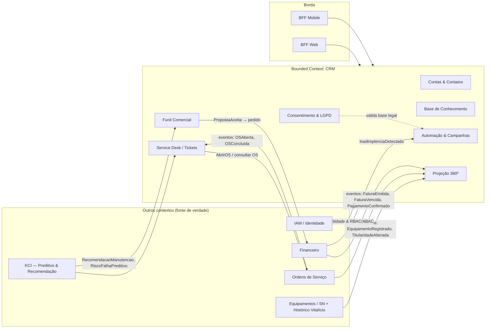
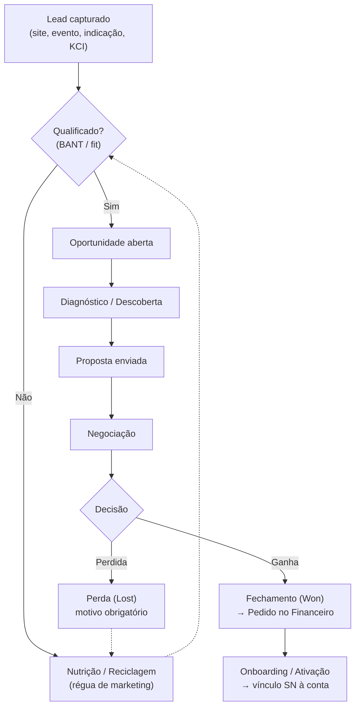
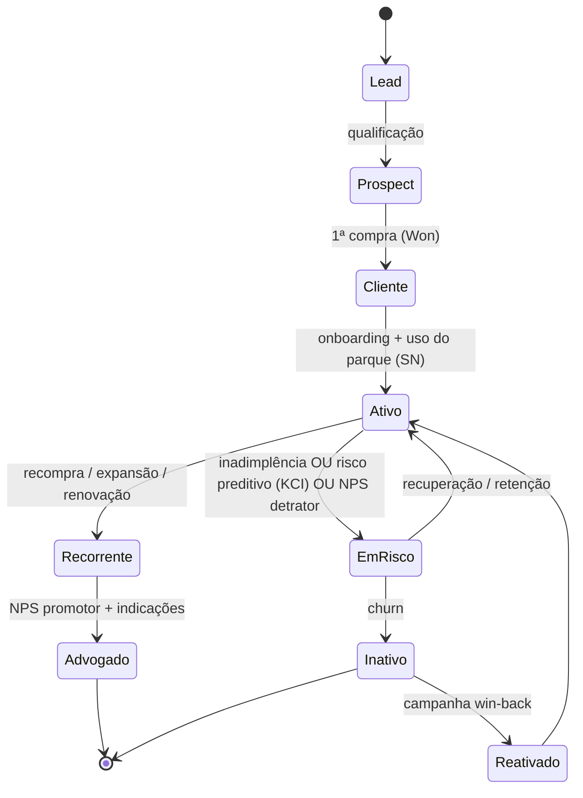
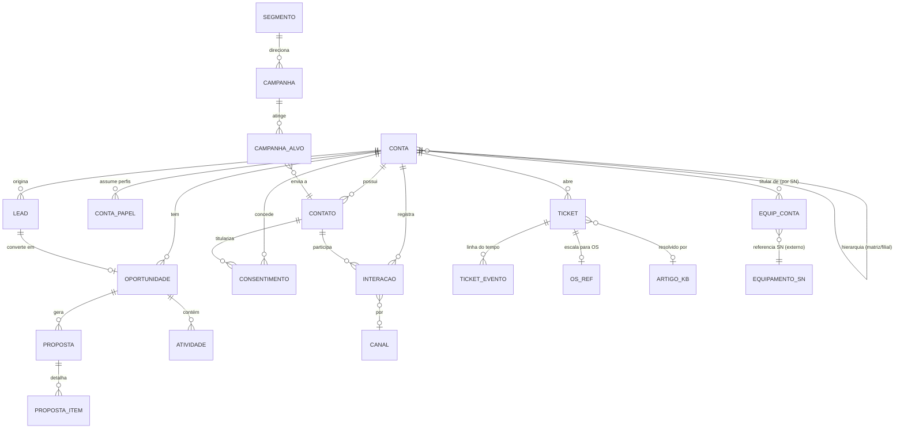
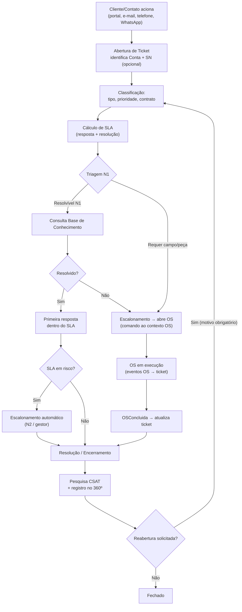
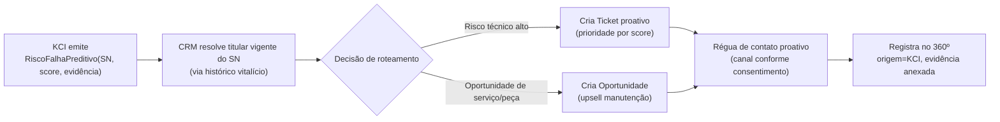
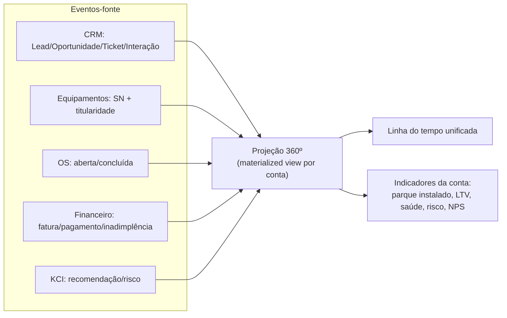

# 17 — CRM · Drone Kairós ERP

**Documento:** `17 — CRM`
**Versão:** 1.0 · **Data:** 21 de julho de 2026 · **Status:** Ativo
**Dependências:** `00` a `16`
**Responsável:** Especialista CRM / Relacionamento

---

## 1. Resumo Executivo

Este documento especifica o **módulo de CRM (Customer Relationship Management)** do Drone Kairós ERP: o *bounded context* responsável por **contas, contatos, funil comercial, pós-venda, histórico 360º, automações de relacionamento e conformidade LGPD** dentro de uma plataforma **multiempresa de primeira classe** para o ecossistema de drones.

O diferencial estratégico do CRM Kairós não é a mecânica genérica de pipeline — é o **acoplamento nativo ao ativo físico rastreado por Serial Number (SN)** e ao **histórico vitalício** do equipamento. No ecossistema de drones, o relacionamento não termina na venda: um drone tem ciclo de vida de anos, atravessa OS (Ordens de Serviço), recalls, atualizações de firmware, sinistros e revendas. O CRM é a camada que transforma essa cadeia de eventos técnicos e financeiros em **relacionamento acionável** — quem é o dono atual, qual a saúde do parque instalado, quando o próximo contato deve acontecer e por qual gatilho.

Três decisões estruturam o módulo:

1. **A conta é multiperfil e o vínculo com o equipamento é por SN, não por venda.** Uma mesma organização pode ser simultaneamente *revenda* (compra do fabricante) e *cliente* (opera frota própria); um SN migra de titularidade sem perder histórico. O CRM projeta o **parque instalado por conta** a partir do histórico vitalício, não a partir de notas fiscais.
2. **Pós-venda e comercial compartilham a mesma linha do tempo 360º.** Ticket, oportunidade, fatura, OS e interação de marketing são eventos sobre a **mesma entidade Conta/Contato**, com correlação por `tenant_id` + `conta_id` + (quando aplicável) `sn`.
3. **Gatilhos de contato são orientados a evento — inclusive preditivos.** O CRM consome sinais do **Financeiro** (inadimplência, renovação) e do **KCI** (Kairós Cognitive Intelligence — recomendações e predição de manutenção) para disparar réguas de relacionamento e criar oportunidades/ tickets automaticamente. Manutenção preditiva vira **motivo de contato comercial e de retenção**, não apenas alerta técnico.

O documento entrega o **modelo de entidades do CRM**, os **diagramas de funil e ciclo de vida**, o **fluxograma de atendimento pós-venda com SLA**, as regras de segmentação e consentimento (LGPD), a matriz de integração com OS/Financeiro/KCI, casos de uso, checklist de prontidão, riscos e trilha de auditoria.

## 2. Objetivos

- **O1.** Modelar **contas e contatos** multiperfil (fabricante, revenda, técnico, cliente final) com hierarquia organizacional e relação com equipamentos por **SN**.
- **O2.** Estruturar o **funil comercial** ponta a ponta: lead → qualificação → oportunidade → proposta → fechamento, com estágios, previsibilidade (*forecast*) e motivos de perda.
- **O3.** Definir o **pós-venda**: tickets/chamados, **SLAs** por prioridade e tipo de contrato, base de conhecimento e **integração bidirecional com OS** (serviço técnico).
- **O4.** Consolidar o **Histórico 360º do cliente**: compras, serviços, equipamentos, faturas e interações em uma linha do tempo única e auditável.
- **O5.** Habilitar **automações de relacionamento**: campanhas segmentadas, réguas de comunicação, pesquisas de NPS/CSAT e nutrição de leads.
- **O6.** Integrar com **Financeiro** (faturas, inadimplência, cobrança) e com o **KCI** (recomendações e preditivo de manutenção como gatilho de contato).
- **O7.** Garantir **segmentação e conformidade LGPD** por padrão: base legal, consentimento granular, finalidade, retenção e direitos do titular.
- **O8.** Preservar os princípios do canon: **multiempresa de 1ª classe**, **segurança/privacidade por padrão** e **rastreabilidade total** por SN.

## 3. Escopo

**No escopo:** gestão de contas/contatos e do relacionamento com equipamentos por SN; funil comercial (leads, oportunidades, propostas, pipeline, forecast); pós-venda (tickets, SLA, base de conhecimento) e sua integração com OS; histórico 360º; automações de marketing/relacionamento (campanhas, réguas, NPS/CSAT); consumo de gatilhos do Financeiro e do KCI; segmentação e conformidade LGPD do módulo; modelo de entidades do CRM.

**Fora do escopo (referência a outros documentos):** execução técnica da Ordem de Serviço, mão de obra, peças e garantia operacional (**Doc de OS**); contabilidade, emissão fiscal, régua de cobrança e conciliação (**Financeiro**); lógica interna do motor KCI/RAG e modelos preditivos (**Docs 13/KCI**); IAM, RBAC/ABAC, criptografia e Zero Trust (**Doc 07/14**); modelagem física, RLS e histórico vitalício no banco (**Doc 08**); contratos de API e eventos de domínio (**Doc 09**); observabilidade e pipelines (**Docs de operação**). Este documento define **entidades, regras e comportamento do relacionamento**; consome os contratos dos módulos citados.

## 4. Regras

| # | Regra (inviolável no módulo CRM) | Origem / Justificativa |
|---|---|---|
| **R-01** | Toda entidade do CRM possui `tenant_id NOT NULL` sob RLS; nenhum dado de relacionamento cruza fronteira de tenant sem trilha de auditoria. | Constituição — multiempresa 1ª classe |
| **R-02** | O vínculo Conta ↔ Equipamento é **por SN e titularidade vigente**, projetado do histórico vitalício — nunca inferido apenas da NF de venda. | Rastreabilidade total (Doc 08) |
| **R-03** | Toda comunicação **outbound** (e-mail, SMS, push, WhatsApp) exige **base legal LGPD válida e registrada** para a finalidade; sem base legal, o envio é bloqueado. | LGPD — Art. 7º/8º |
| **R-04** | Consentimento é **granular por finalidade e canal**, versionado, revogável, com data/hora e origem; opt-out é honrado em ≤ 24h em todos os canais. | LGPD — Art. 8º, §5º / Art. 18 |
| **R-05** | Lead, Oportunidade, Ticket e Interação referenciam a **mesma Conta/Contato**; duplicidade é resolvida por *matching* e *merge* auditado, nunca por cópia silenciosa. | Integridade do 360º |
| **R-06** | Todo Ticket tem **SLA calculado** (resposta e resolução) a partir de prioridade + contrato; violação iminente gera escalonamento automático. | Governança de pós-venda |
| **R-07** | Transições de estágio no funil e de status no ticket são **eventos append-only**; motivo é obrigatório em perda de oportunidade e em reabertura de ticket. | Auditoria (§15) |
| **R-08** | Gatilho de contato originado no **KCI (preditivo)** ou no **Financeiro** cria artefato rastreável (oportunidade/ticket/tarefa) com `origem` e `evidência`, nunca ação anônima. | Explicabilidade / confiança |
| **R-09** | Dados sensíveis do titular seguem **minimização**: coleta-se o necessário à finalidade declarada; campos livres não recebem dado sensível por convenção. | LGPD — minimização |
| **R-10** | Segmentos e campanhas respeitam **isolamento de tenant**; um segmento nunca combina titulares de tenants distintos. | Multiempresa / privacidade |
| **R-11** | Retenção de dados de relacionamento segue política por finalidade; expirado o prazo, aplica-se **anonimização ou descarte** auditado. | LGPD — Art. 15/16 |
| **R-12** | Toda automação (régua/campanha) tem **critério de saída** e *frequency capping*; nenhum contato entra em loop de comunicação. | Boas práticas de relacionamento |

## 5. Arquitetura (do módulo CRM)

### 5.1 Posição no ecossistema

O CRM é um **bounded context** próprio (dono exclusivo de contas, contatos, leads, oportunidades, tickets, campanhas e consentimentos). Ele **não possui** o equipamento, a OS, a fatura nem o modelo preditivo — **consome** esses fatos por API/evento e projeta visões de relacionamento.

### 5.2 Camadas lógicas internas

1. **Domínio de Contas:** contas (org e pessoa física), contatos, papéis/perfis, hierarquia, relação com SN.
2. **Domínio Comercial:** leads, oportunidades, propostas, pipeline, forecast, atividades.
3. **Domínio de Atendimento:** tickets, filas, SLA, base de conhecimento, satisfação (CSAT).
4. **Domínio de Relacionamento:** segmentos, campanhas, réguas, NPS, jornadas.
5. **Domínio de Privacidade:** consentimentos, bases legais, preferências de contato, requisições do titular (DSAR).
6. **Projeção 360º:** *read model* que materializa a linha do tempo do cliente a partir de eventos próprios e externos (CQRS leve).

### 5.3 Padrões de integração

| Interface | Direção | Mecanismo | Exemplos |
|---|---|---|---|
| Equipamentos/SN | Entrada | Evento + consulta | `EquipamentoRegistrado`, `TitularidadeAlterada`; consulta de parque instalado |
| Ordens de Serviço | Bidirecional | Evento + comando | Entrada: `OSAberta`, `OSConcluida`; Saída: `AbrirOS(ticket_id)` |
| Financeiro | Entrada + comando | Evento + comando | Entrada: `FaturaVencida`, `PagamentoConfirmado`; Saída: `GerarPedido(proposta_id)` |
| KCI | Entrada | Evento (recomendação) | `RecomendacaoManutencao`, `RiscoFalhaPreditivo`, `PropensaoUpsell` |
| IAM | Entrada | Token/claims | Identidade, tenant, papéis, atributos ABAC |

> **Regra arquitetural:** o CRM **não escreve** em tabelas de outros contextos. Toda ação transversal (abrir OS, gerar pedido) é **comando** publicado ao contexto dono, com correlação (`traceparent`, `tenant_id`, `conta_id`).

## 6. Diagramas

### 6.1 Funil comercial (pipeline)

### 6.2 Ciclo de vida do cliente (customer lifecycle)

### 6.3 Modelo de entidades do CRM (visão relacional)

> `EQUIPAMENTO_SN` e `OS_REF` são **referências** a contextos externos (Equipamentos e OS); o CRM guarda o identificador (SN / os_id) e uma projeção mínima, não a fonte de verdade.

## 7. Fluxogramas (atendimento pós-venda)

### 7.1 Ciclo de vida do ticket com SLA e integração com OS

### 7.2 Gatilho preditivo (KCI) → contato proativo

## 8. Boas Práticas

- **Conta única, verdade única.** Deduplicação por *matching* determinístico (CNPJ/CPF, e-mail, domínio) + probabilístico; *merge* sempre auditado e reversível.
- **SN como eixo do relacionamento pós-venda.** Sempre que possível, associe o ticket/oportunidade ao SN — isso conecta o atendimento ao histórico vitalício e ao parque instalado.
- **Estágios de funil com critérios de saída objetivos.** Cada estágio tem definição de "pronto para avançar" (*exit criteria*), não avanço por sentimento do vendedor.
- **Forecast por ponderação de probabilidade × estágio**, não por otimismo individual; motivo de perda taxonomizado alimenta melhoria contínua.
- **SLA orientado a contrato.** Prioridade e tipo de contrato (SLA Bronze/Prata/Ouro) determinam metas; *pausas de SLA* (aguardando cliente) são explícitas e auditáveis.
- **Base de conhecimento como ativo vivo.** Todo ticket recorrente vira artigo; artigos alimentam autoatendimento e sugestões de resolução (com apoio do KCI).
- **Automação com respeito ao contato.** *Frequency capping* global por titular, janelas de silêncio, critério de saída e supressão pós-conversão evitam fadiga e reclamação.
- **Privacidade por padrão (privacy by design).** Coleta mínima, finalidade explícita, consentimento verificável antes de qualquer *outbound*; preferências centralizadas e honradas em todos os canais.
- **Proatividade orientada a evidência.** Contato preditivo sempre carrega o "porquê" (evidência do KCI/Financeiro) — aumenta conversão e confiança, reduz percepção de spam.
- **NPS/CSAT fechando o loop.** Detrator gera tarefa de recuperação com dono e prazo; promotor entra em trilha de indicação/advocacy.

## 9. Padrões

### 9.1 Estágios e taxonomias padronizadas

| Domínio | Enumeração padrão |
|---|---|
| Estágio de oportunidade | `Aberta` → `Descoberta` → `Proposta` → `Negociação` → `Ganha` / `Perdida` |
| Motivo de perda | `Preço`, `Concorrência`, `Sem orçamento`, `Sem fit`, `Timing`, `Sem resposta`, `Interno` |
| Prioridade de ticket | `Baixa`, `Média`, `Alta`, `Crítica` (drone parado / risco operacional) |
| Status de ticket | `Novo` → `Em triagem` → `Em andamento` → `Aguardando cliente` → `Escalado (OS)` → `Resolvido` → `Fechado` (+ `Reaberto`) |
| Origem de lead | `Site`, `Evento`, `Indicação`, `Parceiro/Revenda`, `Inbound MKT`, `KCI (preditivo)`, `Base instalada` |
| Base legal LGPD | `Consentimento`, `Execução de contrato`, `Legítimo interesse`, `Obrigação legal`, `Proteção ao crédito` |

### 9.2 SLA de referência (parametrizável por tenant e contrato)

| Prioridade | 1ª resposta (Ouro) | Resolução (Ouro) | 1ª resposta (Prata) | Resolução (Prata) |
|---|---|---|---|---|
| Crítica | 15 min | 4 h | 1 h | 8 h |
| Alta | 1 h | 8 h | 4 h | 24 h |
| Média | 4 h | 24 h | 8 h | 48 h |
| Baixa | 8 h | 48 h | 24 h | 72 h |

> Valores são **defaults de referência**; cada tenant configura suas metas. O relógio de SLA pausa em `Aguardando cliente` e retoma na resposta.

### 9.3 Convenções de dados e eventos

- **Identidade:** `UUID` técnico + chaves naturais para *matching* (CNPJ/CPF/e-mail normalizados).
- **Eventos de domínio (saída):** `LeadCriado`, `OportunidadeGanha`, `OportunidadePerdida`, `TicketAberto`, `TicketResolvido`, `ConsentimentoConcedido`, `ConsentimentoRevogado` — versionados e com `tenant_id`.
- **Correlação:** todo artefato transporta `tenant_id`, `conta_id`, `traceparent` e, quando aplicável, `sn` e `os_id`.
- **Nomenclatura:** eventos no passado (fato ocorrido); comandos no imperativo (`AbrirOS`, `GerarPedido`).

## 10. Casos de Uso

| ID | Ator | Cenário | Resultado esperado |
|---|---|---|---|
| **UC-01** | Vendedor (revenda) | Captura um lead de feira e qualifica por fit e orçamento. | Lead vira oportunidade com estágio, valor e probabilidade; atividades agendadas. |
| **UC-02** | Vendedor | Envia proposta de 3 drones + contrato de manutenção. | Proposta versionada com itens; ao aceitar, comando `GerarPedido` ao Financeiro. |
| **UC-03** | Sistema (onboarding) | Pedido faturado e equipamentos registrados. | `TitularidadeAlterada`/`EquipamentoRegistrado` vinculam SNs à conta no parque instalado. |
| **UC-04** | Cliente final | Abre chamado: drone não liga (crítico). | Ticket crítico com SLA de 15 min; triagem N1; escala para OS se necessário. |
| **UC-05** | Técnico | Resolve OS e conclui serviço. | `OSConcluida` atualiza o ticket e a linha do tempo 360º; dispara CSAT. |
| **UC-06** | KCI | Detecta desgaste preditivo em SN sob garantia. | CRM identifica titular vigente e cria oportunidade de manutenção + ticket proativo. |
| **UC-07** | Financeiro | Fatura vence sem pagamento. | `FaturaVencida` marca conta `EmRisco`; régua de cobrança relacional (não abusiva) inicia. |
| **UC-08** | Marketing | Cria campanha para promotores do NPS com base instalada > 5 SNs. | Segmento respeita consentimento e isolamento de tenant; campanha com critério de saída. |
| **UC-09** | Titular de dados | Solicita exclusão/portabilidade (DSAR). | Requisição registrada, prazo LGPD acompanhado; anonimização/descarte auditado. |
| **UC-10** | Gestor comercial | Analisa forecast e motivos de perda do trimestre. | Pipeline ponderado, taxa de conversão por estágio e taxonomia de perda. |
| **UC-11** | Atendente N2 | SLA de ticket em risco. | Escalonamento automático para gestor com alerta e reatribuição. |
| **UC-12** | Fabricante | Comunica recall de um lote (SNs específicos). | CRM resolve titulares vigentes dos SNs e dispara campanha/ticket de recall rastreado. |

## 11. Modelagem (entidades CRM)

### 11.1 Dicionário de entidades

| Entidade | Descrição | Atributos-chave |
|---|---|---|
| **Conta** | Organização ou pessoa que se relaciona com o tenant. | `id`, `tenant_id`, `tipo (PJ/PF)`, `razao_social/nome`, `documento`, `status_ciclo_vida`, `conta_pai_id` |
| **Conta_Papel** | Perfis assumidos pela conta (n:n). | `conta_id`, `papel (fabricante/revenda/tecnico/cliente)`, `vigencia` |
| **Contato** | Pessoa física vinculada a uma conta. | `id`, `conta_id`, `nome`, `email`, `telefone`, `cargo`, `is_titular_dados` |
| **Equip_Conta** | Vínculo de titularidade Conta ↔ SN (projeção). | `conta_id`, `sn`, `desde`, `ate`, `origem (venda/transferência)` |
| **Lead** | Interesse não qualificado. | `id`, `tenant_id`, `origem`, `status`, `conta_id?`, `score` |
| **Oportunidade** | Negócio em andamento. | `id`, `conta_id`, `estagio`, `valor`, `probabilidade`, `previsao_fechamento`, `motivo_perda?` |
| **Proposta** | Oferta formal versionada. | `id`, `oportunidade_id`, `versao`, `status`, `validade`, `valor_total` |
| **Proposta_Item** | Linha da proposta (drone/serviço/contrato). | `proposta_id`, `sku`, `qtd`, `preco`, `sn?` |
| **Ticket** | Chamado de pós-venda. | `id`, `conta_id`, `contato_id`, `sn?`, `tipo`, `prioridade`, `status`, `sla_resposta_em`, `sla_resolucao_em`, `os_id?` |
| **Ticket_Evento** | Linha do tempo append-only do ticket. | `ticket_id`, `tipo`, `autor`, `timestamp`, `payload` |
| **Artigo_KB** | Artigo da base de conhecimento. | `id`, `titulo`, `categoria`, `conteudo`, `visibilidade`, `versao` |
| **Interacao** | Toque de relacionamento (qualquer canal). | `id`, `conta_id`, `contato_id?`, `canal`, `direcao`, `origem`, `timestamp`, `sn?` |
| **Segmento** | Público-alvo dinâmico ou estático. | `id`, `tenant_id`, `criterios`, `tipo`, `base_legal` |
| **Campanha** | Ação de relacionamento/marketing. | `id`, `segmento_id`, `canal`, `objetivo`, `criterio_saida`, `janela` |
| **Consentimento** | Registro de base legal por finalidade/canal. | `id`, `contato_id`, `finalidade`, `canal`, `base_legal`, `status`, `versao`, `concedido_em`, `revogado_em?` |
| **NPS_Resposta** | Resultado de pesquisa NPS/CSAT. | `id`, `conta_id`, `contato_id`, `tipo`, `nota`, `comentario`, `origem_evento` |

### 11.2 Projeção 360º (read model)

A visão 360º **não é uma tabela transacional**; é um *read model* materializado por CQRS leve, alimentado por eventos próprios (leads, oportunidades, tickets, interações) e externos (equipamentos/SN, OS, faturas, KCI). Chaveamento por `tenant_id` + `conta_id`, com facetas por `sn`.

### 11.3 Multiperfil e titularidade por SN (nota de modelagem)

Uma conta pode acumular papéis simultâneos (`Conta_Papel` n:n) — por exemplo, uma revenda que também opera frota própria. A titularidade de um SN é **temporal** (`Equip_Conta.desde/ate`): quando o histórico vitalício emite `TitularidadeAlterada`, o CRM fecha o vínculo anterior e abre o novo, **preservando** todo o histórico de relacionamento associado ao SN — recalls, tickets e recomendações permanecem rastreáveis pelo eixo do equipamento.

## 12. Checklist

**Contas & Contatos**
- [ ] Conta com `tenant_id`, tipo, documento normalizado e status de ciclo de vida.
- [ ] Deduplicação/*matching* configurado; *merge* auditável e reversível.
- [ ] Papéis (fabricante/revenda/técnico/cliente) e hierarquia matriz/filial.
- [ ] Parque instalado projetado por SN a partir do histórico vitalício.

**Funil comercial**
- [ ] Estágios com critérios de saída objetivos e forecast ponderado.
- [ ] Motivo de perda obrigatório e taxonomizado.
- [ ] Proposta versionada; `PropostaAceita` → comando ao Financeiro.

**Pós-venda**
- [ ] SLA por prioridade × contrato, com pausa "aguardando cliente".
- [ ] Escalonamento automático em risco de SLA.
- [ ] Integração bidirecional com OS (abrir OS / receber `OSConcluida`).
- [ ] Base de conhecimento versionada + CSAT no fechamento.

**Relacionamento & Automação**
- [ ] Segmentos isolados por tenant; campanhas com critério de saída e *frequency capping*.
- [ ] Réguas de NPS/CSAT com tarefa de recuperação para detratores.

**Integrações**
- [ ] Consumo de `FaturaVencida`/`InadimplenciaDetectada` (Financeiro).
- [ ] Consumo de `RiscoFalhaPreditivo`/`RecomendacaoManutencao` (KCI) com evidência anexada.

**LGPD & Segurança**
- [ ] Base legal por finalidade/canal registrada antes de qualquer *outbound*.
- [ ] Consentimento granular, versionado e revogável; opt-out ≤ 24h.
- [ ] Política de retenção/anonimização por finalidade.
- [ ] RLS por `tenant_id` e trilha de auditoria em toda mutação sensível.

## 13. Riscos

| # | Risco | Impacto | Prob. | Mitigação |
|---|---|---|---|---|
| **RK-01** | Duplicidade de contas fragmenta o 360º e o forecast. | Alto | Média | *Matching* determinístico+probabilístico; *merge* auditado; bloqueio de criação com alerta de similaridade. |
| **RK-02** | Envio *outbound* sem base legal válida (violação LGPD). | Crítico | Média | Gate de consentimento por finalidade/canal; bloqueio automático; auditoria de todo envio. |
| **RK-03** | SLA calculado incorretamente (contrato mal mapeado). | Alto | Média | Motor de SLA parametrizável testado; *pausas* explícitas; alertas de configuração. |
| **RK-04** | Titularidade de SN desatualizada gera contato ao dono errado. | Alto | Baixa | Sincronização por evento `TitularidadeAlterada`; resolução sempre do vínculo vigente. |
| **RK-05** | Automação em loop / fadiga de comunicação (fadiga → churn/reclamação). | Médio | Média | *Frequency capping* global, janelas de silêncio, supressão pós-conversão, critério de saída obrigatório. |
| **RK-06** | Vazamento entre tenants em segmentos/campanhas. | Crítico | Baixa | RLS + testes de isolamento; segmento nunca combina tenants; revisão de queries. |
| **RK-07** | Gatilho preditivo (KCI) com falso positivo gera contato indevido. | Médio | Média | Limiar de score configurável; evidência exigida; feedback loop para recalibrar o KCI. |
| **RK-08** | Dado sensível em campo livre (violação de minimização). | Médio | Média | Convenção anti-dado-sensível; *masking* e varredura; treinamento e validação de formulário. |
| **RK-09** | Cobrança relacional agressiva prejudica relacionamento. | Médio | Média | Régua de inadimplência escalonada e respeitosa; separação clara entre cobrança e relacionamento. |
| **RK-10** | DSAR (direitos do titular) não atendido no prazo. | Alto | Baixa | Fluxo DSAR com SLA legal, dono e trilha; painel de acompanhamento. |

## 14. Melhorias Futuras

- **Next Best Action orientado por KCI:** recomendação da próxima melhor ação de relacionamento por conta (contato, oferta, retenção) com explicabilidade.
- **Health Score da conta:** índice composto (uso do parque, tickets, NPS, inadimplência, risco preditivo) para priorizar Customer Success.
- **Copiloto de atendimento:** sugestão de resposta e de artigo de KB ao atendente, com resumo automático do ticket (sem exposição de dado sensível).
- **Modelagem de propensão (upsell/churn):** scores preditivos alimentando segmentação dinâmica.
- **Portal de autoatendimento** com base de conhecimento + abertura/consulta de tickets e status de OS por SN.
- **Orquestração de jornadas** multicanal visual (canvas) com testes A/B e *holdout* para medir incremento.
- **Central de preferências do titular** self-service, com histórico de consentimento e exportação de dados (portabilidade LGPD).
- **Attribution de receita** ligando campanhas → oportunidades → pedidos faturados no Financeiro.

## 15. Auditoria

- **Trilha imutável (append-only):** toda transição de estágio de oportunidade, mudança de status de ticket, *merge* de conta, concessão/revogação de consentimento e envio *outbound* é registrada com `quem`, `quando`, `de→para`, `motivo` e `traceparent`.
- **Rastreabilidade de origem:** artefatos criados por gatilho (KCI/Financeiro) carregam `origem` e `evidência`; nenhuma ação automática é anônima (R-08).
- **Auditoria de consentimento:** cada envio referencia o `consentimento_id`/base legal vigente no momento; revogações são honradas e auditadas; opt-out rastreado por canal.
- **Isolamento multiempresa:** logs segregados por `tenant_id`; qualquer acesso cross-tenant (suporte/admin) é registrado e justificado.
- **Retenção e descarte:** eventos de anonimização/descarte por expiração de finalidade são auditáveis, com prova de execução.
- **Métricas de governança:** taxa de violação de SLA, tempo de atendimento a DSAR, cobertura de base legal em *outbound*, taxa de duplicidade e reversões de *merge* — reportadas periodicamente ao responsável pelo módulo e ao encarregado (DPO).
- **Reprodutibilidade:** a projeção 360º pode ser reconstruída a partir dos eventos-fonte, garantindo que a linha do tempo apresentada seja verificável.

---

**Fim do documento `17 — CRM`.** Este documento define entidades, regras e comportamento de relacionamento; a execução técnica (OS), a contabilidade/cobrança (Financeiro), o motor preditivo (KCI), a identidade (IAM) e a persistência (Banco de Dados) são governados por seus respectivos documentos e consumidos por contrato.
