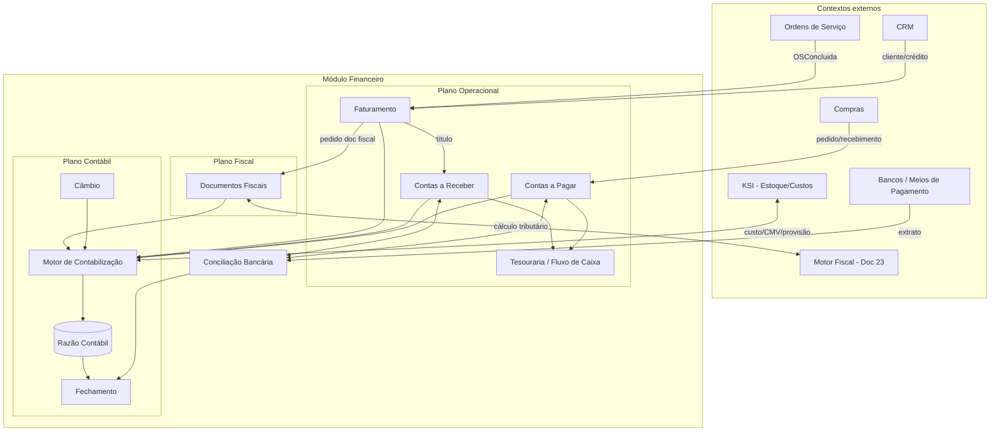
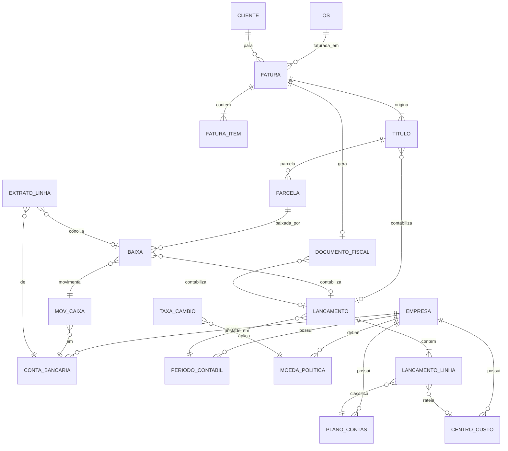
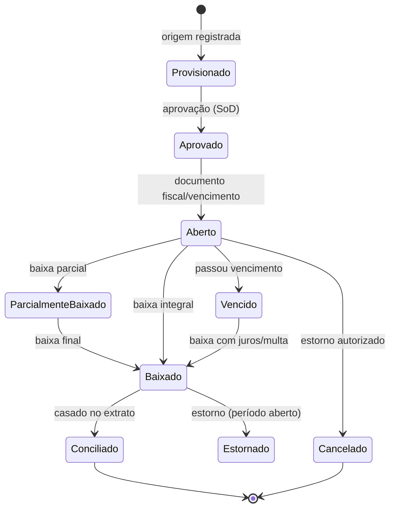
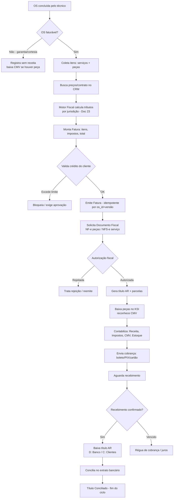
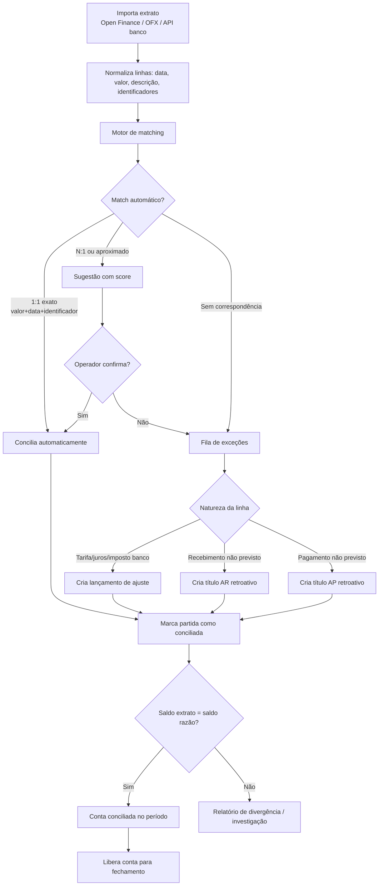
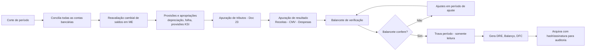
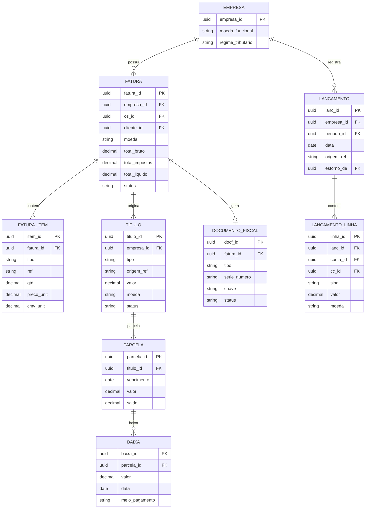

# 18 — Financeiro · Drone Kairós ERP

**Documento:** `18 — Financeiro`
**Versão:** 1.0 · **Data:** 21 de julho de 2026 · **Status:** Ativo
**Dependências:** `00`, `01`, `02`, `03`, `04`, `05`, `06`, `07`, `08`, `09`, `10`, `11`, `12`, `13`, `14`, `15`, `16`, `17`
**Responsável:** Especialista Financeiro/ERP

---

## 1. Resumo Executivo

Este documento define o **módulo Financeiro** do Drone Kairós ERP: o núcleo transacional e contábil que transforma eventos operacionais (ordens de serviço concluídas, recebimentos de compra, movimentações de estoque) em **títulos, lançamentos, obrigações fiscais e caixa**, com rastreabilidade ponta a ponta e conformidade auditável.

O Financeiro do Kairós é concebido sob os princípios do canon: **multiempresa de 1ª classe** (cada `empresa_id`/`tenant_id` possui seu próprio plano de contas, política de câmbio, calendário fiscal e caixa, sem vazamento entre empresas), **segurança e auditoria por padrão** (todo lançamento é imutável e rastreável até seu documento de origem) e **rastreabilidade** (todo valor financeiro reconstrói sua cadeia causal: OS → faturamento → título → recebimento → conciliação → lançamento contábil).

A arquitetura separa três planos com responsabilidades distintas: o **plano operacional** (contas a pagar/receber, tesouraria, faturamento), o **plano fiscal** (emissão de documentos fiscais — NF-e/NFS-e no Brasil, com abstração para outras jurisdições) e o **plano contábil** (partidas dobradas, plano de contas, centros de custo, apuração de resultado). O princípio-guia é o **razão como fonte da verdade contábil**: nenhum saldo é editado diretamente; todo estado deriva do somatório de lançamentos imutáveis.

A integração com o **KSI (Kairós Smart Inventory)** é tratada como cidadã de primeira classe: valorização de estoque (custo médio ponderado ou PEPS), reconhecimento de **CMV** (Custo da Mercadoria/Peça Vendida) no faturamento de peças da OS, e provisões. A **multi-moeda** é entregue como capacidade estrutural (moeda funcional por empresa, moeda de transação, moeda de apresentação) preparada para o roadmap internacional. O detalhamento de **conformidade fiscal por região** é delegado ao Doc 23; aqui definimos a *abstração* que o torna plugável.

Entregas deste documento: modelo de entidades financeiras, diagramas Mermaid (faturamento a partir da OS, conciliação bancária, ciclo de fechamento), fluxogramas operacionais, catálogo de regras, casos de uso, checklist de prontidão, matriz de riscos e trilha de auditoria.

## 2. Objetivos

- **O1.** Estabelecer os ciclos completos de **Contas a Pagar (AP)** e **Contas a Receber (AR)**, do documento de origem à baixa e à conciliação.
- **O2.** Definir **fluxo de caixa** (realizado e projetado) e **tesouraria** (posição consolidada, aplicações, previsões) por empresa e consolidada.
- **O3.** Modelar o **faturamento** de serviços e peças a partir das **Ordens de Serviço**, com geração de documentos fiscais abstraídos por jurisdição.
- **O4.** Especificar **conciliação bancária** e integração com bancos/meios de pagamento (Open Finance, extratos, PIX, boleto, cartão, gateways).
- **O5.** Definir o **núcleo contábil**: plano de contas, partidas dobradas, centros de custo, lançamentos e apuração de resultado.
- **O6.** Formalizar a **integração com o KSI**: valorização de estoque (custo médio/PEPS), CMV, provisões e movimentos contábeis de estoque.
- **O7.** Prover a **abstração fiscal e tributária** (motor de regras plugável por região), com o detalhe de conformidade delegado ao Doc 23.
- **O8.** Entregar a **visão de multi-moeda e câmbio** (moeda funcional, transação, apresentação; reavaliação e variação cambial).
- **O9.** Garantir **controles, auditoria e fechamento** (segregação de funções, imutabilidade, períodos, trilha completa).

## 3. Escopo

**No escopo:** contas a pagar e receber; fluxo de caixa e tesouraria; faturamento de OS (serviços e peças); documentos fiscais (NF-e/NFS-e no Brasil, abstração internacional); conciliação bancária e integração com bancos/meios de pagamento; plano de contas, centros de custo e lançamentos contábeis; integração financeira com KSI (valorização, CMV, provisões); abstração de impostos e regras fiscais; visão de multi-moeda e câmbio; fechamento contábil e trilha de auditoria financeira.

**Fora do escopo (referência a outros documentos):** modelagem de dados global e schemas físicos (Doc 08); arquitetura de microsserviços e eventos de domínio (Doc 09); IAM/segurança detalhada, papéis e KCD (Doc 07); mecânica interna do KSI — códigos de barras, RFID, curva ABC, reposição (Doc 15); **conformidade fiscal por jurisdição** — cálculo detalhado de ICMS/ISS/PIS/COFINS/IRPJ/CSLL, layouts de SPED, regras por município/estado/país (Doc 23); BI/relatórios gerenciais e DRE analítica (Doc de BI). Aqui tratamos das **entidades, ciclos e interfaces financeiras**, não da implementação regulatória por região.

## 4. Regras

- **R1. Partida dobrada obrigatória.** Todo lançamento contábil tem débito(s) e crédito(s) de igual valor na moeda funcional; um lançamento desbalanceado é rejeitado na persistência.
- **R2. Razão imutável.** Lançamentos contábeis não são editados nem apagados; correções ocorrem por **estorno** (lançamento reverso) e novo lançamento, ambos rastreáveis.
- **R3. Multiempresa isolada.** Todo título, lançamento, conta bancária e documento fiscal carrega `empresa_id`/`tenant_id`; consultas sem esse filtro são erro de contrato. Plano de contas, calendário fiscal e política de câmbio são por empresa.
- **R4. Origem rastreável.** Todo título financeiro referencia seu **documento de origem** (OS, pedido de compra, contrato, lançamento manual justificado). Nenhum recebível/pagável nasce órfão.
- **R5. Idempotência de faturamento.** A conclusão de uma OS gera **no máximo um** faturamento por evento; reprocessamento usa chave de idempotência (`os_id` + versão) e nunca duplica títulos.
- **R6. Reconhecimento no momento correto.** Receita e CMV são reconhecidos no faturamento (regime de competência); o caixa é reconhecido na baixa (regime de caixa para fluxo). Os dois planos coexistem sem se contaminar.
- **R7. Período aberto para escrita.** Lançamentos só ocorrem em **período contábil aberto**. Período fechado é somente leitura; ajustes exigem período de ajuste explícito e autorizado.
- **R8. Conciliação antes do fechamento.** Nenhum período é fechado com conta bancária não conciliada ou com partidas em suspenso não resolvidas.
- **R9. Segregação de funções (SoD).** Quem cadastra um pagável não o aprova; quem aprova não executa a baixa bancária. Papéis são disjuntos por política (ver Doc 07).
- **R10. Moeda explícita.** Todo valor monetário carrega moeda e, quando de transação estrangeira, a **taxa de câmbio** aplicada e sua data/fonte. Não há valor sem moeda.
- **R11. Impostos por motor de regras.** Nenhum imposto é *hardcoded*; todo cálculo passa pelo **motor fiscal** parametrizado por jurisdição (Doc 23). O Financeiro consome o resultado, não o codifica.
- **R12. Valorização consistente com KSI.** O custo de peça vendida (CMV) usa a **mesma** política de valorização do KSI (custo médio ou PEPS) vigente na empresa; divergência entre estoque e contábil é reconciliada e alertada.
- **R13. Auditoria total.** Toda ação financeira (criar, aprovar, baixar, estornar, conciliar, fechar) gera evento de auditoria imutável com ator, timestamp, valor antes/depois e correlação (`traceparent`).
- **R14. Casas decimais e arredondamento.** Valores monetários com precisão definida por moeda (2 casas para BRL/USD/EUR); arredondamento **bankers rounding** ou meio-para-cima conforme política da empresa, aplicado de forma determinística e registrada.

## 5. Arquitetura (do módulo financeiro)

### 5.1 Planos lógicos

O Financeiro organiza-se em três planos com contratos claros entre si:

1. **Plano Operacional** — Contas a Pagar, Contas a Receber, Tesouraria/Fluxo de Caixa, Faturamento. Trabalha com **títulos** (obrigações e direitos) e **movimentos de caixa**.
2. **Plano Fiscal** — Emissão e gestão de documentos fiscais (NF-e/NFS-e/abstração), cálculo tributário via motor de regras, obrigações acessórias. Consome o motor fiscal do Doc 23.
3. **Plano Contábil** — Razão (ledger) de partidas dobradas, plano de contas, centros de custo, apuração e fechamento. É a **fonte da verdade contábil**.

O acoplamento entre planos é por **eventos** e **postagem contábil** (posting): eventos operacionais geram títulos; a baixa/emissão gera **regras de contabilização** que produzem lançamentos no razão. O razão nunca é editado diretamente pelos planos superiores.

### 5.2 Componentes do módulo

| Componente | Responsabilidade nuclear | Consome | Produz |
|---|---|---|---|
| **Faturamento** | Converter OS concluída em fatura (serviços + peças) | Evento `OSConcluida` (Doc 09), preços, motor fiscal | Fatura, título AR, pedido de documento fiscal |
| **Contas a Receber (AR)** | Gerir direitos, cobrança, baixa | Faturas, meios de pagamento | Títulos AR, baixas, eventos de recebimento |
| **Contas a Pagar (AP)** | Gerir obrigações, aprovação, pagamento | Pedidos de compra (Compras), notas de entrada | Títulos AP, baixas, remessas de pagamento |
| **Tesouraria/Fluxo de Caixa** | Posição de caixa, projeção, aplicações | Títulos AR/AP, extratos | Fluxo realizado/projetado, previsões |
| **Documentos Fiscais** | Emitir/receber/gerir NF-e/NFS-e (abstraído) | Faturas, motor fiscal (Doc 23) | Documentos fiscais autorizados, XMLs/DANFE |
| **Conciliação Bancária** | Casar extrato ↔ títulos/lançamentos | Extratos (Open Finance/OFX), títulos | Partidas conciliadas, ajustes |
| **Motor de Contabilização** | Traduzir eventos financeiros em lançamentos | Eventos AR/AP/estoque/fiscal, regras de posting | Lançamentos no razão |
| **Razão Contábil (Ledger)** | Guardar partidas dobradas imutáveis | Lançamentos | Saldos, balancetes, DRE, balanço |
| **Câmbio** | Cotações, reavaliação, variação cambial | Fontes de cotação | Taxas, lançamentos de variação |
| **Fechamento** | Orquestrar apuração e travamento de período | Todos os planos | Período fechado, apurações |

### 5.3 Contexto e integrações externas

O Financeiro é um **bounded context** que se integra a outros contextos do ERP exclusivamente por API e eventos (nunca por banco compartilhado — R2/R3 do Doc 09):

- **KSI (Estoque/Custos):** fornece custo de peça e movimentos; recebe reconhecimento de CMV e provisões. Ver §5.4 e §11.
- **Compras:** origem dos pagáveis (pedido → recebimento → nota de entrada → título AP).
- **Ordens de Serviço:** origem dos recebíveis (OS concluída → faturamento).
- **CRM:** cliente/contato, condições comerciais, limite de crédito.
- **Motor Fiscal (Doc 23):** cálculo tributário e conformidade por região.
- **Bancos/Meios de Pagamento:** extratos, PIX, boleto, cartão, gateways, Open Finance.

### 5.4 Princípio de contabilização orientada a evento

Cada fato financeiro relevante emite um **evento de domínio** versionado (alinhado ao Doc 09), consumido pelo Motor de Contabilização com **outbox + idempotência**:

| Evento | Efeito operacional | Efeito contábil (posting) |
|---|---|---|
| `FaturaEmitida` | Cria título AR | D: Clientes / C: Receita de Serviços + Receita de Peças; C: Impostos a Recolher |
| `PecaFaturada` (via OS) | Baixa estoque no KSI | D: CMV / C: Estoque (pela política de valorização) |
| `RecebimentoConfirmado` | Baixa título AR | D: Banco / C: Clientes |
| `PagavelAprovado` | Cria/confirma título AP | D: Despesa/Estoque / C: Fornecedores |
| `PagamentoExecutado` | Baixa título AP | D: Fornecedores / C: Banco |
| `NotaEntradaRegistrada` | Entrada de estoque (KSI) | D: Estoque + Impostos a Recuperar / C: Fornecedores |
| `PeriodoReavaliado` (câmbio) | Reavaliação de saldos em ME | D/C: Variação Cambial (ativo/passivo) |

## 6. Diagramas

### 6.1 Arquitetura do módulo (planos e integrações)



### 6.2 Modelo de entidades financeiras (ER)



### 6.3 Máquina de estados do título (AR/AP)



## 7. Fluxogramas (OS → faturamento → recebimento)

### 7.1 Faturamento a partir da Ordem de Serviço



### 7.2 Conciliação bancária



### 7.3 Ciclo de fechamento contábil



## 8. Boas Práticas

- **BP1. Razão como fonte da verdade.** Saldos são derivados, nunca armazenados como estado mutável autoritativo; qualquer saldo materializado é cache reconstruível a partir dos lançamentos.
- **BP2. Contabilização declarativa.** Regras de *posting* (qual conta debitar/creditar por tipo de evento) são configuração versionada, não código espalhado. Facilita auditoria e mudança de plano de contas.
- **BP3. Idempotência em todo ponto de integração.** Faturamento, baixa e conciliação usam chaves de idempotência; reprocessos são seguros por design (essencial em event-driven — Doc 09).
- **BP4. Reconciliação estoque ↔ contábil contínua.** A conta contábil de estoque é confrontada periodicamente com a valorização do KSI; divergências geram alerta antes do fechamento, não depois.
- **BP5. Multi-moeda desde o núcleo.** Mesmo operando só em BRL hoje, todo valor carrega moeda e taxa; retrofit de multi-moeda em ERP é caro e propenso a erro.
- **BP6. Precisão monetária correta.** Usar tipo decimal de precisão fixa (nunca ponto flutuante binário) para dinheiro; arredondamento determinístico e registrado por moeda.
- **BP7. Segregação de funções aplicada por política.** SoD não é convenção verbal; é regra de autorização (Doc 07) que o sistema recusa violar.
- **BP8. Documento fiscal desacoplado do faturamento.** A fatura existe mesmo se a autorização fiscal falhar temporariamente; a emissão do documento fiscal é assíncrona e resiliente (retry, contingência).
- **BP9. Régua de cobrança automatizada.** Vencimentos disparam ações graduais (lembrete, notificação, protesto/negativação conforme política), reduzindo inadimplência sem intervenção manual.
- **BP10. Fechamento como processo orquestrado.** O fechamento é uma saga com checkpoints e reversibilidade até o travamento, não um botão único e opaco.

## 9. Padrões

### 9.1 Padrões técnicos e contábeis adotados

| Padrão | Aplicação no Kairós |
|---|---|
| **Partidas dobradas (double-entry)** | Todo lançamento no razão; base da integridade contábil |
| **Regime de competência + regime de caixa** | Competência para resultado/impostos; caixa para fluxo/tesouraria |
| **Event Sourcing (parcial)** | Razão como log imutável de lançamentos; saldos como projeção |
| **Outbox + Idempotência** | Publicação de eventos financeiros consistente com a escrita (Doc 09) |
| **Saga** | Faturamento e fechamento como fluxos de múltiplos passos com compensação |
| **Money pattern** | Valor + moeda encapsulados; nunca número solto |
| **Custo médio ponderado / PEPS** | Valorização de estoque e CMV, alinhado ao KSI (política por empresa) |
| **ISO 4217** | Códigos de moeda |
| **ISO 20022** | Mensageria de pagamentos (visão para integração bancária/tesouraria) |
| **Open Finance / OFX** | Padrões de importação de extrato e iniciação de pagamento |

### 9.2 Convenções

- **Plano de contas hierárquico** com codificação por nível (Ativo/Passivo/PL/Receita/Despesa/Custo), configurável por empresa, com contas de uso restrito para *posting* automático.
- **Centros de custo** ortogonais ao plano de contas, permitindo rateio (por OS, por equipe, por unidade de negócio, por drone/frota).
- **Numeração de documentos** sequencial e sem lacunas por empresa e por tipo (exigência fiscal), com controle de série.
- **Nomenclatura de eventos** em português, no passado, versionados: `FaturaEmitida.v1`, `RecebimentoConfirmado.v1`.
- **`tenant_id`/`empresa_id` sempre presente** em toda entidade, evento e consulta.

### 9.3 Abstração fiscal (fronteira com o Doc 23)

O Financeiro define uma **interface de motor fiscal** e consome seu resultado; não implementa cálculo tributário. Contrato conceitual:

```
CalcularTributos(contexto) -> ResultadoFiscal
  contexto: { jurisdicao, empresa_regime, itens[], cliente, natureza_operacao, data }
  ResultadoFiscal: {
    tributos: [ { codigo, base, aliquota, valor, conta_contabil, recuperavel } ],
    total_tributos, total_liquido,
    exigencias_documento: { tipo_doc, campos_obrigatorios }
  }
```

Isso permite plugar **Brasil** (ICMS, IPI, ISS, PIS/COFINS, retenções; NF-e modelo 55, NFS-e municipal) e, futuramente, outras jurisdições (VAT/GST, sales tax) sem alterar o núcleo financeiro. O detalhe de cada tributo, alíquota, benefício e obrigação acessória vive no **Doc 23**.

## 10. Casos de Uso

### 10.1 UC-01 — Faturar OS com serviço e peça (Brasil)

**Ator:** Faturista / evento automático `OSConcluida`.
**Pré:** OS concluída, cliente com cadastro fiscal válido, peças com custo no KSI.
**Fluxo:** Sistema coleta 2h de serviço + 1 hélice; CRM retorna tabela de preço do contrato; motor fiscal calcula ISS sobre o serviço e ICMS/PIS/COFINS sobre a peça; emite fatura idempotente; solicita **NFS-e** (serviço) ao município e **NF-e 55** (peça) à SEFAZ; ao autorizar, gera título AR em 1 parcela (boleto 30 dias), baixa a hélice no KSI reconhecendo CMV pelo custo médio, e contabiliza receita, impostos, CMV e estoque.
**Pós:** Título AR aberto, documentos fiscais autorizados, lançamentos no razão, estoque reduzido.
**Exceções:** rejeição fiscal (fila de reprocessamento); cliente sem limite (bloqueio/aprovação); peça sem saldo (alerta, impede baixa).

### 10.2 UC-02 — Contas a Pagar a partir de compra

**Ator:** Compras (recebimento) → Financeiro.
**Fluxo:** Recebimento de pedido gera nota de entrada; KSI dá entrada no estoque valorizando o custo; Financeiro cria título AP (provisionado → aprovado por alçada, SoD aplicada); no vencimento, gera remessa de pagamento (PIX/boleto/TED); ao executar, baixa o título e contabiliza; concilia no extrato.
**Pós:** Estoque valorizado, obrigação registrada e liquidada, caixa atualizado.

### 10.3 UC-03 — Conciliação bancária diária

**Ator:** Tesoureiro / rotina automática.
**Fluxo:** Importa extrato via Open Finance; motor de matching concilia 1:1 automaticamente; tarifas bancárias viram lançamento de ajuste; um recebimento PIX não previsto é casado a um título AR aberto; exceções vão para fila humana; ao final, saldo do extrato = saldo do razão, conta liberada para fechamento.

### 10.4 UC-04 — Projeção de fluxo de caixa e tesouraria

**Ator:** Controller.
**Fluxo:** Sistema projeta caixa combinando títulos AR/AP por vencimento, recorrências e sazonalidade; apresenta posição consolidada multiempresa e por empresa, em moeda de apresentação; sinaliza dias de caixa negativo e sugere antecipação de recebíveis ou reprogramação de pagáveis.

### 10.5 UC-05 — Fechamento mensal multiempresa

**Ator:** Contador.
**Fluxo:** Concilia contas, reavalia saldos em moeda estrangeira (variação cambial), lança provisões (inclusive provisão de estoque do KSI), apura tributos (Doc 23), gera balancete; ajusta em período de ajuste; trava o período; emite DRE, Balanço e DFC por empresa e consolidado; arquiva com hash para auditoria.

### 10.6 UC-06 — Estorno auditável

**Ator:** Contador com alçada.
**Fluxo:** Fatura emitida com erro; em período aberto, sistema gera **lançamento reverso** vinculado ao original, cancela o documento fiscal (carta de correção ou cancelamento conforme Doc 23), reverte a baixa de estoque no KSI e registra a cadeia completa na auditoria. O lançamento original permanece — nada é apagado (R2).

## 11. Modelagem (entidades financeiras)

### 11.1 Entidades nucleares

| Entidade | Descrição | Atributos-chave |
|---|---|---|
| **Empresa** | Unidade multiempresa | `empresa_id`, moeda_funcional, regime_tributário, calendário_fiscal |
| **PlanoContas** | Conta contábil hierárquica | `conta_id`, código, natureza (A/P/PL/R/D/C), pai_id, `empresa_id` |
| **CentroCusto** | Dimensão de rateio | `cc_id`, código, tipo (OS/equipe/frota/unidade), `empresa_id` |
| **PeriodoContabil** | Janela de competência | `periodo_id`, ano/mês, status (aberto/ajuste/fechado), `empresa_id` |
| **Fatura** | Documento comercial de venda | `fatura_id`, `os_id`, cliente_id, moeda, total_bruto, total_impostos, total_liquido |
| **FaturaItem** | Linha da fatura | `item_id`, tipo (serviço/peça), ref_peca/serviço, qtd, preço_unit, tributos |
| **Titulo** | Direito (AR) ou obrigação (AP) | `titulo_id`, tipo (AR/AP), origem_ref, valor, moeda, status, `empresa_id` |
| **Parcela** | Fração do título com vencimento | `parcela_id`, `titulo_id`, vencimento, valor, saldo |
| **Baixa** | Liquidação (total/parcial) | `baixa_id`, `parcela_id`, valor, data, meio_pagamento, juros/multa/desconto |
| **MovCaixa** | Movimento em conta bancária | `mov_id`, conta_id, valor, sinal, data, `baixa_id` |
| **ContaBancaria** | Conta em banco/gateway | `conta_id`, banco, agência/conta, moeda, saldo_razão, `empresa_id` |
| **ExtratoLinha** | Linha de extrato importado | `ext_id`, conta_id, data, valor, identificadores, status_conciliação |
| **DocumentoFiscal** | NF-e/NFS-e/abstração | `docf_id`, tipo, série/número, chave, status, xml_ref, `fatura_id` |
| **Lancamento** | Cabeçalho de partida dobrada | `lanc_id`, data, `periodo_id`, origem_ref, estorno_de, `empresa_id` |
| **LancamentoLinha** | Débito/crédito | `linha_id`, `lanc_id`, `conta_id`, `cc_id?`, sinal (D/C), valor, moeda |
| **MoedaPolitica** | Política cambial da empresa | moeda_funcional, moedas_transação[], regra_reavaliação |
| **TaxaCambio** | Cotação | `taxa_id`, par (ex. USD/BRL), data, valor, fonte |

### 11.2 Modelo relacional (visão lógica)



### 11.3 Integração de valorização com o KSI

O KSI é o dono da **quantidade** e do **custo unitário** de cada item de estoque; o Financeiro é o dono do **saldo contábil de estoque** e do **CMV**. A fronteira:

| Momento | KSI (quantidade/custo) | Financeiro (contábil) |
|---|---|---|
| **Entrada (compra)** | Incrementa qtd; recalcula custo médio (ou empilha camada PEPS) | D: Estoque / C: Fornecedores (pelo valor da nota) |
| **Saída (peça na OS)** | Decrementa qtd; retorna custo pela política vigente | D: CMV / C: Estoque (pelo custo retornado) |
| **Ajuste/inventário** | Corrige qtd/valor | D/C: Estoque × Ajuste de Inventário |
| **Provisão de perda/obsolescência** | Sinaliza itens | D: Despesa de Provisão / C: Provisão para Perdas |

**Regra de ouro (R12):** o custo usado na contabilização do CMV é **exatamente** o custo retornado pelo KSI na baixa — nunca recalculado no Financeiro. A conta contábil de estoque deve reconciliar com `Σ(qtd × custo)` do KSI a cada fechamento; divergência é *stopper* de fechamento.

### 11.4 Multi-moeda (modelo)

Três moedas coexistem por transação estrangeira:

- **Moeda funcional** — moeda da empresa (a contabilidade "pensa" nela). Ex.: BRL.
- **Moeda de transação** — moeda em que o negócio ocorreu. Ex.: USD (peça importada).
- **Moeda de apresentação** — moeda de relatórios/consolidação. Ex.: EUR para matriz internacional.

Cada valor em moeda estrangeira guarda a **taxa aplicada** (data + fonte). No fechamento, saldos monetários em ME são **reavaliados** à taxa de fechamento, gerando lançamento de **variação cambial** (realizada na baixa; não realizada na reavaliação). O detalhe de conformidade cambial e retenções fica no Doc 23; aqui garantimos a **estrutura**.

## 12. Checklist

### 12.1 Prontidão operacional (por empresa)

- [ ] Plano de contas configurado e mapeado às regras de *posting*.
- [ ] Centros de custo definidos e política de rateio ativa.
- [ ] Calendário fiscal e períodos contábeis abertos corretamente.
- [ ] Moeda funcional, política cambial e fontes de cotação configuradas.
- [ ] Motor fiscal (Doc 23) plugado e validado para a jurisdição.
- [ ] Contas bancárias e credenciais Open Finance/gateways ativas.
- [ ] Alçadas de aprovação e SoD (Doc 07) parametrizadas.
- [ ] Integração KSI validada (entrada, saída, CMV, política de valorização).

### 12.2 Por transação de faturamento

- [ ] OS marcada como faturável e itens completos (serviços + peças).
- [ ] Preços/contrato obtidos do CRM.
- [ ] Tributos calculados pelo motor fiscal.
- [ ] Limite de crédito do cliente verificado.
- [ ] Fatura emitida de forma idempotente.
- [ ] Documento fiscal autorizado (ou em contingência controlada).
- [ ] Título AR + parcelas gerados.
- [ ] CMV reconhecido e estoque baixado no KSI.
- [ ] Lançamentos contábeis balanceados e postados.

### 12.3 Por fechamento de período

- [ ] Todas as contas bancárias conciliadas.
- [ ] Reavaliação cambial executada.
- [ ] Provisões e apropriações lançadas.
- [ ] Reconciliação estoque KSI ↔ conta contábil OK.
- [ ] Tributos apurados (Doc 23).
- [ ] Balancete fecha (débitos = créditos).
- [ ] Período travado e relatórios (DRE/Balanço/DFC) arquivados com hash.

## 13. Riscos

| ID | Risco | Impacto | Prob. | Mitigação |
|---|---|---|---|---|
| **RF1** | Divergência entre estoque (KSI) e saldo contábil | Alto | Média | Reconciliação contínua §11.3; *stopper* de fechamento; alerta automático |
| **RF2** | Duplicação de faturamento em reprocessamento de evento | Alto | Média | Idempotência por `os_id`+versão (R5); outbox (Doc 09) |
| **RF3** | Erro de arredondamento/precisão monetária | Médio | Média | Decimal de precisão fixa; arredondamento determinístico registrado (R14/BP6) |
| **RF4** | Rejeição/indisponibilidade da autoridade fiscal | Alto | Alta | Emissão assíncrona, retry, modo contingência; fatura desacoplada do documento (BP8) |
| **RF5** | Vazamento de dados entre empresas (multiempresa) | Crítico | Baixa | `empresa_id` obrigatório em toda query/evento (R3); isolamento por schema (Doc 08) |
| **RF6** | Violação de segregação de funções (fraude interna) | Crítico | Baixa | SoD como política de autorização (R9); trilha de auditoria (R13) |
| **RF7** | Conciliação bancária com falso-positivo de match | Médio | Média | Score de confiança; confirmação humana para matches não exatos; divergência de saldo bloqueia fechamento |
| **RF8** | Erro de conversão/variação cambial | Alto | Média | Taxa registrada com fonte/data (R10); reavaliação padronizada; testes de fechamento em ME |
| **RF9** | Lançamento em período fechado | Alto | Baixa | Período somente-leitura (R7); ajustes só via período de ajuste autorizado |
| **RF10** | Inadimplência não gerenciada | Médio | Alta | Régua de cobrança automatizada (BP9); limite de crédito no faturamento |
| **RF11** | Regra de imposto *hardcoded* desatualizando | Alto | Média | Motor fiscal externo parametrizado (R11); versionamento no Doc 23 |
| **RF12** | Perda de rastreabilidade origem→lançamento | Alto | Baixa | `origem_ref` obrigatório (R4); razão imutável (R2); auditoria (§15) |

## 14. Melhorias Futuras

- **MF1. Multi-moeda plena e consolidação internacional** — reavaliação automática, tradução de demonstrações (moeda funcional → apresentação), hedge accounting básico.
- **MF2. Conciliação assistida por padrões aprendidos** — motor de matching que aprende padrões recorrentes de descrição/valor para elevar a taxa de conciliação automática, sempre com confirmação humana em exceções.
- **MF3. Previsão de fluxo de caixa avançada** — projeção considerando sazonalidade da operação de drones (safras, campanhas), pipeline de OS e comportamento histórico de pagamento por cliente.
- **MF4. Antecipação de recebíveis integrada** — conexão a mercados de crédito/factoring com cálculo automático de custo efetivo e impacto no caixa.
- **MF5. Faturamento recorrente e por assinatura** — contratos de manutenção de frota (mensalidade + franquia de horas de voo), medição de uso e faturamento automático.
- **MF6. Cobrança omnichannel** — PIX cobrança, boleto híbrido, cartão recorrente, carteira digital, com conciliação nativa do gateway.
- **MF7. Fechamento contínuo (soft close)** — apuração incremental diária reduzindo o esforço de fechamento mensal.
- **MF8. Painel de tesouraria consolidado multiempresa** — posição de caixa em tempo real, cash pooling entre empresas do grupo, política de aplicação.
- **MF9. Trilha fiscal internacional** — expansão da abstração do Doc 23 para VAT/GST e sales tax conforme entrada em novos países do roadmap.

## 15. Auditoria

### 15.1 Princípios de auditabilidade

O Financeiro é **auditável por construção**: cada valor reconstrói sua cadeia causal e cada ação registra quem, quando, o quê e a partir de qual estado.

- **Imutabilidade do razão (R2):** lançamentos nunca são alterados; correção é sempre estorno + novo lançamento, ambos vinculados (`estorno_de`).
- **Rastreabilidade de origem (R4):** `titulo.origem_ref` → OS/compra/contrato; `lancamento.origem_ref` → título/baixa/documento fiscal. Navegação bidirecional completa.
- **Correlação distribuída:** `traceparent` (W3C, Doc 09) propagado de OS → faturamento → título → lançamento, ligando ações entre contextos.
- **Segregação de funções (R9):** trilha registra o par ator×ação para provar que cadastro, aprovação e execução foram atores distintos.

### 15.2 Eventos de auditoria financeira

| Evento auditado | Dados registrados |
|---|---|
| Criação/edição de título | ator, timestamp, valores, origem_ref, `empresa_id`, `traceparent` |
| Aprovação (alçada) | ator aprovador, alçada aplicada, valor, referência SoD |
| Baixa/pagamento | ator, meio, valor, conta bancária, juros/multa/desconto |
| Emissão/cancelamento fiscal | tipo, chave, status, protocolo da autoridade, xml_ref |
| Estorno | lançamento original, motivo, autorização, cadeia revertida |
| Conciliação | linha de extrato, título casado, score, decisão (auto/humana) |
| Abertura/fechamento de período | ator, período, balancete-hash, timestamp |
| Alteração de configuração fiscal/plano de contas | ator, versão anterior/nova, vigência |

### 15.3 Controles de fechamento e conformidade

- **Travamento de período:** após fechado, o período é somente-leitura; qualquer escrita é rejeitada (R7).
- **Balancete assinado:** cada fechamento gera balancete com **hash** (integridade) e assinatura do responsável, arquivado para auditoria externa.
- **Reconciliações obrigatórias:** bancária (R8) e estoque↔contábil (R12/§11.3) são pré-condições verificadas antes do travamento.
- **Retenção e arquivamento:** documentos fiscais (XMLs), extratos, balancetes e trilhas são retidos pelos prazos legais aplicáveis (parametrizados por jurisdição no Doc 23) e imutáveis.
- **Relatórios de auditoria:** razão por conta, livro-caixa, aging de AR/AP, mapa de conciliação, log de estornos e relatório de exceções de SoD, todos exportáveis e filtráveis por `empresa_id` e período.

---

> **Notas de fronteira entre documentos.** A mecânica interna do estoque (barras/RFID/curva ABC/reposição) é do **Doc 15 (KSI)**; o cálculo tributário e a conformidade regulatória por região são do **Doc 23**; schemas físicos e tenancy são do **Doc 08**; eventos de domínio, sagas e outbox são do **Doc 09**; papéis, IAM e SoD são do **Doc 07**. Este documento define **entidades, ciclos, interfaces e controles financeiros** e como o Financeiro consome essas fronteiras sem duplicá-las.
