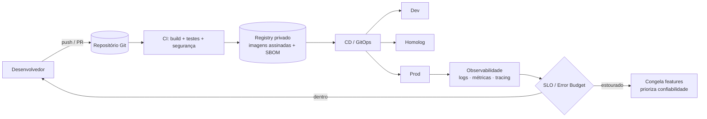
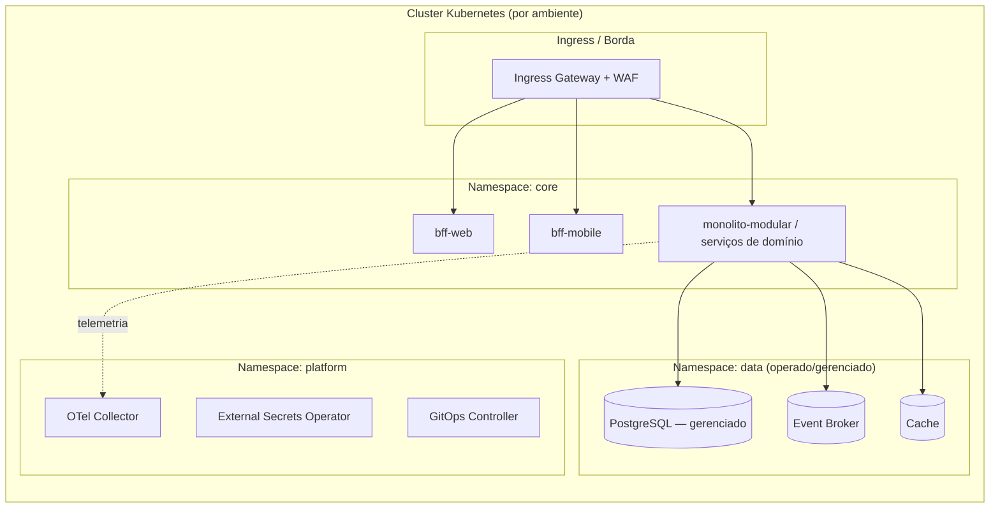
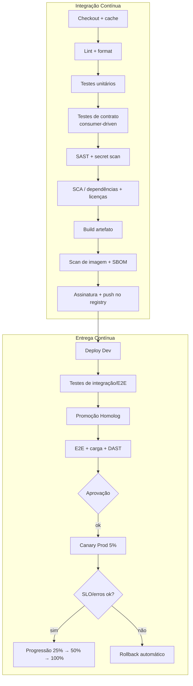
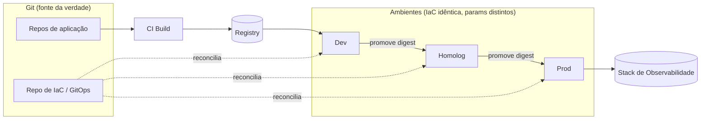
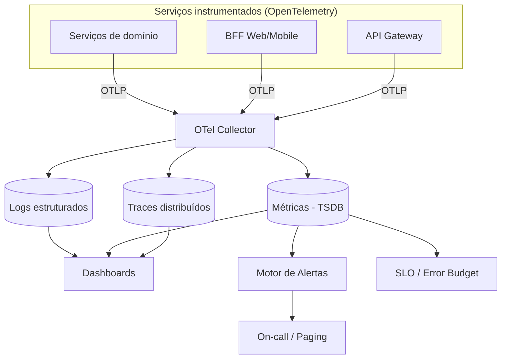
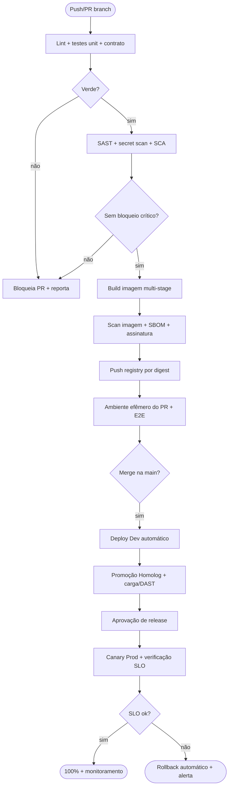
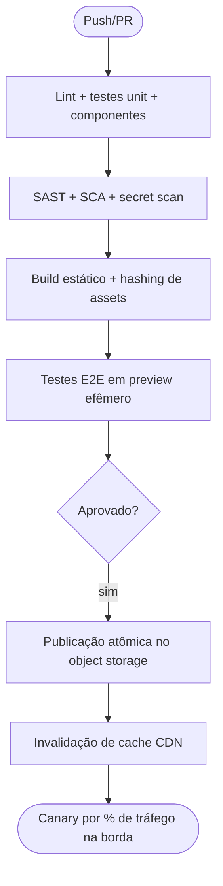
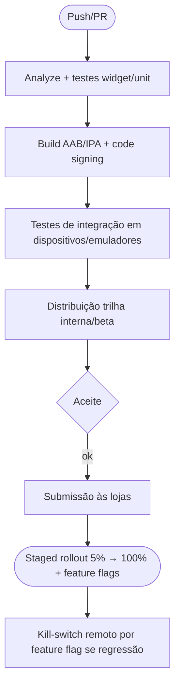

# 19 — DevOps · Drone Kairós ERP

**Documento:** `19 — DevOps`
**Versão:** 1.0 · **Data:** 21 de julho de 2026 · **Status:** Ativo
**Dependências:** `00`, `01`, `02`, `03`, `04`, `05`, `06`, `07`, `08`, `09`, `10`, `11`, `12`, `13`, `14`, `15`, `16`, `17`, `18`
**Responsável:** DevOps / SRE

---

## 1. Resumo Executivo

Este documento define a **engenharia de entrega e operação** do Drone Kairós ERP: a disciplina que transforma código versionado em software confiável rodando em produção, com o menor atrito e o maior grau de segurança e observabilidade possíveis. Ele materializa três princípios do canon — **contratos primeiro**, **segurança por padrão** e **observabilidade desde a arquitetura** — no plano operacional, cobrindo desde o *commit* de um desenvolvedor até o SLO honrado para um tenant em produção.

A plataforma é **multiempresa** e **evolutiva** (monólito modular → microsserviços, conforme Doc 07/09), com três frentes de artefato de natureza distinta: **backend** (serviços containerizados), **web** (SPAs e painéis estáticos servidos por CDN) e **mobile** (apps Flutter distribuídos por lojas). Cada frente tem um pipeline de CI/CD próprio, mas todos compartilham os mesmos **portões de qualidade** (testes, análise estática, varredura de segurança, testes de contrato) e a mesma **cadeia de suprimento de software** endurecida (imagens assinadas, SBOM, proveniência).

A estratégia de infraestrutura é **tudo-como-código (IaC)**: nenhum recurso é criado manualmente; ambientes (**dev**, **homolog**, **prod**) são descritos declarativamente, versionados e promovidos por **GitOps**. A orquestração de contêineres avalia e adota **Kubernetes** como plano de execução do backend, com *registry* privado, gestão de configuração externalizada e **segredos** nunca versionados. Os **deploys** usam estratégias progressivas (**blue-green**, **canary**, **feature flags**) para reduzir raio de explosão e permitir *rollback* em segundos.

A operação é regida por **SRE**: **SLIs/SLOs/error budget** governam o ritmo entre entregar e estabilizar; **on-call**, **runbooks**, **gestão de incidentes** e **postmortems sem culpa** fecham o ciclo de confiabilidade. **Backup e Disaster Recovery** são projetados em conjunto com o **KCD** (Doc 14), com RPO/RTO por classe de dado. Fecha o documento a **governança de custos (FinOps)**, tornando o gasto de nuvem uma métrica de engenharia de primeira classe.

## 2. Objetivos

- **O1.** Definir pipelines de **CI/CD** para backend, web e mobile, com portões de qualidade e segurança idênticos e automatizados (fail-fast, sem deploy manual em prod).
- **O2.** Estabelecer **Infraestrutura como Código** e a gestão dos três ambientes (dev/homolog/prod) com promoção por GitOps e paridade dev↔prod.
- **O3.** Padronizar **containers e orquestração** (Kubernetes), *registry* privado, gestão de configuração e **segredos** externalizados e rotacionáveis.
- **O4.** Adotar **estratégias de deploy progressivo** (blue-green, canary, feature flags) com *rollback* automático guiado por SLO.
- **O5.** Tornar a **observabilidade** (logs, métricas, tracing distribuído, dashboards, alertas) um requisito operável, com **SLIs/SLOs/error budget** formalizados.
- **O6.** Instituir a prática de **SRE**: on-call, runbooks, gestão de incidentes por severidade e postmortems sem culpa.
- **O7.** Garantir **Backup/DR** por classe de dado em conjunto com o KCD, com RPO/RTO medidos e testados.
- **O8.** Implantar **governança de custos (FinOps)** com visibilidade por ambiente, serviço e tenant, e mecanismos de contenção.
- **O9.** Endurecer a **cadeia de suprimento de software** (assinatura de imagens, SBOM, proveniência, varredura contínua).

## 3. Escopo

**No escopo:** esteira de CI/CD (build, teste, análise estática/SAST/SCA/DAST, empacotamento, deploy) para as três frentes; IaC e ciclo de vida de ambientes; contêineres, orquestração Kubernetes, *registry*, configuração e segredos; estratégias de deploy e *feature flags*; stack de observabilidade e prática de SLI/SLO/error budget; processo de SRE (on-call, runbooks, incidentes, postmortems); backup/DR operacional; FinOps; cadeia de suprimento de software.

**Fora do escopo (delegado):** modelagem de dados e estratégia de SN → Doc 08; contratos de API/eventos e resiliência de aplicação (circuit breaker, saga) → Doc 09; políticas de segurança, Zero Trust, criptografia, SOC e o **desenho** de backup/DR → Doc 14 (KCD); arquitetura de aplicação e bounded contexts → Doc 07; padrões de código → Doc 10. Aqui tratamos do **como entregar e operar** esses artefatos com confiabilidade — não do que eles fazem internamente.

## 4. Regras

- **R1. Nada manual em produção.** Todo recurso de infra e todo deploy nascem de código versionado e revisado; console/`kubectl apply` ad-hoc em prod é proibido (quebra-vidro auditado apenas em incidente).
- **R2. Pipeline é o único caminho.** Nenhum artefato chega a homolog/prod sem passar por todos os portões de qualidade e segurança. Não há *bypass*.
- **R3. Fail-fast e fail-closed.** Falha em teste, SAST, SCA ou varredura de imagem **bloqueia** a promoção. Segurança falha fechada.
- **R4. Imutabilidade.** Artefatos são imutáveis e endereçados por *digest* (não por tag móvel). A mesma imagem que passou em homolog é a que vai a prod (*build once, promote many*).
- **R5. Segredo nunca no Git.** Credenciais, chaves e tokens vivem em cofre externo; o repositório contém apenas **referências**. Varredura de segredo roda em cada push.
- **R6. Paridade de ambientes.** Dev, homolog e prod compartilham a mesma IaC e as mesmas imagens; divergem apenas por parâmetros (escala, tamanho, quotas), nunca por arquitetura.
- **R7. Tenant e trace onipresentes.** Toda telemetria (log, métrica, span) carrega `tenant_id` e `trace_id`; ausência é defeito de instrumentação.
- **R8. Deploy progressivo por padrão.** Mudanças de produção entram por canary ou blue-green com verificação automática de SLO; *big bang* é exceção justificada.
- **R9. SLO governa cadência.** Enquanto o *error budget* estiver esgotado, o fluxo prioriza estabilidade sobre novas features (política de congelamento).
- **R10. Cadeia de suprimento verificável.** Toda imagem em prod é **assinada**, tem **SBOM** publicado e proveniência rastreável; nós de execução recusam imagem não assinada.
- **R11. Reversível sempre.** Todo deploy tem *rollback* testado; toda migração de schema é retrocompatível (expand/contract) para permitir reversão sem perda.
- **R12. Custo é métrica de engenharia.** Cada serviço e ambiente tem orçamento; estouro gera alerta e revisão, como qualquer SLO.

## 5. Arquitetura (de entrega e infraestrutura)

### 5.1 Fluxo de valor (do commit ao SLO)



### 5.2 Topologia de ambientes

Três ambientes permanentes + ambientes efêmeros de PR:

| Ambiente | Propósito | Dados | Escala | Acesso | Deploy |
|---|---|---|---|---|---|
| **Efêmero (PR)** | Validar um PR isoladamente | Sintéticos/seed | Mínima | Time do PR | Automático no PR, destruído no merge |
| **Dev** | Integração contínua da branch principal | Sintéticos/seed | Mínima | Engenharia | Automático a cada merge |
| **Homolog** | Aceite, testes E2E, ensaio de release, carga | Mascarados/anonimizados | ~30% da prod | QA, PO, parceiros | Automático (promoção) |
| **Prod** | Produção multiempresa | Reais (isolados por tenant) | Plena, autoscaling | SRE (quebra-vidro) | Promoção com aprovação + canary |

**Regra de fluxo:** um artefato só sobe (dev → homolog → prod); nunca lateral nem regressivo. A **mesma imagem** promovida difere apenas por *config* injetada em runtime.

### 5.3 Plano de execução: Kubernetes (avaliação e decisão)

O backend containerizado adota **Kubernetes** como orquestrador. A decisão é justificada por gatilhos, não por moda:

| Critério | Sem orquestração / PaaS gerenciado | Kubernetes | Decisão Kairós |
|---|---|---|---|
| Nº de serviços a operar | Poucos (fase monólito) | Muitos (fase microsserviços, Doc 09) | **K8s** para acompanhar a evolução para serviços |
| Autoscaling por serviço | Limitado | Nativo (HPA/VPA) | **K8s** — escala assimétrica (BI, KCI) |
| Deploys progressivos | Manual/limitado | Nativo + controladores (canary/blue-green) | **K8s** — exige R8 |
| Portabilidade multi-cloud | Baixa | Alta | **K8s** — evita *lock-in* |
| Custo cognitivo/operacional | Baixo | Alto | Mitigado por **plataforma interna** + GitOps |
| Fase inicial (monólito) | Suficiente | Overhead | Iniciar com cluster gerenciado enxuto; crescer com a malha |

> **Recomendação:** cluster **Kubernetes gerenciado** (control plane administrado pelo provedor) para reduzir carga operacional. **Mobile** e **web estático** não usam K8s: web é publicado em **CDN/object storage**; mobile é empacotado e distribuído pelas **lojas** (ver §5.6).

**Organização do cluster (namespaces):** um namespace por ambiente lógico e por camada; isolamento de tenant é **lógico** (row-level, Doc 07/08), com opção de *node pool*/namespace dedicado para tenants enterprise que exijam isolamento físico.



### 5.4 Cadeia de suprimento de software (supply chain)

Cada artefato de backend/web percorre uma cadeia endurecida antes de ser promovível:

1. **Build reprodutível** em contêiner efêmero (sem estado de máquina do dev).
2. **SBOM** (inventário de dependências) gerado e armazenado junto ao artefato.
3. **Assinatura** da imagem (chaves gerenciadas em cofre) — proveniência atestada (nível SLSA como meta).
4. **Varredura** de vulnerabilidades da imagem e de dependências (SCA) com política de bloqueio por severidade.
5. **Admissão** no cluster **recusa imagem não assinada** ou de *registry* não confiável (R10).

### 5.5 Configuração e segredos

| Aspecto | Regra | Mecanismo de referência |
|---|---|---|
| Configuração não sensível | Externalizada por ambiente, versionada | ConfigMap / repositório de config (GitOps) |
| Segredos | Nunca no Git; injetados em runtime | Cofre (Vault-like) + External Secrets Operator |
| Rotação | Periódica e sob incidente | Rotação automatizada; TTL curto para credenciais dinâmicas |
| Criptografia | Em trânsito e repouso (padrão KCD) | mTLS no mesh; envelope encryption (KMS) |
| Isolamento por tenant | Segredos de tenant nunca cruzam fronteira | Namespaces/paths por tenant no cofre |

### 5.6 Frentes de artefato

| Frente | Artefato | Empacotamento | Destino | Distribuição |
|---|---|---|---|---|
| **Backend** | Imagem de contêiner (OCI) | Multi-stage, base *distroless*, não-root | Registry privado → K8s | GitOps + canary/blue-green |
| **Web** | Bundle estático + BFF | Build otimizado, *hashing* de assets | Object storage + CDN | Publicação atômica + invalidação de cache |
| **Mobile** | APK/AAB (Android), IPA (iOS) | Flutter build, *code signing* | Lojas + trilhas beta | Fastlane → *staged rollout* nas lojas + *feature flags* |

## 6. Diagramas

### 6.1 Pipeline de CI/CD (visão unificada)



### 6.2 Topologia dos ambientes e promoção



### 6.3 Stack de observabilidade



## 7. Fluxogramas (CI/CD por frente)

### 7.1 Backend



### 7.2 Web



### 7.3 Mobile (Flutter)



## 8. Boas Práticas

- **Build once, promote many.** Compilar/empacotar uma única vez; promover o mesmo *digest* por dev→homolog→prod. Nunca recompilar por ambiente.
- **Trunk-based + PRs curtos.** Branch principal sempre entregável; *feature flags* desacoplam *deploy* de *release*.
- **Portões idênticos entre frentes.** Backend, web e mobile passam pelos mesmos tipos de portão (teste, SAST, SCA, secret scan) para evitar elo fraco.
- **Testes em pirâmide.** Muitos unitários, alguns de contrato/integração, poucos E2E; testes de contrato *consumer-driven* protegem as fronteiras do Doc 09.
- **Migrações expand/contract.** Toda mudança de schema é retrocompatível em duas fases, permitindo rollback sem perda (R11).
- **Infra imutável.** Servidores/pods não são consertados no lugar; são substituídos por nova versão (*cattle, not pets*).
- **GitOps como fonte da verdade.** O estado desejado vive no Git; um controlador reconcilia o cluster continuamente e corrige *drift*.
- **Observabilidade como código.** Dashboards, alertas e SLOs versionados junto ao serviço; instrumentação com `tenant_id`/`trace_id` (R7).
- **Least privilege operacional.** Acessos a prod são *just-in-time*, temporários e auditados; nada de credencial permanente de humano.
- **Menor raio de explosão.** Canary + *feature flags* + limites de blast por tenant; um deploy ruim afeta 5%, não 100%.
- **Alerta acionável.** Alerta que não pede ação humana é ruído; todo alerta aponta para um runbook.
- **Custo visível no pipeline.** Estimativa de custo de mudança de IaC no PR; *tags* de custo obrigatórias em todo recurso.

## 9. Padrões

### 9.1 Padrões de entrega

| Padrão | Adoção | Observação |
|---|---|---|
| **Trunk-based development** | Obrigatório | Branches efêmeras, integração diária |
| **Versionamento semântico (SemVer)** | Obrigatório | `MAJOR.MINOR.PATCH` em imagens e libs |
| **Conventional Commits** | Obrigatório | Habilita *changelog* e versionamento automáticos |
| **GitOps (pull-based)** | Obrigatório | Controlador reconcilia; sem push direto ao cluster |
| **Multi-stage / distroless** | Obrigatório | Imagem mínima, não-root, superfície reduzida |
| **12-Factor** | Referência | Config no ambiente, processos stateless, logs como stream |

### 9.2 Estratégias de deploy

| Estratégia | Como funciona | Quando usar | Rollback |
|---|---|---|---|
| **Rolling update** | Substitui pods gradualmente | Mudança de baixo risco, sem quebra de contrato | Rollout undo |
| **Blue-Green** | Duas cores idênticas; troca de tráfego atômica | Mudança sensível que exige corte instantâneo | Reapontar para a cor anterior (segundos) |
| **Canary** | 5%→25%→50%→100% com verificação de SLO | Padrão de prod (R8); mudança de risco médio | Congela/reverte na primeira violação |
| **Feature flags** | *Deploy* sem *release*; ativação por flag/tenant/% | Desacoplar entrega de exposição; testes A/B; kill-switch | Desligar a flag (instantâneo, sem redeploy) |
| **Shadow / dark launch** | Tráfego espelhado sem afetar resposta | Validar carga/comportamento de novo serviço | N/A (sem impacto ao usuário) |

### 9.3 Padrões de observabilidade

- **Método RED** (Rate, Errors, Duration) para serviços de requisição; **USE** (Utilization, Saturation, Errors) para recursos.
- **Logs estruturados** (JSON) com campos canônicos: `timestamp`, `level`, `service`, `tenant_id`, `trace_id`, `span_id`, `message`.
- **Métricas** com convenção de nomes e *labels* padronizados (evitando alta cardinalidade descontrolada).
- **Tracing** W3C Trace Context / OpenTelemetry propagado ponta-a-ponta (herdado do Doc 09).
- **Correlação** log↔trace↔métrica por `trace_id` em todo dashboard de incidente.

### 9.4 Convenção de nomes e tags de recurso

Todo recurso de infra carrega tags obrigatórias: `projeto`, `ambiente`, `servico`, `owner`, `custo-centro`, `tenant-tier`. Sem tags → *policy-as-code* bloqueia a criação.

## 10. Casos de Uso

**UC-01 — Feature nova do commit ao usuário.** Dev abre PR → CI roda testes, SAST, SCA, secret scan e sobe ambiente efêmero → após merge, deploy automático em Dev, promoção a Homolog com E2E/carga, aprovação, canary 5% em Prod com verificação de SLO, progressão a 100%. Toda a mudança fica atrás de *feature flag* desligada até o *release* de negócio.

**UC-02 — Rollback automático guiado por SLO.** Canary a 25% eleva a taxa de erro acima do limiar do SLO de disponibilidade. O controlador de progressão detecta a violação, **interrompe** a progressão e **reverte** para a versão anterior em segundos; um alerta abre incidente SEV3 e aponta ao runbook de deploy.

**UC-03 — Hotfix de segurança em produção.** Uma CVE crítica é detectada pela varredura contínua de imagens. Pipeline expresso: patch → build → scan → assinatura → blue-green com corte instantâneo. Postmortem registra a origem e endurece a política de SCA.

**UC-04 — Provisionar novo ambiente/tenant enterprise.** Um tenant enterprise exige isolamento reforçado. IaC parametrizada cria *node pool*/namespace dedicado, paths de segredo isolados e quotas próprias, tudo por PR revisado, sem toque manual (R1/R6).

**UC-05 — Rotação de credencial comprometida.** KCD sinaliza credencial exposta. Cofre rotaciona automaticamente, External Secrets Operator propaga o novo valor aos pods, e a credencial antiga é revogada — sem downtime e sem versionar segredo (R5).

**UC-06 — Release mobile com staged rollout.** Nova versão do app Flutter é submetida às lojas com liberação escalonada (5%→100%). Telemetria de crash sobe em uma faixa; a *feature flag* correspondente é desligada remotamente (kill-switch), contendo o impacto sem nova submissão à loja.

**UC-07 — Exercício de DR.** *Game day* trimestral: restaura backups em região secundária, promove réplicas e mede RTO/RPO reais contra as metas (§11.5), gerando ações de melhoria (em conjunto com Doc 14).

## 11. Modelagem (ambientes e pipelines)

### 11.1 Matriz de ambientes

| Dimensão | Dev | Homolog | Prod |
|---|---|---|---|
| Origem do deploy | Merge na main | Promoção de digest | Promoção + aprovação |
| Estratégia | Rolling | Blue-green (ensaio) | Canary (padrão) |
| Dados | Seed sintético | Mascarado | Real, isolado por tenant |
| Observabilidade | Básica | Completa | Completa + SLO/alertas |
| Retenção de logs | 7 dias | 15 dias | 30–90 dias (por classe) |
| Backup | Não | Diário | Contínuo (ver §11.5) |
| Acesso humano | Livre (engenharia) | Restrito | Just-in-time / quebra-vidro |

### 11.2 Exemplo de estágios de pipeline (declarativo)

```yaml
# pipeline.yml — esteira de referência (backend)
# "build once, promote many" — o mesmo digest percorre os ambientes.
name: kairos-backend-delivery

stages:
  - name: verify
    jobs:
      - lint:            { run: "make lint" }
      - test-unit:       { run: "make test-unit", coverage_min: 80 }
      - test-contract:   { run: "make test-contract" }     # consumer-driven (Doc 09)
      - sast:            { run: "make sast" }               # análise estática de segurança
      - secret-scan:     { run: "make secret-scan", fail_on: any }
      - sca:             { run: "make sca", fail_on: "high,critical" }
      - license-check:   { run: "make license-check" }

  - name: package
    needs: [verify]
    jobs:
      - build-image:
          run: "docker build --target runtime -t $IMAGE:$SHA ."
          base: distroless
          user: nonroot
      - image-scan:      { run: "trivy image $IMAGE:$SHA", fail_on: "high,critical" }
      - sbom:            { run: "syft $IMAGE:$SHA -o spdx-json > sbom.json" }
      - sign:            { run: "cosign sign --key $COSIGN_KEY $IMAGE@$DIGEST" }
      - push:            { run: "docker push $IMAGE@$DIGEST" }   # imutável por digest

  - name: deploy-dev
    needs: [package]
    environment: dev
    jobs:
      - gitops-set-image: { image: "$IMAGE@$DIGEST", target: "envs/dev" }
      - e2e:              { run: "make e2e", against: dev }

  - name: deploy-homolog
    needs: [deploy-dev]
    environment: homolog
    when: branch == "main"
    jobs:
      - gitops-set-image: { image: "$IMAGE@$DIGEST", target: "envs/homolog" }
      - e2e:              { run: "make e2e", against: homolog }
      - load-test:        { run: "make load", slo_gate: true }
      - dast:             { run: "make dast", against: homolog }

  - name: deploy-prod
    needs: [deploy-homolog]
    environment: prod
    approval: { required: true, reviewers: ["sre", "tech-lead"] }
    strategy:
      type: canary
      steps: [5, 25, 50, 100]           # % de tráfego
      analysis:
        metrics: [error_rate, latency_p99, saturation]
        slo_gate: true                  # viola SLO => rollback automático
        rollback: automatic
    jobs:
      - gitops-set-image: { image: "$IMAGE@$DIGEST", target: "envs/prod" }
```

### 11.3 SLIs, SLOs e Error Budget

SLI é o que se mede; SLO é a meta; *error budget* é o quanto se pode falhar antes de congelar entregas (R9).

| Serviço/Jornada | SLI | SLO (janela 30d) | Error budget | Consequência ao esgotar |
|---|---|---|---|---|
| API núcleo (leitura) | % de respostas < 300 ms e sem erro 5xx | 99,9% disponibilidade | 43 min/mês | Congela features; foco em confiabilidade |
| API núcleo (escrita/OS) | % de transações concluídas sem erro | 99,9% sucesso | 0,1% | Revisão de mudanças recentes |
| Ingestão de eventos | % de eventos processados < 5 s | 99,5% | 0,5% | Prioriza fila/DLQ |
| App mobile (sync offline) | % de sincronizações bem-sucedidas | 99,0% | 1,0% | Revisão do cliente de sync |
| Pipeline de deploy | *Lead time* / *change failure rate* | CFR < 15% | — | Postmortem obrigatório |

**Política de error budget:** budget > 25% restante → cadência normal; entre 25% e 0% → revisão de risco por PR; esgotado → **congelamento** de features não-críticas até recuperação. Métricas **DORA** (deploy frequency, lead time, change failure rate, MTTR) acompanham a saúde do fluxo.

### 11.4 Alertas e severidades

| Severidade | Critério | Resposta | Notificação |
|---|---|---|---|
| **SEV1** | Indisponibilidade ampla / perda de dados / brecha | On-call imediato + war room + comunicação | Paging + liderança + status page |
| **SEV2** | Degradação séria, SLO em risco iminente | On-call imediato | Paging |
| **SEV3** | Falha localizada, budget consumido | Horário comercial estendido | Chat + ticket |
| **SEV4** | Ruído/baixo impacto, tendência | Backlog | Ticket |

Alertas são baseados em **sintoma** (SLO/experiência do usuário), não apenas em causa (uso de CPU), para reduzir fadiga e falso-positivo.

### 11.5 Backup e DR (com KCD — Doc 14)

| Classe de dado | Estratégia de backup | RPO | RTO | Teste |
|---|---|---|---|---|
| Transacional (OS, Financeiro, SN) | Contínuo (WAL/PITR) + snapshot diário, replicação cross-region | ≤ 5 min | ≤ 1 h | Restauração mensal |
| Eventos / broker | Retenção + replicação de partições | ≤ 1 min | ≤ 30 min | Reprocesso de DLQ |
| Objetos/anexos | Versionamento + replicação geográfica | ≤ 15 min | ≤ 2 h | Amostragem trimestral |
| Configuração/IaC | Git (já é a fonte da verdade) | 0 | ≤ 15 min | Recriação via GitOps |
| Segredos | Cofre com backup cifrado | ≤ 15 min | ≤ 30 min | Rotação + restore |

> O **desenho** de criptografia, retenção legal e classificação é do **KCD (Doc 14)**; aqui está a **operação** (automação, verificação e *game days*). Backups são cifrados, imutáveis (proteção contra ransomware) e testados — backup não testado não é backup.

### 11.6 SRE — operação

- **On-call:** rotação com escala primária/secundária, *handoff* documentado, SLA de resposta por severidade e horas de descanso protegidas.
- **Runbooks:** um por alerta/cenário, versionado junto ao serviço; contém sintoma, diagnóstico, ação de mitigação, escalonamento e *rollback*.
- **Gestão de incidentes:** papéis definidos (Incident Commander, Comms, Ops), linha do tempo registrada, canal dedicado, *status page* para SEV1/SEV2.
- **Postmortem sem culpa:** obrigatório para SEV1/SEV2 (e SEV3 recorrente); foca em causas sistêmicas e ações corretivas com dono e prazo; publicado internamente.

**Template de runbook (resumo):** `Alerta → Sintoma observável → Impacto/tenant → Diagnóstico rápido (dashboards/queries) → Mitigação → Rollback → Escalonamento → Pós-verificação`.

**Template de postmortem (resumo):** `Resumo → Impacto (duração, tenants, SLO/budget) → Linha do tempo → Causa raiz → O que funcionou / o que falhou → Ações corretivas (dono, prazo) → Lições`.

### 11.7 Governança de custos (FinOps)

| Prática | Descrição |
|---|---|
| Orçamento por dimensão | Budget por ambiente, serviço e tenant-tier; alerta em 80%/100% |
| Alocação de custo | Tags obrigatórias (§9.4) permitem *showback/chargeback* por tenant |
| Rightsizing | Recomendação contínua de recursos (requests/limits) via VPA/telemetria |
| Escala a zero | Ambientes efêmeros e dev *scale-to-zero* fora de uso |
| Compromissos | Uso de capacidade reservada/spot para cargas previsíveis/tolerantes |
| Estimativa no PR | Diferença de custo de IaC exibida na revisão antes do merge |

## 12. Checklist

**Prontidão de pipeline e serviço (Definition of Done operacional):**

- [ ] Pipeline com todos os portões (lint, testes unit/contrato, SAST, secret scan, SCA, licença) verdes e bloqueantes.
- [ ] Build multi-stage, imagem *distroless* não-root, scan sem crítico/alto, SBOM gerado e imagem **assinada**.
- [ ] Artefato imutável por *digest*; mesma imagem promovida dev→homolog→prod (build once, promote many).
- [ ] IaC versionada; ambiente reproduzível por GitOps; *drift* reconciliado automaticamente.
- [ ] Segredos apenas em cofre; nenhuma credencial no repositório; rotação configurada.
- [ ] Deploy de prod por canary/blue-green com *SLO gate* e **rollback automático** testado.
- [ ] Migração de schema em modo expand/contract, reversível.
- [ ] Instrumentação OTel: logs estruturados + métricas RED + traces com `tenant_id`/`trace_id`.
- [ ] Dashboards, alertas e SLOs versionados; cada alerta aponta a um runbook.
- [ ] `/healthz` e `/readyz` expostos; probes de liveness/readiness configurados.
- [ ] Backup automatizado com RPO/RTO definidos e restauração testada.
- [ ] On-call e runbook de falha/rollback publicados; postmortem para SEV1/SEV2.
- [ ] Tags de custo obrigatórias presentes; orçamento e alerta configurados.
- [ ] Admissão do cluster recusa imagem não assinada / registry não confiável.

## 13. Riscos

| ID | Risco | Prob. | Impacto | Mitigação |
|---|---|---|---|---|
| RS-01 | Deploy ruim atinge 100% dos tenants | Média | Crítico | Canary + blue-green + rollback automático (R8) |
| RS-02 | Segredo vazado no repositório | Média | Crítico | Secret scan bloqueante + cofre + rotação (R5) |
| RS-03 | *Drift* entre estado real e IaC | Média | Alto | GitOps pull-based reconciliando continuamente (R1) |
| RS-04 | Imagem comprometida na cadeia de suprimento | Baixa | Crítico | Assinatura + SBOM + admissão restritiva + scan (R10) |
| RS-05 | Migração de schema irreversível quebra prod | Média | Alto | Expand/contract + ensaio em homolog (R11) |
| RS-06 | Fadiga de alertas / cegueira operacional | Alta | Médio | Alerta por sintoma/SLO, não por causa; revisão periódica |
| RS-07 | Complexidade de Kubernetes sobrecarrega o time | Média | Médio | Cluster gerenciado + plataforma interna + GitOps |
| RS-08 | Backup não restaurável no incidente | Baixa | Crítico | *Game days* de DR; restauração testada e medida (§11.5) |
| RS-09 | Estouro de custo de nuvem sem visibilidade | Média | Médio | FinOps: tags, budgets, rightsizing, estimativa no PR |
| RS-10 | Deriva de paridade dev↔prod mascara bugs | Média | Alto | IaC idêntica; diferença só por parâmetro (R6) |
| RS-11 | *Lock-in* de fornecedor de nuvem | Baixa | Médio | K8s + IaC portável; abstrações padrão (OTel, OCI) |
| RS-12 | Loja mobile rejeita/atrasa release crítico | Média | Médio | *Staged rollout* + feature flags + kill-switch remoto |

## 14. Melhorias Futuras

- **Progressive delivery avançado:** análise automática de canary com múltiplos SLIs e *auto-promotion*/`auto-rollback` orientados por sinais compostos.
- **Plataforma interna de desenvolvedor (IDP):** portal *self-service* com *golden paths* (criar serviço, ambiente, pipeline padronizados) para reduzir carga cognitiva.
- **Policy-as-code abrangente:** governança de admissão, custo e segurança expressa como código e testada no pipeline.
- **Chaos engineering contínuo:** injeção controlada de falhas em homolog/prod para validar resiliência (complementa Doc 09).
- **SLSA nível alto:** proveniência verificável ponta-a-ponta e *hermetic builds*.
- **FinOps preditivo:** previsão de custo por tenant e *rightsizing* automatizado.
- **Multi-região ativo-ativo:** evolução de DR (ativo-passivo) para ativo-ativo em jornadas críticas conforme demanda enterprise.
- **AIOps para operação:** correlação e detecção de anomalias assistida sobre a telemetria para reduzir MTTR (sem dependência de fornecedor comercial específico).

## 15. Auditoria

| Item | Descrição |
|---|---|
| **Rastreabilidade de mudança** | Todo deploy é rastreável a um commit, PR revisado e digest de imagem assinado; GitOps registra quem promoveu o quê e quando. |
| **Trilha de execução** | `trace_id` e `tenant_id` em logs/métricas/traces permitem reconstruir qualquer requisição em produção ponta-a-ponta. |
| **Integridade de artefato** | Assinatura + SBOM + admissão restritiva garantem que só imagens verificadas rodam em prod (R10). |
| **Segregação de acesso** | Acesso a prod é just-in-time, temporário e auditado; quebra-vidro registra ator, motivo e janela. |
| **Conformidade de segredos** | Nenhum segredo no Git (varredura contínua); rotação e cofre auditáveis, alinhados ao KCD. |
| **Prontidão de recuperação** | RPO/RTO definidos, backups cifrados/imutáveis e restauração testada em *game days* documentados. |
| **Governança de custo** | Tags obrigatórias e budgets tornam o gasto auditável por ambiente, serviço e tenant. |
| **Multiempresa** | Isolamento de tenant preservado em telemetria, segredos e (quando exigido) execução dedicada. |
| **Versão do documento** | v1.0 — 21 de julho de 2026. Alterações futuras registradas no controle de versão do repositório de documentação. |
| **Aprovação** | DevOps/SRE (responsável); dependências 00–18 verificadas e coerentes com o PROJECT CANON. |

---

> **Nota de encerramento.** Este documento é o **contrato operacional** do Drone Kairós ERP: define como o software nasce (CI), como chega ao usuário (CD progressivo), como se mantém de pé (SRE + observabilidade + SLO) e como se recupera (DR), sob custo governado. Ele é deliberadamente **conservador na segurança e progressivo na entrega** — nada chega a produção fora do pipeline, nada roda sem ser observável, e nada muda sem poder ser revertido. A confiabilidade não é um estágio final; é uma propriedade construída em cada etapa.
