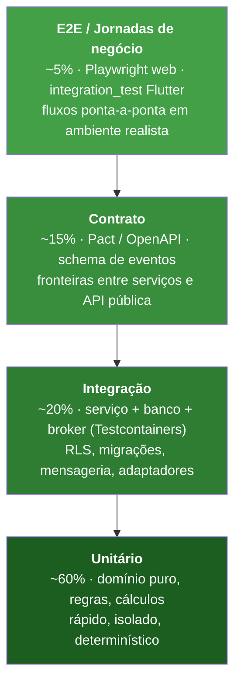
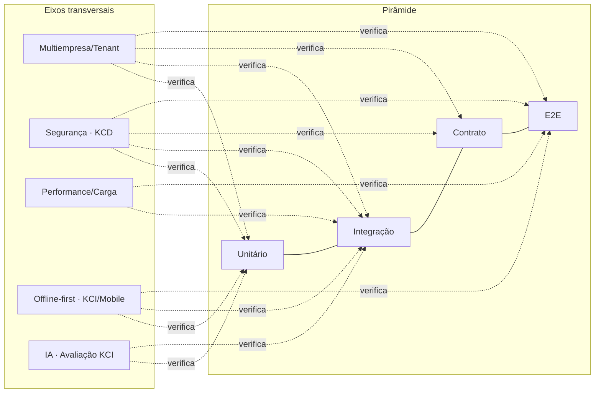
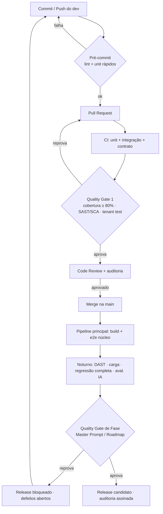
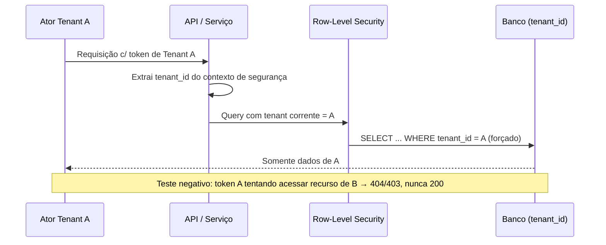
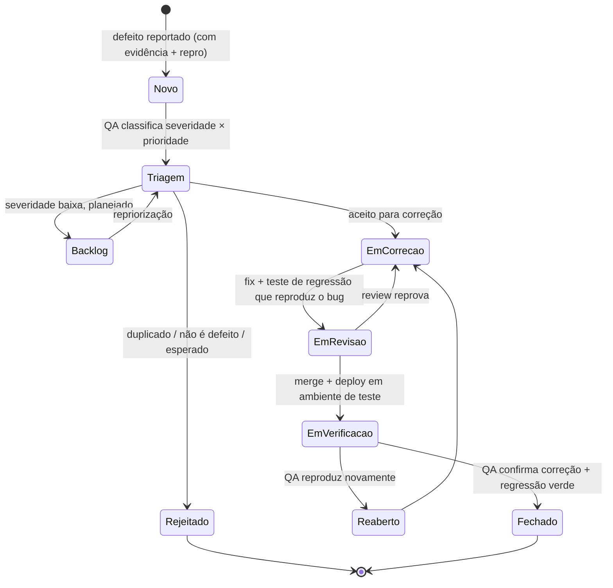

# 20 — QA · Drone Kairós ERP

**Documento:** `20 — QA (Garantia de Qualidade e Testes)`
**Versão:** 1.0 · **Data:** 21 de julho de 2026 · **Status:** Ativo
**Dependências:** `00 — Master Prompt`, `01 — Constituição`, `02 — Project Bible`, `03 — Roadmap`, `04 — Pesquisa de Mercado`, `05 — Benchmark`, `06 — Requisitos`, `07 — Arquitetura`, `08 — Banco de Dados`, `09 — Microsserviços`, `10`–`19`
**Responsável:** Engenharia de QA

---

## 1. Resumo Executivo

Este documento define a **estratégia de garantia de qualidade e a disciplina de testes** do Drone Kairós ERP — a plataforma multiempresa do ecossistema de drones que conecta **fabricante → revenda → técnico → cliente** com backend orientado a serviços, apps Flutter, painéis web, API pública e os módulos proprietários **KCI (Kairós Core Intelligence)**, **KCD (Kairós Cyber Defense)** e **KSI (Kairós Smart Inventory)**.

O princípio inegociável herdado do canon é direto: **nada é "pronto" sem auditoria**. Em QA isso se traduz em uma regra operacional — nenhum incremento atravessa um *Quality Gate* sem evidência objetiva (testes verdes, cobertura mínima, varreduras de segurança, verificação de isolamento de tenant). Qualidade aqui não é fase final nem responsabilidade de um time isolado: é uma **propriedade construída em cada camada** e verificada por múltiplos níveis de teste complementares.

A espinha dorsal da estratégia é a **pirâmide de testes**: uma base larga de testes **unitários** rápidos e determinísticos, uma camada intermediária de testes de **integração** e **contrato**, e um topo estreito de testes **end-to-end (e2e)** que valida jornadas críticas de negócio. A pirâmide é reforçada por **eixos transversais** que atravessam todos os níveis e são específicos do domínio: **isolamento multiempresa** (nenhum vazamento entre tenants, jamais), **segurança** (SAST/DAST/pentest em conjunto com o KCD), **performance e carga**, **offline-first** (mobile e KCI em campo, sem rede) e **avaliação de IA** (qualidade de diagnóstico e regressão de modelos do KCI).

O documento entrega: a arquitetura de testes e a divisão de responsabilidades por nível; a especificação dos testes transversais; a estratégia de **testes de contrato** (consumer-driven) para a API pública e entre serviços; a infraestrutura de **automação, dados de teste, ambientes e CI**; o processo de **gestão de defeitos** com matriz de severidade × prioridade; a **Definition of Done** e os **critérios de aceite**; as **métricas de qualidade** (cobertura, densidade de defeitos, *flakiness*, *escaped defects*); e os **Quality Gates** alinhados ao Master Prompt. Diagramas Mermaid ilustram a pirâmide, o fluxo de qualidade e o ciclo de vida do defeito; tabelas mapeiam tipos de teste por módulo.

## 2. Objetivos

- **O1.** Estabelecer a **pirâmide de testes** (unitário, integração, contrato, e2e) com metas de proporção, propriedade clara e critérios de "verde" por nível.
- **O2.** Especificar os **testes transversais do domínio**: isolamento multiempresa, segurança (com KCD), performance/carga, offline-first (mobile/KCI) e avaliação de IA (KCI).
- **O3.** Definir **testes de contrato** consumer-driven para a **API pública** e para as integrações **entre serviços** (síncronas e assíncronas por evento).
- **O4.** Padronizar **automação, gestão de dados de teste, topologia de ambientes e integração contínua (CI)**, com portões automáticos e evidências rastreáveis.
- **O5.** Instituir a **gestão de defeitos**: matriz de severidade/prioridade, SLA de correção, fluxo de triagem e critérios de reabertura.
- **O6.** Formalizar a **Definition of Done** e os **critérios de aceite** como contrato de conclusão verificável, não subjetivo.
- **O7.** Definir as **métricas de qualidade** e seus limiares, e como alimentam decisão de release.
- **O8.** Amarrar os **Quality Gates de QA** ao Master Prompt (00) e ao Roadmap (03): nenhuma fase avança sem que a anterior passe.

## 3. Escopo

**No escopo:** estratégia e pirâmide de testes; responsabilidades por nível; testes funcionais e não-funcionais; testes de isolamento multiempresa; testes de segurança em conjunto com KCD (SAST, DAST, SCA, pentest, secret scanning); testes de performance e carga; testes offline-first para mobile Flutter e KCI; avaliação de qualidade e regressão de modelos do KCI; testes de contrato (API pública e inter-serviços); automação, dados de teste, ambientes e CI; gestão de defeitos; DoD e critérios de aceite; métricas; Quality Gates.

**Fora do escopo (referência a outros documentos):** requisitos funcionais detalhados (Doc 06); desenho de arquitetura e tenancy (Doc 07); modelagem física de dados e RLS (Doc 08); contratos e comportamento distribuído dos serviços (Doc 09); controles internos e arquitetura do KCD (documento de Segurança); pipelines de entrega/IaC e topologia de clusters (documento de DevOps/Operação). Aqui QA **consome** esses contratos e define **como verificá-los**; não os redefine.

**Aplicabilidade:** toda a plataforma — ERP, apps, painéis, portais, CRM, financeiro, BI, API pública e os módulos KCI/KCD/KSI — em todas as fases do Roadmap.

## 4. Regras (Definition of Done)

A **Definition of Done (DoD)** é o contrato de conclusão. Um item (história, tarefa, correção) **só está "pronto"** quando **todas** as regras abaixo têm evidência objetiva. Sem evidência, o item volta para "em andamento" — não existe "pronto na palavra".

- **R1. Testes automatizados verdes.** Unitários, de integração e de contrato pertinentes ao item existem e passam no CI. Nenhum teste pulado (`skip`) sem justificativa aprovada e ticket associado.
- **R2. Cobertura mínima atingida.** Cobertura de linha/branch do código novo ou alterado ≥ **80%** (≥ **90%** em módulos críticos: KCD, financeiro, IAM, isolamento de tenant). Cobertura medida sobre o *diff*, não só global.
- **R3. Tenant verificado.** Qualquer código que toque dados carrega e respeita `tenant_id`; existe pelo menos um teste que prova que o item **não** vaza dados entre tenants.
- **R4. Segurança sem bloqueadores.** SAST, SCA (dependências) e *secret scanning* sem achados de severidade **Alta/Crítica** em aberto. Endpoints novos cobertos por DAST no pipeline noturno.
- **R5. Contrato respeitado.** Se o item altera uma interface (REST/OpenAPI, gRPC/proto, evento de domínio), o teste de contrato correspondente foi atualizado e é retrocompatível — ou a quebra foi versionada e comunicada.
- **R6. Critérios de aceite satisfeitos.** Todos os critérios de aceite (Gherkin/BDD) da história passam; jornada crítica coberta por e2e quando aplicável.
- **R7. Observabilidade mínima.** Logs correlacionados por `trace_id`, métricas relevantes expostas e sem erro/latência anômala nos testes.
- **R8. Sem regressão.** Suíte de regressão relevante verde; nenhum defeito novo introduzido em fluxo existente.
- **R9. Documentação e ADR.** Mudança de comportamento documentada; decisão relevante registrada como ADR.
- **R10. Revisão e auditoria.** *Code review* aprovado; trilha de auditoria da mudança (autor, revisor, evidências de teste) preservada. **Nada é "pronto" sem auditoria.**

> A DoD é **verificada automaticamente** onde possível (Quality Gate no CI, §15/§7) e **inspecionada** onde não é automatizável. Um item que fura qualquer regra não pode ser marcado como concluído nem entrar em release.

## 5. Arquitetura de Testes

### 5.1 A pirâmide de testes

A estratégia adota a pirâmide clássica, calibrada para uma plataforma multiempresa orientada a serviços com forte componente mobile e de IA. Quanto mais baixo o nível, **mais** testes, **mais rápidos**, **mais determinísticos** e **mais baratos**; quanto mais alto, **menos** testes, **mais lentos** e **mais caros**, cobrindo jornadas de valor.

**Anti-padrões proibidos:** o *ice-cream cone* (muitos e2e, poucos unitários) e o *hourglass* (base e topo cheios, meio vazio). Ambos produzem suítes lentas, frágeis e de diagnóstico ruim. Testes que exigem UI para validar regra de negócio pura são reprovados em revisão — a regra pertence ao nível unitário.

### 5.2 Eixos transversais

Ortogonais à pirâmide, cinco eixos atravessam **todos** os níveis e são específicos do canon do Kairós. Não são um "sexto nível"; são propriedades verificadas em cada nível aplicável.

### 5.3 Níveis, propriedade e definição de "verde"

| Nível | O que valida | Ferramentas (referência) | Quem escreve (propriedade) | Onde roda | "Verde" significa |
|---|---|---|---|---|---|
| **Unitário** | Regra de domínio, cálculo, invariante, borda | JUnit/Kotlin-test (backend), Dart `test` (Flutter), Vitest/Jest (web) | **Dev do time de feature** | A cada commit / pré-push | 100% dos casos passam; sem I/O real; < poucos ms cada |
| **Integração** | Serviço + banco + broker + adaptadores reais | Testcontainers (Postgres, broker), test doubles de borda | **Dev do time de feature** | CI por PR | Migrações e RLS aplicadas; mensageria e persistência reais verdes |
| **Contrato** | Fronteira entre consumidor e provedor; API pública | Pact (consumer-driven), validação OpenAPI 3.1, schema registry | **Consumidor define; provedor verifica** | CI por PR + verificação cruzada | Pacto publicado e verificado; sem quebra retroativa |
| **E2E** | Jornada de negócio ponta-a-ponta | Playwright (web), `integration_test` (Flutter), API-driven | **QA Engineering** (com o time) | Pipeline de release / noturno | Jornada crítica completa sem erro em ambiente realista |
| **Não-funcional** | Performance, carga, resiliência, segurança dinâmica | k6/Gatling, OWASP ZAP, chaos tooling | **QA + SRE + KCD** | Noturno / pré-release | Dentro dos SLOs; sem achado Alto/Crítico |

**Regra de propriedade:** o time que **produz** o código é dono dos testes unitários e de integração daquele código. **QA Engineering** é dono da estratégia, dos e2e de jornada, dos testes não-funcionais, do harness de avaliação de IA e da curadoria da suíte de regressão — e atua como **habilitador** (frameworks, dados, ambientes, revisão de cobertura), nunca como "gargalo que testa tudo no fim".

## 6. Diagramas

### 6.1 Fluxo de qualidade (do commit ao release)

### 6.2 Isolamento multiempresa — o teste que nunca pode falhar

## 7. Fluxogramas (ciclo de vida do defeito)

**Regra de ouro da correção:** todo defeito aceito só fecha acompanhado de um **teste automatizado que reproduz o bug** (*regression test*). O teste deve **falhar** sem a correção e **passar** com ela. Isso impede regressões e transforma cada defeito em cobertura permanente.

## 8. Boas Práticas

- **Testes determinísticos.** Sem dependência de relógio real, ordem de execução, rede externa ou dados compartilhados mutáveis. Tempo e aleatoriedade são injetados (*clock* e *seed* controlados).
- **Isolamento por teste.** Cada teste cria e destrói seu próprio estado (banco por container efêmero, tenant sintético dedicado). Nada de "banco de dev compartilhado".
- **Nomes que descrevem comportamento.** `deveRecusarAcessoDeTenantDiferente`, não `test1`. O nome do teste é documentação viva do requisito.
- **Arrange–Act–Assert** explícito; um conceito por teste; asserções específicas (não `assertNotNull` genérico onde cabe verificação de valor).
- **Test doubles com parcimônia.** Preferir componentes reais em integração (Testcontainers) a *mocks* que codificam suposições. *Mock* só em bordas caras/externas.
- **Contrato antes do código** (herdado do Doc 09): o pacto/consumer test existe antes de o provedor implementar.
- **Dados de teste como código.** *Builders*/*factories* versionados; nunca *dumps* de produção sem anonimização (§4/§9 — proibido dado real de cliente em teste).
- **Falha rápida e clara.** Mensagem de asserção diz **o que** era esperado e **o que** veio. Teste que falha sem explicar é defeito de teste.
- **Combate ativo a *flakiness*.** Teste intermitente é tratado como defeito P2: quarentenado (fora do gate, visível no painel) e corrigido em SLA — nunca ignorado com *retry* cego.
- **Pirâmide, não cone.** Empurrar a verificação para o nível mais baixo possível que ainda dá confiança.

## 9. Padrões

- **BDD/Gherkin** para critérios de aceite (`Dado/Quando/Então`), servindo de fonte para e2e e como linguagem comum com produto.
- **Consumer-Driven Contracts (Pact)** para toda fronteira de serviço e para a API pública.
- **OpenAPI 3.1** como contrato normativo da API pública; **Protobuf** para gRPC interno; **schema de eventos versionado** (schema registry) para o backbone assíncrono.
- **Testcontainers** como padrão de integração (Postgres com RLS, broker de eventos, cache) — paridade com produção, descartável.
- **Page Object / Screen Object** em e2e (web e Flutter) para reduzir fragilidade.
- **Convenção de nomenclatura de tenants de teste:** `t_test_<caso>` sintético; jamais `tenant_id` de cliente real.
- **Dados sensíveis:** massa de teste **sintética ou anonimizada** (mascaramento irreversível de PII); proibido dado real de produção em ambientes de teste — controle verificado pelo KCD.
- **Convenção de severidade/prioridade** unificada (§ Casos de Uso e Modelagem) usada por todos os times.
- **Versionamento de suítes:** testes vivem no mesmo repositório e PR do código que verificam (co-localização), garantindo que contrato e verificação evoluem juntos.

## 10. Casos de Uso

### 10.1 Multiempresa — isolamento de tenant

- **UC-01.** Ator do Tenant A, autenticado, tenta ler/gravar recurso do Tenant B via API, ID direto (IDOR), filtro manipulado ou evento forjado. **Esperado:** negação (403/404), **zero** vazamento; registro de auditoria no KCD. Teste negativo obrigatório em todos os endpoints e consumidores de evento.
- **UC-02.** Migração de banco: verificar que a política **RLS** permanece ativa após cada migração (teste de integração que roda a migração e tenta cross-tenant).

### 10.2 Segurança (com KCD)

- **UC-03.** SAST detecta injeção, deserialização insegura, cripto fraca no *diff* → bloqueia PR (Gate 1).
- **UC-04.** DAST/ZAP noturno exercita endpoints autenticados e anônimos buscando OWASP Top 10 (injeção, autenticação quebrada, exposição de dados) → achados viram defeitos com severidade herdada do CVSS.
- **UC-05.** SCA + *secret scanning*: dependência com CVE Crítico ou segredo commitado bloqueia merge.
- **UC-06.** Pentest (periódico, por fase e pré-GA) conduzido em conjunto com o KCD; findings entram no fluxo de defeitos com SLA agravado.

### 10.3 Performance / carga

- **UC-07.** Teste de carga do fluxo de OS e de estoque (KSI) sob volume-alvo por tenant e multi-tenant simultâneo; medir p95/p99 de latência e throughput contra SLO.
- **UC-08.** Teste de *stress* e *soak* (resistência prolongada) para detectar vazamento de memória e degradação; *spike* para validar autoscaling.

### 10.4 Offline-first (mobile / KCI)

- **UC-09.** Técnico em campo **sem rede**: registra diagnóstico, captura fotos/OCR, executa KCI localmente, enfileira mudanças. **Esperado:** operação plena offline.
- **UC-10.** **Reconciliação/sincronização** ao voltar a rede: resolução de conflitos determinística, sem perda de dado, sem duplicação (idempotência), preservando `tenant_id`.

### 10.5 IA — avaliação do KCI

- **UC-11.** *Golden set* de diagnósticos rotulados: medir qualidade (acurácia, precisão/recall por classe de falha) do KCI contra baseline; **regressão** reprova se cair além do limiar.
- **UC-12.** Teste de robustez: entradas ruidosas, imagens de baixa qualidade, casos-limite; verificar *fallback* seguro (KCI nunca "inventa" diagnóstico com alta confiança sem evidência) e comportamento previsível quando a IA externa opcional está indisponível.

### 10.6 Contrato

- **UC-13.** Parceiro consumidor da **API pública** publica pacto; qualquer mudança do provedor que quebre o pacto reprova no CI antes do deploy.
- **UC-14.** Serviço consumidor de evento `OSConcluida` declara o schema que espera; produtor não pode remover/renomear campo sem versionar (tolerant reader + registry).

## 11. Modelagem — matriz de tipos de teste por módulo

### 11.1 Tipos de teste (catálogo)

| Tipo | Objetivo | Nível na pirâmide | Gatilho no CI |
|---|---|---|---|
| Unitário | Regra/cálculo/invariante | Base | Todo PR |
| Integração | Serviço+banco+broker reais | Meio-baixo | Todo PR |
| Contrato (CDC) | Fronteira consumidor↔provedor | Meio | Todo PR + cruzado |
| E2E | Jornada de negócio | Topo | Release / noturno |
| Isolamento de tenant | Não-vazamento multiempresa | Transversal (todos) | Todo PR (mínimo 1) |
| Segurança SAST/SCA | Falha no código/dependências | Transversal | Todo PR |
| Segurança DAST/pentest | Falha em execução | Transversal | Noturno / por fase |
| Performance/carga | Latência, throughput, resistência | Não-funcional | Noturno / pré-release |
| Offline-first | Operação sem rede + sync | Transversal | PR (mobile) + noturno |
| Avaliação de IA | Qualidade + regressão de modelo | Transversal | Noturno + por versão de modelo |

### 11.2 Matriz módulo × tipo de teste

Legenda: ● crítico/obrigatório · ○ aplicável · — não aplicável.

| Módulo | Unit | Integr. | Contrato | E2E | Tenant | Segurança | Perf. | Offline | IA |
|---|---|---|---|---|---|---|---|---|---|
| **API Pública** | ● | ● | ● | ○ | ● | ● | ● | — | — |
| **ERP / Núcleo** | ● | ● | ● | ● | ● | ● | ○ | — | — |
| **KCI (Inteligência)** | ● | ● | ○ | ○ | ● | ● | ○ | ● | ● |
| **KCD (Segurança)** | ● | ● | ○ | ○ | ● | ● | ○ | — | ○ |
| **KSI (Estoque)** | ● | ● | ● | ● | ● | ● | ● | ○ | ○ |
| **App Mobile (Flutter)** | ● | ● | ● | ● | ● | ● | ○ | ● | ○ |
| **Painéis Web** | ● | ○ | ● | ● | ● | ● | ○ | — | — |
| **Financeiro** | ● | ● | ● | ● | ● | ● | ○ | — | — |
| **CRM** | ● | ● | ● | ○ | ● | ● | ○ | — | — |
| **BI** | ● | ● | ○ | ○ | ● | ● | ● | — | ○ |

> Observação: **isolamento de tenant** e **segurança** são ● em **todos** os módulos que tocam dados — reflexo direto dos princípios "segurança por padrão" e "multiempresa de primeira classe" do canon.

## 12. Checklist

**Checklist de conclusão (por item — espelha a DoD §4):**

- [ ] Unit + integração + contrato pertinentes escritos e **verdes** no CI.
- [ ] Cobertura do *diff* ≥ 80% (≥ 90% em KCD/financeiro/IAM/tenant).
- [ ] Pelo menos **um** teste negativo de isolamento de tenant.
- [ ] SAST, SCA e *secret scanning* sem achado Alto/Crítico.
- [ ] Contrato (OpenAPI/proto/evento) atualizado e retrocompatível — ou quebra versionada.
- [ ] Critérios de aceite (Gherkin) passando; e2e da jornada quando aplicável.
- [ ] Teste de regressão que **reproduz** o defeito (para correções).
- [ ] Logs correlacionados e métricas expostas; sem latência/erro anômalos.
- [ ] Documentação/ADR atualizada.
- [ ] *Code review* aprovado e **trilha de auditoria** preservada.

**Checklist de prontidão de release (por fase — Quality Gate):**

- [ ] Suíte completa de regressão verde; **zero** defeito Crítico/Alto em aberto.
- [ ] DAST noturno sem achado Alto/Crítico; pentest de fase concluído e findings tratados.
- [ ] Testes de carga dentro dos SLOs (p95/p99, throughput, erro).
- [ ] Testes offline-first e de sincronização verdes (mobile/KCI).
- [ ] Avaliação de IA do KCI sem regressão além do limiar vs. baseline.
- [ ] Isolamento multiempresa verificado ponta-a-ponta em ambiente realista.
- [ ] *Flakiness* da suíte abaixo do limiar; nenhum teste crítico em quarentena.
- [ ] Métricas de qualidade dentro dos limiares (§ Riscos/Auditoria).
- [ ] Auditoria de QA assinada — **nada avança sem auditoria**.

## 13. Riscos

| ID | Risco | Prob. | Impacto | Mitigação |
|---|---|---|---|---|
| RS-01 | Vazamento de dados entre tenants | Baixa | Crítico | Teste negativo obrigatório por endpoint/evento; RLS verificada pós-migração; auditoria KCD |
| RS-02 | Suíte lenta e frágil (anti-padrão cone/ampulheta) | Média | Alto | Manter proporção da pirâmide; empurrar verificação para base; revisão de altitude de teste |
| RS-03 | *Flaky tests* corroendo confiança no CI | Alta | Alto | Determinismo obrigatório; quarentena + SLA de correção; painel de flakiness |
| RS-04 | Cobertura alta mas testes fracos (asserção pobre) | Média | Alto | *Mutation testing* amostral; revisão de qualidade de teste, não só do número |
| RS-05 | Regressão de modelo do KCI sem detecção | Média | Alto | *Golden set* versionado + gate de regressão por versão de modelo |
| RS-06 | Falha só em campo (offline/sync) não reproduzida em teste | Média | Alto | Simulação de rede/partição no CI; testes de reconciliação e idempotência |
| RS-07 | Dado real de produção usado em teste | Baixa | Crítico | Proibição por política; massa sintética/anonimizada; verificação KCD; *secret scanning* |
| RS-08 | *Drift* entre contrato e implementação | Média | Alto | CDC verificado em ambos os lados no CI; schema registry com validação |
| RS-09 | Segurança testada tarde (só no fim) | Média | Alto | SAST/SCA a cada PR; DAST noturno; pentest por fase — *shift-left* |
| RS-10 | Ambiente de teste divergente de produção | Média | Médio | Testcontainers com paridade; IaC compartilhada; dados representativos |
| RS-11 | Gargalo humano de QA no fim do fluxo | Média | Médio | Propriedade de teste no time de feature; QA como habilitador, não portão manual |
| RS-12 | Defeito fechado sem teste de regressão | Média | Alto | Regra de ouro (§7); gate que exige teste ligado ao defeito |

## 14. Melhorias Futuras

- **Mutation testing** contínuo (não só amostral) para medir a **eficácia real** dos testes, complementando cobertura.
- **Testes de propriedade** (*property-based*) em regras de domínio críticas (cálculos financeiros, curva ABC do KSI, previsão).
- **Chaos engineering** integrado ao pipeline noturno para validar resiliência da malha (herdando do Doc 09).
- **Test data platform** self-service: geração sob demanda de tenants e massa sintética representativa por perfil de negócio.
- **Avaliação contínua de IA (KCI):** expansão do *golden set*, detecção de *drift* de dados/entrada em produção realimentando o harness de avaliação, testes de robustez adversarial.
- **Contract testing bidirecional** com parceiros externos da API pública em *sandbox* dedicado, com verificação automatizada de pactos publicados.
- **Ambientes efêmeros por PR** (preview environments) para e2e realista sem contenção de ambiente compartilhado.
- **Painel único de qualidade** (cobertura, densidade de defeitos, flakiness, escaped defects, MTTR de defeito) alimentando diretamente os Quality Gates.
- **Testes de acessibilidade e i18n** automatizados nos painéis web e apps.

## 15. Auditoria

Os **Quality Gates** amarram QA ao **Master Prompt (00)** e ao **Roadmap (03)**: *nenhuma fase avança sem que a anterior passe pelos Quality Gates*. QA fornece a **evidência objetiva** que sustenta cada portão.

**Métricas de qualidade e limiares (fonte de decisão de gate):**

| Métrica | Definição | Limiar |
|---|---|---|
| Cobertura de diff | Linha/branch do código novo/alterado | ≥ 80% (≥ 90% crítico) |
| Densidade de defeitos | Defeitos por KLOC ou por história | Tendência decrescente; sem pico não explicado |
| Escaped defects | Defeitos encontrados após release / total | ≤ limiar acordado por fase |
| Flakiness | % de execuções intermitentes na suíte | Abaixo do limiar; 0 em testes de gate |
| MTTR de defeito | Tempo médio de correção por severidade | Dentro do SLA por severidade |
| Regressão de IA (KCI) | Queda de qualidade vs. baseline no golden set | ≤ limiar por métrica (acurácia/precisão/recall) |
| p95/p99 de latência | Sob carga-alvo | Dentro do SLO |

**Matriz de severidade × SLA (gestão de defeitos):**

| Severidade | Definição | SLA de correção | Bloqueia release? |
|---|---|---|---|
| **S1 — Crítico** | Vazamento entre tenants, perda de dado, falha de segurança explorável, sistema indisponível | Imediato / *hotfix* | Sim |
| **S2 — Alto** | Função central quebrada sem *workaround*; regressão de IA relevante | ≤ 2 dias úteis | Sim |
| **S3 — Médio** | Defeito com *workaround*; impacto localizado | ≤ 1 sprint | Não (avaliar) |
| **S4 — Baixo** | Cosmético, texto, borda rara | Backlog priorizado | Não |

| Item de auditoria | Descrição |
|---|---|
| **Rastreabilidade** | Cada critério de aceite → teste; cada defeito → teste de regressão; cada release → evidência de gate arquivada. |
| **Trilha técnica** | Resultados de CI (unit/integração/contrato/e2e), varreduras de segurança e relatórios de carga versionados e imutáveis por release. |
| **Conformidade multiempresa** | Teste de isolamento de tenant obrigatório e verificado em borda, serviço e persistência; achados registrados no KCD. |
| **Segurança** | SAST/SCA/secret a cada PR; DAST noturno; pentest por fase — evidências assinadas em conjunto com o KCD. |
| **Qualidade de IA** | Avaliação do KCI por versão de modelo, com baseline e limiar de regressão registrados. |
| **Governança de dados de teste** | Massa sintética/anonimizada; proibição de dado real de produção verificada. |
| **Versão do documento** | v1.0 — 21 de julho de 2026. Alterações futuras registradas no controle de versão do repositório de documentação. |
| **Aprovação** | Engenharia de QA (responsável); dependências 00–19 verificadas e coerentes com o PROJECT CANON. |

---

> **Nota de encerramento.** Este documento estabelece o *contrato de qualidade* do Drone Kairós ERP. A qualidade não é etapa nem departamento: é construída em cada camada e verificada por múltiplos níveis complementares, com eixos transversais que protegem o que é inegociável — **isolamento entre tenants, segurança por padrão e diagnóstico confiável do KCI**. O portão final é sempre o mesmo princípio do canon: **nada é "pronto" sem auditoria.**
