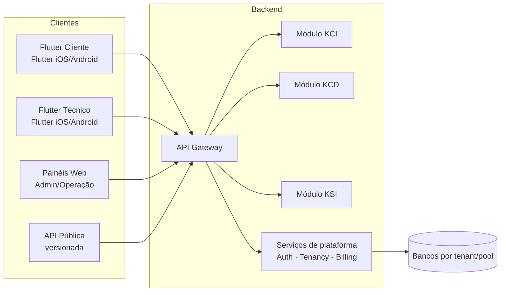
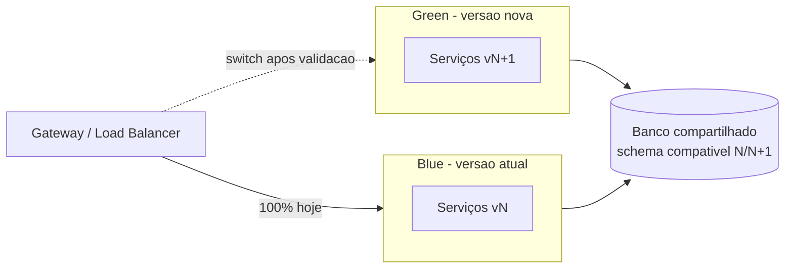
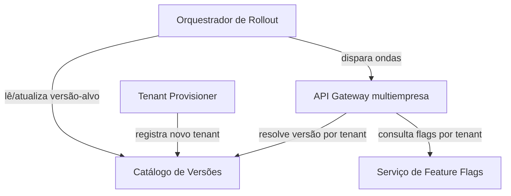
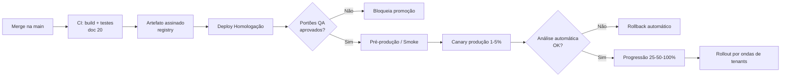
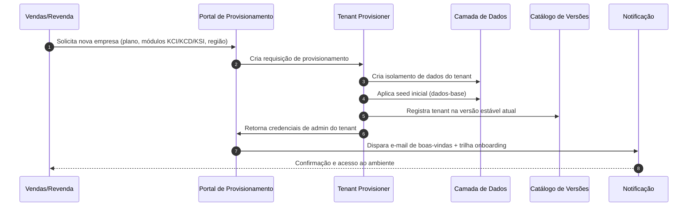
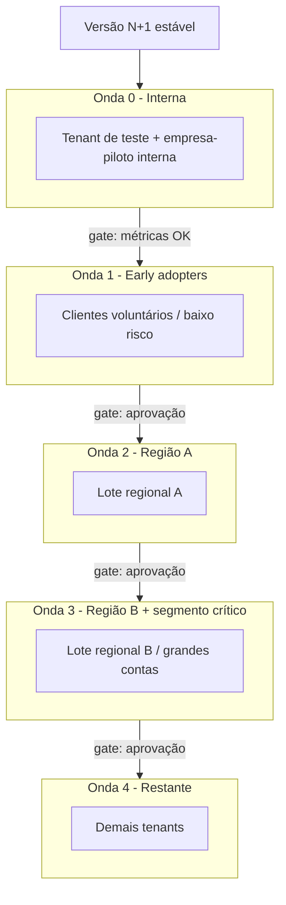
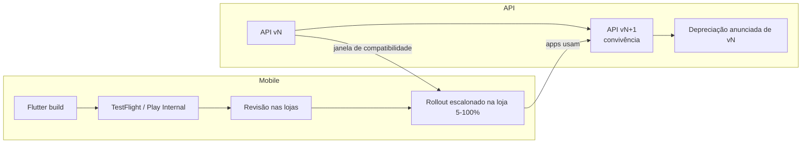
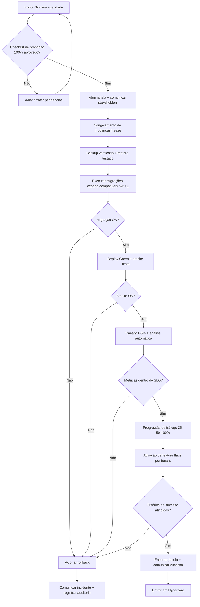
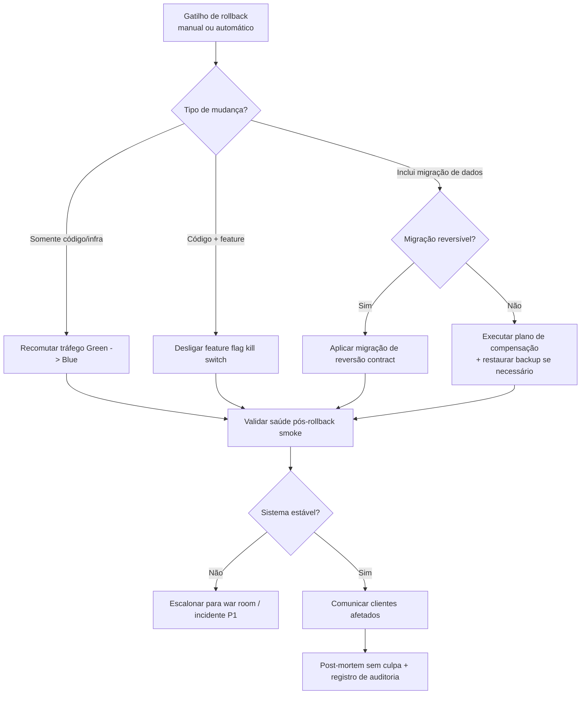
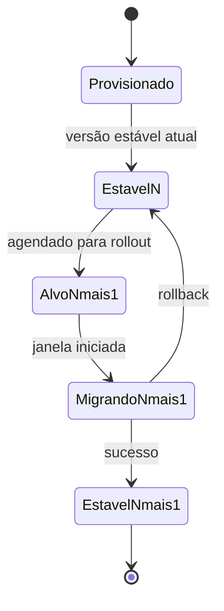

# 21 — Implantação · Drone Kairós ERP

| Campo | Valor |
|---|---|
| **Documento** | 21 — Implantação |
| **Versão** | 1.0 |
| **Data** | 21 de julho de 2026 |
| **Status** | Ativo |
| **Dependências** | 00 a 20 (com ênfase em 07 Arquitetura, 09 Microsserviços, 19 DevOps, 20 QA) |
| **Responsável** | Especialista de Implantação / Go-Live Sênior |
| **Classificação** | Interno · Confidencial |

---

## 1. Resumo Executivo

Este documento define a estratégia, os processos e os controles de **implantação (deployment) e go-live** do **Drone Kairós ERP**, plataforma multiempresa (SaaS) para o ecossistema de drones. Ele traduz a esteira de entrega definida no documento **19 — DevOps** e os portões de qualidade do documento **20 — QA** em um plano operacional executável de colocar valor em produção com risco controlado.

O Drone Kairós ERP é composto por: backend de microsserviços, painéis web administrativos e operacionais, aplicativos móveis **Flutter** (Flutter Cliente e Flutter Técnico), API pública versionada e os módulos de negócio **KCI** (Kairós Cadastro/Inventário), **KCD** (Kairós Comercial/Distribuição) e **KSI** (Kairós Serviços/Inspeção). Por ser multiempresa, a unidade fundamental de implantação não é apenas "uma versão em produção", mas **uma versão promovida por lote de tenants (empresas)**, respeitando isolamento, janelas e maturidade de cada cliente.

A abordagem central combina **blue-green** para troca atômica de infraestrutura, **canary** para exposição progressiva por porcentagem de tráfego e por coorte de tenants, e **feature flags** para desacoplar deploy de release (dark launch e ativação seletiva por empresa). Sobre essa base construímos três fluxos críticos: **onboarding de novos tenants** (provisionamento, dados iniciais, importação), **rollout multiempresa** (ondas por região/segmento com gestão de versão por tenant) e **publicação dos apps móveis** nas lojas (App Store e Google Play) com versionamento coordenado da API pública.

O go-live é governado por um **checklist de prontidão**, **critérios de sucesso mensuráveis**, **janelas de manutenção comunicadas** e um **plano de rollback determinístico**. Após a virada, um período de **hypercare** com monitoramento reforçado, SLAs de resposta encurtados e squad dedicada assegura estabilização. Todo o ciclo é **auditável e rastreável**, aderente aos princípios do canon: segurança por padrão, multiempresa e rastreabilidade ponta a ponta.

**Resultados esperados:** implantações previsíveis com janela reduzida ou zero-downtime, MTTR baixo via rollback ensaiado, onboarding de novos clientes em horas (não semanas) e conformidade de auditoria para cada promoção de versão.

---

## 2. Objetivos

### 2.1 Objetivo geral

Estabelecer um processo de implantação **repetível, seguro, observável e auditável** que permita entregar novas versões do Drone Kairós ERP a múltiplas empresas com o menor risco e o menor impacto operacional possível, reaproveitando integralmente a esteira de CI/CD do documento 19 e os portões de qualidade do documento 20.

### 2.2 Objetivos específicos

| # | Objetivo | Métrica de sucesso |
|---|---|---|
| O1 | Adotar estratégias de release progressivo (blue-green, canary, feature flags) | 100% dos deploys de produção passam por canary antes de exposição total |
| O2 | Padronizar o provisionamento de novos tenants | Tempo de onboarding técnico < 4 horas; provisionamento automatizado > 90% |
| O3 | Habilitar rollout multiempresa em ondas | Rollout de versão maior em ≤ 5 ondas com gate entre ondas |
| O4 | Garantir gestão de versão por tenant | 100% dos tenants com versão declarada e rastreável no catálogo de versões |
| O5 | Coordenar release mobile e versionamento de API | Zero quebra de compatibilidade de API sem período de depreciação anunciado |
| O6 | Reduzir risco de go-live | Rollback ensaiado com RTO ≤ 15 min; taxa de rollback não planejado < 5% |
| O7 | Assegurar estabilização pós-go-live | Hypercare com ≥ 99,9% de disponibilidade na primeira semana |
| O8 | Capacitar técnicos e revendas | ≥ 90% de conclusão do trilha de onboarding antes do acesso produtivo |
| O9 | Garantir auditabilidade | 100% das promoções com registro imutável (quem, o quê, quando, aprovação) |

### 2.3 Não objetivos

- Este documento **não** redefine a esteira de build/test (ver 19 e 20); apenas a **consome**.
- **Não** especifica a arquitetura de software interna dos módulos (ver 07 e 09).
- **Não** trata de política comercial de preços/planos, apenas do impacto técnico do provisionamento por plano.

---

## 3. Escopo

### 3.1 Dentro do escopo

- Estratégias de deploy e release de todos os componentes: backend/microsserviços, painéis web, apps Flutter, API pública e módulos KCI/KCD/KSI.
- Migração de dados de release (schema migrations) e migração de dados de onboarding (carga inicial e importação de clientes novos).
- Provisionamento e onboarding de tenants (empresas) em ambiente multiempresa.
- Rollout por lote de clientes/regiões e gestão de versão por tenant.
- Ciclo de publicação mobile (iOS/Android) e versionamento da API pública.
- Plano de go-live: pré-requisitos, checklist, janelas, comunicação, critérios de sucesso e rollback.
- Treinamento/onboarding de técnicos e revendas.
- Pós-implantação: hypercare, monitoramento inicial e suporte.

### 3.2 Fora do escopo

| Item | Documento de referência |
|---|---|
| Pipelines de CI/CD, IaC, registries, secrets | 19 — DevOps |
| Estratégia de testes, cobertura, automação de QA | 20 — QA |
| Modelagem de dados e catálogo de tabelas | 08 — Banco de Dados |
| Decomposição de serviços e contratos internos | 09 — Microsserviços |
| Requisitos funcionais dos módulos | 06 — Requisitos |

### 3.3 Componentes cobertos

---

## 4. Regras

Regras normativas de implantação. A força de cada regra segue RFC 2119 (**DEVE**, **NÃO DEVE**, **DEVERIA**, **PODE**).

### 4.1 Regras gerais de release

- **R1 — Deploy ≠ Release.** Toda funcionalidade nova **DEVE** entrar em produção atrás de **feature flag** desligada por padrão; a ativação por tenant é uma decisão de release separada do deploy.
- **R2 — Portões de qualidade obrigatórios.** Nenhum artefato **DEVE** ser promovido a produção sem aprovação nos portões do documento 20 (testes, cobertura mínima, segurança, performance).
- **R3 — Imutabilidade de artefato.** O mesmo artefato assinado promovido em homologação **DEVE** ser o promovido em produção (promote-by-digest); rebuild entre ambientes **NÃO DEVE** ocorrer.
- **R4 — Canary obrigatório.** Toda mudança de backend em produção **DEVE** passar por fase canary com análise automática antes de 100% do tráfego.
- **R5 — Rollback ensaiado.** Nenhum go-live **DEVE** ocorrer sem que o rollback correspondente tenha sido testado em homologação na mesma release.

### 4.2 Regras multiempresa

- **R6 — Isolamento.** Uma operação de implantação em um tenant **NÃO DEVE** degradar ou expor dados de outro tenant.
- **R7 — Versão declarada por tenant.** Cada tenant **DEVE** ter uma versão-alvo declarada no **catálogo de versões**; divergências entre versão declarada e versão efetiva **DEVEM** gerar alerta.
- **R8 — Ondas com gate.** O avanço de uma onda de rollout para a próxima **DEVE** exigir aprovação humana (change approver) apoiada por métricas da onda anterior.
- **R9 — Compatibilidade de dados.** Migrações de schema **DEVEM** ser compatíveis com a versão N-1 (expand/contract) durante o período de convivência de versões entre tenants.

### 4.3 Regras de dados e migração

- **R10 — Migração reversível ou compensável.** Toda migração destrutiva **DEVE** possuir plano de reversão ou de compensação documentado antes da execução.
- **R11 — Backup pré-mudança.** Um backup verificado (restore testado) **DEVE** existir imediatamente antes de qualquer migração de produção.
- **R12 — Idempotência de importação.** Rotinas de importação de onboarding **DEVEM** ser idempotentes e re-executáveis sem duplicar dados.

### 4.4 Regras de API e mobile

- **R13 — Versionamento explícito.** A API pública **DEVE** ser versionada (major na URL, minor via cabeçalho) com política de depreciação anunciada com antecedência mínima definida em contrato.
- **R14 — Compatibilidade retroativa mobile.** O backend **DEVE** suportar as duas últimas versões maiores publicadas dos apps (janela de compatibilidade), pois a atualização em loja não é instantânea.
- **R15 — Atualização forçada controlada.** Somente por motivo de segurança crítica um app **PODE** exigir atualização obrigatória (force update); caso contrário a atualização **DEVERIA** ser opcional/incentivada.

### 4.5 Regras de segurança e auditoria

- **R16 — Segurança por padrão.** Segredos, chaves e credenciais **NÃO DEVEM** transitar em artefatos ou logs; toda promoção **DEVE** usar o cofre de segredos definido em 19.
- **R17 — Trilha imutável.** Cada promoção, ativação de flag, provisionamento e rollback **DEVE** gerar registro de auditoria imutável e rastreável ao responsável.

---

## 5. Arquitetura de Release / Implantação

### 5.1 Ambientes e promoção

A esteira reaproveita os ambientes definidos em 19, com promoção linear e unidirecional de artefatos assinados por digest.

| Ambiente | Propósito | Dados | Origem do artefato |
|---|---|---|---|
| **Dev** | Integração contínua | Sintéticos | Build de CI |
| **Homologação (Staging)** | Validação QA, ensaio de migração e rollback | Anonimizados (subset de produção) | Promote do Dev |
| **Pré-produção (Canary infra)** | Espelho de produção; smoke e testes de fumaça | Sintéticos + tenant de teste | Promote do Staging |
| **Produção** | Operação real multiempresa | Reais | Promote do Staging (mesmo digest) |

### 5.2 Estratégias de deploy

**Blue-Green.** Mantém-se dois ambientes idênticos (Blue = ativo, Green = novo). O tráfego é comutado no gateway/load balancer após validação do Green. O rollback é a recomutação para Blue, quase instantâneo. Aplicável a serviços stateless e ao gateway.

**Canary.** A nova versão recebe tráfego incremental (ex.: 1% → 5% → 25% → 50% → 100%), com **análise automática** de métricas de ouro (latência, taxa de erro, saturação) comparando canary vs. baseline. Falha na análise dispara rollback automático. No Kairós, o canary é **duplo**: por **porcentagem de tráfego** e por **coorte de tenants** (empresas-piloto voluntárias primeiro).

**Feature Flags.** Ativação/desativação de funcionalidades em runtime, com segmentação por tenant, por região e por perfil de usuário. Suporta *dark launch* (código em produção, desligado), *kill switch* (desligamento emergencial sem deploy) e *gradual rollout* (percentual de usuários).

| Estratégia | Melhor para | Rollback | Custo de infra |
|---|---|---|---|
| Blue-Green | Troca atômica, gateway, serviços críticos | Recomutação (segundos) | Alto (2x) |
| Canary | Redução progressiva de risco, validação em produção | Reversão de peso de tráfego | Médio |
| Feature Flags | Desacoplar deploy de release; ativação por tenant | Desligar flag (imediato) | Baixo |

### 5.3 Camada multiempresa (tenancy)

O modelo de tenancy (detalhado em 08) influencia diretamente a implantação:

- **Serviço de Tenancy**: resolve o tenant por subdomínio/cabeçalho e injeta contexto em toda requisição.
- **Catálogo de Versões (Version Registry)**: fonte da verdade sobre qual versão cada tenant deve/está executando; consultado pelo gateway e pelo orquestrador de rollout.
- **Provisionador (Tenant Provisioner)**: serviço que cria a estrutura de um novo tenant (isolamento de dados, seed inicial, credenciais, configuração de módulos contratados).
- **Orquestrador de Rollout**: coordena as ondas, aplica gates e reconcilia versão declarada × efetiva.

### 5.4 Reaproveitamento do DevOps (doc 19)

| Recurso do doc 19 | Uso na implantação |
|---|---|
| Pipelines CI/CD | Gatilho de promote, execução de migrações, publicação mobile |
| IaC (infra como código) | Provisionamento de ambientes blue/green e recursos de tenant |
| Registry de artefatos assinados | Promote-by-digest e verificação de assinatura |
| Cofre de segredos | Injeção de credenciais por ambiente/tenant |
| Observabilidade (métricas/logs/traços) | Análise canary, hypercare e critérios de sucesso |
| Gestão de mudanças (change mgmt) | Aprovação de janelas e gates entre ondas |

---

## 6. Diagramas

### 6.1 Pipeline de promoção de release

### 6.2 Provisionamento de novo tenant (onboarding)

### 6.3 Topologia de rollout multiempresa por ondas

### 6.4 Ciclo de release mobile e API

---

## 7. Fluxogramas (Go-Live e Rollback)

### 7.1 Fluxo de Go-Live

### 7.2 Fluxo de Rollback

### 7.3 Árvore de decisão de estratégia por tipo de mudança

| Tipo de mudança | Estratégia recomendada | Rollback primário |
|---|---|---|
| Correção de bug backend (sem schema) | Canary | Reversão de tráfego |
| Nova funcionalidade | Feature flag + dark launch | Desligar flag |
| Mudança de schema aditiva | Expand/contract + canary | Reversão de tráfego (schema compatível) |
| Mudança de schema destrutiva | Migração faseada + backup | Compensação/restore |
| Troca de versão de app mobile | Rollout escalonado em loja | Halt do rollout na loja |
| Mudança maior de API | Nova versão + depreciação | Manter versão anterior ativa |

---

## 8. Boas Práticas

- **BP1 — Zero-downtime por padrão.** Preferir blue-green/canary com migrações expand/contract para evitar janelas de indisponibilidade.
- **BP2 — Small batches.** Entregas pequenas e frequentes reduzem o raio de impacto e facilitam o diagnóstico de regressões.
- **BP3 — Trunk-based + flags.** Integrar cedo e proteger com flags, evitando branches longevos e big-bang releases.
- **BP4 — Expand/Contract sempre.** Toda migração de schema segue as fases: **Expand** (adiciona sem quebrar) → **Migrate** (backfill de dados) → **Contract** (remove o antigo após convivência).
- **BP5 — Automatizar o provisionamento.** Onboarding de tenant como código; nada de passos manuais que introduzam variabilidade entre empresas.
- **BP6 — Empresas-piloto voluntárias.** Iniciar rollout por coorte que aceitou receber versões cedo, com canal de feedback direto.
- **BP7 — Rollback é feature, não exceção.** Ensaiar rollback a cada release; medir RTO real.
- **BP8 — Observabilidade antes do go-live.** Painéis, alertas e SLOs configurados e validados **antes** da virada, não durante.
- **BP9 — Comunicação proativa.** Avisar clientes de janelas e de mudanças que afetam fluxo de trabalho, especialmente técnicos em campo.
- **BP10 — Congelamento consciente.** Aplicar freeze de mudanças não relacionadas durante janelas de alto risco.
- **BP11 — Documentar a decisão.** Cada release registra: o que muda, por quê, risco, plano de rollback e responsável (rastreabilidade).
- **BP12 — Segurança por padrão.** Segredos no cofre, princípio do menor privilégio nas credenciais de provisionamento, e varredura de dependências antes de promover.

---

## 9. Padrões

### 9.1 Versionamento

- **Semântico (SemVer)** para backend e API pública: `MAJOR.MINOR.PATCH`. `MAJOR` sinaliza quebra de contrato.
- **Apps móveis**: `versionName` (marketing, ex.: 3.4.0) + `versionCode`/`build number` monotônico crescente.
- **API pública**: `MAJOR` na URL (`/api/v2/...`), `MINOR` negociável via cabeçalho (`Kairos-Api-Version`), com política de depreciação e cabeçalhos `Deprecation`/`Sunset`.

### 9.2 Convenção de tags e releases

| Artefato | Padrão de tag | Exemplo |
|---|---|---|
| Backend/serviço | `svc/<nome>/vMAJOR.MINOR.PATCH` | `svc/ksi/v2.3.1` |
| Painel web | `web/vMAJOR.MINOR.PATCH` | `web/v4.1.0` |
| App Flutter | `app/<flugtter>/vX.Y.Z+build` | `app/tecnico/v3.4.0+412` |
| API pública | `api/vMAJOR.MINOR` | `api/v2.5` |
| Release de plataforma | `release/AAAA.MM.iteração` | `release/2026.07.2` |

### 9.3 Nomenclatura de feature flags

`kci|kcd|ksi|core.<contexto>.<funcionalidade>` — ex.: `ksi.inspecao.laudo_automatico`. Toda flag possui: dono, data de criação, tipo (release/ops/experimento), critério de remoção e data-limite (evitar dívida de flags).

### 9.4 Janelas de manutenção

- **Baixo risco**: fora do horário de pico regional, sem downtime esperado.
- **Alto risco (migração destrutiva)**: janela anunciada com antecedência mínima acordada em SLA, preferencialmente em janela de baixa atividade de campo.
- **Emergencial (hotfix de segurança)**: pode ocorrer fora de janela, com comunicação imediata.

### 9.5 Classificação de mudança (change management)

| Classe | Descrição | Aprovação |
|---|---|---|
| **Standard** | Pré-aprovada, baixo risco, automatizada | Automática |
| **Normal** | Requer avaliação e janela | Change approver |
| **Emergencial** | Correção urgente | Aprovação expedita + revisão posterior |

---

## 10. Casos de Uso

### 10.1 UC-01 — Release de correção de bug no módulo KSI

**Ator:** Engenharia de plataforma. **Gatilho:** Bug corrigido e mergeado.
**Fluxo:** Promote do artefato → homologação → smoke em pré-produção → canary 5% em produção → análise automática 30 min → progressão a 100% → rollout imediato para todos os tenants (mudança sem schema, baixo risco). **Rollback:** reversão de tráfego. **Resultado:** correção disponível a todos os tenants no mesmo dia.

### 10.2 UC-02 — Lançamento de nova funcionalidade no KCD com ativação seletiva

**Ator:** Produto + Engenharia. **Gatilho:** Feature pronta atrás de flag `kcd.comercial.proposta_dinamica`.
**Fluxo:** Deploy com flag desligada (dark launch) → ativação para 3 empresas-piloto → coleta de feedback e métricas por 1 semana → ativação gradual por região → ativação geral. **Rollback:** desligar flag. **Resultado:** exposição controlada sem novo deploy a cada expansão.

### 10.3 UC-03 — Onboarding de nova revenda (tenant novo)

**Ator:** Revenda/Vendas. **Gatilho:** Contrato assinado.
**Fluxo:** Portal de provisionamento cria o tenant na versão estável → seed inicial → importação do catálogo de drones/clientes da revenda via planilha padronizada (idempotente) → criação de usuários e perfis → disparo da trilha de onboarding. **Resultado:** revenda operacional em < 4 horas, isolada dos demais tenants.

### 10.4 UC-04 — Migração de dados de cliente legado

**Ator:** Equipe de implantação. **Gatilho:** Cliente migrando de sistema antigo.
**Fluxo:** Extração → mapeamento para o modelo Kairós → carga em ambiente de staging do tenant → validação e reconciliação (contagens, amostragem) → carga em produção em janela → verificação → go-live do tenant. **Rollback:** manter sistema legado em paralelo (dual-run) até validação final. **Resultado:** migração auditável com reconciliação assinada.

### 10.5 UC-05 — Release maior de app Flutter Técnico

**Ator:** Mobile + QA. **Gatilho:** Nova versão maior do app.
**Fluxo:** Build Flutter → distribuição beta (TestFlight/Play Internal) → validação → submissão às lojas → rollout escalonado (5% → 20% → 50% → 100%) → monitorar crash-free rate → backend mantém compatibilidade com versão anterior (janela). **Rollback:** halt do rollout na loja + kill switch de features novas via flag. **Resultado:** adoção gradual sem quebrar técnicos em campo com versão antiga.

### 10.6 UC-06 — Rollback emergencial em produção

**Ator:** On-call/SRE. **Gatilho:** Alerta de erro acima do SLO durante canary.
**Fluxo:** Rollback automático dispara reversão de tráfego → validação de saúde → comunicação a clientes afetados → post-mortem sem culpa. **Resultado:** MTTR reduzido, impacto contido ao percentual canary.

### 10.7 UC-07 — Depreciação de versão da API pública

**Ator:** Plataforma + Developer Relations. **Gatilho:** Nova versão maior de API.
**Fluxo:** Publicar `v2` → anunciar depreciação de `v1` com prazo → adicionar cabeçalhos `Deprecation`/`Sunset` → monitorar consumidores de `v1` → suporte à migração → desativar `v1` após o prazo. **Resultado:** transição sem quebra surpresa de integrações de parceiros.

---

## 11. Modelagem (Plano de Rollout)

### 11.1 Estrutura de ondas

| Onda | Público | % da base | Critério de entrada | Gate de saída |
|---|---|---|---|---|
| **0** | Tenant de teste + empresa interna | ~1% | Versão estável em pré-produção | Smoke 100% + zero erro crítico |
| **1** | Early adopters voluntários | ~5% | Onda 0 estável por 48h | SLO mantido + feedback positivo |
| **2** | Região A (baixo risco) | ~25% | Aprovação change approver | Erro < baseline + sem P1 |
| **3** | Região B + grandes contas | ~40% | Aprovação + comunicação prévia | SLO mantido + suporte estável |
| **4** | Restante da base | ~29% | Aprovação final | Reconciliação de versões 100% |

### 11.2 Máquina de estados de versão por tenant

### 11.3 Matriz de decisão de agrupamento de tenants

| Critério | Peso | Efeito no agrupamento |
|---|---|---|
| Criticidade do cliente (SLA) | Alto | Grandes contas em ondas mais tardias |
| Região/fuso | Médio | Janela na madrugada local |
| Volume transacional | Médio | Alto volume separado para observar carga |
| Módulos contratados (KCI/KCD/KSI) | Médio | Agrupar por superfície de mudança |
| Disposição a receber cedo | Alto | Voluntários nas ondas iniciais |

### 11.4 Modelo de dados de suporte (conceitual)

| Entidade | Campos-chave | Propósito |
|---|---|---|
| `tenant` | id, nome, região, plano, módulos, status | Cadastro de empresa |
| `version_registry` | tenant_id, versão_alvo, versão_efetiva, atualizado_em | Gestão de versão por tenant |
| `rollout_wave` | id, release, ordem, critério_gate, status | Definição de ondas |
| `rollout_assignment` | tenant_id, wave_id, estado | Alocação de tenant à onda |
| `deployment_audit` | id, ator, ação, artefato_digest, timestamp, aprovação | Trilha imutável |
| `feature_flag_state` | flag, tenant_id, habilitada, alterado_por, timestamp | Estado de ativação |

---

## 12. Checklist de Prontidão (Go-Live Readiness)

### 12.1 Pré-requisitos técnicos

- [ ] Artefatos assinados e promovidos por digest (sem rebuild entre ambientes) — R3
- [ ] Todos os portões de QA (doc 20) aprovados na release candidata
- [ ] Migrações validadas em homologação (expand/contract) e ensaiadas
- [ ] Rollback ensaiado com RTO medido ≤ 15 min — R5
- [ ] Backup verificado com restore testado — R11
- [ ] Feature flags criadas, desligadas por padrão, com donos definidos
- [ ] Compatibilidade de API N/N-1 confirmada; janela mobile respeitada
- [ ] Observabilidade: painéis, SLOs e alertas configurados e testados
- [ ] Configuração de canary e análise automática ativa em produção

### 12.2 Pré-requisitos de negócio e pessoas

- [ ] Janela de manutenção aprovada e comunicada aos tenants afetados
- [ ] Plano de comunicação (interno e clientes) pronto e agendado
- [ ] Squad de hypercare escalada com plantão definido
- [ ] Trilha de onboarding de técnicos/revendas concluída (≥ 90%)
- [ ] Critérios de sucesso e de rollback documentados e acordados
- [ ] Change approver e responsáveis de gate identificados por onda
- [ ] Base de conhecimento/FAQ e roteiro de suporte atualizados

### 12.3 Critérios de sucesso do go-live

| Critério | Meta | Fonte |
|---|---|---|
| Disponibilidade na janela | ≥ 99,9% | Observabilidade |
| Taxa de erro pós-virada | ≤ baseline + 0,5 p.p. | Métricas de ouro |
| Latência P95 | Dentro do SLO | APM |
| Crash-free (mobile) | ≥ 99,5% | Telemetria de app |
| Rollback não planejado | Nenhum | Registro de deploy |
| Chamados críticos (P1) nas primeiras 24h | 0 | Suporte/ITSM |
| Reconciliação de versões por tenant | 100% consistente | Catálogo de versões |

### 12.4 Go / No-Go

Decisão formal registrada em ata, com representantes de Engenharia, QA, Produto, Suporte e Implantação. **No-Go** se qualquer pré-requisito técnico bloqueante estiver aberto.

---

## 13. Riscos

| ID | Risco | Prob. | Impacto | Mitigação | Contingência |
|---|---|---|---|---|---|
| RSK-01 | Migração de schema incompatível quebra tenants em versões diferentes | Média | Alto | Expand/contract obrigatório (R9); testes em staging | Rollback via schema compatível; compensação |
| RSK-02 | Vazamento entre tenants durante provisionamento | Baixa | Crítico | Isolamento por design (R6); testes de segurança | Isolar tenant afetado; incidente P1; notificação |
| RSK-03 | Rejeição/atraso na revisão das lojas (App Store/Play) | Média | Médio | Submissão antecipada; buffer no cronograma | Manter versão anterior; comunicar usuários |
| RSK-04 | App antigo em campo incompatível com backend novo | Média | Alto | Janela de compatibilidade N/N-1 (R14) | Reativar compatibilidade; hotfix de backend |
| RSK-05 | Canary não detecta regressão de baixa frequência | Baixa | Médio | Duração mínima de canary; métricas por tenant | Rollback ao detectar; alerta estendido |
| RSK-06 | Importação de dados de onboarding duplica registros | Média | Médio | Idempotência (R12); reconciliação | Re-execução limpa; rollback do tenant |
| RSK-07 | Janela de manutenção mal comunicada gera insatisfação | Média | Médio | Plano de comunicação; antecedência de SLA | Compensação comercial; retrospectiva |
| RSK-08 | Dívida de feature flags obsoletas | Alta | Baixo | Data-limite e dono por flag (padrão 9.3) | Faxina periódica de flags |
| RSK-09 | Rollback de migração destrutiva sem reversão | Baixa | Crítico | Proibir destrutivo sem plano (R10); backup (R11) | Restore de backup; war room |
| RSK-10 | Sobrecarga do suporte no hypercare | Média | Médio | Squad dedicada; FAQ; escalonamento claro | Reforço temporário; priorização P1/P2 |
| RSK-11 | Depreciação de API surpreende parceiros | Média | Alto | Anúncio antecipado (R13); cabeçalhos Sunset | Prorrogar prazo; suporte à migração |

---

## 14. Melhorias Futuras

- **MF1 — Rollout progressivo totalmente orientado a SLO.** Evoluir a análise canary para *progressive delivery* automatizada, avançando ondas sem gate manual quando métricas estiverem verdes por tempo definido.
- **MF2 — Autoatendimento de onboarding.** Portal self-service para revendas provisionarem seus próprios sub-tenants dentro de limites contratados.
- **MF3 — Rollback por tenant granular.** Capacidade de reverter a versão de um único tenant sem afetar a onda, via roteamento por versão no gateway.
- **MF4 — Testes de migração automatizados com dados de produção anonimizados** por release.
- **MF5 — Catálogo de versões preditivo.** Recomendação de agrupamento de ondas com base em histórico de incidentes por perfil de tenant.
- **MF6 — Chaos engineering na esteira** para validar resiliência de rollback e isolamento multiempresa.
- **MF7 — Feature flags com limpeza automatizada** (alerta e PR automático de remoção após data-limite).
- **MF8 — Blue-green de banco** para migrações destrutivas de alto risco com corte reversível.

---

## 15. Auditoria

### 15.1 Princípio

Aderente ao canon (**rastreabilidade**), toda ação de implantação é registrada de forma **imutável, atribuível e verificável**. Nenhuma promoção, ativação de flag, provisionamento ou rollback ocorre sem trilha (R17).

### 15.2 Eventos auditados

| Evento | Dados registrados |
|---|---|
| Promoção de artefato | Digest, origem→destino, ator, aprovação, timestamp |
| Execução de migração | Script, versão, tenant(s), resultado, backup de referência |
| Provisionamento de tenant | Empresa, plano, módulos, executor, seed aplicado |
| Ativação/desativação de flag | Flag, tenant, estado, ator, motivo |
| Avanço de onda de rollout | Onda, aprovador, métricas do gate |
| Rollback | Gatilho (manual/auto), tipo, RTO real, impacto |
| Publicação mobile | Versão, loja, % de rollout, responsável |
| Depreciação de API | Versão, data de anúncio, data de sunset |

### 15.3 Rastreabilidade e retenção

- Cada evento correlaciona-se por **ID de release** e **ID de mudança**, permitindo reconstruir a linha do tempo completa de qualquer versão em qualquer tenant.
- Logs de auditoria **NÃO DEVEM** conter segredos ou dados sensíveis de tenant (segurança por padrão — R16).
- Retenção conforme política de compliance da plataforma; registros de mudança de produção com retenção estendida.

### 15.4 Indicadores de conformidade

| Indicador | Meta |
|---|---|
| Promoções com trilha completa | 100% |
| Divergência versão declarada × efetiva | 0 (alerta automático se > 0) |
| Rollbacks com post-mortem registrado | 100% |
| Flags além da data-limite | Tendência a 0 |
| Provisionamentos automatizados vs. manuais | > 90% automatizado |

---

### Pós-Implantação — Hypercare, Monitoramento e Suporte

> Detalhamento operacional referenciado nas seções 1, 7 e 12.

**Hypercare (janela de estabilização — tipicamente 1 a 4 semanas por onda crítica):**

| Dimensão | Padrão hypercare | Retorno ao normal |
|---|---|---|
| SLA de resposta P1 | Encurtado (ex.: 15 min) | SLA contratual padrão |
| Cobertura de plantão | Squad dedicada 24x7 | On-call regular |
| Cadência de status | Diária (war room) | Semanal |
| Monitoramento | Painéis dedicados + alertas sensibilizados | Alertas padrão |
| Critério de saída | SLOs estáveis + zero P1 por N dias | Aprovação formal |

**Monitoramento inicial:** foco nas métricas de ouro (latência, erros, saturação, tráfego) segmentadas **por tenant** e **por módulo (KCI/KCD/KSI)**, além de crash-free rate dos apps Flutter e taxa de sucesso de onboarding. Alertas calibrados para sensibilidade elevada durante o hypercare.

**Suporte e treinamento (técnicos/revendas):**
- Trilha de onboarding obrigatória antes do acesso produtivo (≥ 90% de conclusão — R8 de negócio).
- Material por perfil: técnico de campo (Flutter Técnico), atendente/revenda (painel + Flutter Cliente), administrador de tenant.
- Canal de feedback direto durante empresas-piloto e ondas iniciais.
- Base de conhecimento e FAQ atualizados a cada release, com roteiro de escalonamento (N1 → N2 → engenharia).

---

*Fim do Documento 21 — Implantação · Drone Kairós ERP · v1.0*
