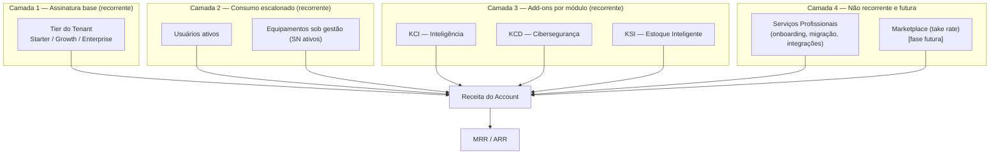
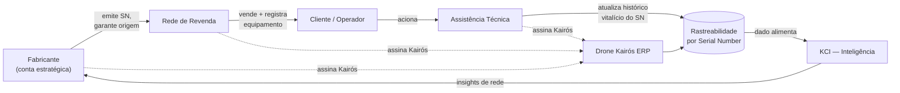
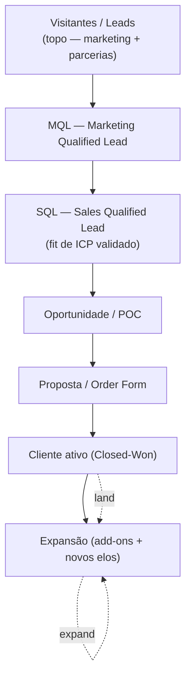
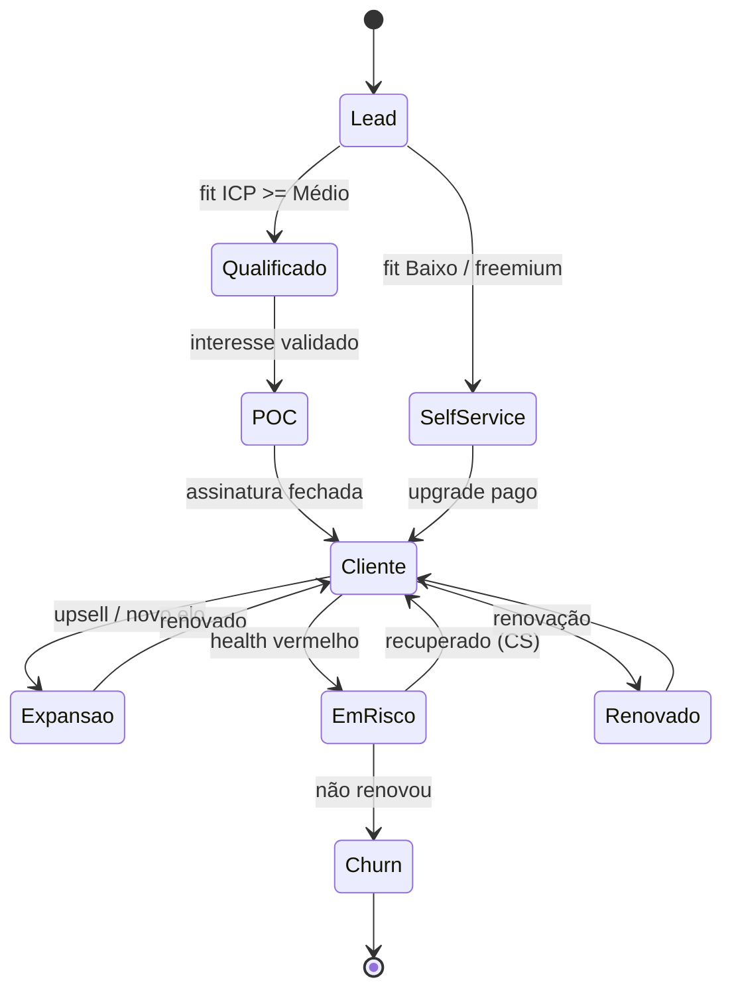
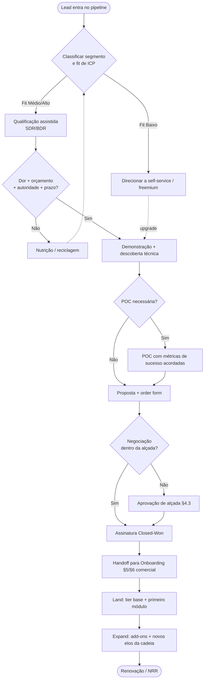
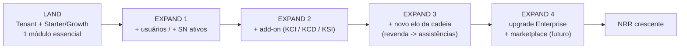
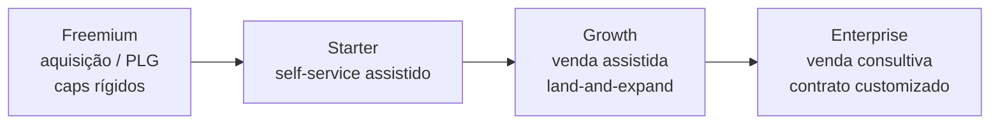
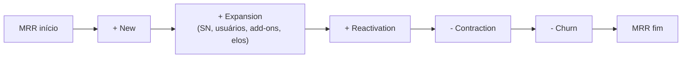

# 22 — Comercial · Drone Kairós ERP

| Campo | Valor |
|---|---|
| **Documento** | 22 — Comercial |
| **Versão** | 1.0 |
| **Data** | 21 de julho de 2026 |
| **Status** | Ativo |
| **Dependências** | 00 a 21 (com ênfase em 05 — Análise Competitiva, 10 — Arquitetura Multiempresa, 14 — KCI, 15 — KCD, 16 — KSI, 18 — Rastreabilidade por Serial Number) |
| **Responsável** | Estratégia de Negócio |

> **Aviso sobre valores:** todos os preços, percentuais, metas e projeções financeiras neste documento são **EXEMPLOS ILUSTRATIVOS** para fins de modelagem comercial. Não constituem tabela de preço oficial nem compromisso contratual. Os valores oficiais são publicados no *pricebook* vigente controlado pela área Comercial/Finanças.

---

## 1. Resumo Executivo

O **Drone Kairós ERP** é uma plataforma multiempresa (SaaS) desenhada para orquestrar o ciclo completo do ecossistema de drones — do **fabricante** à **revenda**, da **assistência técnica** ao **cliente final/operador** — com rastreabilidade vitalícia por **Serial Number (SN)** e módulos diferenciados de inteligência (**KCI**), cibersegurança (**KCD**) e estoque inteligente (**KSI**).

Este documento define o **motor comercial** do produto: como monetizamos, quem é o cliente ideal, como precificamos, por quais canais chegamos ao mercado, como nos posicionamos frente aos concorrentes mapeados no documento 05 e quais métricas governam a saúde do negócio.

**Tese comercial central.** O valor do Kairós cresce com a **rede**: quanto mais elos da cadeia (fabricante, revenda, técnico) operam sobre a mesma plataforma, mais forte fica a rastreabilidade por SN e mais difícil é o *churn*. Isso sustenta uma estratégia **land-and-expand** com forte efeito de rede e receita expansível (add-ons por módulo e por equipamento rastreado).

**Modelo de receita (síntese):**

- **Assinatura SaaS recurring** por *tenant*, escalonada em **tiers** (Starter → Growth → Enterprise), com componentes de consumo por **usuário ativo** e por **equipamento sob gestão (SN ativo)**.
- **Add-ons por módulo** — KCI, KCD e KSI ativáveis de forma modular sobre qualquer tier.
- **Marketplace futuro** (peças, serviços, integrações de terceiros) com receita de *take rate*.
- **Serviços profissionais** (onboarding avançado, migração, integrações customizadas) como receita não recorrente que acelera adoção.

**Metas-âncora (exemplo ilustrativo, horizonte 24 meses):**

| Indicador | Meta 12 meses (ex.) | Meta 24 meses (ex.) |
|---|---|---|
| ARR | R$ 6,0 mi | R$ 18,0 mi |
| Logos ativos (tenants pagantes) | 120 | 380 |
| NRR (Net Revenue Retention) | ≥ 108% | ≥ 118% |
| Gross churn lógico (logo) | ≤ 2,0% a.m. | ≤ 1,2% a.m. |
| CAC payback | ≤ 14 meses | ≤ 10 meses |
| LTV/CAC | ≥ 3,0x | ≥ 4,0x |

---

## 2. Objetivos

**Objetivo geral.** Estabelecer um modelo comercial replicável, previsível e escalável que transforme a proposta técnica do Kairós (multiempresa + rastreabilidade por SN + módulos KCI/KCD/KSI) em receita recorrente saudável e defensável.

**Objetivos específicos:**

1. **Monetização clara** — definir modelo de negócio, tiers e add-ons com lógica de valor transparente por *tenant*, usuário e SN.
2. **Foco de mercado** — formalizar segmentação e ICP (Ideal Customer Profile) para direcionar esforço comercial ao público de maior *fit* e menor CAC.
3. **Previsibilidade de receita** — instrumentar MRR/ARR, coortes e *forecast* com governança de *pipeline*.
4. **Eficiência de aquisição** — desenhar GTM multicanal (direto, parcerias com fabricantes, revendas) que reduza CAC e acelere *time-to-value*.
5. **Expansão programada** — operacionalizar land-and-expand via módulos e novos elos da cadeia dentro do mesmo *account*.
6. **Retenção estrutural** — usar rastreabilidade e efeito de rede como *moat* comercial, elevando NRR e reduzindo *churn*.
7. **Excelência de pós-venda** — padronizar onboarding, suporte e SLAs comerciais para sustentar renovação e *upsell*.

**Critérios de sucesso (exemplos):** LTV/CAC ≥ 3x; NRR ≥ 110%; *win rate* em oportunidades qualificadas ≥ 25%; *time-to-first-value* ≤ 21 dias no tier Starter.

---

## 3. Escopo

**Está no escopo deste documento:**

- Modelo de negócio SaaS, add-ons modulares e visão de marketplace.
- Segmentação de mercado e definição de ICP e *personas* de compra.
- Estrutura de precificação (tiers, dimensões de cobrança, freemium vs enterprise).
- Estratégia de go-to-market, canais, aquisição e land-and-expand.
- Posicionamento, proposta de valor e diferenciação competitiva.
- Onboarding comercial, suporte e SLAs sob a ótica comercial.
- Métricas de negócio (MRR, ARR, CAC, LTV, churn, NRR) e sua governança.

**Fora do escopo (tratado em outros documentos):**

- Especificação técnica dos módulos KCI/KCD/KSI (docs 14–16).
- Arquitetura multiempresa e isolamento de dados por *tenant* (doc 10).
- Detalhamento jurídico de contratos, LGPD e termos de uso (docs de Jurídico/Compliance).
- Precificação oficial vigente (pricebook controlado por Comercial/Finanças).
- Operação financeira de *billing*, impostos e reconhecimento de receita (doc de Financeiro/Faturamento).

**Premissas:** cobrança em BRL (com possibilidade futura de USD para exportação); ciclo de faturamento mensal e anual; contratos B2B; faturamento por *tenant* raiz com consolidação de subunidades quando aplicável.

---

## 4. Regras

### 4.1 Regras de modelo e cobrança (RC)

- **RC-01** — Toda conta paga é ancorada em um **tenant** e um **tier** base; add-ons de módulo só existem sobre um tier ativo.
- **RC-02** — As **dimensões de cobrança** são três: (a) tier base do tenant, (b) usuários ativos, (c) equipamentos sob gestão (SN ativos). Nenhuma cobrança oculta fora dessas dimensões e dos add-ons publicados.
- **RC-03** — **SN ativo** é a unidade de valor da rastreabilidade: um equipamento passa a ser cobrado quando seu SN é colocado em gestão ativa (histórico vitalício, vínculos de garantia/serviço). SNs arquivados/aposentados não contam para *billing*.
- **RC-04** — **Freemium** é limitado por *caps* explícitos (ver §11) e nunca inclui módulos KCD ou KCI premium; serve para aquisição e prova de valor, não para operação em escala.
- **RC-05** — **Anual à vista** recebe desconto padrão frente ao mensal (exemplo: ~2 meses grátis / ~16%); *downgrade* só na renovação; *upgrade* a qualquer momento com cobrança pro-rata.
- **RC-06** — **Enterprise** admite contrato customizado (volume, SLAs reforçados, *private cloud*/isolamento dedicado), sempre documentado em *order form*.
- **RC-07** — **Descontos** seguem matriz de alçada (ver §4.3); descontos acima da alçada exigem aprovação de Estratégia de Negócio/Finanças.
- **RC-08** — **Marketplace** (fase futura) cobra *take rate* sobre transações; nunca substitui a assinatura base.

### 4.2 Regras de segmentação (RS)

- **RS-01** — Oportunidades são classificadas por **segmento** (fabricante, rede de revenda, assistência técnica/operador) e por **fit de ICP** (Alto/Médio/Baixo) na entrada do *pipeline*.
- **RS-02** — Contas de **fit Baixo** não recebem esforço de venda direto assistido; são direcionadas a *self-service*/freemium.
- **RS-03** — **Fabricantes** são tratados como contas estratégicas (efeito de rede a jusante) e podem habilitar programa de parceria/co-venda.

### 4.3 Regras de alçada de desconto (exemplo ilustrativo)

| Faixa de desconto sobre lista | Alçada aprovadora |
|---|---|
| 0% – 10% | Executivo(a) de Vendas |
| 11% – 20% | Gerência Comercial |
| 21% – 30% | Diretoria Comercial |
| > 30% ou termos não padronizados | Estratégia de Negócio + Finanças |

### 4.4 Regras de retenção e expansão (RE)

- **RE-01** — Renovações são iniciadas com **90 dias** de antecedência para Enterprise, **45 dias** para Growth.
- **RE-02** — Conta com *health score* vermelho não pode receber ação de *upsell* antes de plano de recuperação (CS).
- **RE-03** — Expansão por novo elo da cadeia (ex.: revenda convidando suas assistências) tem trilha de *referral* com incentivo (ver §10 UC-05).

---

## 5. Arquitetura do Modelo Comercial

O modelo comercial é estruturado em **quatro camadas** que se combinam para formar a receita total de um *account*.

**Princípios de arquitetura comercial:**

1. **Base + expansão** — a assinatura base garante previsibilidade; consumo (usuários/SN) e add-ons capturam o valor crescente conforme a operação do cliente escala.
2. **Modularidade** — KCI/KCD/KSI são independentes e ativáveis sob demanda, permitindo *land* enxuto e *expand* granular.
3. **Ancoragem em valor** — o SN ativo alinha preço a valor entregue (rastreabilidade vitalícia), não a custo de infraestrutura.
4. **Efeito de rede monetizável** — cada novo elo da cadeia sobre a plataforma aumenta densidade de dados por SN e cria novos pontos de receita.
5. **Consistência multiempresa** — a arquitetura de *tenant* (doc 10) permite consolidar faturamento de grupos econômicos (fabricante com múltiplas unidades, rede com filiais).

---

## 6. Diagramas

### 6.1 Ecossistema comercial e fluxo de valor

### 6.2 Funil comercial (pirâmide de conversão)

### 6.3 Estados comerciais de um account

---

## 7. Fluxogramas — Jornada de Venda

### 7.1 Jornada comercial ponta a ponta

### 7.2 Land-and-expand dentro do account

---

## 8. Boas Práticas

**Vendas e qualificação:**

- Qualificar por **fit de ICP antes de esforço**; não tratar volume como qualidade de *pipeline*.
- Vender **valor de rede e rastreabilidade**, não *features* isoladas — o SN vitalício é o diferencial narrativo.
- Usar **POC com critérios de sucesso escritos** para encurtar ciclo e reduzir *churn* pós-venda.
- Ancorar preço em **valor por SN/usuário**, evitando corrida ao desconto.

**Land-and-expand:**

- Fazer *land* **enxuto** (tier base + um módulo) para acelerar *time-to-value*; expandir com dados de uso.
- Mapear o **grafo da cadeia** de cada conta (quais revendas, quais assistências) e usar como roteiro de expansão.
- Instrumentar **gatilhos de expansão** (ex.: uso de SN acima de X% do cap → conversa de *upsell*).

**Precificação e descontos:**

- Preferir **desconto anual** (fluxo de caixa + retenção) a desconto sobre lista.
- Manter **pricebook versionado** e *grandfathering* transparente em reajustes.
- Publicar **limites de freemium** com clareza para evitar frustração e *support load*.

**Pós-venda:**

- Definir **health score** com sinais de produto (adoção de módulos, SN ativos, logins) e de relacionamento.
- Tratar **renovação como processo**, iniciado com antecedência (RE-01), não como evento.

---

## 9. Padrões

### 9.1 Padrões de nomenclatura comercial

- **Tiers:** `Starter`, `Growth`, `Enterprise` (não usar sinônimos ad-hoc em propostas).
- **Add-ons:** `Add-on KCI`, `Add-on KCD`, `Add-on KSI`.
- **Dimensões de cobrança:** `tier_base`, `usuario_ativo`, `sn_ativo`.
- **Estágios de pipeline:** `Lead → MQL → SQL → Oportunidade → Proposta → Closed-Won/Closed-Lost`.

### 9.2 Padrões de proposta (order form)

Toda proposta deve conter: identificação do *tenant* raiz; tier; quantidades contratadas por dimensão; add-ons; ciclo (mensal/anual); descontos e alçada aprovadora; SLAs aplicáveis; data de início e renovação; escopo de serviços profissionais (se houver).

### 9.3 Padrões de dados comerciais (CRM)

- Uma **oportunidade** por ciclo de compra, vinculada a um *account*.
- **MRR** registrado por linha (base, consumo, cada add-on) para permitir análise de *waterfall* (new/expansion/contraction/churn).
- **Motivo de perda** obrigatório em Closed-Lost (taxonomia controlada: preço, *fit*, concorrente, *timing*, sem decisão).

### 9.4 Padrão de reconhecimento de expansão vs. novo negócio

- **New business:** primeiro contrato de um *account*.
- **Expansion:** aumento de MRR no mesmo *account* (mais SN/usuários, novo add-on, novo elo).
- **Contraction:** redução sem cancelamento total. **Churn:** cancelamento total do *account*.

---

## 10. Casos de Uso

**UC-01 — Fabricante como âncora de rede.**
Um fabricante adota o Kairós (Enterprise) para emitir e rastrear SNs de fábrica. Ao exigir/estimular que suas revendas registrem vendas na plataforma, gera *pipeline* qualificado a jusante. *Resultado comercial:* CAC reduzido nas revendas (venda referida) e efeito de rede que eleva o valor do KCI para o fabricante.

**UC-02 — Rede de revenda multiunidade.**
Rede com 30 lojas contrata Growth consolidado no *tenant* raiz, com cobrança por usuários e SN das filiais. *Expand:* add-on KSI para estoque inteligente entre lojas. *Métrica-chave:* NRR via crescimento de SN ativos.

**UC-03 — Assistência técnica / operador.**
Assistência entra via Starter (ou freemium) para gerir ordens de serviço e histórico por SN. *Expand:* add-on KCD quando passa a lidar com dados sensíveis de missões/clientes corporativos.

**UC-04 — Freemium → pago (self-service).**
Operador individual usa freemium (cap de SN e usuários). Ao ultrapassar o cap ou precisar de relatórios KCI, converte para Starter/Growth sem toque humano. *Métrica:* taxa de conversão freemium→pago.

**UC-05 — Land-and-expand por referral de cadeia.**
Cliente Growth (revenda) convida suas assistências parceiras; cada assistência ativada gera crédito/incentivo. *Resultado:* expansão de logos com CAC marginal baixo e maior densidade de dados por SN.

**UC-06 — Upsell disparado por uso.**
Conta atinge 85% do cap de SN do tier. Gatilho automático abre tarefa de CS/Vendas para *upgrade*. *Resultado:* expansão proativa, sem atrito de limite atingido.

**UC-07 — Enterprise com requisitos de segurança.**
Cliente corporativo exige isolamento dedicado e SLAs reforçados; contrata Enterprise + KCD com *order form* customizado e SLA de suporte prioritário.

---

## 11. Modelagem — Planos e Métricas

### 11.1 Tabela de planos (EXEMPLO ILUSTRATIVO)

> Valores em BRL, ilustrativos, por mês, ciclo mensal. Anual à vista ~16% de desconto (RC-05).

| Dimensão | **Freemium** | **Starter** | **Growth** | **Enterprise** |
|---|---|---|---|---|
| Preço base / mês | R$ 0 | R$ 490 | R$ 1.900 | Sob consulta (a partir de ~R$ 6.500) |
| Usuários inclusos | 2 | 5 | 20 | Customizado |
| Usuário adicional / mês | — (cap) | R$ 60 | R$ 45 | Negociado por volume |
| SN ativos inclusos | 25 | 300 | 2.000 | Customizado |
| SN adicional (pacote 100) / mês | — (cap) | R$ 70 | R$ 55 | Negociado por volume |
| Rastreabilidade vitalícia por SN | Básica | Completa | Completa | Completa + retenção estendida |
| Multiempresa (subunidades) | 1 | 1 | Até 10 | Ilimitado / grupo econômico |
| Add-on KCI (Inteligência) | ✕ | Opcional | Opcional | Incluído (tier superior) |
| Add-on KCD (Cibersegurança) | ✕ | Opcional | Opcional | Incluído / reforçado |
| Add-on KSI (Estoque Inteligente) | ✕ | Opcional | Opcional | Opcional / incluído |
| Suporte | Comunidade | E-mail (8x5) | Prioritário (12x5) | Dedicado (24x7) + CSM |
| SLA de uptime | Best effort | 99,5% | 99,7% | 99,9% |
| Onboarding | Autoguiado | Guiado padrão | Assistido | Serviços profissionais |

### 11.2 Add-ons por módulo (EXEMPLO ILUSTRATIVO)

| Add-on | Preço / mês (sobre tier) | Cobrança principal | Observação |
|---|---|---|---|
| **KCI — Inteligência** | a partir de R$ 690 | por tenant + faixa de SN | insights de rede, previsões, benchmarks |
| **KCD — Cibersegurança** | a partir de R$ 890 | por tenant | trilhas de auditoria, hardening, alertas |
| **KSI — Estoque Inteligente** | a partir de R$ 590 | por tenant + nº de locais | reposição preditiva, giro por SN |

### 11.3 Freemium vs Enterprise (posição no espectro)

### 11.4 Métricas de negócio — definições e fórmulas

| Métrica | Definição | Fórmula (referência) |
|---|---|---|
| **MRR** | Receita recorrente mensal normalizada | Σ receita recorrente do mês (base + consumo + add-ons) |
| **ARR** | Receita recorrente anualizada | MRR × 12 |
| **CAC** | Custo de aquisição de cliente | (custo S&M do período) ÷ (nº novos clientes) |
| **LTV** | Valor do tempo de vida do cliente | (ARPA × margem bruta) ÷ churn de receita |
| **Gross Churn** | Perda de receita/logos sem contar expansão | receita perdida ÷ receita início período |
| **NRR** | Retenção líquida de receita | (MRR início + expansão − contração − churn) ÷ MRR início |
| **CAC Payback** | Meses para recuperar o CAC | CAC ÷ (ARPA × margem bruta mensal) |
| **ARPA** | Receita média por conta | MRR total ÷ nº de contas |

### 11.5 MRR waterfall (composição do movimento mensal)

### 11.6 Metas por métrica (EXEMPLO ILUSTRATIVO)

| Métrica | Alvo saudável (ex.) | Alerta (ex.) |
|---|---|---|
| NRR | ≥ 110% | < 100% |
| LTV/CAC | ≥ 3,0x | < 2,0x |
| CAC Payback | ≤ 12 meses | > 18 meses |
| Gross churn (logo, mensal) | ≤ 1,5% | > 3,0% |
| Margem bruta SaaS | ≥ 75% | < 65% |
| Conversão freemium→pago | ≥ 4% | < 2% |

---

## 12. Checklist

**Checklist de qualificação de oportunidade:**

- [ ] Segmento identificado (fabricante / revenda / assistência-operador).
- [ ] Fit de ICP classificado (Alto/Médio/Baixo).
- [ ] Dor mapeada e vinculada a módulo/valor (rastreabilidade, KCI, KCD, KSI).
- [ ] Autoridade e orçamento confirmados.
- [ ] Critérios de sucesso da POC acordados por escrito (se aplicável).

**Checklist de proposta (order form):**

- [ ] Tenant raiz e tier definidos.
- [ ] Quantidades por dimensão (usuários, SN) dimensionadas com folga de crescimento.
- [ ] Add-ons selecionados e justificados.
- [ ] Ciclo (mensal/anual) e desconto dentro da alçada (§4.3).
- [ ] SLAs e escopo de serviços profissionais explícitos.

**Checklist de fechamento e handoff:**

- [ ] Order form assinado e registrado no CRM.
- [ ] MRR decomposto por linha (base/consumo/add-ons).
- [ ] Handoff formal para Onboarding/CS com contexto e metas de valor.
- [ ] Data de renovação e responsável definidos.

**Checklist de expansão/renovação:**

- [ ] Health score verde e adoção de módulos verificada.
- [ ] Gatilhos de uso (SN/usuários próximos do cap) revisados.
- [ ] Oportunidade de novo elo da cadeia avaliada.
- [ ] Renovação iniciada no prazo (RE-01).

---

## 13. Riscos

| ID | Risco | Prob. | Impacto | Mitigação |
|---|---|---|---|---|
| R-01 | **Concorrência** de ERPs generalistas ou verticais (ver doc 05) pressiona preço e diferenciação | Média | Alto | Reforçar *moat* de rastreabilidade por SN + efeito de rede; posicionamento vertical; provas de ROI |
| R-02 | **Complexidade de preço** (3 dimensões + add-ons) gera atrito na venda | Média | Médio | Calculadora comercial, pacotes pré-configurados, propostas guiadas |
| R-03 | **CAC alto** em Enterprise sem *pipeline* de parceiros | Média | Alto | Priorizar parcerias com fabricantes (co-venda) e *referral* de cadeia |
| R-04 | **Freemium canibaliza** planos pagos se caps forem generosos demais | Média | Médio | Caps calibrados; bloqueio de módulos premium no freemium (RC-04) |
| R-05 | **Churn concentrado** em contas pequenas de baixo *fit* | Alta | Médio | Filtro de ICP na entrada; *self-service* para fit Baixo (RS-02) |
| R-06 | **Dependência de poucas contas âncora** (fabricantes) | Média | Alto | Diversificar base; expandir logos por revendas/assistências |
| R-07 | **Descontos fora de alçada** corroem margem | Média | Médio | Matriz de alçada (§4.3) e governança de aprovação |
| R-08 | **Time-to-value longo** eleva *churn* precoce | Média | Alto | Land enxuto, onboarding padronizado, metas de valor no handoff |
| R-09 | **Reajustes** mal comunicados geram atrito de renovação | Baixa | Médio | Pricebook versionado, *grandfathering* e comunicação antecipada |
| R-10 | **Marketplace futuro** sem massa crítica de oferta/demanda | Média | Médio | Lançar após densidade de rede; começar com peças/serviços de parceiros âncora |

---

## 14. Melhorias Futuras

1. **Marketplace transacional** — peças, serviços de assistência e integrações de terceiros com *take rate*, aproveitando o grafo de SN.
2. **Precificação por valor/uso avançada** — pacotes baseados em resultados (ex.: preço por SN sob garantia gerida, por missão rastreada).
3. **Programa de parcerias formal** — níveis (revenda autorizada, integrador, fabricante âncora) com *revenue share* e co-marketing.
4. **PLG reforçado** — *self-service* completo do Freemium ao Growth com *product-qualified leads* (PQL) automáticos.
5. **Expansão internacional** — cobrança em USD, *pricebook* multimoeda e *localization* comercial para exportação de fabricantes.
6. **Motor de *pricing* dinâmico** — recomendação de tier/add-on por padrão de uso e coorte.
7. **Bundles verticais** — pacotes prontos por perfil (Fabricante Pro, Rede Multiloja, Assistência Certificada).
8. **Marketplace de dados/benchmark (KCI)** — insights agregados de rede como produto premium (respeitando privacidade/LGPD).

---

## 15. Auditoria

**Controle de versão do documento:**

| Versão | Data | Autor | Alteração |
|---|---|---|---|
| 1.0 | 21/07/2026 | Estratégia de Negócio | Emissão inicial do documento Comercial |

**Trilha de auditoria comercial (o que deve ser rastreável):**

- **Alterações de pricebook** — versão, data, responsável, itens alterados e política de *grandfathering*.
- **Descontos concedidos** — oportunidade, percentual, alçada aprovadora, justificativa (§4.3).
- **Movimentos de MRR** — *log* de new/expansion/contraction/churn por *account* e linha de receita.
- **Renovações** — data-alvo, antecedência (RE-01), resultado e motivo (se perda).
- **Handoffs Vendas→CS** — metas de valor acordadas e cumprimento.

**Cadência de revisão:**

- **Mensal** — revisão de métricas (MRR, ARR, churn, NRR, CAC/LTV) em comitê comercial.
- **Trimestral** — revisão de tiers, add-ons e desempenho de canais/parcerias.
- **Anual** — revisão estrutural de posicionamento (vs doc 05) e política de preços.

**Dependências e consistência:** este documento deve permanecer consistente com os documentos 00–21; qualquer mudança em módulos (14–16), arquitetura multiempresa (10) ou rastreabilidade por SN (18) exige reavaliação do modelo comercial aqui descrito.

---

> **Nota final:** valores, tiers e metas são ilustrativos e servem à modelagem estratégica. A tabela de preços oficial, os SLAs contratuais e as condições comerciais vigentes são governados pelo pricebook e pelos contratos oficiais mantidos por Comercial, Finanças e Jurídico.
