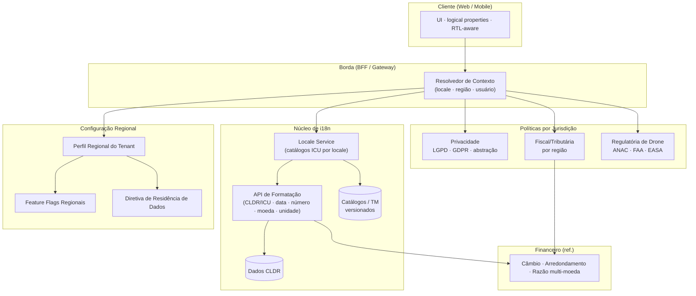
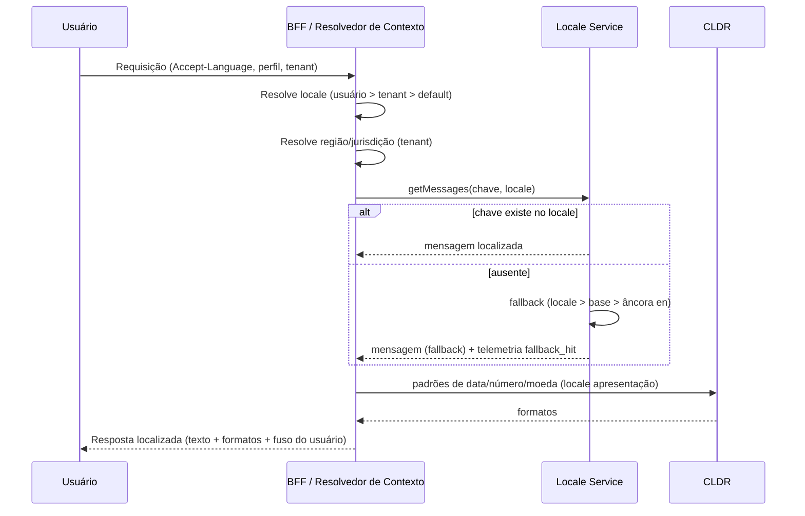
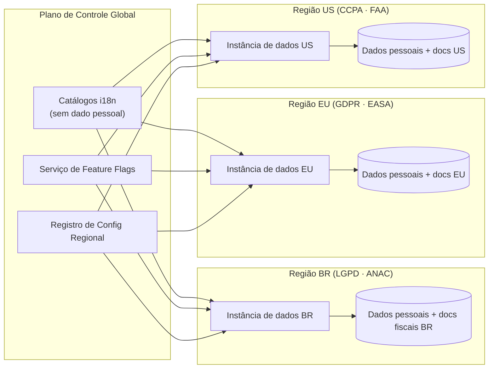
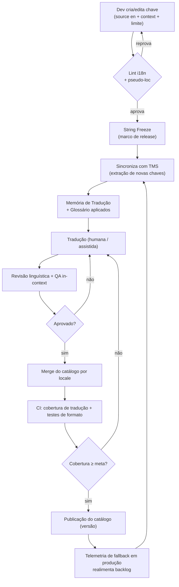
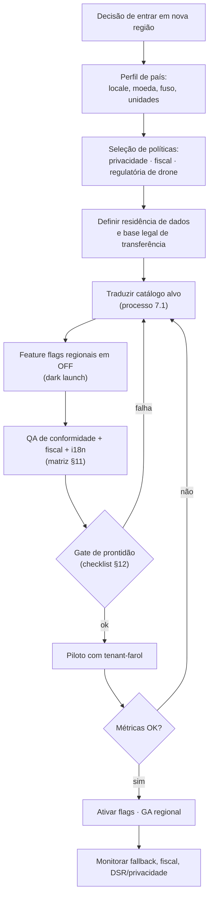
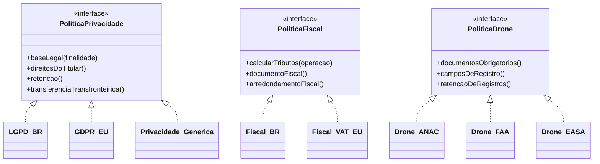

# 23 — Internacionalização · Drone Kairós ERP

**Documento:** `23 — Internacionalização`
**Versão:** 1.0 · **Data:** 21 de julho de 2026 · **Status:** Ativo
**Dependências:** `00 — Master Prompt` … `22` (todos os documentos anteriores, `00`–`22`)
**Responsável:** Especialista em Internacionalização (i18n/l10n)

---

## 1. Resumo Executivo

Este documento define a estratégia de **internacionalização (i18n)** e **localização (l10n)** do Drone Kairós ERP: a arquitetura, os padrões, os processos e a governança que tornam a plataforma capaz de operar em múltiplos idiomas, moedas, fusos, regimes fiscais e jurisdições regulatórias — **sem alteração de código por mercado**.

O princípio arquitetural nuclear, herdado do canon (`01 — Constituição`, Artigo de escala internacional de primeira classe), é a **separação estrita entre lógica e locale**: nenhum texto, formato, símbolo monetário, regra de plural, sentido de leitura, fuso ou unidade é embutido (*hardcoded*) no código. Toda decisão dependente de cultura, país ou regulação é resolvida em **tempo de execução** a partir de três eixos de contexto: **`locale`** (idioma + região cultural), **`tenant/região operacional`** (jurisdição fiscal, regulatória e de residência de dados) e **`preferência do usuário`** (idioma, fuso e formatos individuais). Estes três eixos são ortogonais e resolvidos por uma **cadeia de fallback** determinística.

Adotamos os padrões da indústria como fundação não-negociável: **Unicode/UTF-8** ponta a ponta, **CLDR** (Common Locale Data Repository) como fonte canônica de dados de locale, **ICU MessageFormat** para mensagens com plural/gênero/seleção, **BCP 47** para tags de idioma, **ISO 4217** para moedas, **ISO 3166** para países, **IANA Time Zone Database** para fusos e **UTS #35 / bidi (UAX #9)** para RTL. A internacionalização não é um recurso — é uma **propriedade transversal** de toda a plataforma, verificável em CI.

Os idiomas-alvo do lançamento (*wave 1*) são **Português (Brasil)**, **Inglês (Estados Unidos)** e **Espanhol (América Latina)**, com o arcabouço já preparado para **Espanhol (Europa)**, **Francês**, **Alemão** e, na camada de RTL/bidi, **Árabe** como validação de arquitetura. A conformidade por país é tratada por **abstração de política** (privacidade, fiscal e regulatória de drones), com implementações concretas para **LGPD (Brasil)**, **GDPR (União Europeia)**, e ganchos para **CCPA/CPRA (EUA)** — sempre articuladas com o módulo Financeiro (`multi-moeda/fiscal`) e o **KCD** (conformidade/privacidade).

O documento entrega: a matriz de dimensões i18n/l10n, a arquitetura de localização por tenant/região com *feature flags* regionais e **residência de dados** (*data residency*), os diagramas Mermaid da resolução de locale e da topologia regional, os fluxogramas do processo de tradução e do *rollout* regional, a matriz **país × requisitos**, checklist, riscos, evolução e trilha de auditoria.

## 2. Objetivos

- **O1.** Garantir **externalização total de textos** e de todo dado sensível a locale — zero *hardcode* de strings, formatos ou símbolos na camada de aplicação, verificável por *lint* e testes de pseudo-localização.
- **O2.** Estabelecer os **padrões canônicos** (Unicode/UTF-8, CLDR, ICU MessageFormat, BCP 47, ISO 4217/3166, IANA TZDB) como base única de toda formatação e mensagem.
- **O3.** Definir a **cadeia de resolução de locale** e a hierarquia de *fallback* (usuário → tenant/região → idioma-base → default global).
- **O4.** Especificar a arquitetura **multi-moeda** integrada ao Financeiro: câmbio, arredondamento fiscal, exibição versus contabilização, e separação entre moeda de transação, funcional e de apresentação.
- **O5.** Modelar a **conformidade por país** como política plugável: privacidade (LGPD/GDPR/abstração), regras fiscais/tributárias por região e requisitos regulatórios de drones (ANAC/FAA/EASA) que impactem dados e documentos.
- **O6.** Desenhar a **arquitetura de localização por tenant/região**, com *feature flags* regionais e **residência de dados** por jurisdição.
- **O7.** Definir o **processo e a governança** de i18n/l10n: ciclo de tradução, papéis, *TMS*, memória de tradução, glossário, *string freeze* e critérios de prontidão regional.
- **O8.** Assegurar **RTL/bidi** e acessibilidade multilíngue como requisitos de arquitetura, não adendos.

## 3. Escopo

**No escopo:** externalização de textos e catálogos de tradução; pluralização, gênero e seleção via ICU; formatação de data/hora/número/percentual/lista; fusos horários e conversões; unidades e sistemas de medida; RTL/bidi; multi-moeda (câmbio, arredondamento, exibição, contabilização — em conjunto com Financeiro); conformidade por país (privacidade, fiscal, regulatória de drones no que toca a **dados e documentos**); arquitetura de localização por tenant/região; *feature flags* regionais; residência de dados; processo, *TMS*, governança e auditoria de i18n.

**Fora do escopo (referência a outros documentos):** o modelo de dados e RLS multi-tenant em detalhe (`08 — Banco de Dados`); a decomposição de serviços e contratos (`09 — Microsserviços`); a lógica contábil e o plano de contas em si (Documento de Financeiro); o detalhamento operacional dos requisitos regulatórios de voo (é tratado aqui **apenas** onde impacta dados, documentos, formatos e retenção); a infraestrutura de rede/regiões de nuvem (Documento de Infraestrutura). Este documento define **como o produto se adapta ao locale e à jurisdição**, não a implementação interna de cada módulo consumidor.

## 4. Regras

- **R1. UTF-8 ponta a ponta.** Todo armazenamento, transporte e apresentação usa Unicode/UTF-8. Nenhuma coluna, campo, log ou API usa *charset* legado. Normalização Unicode **NFC** na entrada.
- **R2. Zero hardcode de texto.** Nenhuma string voltada ao usuário no código; toda mensagem vem de catálogo, referenciada por **chave estável** (nunca pelo texto-fonte).
- **R3. Locale nunca inferido do idioma sozinho.** Idioma (o *quê* se lê) e região (o *como* se formata) são independentes; ambos derivam da tag **BCP 47** resolvida.
- **R4. Formatação sempre por biblioteca CLDR/ICU.** Datas, números, moedas, listas e plurais jamais são montados por concatenação manual. Proibido `"R$" + valor` ou `dia + "/" + mês`.
- **R5. UTC como verdade temporal.** Todo *timestamp* é persistido em **UTC** com precisão e origem; o fuso é aplicado **apenas na apresentação**, a partir do fuso do usuário/tenant (IANA TZDB), nunca de *offset* fixo.
- **R6. Moeda é sempre um par (valor, código ISO 4217).** Nenhum valor monetário existe sem seu código de moeda e sua escala de casas decimais definida pelo CLDR/ISO. Proibido armazenar dinheiro em ponto flutuante binário.
- **R7. Separação exibição × contabilização.** A moeda de **apresentação** (o que o usuário vê) nunca redefine a moeda **funcional/de registro** (o que é contabilizado). Conversão de exibição não altera o razão.
- **R8. Fallback determinístico.** A resolução de mensagem/formato segue a cadeia definida (§5.3) e **nunca** exibe a chave crua ao usuário: falha resolve para o idioma-base, com marcação de telemetria.
- **R9. Política de conformidade é plugável por jurisdição.** Privacidade, fiscal e regulatória de drones são resolvidas por *policy* selecionada por região do tenant; a aplicação não contém `if país == ...` de regra de negócio regulatória.
- **R10. Residência de dados respeitada por padrão.** Dado pessoal e documento regulatório residem na região exigida pela jurisdição do tenant; movimentação transfronteiriça só com base legal explícita e registrada.
- **R11. Pseudo-localização obrigatória em CI.** Toda *build* passa por *pseudo-locale* (expansão de comprimento + acentuação + marcação de bordas) para detectar *hardcode*, truncamento e concatenação.
- **R12. String freeze antes do envio à tradução.** Nenhuma chave é enviada ao TMS sem congelamento; mudança pós-freeze cria nova chave/versão, nunca reescreve silenciosamente.
- **R13. Contexto obrigatório na chave.** Toda chave carrega descrição/`context` para o tradutor (uso, limite de caracteres, placeholders, tom). Chave sem contexto é erro de revisão.
- **R14. RTL de primeira classe.** Layout é *logical-property based* (`start/end`, não `left/right`); espelhamento e bidi validados para o conjunto RTL desde o v1.
- **R15. Sem dado cultural no código-fonte de negócio.** Feriados, formatos de endereço, ordem de nome, honoríficos, unidades e semana-início vêm de dados de locale (CLDR + tabela de tenant), não de literais.

## 5. Arquitetura de i18n/l10n

### 5.1 Os três eixos de contexto

A localização do Drone Kairós resolve toda decisão a partir de três eixos **ortogonais**, combinados no *request context*:

| Eixo | Origem | Governa | Exemplo |
|---|---|---|---|
| **Locale** (`BCP 47`) | Preferência do usuário → *header* `Accept-Language` → default do tenant | Idioma dos textos, regras de plural, formato de data/número, sentido de leitura | `pt-BR`, `en-US`, `es-419`, `ar-SA` |
| **Região operacional** (`ISO 3166` + jurisdição) | Configuração do tenant | Regime fiscal, política de privacidade, regulador de drone, residência de dados, moeda funcional | `BR`/LGPD/ANAC · `DE`/GDPR/EASA · `US`/CCPA/FAA |
| **Preferência individual** | Perfil do usuário | Fuso horário, formato de data/hora, sistema de unidades, primeira moeda de exibição | fuso `America/Sao_Paulo`, 24h, métrico |

> Um usuário `en-US` pode operar dentro de um tenant cuja região é `BR`: ele lê em inglês, mas o documento fiscal, a moeda funcional e a política de privacidade seguem a **jurisdição do tenant (BR/LGPD/ANAC)**. Essa ortogonalidade é o coração da arquitetura.

### 5.2 Camadas lógicas

1. **Camada de dados de locale (CLDR):** fonte canônica de calendários, símbolos, padrões de número/data, plural rules, nomes de idioma/país/moeda, ordem de listas.
2. **Camada de catálogos (mensagens):** *bundles* por locale, indexados por chave estável, formato ICU MessageFormat, versionados no repositório e servidos por *locale service*.
3. **Camada de formatação (runtime i18n):** API única de formatação (datas, números, moeda, listas, unidades, tempo relativo) construída sobre ICU/CLDR — o **único** ponto autorizado a produzir texto localizado.
4. **Camada de política por jurisdição:** *policies* plugáveis de privacidade, fiscal e regulatória de drone, selecionadas pela região do tenant.
5. **Camada de configuração regional (tenant/região):** perfil regional do tenant, *feature flags* regionais e diretiva de residência de dados.
6. **Camada de apresentação (UI/BFF):** consome a API de formatação e os catálogos; aplica RTL/bidi por *logical properties*; nunca formata manualmente.

### 5.3 Cadeia de resolução e fallback

A resolução de mensagem e formato é **determinística**:

```
preferência do usuário
   └─▶ locale completo do tenant (ex.: es-419)
         └─▶ idioma-base (ex.: es)
               └─▶ idioma-âncora do produto (en, source of truth)
```

Regras: (a) uma chave ausente no locale-alvo cai para o próximo elo, **nunca** para a chave crua; (b) toda queda de *fallback* emite telemetria (`i18n.fallback_hit`) para priorizar tradução; (c) dados de formato (CLDR) seguem *fallback* de locale independente do *fallback* de mensagens; (d) o idioma-âncora (`en`) é sempre 100% completo por definição — é a fonte.

### 5.4 Modelo de dados de suporte (resumo)

Sem substituir o `08 — Banco de Dados`, a i18n exige:

- **`locale` e `timezone` no perfil do usuário** e **default no tenant**;
- **conteúdo de negócio traduzível** (ex.: nome de produto, descrição de serviço, categoria) modelado como **tabela de tradução** (`entidade_id`, `locale`, campos), não colunas por idioma;
- **valores monetários** como `(amount_minor BIGINT, currency CHAR(3), scale SMALLINT)` — inteiro em unidade menor, nunca *float*;
- **região/jurisdição do tenant** e **diretiva de residência** como atributos de configuração regional.

### 5.5 Multi-moeda (integração com Financeiro)

A arquitetura monetária distingue **três papéis de moeda** (alinhada a boas práticas contábeis multi-moeda):

| Papel | Definição | Quem define | Exemplo |
|---|---|---|---|
| **Moeda de transação** | Moeda em que o fato econômico ocorreu | O evento (nota, pagamento) | Compra em `USD` |
| **Moeda funcional / de registro** | Moeda em que o tenant/entidade contabiliza | Região/configuração do tenant | Razão em `BRL` |
| **Moeda de apresentação** | Moeda em que o usuário **visualiza** | Preferência do usuário/relatório | Dashboard em `EUR` |

Regras monetárias (em conjunto com o Financeiro):

- **Câmbio:** taxas obtidas de provedor com *timestamp* e fonte; cada conversão registra `(taxa, data, fonte)` para auditoria e reprodutibilidade. Taxa de **registro** (contábil) é distinta da taxa de **exibição** (informativa).
- **Arredondamento:** aplicado conforme a escala CLDR da moeda de destino (ex.: `JPY` = 0 casas, `BRL/USD` = 2, `BHD` = 3), com **modo de arredondamento fiscal explícito** (padrão *half-even/bankers* no razão) e preservação de resíduos em rateios (sem "centavo perdido").
- **Exibição:** símbolo, posição, separadores e código seguem CLDR do locale de apresentação (`R$ 1.234,56` em `pt-BR`; `$1,234.56` em `en-US`).
- **Contabilização:** sempre na moeda funcional; a conversão de exibição é **derivada e não persistida no razão**. Diferenças de câmbio realizadas/não-realizadas são responsabilidade do módulo Financeiro (referência), acionadas por eventos.

## 6. Diagramas

### 6.1 Arquitetura de localização (visão de componentes)



### 6.2 Resolução de locale e fallback (sequência)



### 6.3 Topologia regional e residência de dados



## 7. Fluxogramas (processo de tradução e rollout regional)

### 7.1 Processo de tradução (source → produção)



### 7.2 Rollout de um novo país/região



## 8. Boas Práticas

- **Chave estável, nunca o texto-fonte.** Use `invoice.status.overdue`, não a frase em inglês como chave; texto muda, chave permanece.
- **Uma mensagem = uma sentença completa.** Nunca concatene fragmentos traduzidos; a ordem das palavras e a gramática variam por idioma. Use ICU `select`/`plural` para variação, não *string splicing*.
- **Placeholders nomeados e tipados.** `{count, plural, ...}`, `{date, date, long}`, `{price, number, currency}` — nunca posicionais anônimos que o tradutor não entende.
- **Projete para expansão de 30–40%.** Alemão e francês expandem; a UI e os limites de campo toleram crescimento. Pseudo-loc torna isso visível cedo.
- **Formate no *runtime*, não no dado.** Persista valores neutros (UTC, *amount_minor*, código de moeda, número puro); formate só na borda de apresentação.
- **Propriedades lógicas de layout.** `margin-inline-start`, `text-align: start`, `dir="auto"` para bidi; nada de `left/right` fixos.
- **Não traduza dados de negócio como se fossem UI.** Nome de produto do cliente é dado (tabela de tradução, editável pelo tenant); rótulo de botão é UI (catálogo do produto).
- **Contexto e capturas de tela para o tradutor.** Ambiguidade ("Post" verbo x substantivo) resolve-se com `context` e QA *in-context*.
- **Números e IDs também têm cultura.** Telefone, CEP/postal, documento fiscal, endereço e ordem de nome variam por país — nunca assuma o formato brasileiro/americano como universal.
- **Fuso do usuário, não do servidor.** "Ontem", agendamentos e cortes de relatório calculam-se no fuso do usuário/tenant, com atenção a horário de verão.
- **Moeda com código sempre visível em ambiguidade.** `$` é ambíguo (USD/CAD/AUD/MXN); exiba código ISO quando o contexto não desambigua.

## 9. Padrões (normativos)

| Domínio | Padrão adotado | Uso no Kairós |
|---|---|---|
| Codificação | **Unicode / UTF-8**, normalização **NFC** | Armazenamento, transporte, apresentação — universal |
| Dados de locale | **CLDR** (UTS #35 / LDML) | Fonte única de calendários, símbolos, plural rules, formatos |
| Mensagens | **ICU MessageFormat** | Plural, gênero, seleção, placeholders tipados |
| Tags de idioma | **BCP 47** (`pt-BR`, `es-419`, `zh-Hant`) | Identificação de locale em toda a stack |
| País/território | **ISO 3166-1 alpha-2** | Região do tenant, jurisdição, residência |
| Moeda | **ISO 4217** (código + escala) | Todo valor monetário; escala via CLDR |
| Fuso horário | **IANA TZDB** (nomes, não *offsets*) | `America/Sao_Paulo`, DST correto |
| Bidi / RTL | **UAX #9** + CSS logical properties | Espelhamento e leitura RTL |
| Colação/ordenação | **UCA** (ICU Collator) por locale | Ordenar listas conforme cultura |
| Unidades | **CLDR Units** + UN/CEFACT quando fiscal | Métrico/imperial, formatação de unidade |
| Números | **CLDR number patterns** | Separadores, agrupamento, sinal, percentual |
| Transferência de dados | **BCP 47 + ISO 8601** (datas em API) | API sempre ISO 8601/UTC; formatação só na UI |

> **Regra de ouro dos padrões:** a aplicação nunca reimplementa o que CLDR/ICU já resolvem. Formatação, plural e ordenação são **delegados**, não codificados.

## 10. Casos de Uso

- **CU-01 — Usuário multilíngue em tenant estrangeiro.** Analista `en-US` opera tenant brasileiro: lê UI em inglês; vê valores no razão em `BRL`; documentos fiscais emitidos em `pt-BR` conforme ANAC/fisco BR; dados pessoais residem na região BR (LGPD).
- **CU-02 — Fatura multi-moeda.** OS cobrada em `USD` (transação), contabilizada em `BRL` (funcional, taxa de registro auditável), exibida ao gestor europeu em `EUR` (apresentação, taxa informativa). Três moedas, um único fato contábil.
- **CU-03 — Pluralização correta.** "3 drones cadastrados" / "1 drone cadastrado" / árabe com 6 categorias de plural — tudo por ICU `plural`, sem `if count == 1`.
- **CU-04 — Relatório com corte por fuso.** Fechamento "diário" de um tenant em `America/Sao_Paulo` versus operação em `Europe/Lisbon`: o corte respeita o fuso do tenant, com DST tratado pela TZDB.
- **CU-05 — Direito do titular (DSR).** Titular europeu exerce direito de acesso/eliminação (GDPR); titular brasileiro exerce direitos LGPD — mesma abstração de *policy* de privacidade, execução conforme jurisdição e residência.
- **CU-06 — Novo mercado sem código.** Entrada no México: cria-se perfil `es-MX`/`MXN`/`America/Mexico_City`, seleciona-se política fiscal e regulatória local, traduz-se o catálogo, ativa-se por *feature flag* — **nenhuma alteração de código de negócio**.
- **CU-07 — Documento regulatório localizado.** Certificado/registro de aeronave gera PDF com rótulos no idioma do documento, unidades locais (altura em metros/pés conforme regulador) e formato de data local, arquivado na região de residência.
- **CU-08 — RTL.** Tenant em árabe: UI espelhada, números e datas corretos, campos bidi (nome árabe + matrícula latina) sem quebra visual.

## 11. Modelagem — Matriz país × requisitos

### 11.1 Dimensões de i18n/l10n (referência transversal)

| Dimensão | Fonte/Padrão | Exemplo de variação |
|---|---|---|
| Idioma / plural / gênero | ICU + CLDR plural rules | `en` (2 formas) · `pt` (2) · `ar` (6) |
| Formato de data/hora | CLDR + fuso do usuário | `21/07/2026` · `07/21/2026` · `2026-07-21` |
| Formato de número | CLDR number patterns | `1.234,56` · `1,234.56` · `1 234,56` |
| Moeda (símbolo, posição, escala) | ISO 4217 + CLDR | `R$ 1.234,56` · `$1,234.56` · `¥1235` |
| Fuso horário | IANA TZDB | `America/Sao_Paulo` · `Europe/Berlin` |
| Unidades/medidas | CLDR Units | métrico × imperial; metros × pés |
| Sentido de leitura | UAX #9 | LTR × RTL |
| Ordenação/colação | UCA (ICU) | ordem alfabética por locale |
| Endereço / nome / telefone | Perfil de país | ordem de nome, CEP × ZIP × postcode |
| Semana / feriados | CLDR + tabela do tenant | início dom/seg; feriados nacionais |

### 11.2 Matriz país × requisitos regulatórios e de localização

| País/Região | Locale(s) | Moeda funcional | Privacidade | Fiscal/Tributário (natureza) | Regulador de Drone | Residência de dados | Wave |
|---|---|---|---|---|---|---|---|
| **Brasil** | `pt-BR` | `BRL` | **LGPD** (ANPD) | Impostos indiretos multi-nível (federal/estadual/municipal), documentos fiscais eletrônicos | **ANAC** (+ DECEA/SISANT) | Preferencial BR | 1 |
| **Estados Unidos** | `en-US` | `USD` | CCPA/CPRA + setorial | *Sales tax* por estado/condado | **FAA** (Part 107/registro) | US | 1 |
| **México / LatAm hisp.** | `es-419`, `es-MX` | `MXN` e outras | Leis locais (abstração) | Imposto sobre valor local, doc. eletrônico | Autoridade local | LatAm | 1 |
| **União Europeia (DE/FR/ES/PT-EU)** | `de-DE`,`fr-FR`,`es-ES`,`pt-PT` | `EUR` | **GDPR** | IVA (VAT) intracomunitário | **EASA** | UE/EEE | 2 |
| **Reino Unido** | `en-GB` | `GBP` | UK GDPR / DPA | VAT | CAA | UK | 3 |
| **Golfo (validação RTL)** | `ar-SA`,`ar-AE` | `SAR`,`AED` | Leis locais (abstração) | Regime local | GACA / autoridade local | Local | 3 (arquitetural) |

> As linhas de *wave* 2–3 já são **suportadas pela arquitetura** (política plugável, catálogos, residência); o esforço restante é tradução, homologação fiscal e parametrização — não engenharia estrutural.

### 11.3 Abstração de políticas por jurisdição



> Sobre reguladores de drone (ANAC/FAA/EASA), o escopo deste documento é **o que impacta dados e documentos**: campos obrigatórios de registro de aeronave/operador, documentos exigidos (certificados, autorizações), idioma/formato desses documentos, unidades legais (ex.: limites de altura) e **prazos de retenção** de registros — não a lógica operacional de voo.

## 12. Checklist

**Prontidão de i18n (produto)**
- [ ] UTF-8/NFC em banco, APIs, logs e arquivos; nenhum *charset* legado.
- [ ] Zero string *hardcoded*; *lint* de i18n verde no CI.
- [ ] Todo texto com chave estável + `context` + limite de caracteres.
- [ ] Pseudo-localização executada sem truncamento/vazamento/concatenação.
- [ ] Datas/números/moedas/listas via API de formatação CLDR/ICU (nenhuma concatenação manual).
- [ ] Plurais/gênero via ICU (`plural`/`select`), zero `if count == 1`.
- [ ] *Timestamps* em UTC; apresentação no fuso do usuário; DST validado.
- [ ] Layout RTL por propriedades lógicas; bidi testado.
- [ ] Fallback determinístico; chave crua nunca aparece; telemetria de fallback ativa.

**Prontidão de localização (por locale)**
- [ ] Cobertura de tradução ≥ meta definida (ex.: 100% para GA, ≥95% para piloto).
- [ ] Glossário e memória de tradução aplicados; termos-chave consistentes.
- [ ] QA linguístico *in-context* aprovado.

**Prontidão regional (por país)**
- [ ] Perfil de país (locale, moeda, fuso, unidades, formatos de endereço/nome/telefone) configurado.
- [ ] Política de privacidade selecionada (LGPD/GDPR/abstração) e DSR funcional.
- [ ] Política fiscal/tributária parametrizada e homologada.
- [ ] Requisitos regulatórios de drone (dados/documentos) mapeados na matriz.
- [ ] Residência de dados definida; base legal de transferência transfronteiriça registrada.
- [ ] *Feature flags* regionais e *gate* de prontidão satisfeitos.

## 13. Riscos

| ID | Risco | Prob. | Impacto | Mitigação |
|---|---|---|---|---|
| RS-01 | Texto *hardcoded* escapa para produção | Média | Alto | Lint de i18n + pseudo-loc obrigatórios no CI (R2, R11) |
| RS-02 | Concatenação de fragmentos quebra gramática de outro idioma | Média | Médio | ICU MessageFormat; proibição de *splicing* (R4, §8) |
| RS-03 | Dinheiro em ponto flutuante gera erro de arredondamento | Baixa | Crítico | `amount_minor` inteiro + escala CLDR + arredondamento fiscal (R6) |
| RS-04 | Confusão exibição × contabilização adultera o razão | Média | Crítico | Separação de papéis de moeda; conversão de exibição não persiste (R7) |
| RS-05 | *Offset* fixo em vez de TZDB erra no horário de verão | Média | Alto | IANA TZDB por nome; nunca *offset* fixo (R5) |
| RS-06 | Violação de residência de dados / transferência sem base legal | Baixa | Crítico | Diretiva de residência por região + registro de base legal (R10) |
| RS-07 | Regra fiscal/regulatória embutida em `if país` | Média | Alto | Políticas plugáveis por jurisdição (R9, §11.3) |
| RS-08 | RTL/bidi quebrado por layout com left/right fixos | Média | Médio | Propriedades lógicas + validação árabe desde v1 (R14) |
| RS-09 | Cobertura de tradução baixa gera fallback visível excessivo | Média | Médio | Meta de cobertura no *gate* + telemetria de fallback (R8, §12) |
| RS-10 | Chave reescrita silenciosamente corrompe traduções existentes | Baixa | Médio | *String freeze* + nova chave/versão (R12) |
| RS-11 | Expansão de texto (DE/FR) trunca UI | Média | Médio | Projeto para +40% + pseudo-loc (§8) |
| RS-12 | Ambiguidade de símbolo monetário (`$`) confunde usuário | Baixa | Médio | Código ISO visível em contexto ambíguo (§8) |
| RS-13 | Dessincronia entre catálogos e código após *release* | Média | Médio | Extração automatizada + CI de cobertura + versão de catálogo |
| RS-14 | Divergência de dado de negócio traduzível entre idiomas | Média | Médio | Tabela de tradução com *fallback* e propriedade do tenant (§5.4) |

## 14. Melhorias Futuras

- **Idiomas adicionais (waves 2–3):** completar `es-ES`, `fr-FR`, `de-DE`, `pt-PT`, `en-GB`; consolidar RTL com `ar-*` em produção.
- **Tradução assistida com *human-in-the-loop*:** pré-tradução automatizada de novas chaves com revisão humana obrigatória, alimentada por memória de tradução e glossário — reduzindo tempo de *rollout* sem abrir mão de QA linguístico.
- **CLDR/ICU auto-atualizáveis:** pipeline que acompanha novas versões de CLDR e TZDB (fusos e regras de DST mudam por decreto) com testes de regressão de formato.
- **Catálogo servido dinamicamente:** entrega de *bundles* por locale sob demanda (*lazy*), com versionamento e cache por *edge*, evitando *bundle* monolítico.
- **Localização de conteúdo gerado pelo tenant:** fluxo self-service para o tenant traduzir seus próprios dados de negócio (produtos, serviços) com controle de qualidade.
- **Motor de regras fiscais como serviço:** externalizar cálculo tributário multi-jurisdição para um serviço dedicado com tabelas versionadas por vigência.
- **Detecção proativa de gaps:** *dashboard* de telemetria de `fallback_hit` e de formatos não cobertos, priorizando automaticamente o *backlog* de tradução.
- **Acessibilidade multilíngue:** validação de leitores de tela por idioma e de conformidade WCAG por locale, incluindo bidi.

## 15. Auditoria

| Item | Descrição |
|---|---|
| **Rastreabilidade de conformidade** | Cada requisito de país (privacidade, fiscal, drone, residência) mapeia a uma linha da matriz §11.2 e a uma política concreta §11.3, com base legal registrada. |
| **Trilha de câmbio** | Toda conversão monetária registra `(taxa, data, fonte, papel)`; a taxa de registro é reproduzível e distinta da de exibição (R6, R7, §5.5). |
| **Trilha de tradução** | Cada chave possui histórico de versão, `context`, *string freeze* e cobertura por locale; mudanças pós-freeze geram nova versão (R12, §7.1). |
| **Telemetria de i18n** | `i18n.fallback_hit`, formatos não cobertos e locales requisitados são coletados para auditoria de qualidade e priorização (R8). |
| **Residência de dados** | Localização física de dado pessoal e documento regulatório é auditável por tenant/região; transferências transfronteiriças exigem registro de base legal (R10, KCD). |
| **Conformidade de padrões** | CI verifica UTF-8/NFC, ausência de *hardcode*, uso da API de formatação e pseudo-localização (R1, R2, R4, R11). |
| **Integração KCD/Financeiro** | Direitos do titular (DSR) e eventos fiscais são articulados com o KCD (privacidade) e o Financeiro (razão multi-moeda), conforme dependências 00–22. |
| **Versão do documento** | v1.0 — 21 de julho de 2026. Alterações futuras registradas no controle de versão do repositório de documentação. |
| **Aprovação** | Especialista em Internacionalização (responsável); dependências `00`–`22` verificadas e coerentes com o PROJECT CANON (escala internacional de 1ª classe; segurança/privacidade por padrão). |

---

> **Nota de encerramento.** A internacionalização do Drone Kairós ERP é **estrutural, não cosmética**: o produto foi desenhado para que idioma, formato, moeda, fuso, jurisdição e residência de dados sejam **parâmetros de execução**, resolvidos por padrões abertos (Unicode, CLDR, ICU, BCP 47, ISO 4217/3166, IANA) e por políticas plugáveis por jurisdição. Entrar em um novo mercado é um ato de **configuração e tradução governadas**, não de reescrita de código — cumprindo o princípio constitucional de escala internacional de primeira classe, com segurança e privacidade por padrão.
