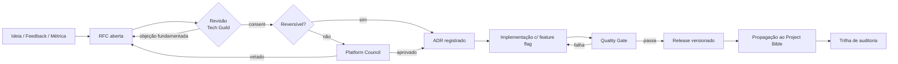
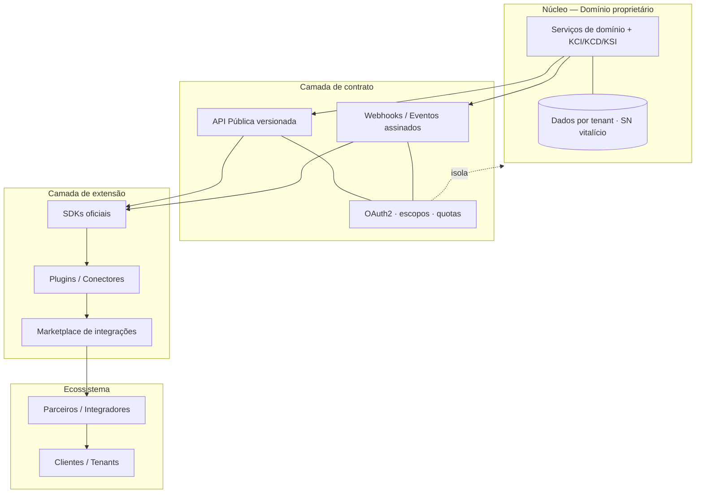
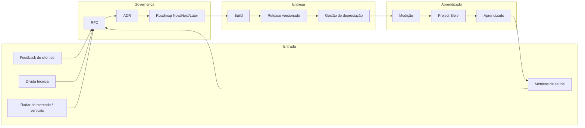
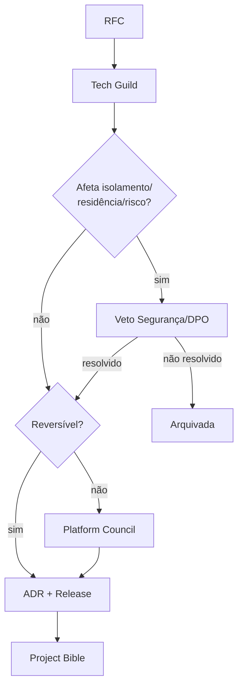
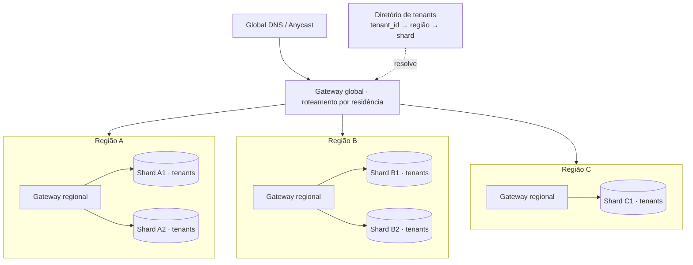
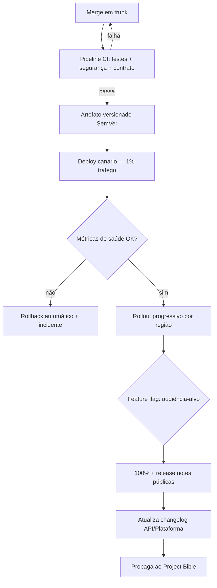
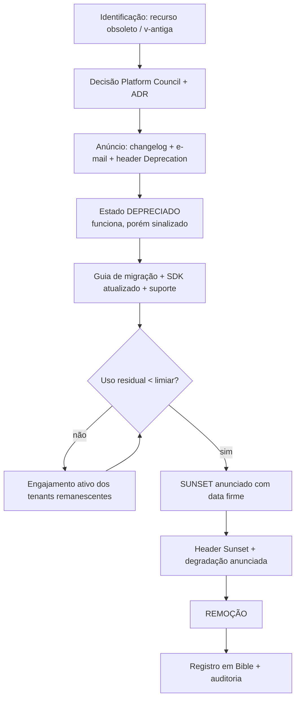

# 24 — Evolução da Plataforma · Drone Kairós ERP

**Documento:** `24 — Evolução da Plataforma`
**Versão:** 1.0 · **Data:** 21 de julho de 2026 · **Status:** Ativo
**Dependências:** `00`–`23` (kit completo)
**Responsável:** Líder de Produto/Plataforma

---

## 1. Resumo Executivo

Este é o **documento de fechamento do kit** e, ao mesmo tempo, o documento que o mantém vivo. Enquanto os documentos `00`–`23` descrevem *o que a plataforma é* — sua constituição, arquitetura, dados, microsserviços, módulos KCI/KCD/KSI, API pública e operação —, o documento `24` descreve **como a plataforma muda sem se trair**. Ele define o contrato de evolução: quem decide, com que critérios, em que cadência, com que garantias de compatibilidade e sob qual auditoria.

O Drone Kairós ERP é uma **plataforma multiempresa (SaaS)** cujo maior ativo é a **confiança acumulada**: rastreabilidade vitalícia por Serial Number, isolamento entre tenants, uma API pública sobre a qual terceiros constroem negócios, e três módulos proprietários (Kairós Core Intelligence, Kairós Cyber Defense, Kairós Smart Inventory) que amadurecem ao longo do tempo. Evoluir uma plataforma assim não é adicionar recursos — é **preservar promessas** (o SN de um drone registrado em 2026 precisa ser resolvível em 2046) enquanto se expande capacidade, alcance geográfico e inteligência.

A tese central deste documento é que **evolução é uma disciplina de governança, não um resultado de iniciativa individual**. Três instrumentos sustentam essa disciplina: (1) um **modelo de decisão** explícito (RFC → ADR → release) com pesos e fóruns definidos; (2) **versionamento semântico** aplicado tanto à plataforma quanto — separadamente — à API pública, com uma **política de depreciação e compatibilidade** contratual e previsível; e (3) um **ciclo de melhoria contínua** que trata dívida técnica, saúde da plataforma e feedback como fluxo permanente, não como campanha esporádica.

O documento entrega ainda a **estratégia de extensibilidade** (SDKs, plugins, marketplace de integrações e programa de parceiros sobre a API pública), a **estratégia de escala** (multi-região, *data residency*, performance em larga escala e sharding por tenant), o **roadmap de horizontes Now/Next/Later** para os três módulos e novos verticais, o conjunto de **métricas de saúde da plataforma**, a política de **sustentabilidade e ciclo de vida** de recursos e clientes, e a **ligação formal com o Project Bible** — porque toda evolução registrada aqui só é real quando propagada para a fonte única de verdade.

## 2. Objetivos

- **O1.** Estabelecer o **modelo de decisão de produto/plataforma**: fóruns, papéis, pesos, quórum e o fluxo RFC → ADR → Release.
- **O2.** Definir o **versionamento semântico** da Plataforma e da API Pública como esquemas **independentes**, com regras claras de *major/minor/patch*.
- **O3.** Estabelecer a **política de depreciação e compatibilidade** — janelas mínimas, comunicação, *sunset* e caminhos de migração — como compromisso contratual.
- **O4.** Instituir a **gestão de dívida técnica** como orçamento recorrente e a **melhoria contínua** como ciclo mensurável.
- **O5.** Definir a **extensibilidade**: modelo de plugins, marketplace de integrações, SDKs oficiais e o **programa de parceiros** sobre a API pública.
- **O6.** Especificar a **estratégia de escala**: multi-região, *data residency*, performance em larga escala e **sharding por tenant**.
- **O7.** Publicar o **roadmap de horizontes (Now/Next/Later)** para KCI, KCD, KSI e novos verticais, sem datas rígidas mas com direção firme.
- **O8.** Definir as **métricas de saúde da plataforma** e o **ciclo de feedback** que as retroalimenta.
- **O9.** Estabelecer **sustentabilidade e ciclo de vida**: como recursos nascem, amadurecem, depreciam e como clientes migram com segurança.
- **O10.** Formalizar a **ligação com o Project Bible**: toda decisão de evolução é registrada, propagada e auditável.

## 3. Escopo

**No escopo:** governança de produto e de plataforma; versionamento e depreciação da plataforma e da API pública; gestão de dívida técnica e melhoria contínua; extensibilidade (SDKs, plugins, marketplace, parceiros); estratégia de escala (multi-região, *data residency*, performance, sharding por tenant); roadmap de horizontes para módulos e verticais; métricas de saúde e ciclo de feedback; sustentabilidade e ciclo de vida de recursos/clientes; integração com o Project Bible.

**Fora do escopo (referência a outros documentos):** especificação funcional dos módulos e da API (Docs de módulos e Doc de API Pública); arquitetura de microsserviços e malha (Doc `09`); modelagem de dados e tenancy físico (Docs `07`, `08`); pipelines de CI/CD e operação (Docs de operação); segurança/IAM e KCD detalhado (Doc `07` e Doc do KCD); estratégia comercial e precificação (Docs de negócio). Aqui tratamos **do processo e das regras de mudança** que incidem sobre todos eles.

**Princípios herdados do canon (não contradizer):** governança acima de velocidade; escala internacional desde o design; qualidade e auditoria contínuas; rastreabilidade vitalícia por Serial Number; isolamento entre tenants; API-first.

## 4. Regras (Governança de Evolução)

- **R1. Nada evolui sem RFC.** Toda mudança de comportamento observável (plataforma ou API) começa por uma RFC pública internamente, antes de código.
- **R2. Toda decisão vira ADR.** Uma RFC aprovada gera um **Architecture Decision Record** imutável; ADRs não se editam, se *supersedem*.
- **R3. O Project Bible prevalece.** Em conflito, o Bible decide (respeitadas as cláusulas pétreas da Constituição, Doc `01`). Toda decisão de evolução é propagada ao Bible (Doc `02`).
- **R4. Compatibilidade é contrato, não cortesia.** Quebras só ocorrem em *major* anunciado, com janela de depreciação cumprida integralmente. **Nunca** se quebra silenciosamente.
- **R5. Dois SemVer independentes.** A **Plataforma** e a **API Pública** têm versionamento próprio; um *minor* de plataforma **não** implica mudança de versão da API, e vice-versa.
- **R6. Depreciar é um processo, não um evento.** Todo recurso a ser removido passa por `Anunciado → Depreciado → Sunset → Removido`, com janela mínima publicada (§9).
- **R7. Orçamento de dívida é inegociável.** Um percentual fixo de capacidade de cada ciclo é reservado à saúde técnica; não é a primeira coisa a ser cortada — é a última.
- **R8. Extensão não é privilégio de acesso.** Plugins e parceiros operam **exclusivamente** sobre a API pública versionada e escopos OAuth; nenhuma integração acessa dados internos ou o banco.
- **R9. Tenant e residência sempre respeitados.** Nenhuma evolução pode violar isolamento de tenant nem *data residency* declarada; é critério de veto em qualquer release.
- **R10. Rastreabilidade vitalícia é irrevogável.** Nenhuma mudança pode tornar um Serial Number histórico irresolvível. Migrações preservam a resolução do SN de ponta a ponta.
- **R11. Métrica antes de opinião.** Priorização e depreciação são justificadas por dados de saúde e uso (§8, §11), não por preferência.
- **R12. Reversibilidade por padrão.** Todo release traz plano de *rollback* e *feature flag*; o que não pode ser revertido exige aprovação de fórum superior (§5).

## 5. Arquitetura de Evolução e Extensibilidade

### 5.1 Camadas da governança de produto/plataforma

A evolução é decidida em três fóruns encadeados, cada um com escopo e cadência próprios:

| Fórum | Composição | Escopo de decisão | Cadência | Instrumento |
|---|---|---|---|---|
| **Guilda Técnica (Tech Guild)** | Arquitetos + tech leads por bounded context | RFCs técnicas, ADRs, dívida técnica, padrões | Semanal | RFC/ADR |
| **Conselho de Plataforma (Platform Council)** | Líder de Produto/Plataforma, CTO, líderes de KCI/KCD/KSI, segurança, DPO | Roadmap, versionamento *major*, depreciações, *data residency* | Quinzenal | Decision Record + Roadmap |
| **Comitê Executivo (Steering)** | C-level | Novos verticais, expansão de região, mudanças que afetam contratos/SLAs | Mensal/sob demanda | Decisão estratégica |

**Modelo de decisão — pesos e quórum.** As decisões seguem *consent-based* (avança-se sem objeção fundamentada), com escalonamento por reversibilidade:

| Tipo de mudança | Reversibilidade | Fórum decisor | Quórum | Registro |
|---|---|---|---|---|
| *Patch* / correção | Alta | Tech Guild | 2 revisores | ADR leve |
| *Minor* / novo recurso compatível | Alta | Tech Guild + PO | Maioria simples | ADR |
| *Major* plataforma ou API | Baixa | Platform Council | Consenso, sem veto de segurança/DPO | ADR + Bible + comunicado |
| Depreciação de recurso | Baixa | Platform Council | Consenso | ADR + política §9 |
| Novo vertical / nova região | Muito baixa | Steering | Aprovação executiva | Decisão + roadmap |

> **Vetos absolutos:** Segurança (KCD) e DPO/*Data Protection* têm **veto** sobre qualquer mudança que afete isolamento de tenant, *data residency* ou postura de risco. Um veto não é derrubável por maioria — é resolvido tecnicamente ou a mudança não avança.

### 5.2 Fluxo canônico RFC → ADR → Release

### 5.3 Arquitetura de extensibilidade

A extensibilidade é construída em **anéis concêntricos**, do núcleo imutável para a borda aberta:

**Regras estruturais da extensibilidade:**

1. **A API pública é a única superfície de extensão.** Não existe "API privada emprestada". Plugins e parceiros veem exatamente o que qualquer parceiro vê.
2. **Escopos mínimos.** Cada integração recebe apenas os escopos OAuth necessários; leitura de SN não implica escrita em estoque.
3. **Quotas e *rate limiting* por chave/tenant.** Um parceiro mal comportado degrada a si mesmo, nunca a plataforma nem outro tenant.
4. **Eventos assinados.** Webhooks carregam assinatura verificável; o parceiro valida origem e integridade.
5. **Certificação.** Nenhuma integração entra no marketplace sem passar por *review* técnico, de segurança (KCD) e de privacidade.

### 5.4 Modelo de plugins e marketplace

| Elemento | Definição | Governança |
|---|---|---|
| **SDK oficial** | Bibliotecas mantidas pela plataforma (ex.: linguagens de servidor, mobile) que encapsulam auth, paginação, *retry* e tipos gerados do OpenAPI | Versionadas junto à API pública (§9) |
| **Conector/Plugin** | Integração empacotada (ex.: contabilidade, e-commerce, telemetria de fabricante) construída sobre a API/SDK | Certificação obrigatória; *sandbox* antes de produção |
| **Marketplace** | Catálogo curado onde tenants instalam integrações com consentimento explícito de escopos | Revisão + monitoramento contínuo + *kill switch* |
| **Programa de parceiros** | Camadas (Registrado → Verificado → Estratégico) com acesso a *sandbox*, suporte e co-marketing | Contrato de parceria + SLA de API |

## 6. Diagramas

### 6.1 Ciclo de evolução da plataforma (visão macro)

### 6.2 Governança e vetos

### 6.3 Escala multi-região e sharding por tenant

> O **Diretório de tenants** é a peça central da escala: mapeia `tenant_id` para sua **região de residência** (imutável sem migração aprovada) e para o **shard** físico. A resolução de Serial Number consulta esse diretório para rotear sem jamais cruzar fronteira de residência indevidamente.

## 7. Fluxogramas (Release e Depreciação)

### 7.1 Ciclo de release

### 7.2 Ciclo de depreciação de recurso ou versão de API

## 8. Boas Práticas

- **BP1. *Trunk-based* com *feature flags*.** Integração contínua em tronco único; recursos incompletos ficam atrás de *flags*, nunca em *branches* longevas.
- **BP2. *Expand/contract* para toda mudança de esquema ou contrato.** Primeiro adiciona (expand), migra leitores/escritores, só então remove (contract). Nunca renomeia in-place.
- **BP3. Contrato antes de código.** OpenAPI/Protobuf revisado e versionado precede a implementação (herdado do Doc `09`).
- **BP4. *Canary* + *rollback* automático.** Todo release passa por audiência reduzida com *guardrails* de métrica que revertem sozinhos.
- **BP5. Dívida técnica visível.** Toda dívida tem registro, impacto estimado e dono; dívida oculta é incidente latente.
- **BP6. Documentar a depreciação no dia do anúncio**, não no dia da remoção. O parceiro precisa de tempo real.
- **BP7. *Dogfooding* da API pública.** Os próprios apps consomem, sempre que possível, a mesma API pública dos parceiros — o que dói para nós dói para eles antes.
- **BP8. Métricas de saúde como *guardrails* de deploy**, não apenas *dashboards* de observação.
- **BP9. Migração assistida, nunca imposta a frio.** Ferramentas, *dry-run*, janelas e *rollback* de migração de cliente.
- **BP10. Cada decisão é rastreável ao Bible.** Se não está no Bible, não aconteceu oficialmente.

## 9. Padrões (SemVer e Políticas)

### 9.1 Versionamento semântico — dois esquemas independentes

**Plataforma** e **API Pública** seguem `MAJOR.MINOR.PATCH`, porém com significados e ciclos próprios.

| Incremento | Plataforma | API Pública |
|---|---|---|
| **MAJOR** | Mudança arquitetural com impacto operacional para tenants (ex.: novo modelo de tenancy físico, migração de região obrigatória) | Quebra de contrato observável: remoção de campo/endpoint, mudança de semântica, novo obrigatório |
| **MINOR** | Novo módulo/recurso compatível, sem ação do cliente | Adição compatível: novo endpoint, campo opcional, novo escopo |
| **PATCH** | Correção/*hardening* sem mudança de comportamento | Correção de bug sem alterar contrato |

**Regras de versionamento da API pública:**

1. **Versão maior na URL** (`/v1`, `/v2`) — versões maiores coexistem durante a janela de depreciação.
2. **Adições são sempre *minor*.** Consumidores toleram campos novos (regra do consumidor robusto / *tolerant reader*).
3. **Nunca reciclar significado.** Um campo depreciado não é reaproveitado com outra semântica.
4. **`Deprecation` e `Sunset` headers** (padrão HTTP) sinalizam o estado de cada endpoint/versão.
5. **SDKs acompanham a API:** um SDK `2.x` fala `/v2`; SDKs mantidos por, no mínimo, uma versão maior anterior.

### 9.2 Política de compatibilidade e janelas de depreciação

| Item | Janela mínima de suporte após anúncio | Observações |
|---|---|---|
| **Versão MAJOR da API pública** | **24 meses** | Duas majors coexistem no mínimo |
| **Endpoint/campo individual (minor)** | **12 meses** | Alternativa disponível antes do anúncio |
| **SDK oficial (major)** | **12 meses** após sucessor | Correções de segurança durante a janela |
| **Recurso de produto (feature)** | **6 meses** | Migração assistida quando houver estado |
| **Formato de webhook/evento** | **12 meses** | Evento novo coexiste com o antigo |

**Contrato de compatibilidade (o que a plataforma promete):**

- **Nunca** quebrar sem *major* + anúncio + janela cumprida.
- **Nunca** tornar um Serial Number histórico irresolvível (R10).
- **Sempre** oferecer caminho de migração documentado e ferramenta antes do *sunset*.
- **Sempre** comunicar por, no mínimo, três canais: changelog público, *header* HTTP e notificação direta ao tenant/parceiro afetado.

### 9.3 Padrões de dívida técnica e melhoria contínua

- **Orçamento fixo:** **20%** da capacidade de cada ciclo reservada a saúde técnica (R7), com *tracking* separado do roadmap de recursos.
- **Registro estruturado:** cada item de dívida tem `tipo` (código, dados, arquitetura, dependência, operacional), `impacto` (probabilidade × custo), `juros` (custo de mantê-la) e `dono`.
- **Regra do escoteiro:** áreas tocadas saem melhores do que entraram; refatoração oportunista é bem-vinda dentro do escopo.
- **Índice de dívida** publicado no painel de saúde (§8/§11) e revisado pela Tech Guild.

## 10. Casos de Uso

**CU1 — Lançar uma capacidade compatível na API pública.**
Um novo endpoint de consulta de histórico consolidado do SN é proposto. RFC → ADR → implementação atrás de *flag* → *canary* → *minor* `v1.7 → v1.8` da API. Nenhum parceiro precisa agir; SDKs ganham o método na próxima *minor*. Registro no Bible.

**CU2 — Quebrar contrato inevitável (major).**
A semântica de status de OS precisa mudar para suportar novos verticais. Decisão no Platform Council, com veto potencial de segurança avaliado. Publica-se `/v2` mantendo `/v1` por 24 meses, guia de migração, SDK `2.x`, *headers* `Deprecation`/`Sunset`, e engajamento ativo dos parceiros de maior uso.

**CU3 — Onboarding de parceiro no marketplace.**
Integrador de contabilidade solicita entrada. Recebe credenciais de *sandbox*, escopos mínimos, passa por certificação técnica + KCD + privacidade, publica conector; tenants instalam com consentimento explícito de escopos. Monitoramento contínuo e *kill switch* disponíveis.

**CU4 — Expandir para uma nova região com *data residency*.**
Demanda de clientes em nova jurisdição. Steering aprova; provisiona-se região; *data residency* declarada torna-se atributo imutável dos novos tenants; diretório de tenants roteia; resolução de SN respeita a fronteira. Auditoria confirma que nenhum dado cruza indevidamente.

**CU5 — Migrar um tenant de shard/região.**
Tenant cresce e precisa de shard dedicado, ou muda de residência por exigência legal. Migração assistida: *dry-run*, janela combinada, cópia consistente, verificação de resolução de SN ponta a ponta, corte com *rollback* pronto, atualização do diretório de tenants. Zero perda de rastreabilidade.

**CU6 — Depreciar um recurso subutilizado.**
Métricas mostram uso residual de um relatório legado. Platform Council decide depreciar; anúncio + guia; após uso cair abaixo do limiar e cumprir 6 meses, *sunset* e remoção. Tudo registrado no Bible.

**CU7 — Evoluir o KCI para modo preditivo mais autônomo.**
Novo motor preditivo entra atrás de *flag*, em *shadow mode* (calcula sem agir), comparado ao comportamento atual; ao provar ganho, promove-se progressivamente por tenant. Mantém-se *offline-first* (canon) e explicabilidade para auditoria.

## 11. Modelagem — Horizontes Now / Next / Later

Horizontes indicam **direção e confiança**, não datas contratuais. "Now" é comprometido; "Next" é provável e em desenho; "Later" é direção estratégica sujeita a validação.

### 11.1 Roadmap por horizonte

```mermaid
flowchart LR
  subgraph NOW[NOW · comprometido]
    N1[SemVer + política de depreciação da API]
    N2[Painel de saúde da plataforma]
    N3[SDKs oficiais v1 + sandbox de parceiros]
    N4[Sharding por tenant · 1ª região adicional]
    N5[Orçamento de dívida técnica formalizado]
  end
  subgraph NEXT[NEXT · em desenho]
    X1[Marketplace de integrações curado]
    X2[Multi-região com data residency declarável]
    X3[KCI preditivo em shadow mode]
    X4[KCD · maturação de SOC 24x7 + threat intel]
    X5[KSI · otimização de reposição assistida por IA]
  end
  subgraph LATER[LATER · direção]
    L1[KCI autônomo/prescritivo com explicabilidade]
    L2[KCD · resposta automatizada / SOAR maduro]
    L3[KSI · otimização multi-tenant federada]
    L4[Novos verticais: seguros, logística, energia, defesa civil]
    L5[Federação de residência e edge por região]
  end
  NOW --> NEXT --> LATER
```

### 11.2 Detalhamento dos horizontes

| Eixo | Now | Next | Later |
|---|---|---|---|
| **Governança/API** | SemVer duplo + política de depreciação ativos | Automação de changelog e *contract testing* de parceiros | *Self-service* de *deprecation impact* por parceiro |
| **Extensibilidade** | SDKs oficiais, *sandbox*, certificação | Marketplace curado, camadas de parceria | Ecossistema com *revenue share* e templates verticais |
| **Escala** | Sharding por tenant, 2ª região | Multi-região + *data residency* declarável | Edge por região, federação, otimização de custo por tenant |
| **KCI** | Preditivo assistido, *offline-first* | *Shadow mode* preditivo comparado | Autônomo/prescritivo com explicabilidade auditável |
| **KCD** | Zero Trust, auditoria, *threat detection* | SOC 24x7, *threat intel*, *playbooks* | SOAR maduro, resposta automatizada, *purple team* contínuo |
| **KSI** | Curva ABC, reposição automática, previsão | Otimização de reposição assistida por IA | Otimização federada multi-tenant (preservando isolamento) |
| **Verticais** | ERP de drones (núcleo) | Adjacências ao ecossistema de drones | Seguros, logística, energia, defesa civil, agro |

> **Nota sobre IA (canon):** toda evolução de inteligência (KCI/KSI) mantém-se *offline-first* quando aplicável, com IA externa **opcional**, explicabilidade para auditoria e sem dependência de qualquer modelo comercial específico. A plataforma trata modelos de IA como **componentes substituíveis** atrás de uma interface — nenhum documento ou contrato amarra a plataforma a um fornecedor de IA.

### 11.3 Critérios de promoção entre horizontes

| Transição | Gatilhos objetivos |
|---|---|
| **Later → Next** | Sinal de demanda validado (feedback + mercado) + viabilidade técnica confirmada em RFC |
| **Next → Now** | ADR aprovado + capacidade alocada + sem veto de segurança/DPO + métrica-alvo definida |
| **Now → Entregue** | Passou Quality Gate + *canary* saudável + release notes + propagado ao Bible |

## 12. Checklist

**Checklist de governança de release**
- ☐ RFC aberta, revisada e com *consent* registrado.
- ☐ ADR criado (ou *supersede* explícito de ADR anterior).
- ☐ Impacto de compatibilidade classificado (patch/minor/major) para plataforma **e** API.
- ☐ Veto de segurança/DPO consultado quando aplicável.
- ☐ *Feature flag* e plano de *rollback* prontos.
- ☐ *Canary* + *guardrails* de saúde configurados.
- ☐ Release notes + changelog (plataforma e/ou API) atualizados.
- ☐ Propagado ao Project Bible.

**Checklist de depreciação**
- ☐ Decisão do Platform Council + ADR.
- ☐ Alternativa disponível **antes** do anúncio.
- ☐ Janela mínima aplicável definida (§9.2).
- ☐ Anúncio em três canais (changelog, *header*, notificação direta).
- ☐ Guia de migração + ferramenta + SDK atualizado.
- ☐ Monitoramento de uso residual até o limiar.
- ☐ *Sunset* com data firme; remoção; registro no Bible.

**Checklist de escala/nova região**
- ☐ Aprovação Steering + requisitos de *data residency* mapeados.
- ☐ Diretório de tenants suporta a nova região/shard.
- ☐ Resolução de SN validada dentro da fronteira de residência.
- ☐ Migração de tenant testada em *dry-run* com *rollback*.
- ☐ Auditoria confirma não-vazamento entre regiões/tenants.

**Checklist de extensibilidade/parceiro**
- ☐ Escopos OAuth mínimos definidos.
- ☐ Quotas e *rate limits* por chave.
- ☐ Certificação técnica + KCD + privacidade aprovada.
- ☐ *Sandbox* validado antes de produção.
- ☐ *Kill switch* e monitoramento ativos.

## 13. Riscos

| # | Risco | Impacto | Probabilidade | Mitigação |
|---|---|---|---|---|
| RS1 | **Quebra silenciosa** de contrato de API | Perda de parceiros e confiança | Média | *Contract testing* de parceiros, *tolerant reader*, R4/R5, *canary* |
| RS2 | **Dívida técnica sufocando** o roadmap | Velocidade colapsa | Alta | Orçamento fixo de 20% (R7), índice de dívida visível |
| RS3 | **Depreciação apressada** sem migração | Churn e ruptura contratual | Média | Política §9.2, migração assistida, janelas mínimas |
| RS4 | **Vazamento entre tenants/regiões** na escala | Violação legal e de confiança | Baixa | R9, veto do DPO, auditoria de residência, isolamento por shard |
| RS5 | **SN histórico irresolvível** após migração | Falha do valor constitucional | Baixa | R10, verificação ponta a ponta em toda migração |
| RS6 | **Marketplace com integração maliciosa** | Risco de segurança ao tenant | Média | Certificação, escopos mínimos, *kill switch*, monitoramento |
| RS7 | **Dependência de fornecedor de IA** | Amarra estratégica | Média | Modelos como componentes substituíveis (§11.2) |
| RS8 | **Roadmap capturado por cliente único** | Distorce a plataforma | Média | Priorização por métrica (R11), governança de fórum |
| RS9 | **Bible desatualizado** | Perda da fonte de verdade | Média | Propagação obrigatória (R3), Quality Gate |
| RS10 | **Explosão de versões** de API coexistentes | Custo operacional e confusão | Média | Limite de majors vivas, *sunset* disciplinado |

## 14. Melhorias Futuras

- **MF1.** *Contract testing* automatizado contra os principais parceiros, bloqueando *merge* que quebre consumidores reais.
- **MF2.** Geração automática de *changelog* e *deprecation notices* a partir de *diffs* de OpenAPI.
- **MF3.** Painel de "*deprecation impact*" *self-service* para cada parceiro visualizar o que o afeta.
- **MF4.** Automação do índice de estado do Bible a partir dos cabeçalhos dos documentos (herdado do Doc `02`).
- **MF5.** *Chaos engineering* regionalizado para validar isolamento de falha por região/shard.
- **MF6.** *Feature flags* com segmentação por tenant/vertical e *rollout* orientado por métrica de saúde.
- **MF7.** Programa de parceiros com *revenue share* e *templates* verticais no marketplace.
- **MF8.** *Explainability service* transversal para KCI/KSI, alimentando a auditoria contínua.

## 15. Auditoria

**Trilha de auditoria da evolução.** Toda mudança é rastreável em cadeia contínua: `Feedback/Métrica → RFC → ADR → Release versionado → Changelog → Project Bible → Trilha de auditoria`. Nenhum elo pode faltar; a ausência de qualquer um é achado de auditoria.

| Objeto auditável | Evidência esperada | Frequência |
|---|---|---|
| Decisões de evolução | ADR imutável + referência no Bible | A cada decisão |
| Compatibilidade da API | *Diff* de OpenAPI + classificação SemVer + *contract tests* | A cada release |
| Depreciações | Anúncio datado, *headers*, guia, evidência de janela cumprida | A cada depreciação |
| Isolamento tenant/residência | Relatório de auditoria de não-vazamento | Contínua + a cada nova região |
| Resolução de SN | Verificação ponta a ponta pós-migração | A cada migração |
| Dívida técnica | Índice de dívida + orçamento consumido | A cada ciclo |
| Saúde da plataforma | *Snapshot* de métricas (§8/§11) | Contínua |
| Marketplace/parceiros | Registro de certificação + monitoramento | Onboarding + contínuo |

**Métricas de saúde da plataforma (referência do painel):** disponibilidade por região (SLA), latência p95/p99 da API pública, taxa de erro por versão, *lead time* de mudança, frequência de deploy, MTTR, taxa de falha de mudança (DORA); adoção de versões de API e SDKs; uso residual de recursos depreciados; índice de dívida técnica; NPS/CSAT de tenants e parceiros; consumo de quota por parceiro. Essas métricas alimentam o **ciclo de feedback** (§6.1) e servem de *guardrail* de deploy (BP8).

**Consistência com o canon.** Este documento respeita e referencia: Constituição (`01`), Project Bible (`02`), Roadmap (`03`), Arquitetura (`07`), Banco de Dados (`08`), Microsserviços (`09`) e os documentos de módulos, API pública e operação (`10`–`23`). Não introduz contradição; onde toca outro documento, remete a ele.

**Estado.** Documento **Ativo v1.0**. Como fecha o kit e governa a mudança, é **revisado ao fim de cada fase** junto ao Project Bible, e atualizado sempre que uma decisão de evolução altere as regras aqui descritas.

---

*Fim do `24 — Evolução da Plataforma` · v1.0 — este documento fecha o kit `00`–`24` e permanece vivo enquanto a plataforma evoluir.*
