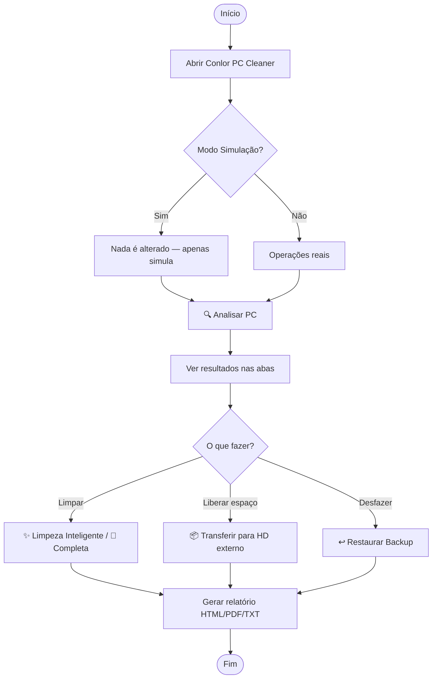
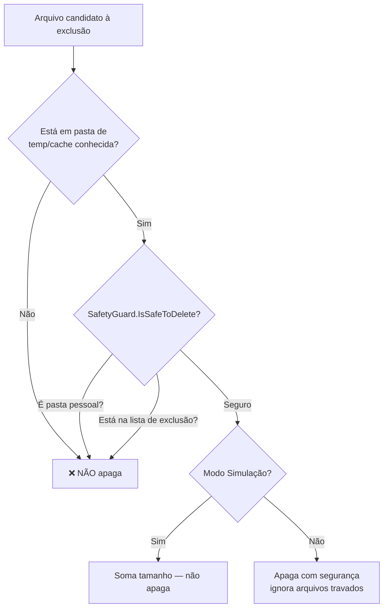
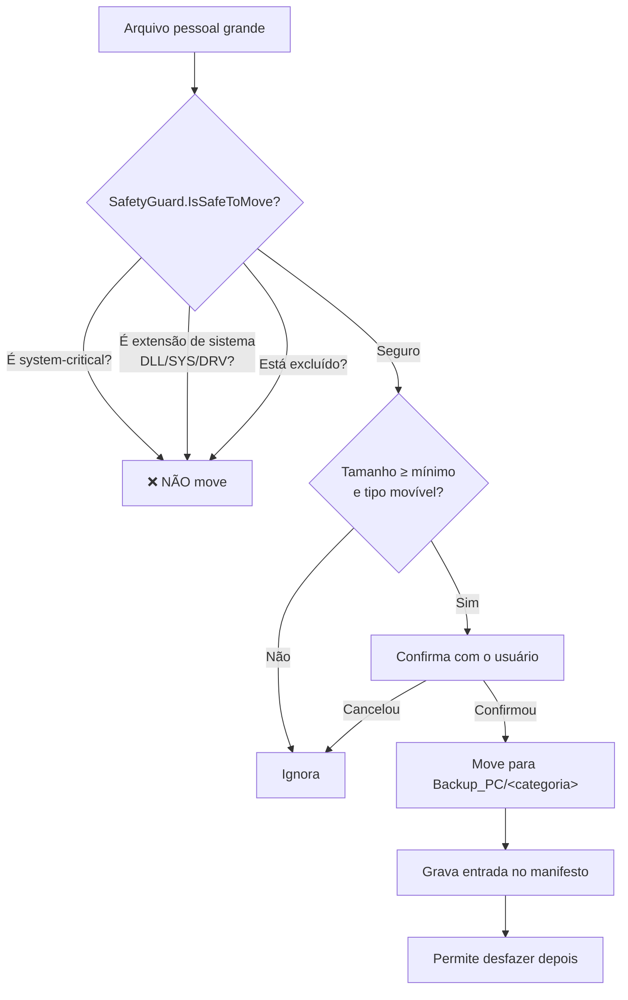
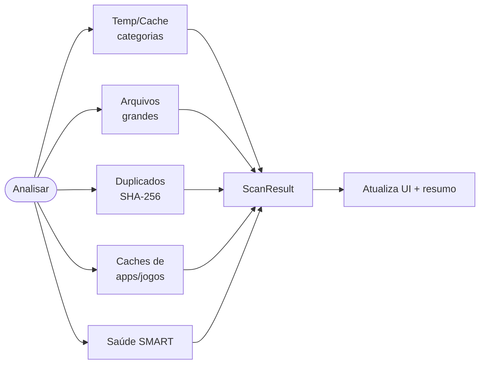
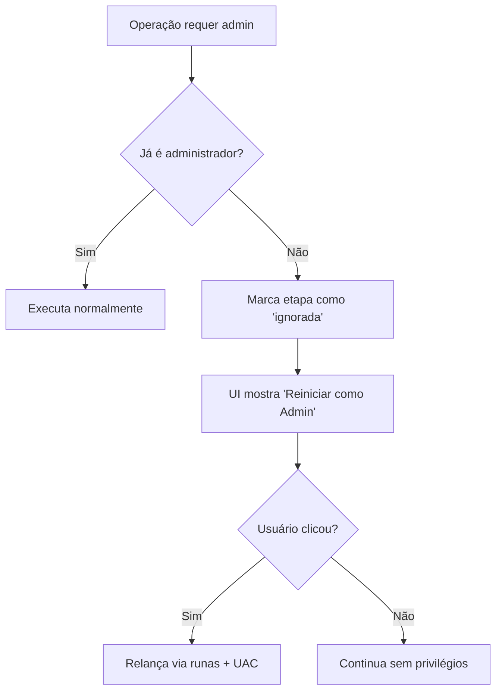

# Fluxogramas — Conlor PC Cleaner

Diagramas em [Mermaid](https://mermaid.js.org/). O GitHub renderiza automaticamente.

## 1. Fluxo principal do usuário

## 2. Decisão de segurança (apagar)

## 3. Decisão de segurança (mover para HD externo)

## 4. Pipeline de análise

## 5. Elevação sob demanda

