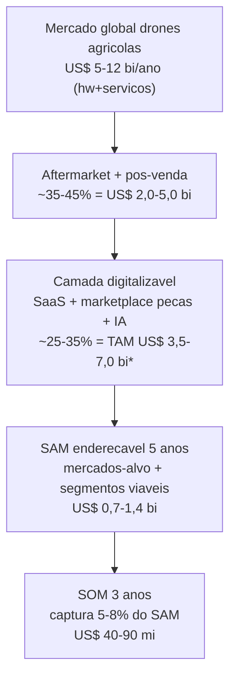
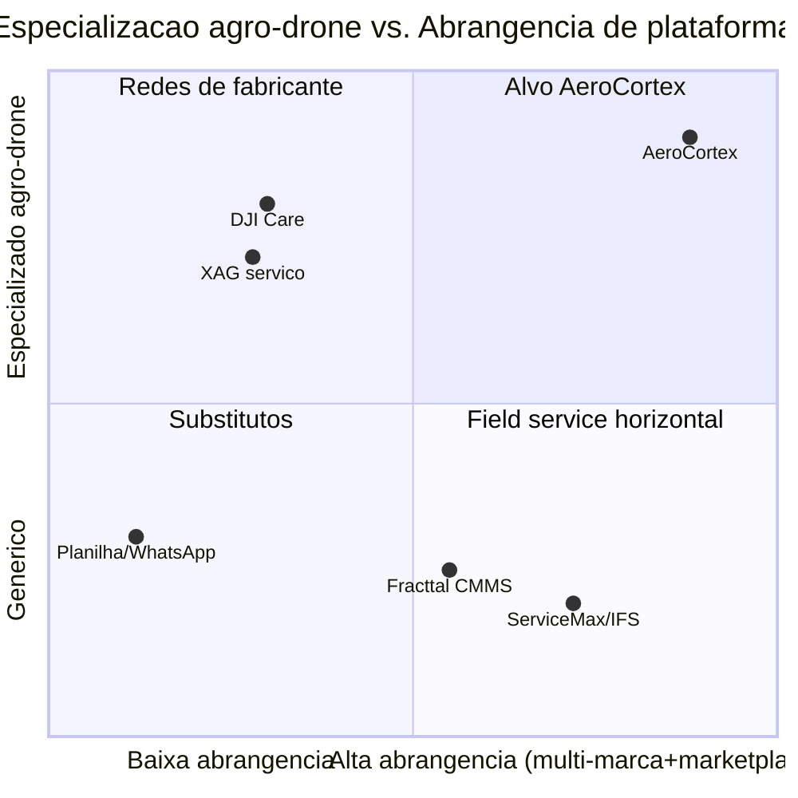
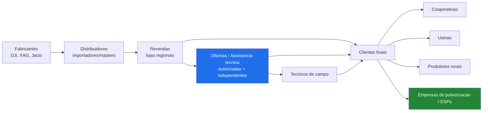
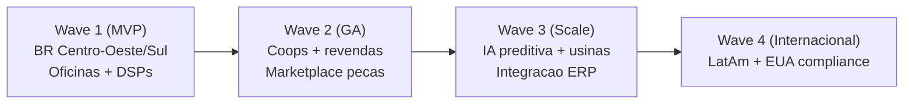

# Capitulo 1 — Estudo Completo de Mercado

> **Aviso metodologico:** Todos os numeros de mercado neste capitulo sao **ESTIMATIVAS** construidas pela equipe a partir de premissas explicitas, engenharia reversa de dados publicos e triangulacao top-down/bottom-up. Nao substituem due diligence com fontes primarias. Onde couber, indicamos **[VALIDAR]** com a fonte recomendada. Nenhuma citacao, URL ou numero foi inventado como se fosse fato oficial.

---

## 1.1 Sumario Executivo do Capitulo

O mercado de drones agricolas vive um ponto de inflexao: a frota global saltou de nicho para escala industrial, puxada pela DJI Agras (serie T), com XAG em segundo lugar e entrantes como Jacto, Hylio e fabricantes chineses de segunda linha. Estimamos uma **frota global de 500 mil a 1,2 milhao de unidades** ativas (2026), sendo China responsavel por 60-75%. O Brasil, ainda pequeno em base instalada (**estimativa de 15 a 40 mil unidades**), e o mercado de crescimento mais acelerado fora da Asia, com CAGR estimado de 35-55% a.a.

O gargalo estrutural nao e a venda do drone, e o **pos-venda**: manutencao, pecas, baterias, calibracao, rastreabilidade de horas de voo/hectares e conformidade regulatoria (ANAC/DECEA/MAPA/ANVISA). Hoje esse pos-venda e gerido em **planilhas, WhatsApp e ERPs genericos**, sem rastreabilidade de numero de serie, sem historico de peca, sem IA de diagnostico e sem marketplace. Essa e a dor central que a AeroCortex ataca.

**Dimensionamento (estimativas, detalhadas nas secoes 1.3):**

| Metrica | Valor estimado (global) | Valor estimado (Brasil/LatAm foco inicial) |
|---|---|---|
| TAM (economia de pos-venda + software) | US$ 3,5-7,0 bi/ano | US$ 250-500 mi/ano |
| SAM (SaaS + marketplace enderecavel) | US$ 700 mi-1,4 bi/ano | US$ 60-120 mi/ano |
| SOM (3 anos, captura realista) | US$ 40-90 mi/ano | US$ 8-20 mi/ano |

**Recomendacao go-to-market:** entrar pelo Brasil (Centro-Oeste e Sul), focando **oficinas/assistencias autorizadas e independentes + empresas de pulverizacao (DSPs)**, com produto SaaS de gestao de OS (ordem de servico) + rastreabilidade de frota + catalogo de pecas, e so depois abrir marketplace e IA de diagnostico.

---

## 1.2 Metodologia e Premissas

Usamos **duas metodologias em paralelo** e triangulamos o intervalo onde ambas convergem — pratica padrao em consultoria tier-1 para reduzir vies de fonte unica.

**Premissas mestras (explicitas):**

| Premissa | Valor adotado | Justificativa / [VALIDAR] |
|---|---|---|
| Cambio | US$ 1 = R$ 5,40 | Media 2025-2026; [VALIDAR] BCB PTAX na data do plano |
| Frota global ativa de drones agricolas | 500 mil-1,2 mi | Triangulacao vendas cumulativas DJI Agras + XAG; [VALIDAR] relatorios DJI/XAG e analistas (ex.: Drone Industry Insights, MarketsandMarkets) |
| % da frota fora da China | 25-40% | China e mercado maduro; expansao forte India/Brasil/EUA |
| Vida util economica do drone | 3-5 anos / 800-1.500 h de voo | Desgaste de motores, bombas, ESCs e degradacao de baterias |
| Gasto anual de manutencao + pecas por drone | US$ 1.500-4.500 | Baterias (maior item), helices, bombas, bicos, motores, ESC, sensores |
| Baterias por drone/ano | 1-3 packs (consumivel) | Ciclo 300-1.000 cargas; item de maior recorrencia |
| Ticket medio de OS de manutencao | R$ 800-6.000 | Da revisao simples ao reparo de crash |
| ARPU SaaS alvo (oficina/DSP) | R$ 300-2.500/mes | Por tier; detalhado no cap. de pricing |
| Oficinas/assistencias no Brasil | 150-600 pontos | Autorizadas DJI + independentes + revendas com bancada; [VALIDAR] rede oficial |

---

## 1.3 Dimensionamento de Mercado — TAM, SAM, SOM

### 1.3.1 Metodologia A — Top-Down

Partimos do tamanho do mercado global de drones agricolas (hardware + servicos), estimado por analistas na faixa de **US$ 5-12 bi em 2026** (crescendo para US$ 15-30 bi ate 2030, CAGR 20-30%) **[VALIDAR com Drone Industry Insights, MarketsandMarkets, Grand View Research]**. Aplicamos os cortes:

\*O TAM inclui parte do valor de pecas/servicos que transita pela plataforma (GMV do marketplace + SaaS + IA), nao apenas a receita de SaaS. Detalhamos os dois recortes abaixo.

### 1.3.2 Metodologia B — Bottom-Up

Construimos de baixo para cima, o metodo mais confiavel para o recorte de software:

**(1) TAM do pos-venda (wallet total):**
`Frota global x gasto anual manut+pecas/drone`
- Baixo: 500.000 x US$ 1.500 = **US$ 0,75 bi**
- Alto: 1.200.000 x US$ 4.500 = **US$ 5,4 bi**
- Convergencia com top-down: **TAM aftermarket ~US$ 2,0-5,0 bi**. Somando SaaS e IA -> **TAM total US$ 3,5-7,0 bi**.

**(2) SAM — receita enderecavel pela AeroCortex (SaaS + take-rate de marketplace):**

| Componente | Formula | Estimativa/ano |
|---|---|---|
| SaaS oficinas/DSPs (global enderecavel) | ~30-60 mil contas x US$ 1.200-4.000 ARPU | US$ 360 mi-2,4 bi |
| Take-rate marketplace pecas | GMV enderecavel US$ 1,5-3 bi x take 4-8% | US$ 60-240 mi |
| Modulos IA/rastreabilidade premium | 15-25% da base x uplift | US$ 50-150 mi |
| **SAM consolidado (foco realista)** | | **US$ 0,7-1,4 bi** |

**(3) SOM Brasil/LatAm (3 anos):**

| Ano | Contas pagas (oficinas+DSPs+frotas) | ARPU medio/mes (R$) | GMV marketplace (R$) | Receita total estimada |
|---|---|---|---|---|
| Ano 1 | 120-250 | 700 | 5-15 mi | R$ 4-9 mi (US$ 0,7-1,7 mi) |
| Ano 2 | 400-800 | 900 | 25-60 mi | R$ 12-28 mi (US$ 2,2-5,2 mi) |
| Ano 3 | 900-1.800 | 1.100 | 70-160 mi | R$ 30-70 mi (US$ 5,5-13 mi) |

> **Leitura:** o SOM de 3 anos (Brasil/LatAm) converge para **US$ 8-20 mi/ano**, consistente com capturar 5-8% do SAM regional. Global (com EUA e Asia via parceiros) empurra o teto para US$ 40-90 mi.

---

## 1.4 Segmentacao Geografica

| Regiao | Frota estimada | Maturidade | Atratividade inicial | Racional |
|---|---|---|---|---|
| **China/Asia** | 60-75% da frota | Alta (DJI/XAG saturado em servico) | Media (via parceiro) | Volume gigante, mas competicao local feroz e barreiras de idioma/rede |
| **Brasil** | 15-40 mil | Media, crescimento explosivo | **Muito alta (entrada)** | Agro forte, dor de pos-venda aguda, poucos concorrentes de software |
| **America Latina** | 5-20 mil | Baixa-media | Alta (fase 2) | Argentina, Paraguai, Colombia, Mexico; expansao natural do Brasil |
| **EUA** | 10-30 mil | Media, alto ticket | Alta (fase 2-3) | Regulacao FAA restritiva (Part 137/44807) cria demanda por compliance; ticket premium |
| **Africa** | 2-10 mil | Baixa | Media (fase 3+) | Potencial ESG/impacto, mas infra e poder de compra limitados |
| **Europa** | 5-15 mil | Baixa (EASA restritiva a pulverizacao) | Baixa-media | Regulacao anti-pulverizacao aerea limita TAM; foco em inspecao/mapeamento |

**Melhor opcao de entrada: Brasil.** Justificativa: (1) dor de pos-venda aguda e mal atendida; (2) baixa concorrencia de software especializado; (3) agronegocio digitalmente maduro e disposto a pagar por ROI; (4) equipe/idioma; (5) trampolim natural para LatAm.

### Segmentacao por Tipo de Cliente

| Segmento | Tamanho relativo | Dor dominante | Disposicao a pagar | Prioridade GTM |
|---|---|---|---|---|
| Empresas de pulverizacao / DSPs | Alto e crescente | Uptime, custo/ha, gestao de frota | Alta | **1 (ancora)** |
| Oficinas/assistencias autorizadas | Medio | OS, pecas, garantia, rastreabilidade | Alta | **1 (ancora)** |
| Oficinas independentes | Medio-alto (cauda longa) | Falta de sistema, diagnostico | Media-alta | 2 |
| Revendas/distribuidores | Medio | Estoque de pecas, pos-venda | Media | 2 |
| Cooperativas | Alto (agregador) | Gestao multi-frota, rateio | Alta | 2 (canal poderoso) |
| Usinas (cana) | Medio, ticket alto | Escala, integracao ERP, compliance | Alta | 3 |
| Produtor rural individual | Cauda muito longa | Custo, simplicidade | Baixa-media | 3 (self-serve) |

---

## 1.5 Analise de Concorrentes e Substitutos

Os concorrentes se dividem em **(a) fabricantes/rede oficial**, **(b) softwares horizontais de field service**, e **(c) substitutos improvisados** (planilhas, WhatsApp, ERPs genericos).

| Player | Tipo | Cobertura pos-venda drone | IA/diagnostico | Rastreabilidade N/S+peca | Marketplace pecas | Offline/campo | Foco agro-drone |
|---|---|---|---|---|---|---|---|
| **DJI (Care + rede autorizada)** | Fabricante | Alta (so DJI) | Baixa | Media (fechada) | Nao (so pecas DJI) | Parcial | Sim (proprietario) |
| **XAG (rede/servico)** | Fabricante | Media (so XAG) | Baixa-media | Media (fechada) | Nao | Parcial | Sim (proprietario) |
| **Jacto/entrantes** | Fabricante | Baixa (nascente) | Baixa | Baixa | Nao | Nao | Parcial |
| **ServiceMax / IFS** | Field service enterprise | Generico | Media | Generica (nao drone) | Nao | Sim | Nao |
| **Fracttal / manutencao (CMMS)** | Manutencao ativos | Generico | Baixa-media | Generica | Nao | Parcial | Nao |
| **Planilhas / WhatsApp / ERP generico** | Substituto | Nula-baixa | Nao | Nenhuma | Nao | Sim (manual) | Nao |
| **AeroCortex (proposto)** | Vertical SaaS+marketplace | **Multi-marca** | **Alta (visao)** | **Alta (N/S, hora, ha, peca)** | **Sim** | **Sim** | **Sim (nucleo)** |

**Insight competitivo:** ninguem oferece uma solucao **vertical, multi-marca, com rastreabilidade a nivel de numero de serie/peca, marketplace e IA, funcionando offline no campo**. As redes de fabricante sao silos fechados por marca; os softwares horizontais nao entendem drone agricola (baterias, horas de voo, hectares, calibracao de bicos, crash reports). Esse "vazio de mercado" e o fosso (moat) inicial da AeroCortex.

**Matriz de posicionamento (2 eixos):**

---

## 1.6 Cadeia de Valor

**Onde a AeroCortex captura valor:** o elo **oficina/assistencia <-> cliente final (DSP/coop)** e o ponto de maior friccao e menor digitalizacao. A plataforma se posiciona como **sistema operacional do pos-venda**, conectando fabricantes (catalogo/garantia), revendas (estoque de pecas), oficinas (OS/diagnostico) e clientes (frota/uptime), monetizando via SaaS + take-rate de marketplace + modulos de IA.

---

## 1.7 Mapa de Dores por Persona

| Persona | Principais dores | Custo da dor (estimativa) | Como resolve hoje |
|---|---|---|---|
| **Produtor rural** | Drone parado em safra; nao sabe historico; medo de peca falsa; janela agronomica perdida | R$ 200-2.000/ha nao aplicado; multa de safra | Liga para revenda, espera, WhatsApp |
| **Cooperativa** | Gerir multi-frota associados; rateio de custo; padronizar manutencao; compliance coletivo | Ociosidade de frota; retrabalho administrativo | Planilhas por associado, ERP generico |
| **Usina (cana)** | Escala, integracao ERP (SAP/TOTVS), compliance ambiental, disponibilidade | Downtime x custo/ha x milhares de ha | ERP corporativo sem modulo drone |
| **Empresa de pulverizacao / DSP** | Uptime = faturamento; custo por hectare; gestao de baterias; SLA com cliente | Cada dia parado = R$ 5-30 mil de receita | Controle manual, multiplas planilhas |
| **Oficina / assistencia** | Sem sistema de OS; controle de garantia; pecas; historico por N/S; produtividade do tecnico | Perda de margem, retrabalho, disputa de garantia | Caderno, WhatsApp, planilha, ERP fiscal |
| **Tecnico de campo** | Diagnostico sem historico; sem manual/peca a mao; offline; sem checklist | Visitas repetidas, erro de diagnostico | Experiencia propria, grupos de WhatsApp |
| **Gestor (frota/servico)** | Falta de KPI (MTTR, MTBF, custo/ha, uptime); previsibilidade | Decisao no escuro, capex mal alocado | BI improvisado, relatorios manuais |
| **Fabricante** | Visibilidade de campo, qualidade, garantia, fidelizacao de pecas | Custo de garantia, churn de marca | Sistemas fechados por regiao |
| **Revenda/distribuidor** | Giro de estoque de pecas; previsao de demanda; pos-venda como receita | Capital preso, ruptura de peca critica | ERP fiscal + feeling |

**Sintese:** a dor transversal e **falta de rastreabilidade e de dados** — ninguem sabe, com precisao, o historico de um drone (horas, ha, quedas, pecas trocadas, garantia). Isso alimenta downtime, disputas de garantia, peca pirata e decisao ruim. **Custo agregado da dor no Brasil: estimativa de R$ 150-400 milhoes/ano** em ociosidade, retrabalho e perdas de safra [VALIDAR via pesquisa de campo com DSPs].

---

## 1.8 Tendencias e Regulacao

**Regulacao (fator critico de mercado):**

| Jurisdicao | Orgao | Impacto no mercado |
|---|---|---|
| Brasil | ANAC (RBAC-E 94), DECEA (voo/SARPAS), MAPA/ANVISA (defensivos), IBAMA | Exige cadastro, habilitacao, rastreabilidade de aplicacao — **tailwind para software de compliance** |
| EUA | FAA (Part 107, Part 137 exemption, 44807) | Pulverizacao exige waiver + peso >55lb; compliance complexo = demanda por sistema |
| Europa | EASA | Restritiva a pulverizacao aerea (Diretiva uso sustentavel) — **limita TAM de spray, favorece inspecao** |

**Tendencias tecnologicas e de mercado:**
1. **Eletrificacao e baterias** — item de maior recorrencia de pos-venda; gestao de ciclo de bateria e killer feature.
2. **BVLOS (voo alem da linha visual)** — abre operacoes maiores; aumenta exigencia de rastreabilidade/manutencao preventiva.
3. **Swarm (enxame)** — multiplos drones por operacao; escala a complexidade de gestao de frota.
4. **IA de diagnostico e manutencao preditiva** — de logs de voo/telemetria a previsao de falha (moat de dados).
5. **Seguros agricolas e de equipamento** — demanda por historico auditavel de manutencao para underwriting/sinistro.
6. **ESG e rastreabilidade de aplicacao** — pressao por reducao de defensivo e comprovacao ambiental.

### PESTEL (resumo)

| Fator | Sinal | Implicacao |
|---|---|---|
| Politico | Incentivo ao agro; regulacao de drones amadurecendo | Positivo, com risco regulatorio |
| Economico | Juros/cambio; credito rural | Sensibilidade a capex; SaaS OPEX e vantagem |
| Social | Escassez de mao de obra rural qualificada | Aumenta adocao de drone e de ferramentas |
| Tecnologico | Edge AI, baterias, conectividade rural (Starlink) | Viabiliza offline + IA no campo |
| Ecologico | Pressao ESG, uso racional de defensivo | Rastreabilidade vira exigencia |
| Legal | ANAC/DECEA/MAPA, LGPD | Compliance como feature vendavel |

### 5 Forcas de Porter

| Forca | Intensidade | Comentario |
|---|---|---|
| Rivalidade | Media-baixa (software vertical) | Vazio competitivo; alta em field service horizontal |
| Novos entrantes | Media | Barreira = dados + rede + integracao com fabricantes |
| Poder do comprador | Media | DSPs/coops negociam, mas dor alta |
| Poder do fornecedor | **Alta (DJI)** | Dependencia de API/dados/pecas do fabricante = risco-chave |
| Substitutos | Media-alta | Planilhas/WhatsApp sao "gratis"; vencer pela dor e ROI |

### SWOT AeroCortex

| Forcas | Fraquezas |
|---|---|
| Vertical, multi-marca, rastreabilidade, offline, IA, marketplace | Marca nova; dependencia de dados de fabricante; capital inicial |
| **Oportunidades** | **Ameacas** |
| Vazio de mercado; regulacao pro-compliance; expansao LatAm/EUA; dados como moat | DJI/XAG fecharem ecossistema; entrante bem financiado; mudanca regulatoria |

---

## 1.9 Oportunidades Priorizadas, Riscos e Go-to-Market

### Oportunidades priorizadas

| # | Oportunidade | Impacto | Dificuldade (1-5) | Prioridade |
|---|---|---|---|---|
| 1 | SaaS de OS + rastreabilidade para oficinas/DSPs (BR) | Alto | 3 | **P0** |
| 2 | Modulo compliance ANAC/DECEA/MAPA | Alto | 3 | **P0** |
| 3 | Gestao de baterias e frota (uptime/custo-ha) | Alto | 3 | P1 |
| 4 | Marketplace de pecas multi-marca | Muito alto | 4 | P1 |
| 5 | IA de diagnostico/preditiva (moat de dados) | Muito alto | 5 | P2 |
| 6 | Canal via cooperativas (agregador) | Alto | 2 | P1 |
| 7 | Expansao LatAm e EUA (compliance premium) | Alto | 4 | P2 |

### Riscos de mercado + mitigacao

| Risco | Prob. | Impacto | Mitigacao |
|---|---|---|---|
| DJI/XAG fecharem API/dados ou lancarem software proprio | Media | Alto | Multi-marca, dados proprios via app do tecnico, foco em oficina independente |
| Adocao lenta (cultura de planilha) | Media | Alto | Onboarding assistido, ROI claro, free tier, integracao WhatsApp |
| Mudanca regulatoria (restringir pulverizacao) | Baixa-media | Alto | Diversificar para mapeamento/inspecao; compliance como feature |
| Entrante bem financiado | Media | Medio | Velocidade, moat de dados, rede de oficinas |
| Cambio/juros comprimindo capex do agro | Media | Medio | Modelo OPEX/SaaS, precos em R$ |

### Go-to-Market inicial recomendado

**Recomendacao final:** ancorar em **oficinas autorizadas/independentes e DSPs no Brasil** com um SaaS de OS + rastreabilidade + compliance (dor aguda, ROI imediato, baixo CAC via rede), usar **cooperativas como canal de distribuicao**, e construir o **moat de dados** que habilita marketplace e IA nas ondas seguintes. Melhor opcao por combinar maior dor, menor concorrencia e caminho natural de expansao regional.
