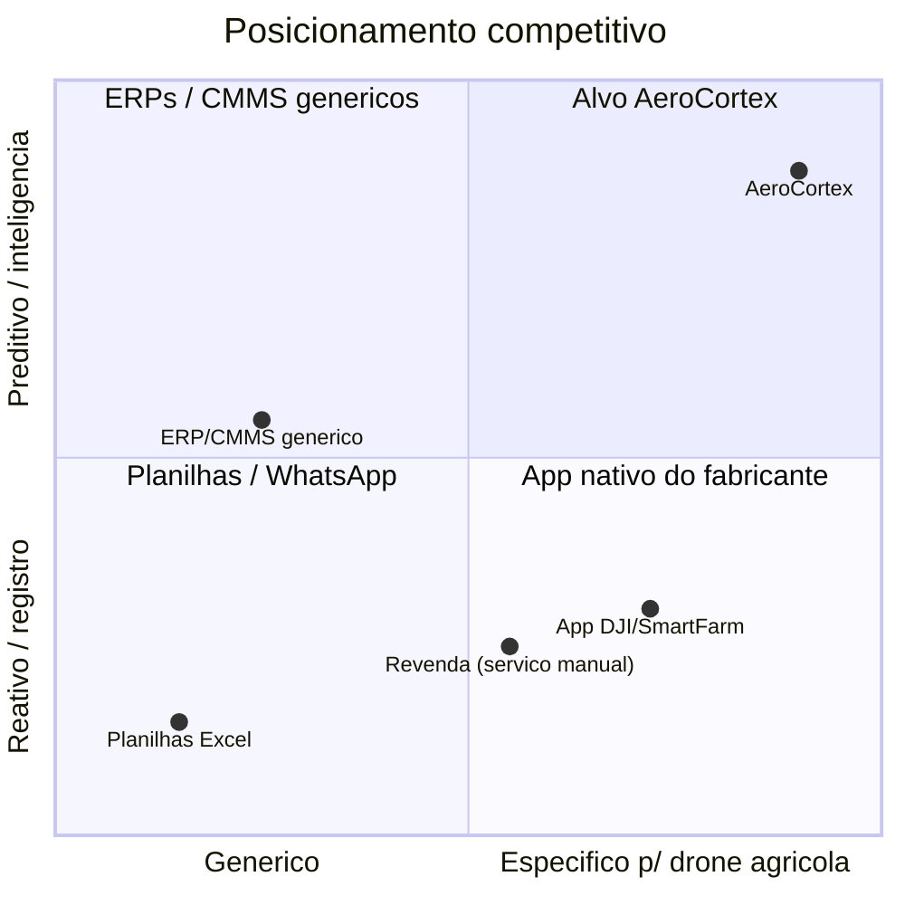
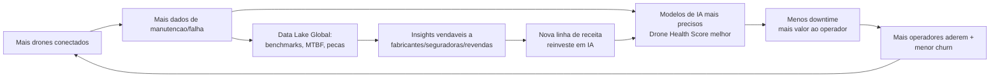
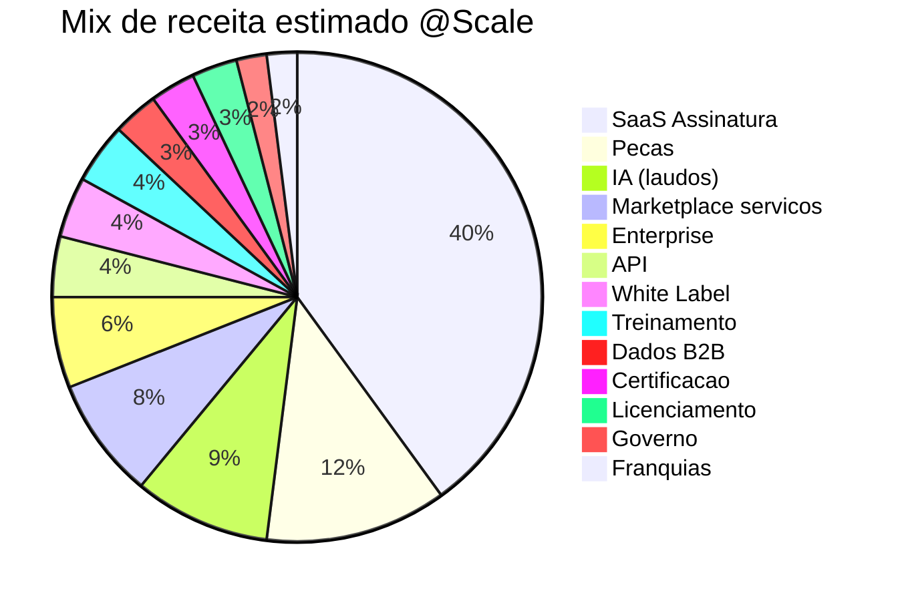
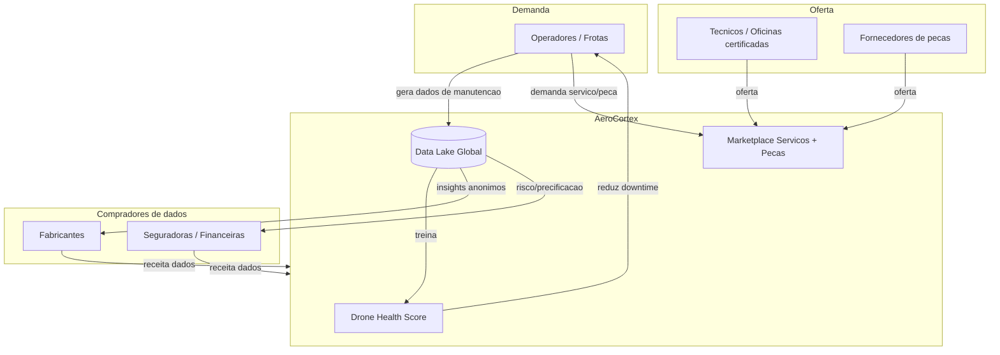

# Capitulo 2 — Business Plan

> **Escopo:** Este capitulo define a espinha dorsal comercial da AeroCortex (nome de trabalho, a validar) — a plataforma de gestao e manutencao de drones agricolas com foco inicial em **DJI Agras** e expansao para **XAG, Jacto** e todo o mercado. Aqui consolidamos missao/visao/valores, posicionamento, a estrategia Blue Ocean, o moat de dados, o modelo de receita completo (todas as linhas), o Business Model Canvas e a estrategia de precificacao.
>
> **Aviso metodologico:** Todos os numeros financeiros e de mercado sao **ESTIMATIVAS** de trabalho, construidas por analogia (SaaS vertical B2B, fleet management, marketplaces de pecas) e premissas explicitas. **Cambio de trabalho:** US$ 1,00 = R$ 5,40. Devem ser validados com fonte primaria (dados de vendas DJI/revendas, ANAC/MAPA, entrevistas com operadores) antes de qualquer decisao de investimento.

---

## 2.1 Missao, Visao e Valores

### Missao
> **Manter cada drone agricola do mundo voando com o maximo de disponibilidade, seguranca e retorno por hectare — transformando manutencao reativa em inteligencia preditiva.**

A missao ancora a proposta de valor na dor economica real do operador: **downtime na janela de aplicacao custa safra**. Um Agras parado em plena janela de pulverizacao pode representar perda de R$ 5.000 a R$ 20.000/dia em faturamento de servico (ESTIMATIVA: 150–400 ha/dia x R$ 30–50/ha).

### Visao (10 anos)
> **Ser o sistema operacional global da manutencao e operacao de drones agricolas — o "CarFax + Salesforce + AWS" do setor — presente em >50 paises e cobrindo >70% da frota ativa de pulverizacao.**

### Valores
| Valor | Traducao operacional |
|---|---|
| **Seguranca primeiro** | Nenhuma recomendacao de IA sobrepoe checklist de aeronavegabilidade; rastreabilidade total de laudos. |
| **Dado como ativo do cliente** | Operador e dono do seu dado; monetizamos agregados anonimizados com consentimento (opt-in). |
| **Obcecados por uptime** | Metrica-norte interna = disponibilidade da frota dos clientes. |
| **Aberto e interoperavel** | APIs abertas, sem lock-in artificial de hardware. |
| **Bilingue campo-engenharia** | Produto usavel por tecnico de barracao e por engenheiro de dados. |

---

## 2.2 Posicionamento Estrategico

**Statement de posicionamento:** *Para operadores, prestadores de servico e revendas de drones agricolas que perdem receita com downtime e falta de rastreabilidade, a AeroCortex e a plataforma de gestao e manutencao preditiva que unifica saude da frota, pecas, laudos com IA e conformidade regulatoria — diferente de planilhas, do app nativo do fabricante e de ERPs genericos, porque foi construida especificamente para a operacao de pulverizacao aerea e melhora a cada manutencao registrada.*

**Por que este quadrante e defensavel:** o app nativo do fabricante nunca sera multimarca (conflito estrategico com XAG/Jacto) e ERPs genericos nunca terao o modelo de dados de aeronavegabilidade de drone. Ocupamos o canto superior-direito sozinhos.

---

## 2.3 Estrategia Blue Ocean — Grid ERRC

A logica Blue Ocean: em vez de competir de frente com o app do fabricante (oceano vermelho de features de voo), criamos um **espaco de mercado novo** — a camada de gestao, manutencao e financas da frota — onde a concorrencia e irrelevante.

### Grid Eliminar-Reduzir-Aumentar-Criar

| **ELIMINAR** | **REDUZIR** |
|---|---|
| Dependencia de planilhas e grupos de WhatsApp para historico | Custo/tempo de diagnostico manual em barracao |
| Lock-in de marca unica (so DJI) | Complexidade de onboarding (setup em minutos, nao dias) |
| Papelada fisica de laudos e ordens de servico | Dependencia de tecnico especialista para triagem inicial |
| **AUMENTAR** | **CRIAR** |
|---|---|
| Rastreabilidade e valor de revenda do drone | **Drone Health Score** (indice 0–100 preditivo, portavel) |
| Disponibilidade (uptime) da frota | **Data Lake Global** com benchmarking anonimo entre operadores |
| Velocidade de acesso a pecas certas | **Laudo de IA por foto/log/audio** de defeito |
| Confianca em conformidade (ANAC/MAPA) | **Passaporte digital do drone** (historico que segue o ativo na revenda) |

**Curva de valor — insight central:** competidores investem pesado em "features de voo/mapeamento". Nos investimos onde ninguem investe: **saude preditiva, economia de pecas, conformidade e liquidez de revenda**. Isso muda o eixo de competicao de "quem voa melhor" para "quem opera com menor custo total de propriedade (TCO)".

---

## 2.4 Diferenciais Competitivos e Moat (Defensibilidade)

Tres ativos compostos criam um fosso que aumenta com o tempo:

| Moat | O que e | Por que e defensavel |
|---|---|---|
| **Efeito de rede de dados** | Cada manutencao/falha registrada treina os modelos; precisao cresce com N. | Entrante novo comeca com dados zerados; nao consegue igualar o Health Score sem escala equivalente. |
| **Drone Health Score** | Indice preditivo 0–100 por drone e por frota, padrao de mercado. | Vira "moeda" na revenda e na aceitacao de seguro — efeito de padrao (standard lock-in). |
| **Data Lake Global** | Repositorio agregado e anonimizado de MTBF, modos de falha, custo de peca por regiao. | Ativo unico, nao replicavel; base para receita de dados B2B (fabricantes, seguradoras). |
| **Custo de troca (switching cost)** | Historico completo do ativo vive na plataforma; migrar = perder passaporte digital. | Aumenta com o tempo de uso; ancora recorrencia. |
| **Conformidade embarcada** | Templates ANAC/MAPA e trilha de auditoria. | Barreira regulatoria local dificil para players estrangeiros. |

**Como cada manutencao aumenta o valor do dado (o coracao do modelo):** cada ordem de servico adiciona um par (sintoma → causa → peca → resultado). Com milhares desses pares, a IA prediz falhas antes que ocorram (ex.: "ESC do motor 3 com 78% de probabilidade de falha em 40 horas de voo"). Isso converte manutencao **corretiva (cara, com downtime)** em **preditiva (barata, agendada)** — o unico ativo que competidor nenhum copia sem passar pelos mesmos milhares de voos.

---

## 2.5 Modelo de Receita (Todas as Linhas)

Arquitetura de receita em **tres camadas**: (1) recorrente/previsivel (SaaS), (2) transacional/variavel (marketplace, IA, pecas), (3) estrategica/alavancada (licenciamento, white label, dados, governo). Premissa: diversificacao reduz risco de concentracao e aumenta LTV.

### 2.5.1 Tabela mestre de linhas de receita (ESTIMATIVA)

| # | Linha | Descricao | Pricing sugerido (R$ / US$) | Unit economics-chave | % receita @Scale (est.) |
|---|---|---|---|---|---|
| 1 | **SaaS Assinatura (tiers)** | Nucleo recorrente por drone/assento. | Ver 2.5.2. Free / Pro R$249 (US$46) por drone/mes / Business R$1.490 (US$276)/mes / Enterprise sob consulta | Margem bruta ~85%; CAC recuperado em 6–10 meses | 40% |
| 2 | **Marketplace de servicos** | Conecta operador a tecnico/oficina credenciada. | Take-rate **12–18%** do valor do servico | GMV medio/servico R$800; receita R$96–144 | 8% |
| 3 | **Receita por Pecas** | E-commerce/dropship de pecas e consumiveis (helices, bicos, baterias, ESC). | Markup **15–25%** ou take-rate 10–15% em terceiros | Ticket medio R$450; margem R$70–110 | 12% |
| 4 | **Receita por IA (por uso/laudo)** | Laudo diagnostico por foto/log/audio; creditos de IA. | R$29–89 (US$5–16) por laudo; pacotes de creditos | Custo marginal de inferencia ~R$3–8; margem >85% | 9% |
| 5 | **Receita por API** | Acesso programatico (dados de frota, Health Score) para ERPs/revendas. | R$0,05–0,50/chamada; planos R$990–9.900/mes | Margem ~90%; sticky (integracao) | 4% |
| 6 | **Receita por Treinamento** | Cursos de operacao/manutencao/piloto, on-demand e presencial. | R$390–2.900 (US$72–537) por trilha; B2B corporativo | Margem 60–75% (conteudo reutilizavel) | 4% |
| 7 | **Receita por Certificacao** | Selo "Tecnico Certificado AeroCortex" / oficina credenciada. | R$490–1.900/ano por profissional/oficina | Recorrente anual; reforca marketplace | 3% |
| 8 | **Licenciamento** | Licenca de tecnologia/modelos a revendas e integradores. | R$ fixo + royalty 3–8% da receita gerada | Alta margem; escala sem CAC direto | 3% |
| 9 | **White Label** | Plataforma com marca da revenda/cooperativa. | Setup R$50k–250k + mensal R$5k–30k | Ancora grandes contas; margem 70% | 4% |
| 10 | **Franquias** | Unidades de servico/assistencia com marca e sistema. | Taxa de franquia R$40k–120k + royalty 5–8% | Expansao capital-light da malha fisica | 2% |
| 11 | **Enterprise** | Grandes frotas (cooperativas, agroservicos, usinas). | Contrato R$120k–1,2M/ano (por frota/uso) | ACV alto; ciclo 3–6 meses; churn baixo | 6% |
| 12 | **Governo** | Orgaos (Defesa Agropecuaria, MAPA, estaduais) — fiscalizacao/rastreabilidade. | Licitacao/contrato R$200k–5M/ano | Ciclo longo; alto ticket; reforca conformidade | 2% |
| 13 | **Internacional** | Mesmas linhas em US$/EUR, ajustadas por PPP. | Pricing local (US$/mes por drone) | Alavanca de TAM; requer localizacao | (transversal) |
| 14 | **Dados B2B (Data Lake)** | Insights agregados anonimos a fabricantes, seguradoras, financeiras. | Assinatura R$100k–2M/ano ou por relatorio | Margem >90%; so possivel com escala | 3% |

> Linhas listadas no briefing como duplicadas — "Recorrente", "Transacional", "Receita por Marketplace", "Receita por Assinatura" — sao **categorias/agregacoes** das linhas 1–5 acima, nao SKUs adicionais. Consolidadas para evitar dupla contagem.

### 2.5.2 Tiers de assinatura SaaS (detalhe)

| Tier | Publico | Preco (R$/mes) | Preco (US$/mes) | Limites | Objetivo estrategico |
|---|---|---|---|---|---|
| **Free / Starter** | 1 drone, autonomo | R$ 0 | US$ 0 | 1 drone, historico 90 dias, sem IA | Aquisicao / topo de funil (PLG) |
| **Pro** | Operador pequeno (1–3 drones) | R$ 249 por drone | US$ 46 por drone | Health Score, laudos IA limitados, pecas | Monetizacao base |
| **Business** | Prestador de servico / frota (4–15) | R$ 1.490 flat + R$149/drone extra | US$ 276 + US$28 | IA ilimitada*, API basica, multiusuario | Coracao da receita |
| **Enterprise** | Cooperativa / agroservico (>15) | Sob consulta (a partir de R$ 10k) | A partir de US$ 1.850 | SLA, SSO, white label opcional, CSM | ACV alto, baixo churn |

*"Ilimitada" com politica de uso justo (fair use) para proteger custo de inferencia.

### 2.5.3 Unit economics de referencia (ESTIMATIVA)

| Metrica | Valor-alvo (Scale) | Premissa / metodologia |
|---|---|---|
| ARPA (receita media por conta/ano) | R$ 8.400 (US$ 1.556) | Mix Pro/Business ponderado + transacional |
| Margem bruta blended | 78–85% | SaaS 85%, pecas 20%, IA 85%, marketplace ~100% do take |
| CAC (Business) | R$ 3.500–6.000 | Vendas inside + canal revenda |
| LTV (Business, 3 anos, churn 12%/ano) | R$ 20.000–28.000 | ARPA x margem / churn |
| **LTV/CAC** | **3,5–5,0x** | Meta saudavel SaaS B2B (>3x) |
| Payback CAC | 6–10 meses | Alvo <12 meses |
| Net Revenue Retention (NRR) | 115–130% | Expansao por drone + upsell IA/pecas |

**Distribuicao de receita @Scale (visao grafica):**

---

## 2.6 Business Model Canvas (9 Blocos)

| Bloco | Conteudo |
|---|---|
| **1. Segmentos de Cliente** | (a) Operadores/prestadores de pulverizacao; (b) Revendas e integradores DJI/XAG/Jacto; (c) Cooperativas e agroservicos (Enterprise); (d) Fabricantes, seguradoras e financeiras (Dados B2B); (e) Governo/orgaos de fiscalizacao. |
| **2. Proposta de Valor** | Maximizar uptime e reduzir TCO da frota via manutencao preditiva (Drone Health Score), laudo por IA, pecas na hora certa, conformidade automatica e passaporte digital que aumenta valor de revenda. |
| **3. Canais** | PLG (free tier + conteudo), canal de revendas (co-selling), inside sales para Business/Enterprise, marketplace, eventos do agro (feiras), parceria com fabricantes. |
| **4. Relacionamento** | Self-service (Pro), Customer Success dedicado (Enterprise), comunidade de operadores, programa de certificacao, suporte tecnico multicanal. |
| **5. Fontes de Receita** | 14 linhas da secao 2.5 (SaaS, pecas, IA, marketplace, API, treinamento, certificacao, licenciamento, white label, franquias, enterprise, governo, internacional, dados). |
| **6. Recursos-Chave** | Data Lake Global, modelos de IA/Health Score, base de conhecimento de manutencao, engenharia de plataforma, marca/credenciamento, rede de oficinas. |
| **7. Atividades-Chave** | Desenvolvimento de produto/IA, curadoria de dados, gestao do marketplace, credenciamento tecnico, vendas e CS, compliance regulatorio. |
| **8. Parcerias-Chave** | Revendas DJI/XAG/Jacto, distribuidores de pecas, oficinas, seguradoras, cooperativas, provedores de nuvem (Edge/Cloud), instituicoes de treinamento. |
| **9. Estrutura de Custos** | Nuvem + inferencia de IA, P&D/engenharia, vendas e marketing (CAC), CS/suporte, custo de pecas (COGS marketplace), compliance, G&A. Maiores alavancas: inferencia IA e CAC. |

---

## 2.7 Estrategia de Precificacao

Adotamos **precificacao hibrida value-based**, combinando quatro eixos para capturar valor onde ele existe sem criar atrito de adocao:

| Eixo de precificacao | Como funciona | Quando usar | Vantagem | Risco/mitigacao |
|---|---|---|---|---|
| **Por drone** | Preco escala com nº de drones ativos. | Pro / Business | Alinha preco a valor (frota maior = mais valor) | Penaliza frota grande → aplicar desconto por volume |
| **Por frota (flat + faixa)** | Assinatura fixa por faixa de tamanho de frota. | Business / Enterprise | Previsivel para o cliente | Subprecifica outliers → limites de fair use |
| **Por assento (seat)** | Cobranca por usuario (tecnico, gestor, financeiro). | Enterprise / cooperativas | Captura valor em times grandes | Compartilhamento de login → SSO obrigatorio |
| **Por uso de IA** | Creditos/laudos consumidos (usage-based). | Todos os tiers | Monetiza usuarios intensivos; barreira baixa de entrada | Imprevisibilidade → pacotes + alertas de consumo |

**Principio-guia (value metric):** a metrica de valor primaria e o **drone ativo gerenciado** — cresce com o sucesso do cliente e sustenta NRR >115%. IA e pecas sao **overlays transacionais** sobre a base recorrente.

**Ancoragem de valor:** o ROI para o cliente e comunicado em "dias de downtime evitados". Se a assinatura Business custa ~R$ 18k/ano e evita 2–3 dias de parada em safra (R$ 10k–60k), o **payback do cliente e < 1 mes** — ancora que justifica value-based pricing acima do custo.

---

## 2.8 Estrategia de Plataforma e Efeitos de Rede

A AeroCortex e desenhada como **plataforma de dois/tres lados**, nao apenas SaaS de ferramenta:

**Efeitos de rede em tres camadas:**
1. **Rede de dados (o mais forte):** cada manutencao melhora a IA para todos — retorno crescente de escala.
2. **Rede de marketplace:** mais operadores atraem mais oficinas/fornecedores, que atraem mais operadores (efeito cross-side).
3. **Rede de padrao:** quando o Drone Health Score vira referencia na revenda e no seguro, adotar a plataforma deixa de ser opcional.

**Como cada manutencao aumenta o valor do dado — mecanismo economico:** o valor marginal de um novo registro nao e linear — ele **compõe**. Registro nº 1.000.000 melhora a predicao para 100% da base instalada simultaneamente. Isso e o oposto de um servico de mao de obra (onde o valor nao acumula) e e o que justifica valuation de plataforma, nao de agencia.

---

## 2.9 Comparacao de Modelos de Monetizacao e Mix por Fase

### 2.9.1 Modelos alternativos avaliados

| Modelo | Descricao | Pros | Contras | Veredito |
|---|---|---|---|---|
| **SaaS puro (assinatura)** | So mensalidade por drone/assento | Previsivel, alta margem, valuation premium | Teto de receita; subexplora transacional | Base obrigatoria, insuficiente sozinho |
| **Transacional puro (take-rate)** | So marketplace/pecas/laudo | Baixa barreira de entrada; escala com uso | Receita volatil, sazonal (safra), churn alto | Complemento, nao nucleo |
| **Marketplace puro** | So intermediacao servico/pecas | Capital-light; efeito de rede | Sem lock-in de dados; margem depende de GMV | Acelerador, precisa do SaaS ancorando |
| **Licenciamento/White label** | Vender tecnologia a terceiros | Alta margem, escala sem CAC | Canibaliza marca; dependencia de parceiro | Alavanca seletiva (grandes contas) |
| **Dados (data-as-a-product)** | Vender insights agregados | Margem >90%; unico | So viavel com escala + governanca de dados | Colher no Scale |
| **Hibrido em camadas (recomendado)** | SaaS + transacional + estrategico | Diversifica risco; maximiza LTV; NRR alto | Complexidade operacional/faturamento | **MELHOR OPCAO** |

**Recomendacao: modelo HIBRIDO em camadas.** Justificativa: nenhum modelo isolado captura o valor total nem sustenta o moat. O SaaS ancora previsibilidade e valuation; o transacional captura upside de safra e usuarios intensivos; o estrategico (dados/licenca/gov) so e possivel com escala e tem margem altissima. A combinacao entrega **NRR alto + margem + defensibilidade**.

### 2.9.2 Mix recomendado por fase

| Linha | Early (0–18m, MVP/GA) | Growth (18–36m) | Scale (36m+) | Racional |
|---|---|---|---|---|
| SaaS Assinatura | **55%** | 48% | 40% | Fundacao; foco em PMF e recorrencia |
| Pecas | 10% | 12% | 12% | Cresce com base instalada |
| IA (laudos) | 8% | 10% | 9% | Requer maturidade de modelo |
| Marketplace servicos | 5% | 8% | 8% | Depende de liquidez de rede |
| API | 2% | 4% | 4% | Ecossistema de integracao maduro |
| Treinamento | 8% | 5% | 4% | Alto no early (educa mercado), estabiliza |
| Certificacao | 4% | 3% | 3% | Reforca marketplace |
| Enterprise | 3% | 5% | 6% | Ciclo longo; matura no growth |
| White Label / Licenc. | 3% | 4% | 7% | Escala via parceiros no scale |
| Franquias | 1% | 1% | 2% | Malha fisica capital-light |
| Dados B2B | 0% | ~0–1% | 3% | So com escala de dados |
| Governo | 1% | ~0–1% | 2% | Ciclo de licitacao longo |

**Leitura estrategica:** no **Early**, concentre em SaaS + Treinamento (educar mercado e provar PMF); no **Growth**, ative marketplace, IA e Enterprise (liquidez de rede + ACV); no **Scale**, colha as linhas de altissima margem (Dados, White Label, Licenciamento) que so a escala destrava. O mix migra de "produto" para "plataforma" para "ecossistema".

---

## 2.10 Sintese de Custos, Riscos e Prioridade

| Iniciativa comercial | Custo impl. (R$ / US$) | Dificuldade (1–5) | Prioridade | Risco principal → mitigacao |
|---|---|---|---|---|
| Definir pricing/tiers + billing | R$ 120k / US$ 22k | 3 | P0 | Pricing errado → testes A/B, entrevistas, revisao trimestral |
| Motor de assinatura + medicao de uso (IA) | R$ 380k / US$ 70k | 4 | P0 | Vazamento de receita → billing com auditoria de uso |
| Marketplace (v1 servicos + pecas) | R$ 650k / US$ 120k | 4 | P1 | Falta de liquidez → seed manual de oferta, take-rate baixo inicial |
| Data Lake + governanca (LGPD) | R$ 900k / US$ 167k | 5 | P1 | Consentimento/privacidade → opt-in, anonimizacao, DPA |
| Programa de certificacao/franquia | R$ 300k / US$ 56k | 3 | P2 | Qualidade inconsistente → auditoria e SLA de credenciados |
| Oferta de Dados B2B | R$ 450k / US$ 83k | 4 | P2 (Scale) | Sensibilidade de dados → contratos, agregacao k-anonima |

**Riscos transversais do modelo de negocio:**
- **Concentracao em DJI** → mitigar com roadmap multimarca (XAG/Jacto) desde o design de dados.
- **Sazonalidade da safra** (receita transacional oscila) → ancorar em contratos anuais SaaS.
- **Guerra de preco com app do fabricante** → competir em multimarca + dados + conformidade, nao em features de voo.
- **Custo de inferencia de IA** corroendo margem → pacotes/creditos, otimizacao de modelo e Edge/TinyML (ver capitulo de IA).

---

*Fim do Capitulo 2. Proximos capitulos detalham arquitetura de produto, stack de IA, go-to-market e projecoes financeiras que quantificam as premissas aqui declaradas como ESTIMATIVA.*
