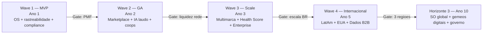
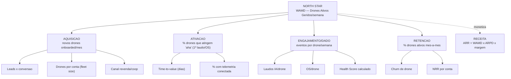
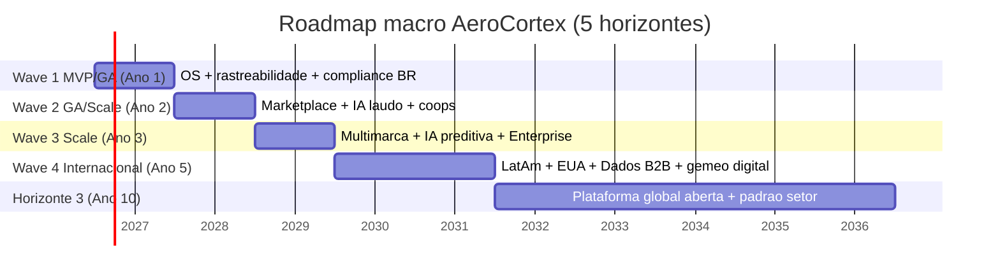
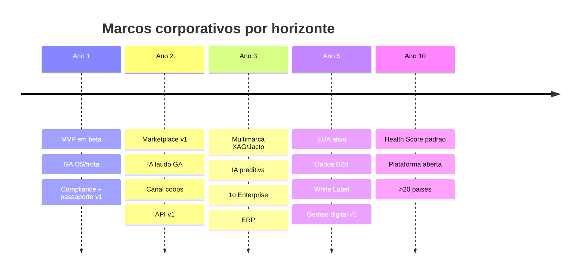
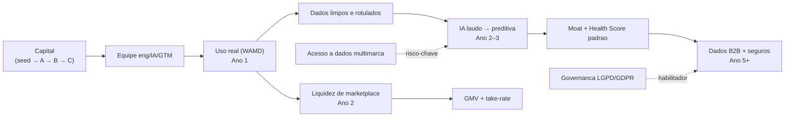

# Capitulo 3 — Roadmap Corporativo (Ano 1/2/3/5/10)

> **Escopo:** Este capitulo traduz a estrategia (Cap. 1 — mercado; Cap. 2 — business plan) em um **roadmap corporativo executavel** por horizonte de tempo (Ano 1, 2, 3, 5 e 10). Para cada horizonte definimos: tema estrategico, metas, marcos (milestones), expansao geografica, produtos lancados, headcount resumido e dependencias. Em seguida ancoramos a execucao em uma **North Star Metric (NSM)** com arvore de metricas, **KPIs por area**, **OKRs concretos por ano**, **indicadores de saude do negocio** e uma **tabela mestra de prioridades, riscos e cronograma macro**.
>
> **Aviso metodologico:** Todos os numeros de metas, headcount, ARR, GMV e frota sao **ESTIMATIVAS** de trabalho, derivadas por analogia (SaaS vertical B2B, fleet management, marketplaces) e coerentes com o dimensionamento (SOM) dos Capitulos 1 e 2. **Cambio de trabalho:** US$ 1,00 = R$ 5,40. Devem ser **[VALIDAR]** com dados primarios (vendas DJI/revendas, ANAC/MAPA, entrevistas com DSPs e oficinas) antes de comprometer capital, contratacoes ou metas contratuais.

---

## 3.1 Sumario Executivo do Capitulo

O roadmap organiza 10 anos em **quatro ondas** ja definidas no Cap. 1 (MVP → GA → Scale → Internacional) e cinco checkpoints anuais. A logica: **primeiro provar Product-Market Fit (PMF) no pos-venda de oficinas/DSPs no Brasil, depois ativar rede (marketplace + IA), depois escalar a plataforma multimarca, e por fim internacionalizar e colher as linhas de altissima margem (dados, licenciamento, governo)**. A metrica que amarra todos os horizontes e a **North Star Metric = Drones Ativos Gerenciados Semanalmente (WAMD)** — drones com dados de saude/OS fluindo nos ultimos 7 dias —, escolhida por capturar simultaneamente **valor entregue ao cliente** (uptime), **profundidade do moat de dados** e **potencial de receita** (o "drone ativo" e a value metric do Cap. 2).

| Horizonte | Tema estrategico | WAMD (est.) | ARR (est. R$ / US$) | Headcount (est.) | Onda |
|---|---|---|---|---|---|
| **Ano 1** | Provar PMF no pos-venda BR | 1,5k–4k | R$ 5–9 mi / US$ 0,9–1,7 mi | 25–40 | MVP → GA |
| **Ano 2** | Ativar rede (marketplace + IA) | 8k–18k | R$ 14–30 mi / US$ 2,6–5,6 mi | 70–110 | GA → Scale |
| **Ano 3** | Escalar plataforma multimarca | 25k–50k | R$ 35–75 mi / US$ 6,5–14 mi | 180–260 | Scale |
| **Ano 5** | Lider LatAm + entrada EUA | 120k–250k | R$ 180–380 mi / US$ 33–70 mi | 600–900 | Internacional |
| **Ano 10** | SO global do drone agricola | 600k–1,0M+ | R$ 1,2–3,0 bi / US$ 0,22–0,56 bi | 2,5k–4,0k | Plataforma global |

---

## 3.2 Filosofia do Roadmap — Tres Horizontes e Waves

Adotamos o modelo dos **Tres Horizontes** (defender o nucleo, construir o adjacente, semear o transformacional) sobreposto as quatro ondas de produto do Cap. 1. Cada onda so abre quando a anterior atinge **gates de saida** mensuraveis — evitando o erro classico de escalar antes do PMF.

**Gates de saida (criterios de avanco):** PMF (NRR ≥ 110%, NPS ≥ 40, retencao logo ≥ 85% em 12m) → abre Wave 2; **liquidez de marketplace** (>60% das OS com peca/servico transacionado na plataforma) e **acuracia de IA ≥ 85%** → abre Wave 3; **escala BR** (>3.000 contas pagas, EBITDA de contribuicao positivo) → abre Wave 4.

---

## 3.3 North Star Metric e Arvore de Metricas

### 3.3.1 Escolha da North Star Metric

| Candidata a NSM | Captura valor ao cliente? | Correlaciona com receita? | Reforca o moat de dados? | Facil de instrumentar? | Veredito |
|---|---|---|---|---|---|
| ARR / MRR | Nao (mede caixa, nao valor) | Sim | Nao | Sim | Metrica de resultado, nao NSM |
| Nº de contas pagas | Parcial | Parcial | Nao | Sim | Vaidade; ignora expansao e uso |
| Uptime agregado da frota (%) | **Sim (missao)** | Indireto | Parcial | Dificil (dado externo cedo) | Nobre, mas nao instrumentavel no MVP |
| GMV do marketplace | Nao (fase-dependente) | Sim | Parcial | Medio | So relevante pos-Wave 2 |
| **WAMD — Drones Ativos Gerenciados Semanalmente** | **Sim** (drone com dado fluindo = valor recebido) | **Sim** (value metric = drone ativo) | **Sim** (cada drone alimenta o Data Lake) | **Sim** (evento de telemetria/OS) | **MELHOR OPCAO** |

**North Star Metric = Drones Ativos Gerenciados Semanalmente (WAMD):** numero de drones distintos com pelo menos um evento significativo (sync de telemetria/log, OS, laudo de IA, ou registro de peca) nos ultimos 7 dias. **Por que e a melhor:** (1) e a unidade de valor do cliente (drone voando e monitorado = downtime evitado); (2) e a value metric de precificacao (Cap. 2), entao crescer WAMD *tende* a crescer receita; (3) cada WAMD produz dados que compoem o moat; (4) exclui contas "zumbis" (pagam mas nao usam), forcando a organizacao a perseguir uso real, nao vaidade.

### 3.3.2 Arvore de metricas (NSM decomposta)

`ARPD` = receita media por drone/ano. A identidade que guia o negocio: **ARR ≈ WAMD × ARPD**, e crescimento de ARR = crescimento de WAMD (volume) × crescimento de ARPD (monetizacao/expansao).

---

## 3.4 Roadmap por Horizonte

### 3.4.1 Ano 1 — "Provar PMF no pos-venda" (Wave 1: MVP → GA)

| Dimensao | Detalhe |
|---|---|
| **Tema** | Resolver a dor #1 (OS, rastreabilidade N/S, compliance ANAC/DECEA/MAPA) para oficinas e DSPs no Brasil. |
| **Metas** | 120–250 contas pagas; WAMD 1,5k–4k; ARR R$ 5–9 mi (US$ 0,9–1,7 mi); NRR ≥ 105%; NPS ≥ 40. |
| **Marcos** | M1 (mes 3): MVP em beta com 10 design partners. M2 (mes 6): GA do modulo OS + frota. M3 (mes 9): modulo compliance + passaporte digital v1. M4 (mes 12): billing/tiers ativos, primeiro laudo de IA piloto. |
| **Expansao geografica** | Brasil — Centro-Oeste (MT, GO, MS) e Sul (PR, RS). |
| **Produtos lancados** | App de campo (offline-first), gestao de OS, cadastro de frota por N/S, catalogo de pecas (read-only), templates de compliance, passaporte digital v1. |
| **Headcount (est.)** | 25–40: Eng 12–18, Produto/Design 4–6, IA/Dados 3–5, GTM/CS 5–8, G&A 2–3. |
| **Dependencias** | Capital seed; 8–12 design partners; acesso a dados basicos de log/telemetria; base de conhecimento de manutencao Agras. |

### 3.4.2 Ano 2 — "Ativar a rede" (Wave 2: GA → Scale)

| Dimensao | Detalhe |
|---|---|
| **Tema** | Transformar SaaS de ferramenta em **plataforma de rede**: marketplace de pecas/servicos + IA de diagnostico + canal cooperativas. |
| **Metas** | 400–800 contas; WAMD 8k–18k; ARR R$ 14–30 mi (US$ 2,6–5,6 mi); GMV marketplace R$ 25–60 mi; NRR ≥ 115%; acuracia IA ≥ 85%. |
| **Marcos** | M5: marketplace de pecas v1 (take-rate). M6: laudo de IA por foto/log em GA. M7: 3–5 cooperativas como canal. M8: API basica publica (v1). |
| **Expansao geografica** | Brasil nacional (SP, MG, BA, MATOPIBA) + piloto LatAm (Paraguai/Argentina via parceiro). |
| **Produtos lancados** | Marketplace pecas + servicos, IA de laudo (foto/log/audio), Drone Health Score v1, portal de cooperativas, API v1, programa de certificacao de tecnicos. |
| **Headcount (est.)** | 70–110: Eng 30–45, Produto/Design 10–14, IA/Dados 12–18, GTM/CS 14–22, G&A 6–10. |
| **Dependencias** | Seed de oferta no marketplace (oficinas/fornecedores); volume de dados rotulados para IA (dep. do Ano 1); LGPD/governanca de dados; integracao de pagamentos e split. |

### 3.4.3 Ano 3 — "Escalar a plataforma multimarca" (Wave 3: Scale)

| Dimensao | Detalhe |
|---|---|
| **Tema** | Consolidar lideranca BR, virar **multimarca de fato** (XAG, Jacto) e destravar Enterprise (usinas/coops grandes). |
| **Metas** | 900–1.800 contas; WAMD 25k–50k; ARR R$ 35–75 mi (US$ 6,5–14 mi); GMV R$ 70–160 mi; NRR ≥ 120%; EBITDA de contribuicao positivo. |
| **Marcos** | M9: suporte XAG + Jacto em producao. M10: IA preditiva (previsao de falha por horas de voo). M11: 1º contrato Enterprise (>R$ 500k/ano). M12: integracao ERP (TOTVS/SAP) para usinas. |
| **Expansao geografica** | Brasil (lideranca) + LatAm ativo (Paraguai, Argentina, Colombia, Mexico). |
| **Produtos lancados** | Suporte multimarca, IA preditiva/Health Score v2, modulo Enterprise (SSO, SLA, CSM), conectores ERP, gestao avancada de baterias, BI/dashboards de frota. |
| **Headcount (est.)** | 180–260: Eng 70–100, Produto/Design 24–34, IA/Dados 30–45, GTM/CS 40–60, G&A 16–24. |
| **Dependencias** | Series A/B; dados multimarca; parcerias com distribuidores de pecas; time de vendas Enterprise; maturidade do Data Lake. |

### 3.4.4 Ano 5 — "Lider LatAm + entrada EUA" (Wave 4: Internacional)

| Dimensao | Detalhe |
|---|---|
| **Tema** | Internacionalizar (LatAm consolidado, EUA via compliance premium) e ligar as **linhas de altissima margem**: Dados B2B, White Label, Governo. |
| **Metas** | WAMD 120k–250k; ARR R$ 180–380 mi (US$ 33–70 mi); GMV R$ 400–900 mi; NRR ≥ 120%; ≥ 3 regioes com receita material; margem bruta blended ≥ 78%. |
| **Marcos** | M13: operacao EUA (Part 137/44807 compliance). M14: 1ª venda de Dados B2B (fabricante/seguradora). M15: 2–3 contratos White Label (revendas/coops). M16: gemeos digitais (digital twin) v1 por drone. |
| **Expansao geografica** | Brasil + LatAm (5–8 paises) + EUA (Corn Belt/Sul) + piloto Asia via parceiro. |
| **Produtos lancados** | Localizacao multi-idioma/moeda, Dados B2B (Data Lake as a product), White Label, gemeo digital do drone, seguros embarcados (parceria), modulo governo/fiscalizacao. |
| **Headcount (est.)** | 600–900, distribuido em BR (HQ), hub LatAm e hub EUA; ~40% Eng/IA, ~35% GTM/CS, ~25% G&A/ops. |
| **Dependencias** | Series C; entidade e compliance nos EUA; contratos de dados (k-anonimizacao/DPA); parceiros de seguro; escala do Data Lake (governanca madura). |

### 3.4.5 Ano 10 — "Sistema operacional global do drone agricola"

| Dimensao | Detalhe |
|---|---|
| **Tema** | Ser o **SO global** do pos-venda e da operacao de drones agricolas — o "CarFax + Salesforce + AWS" do setor (visao do Cap. 2). |
| **Metas** | WAMD 600k–1,0M+ (cobrindo faixa relevante da frota global); ARR R$ 1,2–3,0 bi (US$ 0,22–0,56 bi); presenca em >20 paises; Drone Health Score como **padrao de mercado** em revenda e seguro. |
| **Marcos** | M17: Health Score aceito por seguradoras/financeiras como criterio. M18: ecossistema de apps de terceiros sobre a API (plataforma aberta). M19: expansao adjacente (outros ativos agricolas conectados). Opcionalidade de IPO/M&A estrategico. |
| **Expansao geografica** | Global — Americas, Asia (via parceria/JV), selecao de Europa (inspecao), Africa (impacto/ESG). |
| **Produtos lancados** | Plataforma aberta (developer ecosystem), autonomia preditiva de manutencao, financas embarcadas (credito/leasing por Health Score), expansao para novos ativos agricolas conectados. |
| **Headcount (est.)** | 2,5k–4,0k, multi-hub global; forte peso de IA/Dados e ecossistema/parcerias. |
| **Dependencias** | Efeito de rede consolidado; governanca de dados global (LGPD/GDPR/local); parcerias com fabricantes; capital de crescimento/IPO. |

### 3.4.6 Cronograma macro consolidado

---

## 3.5 KPIs por Area (metas por horizonte)

Todas as celulas sao **ESTIMATIVAS-alvo**; setas indicam direcao desejada.

### 3.5.1 Produto e Engajamento

| KPI | Ano 1 | Ano 2 | Ano 3 | Ano 5 | Ano 10 |
|---|---|---|---|---|---|
| WAMD (North Star) | 1,5k–4k | 8k–18k | 25k–50k | 120k–250k | 600k–1,0M+ |
| Ativacao (drone atinge 1º "aha") | ≥ 55% | ≥ 65% | ≥ 70% | ≥ 75% | ≥ 80% |
| Time-to-value (dias) | ≤ 7 | ≤ 3 | ≤ 2 | ≤ 1 | ≤ 1 |
| DAU/MAU dos portais (stickiness) | 0,20 | 0,30 | 0,38 | 0,45 | 0,50 |
| Eventos de dado por drone/semana | 1–2 | 3–5 | 6–10 | 10–15 | 15+ |

### 3.5.2 Receita e Retencao

| KPI | Ano 1 | Ano 2 | Ano 3 | Ano 5 | Ano 10 |
|---|---|---|---|---|---|
| ARR (R$) | 5–9 mi | 14–30 mi | 35–75 mi | 180–380 mi | 1,2–3,0 bi |
| NRR (Net Revenue Retention) | ≥ 105% | ≥ 115% | ≥ 120% | ≥ 120% | ≥ 120% |
| Gross churn logo (anual) | ≤ 15% | ≤ 12% | ≤ 10% | ≤ 8% | ≤ 6% |
| LTV/CAC | ≥ 3,0x | ≥ 3,5x | ≥ 4,0x | ≥ 4,5x | ≥ 5,0x |
| ARPD (receita/drone/ano, R$) | ~2,5k | ~2,2k | ~2,0k | ~2,2k | ~2,5k |

### 3.5.3 IA, Marketplace e Operacoes

| KPI | Ano 1 | Ano 2 | Ano 3 | Ano 5 | Ano 10 |
|---|---|---|---|---|---|
| Acuracia de laudo de IA | piloto | ≥ 85% | ≥ 90% | ≥ 93% | ≥ 95% |
| Antecedencia de predicao de falha | — | — | ≥ 30 h voo | ≥ 60 h voo | ≥ 100 h voo |
| GMV do marketplace (R$/ano) | — | 25–60 mi | 70–160 mi | 400–900 mi | > 3 bi |
| Take-rate efetivo | — | 8–12% | 10–14% | 12–15% | 12–15% |
| Gemeos digitais ativos | — | — | piloto | 120k–250k | 600k–1,0M+ |
| MTTR medio da frota gerida | linha base | −15% | −30% | −45% | −60% |
| Uptime medio da frota gerida | linha base | +3 p.p. | +6 p.p. | +9 p.p. | +12 p.p. |

---

## 3.6 OKRs Concretos por Ano

**Ano 1 — Objetivo: Provar PMF no pos-venda BR.**
- KR1: Fechar 120+ contas pagas com NRR ≥ 105%.
- KR2: Atingir WAMD ≥ 2.000 e ativacao ≥ 55%.
- KR3: NPS ≥ 40 e retencao logo em 12m ≥ 85%.
- KR4: Publicar passaporte digital v1 em 100% das contas ativas.

**Ano 2 — Objetivo: Ativar os efeitos de rede.**
- KR1: GMV de marketplace ≥ R$ 25 mi com take-rate efetivo ≥ 8%.
- KR2: Acuracia de laudo de IA ≥ 85% em amostra auditada.
- KR3: 3+ cooperativas ativas como canal, gerando ≥ 25% dos novos drones.
- KR4: NRR ≥ 115% e ARR ≥ R$ 14 mi.

**Ano 3 — Objetivo: Escalar plataforma multimarca e destravar Enterprise.**
- KR1: XAG + Jacto em producao com ≥ 15% dos WAMD nao-DJI.
- KR2: 1º contrato Enterprise ≥ R$ 500k/ano assinado.
- KR3: IA preditiva prevendo falha com ≥ 30 h de voo de antecedencia.
- KR4: EBITDA de contribuicao positivo e ARR ≥ R$ 35 mi.

**Ano 5 — Objetivo: Internacionalizar e ligar linhas de alta margem.**
- KR1: Operacao EUA ativa com ≥ 30 contas pagas em compliance Part 137.
- KR2: 1ª receita de Dados B2B ≥ R$ 2 mi/ano com governanca k-anonima auditada.
- KR3: Receita material em ≥ 3 regioes; ARR ≥ R$ 180 mi.
- KR4: Gemeo digital v1 em ≥ 50% dos WAMD.

**Ano 10 — Objetivo: Tornar-se o SO global (padrao de mercado).**
- KR1: Drone Health Score adotado por ≥ 2 seguradoras/financeiras como criterio.
- KR2: Presenca em > 20 paises; ARR ≥ R$ 1,2 bi.
- KR3: Ecossistema aberto com ≥ 50 integracoes de terceiros ativas.
- KR4: Cobertura de frota global relevante (WAMD ≥ 600k) e margem bruta ≥ 80%.

---

## 3.7 Indicadores de Saude do Negocio (Business Health)

Painel executivo revisado mensalmente (operacional) e trimestralmente (board). Faixas verdes = **ESTIMATIVAS-alvo** por horizonte.

| Indicador | Definicao / por que importa | Alvo Ano 1 | Alvo Ano 3 | Alvo Ano 5 | Alvo Ano 10 |
|---|---|---|---|---|---|
| **ARR** | Receita recorrente anualizada; motor de valuation | R$ 5–9 mi | R$ 35–75 mi | R$ 180–380 mi | R$ 1,2–3,0 bi |
| **NRR** | Expansao liquida da base; saude do moat/lock-in | ≥ 105% | ≥ 120% | ≥ 120% | ≥ 120% |
| **Gross churn (logo)** | Perda de clientes; indicador precoce de PMF fraco | ≤ 15% | ≤ 10% | ≤ 8% | ≤ 6% |
| **GMV do marketplace** | Volume transacionado; liquidez da rede | — | R$ 70–160 mi | R$ 400–900 mi | > R$ 3 bi |
| **DAU/MAU dos portais** | Stickiness; habito de uso | 0,20 | 0,38 | 0,45 | 0,50 |
| **Acuracia da IA** | Confiabilidade do laudo/predicao; sustenta receita de IA | piloto | ≥ 90% | ≥ 93% | ≥ 95% |
| **Drones/gemeos digitais ativos (WAMD)** | Escala do negocio e do moat de dados | 1,5k–4k | 25k–50k | 120k–250k | 600k–1,0M+ |
| **LTV/CAC & payback** | Eficiencia de crescimento | 3,0x / ≤12m | 4,0x / ≤10m | 4,5x / ≤9m | 5,0x / ≤8m |
| **Margem bruta blended** | Qualidade da receita | 70–78% | ≥ 78% | ≥ 78% | ≥ 80% |
| **Uptime da frota gerida** | Prova da promessa (missao); leading de retencao | linha base | +6 p.p. | +9 p.p. | +12 p.p. |

**Alertas de saude (thresholds de acao):** NRR < 100% por 2 trimestres → congelar expansao, revisar PMF; churn logo > alvo +5 p.p. → task force de retencao; acuracia de IA cair > 3 p.p. → rollback de modelo + reauditoria; DAU/MAU < 0,15 → problema de habito/valor no produto.

---

## 3.8 Tabela Mestra — Prioridades, Riscos e Cronograma Macro

| Horizonte | Iniciativa-chave (P0/P1/P2) | Custo impl. (R$ / US$) | Dificuldade (1–5) | Prioridade | Risco principal → mitigacao |
|---|---|---|---|---|---|
| **Ano 1** | Core SaaS (OS + frota + compliance) + billing/tiers | R$ 1,8–2,6 mi / US$ 0,33–0,48 mi | 3 | **P0** | PMF fraco → design partners, ROI claro, iteracao semanal |
| **Ano 1** | App offline-first de campo | R$ 0,7–1,1 mi / US$ 0,13–0,20 mi | 4 | P0 | Conectividade rural → sync offline, cache, Starlink-ready |
| **Ano 2** | Marketplace v1 (pecas + servicos) | R$ 3,5–5,0 mi / US$ 0,65–0,93 mi | 4 | P1 | Falta de liquidez → seed manual de oferta, take-rate baixo inicial |
| **Ano 2** | IA de laudo (foto/log/audio) | R$ 2,5–4,0 mi / US$ 0,46–0,74 mi | 4 | P1 | Acuracia baixa → human-in-the-loop, dados rotulados, guardrails |
| **Ano 3** | Multimarca (XAG/Jacto) + IA preditiva | R$ 6–9 mi / US$ 1,1–1,7 mi | 5 | P1 | Dados fechados do fabricante → app do tecnico gera dado proprio |
| **Ano 3** | Modulo Enterprise (SSO/SLA/CSM/ERP) | R$ 4–6 mi / US$ 0,74–1,1 mi | 4 | P1 | Ciclo longo → pre-vendas dedicada, POCs pagas |
| **Ano 5** | Internacionalizacao (LatAm + EUA) | R$ 25–45 mi / US$ 4,6–8,3 mi | 5 | P1 | Compliance/legal local → parceiros locais, entidade dedicada |
| **Ano 5** | Dados B2B + gemeo digital | R$ 12–20 mi / US$ 2,2–3,7 mi | 5 | P2 | Privacidade/sensibilidade → opt-in, k-anonimia, DPA, auditoria |
| **Ano 10** | Plataforma aberta + padrao de mercado | R$ 80–200 mi / US$ 15–37 mi | 5 | P2 | Fragmentacao/regulacao global → governanca, parcerias, padroes |

---

## 3.9 Dependencias Criticas e Caminho Critico

O caminho critico do roadmap e uma **cadeia de dados**: sem uso (WAMD) nao ha dados; sem dados nao ha IA; sem IA nao ha moat nem receita de dados. Por isso o Ano 1 e integralmente subordinado a **gerar uso real e capturar dados limpos**, mesmo antes de monetizar IA.

**Dependencias inter-horizonte (resumo):**
- **Ano 2 depende do Ano 1:** volume e qualidade de dados de OS/telemetria para treinar a IA de laudo.
- **Ano 3 depende do Ano 2:** liquidez de rede + acuracia de IA ≥ 85% (gate) antes de escalar Enterprise e multimarca.
- **Ano 5 depende do Ano 3:** escala BR + EBITDA de contribuicao positivo antes de queimar capital em internacionalizacao.
- **Ano 10 depende do Ano 5:** efeito de rede em ≥ 3 regioes e Data Lake governado antes de virar padrao/plataforma aberta.
- **Transversal:** capital nos estagios certos, governanca de dados (LGPD desde o Ano 1) e relacao com fabricantes (risco de fechamento de API — mitigado pelo dado proprio via app do tecnico).

---

*Fim do Capitulo 3. Os proximos capitulos detalham a arquitetura de produto/plataforma, a stack de IA (que sustenta as metas de acuracia e predicao aqui declaradas), o go-to-market operacional e as projecoes financeiras que quantificam ARR, GMV e headcount tratados aqui como ESTIMATIVA.*
