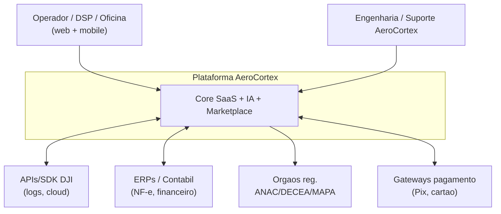
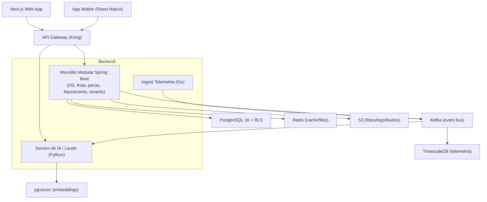
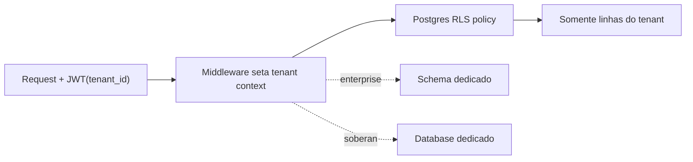
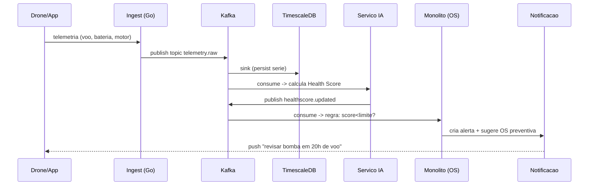
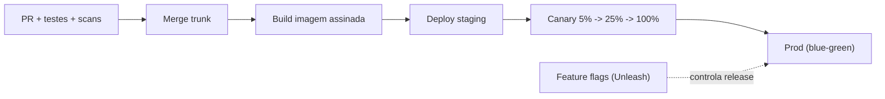
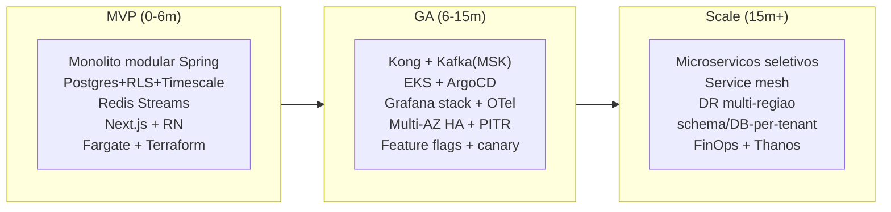

# Capitulo 4 — Arquitetura da Plataforma

> **Escopo:** Este capitulo redesenha, do zero, a arquitetura cloud-native da AeroCortex (nome de trabalho, a validar). Define stack de backend/frontend, banco de dados, mensageria, cache, observabilidade, API Gateway, estrategia multi-tenant, containers/Kubernetes, CI/CD, testes, alta disponibilidade, backup e disaster recovery. Cada decisao e justificada, comparada em tabela contra alternativas, e acompanhada de custo (R$ e US$), dificuldade (1 a 5), riscos + mitigacao, cronograma e prioridade.
>
> **Aviso metodologico:** Custos de infraestrutura sao **ESTIMATIVAS** de trabalho, construidas por dimensionamento bottom-up de recursos (vCPU, RAM, storage, egress) x precos de lista publicos das nuvens, com desconto de committed-use/Savings Plans. **Cambio de trabalho:** US$ 1,00 = R$ 5,40. Todo valor precisa ser validado com **[VALIDAR]** cotacao real (AWS Pricing Calculator, contrato de committed-use, egress medido) antes de decisao de orcamento.

---

## 4.1 Sumario Executivo do Capitulo

A AeroCortex nasce como **monolito modular** (modular monolith) em um unico deploy, evoluindo para **microservicos seletivos** conforme dor de escala aparece — nao antes. Essa e a decisao mestra do capitulo: microservicos prematuros matam startups por overhead operacional. Adotamos **Java 21 + Spring Boot 3** no backend transacional, **Go** para servicos de alta concorrencia (ingest de telemetria, gateway de eventos), **React + Next.js** no frontend, **PostgreSQL 16** como banco primario (com **TimescaleDB** para series temporais de telemetria e **pgvector** para busca semantica/RAG do laudo de IA), **Kafka** como espinha dorsal de eventos (com NATS para comando/RPC leve), **Redis** para cache/filas rapidas, **Kong** como API Gateway, **AWS** como nuvem primaria, **Terraform** para IaC e a stack **OpenTelemetry + Prometheus + Grafana + Loki + Tempo** para observabilidade unificada.

Multi-tenancy: comeca com **row-level (RLS + tenant_id)** no MVP pela simplicidade e custo, migra tenants enterprise para **schema-per-tenant** no GA, e reserva **database-per-tenant** para clientes soberanos/regulados no Scale. Metas de servico: **SLA 99,9%** (GA), **RTO <= 1h / RPO <= 5min** para dados criticos, DR **multi-AZ** no GA e **multi-regiao** no Scale.

Custo de infra estimado: **~R$ 9-16 mil/mes (MVP)**, **~R$ 45-80 mil/mes (GA)**, **~R$ 180-380 mil/mes (Scale)** — detalhado na secao 4.19.

---

## 4.2 Principios Arquiteturais e Requisitos Nao-Funcionais (NFRs)

**Principios (guiam toda decisao):**

1. **Simplicidade primeiro, complexidade sob demanda** — nao pagamos custo de microservicos antes de ter a dor.
2. **Cloud-native e portavel** — containers + Kubernetes + Terraform reduzem lock-in de nuvem.
3. **Event-driven no nucleo** — o "passaporte digital do drone" e o Health Score exigem trilha de eventos imutavel.
4. **Multi-tenant seguro por padrao** — isolamento de dado do cliente e requisito de negocio (moat de dados) e de compliance (LGPD).
5. **Observabilidade e requisito, nao afterthought** — todo servico nasce instrumentado com OpenTelemetry.
6. **Seguranca e privacidade por design** — zero-trust interno, criptografia em transito e em repouso, segregacao de segredos.

**NFRs alvo (por fase):**

| NFR | MVP | GA | Scale |
|---|---|---|---|
| Disponibilidade (SLA) | 99,5% | 99,9% | 99,95% |
| Latencia API p95 (leitura) | < 400 ms | < 250 ms | < 150 ms |
| Ingest de telemetria | ~1k eventos/s | ~20k eventos/s | ~200k+ eventos/s |
| Tenants ativos | 10-50 | 500-3.000 | 10.000+ |
| RTO / RPO (dados criticos) | 4h / 1h | 1h / 5min | 15min / <1min |
| Deploys/semana | 1-3 | 10-30 | 50+ (contínuo) |

---

## 4.3 Visao de Alto Nivel (C4 Nivel 1 e 2)

**C4 Nivel 1 — Contexto (quem usa e sistemas externos):**

**C4 Nivel 2 — Contêineres (blocos internos):**

---

## 4.4 Estrategia de Evolucao: Monolito Modular -> Microservicos

Comecar com microservicos e o erro mais comum e mais caro de plataformas B2B em estagio inicial. A recomendacao e um **modular monolith**: um unico deploy, mas com fronteiras de modulo rigorosas (packages por dominio, sem imports cruzados diretos, comunicacao via interfaces e eventos internos). Quando um modulo tem dor real (escala independente, time dedicado, ciclo de deploy proprio), ele e **extraido** para microservico — as fronteiras ja existem, entao a extracao e barata.

| Abordagem | Vantagens | Desvantagens | Quando |
|---|---|---|---|
| **Monolito modular** (recomendado inicio) | Deploy simples, 1 pipeline, transacoes ACID locais, debugging facil, baixo custo op. | Escala tudo junto; risco de acoplamento se disciplina falhar | MVP + GA inicial |
| **Microservicos seletivos** | Escala e deploy independentes onde importa (ingest, IA) | Overhead: rede, observabilidade distribuida, consistencia eventual | GA maduro / Scale |
| **Microservicos "puros" desde o dia 1** | Escala teorica maxima | Mata velocidade de produto, custo op. explode, dev pequeno afoga | **Nunca** nesta fase |

**Ordem de extracao recomendada:** (1) Ingest de telemetria (Go, ja separado desde o inicio por perfil de carga), (2) Servico de IA/laudo (Python, GPU sob demanda), (3) Marketplace/pagamentos, (4) Faturamento/billing, (5) Notificacoes. Dominios transacionais de baixo trafego (tenants, catalogo, OS) permanecem no monolito o maximo possivel.

---

## 4.5 Backend — Linguagem e Framework

| Criterio (peso) | Java 21 + Spring Boot 3 | Go | Node.js + NestJS |
|---|---|---|---|
| Maturidade ecossistema B2B/ERP (25%) | Excelente | Bom | Bom |
| Produtividade de dominio complexo (20%) | Excelente (JPA, validacao, transacoes) | Media (verboso p/ CRUD) | Boa |
| Performance/concorrencia (15%) | Muito boa (virtual threads 21) | Excelente | Boa (I/O-bound) |
| Talento no Brasil (15%) | Abundante | Escasso/medio | Abundante |
| Consumo de memoria/custo runtime (10%) | Medio-alto | Baixo | Medio |
| Tipagem/robustez p/ dominio critico (15%) | Forte | Forte | Media (TS ajuda) |
| **Veredito** | **MELHOR p/ nucleo transacional** | **MELHOR p/ ingest/gateway** | Alternativa p/ BFF |

**Decisao:** **Java 21 + Spring Boot 3** para o nucleo transacional (OS, frota, faturamento, tenants, compliance) — maturidade, talento abundante no Brasil, virtual threads (Project Loom) que eliminam a antiga fraqueza de concorrencia, e ecossistema de integracao ERP/fiscal insuperavel. **Go** para o servico de ingest de telemetria e o event gateway, onde milhares de conexoes/eventos por segundo exigem footprint baixo e concorrencia nativa. **Python (FastAPI)** exclusivamente no servico de IA/laudo, por ser onde vivem os frameworks de ML/CV/LLM. Justificativa: usar cada linguagem onde ela e imbativel, sem fragmentar o time (2 linguagens no core, Python isolado no dominio de IA).

- Custo/dificuldade: dificuldade **2**; sem custo de licenca (OpenJDK). Risco: sprawl de linguagens -> mitigacao: limitar a 3, com templates/scaffolding padrao por linguagem.

---

## 4.6 Frontend

**Decisao:** **React + Next.js (App Router)** para web e **React Native (Expo)** para mobile, compartilhando design system e camada de tipos (TypeScript) com o web.

| Opcao | Vantagens | Desvantagens | Veredito |
|---|---|---|---|
| **React + Next.js** | SSR/SSG p/ SEO da landing, RSC, ecossistema gigante, talento abundante | Curva do App Router | **MELHOR** |
| SPA React puro (Vite) | Simples | Sem SSR nativo, pior SEO | Bom p/ app interno |
| Angular | Estruturado, enterprise | Menos talento no BR, verboso | Nao |
| Vue/Nuxt | Leve, curva suave | Ecossistema menor no B2B BR | Nao |

Racional: Next.js entrega a landing/marketing (SEO), o dashboard autenticado (RSC + streaming) e APIs de borda (route handlers) num so framework. React Native (Expo) reaproveita conhecimento e permite recurso critico de campo: **operacao offline-first** no barracao (baixa conectividade), com sincronizacao quando volta a rede. Design system em **shadcn/ui + Tailwind**; dados via **TanStack Query**. Dificuldade **2**.

---

## 4.7 Banco de Dados

**Decisao:** **PostgreSQL 16** como banco primario relacional, estendido com **TimescaleDB** (hypertables para telemetria/series temporais de voo e sensores) e **pgvector** (embeddings para RAG do laudo de IA e busca semantica de pecas/defeitos). Consolidar em torno do Postgres reduz superficie operacional (um motor, um backup, um skillset) — principio "Postgres for everything" ate a dor justificar especializacao.

| Necessidade | Solucao | Alternativa considerada | Por que Postgres+ext vence |
|---|---|---|---|
| Transacional (OS, frota, billing) | PostgreSQL 16 | MySQL, SQL Server | RLS nativo, extensoes, JSONB, licenca livre |
| Series temporais (telemetria) | TimescaleDB | InfluxDB, ClickHouse | Fica no Postgres; SQL unico; compressao/retencao |
| Busca vetorial (IA/RAG) | pgvector | Pinecone, Milvus, Qdrant | Sem novo servico no MVP; migravel depois se escalar |
| Objetos (fotos/logs/laudos) | S3 (object storage) | Postgres BLOB | Barato, escalavel, CDN-friendly |
| Analitico/BI (Scale) | Data lake (S3+Parquet) + query engine | Postgres direto | Isola OLAP do OLTP |

**Evolucao:** no Scale, se a busca vetorial ultrapassar centenas de milhoes de vetores, avaliar mover embeddings para um vector DB dedicado (Qdrant/Milvus) e a telemetria de altissimo volume para ClickHouse. Ate la, Postgres+extensoes evita 3 sistemas separados. Dificuldade **3**; risco: crescimento de series temporais estoura custo/IO -> mitigacao: politicas de compressao e retencao (hot 90d / cold em S3) no TimescaleDB desde o inicio.

---

## 4.8 Multi-Tenancy — A Decisao Estrutural

Como isolar dados de cada cliente (operador/oficina/DSP) e o coracao do modelo. Comparacao:

| Modelo | Isolamento | Custo/tenant | Complexidade | Escala de nº de tenants | Custom por tenant | Blast radius |
|---|---|---|---|---|---|---|
| **Row-Level (RLS + tenant_id)** | Logico (policy) | Baixissimo | Baixa | Milhares+ | Dificil | Alto (bug de policy vaza) |
| **Schema-per-tenant** | Medio (schema) | Baixo-medio | Media | Centenas-milhares | Medio | Medio |
| **Database-per-tenant** | Forte (fisico) | Alto | Alta | Dezenas-centenas | Facil | Baixo (1 DB = 1 cliente) |

**Recomendacao por fase:**

- **MVP -> row-level (RLS)**: um schema, coluna `tenant_id` em todas as tabelas, **Postgres Row-Level Security** forcando o filtro no nivel do banco (nao so na aplicacao). Menor custo, maior velocidade. Regra de ouro: **defesa em profundidade** — RLS no banco + tenant context injetado por middleware/JWT + testes automatizados de vazamento entre tenants.
- **GA -> hibrido**: maioria em RLS; tenants enterprise/regulados migram para **schema-per-tenant** (isolamento e backup granular por cliente, restore individual).
- **Scale -> adicionar database-per-tenant** para clientes soberanos, com requisito de residencia de dados ou contratos que exijam isolamento fisico. Router de tenants direciona a conexao correta.

Dificuldade **4** (o erro aqui e catastrofico: vazamento cross-tenant). Risco alto -> mitigacao: RLS obrigatorio no banco (nunca so na app), suite de testes de isolamento em CI, auditoria de queries sem `tenant_id`.

---

## 4.9 Mensageria e Streaming de Eventos

| Criterio | Apache Kafka | RabbitMQ | NATS (JetStream) |
|---|---|---|---|
| Throughput/streaming | Excelente | Medio | Muito bom |
| Replay/retencao de log (event sourcing) | Excelente (nativo) | Fraco | Bom (JetStream) |
| RPC/comando request-reply | Fraco | Excelente | Excelente |
| Operacao/curva | Alta | Media | Baixa |
| Ecossistema (connectors, CDC) | Excelente | Bom | Emergente |
| **Melhor uso** | **Espinha de eventos/telemetria/CDC** | Filas de tarefa classicas | **Comando/RPC leve, edge** |

**Decisao:** **Kafka** como espinha dorsal de eventos — a plataforma e event-driven no nucleo (passaporte do drone, Health Score, trilha de auditoria imutavel, CDC do Postgres via Debezium para o data lake). **NATS** para comando/RPC de baixa latencia entre servicos e comunicacao com edge/mobile. RabbitMQ e descartado: seus pontos fortes (filas de tarefa) sao cobertos por Kafka + Redis Streams no nosso perfil. No MVP, usar **Redis Streams** como fila leve e adiar Kafka ate haver volume (Kafka gerenciado — MSK/Confluent — so no GA).

**Fluxo de eventos (exemplo — telemetria gera Health Score e alerta de OS):**

Dificuldade **4**; risco: complexidade operacional do Kafka -> mitigacao: usar servico gerenciado (MSK/Confluent Cloud), comecar com Redis Streams no MVP.

---

## 4.10 Cache

**Decisao:** **Redis** (ElastiCache/MemoryDB gerenciado) para cache de leitura, sessoes, rate-limiting, locks distribuidos e filas leves (Redis Streams no MVP). Alternativas (Memcached — sem estruturas ricas; KeyDB/Dragonfly — menos maduro gerenciado) nao superam a ubiquidade e o ferramental do Redis. Padroes: cache-aside para catalogos/pecas, TTL curto para dados de frota, invalidacao por evento (assinando topicos Kafka). Dificuldade **2**.

---

## 4.11 API Gateway e Versionamento de API

| Gateway | Base | Vantagens | Desvantagens | Veredito |
|---|---|---|---|---|
| **Kong** | Nginx/OpenResty | Ecossistema de plugins maduro, OSS + enterprise, RBAC, rate-limit, OIDC | Consumo de recursos, config as data | **MELHOR (GA)** |
| **APISIX** | Nginx + etcd | Performance alta, hot-reload, OSS Apache | Comunidade menor no BR | Forte alternativa |
| **Envoy** (via gateway) | C++ | Base do service mesh, altissima performance | Config complexa (xDS) | Camada de mesh, nao gateway direto |

**Decisao:** **Kong** como API Gateway (autenticacao OIDC/JWT, rate-limiting por tenant, quotas de plano SaaS, roteamento, transformacao, observabilidade). No MVP, o proprio Next.js/Spring pode expor as rotas; Kong entra quando ha multiplos backends e necessidade de politicas por tenant/plano. **Envoy** aparece depois como data plane do service mesh (secao 4.12), nao como substituto do Kong.

**Versionamento de API:** versionamento por **URI (`/v1`, `/v2`)** para APIs publicas/parceiros (previsibilidade), contratos definidos em **OpenAPI 3.1** (gerando SDKs e docs), politica de **deprecacao com N+1** (uma versao antiga suportada), e eventos versionados via **schema registry** (Avro/Protobuf) no Kafka para evolucao compativel. Dificuldade **3**.

---

## 4.12 Service Mesh

Service mesh (mTLS automatico, retries, circuit breaking, observabilidade L7) so se justifica com muitos servicos. **Decisao:** **nao adotar no MVP/GA inicial**; introduzir **Istio ou Linkerd** no Scale, quando o numero de microservicos e as exigencias de zero-trust interno justificarem. **Linkerd** e preferivel se a prioridade for simplicidade e footprint; **Istio** se forem necessarias politicas L7 avancadas e integracao ampla. Ate la, mTLS e resiliencia sao resolvidos com bibliotecas (Resilience4j) e TLS gerenciado. Dificuldade **4** (quando chegar).

---

## 4.13 Cloud e Infraestrutura como Codigo (IaC)

| Criterio | AWS | GCP | Azure |
|---|---|---|---|
| Maturidade/breadth de servicos | Excelente | Muito bom | Muito bom |
| Presenca/regiao Brasil (sa-east-1) | Sim (SP) | Sim (SP) | Sim (BR South) |
| Ecossistema gerenciado (RDS, MSK, EKS, S3) | Excelente | Bom (forte em dados/IA) | Bom |
| Talento/mercado no BR | Maior | Medio | Medio-grande |
| Custo (perfil geral) | Competitivo c/ commit | Competitivo | Competitivo |
| **Veredito** | **MELHOR (primaria)** | Forte p/ dados/IA (2ª) | Alternativa enterprise |

**Decisao:** **AWS** como nuvem primaria (regiao **sa-east-1 / Sao Paulo** para residencia de dados e latencia BR, LGPD), pela maturidade de servicos gerenciados (RDS/Aurora Postgres, MSK, EKS, ElastiCache, S3), maior pool de talento e ecossistema. **Estrategia anti-lock-in:** tudo em containers + Kubernetes + Terraform, evitando servicos proprietarios "colados" onde houver equivalente open-source portavel. GCP fica como opcao secundaria se cargas de IA/BigQuery pesarem.

**IaC:** **Terraform** (multi-cloud, HCL, estado gerenciado em S3+DynamoDB lock), estrutura em modulos por ambiente (dev/stg/prod) e **Terragrunt** para DRY. Config de app via **Helm** (charts versionados). Segredos em **AWS Secrets Manager** / **Vault**. GitOps com **ArgoCD** no GA. Dificuldade **3**.

---

## 4.14 Containers, Kubernetes e Orquestracao

**Decisao:** **Docker** (build multi-stage, imagens distroless para reduzir superficie) + **Kubernetes gerenciado (EKS)**. No **MVP**, para reduzir custo e complexidade, rodar em **ECS Fargate ou um EKS pequeno** — ate um unico nodegroup pode bastar; nao super-dimensionar. Autoscaling: **HPA** (por CPU/RAM e metricas custom via KEDA — ex.: lag de consumidor Kafka), **Cluster Autoscaler/Karpenter** para nós. Namespaces por ambiente; recursos com requests/limits definidos; **PodDisruptionBudgets** para HA. Dificuldade **4**; risco: complexidade de K8s afoga time pequeno -> mitigacao: comecar com Fargate/serverless-containers, adotar EKS pleno so no GA.

---

## 4.15 CI/CD, Versionamento, Feature Flags e Estrategia de Deploy

- **Versionamento:** Git (GitHub), **trunk-based development** com branches curtas + PRs obrigatorios, **Conventional Commits** + **SemVer** para libs/APIs, **monorepo** (Turborepo/Nx) para web+mobile+shared, e repos separados por servico backend quando extraidos.
- **CI/CD:** **GitHub Actions** para CI (build, lint, testes, SAST, scan de dependencias/containers com Trivy) e **ArgoCD (GitOps)** para CD no GA. Pipeline: PR -> testes+scans -> merge -> build imagem assinada (Cosign) -> deploy stg -> promocao prod.
- **Feature flags:** **Unleash** (open-source, self-host) ou LaunchDarkly (SaaS). Permite dark launch, rollout por tenant/percentual e kill-switch. Essencial para desacoplar deploy de release.
- **Estrategia de deploy:** **blue-green** para o monolito (troca instantanea, rollback rapido) e **canary** (rollout progressivo com analise de metricas via Argo Rollouts) para servicos criticos. Migracoes de banco com **expand/contract** (compativel para frente/para tras) para permitir rollback.

Dificuldade **3**.

---

## 4.16 Estrategia de Testes

Piramide de testes com portoes em CI (cobertura minima como gate, nao vaidade):

| Camada | Ferramenta | Meta | Onde roda |
|---|---|---|---|
| Unitario | JUnit5/Testify/Vitest | ~70% do volume, rapido | Todo push |
| Integracao | **Testcontainers** (Postgres/Kafka reais) | Contratos com DB/broker | PR |
| Contrato (API) | Pact / OpenAPI validation | Compatibilidade entre servicos | PR |
| E2E | Playwright | Fluxos criticos (OS, checkout) | Pre-merge/nightly |
| Carga | k6 / Gatling | NFR de throughput/latencia | Antes de release maior |
| Seguranca | SAST (CodeQL), DAST, Trivy | Vulnerabilidades | CI + agendado |
| **Isolamento multi-tenant** | Suite dedicada | **Zero vazamento cross-tenant** | CI obrigatorio |

Dificuldade **3**; a suite de isolamento multi-tenant e inegociavel (ver 4.8).

---

## 4.17 Observabilidade e Logs

**Decisao:** stack unificada e portavel sobre **OpenTelemetry** como padrao de instrumentacao (traces, metrics, logs), evitando lock-in de agente proprietario.

| Sinal | Ferramenta | Papel |
|---|---|---|
| Metricas | **Prometheus** (+ Thanos p/ long-term no Scale) | Series de saude/negocio |
| Dashboards/alertas | **Grafana** + Alertmanager | Visualizacao e SLOs |
| Logs | **Loki** | Logs estruturados, barato (indexa labels) |
| Traces | **Tempo** | Tracing distribuido |
| Instrumentacao | **OpenTelemetry Collector** | Coleta e exporta tudo |
| Erros | Sentry | Erros de app front/back |

Alternativa gerenciada (Datadog/New Relic) e mais simples porem cara em escala; comecar self-host (Grafana stack) mantem custo previsivel, com opcao de Grafana Cloud gerenciado no MVP para nao operar a stack cedo demais. **SLOs** definidos como codigo (Sloth) com **error budgets** guiando ritmo de release. Dificuldade **3**.

---

## 4.18 Resiliencia, Alta Disponibilidade, SLO/SLA, Backup e DR

**Alta disponibilidade:** multi-AZ desde o GA (RDS Multi-AZ, nós K8s em >=2 AZs, replicas de leitura Postgres). Padroes de resiliencia: **circuit breaker, retry com backoff+jitter, bulkhead, timeout, idempotencia** (Resilience4j) e **graceful degradation** (ex.: se IA cai, plataforma segue operando sem Health Score em tempo real).

**SLO/SLA:**

| Servico | SLO interno | SLA cliente (GA) |
|---|---|---|
| API core | 99,95% | 99,9% |
| Ingest telemetria | 99,9% | best-effort |
| Servico IA/laudo | 99,5% | best-effort |

**Backup e DR:**

| Item | Estrategia | RTO | RPO |
|---|---|---|---|
| Postgres (OLTP) | Snapshots automatizados + PITR (WAL) + replica cross-AZ | GA: 1h / Scale: 15min | 5min -> <1min |
| TimescaleDB (telemetria) | Snapshot + tiering p/ S3 | 4h | 15min |
| Object storage (S3) | Versionamento + replicacao cross-region (CRR) | min | ~0 |
| Config/IaC | Git (fonte da verdade) | min | 0 |

- **DR multi-regiao (Scale):** regiao secundaria (ex.: us-east-1 como DR de sa-east-1, ou outra regiao BR quando disponivel) com **pilot-light -> warm-standby**; replicacao assincrona de dados; **runbooks e game-days trimestrais** para testar failover de verdade. Backups testados por restore automatizado (backup nao testado = backup inexistente).
- Dificuldade **4**; risco: DR "no papel" que falha na hora -> mitigacao: game-days obrigatorios e restore automatizado validado em CI/agendamento.

---

## 4.19 Estimativa de Custo de Infraestrutura por Fase

> **ESTIMATIVA** bottom-up (precos de lista AWS sa-east-1, com committed-use no GA/Scale). Cambio R$ 5,40. **[VALIDAR]** com AWS Pricing Calculator e egress real medido.

| Componente | MVP (US$/mes) | GA (US$/mes) | Scale (US$/mes) |
|---|---|---|---|
| Compute (K8s/Fargate) | 300-600 | 2.500-4.500 | 12.000-25.000 |
| Postgres/Aurora + replicas | 250-450 | 1.500-3.000 | 8.000-16.000 |
| TimescaleDB/telemetria | 100-250 | 800-1.800 | 5.000-12.000 |
| Kafka (MSK/Confluent) | 0 (Redis Streams) | 700-1.500 | 4.000-9.000 |
| Redis (ElastiCache) | 80-150 | 500-1.000 | 2.500-5.000 |
| S3 + CDN + egress | 80-200 | 700-1.800 | 4.000-10.000 |
| Observabilidade | 100-250 (Grafana Cloud) | 500-1.200 | 3.000-7.000 |
| IA/GPU (inferencia) | 100-300 (on-demand) | 800-2.500 | 6.000-15.000 |
| DR/backup/secundaria | incluido | 400-1.000 | 4.000-10.000 |
| **Total (US$/mes)** | **~1.100-2.450** | **~8.400-18.300** | **~48.500-109.000** |
| **Total (R$/mes)** | **~R$ 6-13 mil** | **~R$ 45-99 mil** | **~R$ 262-589 mil** |

Faixas amplas por design (incerteza de estagio inicial). Alavancas de reducao: committed-use/Savings Plans (-30 a -50% em compute/DB), spot para cargas tolerantes (ingest/batch/IA), compressao+tiering de telemetria, e CDN para cortar egress. Dificuldade de controle de custo **3** — instituir **FinOps** (tags de custo por tenant/modulo, alertas de budget) desde o GA.

---

## 4.20 Riscos Arquiteturais e Mitigacao (consolidado)

| Risco | Prob. | Impacto | Mitigacao | Prioridade |
|---|---|---|---|---|
| Vazamento cross-tenant (RLS mal aplicado) | Media | Critico | RLS no banco + testes de isolamento em CI + auditoria | P0 |
| Microservicos prematuros afogam o time | Alta | Alto | Monolito modular; extrair sob dor real | P0 |
| Custo de telemetria explode | Alta | Alto | Compressao/retencao/tiering no TimescaleDB | P1 |
| Complexidade operacional de Kafka/K8s | Media | Alto | Gerenciado (MSK/EKS/Fargate); adiar ao MVP | P1 |
| DR nunca testado falha no incidente | Media | Critico | Game-days + restore automatizado | P1 |
| Lock-in de nuvem | Baixa | Medio | Containers + Terraform + OSS portavel | P2 |
| Sprawl de linguagens/stacks | Media | Medio | Limite de 3 linguagens + scaffolding padrao | P2 |

---

## 4.21 Roadmap e Prioridades (resumo)

O detalhamento acionavel (tarefas com horas, custo, equipe, dependencias, impacto, dificuldade, risco e wave) e entregue no objeto estruturado deste capitulo.
