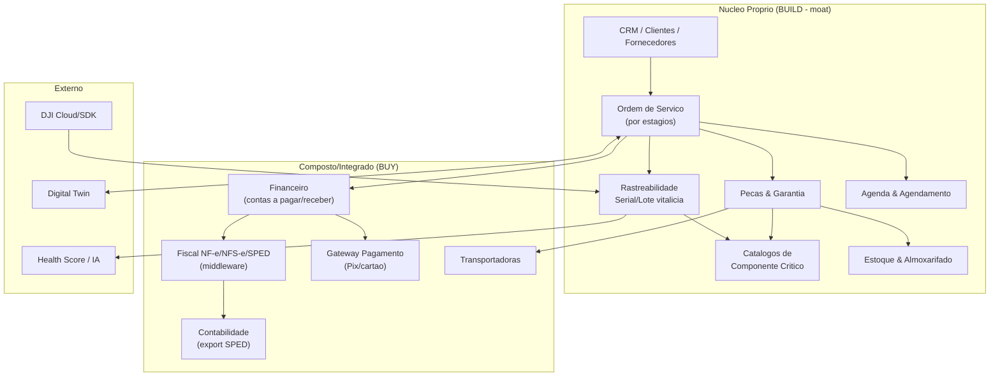
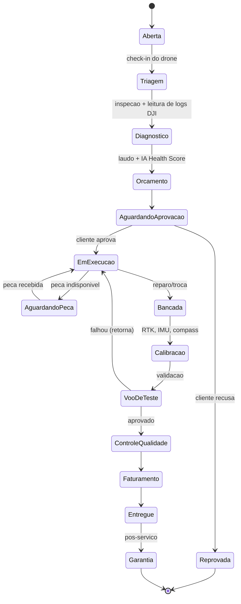
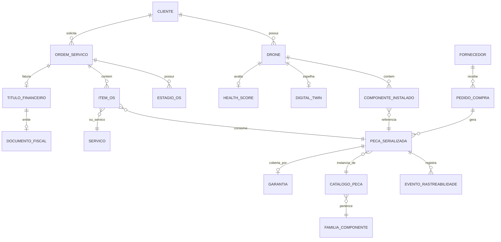
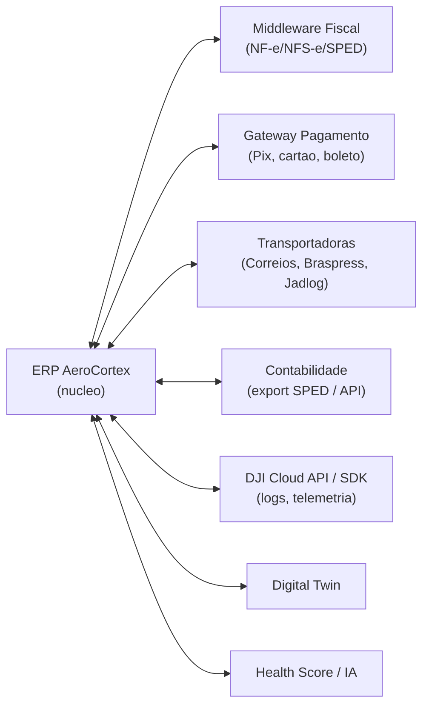

# Capitulo 5 — ERP Especializado em Drones Agricolas

> **Escopo:** Este capitulo especifica o **ERP vertical** da AeroCortex (nome de trabalho, a validar) — o sistema de registro (system of record) que sustenta a operacao de oficinas, revendas, DSPs e frotas de drones agricolas. Ao contrario de um ERP horizontal (SAP, Totvs, Odoo), este ERP nasce com o **DNA do drone**: rastreabilidade vitalicia por Serial Number e lote, catalogos por componente critico (motores, ESC, baterias LiPo, RTK, controladoras), Ordem de Servico por estagios e integracao nativa com o Digital Twin e o Health Score. Cada decisao e justificada, comparada em tabela contra alternativas, com custo (R$ e US$), dificuldade (1 a 5), riscos + mitigacao, cronograma e prioridade.
>
> **Aviso metodologico:** Custos sao **ESTIMATIVAS** de trabalho (bottom-up por pessoa-mes de engenharia x custo carregado, + licencas SaaS de lista publica). **Cambio de trabalho:** US$ 1,00 = R$ 5,40. Custo carregado de engenheiro senior BR de trabalho: ~R$ 35 mil/mes. Todo valor precisa **[VALIDAR]** com cotacao real antes de decisao de orcamento.

---

## 5.1 Sumario Executivo do Capitulo

O ERP da AeroCortex **nao e um ERP generico adaptado** — e a coluna vertebral transacional de uma plataforma de manutencao de ativos aeronauticos de alto valor (R$ 80 mil a R$ 400 mil por drone Agras). A tese central deste capitulo e a estrategia **Compose-first**: **construir proprio (build)** apenas os modulos que sao *moat* e diferenciacao — Ordem de Servico por estagios, rastreabilidade vitalicia por Serial/lote, catalogos de componente critico, garantia e pecas — e **integrar/terceirizar (buy)** aquilo que e commodity regulatoria e sem diferenciacao — **fiscal brasileiro (NF-e/NFS-e/SPED)**, gateway de pagamento, contabilidade e frete.

A decisao mestra: **NAO construir motor fiscal proprio**. O compliance fiscal brasileiro (NF-e 4.0, NFS-e nacional, SPED Fiscal/Contribuicoes, EFD-Reinf) e um pantano regulatorio que muda mensalmente por municipio; reconstruir isso destroi o roadmap. Usamos um **middleware fiscal como servico** (ex.: eNotas, Focus NF-e, PlugNotas, NFe.io — classe amplamente conhecida no mercado BR) via API. Da mesma forma, faturamento contabil e conciliado com **ERP contabil do escritorio do cliente** via integracao, nao substituido.

O nucleo proprio adota o modelo de dados de **rastreabilidade como cidada de primeira classe**: toda peca critica tem passaporte digital (cadeia de custodia do fabricante ao descarte), e a OS por estagios e a maquina de estados que orquestra a oficina. Cinco portais (Cliente, Tecnico, Gestor, Fabricante, Revenda) consomem o mesmo nucleo com escopos distintos.

Investimento estimado do ERP completo: **~R$ 3,2-4,8 milhoes** (build do nucleo ao longo de 18-24 meses) + **~R$ 8-25 mil/mes** de licencas de servicos integrados (fiscal + pagamentos + frete) no GA. O MVP (OS + Pecas + Estoque + Clientes + Fiscal integrado) sai por **~R$ 900 mil-1,3 mi** em 6-8 meses.

---

## 5.2 Filosofia: ERP Vertical vs Horizontal — Por que Construir

**Pergunta fundadora:** por que nao pegar Odoo/ERPNext (open-source) ou Totvs/SAP e adaptar?

| Criterio | ERP Horizontal (adaptar Totvs/SAP/Odoo) | ERP Vertical proprio (AeroCortex) |
|---|---|---|
| Rastreabilidade por Serial/lote vitalicia | Fraca; lote existe, mas nao "passaporte de componente" | **Nativa, cidada de 1a classe** |
| OS por estagios de drone (bancada, voo de teste, calibracao RTK) | Generica; workflow custom caro | **Modelada para o dominio** |
| Catalogo por componente critico (ESC, LiPo, motor) | Item generico | **Taxonomia rica com atributos de engenharia** |
| Integracao Digital Twin / Health Score | Inexistente | **Nativa (moat)** |
| Custo de licenca por usuario | Alto (SAP/Totvs) a moderado (Odoo) | **Zero (SaaS proprio)** |
| Fiscal BR pronto | Sim (Totvs) / parcial (Odoo) | Via middleware integrado |
| Velocidade de evolucao do produto | Lenta (dependencia de customizador) | **Alta (time proprio)** |
| Time-to-market inicial | Rapido | Medio (mitigado por Compose) |

**Decisao (MELHOR opcao): Construir o nucleo vertical, compor o commodity.** O moat da AeroCortex e dados de manutencao + rastreabilidade + IA; isso *precisa* viver em um schema proprio. Mas fiscal, pagamento e frete sao terceirizados. Isso e a estrategia **Composable ERP** — o padrao moderno (headless/API-first) que a Gartner descreve para ERPs pos-monoliticos.

---

## 5.3 Mapa de Modulos do ERP

---

## 5.4 Modulo CRM, Clientes e Fornecedores

**Funcao:** cadastro 360 de clientes (produtores rurais, DSPs, cooperativas, revendas), fornecedores (DJI, distribuidores de pecas, fabricantes de LiPo), leads e pipeline comercial. Integra com o modulo de OS (historico de servicos do cliente) e com o Digital Twin (frota do cliente).

**Entidades-chave:** `Cliente` (PF/PJ, CPF/CNPJ, endereco, inscricao estadual, regime tributario), `Contato`, `Fornecedor` (com rating de qualidade de peca), `Lead`, `Oportunidade`, `Contrato` (SLA de manutencao, planos de assinatura). Suporte a **hierarquia** (cooperativa -> produtores associados).

**Diferenciais verticais:** cada cliente carrega sua **frota vinculada** (drones por Serial), com Health Score agregado visivel ao gestor comercial — permite upsell proativo ("3 drones do cliente X com bateria em fim de vida"). Recomendacao: **BUILD** (integrado ao nucleo; CRM generico nao entende frota de drone). Dificuldade 3.

---

## 5.5 Modulo Financeiro e Fiscal (NF-e / NFS-e / SPED)

Este e o modulo onde **Buy vence Build de forma decisiva** no componente fiscal.

**Financeiro (contas a pagar/receber, fluxo de caixa, conciliacao):** BUILD leve no nucleo — modelamos `TituloFinanceiro` (a pagar/receber), `Parcela`, `MovimentoCaixa`, `CentroCusto`. Simples o suficiente para nao justificar ERP externo, e precisa estar acoplado a OS (faturamento de servico gera titulo automaticamente).

**Fiscal (emissao de documento):** **BUY via middleware fiscal API-first**. Comparativo:

| Opcao Fiscal | Cobertura | Esforco integracao | Custo | Risco | Recomendacao |
|---|---|---|---|---|---|
| Motor fiscal proprio | Total (se mantido) | 5/5 (24+ meses) | R$ 2-4 mi + manutencao eterna | Altissimo (muda por municipio) | Nao |
| Middleware SaaS (eNotas/Focus/PlugNotas/NFe.io) | NF-e, NFS-e (milhares de municipios), NFC-e | 2/5 | ~R$ 0,10-0,50/nota + mensalidade | Baixo | **MELHOR** |
| ERP fiscal completo (Totvs modulo) | Total | 4/5 | Licenca alta + lock-in | Medio | Nao (over-engineered) |

**SPED (Fiscal, Contribuicoes, EFD-Reinf):** geramos os arquivos via o mesmo middleware ou via **export para o contador** (SPED e apuracao, geralmente feita pelo escritorio contabil do cliente). Modelamos os dados fiscais (CFOP, NCM, CST, ICMS/IPI/PIS/COFINS/ISS) no nucleo e delegamos a apuracao. **Decisao: middleware fiscal + export contabil.** Dificuldade 2 (integracao) vs 5 (build). Isso economiza ~R$ 2-4 mi e ~18 meses.

---

## 5.6 Modulo Compras, Estoque e Almoxarifado

**Compras:** `RequisicaoCompra` -> `PedidoCompra` -> `RecebimentoMercadoria` -> entrada em estoque com **captura obrigatoria de Serial/lote** no recebimento (ponto de nascimento da cadeia de custodia interna). Cotacao multi-fornecedor, aprovacao por alcada.

**Estoque e Almoxarifado:** controle multi-deposito (matriz, filiais, van do tecnico de campo, consignado). Kardex por item, curva ABC, ponto de reposicao, reserva de peca para OS. Diferencial: **estoque serializado** — para pecas criticas (baterias, motores, RTK), cada unidade e rastreada individualmente, nao apenas por quantidade.

| Tipo de item | Controle | Exemplo |
|---|---|---|
| Serializado (unico) | Por Serial Number | Bateria LiPo, motor, ESC, controladora, modulo RTK |
| Por lote | Por lote + validade | Selantes, adesivos, graxas, o-rings |
| Por quantidade | Saldo simples | Parafusos, cabos genericos, EPI |

Recomendacao: **BUILD** (estoque serializado e o coracao da rastreabilidade; ERPs genericos fazem isso mal para o caso drone). Dificuldade 4.

---

## 5.7 Modulo Ordem de Servico (OS por Estagios) — Coracao Operacional

A OS e a **maquina de estados** que orquestra a oficina. Modelada como workflow configuravel por tipo de servico (corretiva, preventiva, sinistro, upgrade, revisao de garantia).

**Entidades:** `OrdemServico`, `EstagioOS` (com SLA por estagio, responsavel, checklist), `ItemOS` (pecas + servicos), `RegistroTempo` (apontamento de mao de obra), `Anexo` (fotos, videos, logs), `Aprovacao`. Cada transicao gera **evento imutavel** (trilha de auditoria — alinhado ao event-driven do Cap. 4).

**Diferenciais verticais:** estagios especificos de drone (Calibracao RTK, Voo de Teste com telemetria capturada), integracao com leitura de logs DJI no Diagnostico, sugestao de laudo pela IA (Health Score). **Recomendacao: BUILD (moat maximo).** Dificuldade 5. Prioridade **P0 no MVP**.

---

## 5.8 Modulo Agenda e Agendamento

Agenda de bancadas, tecnicos e equipamentos de teste. Agendamento de coleta/entrega, visitas de campo (manutencao no local do produtor), janelas de safra (pico de demanda). Integra OS (cada estagio pode gerar compromisso) e capacidade da oficina (evita overbooking de bancada). **Recomendacao: BUILD leve** (acoplado a OS). Dificuldade 3.

---

## 5.9 Modulo Pecas, Garantia e Catalogos de Componente Critico

**Catalogo mestre de pecas** com taxonomia rica por familia de componente critico. Cada familia tem **atributos de engenharia** proprios:

| Componente critico | Atributos-chave rastreados | Metrica de vida util |
|---|---|---|
| **Motor (BLDC)** | KV, corrente max, fabricante, torque | Horas de voo, temperatura acumulada |
| **ESC** | Amperagem, firmware, protocolo | Ciclos, falhas de sync |
| **Bateria LiPo** | Capacidade (mAh), S (celulas), C-rate, quimica | **Ciclos de carga, SoH, inchaco, IR** |
| **Carregador** | Potencia, canais, protocolo | Horas de uso |
| **RTK (base/rover)** | Freq., precisao, firmware | Horas, versao de correcao |
| **Controladora de voo** | Modelo, firmware, IMU/compass | Horas, resets, erros criticos |
| **Bomba** | Vazao (L/min), tipo, material | Horas, litros bombeados, corrosao |
| **Sensor (radar/LiDAR/camera)** | Alcance, resolucao, firmware | Horas, drift de calibracao |

**Garantia:** modelamos `Garantia` (por peca serializada e por servico prestado), com regras de cobertura (fabricante DJI vs revenda vs AeroCortex), acionamento de **RMA** (Return Merchandise Authorization) ao fabricante, e workflow de sinistro. A rastreabilidade permite responder instantaneamente: "esta bateria ainda esta na garantia? quantos ciclos tem? foi trocada em qual OS?".

**Recomendacao: BUILD (moat central).** Dificuldade 4. Prioridade P0 (pecas+catalogo) / P1 (garantia+RMA).

---

## 5.10 Rastreabilidade Vitalicia por Serial Number e Lote (Cadeia de Custodia)

Este e o **diferencial mais defensavel** do ERP. Cada peca critica tem um **passaporte digital** que registra toda sua vida — do fabricante ao descarte — de forma imutavel.

```mermaid
flowchart LR
    F["Fabricante<br/>(nascimento do Serial)"] --> D["Distribuidor/DJI"]
    D --> R["Recebimento AeroCortex<br/>(entrada com Serial/lote)"]
    R --> E["Estoque serializado"]
    E --> I["Instalacao em drone X<br/>(via OS)"]
    I --> U["Uso / acumulo de horas<br/>(telemetria -> SoH)"]
    U --> M["Manutencao / recalibracao"]
    M --> RM["Remocao / RMA / troca"]
    RM --> DESC["Descarte / reciclagem<br/>(baixa definitiva)"]
```

**Entidade central:** `EventoRastreabilidade` (append-only) ligada a `PecaSerializada`. Cada evento: tipo, timestamp, ator, OS relacionada, drone relacionado, localizacao, documento fiscal. Isso responde perguntas de compliance, seguro e seguranca de voo: *"esta LiPo que pegou fogo tinha quantos ciclos? em quais 4 drones ja foi instalada? qual lote? ha recall?"*. Habilita **recall dirigido** (localizar todas as unidades de um lote defeituoso em minutos) — valor enorme para fabricantes e seguradoras.

**Recomendacao: BUILD, event-sourced.** Dificuldade 5. Prioridade P0 (nasce com o MVP; retrofit posterior e caro). Risco: performance de trilha append-only em escala — **mitigacao:** particionamento temporal + TimescaleDB/tabela particionada (Cap. 4).

---

## 5.11 Portais (Cliente, Tecnico, Gestor, Fabricante, Revenda)

Cinco portais consomem o mesmo nucleo com escopos (RBAC/ABAC) e UX distintos.

| Portal | Persona | Funcionalidades principais | Prioridade |
|---|---|---|---|
| **Cliente** | Produtor, DSP, cooperativa | Acompanhar OS em tempo real, aprovar orcamento, ver frota + Health Score, historico, garantias, faturas, agendar servico | P0 (MVP) |
| **Tecnico** | Mecanico/bancada | App mobile: fila de OS, checklist por estagio, apontamento de tempo, foto/video, leitura de peca (QR/Serial), baixa de estoque, laudo assistido por IA | P0 (MVP) |
| **Gestor** | Dono da oficina/revenda | Dashboards (faturamento, SLA por estagio, produtividade, margem por OS), gestao de estoque/compras, aprovacoes por alcada, BI | P1 (GA) |
| **Fabricante** | DJI/XAG/Jacto | Visao de campo agregada e anonimizada: falhas por modelo/lote, RMAs, taxa de retorno, dados para recall, garantia | P2 (Scale) |
| **Revenda** | Distribuidor autorizado | Multi-oficina, repasse de garantia, estoque consignado, comissoes, pipeline de vendas de pecas | P1-P2 |

O portal Fabricante e a **ponte B2B2B** que transforma dados de campo em produto vendavel (insights de confiabilidade) — receita adicional e alinhado ao moat de dados.

---

## 5.12 Modelo de Dados Resumido (ER Simplificado)

**Entidades centrais:** `Cliente`, `Fornecedor`, `Drone`, `PecaSerializada`, `CatalogoPeca`, `FamiliaComponente`, `ComponenteInstalado`, `OrdemServico`, `EstagioOS`, `ItemOS`, `EventoRastreabilidade`, `Garantia`, `TituloFinanceiro`, `DocumentoFiscal`. As relacoes com `DigitalTwin` e `HealthScore` sao as pontes com os capitulos de IA/Twin.

---

## 5.13 Integracoes

| Integracao | Padrao | Direcao | Prioridade | Dificuldade |
|---|---|---|---|---|
| Fiscal (middleware) | REST API | Bidirecional | P0 | 2 |
| Pagamento (Pix/cartao) | REST + Webhook | Bidirecional | P0 | 2 |
| Transportadoras | REST (cotacao + rastreio) | Bidirecional | P1 | 3 |
| Contabilidade | Export SPED / API | Saida | P1 | 2 |
| DJI Cloud/SDK | REST/SDK (logs, telemetria) | Entrada | P0-P1 | 4 |
| Digital Twin | Evento interno (Kafka) | Bidirecional | P1 | 3 |
| Health Score / IA | Evento interno | Entrada | P1 | 3 |

**Risco DJI:** SDK/API de terceiros com termos restritivos e mudancas unilaterais. **Mitigacao:** camada anti-corrupcao (adapter) isolando o dominio interno; fallback de importacao manual de logs.

---

## 5.14 Analise Build vs Buy vs Compose por Modulo (Decisao Consolidada)

| Modulo | Build | Buy | Compose | **Decisao** | Justificativa | Dif. | Prioridade |
|---|---|---|---|---|---|---|---|
| OS por estagios | ✔ | | | **BUILD** | Moat maximo, dominio unico | 5 | P0 |
| Rastreabilidade Serial/lote | ✔ | | | **BUILD** | Diferencial defensavel | 5 | P0 |
| Catalogos componente critico | ✔ | | | **BUILD** | Taxonomia de engenharia unica | 4 | P0 |
| Pecas & Garantia/RMA | ✔ | | | **BUILD** | Acoplado a rastreabilidade | 4 | P0/P1 |
| Estoque serializado | ✔ | | | **BUILD** | Nucleo da rastreabilidade | 4 | P0 |
| CRM / Clientes / Fornecedores | ✔ | | ~ | **BUILD leve** | Precisa de frota vinculada | 3 | P0 |
| Financeiro (AP/AR) | ✔ | | | **BUILD leve** | Acoplado a OS; simples | 3 | P0/P1 |
| Fiscal (NF-e/NFS-e/SPED) | | ✔ | ✔ | **COMPOSE (middleware)** | Pantano regulatorio; commodity | 2 | P0 |
| Pagamentos | | ✔ | ✔ | **COMPOSE (gateway)** | Commodity; PCI fora de escopo | 2 | P0 |
| Compras | ✔ | | | **BUILD** | Ligado a recebimento serializado | 3 | P1 |
| Agenda | ✔ | | | **BUILD leve** | Acoplado a OS/capacidade | 3 | P1 |
| Transportadoras | | | ✔ | **COMPOSE** | API de cotacao/rastreio | 3 | P1 |
| Contabilidade | | ✔ | ✔ | **COMPOSE (export)** | Feito pelo contador do cliente | 2 | P1 |
| BI / Dashboards | ~ | ✔ | ✔ | **COMPOSE (Metabase/embed)** | Nao reinventar BI | 3 | P1/P2 |

**Regra de ouro:** BUILD o que e moat (dado + workflow do dominio), COMPOSE o que e regulatorio/commodity, evitar BUY monolitico (lock-in). Isso reduz o investimento inicial em ~40% e o time-to-market em ~8-12 meses versus construir tudo.

---

## 5.15 Custos, Cronograma e Prioridade por Fase

**Premissas:** time nucleo de 5-7 engenheiros; custo carregado ~R$ 35 mil/mes/eng; **[VALIDAR]** com folha real.

| Fase | Modulos | Duracao | Esforco (pessoa-mes) | Custo estimado (R$) | Custo (US$) |
|---|---|---|---|---|---|
| **MVP** | OS, Rastreabilidade, Catalogo, Pecas, Estoque serializado, CRM leve, Financeiro basico, Fiscal+Pagamento integrados, Portais Cliente+Tecnico | 6-8 meses | 30-38 | R$ 900 mil-1,3 mi | US$ 167-241 mil |
| **GA** | Garantia/RMA, Compras, Agenda, Portal Gestor+BI, Frete, Contabilidade, DJI integracao | +6-8 meses | 40-52 | R$ 1,4-1,8 mi | US$ 259-333 mil |
| **Scale** | Portal Fabricante+Revenda, multi-oficina, insights B2B, consignado, comissoes, hardening/escala | +6-8 meses | 26-40 | R$ 0,9-1,7 mi | US$ 167-315 mil |
| **Total build** | — | 18-24 meses | 96-130 | **R$ 3,2-4,8 mi** | **US$ 593-889 mil** |

**Custos recorrentes de servicos compostos (GA, mensal):** fiscal ~R$ 2-6 mil + por-nota; pagamentos ~2-4% do TPV; frete por cotacao; BI embed ~R$ 0,5-2 mil. Total ~R$ 8-25 mil/mes **[VALIDAR]**.

---

## 5.16 Riscos e Mitigacao

| Risco | Prob. | Impacto | Mitigacao |
|---|---|---|---|
| Fiscal BR muda e quebra emissao | Alta | Alto | Terceirizar em middleware (transferir risco ao fornecedor especialista) |
| Rastreabilidade mal modelada -> retrofit caro | Media | Altissimo | Event-sourcing desde o MVP; nao adiar |
| Lock-in em middleware fiscal | Media | Medio | Camada de abstracao fiscal; contrato com portabilidade |
| Performance da trilha append-only | Media | Medio | Particionamento temporal, TimescaleDB, arquivamento |
| Dependencia de API DJI (termos/mudancas) | Alta | Alto | Adapter anti-corrupcao + import manual de fallback |
| Complexidade da OS por estagios estoura prazo | Media | Alto | Workflow configuravel, mas MVP com 1 fluxo fixo; generalizar depois |
| Adocao pelos tecnicos (UX de campo) | Media | Alto | App mobile offline-first, leitura QR/Serial, design testado com oficina piloto |

---

## 5.17 Conclusao do Capitulo

O ERP da AeroCortex vence pela **especializacao onde importa e pragmatismo onde nao importa**. O nucleo proprio — OS por estagios, rastreabilidade vitalicia, catalogos de componente critico, pecas e garantia — e o *moat* transacional que nenhum ERP horizontal replica. O fiscal, pagamento, frete e contabilidade sao compostos via APIs de especialistas, poupando milhoes e anos. O modelo Compose-first entrega um MVP defensavel em 6-8 meses (~R$ 0,9-1,3 mi) e um ERP completo, integrado ao Digital Twin e a IA, em 18-24 meses (~R$ 3,2-4,8 mi). A rastreabilidade event-sourced e a decisao irreversivel: precisa nascer no MVP, pois retrofit e proibitivo. Este ERP e a fundacao de dados sobre a qual o Health Score, o Digital Twin e o marketplace da plataforma serao construidos.
