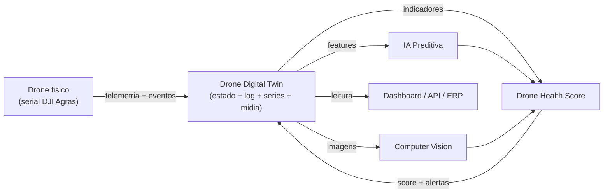
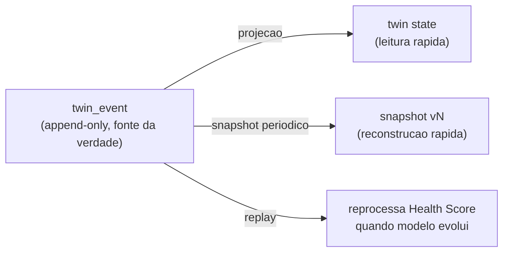
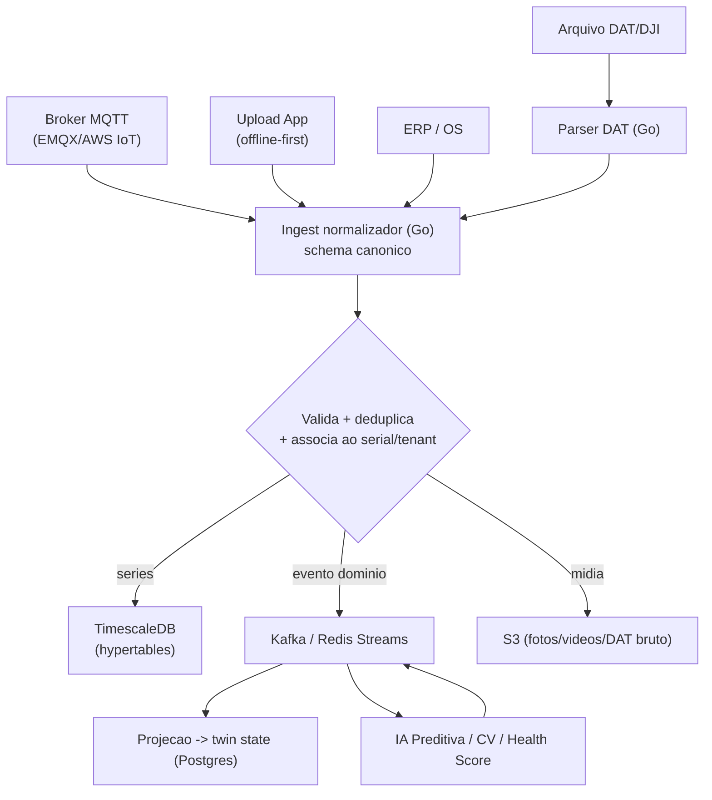
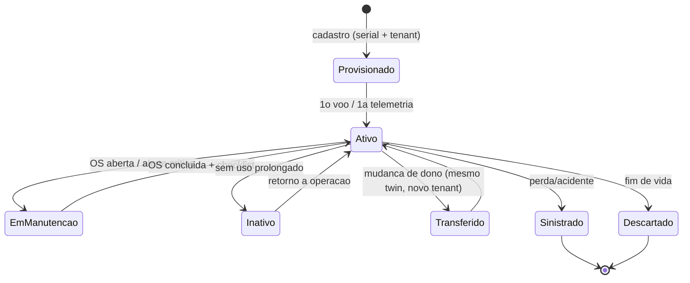
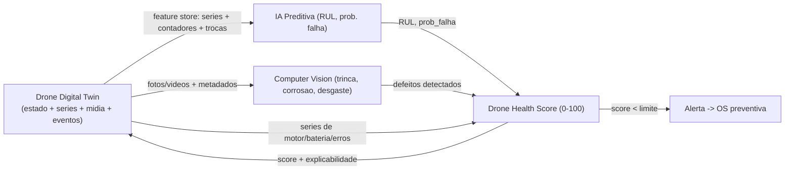
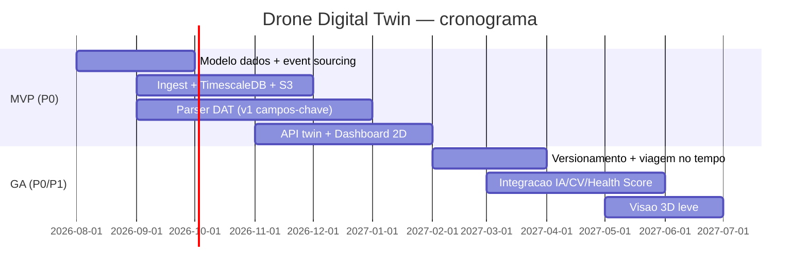

# Capitulo 6 — Drone Digital Twin

> **Escopo:** Este capitulo especifica o modulo **Drone Digital Twin (DDT)** da AeroCortex (nome de trabalho, a validar): a representacao digital viva de cada drone agricola. Cada equipamento fisico (DJI Agras T20/T25/T40/T50, XAG, Jacto e futuros) ganha um **clone digital** que acumula todo o seu ciclo de vida — horas de voo, litros pulverizados, saude de motores, temperaturas, erros, alertas, pecas trocadas, historico completo, fotos, videos, laudos, checklists, firmware/versao, localizacao, serial, numero de ciclos, vida util prevista, saude do equipamento e **Drone Health Score**. Definimos a arquitetura de ingestao de telemetria (logs DAT/DJI, MQTT, upload por app, integracao ERP e IA), o banco de series temporais, o object storage de midia, o modelo de dados do twin, seu ciclo de vida e versionamento de estado, a API do twin, a visualizacao (dashboard e 3D opcional) e a integracao com IA Preditiva, Computer Vision e Health Score.
>
> **Aviso metodologico:** Custos sao **ESTIMATIVAS** de trabalho (dimensionamento bottom-up de esforco de engenharia e recursos de nuvem x precos de lista). **Cambio de trabalho:** US$ 1,00 = R$ 5,40. Todo valor deve ser validado com **[VALIDAR]** cotacao real (AWS Pricing Calculator, folha de custo de time) antes de decisao de orcamento. Este capitulo herda as decisoes de arquitetura do Capitulo 4 (PostgreSQL 16 + TimescaleDB, Kafka/Redis Streams, S3, Go para ingest, event-driven no nucleo).

---

## 6.1 Sumario Executivo do Capitulo

O **Drone Digital Twin** e o coracao de dados e o **moat** da AeroCortex: enquanto concorrentes vendem software de OS (ordem de servico), a AeroCortex vende a **memoria completa e viva de cada drone** — um "prontuario + passaporte" que agrega valor a cada voo e nao pode ser replicado por quem chega depois. O twin transforma dados brutos e dispersos (arquivos DAT no cartao SD, planilhas de oficina, fotos no celular do tecnico) em um **estado consolidado, versionado e consultavel** que alimenta IA Preditiva, Computer Vision e o Drone Health Score, e que sustenta valor residual do ativo, garantia, seguro e revenda.

Decisao mestra: adotamos o padrao **twin hibrido — snapshot de estado + event sourcing (log de eventos imutavel)**. O estado corrente do drone (para leituras rapidas e dashboard) e materializado a partir de um **log de eventos append-only** (a fonte da verdade), o que da versionamento temporal nativo ("como estava o drone em qualquer data"), auditabilidade e capacidade de reprocessar o Health Score quando os modelos de IA evoluem. A telemetria de alta frequencia vai para **TimescaleDB** (extensao do Postgres ja escolhido no Cap. 4), a midia para **S3**, e o estado + eventos de dominio para **PostgreSQL** com trilha em **Kafka**.

Custo de construcao estimado do modulo: **~R$ 480 mil - R$ 820 mil (US$ 89 mil - US$ 152 mil)** ao longo de MVP+GA, mais **~R$ 3-9 mil/mes** de infra incremental no MVP. Prioridade **P0** — o twin e pre-requisito de praticamente todos os modulos de IA e do diferencial competitivo.

---

## 6.2 O Que e o Twin — Definicao e Papel na Plataforma

Um digital twin, no contexto AeroCortex, **nao** e uma simulacao fisica em tempo real do voo (nao pilotamos o drone remotamente). E um **twin de ciclo de vida (lifecycle twin / asset twin)**: uma entidade de dados que espelha fielmente o estado, o historico e a saude do ativo fisico ao longo de toda a sua vida, do desembalar ao descarte/revenda.

**Papeis do twin:**

1. **Prontuario unico** — reune tudo que se sabe sobre aquele serial especifico.
2. **Passaporte digital** — trilha imutavel que comprova procedencia, manutencao e uso (valor de revenda, garantia, seguro).
3. **Substrato de IA** — features consolidadas que alimentam predicao de falha, CV e Health Score.
4. **Fonte de verdade operacional** — o que a oficina, o operador e o ERP consultam para decidir manutencao.

---

## 6.3 Modelo de Dados do Twin — O Que Armazenar

O twin e composto por **quatro categorias de dado** com caracteristicas de acesso e armazenamento distintas — a separacao correta e o que mantem custo baixo e leitura rapida.

| Categoria | Exemplos | Onde vive | Frequencia | Padrao de acesso |
|---|---|---|---|---|
| **Estado / cadastro (twin state)** | serial, modelo, firmware/versao, localizacao atual, dono/tenant, status, vida util prevista, Health Score atual, contadores agregados | PostgreSQL (tabela `twin`) | muda em eventos | leitura constante (dashboard) |
| **Eventos de dominio (log)** | peca trocada, OS aberta/fechada, alerta, laudo emitido, checklist, upgrade de firmware, mudanca de dono | PostgreSQL (`twin_event`, append-only) + Kafka | por evento | append + replay historico |
| **Series temporais (telemetria)** | horas de voo, litros pulverizados, RPM/temperatura/corrente de motor, tensao/ciclos de bateria, GPS, erros/warnings do voo | TimescaleDB (hypertables) | alta (por voo) | agregacao/janela |
| **Midia e documentos** | fotos, videos, laudos PDF, screenshots de erro, DAT bruto arquivado | S3 (object storage) + metadados no Postgres | por upload | esporadico, CDN |

**Campos de estado do twin (nucleo — tabela `twin`):**

| Campo | Tipo | Origem | Observacao |
|---|---|---|---|
| `serial` (PK natural) | string | DJI/fabricante | identidade fisica imutavel |
| `tenant_id` | uuid | plataforma | multi-tenancy (RLS, Cap. 4) |
| `modelo`, `fabricante` | enum | cadastro | DJI Agras T40/T50, XAG, Jacto |
| `firmware_versao` | string | telemetria/app | historico completo em `twin_event` |
| `localizacao_atual` | geo + texto | telemetria/app | ultima conhecida |
| `horas_voo_total` | numeric | agregacao de series | contador materializado |
| `litros_pulverizados_total` | numeric | agregacao de series | idem |
| `ciclos_total` | int | agregacao | ciclos de voo/decolagem/bateria |
| `motores[]` | jsonb/tabela filha | telemetria + OS | saude por motor (1..N), horas, ultima troca |
| `baterias[]` | jsonb/tabela filha | telemetria | ciclos, saude, temperatura |
| `pecas_criticas[]` | tabela filha | OS/ERP | bomba, bicos, hastes, ESCs — horas desde troca |
| `vida_util_prevista` | numeric/data | IA Preditiva | RUL (Remaining Useful Life) |
| `health_score` | 0-100 + faixa | Health Score | denormalizado para leitura rapida |
| `status` | enum | plataforma | ativo, em_manutencao, inativo, vendido, sinistrado |
| `state_version` | int | plataforma | versao do estado (versionamento) |
| `updated_at`, `created_at` | timestamptz | plataforma | auditoria |

Contadores agregados (`horas_voo_total`, `litros_pulverizados_total`, `ciclos_total`) sao **materializados** via *continuous aggregates* do TimescaleDB e/ou consumo de eventos, para o dashboard nao ter que varrer bilhoes de pontos. A verdade granular vive nas series; o twin state e a **projecao** rapida.

---

## 6.4 Comparacao de Abordagens de Modelagem do Twin

Como representar o twin? Tres padroes concorrem — a escolha define versionamento, auditabilidade e capacidade de reprocessar IA.

| Abordagem | Como funciona | Vantagens | Desvantagens | Veredito |
|---|---|---|---|---|
| **State-only (CRUD)** | uma linha por drone, sobrescrita a cada update | simples, barato, leitura trivial | perde historico, sem "como estava em X", auditoria fraca, nao reprocessa score | Insuficiente (so p/ protótipo) |
| **Event sourcing puro** | so o log de eventos existe; estado sempre derivado | auditoria total, viagem no tempo, reprocessavel | leitura lenta sem projecao, curva de aprendizado, complexo p/ time pequeno | Overkill isolado |
| **Hibrido: snapshot + event sourcing** (recomendado) | log de eventos append-only e a verdade; estado materializado (projecao) p/ leitura; snapshots periodicos | leitura rapida + historico completo + reprocessavel + auditavel; versionamento nativo | mais engenharia que CRUD; precisa disciplina de projecao | **MELHOR** |
| **Twin "pesado" (simulacao fisica / gemeo 3D em tempo real)** | modelo fisico do drone rodando em paralelo (ex.: fadiga estrutural simulada) | fidelidade fisica maxima | custo e complexidade enormes, dados de sensor insuficientes p/ calibrar | Fora de escopo (roadmap distante) |

**Decisao:** **twin hibrido (snapshot + event sourcing)**. Justificativa: (1) o versionamento de estado ("como estava o drone quando foi vendido / quando o motor falhou") e requisito de negocio (passaporte, garantia, disputa de seguro); (2) quando um modelo de IA melhora, precisamos **reprocessar o Health Score historico** — so possivel com o log de eventos + series preservados; (3) leitura de dashboard precisa ser instantanea — a projecao materializada resolve. Nao adotamos event sourcing puro (leitura sofre) nem simulacao fisica (dados insuficientes, custo desproporcional). Dificuldade **4**.

---

## 6.5 Arquitetura de Ingestao de Telemetria

O dado do drone chega por **multiplos canais** com formatos e latencias muito diferentes. O ingest deve normalizar tudo em um **schema canonico de telemetria** antes de persistir. Servico de ingest em **Go** (Cap. 4), stateless, escalavel horizontalmente.

| Canal | Formato | Latencia | Volume | Complexidade | Uso |
|---|---|---|---|---|---|
| **Arquivos DAT/DJI (log de voo)** | binario proprietario DJI (.DAT, .txt/logs) | batch (pos-voo) | alto por arquivo | **Alta** (parsing/engenharia reversa) | fonte mais rica de telemetria historica |
| **MQTT (streaming)** | JSON/binario sobre MQTT | quase real-time | continuo | Media | drones/gateways que suportam telemetria live |
| **Upload por app (mobile/web)** | JSON, fotos, checklist, DAT | sob demanda | medio | Baixa-Media | operacao de campo, offline-first (Cap. 4) |
| **Integracao ERP** | REST/eventos | eventual | baixo | Media | pecas trocadas, custo, NF-e, OS financeira |
| **Integracao IA (retorno)** | eventos Kafka | por processamento | medio | Media | score, RUL, deteccoes de CV escrevem no twin |

**Fluxo de ingestao (canonizacao -> persistencia -> eventos):**

**Pontos criticos de projeto:**

- **Idempotencia e deduplicacao:** o mesmo DAT pode ser enviado 2x (app re-sincroniza). Chave de idempotencia por hash do arquivo + `(serial, timestamp_voo)`. Sem isso, contadores (horas/litros) duplicam — erro grave.
- **Parser DAT (o item mais arriscado):** o formato DJI e proprietario e parcialmente nao documentado. Existem projetos comunitarios de parsing e ferramentas oficiais/semi-oficiais da DJI; a estrategia e comecar extraindo os campos de maior valor (tempo de voo, alturas, alertas, tensao de bateria, GPS) e expandir. **Nunca inventar campos**; validar cada campo contra a documentacao/ferramenta oficial DJI e contra voos reais. Ver Cap. 5/ingestao para detalhamento da integracao DJI.
- **Buffer/backpressure:** picos pos-jornada (dezenas de drones sincronizando a noite). Redis Streams (MVP) / Kafka (GA) absorvem o pico; ingest consome no proprio ritmo.
- **Associacao ao tenant:** todo dado entra amarrado a `(serial, tenant_id)` com RLS (Cap. 4) — vazamento cross-tenant aqui e catastrofico.

---

## 6.6 Banco de Series Temporais — TimescaleDB vs InfluxDB

A telemetria (RPM, temperatura, corrente por motor, tensao de bateria, GPS, litros/min) e a maior massa de dados do twin. A escolha do TSDB define custo e simplicidade operacional.

| Criterio (peso) | **TimescaleDB** | **InfluxDB** | ClickHouse |
|---|---|---|---|
| Consolidacao com stack (Postgres ja escolhido) (25%) | **Excelente** (e o proprio Postgres) | Fraca (novo motor) | Fraca |
| SQL / familiaridade do time (15%) | **Excelente** (SQL puro + joins com dados relacionais) | Media (Flux/InfluxQL) | Boa (SQL-like) |
| Compressao e retencao (hot/cold) (15%) | Muito boa (compressao nativa + tiering S3) | Muito boa | **Excelente** |
| Ingest throughput bruto (15%) | Muito bom | **Excelente** | **Excelente** |
| Continuous aggregates (contadores materializados) (10%) | **Excelente** | Bom | Bom (mat. views) |
| Custo operacional / gerenciado (10%) | Baixo (RDS/Timescale Cloud) | Medio | Medio-alto |
| Ecossistema BI/Grafana (10%) | Excelente | Excelente | Bom |
| **Veredito** | **MELHOR** | Alternativa forte se so-telemetria | Melhor p/ OLAP massivo (Scale) |

**Decisao:** **TimescaleDB**. Justificativa decisiva: e uma **extensao do PostgreSQL** que ja e o banco primario (Cap. 4), entao ganhamos **um so motor, um so backup, um so skillset, e joins nativos** entre a telemetria (serie) e o dado relacional do twin (serial, tenant, OS) — algo que InfluxDB nao faz bem (exigiria correlacao na aplicacao). Continuous aggregates materializam os contadores do twin (horas de voo, litros) de forma barata. InfluxDB so venceria num cenario puro de telemetria sem correlacao relacional — nao e o nosso. ClickHouse fica reservado para o data lake analitico no **Scale**, se o volume de series ultrapassar bilhoes de pontos com necessidade OLAP pesada.

- Custo/dificuldade: dificuldade **3**. Risco: crescimento de series estoura IO/custo -> mitigacao: politicas de **compressao** (apos 7-30d) e **tiering hot/cold** (hot 90d no TimescaleDB, cold em S3/Parquet), definidas desde o MVP. **[VALIDAR]** volume real por drone/voo com dados de campo.

---

## 6.7 Object Storage para Midia

Fotos de inspecao, videos, laudos PDF, screenshots de erro e o **DAT bruto arquivado** vao para **S3** (Cap. 4), nunca para o banco (BLOB em Postgres e caro e nao escala). Metadados (qual foto, de qual OS, de qual serial, hash, EXIF, geo) ficam no Postgres apontando para a chave S3.

- **Organizacao de chaves:** `tenant_id/serial/tipo/ano/mes/uuid.ext` — facilita lifecycle, particao por tenant e limpeza.
- **Lifecycle S3:** Standard -> Infrequent Access (90d) -> Glacier (1a) para midia antiga e DAT bruto; laudos e fotos "de valor" (que embasam garantia/seguro) ficam em classe quente + versionamento + Object Lock (WORM) para imutabilidade legal.
- **Entrega:** URLs pre-assinadas + CDN (CloudFront) para nao expor bucket e cortar egress.
- **Integracao CV:** ao subir foto, evento dispara pipeline de Computer Vision (deteccao de trinca, corrosao, desgaste de bico) cujo resultado volta como evento de dominio para o twin. Dificuldade **2**.

---

## 6.8 Ciclo de Vida do Twin

O twin nasce, evolui e "morre" acompanhando o ativo fisico. Estados e transicoes:

**Regras de ciclo de vida:**

- **Provisionamento:** twin criado no cadastro (serial + modelo + tenant), mesmo antes do 1o voo. Idempotente por serial (nunca dois twins para o mesmo serial global).
- **Transferencia de propriedade (revenda):** o twin **persiste** — muda o `tenant_id` corrente, mas o **historico completo continua** (esse e o valor do passaporte). Politica de privacidade LGPD: o novo dono ve historico tecnico (manutencao, horas), mas dados sensiveis do dono anterior (localizacao de fazendas, clientes) sao **redacted**/anonimizados conforme contrato. Decisao de granularidade da heranca de historico e **[VALIDAR]** com juridico.
- **Descarte/sinistro:** twin arquivado (read-only), mas preservado para historico de frota, garantia e analise de falha de fleet.

---

## 6.9 Versionamento de Estado do Twin

Requisito central: responder **"como estava o drone X em qualquer data?"** e **reprocessar o Health Score** quando o modelo de IA muda. Como o padrao e event sourcing hibrido, o versionamento e natural:

| Mecanismo | O que da | Como |
|---|---|---|
| **Log de eventos append-only** (`twin_event`) | fonte da verdade, viagem no tempo | cada mudanca e um evento imutavel com `state_version++` |
| **Snapshots periodicos** | reconstrucao rapida sem replay total | snapshot do estado a cada N eventos / periodicamente |
| **Series bi-temporais** (event_time vs ingest_time) | distingue "quando ocorreu" de "quando soubemos" | 2 timestamps na telemetria/eventos |
| **Score versionado** (`model_version` no score) | rastrear qual modelo gerou o score | reprocessar historico com replay quando modelo evolui |

**Reconstrucao de estado em uma data:** `snapshot mais recente <= data` + replay dos eventos ate a data. Isso da a "foto" exata do drone para laudo, disputa de garantia/seguro e auditoria. O `state_version` monotonico tambem serve de **controle de concorrencia otimista** (evita escritas conflitantes de dois canais simultaneos). Dificuldade **4**.

---

## 6.10 API do Twin

A API do twin e a interface publica do modulo — consumida pelo dashboard, mobile, ERP, parceiros e pelos servicos de IA. Contrato em **OpenAPI 3.1** (REST) para CRUD/consulta e **eventos versionados via schema registry (Avro/Protobuf) no Kafka** para o fluxo assincrono (Cap. 4).

| Endpoint / evento | Metodo | Descricao |
|---|---|---|
| `/v1/twins/{serial}` | GET | estado corrente completo do twin |
| `/v1/twins/{serial}/state?at={data}` | GET | estado historico (viagem no tempo) |
| `/v1/twins/{serial}/events` | GET | log de eventos (paginado, filtravel) |
| `/v1/twins/{serial}/telemetry?metric=&from=&to=&agg=` | GET | series agregadas (janela/agregacao) |
| `/v1/twins/{serial}/media` | GET/POST | midia (URLs pre-assinadas) |
| `/v1/twins/{serial}/events` | POST | registra evento de dominio (peca trocada, checklist) |
| `/v1/twins/{serial}/health` | GET | Health Score atual + historico + explicabilidade |
| `telemetry.raw` (Kafka) | evento | telemetria normalizada ingerida |
| `twin.event.created` (Kafka) | evento | novo evento de dominio no twin |
| `twin.healthscore.updated` (Kafka) | evento | score recalculado (dispara alerta/OS) |

**Decisoes de API:** versionamento por URI (`/v1`); paginacao por cursor para eventos/series (nao offset — series sao enormes); leitura de telemetria **sempre agregada** (o cliente pede metrica+janela+agregacao, nunca ponto-a-ponto bruto); escrita de eventos idempotente (chave de idempotencia obrigatoria); RLS/tenant em toda rota. GraphQL considerado e **adiado** — o padrao de acesso e conhecido e REST+eventos e mais simples de cachear e versionar. Dificuldade **3**.

---

## 6.11 Visualizacao — Dashboard e 3D Opcional

**Dashboard do twin (obrigatorio, MVP):** pagina "prontuario do drone" com Health Score em destaque, contadores (horas, litros, ciclos), saude por motor/bateria (semaforo), timeline de eventos (OS, alertas, trocas, firmware), galeria de midia/laudos, mapa da ultima localizacao e alertas/RUL da IA Preditiva. Construido em Next.js + Recharts/visualizacao de series (Cap. 4), consumindo a API do twin.

**Visao 3D (opcional, GA+):** representacao 3D do drone com componentes clicaveis (motor 1..N, bomba, bateria) coloridos pelo estado de saude — "hotspots" que abrem o detalhe/historico da peca. Comparacao de abordagens:

| Abordagem 3D | Custo/esforco | Valor percebido | Veredito |
|---|---|---|---|
| **Sem 3D — so dashboard 2D + semaforos** | baixo | alto (ja resolve 90%) | **MVP** |
| **3D leve (modelo estatico + hotspots, Three.js/R3F)** | medio | alto (efeito "uau" comercial + navegacao intuitiva por componente) | **GA (diferencial de venda)** |
| **3D realista / simulacao fisica** | altissimo | baixo (dados nao sustentam) | Nao |

**Decisao:** dashboard 2D no MVP; **3D leve com hotspots de saude por componente no GA** como diferencial comercial e de UX (navegar o drone e clicar no motor com problema). Simulacao fisica 3D fica fora. Dificuldade: 2D **2**, 3D leve **3**.

---

## 6.12 Integracao com IA Preditiva, Computer Vision e Health Score

O twin e o **substrato** desses tres modulos (detalhados em seus proprios capitulos) — aqui definimos os **contratos de dados**.

- **IA Preditiva:** consome do twin uma **feature store** (series agregadas por janela + contadores + intervalo desde ultima troca + eventos de erro) e devolve **RUL (vida util restante)** e **probabilidade de falha por componente**, que gravam de volta no twin como eventos (`vida_util_prevista`, alertas). Reprocessavel via replay quando o modelo evolui (secao 6.9).
- **Computer Vision:** ao subir foto/video, evento dispara pipeline de CV; deteccoes (trinca em haste, corrosao, desgaste/entupimento de bico, dano em helice) voltam como **eventos de dominio** anexados a midia, entrando no historico e no Health Score.
- **Drone Health Score:** funcao que combina series (temperatura/corrente anômala de motor, degradacao de bateria, frequencia de erros), saidas da IA Preditiva (RUL) e da CV (defeitos visuais) em um **score 0-100 com faixas (verde/amarelo/vermelho) e explicabilidade** (quais fatores puxaram o score). O score e denormalizado no twin state (leitura rapida) e versionado por `model_version`. Score abaixo do limite dispara alerta e sugestao de OS preventiva (fluxo do Cap. 4). Dificuldade da integracao **4**.

---

## 6.13 Seguranca, Privacidade e Integridade (LGPD)

| Aspecto | Medida |
|---|---|
| Isolamento multi-tenant | RLS + `tenant_id` em twin, eventos, series e midia (Cap. 4); testes de vazamento em CI |
| Imutabilidade do passaporte | `twin_event` append-only; midia de valor com S3 Object Lock (WORM) |
| Privacidade na revenda | anonimizacao/redaction de dados sensiveis do dono anterior (fazendas, clientes) na transferencia — **[VALIDAR]** com juridico |
| Integridade dos contadores | idempotencia/deduplicacao no ingest (horas/litros nunca duplicam) |
| Criptografia | em transito (TLS) e repouso (S3/RDS KMS); DAT bruto criptografado |
| Auditoria | trilha imutavel de quem leu/alterou o twin (compliance e disputa) |

Risco de privacidade na heranca de historico entre donos e **alto** juridicamente -> mitigacao: politica de dados por camadas (tecnico herdavel vs sensivel redacted) revisada por juridico antes do GA.

---

## 6.14 Estimativa de Custo, Dificuldade e Cronograma

> **ESTIMATIVA** bottom-up: esforco de engenharia (custo/hora blended **~R$ 180/h** [VALIDAR] com folha real) + infra incremental. Cambio R$ 5,40.

**Esforco de construcao (one-time):**

| Bloco | Fase | Horas est. | Custo (R$) | Custo (US$) | Dificuldade |
|---|---|---|---|---|---|
| Modelo de dados + event sourcing hibrido | MVP | 320-480 | 57,6k-86,4k | 10,7k-16,0k | 4 |
| Ingest telemetria (Go) + canonizacao | MVP | 360-520 | 64,8k-93,6k | 12,0k-17,3k | 4 |
| Parser DAT/DJI | MVP-GA | 400-700 | 72,0k-126,0k | 13,3k-23,3k | 5 |
| TimescaleDB (hypertables, agregados, retencao) | MVP | 160-260 | 28,8k-46,8k | 5,3k-8,7k | 3 |
| Object storage + midia + CV hook | MVP | 140-220 | 25,2k-39,6k | 4,7k-7,3k | 2 |
| API do twin (REST + eventos) | MVP | 240-360 | 43,2k-64,8k | 8,0k-12,0k | 3 |
| Dashboard 2D do twin | MVP | 260-400 | 46,8k-72,0k | 8,7k-13,3k | 2 |
| Versionamento/viagem no tempo + snapshots | GA | 200-320 | 36,0k-57,6k | 6,7k-10,7k | 4 |
| Integracao IA/CV/Health Score (contratos) | GA | 240-380 | 43,2k-68,4k | 8,0k-12,7k | 4 |
| Visao 3D leve (hotspots) | GA | 200-340 | 36,0k-61,2k | 6,7k-11,3k | 3 |
| **Total** | | **~2.520-3.980 h** | **~R$ 454k-816k** | **~US$ 84k-151k** | |

**Infra incremental (mensal, ESTIMATIVA):**

| Item | MVP (R$/mes) | GA (R$/mes) |
|---|---|---|
| TimescaleDB (armazenamento series + compute) | 1,5k-4k | 8k-18k |
| S3 + CDN (midia + DAT) | 0,8k-2,5k | 4k-10k |
| Ingest compute (Go) + broker (Redis/Kafka) | 0,7k-2,5k | 4k-9k |
| **Total incremental** | **~R$ 3-9k** | **~R$ 16-37k** |

**Cronograma (mermaid):**

**Prioridade:** **P0** no MVP — o twin e pre-requisito de IA Preditiva, CV e Health Score e e o moat de dados. O parser DAT e o item mais arriscado e deve comecar cedo, entregando valor incremental (campos-chave primeiro).

---

## 6.15 Riscos e Mitigacao (consolidado)

| Risco | Prob. | Impacto | Mitigacao | Prioridade |
|---|---|---|---|---|
| Parser DAT/DJI incompleto ou quebra em novo firmware | Alta | Alto | Comecar por campos-chave; camada de parser versionada por firmware; fallback via app; validar contra ferramenta oficial DJI | P0 |
| Contadores duplicados (horas/litros) por reenvio | Media | Alto | Idempotencia por hash + `(serial,timestamp)` no ingest | P0 |
| Vazamento cross-tenant no twin/series/midia | Media | Critico | RLS no banco + testes de isolamento em CI + auditoria | P0 |
| Custo de series temporais estoura | Alta | Alto | Compressao + retencao hot/cold + agregados desde o MVP | P1 |
| Privacidade na revenda (dados do dono anterior) | Media | Alto (juridico) | Politica de heranca por camadas + redaction; revisao juridica pre-GA | P1 |
| Complexidade do event sourcing afoga o time | Media | Medio | Hibrido (nao puro); libs maduras; snapshots; escopo faseado | P2 |
| 3D vira "gold plating" e atrasa | Media | Medio | 3D so no GA, apos dashboard 2D validado comercialmente | P2 |

---

## 6.16 Conclusao do Capitulo

O Drone Digital Twin e simultaneamente **produto** (prontuario/passaporte que o cliente ve e valoriza) e **infraestrutura de IA** (substrato de features para predicao, CV e Health Score). A arquitetura recomendada — **twin hibrido (snapshot + event sourcing)**, telemetria em **TimescaleDB**, midia em **S3**, ingest **poliglota canonizado** (DAT, MQTT, app, ERP, IA) e API REST+eventos versionada — entrega leitura rapida, historico completo, versionamento temporal e reprocessamento de IA, mantendo custo e complexidade sob controle para um time em estagio inicial. O twin e o **moat de dados** da AeroCortex: cada drone conectado torna a plataforma mais valiosa e mais dificil de substituir. O detalhamento acionavel (tarefas com horas, custo, equipe, dependencias, impacto, dificuldade, risco e wave) segue no objeto estruturado deste capitulo.
