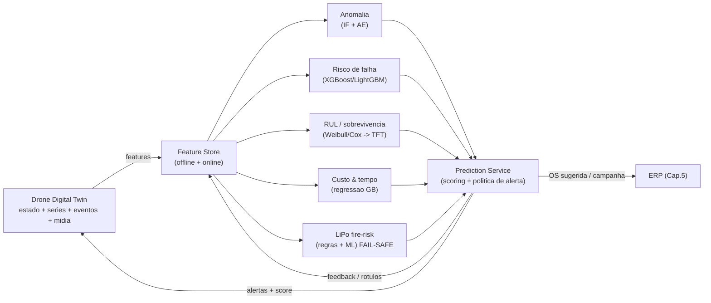
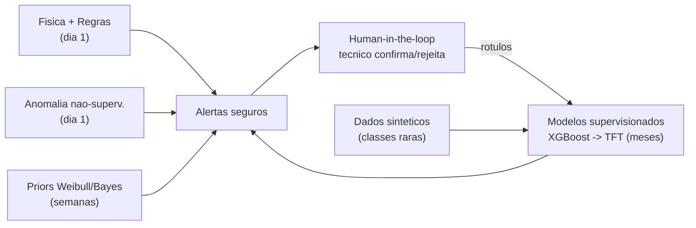
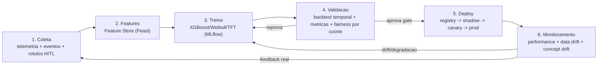
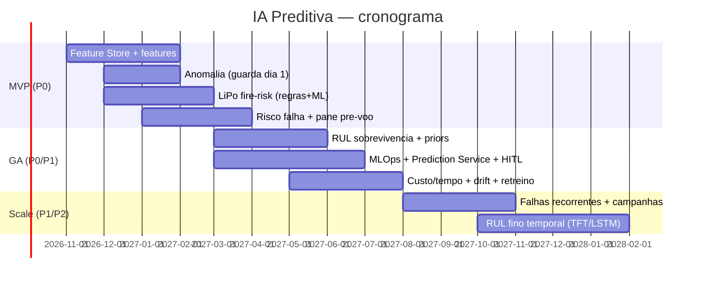

# Capitulo 7 — IA Preditiva (Manutencao Preditiva)

> **Escopo:** Este capitulo especifica o modulo **IA Preditiva** da AeroCortex (nome de trabalho, a validar): o conjunto de modelos que transforma o substrato de dados do **Drone Digital Twin (Cap. 6)** em **antecipacao acionavel** — prever falhas, estimar vida util restante (RUL), recomendar troca de pecas, projetar custos e tempo de manutencao, quantificar risco de pane e, criticamente, **risco de incendio de baterias LiPo**, detectar falhas recorrentes e disparar campanhas preventivas de frota. Definimos os tipos de predicao, a comparacao de abordagens de modelagem com recomendacao por tipo, a engenharia de features, a estrategia de **cold-start** (poucos dados iniciais), o pipeline **MLOps** completo, as metricas de aceite, o monitoramento de drift e as estimativas de custo, dificuldade, risco, cronograma e prioridade.
>
> **Aviso metodologico:** Custos sao **ESTIMATIVAS** de trabalho (dimensionamento bottom-up de esforco de engenharia/ciencia de dados a custo/hora blended **~R$ 200/h** para perfil ML senior [VALIDAR] com folha real, + infra de treino/inferencia a preco de lista). **Cambio de trabalho:** US$ 1,00 = R$ 5,40. Este capitulo herda as decisoes dos Cap. 4 (PostgreSQL 16 + TimescaleDB, Kafka/Redis, S3, event-driven) e Cap. 6 (twin hibrido snapshot + event sourcing como fonte de features). Numeros de mercado sao **ESTIMATIVA** e devem ser validados com fonte primaria (dados de campo da propria frota).

---

## 7.1 Sumario Executivo do Capitulo

A IA Preditiva e a **camada de valor percebido** da AeroCortex: o Digital Twin *guarda* a memoria do drone; a IA Preditiva *usa* essa memoria para dizer, antes que aconteca, **"o motor 3 do seu Agras T50 vai falhar em ~28 horas de voo; agende agora"** ou **"esta bateria LiPo apresenta divergencia de celula + inchaco termico; retire de operacao — risco de incendio elevado"**. Esse e o momento em que a plataforma deixa de ser um sistema de registro e passa a ser um **copiloto de decisao** — e o que sustenta pricing premium e retencao.

**Decisao mestra:** adotamos uma **arquitetura de portfolio de modelos** (nao um unico modelo mágico), com o algoritmo escolhido **por tipo de predicao**, orquestrado por um **Prediction Service** que consome features do twin e publica alertas de volta para o twin e para o ERP. A recomendacao de topo por familia: **XGBoost/LightGBM** para classificacao de risco de falha e regressao de custo/tempo (melhor custo-beneficio em dados tabulares esparsos, que e a nossa realidade inicial); **analise de sobrevivencia (Weibull + Cox / Random Survival Forest)** para RUL e probabilidade de falha em janela; **Temporal Fusion Transformer (TFT)** e **LSTM** para RUL fino sobre telemetria densa (fase madura); e **deteccao de anomalias (Isolation Forest + autoencoder)** como **primeira linha de defesa** desde o dia 1 — porque nao exige historico rotulado de falhas e cobre o cold-start.

**Decisao critica de seguranca:** o **risco de incendio de LiPo** e tratado como **subsistema de seguranca funcional**, nao como "mais um modelo". Ele combina **regras fisicas deterministicas** (limiares de temperatura, tensao de celula, divergencia entre celulas, resistencia interna, inchaco) com um classificador ML, sempre com **fail-safe conservador** (na duvida, alerta) e explicabilidade obrigatoria. Falso negativo aqui pode significar incendio de galpao — o vies e deliberadamente para o alarme.

Investimento estimado do modulo: **~R$ 620 mil - R$ 1,15 milhao (US$ 115 mil - US$ 213 mil)** ao longo de MVP -> GA -> Scale, mais **~R$ 4-14 mil/mes** de infra incremental (treino + inferencia + feature store). Prioridade **P0** para o subsistema LiPo e a deteccao de anomalias (entregam valor no cold-start); **P1** para RUL fino e campanhas de frota.

---

## 7.2 O Que a IA Preditiva Vai Prever

Cada predicao e um **produto de decisao** com um consumidor claro (oficina, operador, gestor de frota, revenda, fabricante) e uma acao associada. Modelar sem a acao e desperdicio.

| # | Predicao | Pergunta de negocio | Saida | Consumidor / acao |
|---|---|---|---|---|
| 1 | **Risco de falha (janela)** | "Qual a prob. de falha nos proximos N voos/horas?" | prob. 0-1 por subsistema | Gestor: agenda manutencao antes da pane |
| 2 | **RUL — Remaining Useful Life** | "Quantas horas/voos ate o fim de vida do componente?" | horas/ciclos + intervalo de confianca | Oficina: planeja troca; compras: antecipa peca |
| 3 | **Troca de pecas** | "Qual peca trocar e quando?" | ranking de pecas + janela | Estoque/compras: gira estoque certo |
| 4 | **Custo de manutencao** | "Quanto vai custar a proxima intervencao?" | R$ estimado + faixa | Gestor/financeiro: orcamento e contrato |
| 5 | **Tempo de manutencao (downtime)** | "Quanto tempo o drone fica parado?" | horas/dias | Operacao: planeja janela de safra |
| 6 | **Risco de pane em voo** | "Este drone esta apto para a proxima missao?" | semaforo apto/atencao/veta | Operador: go/no-go pre-voo |
| 7 | **Risco de incendio LiPo (CRITICO)** | "Esta bateria pode incendiar?" | nivel de risco + causa | Todos: retirar de operacao / isolar |
| 8 | **Falhas recorrentes** | "Ha padrao sistemico neste modelo/lote/firmware?" | cluster + causa provavel | Produto/fabricante: recall/campanha |
| 9 | **Campanhas preventivas** | "Que grupo de drones abordar preventivamente?" | lista + priorizacao | Frota/pos-venda: campanha em massa |

**Principio de design:** predicoes 1, 6 e 7 sao **operacionais em tempo quase-real** (semaforo pre-voo, alerta de bateria) — precisam de inferencia online e baixa latencia. Predicoes 2-5, 8 e 9 sao **taticas/planejamento** (batch diario/semanal) — toleram latencia e priorizam qualidade. Essa separacao define a topologia de deploy (Secao 7.7-7.8).

---

## 7.3 Fundamento Critico: LiPo e o Risco de Incendio

A bateria LiPo do Agras (ex.: DB1560/DB1580 na familia T40/T50, ~30.000 mAh, alta densidade) e o **componente mais perigoso e mais caro-por-ciclo** do drone. *Thermal runaway* (fuga termica) e o modo de falha catastrofico: uma vez iniciado, a reacao e auto-sustentada e praticamente impossivel de conter. Por isso este subsistema recebe tratamento de **seguranca funcional**, com defesa em camadas:

1. **Camada deterministica (regras fisicas, sempre ativa, independente de ML):** dispara em limiares consagrados de engenharia de baterias — temperatura absoluta e taxa de subida (dT/dt) fora de faixa; **divergencia de tensao entre celulas** (cell imbalance) acima de limiar; **resistencia interna** crescente; numero de ciclos e profundidade de descarga (DoD) acumulada; **inchaco/swelling** detectado por CV (Cap. 8) em foto de inspecao; tempo/temperatura de armazenamento em estado de carga alto. Estas regras nao dependem de historico de incendios (que — felizmente — sera escasso).
2. **Camada ML (classificador de risco):** XGBoost sobre features de degradacao (SOH — State of Health, deriva de capacidade, assinatura de curva de descarga, historico termico) para **antecipar** deterioracao antes de cruzar limiares duros.
3. **Camada de politica (fail-safe):** combinacao por **regra do "mais conservador vence"** — se regra OU ML acusarem, o alerta sobe. Vies deliberado para recall/precaucao. Toda decisao vem com **explicacao** (qual feature disparou) para o operador confiar e agir.

> **Justificativa:** em seguranca, o custo de um falso negativo (incendio) e ordens de magnitude maior que o de um falso positivo (retirar uma bateria boa por precaucao). O modelo LiPo e sintonizado para **recall altissimo** em detrimento de precision, e nunca opera "caixa-preta". Regras fisicas garantem um piso de seguranca mesmo com o ML imaturo (cold-start). Meta de aceite: **recall >= 0,97 em eventos de degradacao severa** com FPR gerenciavel; **[VALIDAR]** limiares com dados de fabricante/campo.

---

## 7.4 Abordagens de Modelagem — Comparacao e Recomendacao por Tipo

Comparamos as quatro familias exigidas, avaliando o que importa para a nossa realidade (dados tabulares + series temporais, historico inicial escasso, necessidade de explicabilidade e de intervalos de confianca).

| Familia | Forca principal | Fraqueza | Dados necessarios | Explicabilidade | Custo compute | Cold-start |
|---|---|---|---|---|---|---|
| **Sobrevivencia (Weibull, Cox, Random Survival Forest)** | Modela **tempo-ate-evento** e **censura** (drone que ainda nao falhou) nativamente; entrega curva de risco e RUL com incerteza | Cox assume proporcionalidade de hazard; menos flexivel a interacoes ricas | Historico de vida + eventos de falha (mesmo censurados) | **Alta** (hazard ratios) | Baixo | **Boa** (Weibull com poucos dados + fisica) |
| **Gradient Boosting (XGBoost, LightGBM)** | **Estado da arte em tabular**; robusto a dados esparsos/faltantes; rapido; SHAP para explicar | Nao modela tempo/censura nativamente; nao captura sequencia longa | Snapshot de features rotulado (falhou/nao em janela) | **Alta** (SHAP) | Baixo-medio | **Media-boa** (funciona com centenas de exemplos) |
| **Series temporais NN (LSTM, TFT)** | Captura **dinamica temporal** e sazonalidade; TFT da attention interpretavel + quantis (incerteza) | **Faminto por dados**; caro de treinar/servir; overfit fácil no inicio | Muitas series longas e densas rotuladas | Media (TFT) / Baixa (LSTM) | **Alto** | **Ruim** (precisa de volume) |
| **Deteccao de anomalias (Isolation Forest, Autoencoder)** | **Nao supervisionado** — nao precisa de rotulo de falha; acha o "estranho" | Detecta anomalia, nao a *causa* nem o *quando*; ajuste de limiar sensivel | So dados de operacao normal | Media | Baixo (IF) / Medio (AE) | **Excelente** (ideal no dia 1) |

**Recomendacao por tipo de predicao (a MELHOR opcao para cada caso):**

| Predicao | Fase MVP (cold-start) | Fase madura (dados abundantes) | Justificativa |
|---|---|---|---|
| Risco de falha (janela) | **XGBoost/LightGBM** | XGBoost + **TFT** (ensemble) | Tabular esparso; SHAP explica; barato e rapido |
| RUL | **Weibull + Cox / RSF** (+ fisica) | **TFT** (quantis) + sobrevivencia | Sobrevivencia lida com censura e incerteza; TFT refina com telemetria densa |
| Troca de pecas | **XGBoost** (multi-classe) + regras | XGBoost + RUL por componente | Ranking de peca e classificacao; regras cobrem inicio |
| Custo de manutencao | **LightGBM (regressao)** | LightGBM + quantis | Tabular; faixas via regressao quantilica |
| Tempo/downtime | **LightGBM (regressao)** | LightGBM + histórico OS | Idem custo; features de OS do ERP |
| Risco de pane em voo | **Regras + XGBoost** | XGBoost + anomalia online | Semaforo pre-voo precisa ser explicavel e conservador |
| **Risco de incendio LiPo** | **Regras fisicas + XGBoost** (fail-safe) | + AE de assinatura termica | Seguranca: piso deterministico + ML de antecipacao |
| Falhas recorrentes | **Clustering + regras** (Isolation Forest para outliers de lote) | + analise de sobrevivencia por coorte | Achar padrao por modelo/lote/firmware |
| Campanhas preventivas | **Sobrevivencia por coorte + XGBoost** | + uplift modeling | Priorizar quem tem maior risco x valor |
| **Guarda transversal (dia 1)** | **Isolation Forest + Autoencoder** | AE por subsistema | Cobre tudo sem rotulo — rede de seguranca no cold-start |

**Sintese da decisao:** comecamos **simples, explicavel e barato** (regras + sobrevivencia + gradient boosting + anomalia) e **evoluimos para deep learning temporal (TFT/LSTM) somente quando o volume de dados justificar** — tipicamente apos alguns milhares de series de voo rotuladas por subsistema. Deep learning cedo demais e o erro classico: caro, opaco e pior que XGBoost com pouco dado.

---

## 7.5 Engenharia de Features a partir do Digital Twin / Telemetria

As features saem das quatro categorias do twin (Cap. 6): estado/cadastro, eventos de dominio, series temporais (TimescaleDB) e midia (S3 -> via CV, Cap. 8). O feature engineering e onde mora **80% do ganho de acuracia** neste dominio — mais que a escolha de algoritmo.

| Grupo de feature | Exemplos | Origem no twin | Tecnica |
|---|---|---|---|
| **Uso acumulado** | horas de voo, ciclos, litros pulverizados, decolagens, DoD acumulado | series + estado | contadores + normalizacao por modelo |
| **Assinatura de motor/ESC** | RPM medio/pico, corrente, temperatura, vibracao (se disponivel), desbalanceo entre motores | series (TimescaleDB) | janelas (media/std/max), FFT de vibracao, razao entre motores |
| **Saude de bateria** | SOH, deriva de capacidade, resistencia interna, cell imbalance, dT/dt, ciclos, temp. de storage | series + eventos | features de degradacao + tendencia (slope) |
| **Ambiente/operacao** | temperatura ambiente, altitude, carga, perfil de missao, tipo de cultura | series + cadastro + clima externo | agregacao por voo |
| **Historico de manutencao** | pecas trocadas, OS anteriores, MTBF do componente, recall/lote | eventos (ERP) | contagem, tempo-desde-ultima-troca |
| **Contexto de frota/lote** | firmware, lote de fabricacao, versao de hardware, coorte | cadastro | one-hot / target encoding |
| **Tendencia (a chave do preditivo)** | slope, aceleracao e residuo vs baseline saudavel do proprio drone | series | delta features, EWMA, deteccao de mudanca (change point) |
| **Anomalia (feature derivada)** | score de Isolation Forest/AE como input de outros modelos | pipeline de anomalia | stacking |

**Praticas decisivas:**
- **Baseline por individuo:** cada drone tem sua "assinatura saudavel"; features de *desvio do proprio baseline* superam limiares absolutos (dois Agras identicos operam diferente por altitude/cultura). Isso e o coracao do preditivo real.
- **Janelas temporais multiplas** (ultimos 1/5/20 voos) para capturar deterioracao lenta e eventos agudos.
- **Feature Store** (offline p/ treino + online p/ inferencia) para garantir **paridade treino-serving** (o bug #1 de MLOps). Recomendacao: **Feast** (open-source) sobre TimescaleDB/Redis — evita reinventar e integra ao stack do Cap. 4.
- **Point-in-time correctness:** treinar apenas com o que se sabia *naquele instante* (o event sourcing do Cap. 6 habilita isso nativamente — "como estava o drone na data X").

---

## 7.6 O Problema do Cold-Start — Como Prever com Poucos Dados

No lancamento nao existe historico de falhas suficiente para treino supervisionado robusto. Ignorar isso condena o produto a "so funcionar daqui a 2 anos". Atacamos com **cinco estrategias combinadas**, do menos ao mais dependente de dados proprios:

| Estrategia | Como funciona | Quando aplica | Custo/dificuldade | Limitacao |
|---|---|---|---|---|
| **1. Modelos fisicos / regras de engenharia** | Curvas de degradacao conhecidas (Weibull de fabricante, limiares LiPo, MTBF de datasheet, degradacao Arrhenius de bateria) | **Dia 1** | Baixo / 2 | Aproximado; nao personaliza |
| **2. Deteccao de anomalia nao supervisionada** | IF/AE aprendem "normal" e sinalizam desvio — sem rotulo de falha | **Dia 1** | Baixo / 3 | Detecta, nao diagnostica |
| **3. Priors bayesianos + Weibull** | Comeca com prior de fabricante e **atualiza** conforme chegam dados reais | Semanas 1+ | Medio / 3 | Requer curadoria estatistica |
| **4. Transfer learning / modelos por coorte** | Treina no agregado do modelo (todos os T50) e especializa por drone; reusa embeddings entre modelos similares | Meses 2-6 | Medio / 4 | Risco de vies de coorte |
| **5. Dados sinteticos e simulacao** | Gera trajetorias de falha via twin fisico + injecao de falha; SMOTE/geradores para classes raras (incendio LiPo) | Meses 1-6 | Alto / 4 | Realismo precisa validacao |

**Recomendacao (a MELHOR combinacao):** iniciar com **fisica + regras + anomalia** (estrategias 1-2) entregando valor imediato e seguro; sobrepor **priors bayesianos/Weibull** (3) que melhoram automaticamente; e usar **dados sinteticos** (5) especificamente para as **classes raras e criticas** — incendio LiPo, falha catastrofica de motor — onde nunca teremos exemplos suficientes e nem queremos ter. O **transfer por coorte** (4) entra quando houver frota conectada suficiente. Um **human-in-the-loop** (tecnico confirma/rejeita cada alerta) gera rotulos de alta qualidade que aceleram a saida do cold-start — o feedback vira dado de treino (active learning).

---

## 7.7 Arquitetura Tecnica dos Modelos

- **Feature Store:** Feast (offline em TimescaleDB/S3 Parquet; online em Redis) para paridade treino-serving.
- **Treino:** Python (scikit-learn, XGBoost/LightGBM, lifelines/scikit-survival para sobrevivencia, PyTorch para TFT/AE). Orquestracao de pipelines com **Airflow** ou **Prefect**.
- **Rastreamento e registro:** **MLflow** para experiment tracking, model registry e versionamento (modelo + dados + metrica ligados a cada versao do twin).
- **Serving:** dois caminhos — (a) **batch** (Airflow diario/semanal) para RUL, custo, campanhas; (b) **online** (API de baixa latencia via FastAPI/BentoML) para semaforo pre-voo e LiPo. Modelos leves (XGBoost) servem em CPU; TFT/AE em CPU tambem no inicio (batch), GPU so se necessario.
- **Edge/TinyML (fase Scale):** para alerta de LiPo/pane **em tempo de voo** no proprio equipamento/gateway, versoes quantizadas (ONNX/TFLite) — decidido no Cap. de Edge AI; aqui fica o gancho.
- **Prediction Service:** microservico que orquestra scoring, aplica **politica de alerta** (limiares, fail-safe LiPo, deduplicacao), grava resultado no twin (Cap. 6) e emite eventos para o ERP (Cap. 5).

---

## 7.8 Pipeline MLOps — Coleta -> Features -> Treino -> Validacao -> Deploy -> Drift

**Boas praticas por etapa (justificadas):**
1. **Coleta:** ingestao ja resolvida pelo twin (Cap. 6). Aqui garantimos **rotulos** — eventos de falha/OS do ERP + confirmacoes HITL. Rotulo e o ativo mais escasso; capturar bem e prioridade P0.
2. **Features:** versionadas no Feature Store, com **point-in-time correctness** para evitar *data leakage* (o erro que faz o modelo parecer otimo em teste e falhar em producao).
3. **Treino:** reprodutivel e rastreado (MLflow); cada modelo carimba a versao de dados e features usadas.
4. **Validacao — a etapa mais critica:** **backtest temporal** (treina no passado, testa no futuro — nunca k-fold aleatorio em series temporais, que vaza informacao); avaliar por **coorte** (modelo, lote, firmware, regiao) para nao esconder falha em subgrupo; **gate de promocao** com metricas minimas por tipo de predicao (Secao 7.9); revisao de seguranca obrigatoria para o modelo LiPo.
5. **Deploy progressivo:** **shadow** (modelo roda sem agir, so compara) -> **canary** (fracao da frota) -> **produção**; rollback em 1 clique via registry.
6. **Monitoramento de drift:** ver Secao 7.10.

---

## 7.9 Metricas de Avaliacao e Criterios de Aceite

Metrica errada leva a modelo inutil. Escolhemos **por tipo de predicao** e sempre alinhada a **acao e a assimetria de custo** (falso negativo em LiPo != falso positivo).

| Predicao | Metrica primaria | Metrica secundaria | Alvo de aceite (ESTIMATIVA — [VALIDAR] com dados reais) |
|---|---|---|---|
| Risco de falha (classificacao) | **Recall** (nao perder falha) + **Precision** | ROC-AUC, PR-AUC | Recall >= 0,85; Precision >= 0,60; PR-AUC >= 0,70 |
| RUL (regressao/sobrevivencia) | **MAE de RUL** (horas/ciclos) | RMSE, C-index (concordancia), cobertura do IC | MAE <= 15% da vida do componente; C-index >= 0,75 |
| **Alerta antecipado (lead time)** | **PH — Prognostic Horizon** (quanto antes avisou) | taxa de alarme util | Lead time mediano >= 1 janela de manutencao antes da falha |
| Custo de manutencao | **MAPE** | quantil de cobertura | MAPE <= 20% |
| Tempo/downtime | **MAE (horas)** | MAPE | MAE <= 20% |
| Risco de pane pre-voo | **Recall** (conservador) | especificidade | Recall >= 0,90; FPR gerenciavel |
| **Risco de incendio LiPo** | **Recall / Sensibilidade** (fail-safe) | FPR, tempo de antecipacao | **Recall >= 0,97**; explicabilidade 100% |
| Anomalia | **Precision@k** (top alertas uteis) | taxa de deteccao | Precision@k >= 0,50 (evitar fadiga de alarme) |
| Campanhas | **Uplift / lift** | ROI da campanha | lift >= 2x sobre baseline aleatorio |

**Metricas de negocio (o que a diretoria olha):** reducao de **panes nao planejadas**, aumento de **disponibilidade da frota (uptime na safra)**, reducao de **custo de manutencao corretiva vs preditiva**, **zero incidentes de incendio** nao antecipados, e **taxa de acao sobre alerta** (alertas que geram OS — mede utilidade real). Alarme que ninguem age e ruido; monitoramos **fadiga de alarme** ativamente.

---

## 7.10 Monitoramento de Drift e Retreino

Modelo preditivo **apodrece**: novos firmwares, novos modelos de drone, novas culturas e sazonalidade mudam a distribuicao. Sem monitoramento, a acuracia cai silenciosamente.

| Tipo de drift | O que muda | Como detectar | Acao |
|---|---|---|---|
| **Data drift** | distribuicao das features de entrada | PSI, KS-test, Population Stability Index por feature | investigar; possivel retreino |
| **Concept drift** | relacao feature->falha muda (novo firmware) | queda de metrica em janela movel | retreino + revisao de features |
| **Label drift** | mix de falhas muda | monitor de proporcao de classes | rebalancear |
| **Degradacao de performance** | metrica cai vs baseline | backtest continuo com rotulos que chegam | gate de alarme + retreino |

**Estrategia:** ferramentas tipo **Evidently AI** (open-source) ou similar para dashboards de drift; **retreino agendado** (ex.: mensal para modelos taticos) + **retreino disparado por trigger** (drift ou queda de metrica); toda promocao passa pelo mesmo gate da Secao 7.8. O **modelo LiPo** tem monitoramento reforcado e revisao humana antes de qualquer atualizacao (mudanca em modelo de seguranca e evento controlado).

---

## 7.11 Explicabilidade, Confianca e Seguranca

Tecnico e operador so agem sobre alerta que **entendem e confiam**. Portanto:
- **SHAP** em todos os modelos de gradient boosting -> "o alerta subiu por: cell imbalance 0,3V + 480 ciclos + dT/dt alto".
- **Attention interpretavel** no TFT quando entrar.
- **Nunca caixa-preta em decisao de seguranca** (LiPo, pane pre-voo).
- **Incerteza calibrada:** intervalos de confianca em RUL; abstencao ("nao sei — dados insuficientes") em vez de palpite ruim.
- **Auditoria:** toda predicao e gravada no twin (event sourcing) com versao de modelo/features — reprocessavel e defensavel juridicamente (importante para garantia, seguro e eventual recall).

---

## 7.12 Estimativa de Custo, Dificuldade e Cronograma

> **ESTIMATIVA** bottom-up: esforco de ciencia de dados/ML a custo/hora blended **~R$ 200/h** [VALIDAR] + infra de treino/inferencia/feature store. Cambio R$ 5,40.

**Esforco de construcao (one-time):**

| Bloco | Fase | Horas est. | Custo (R$) | Custo (US$) | Dificuldade |
|---|---|---|---|---|---|
| Feature Store (Feast) + pipeline de features | MVP | 360-520 | 72,0k-104,0k | 13,3k-19,3k | 4 |
| Deteccao de anomalia (IF + AE) — guarda dia 1 | MVP | 200-320 | 40,0k-64,0k | 7,4k-11,9k | 3 |
| **Subsistema LiPo fire-risk (regras + ML + fail-safe)** | MVP | 320-500 | 64,0k-100,0k | 11,9k-18,5k | 5 |
| Risco de falha + pane pre-voo (XGBoost) | MVP | 280-420 | 56,0k-84,0k | 10,4k-15,6k | 3 |
| RUL sobrevivencia (Weibull/Cox/RSF) + priors | MVP-GA | 320-480 | 64,0k-96,0k | 11,9k-17,8k | 4 |
| Custo & tempo de manutencao (regressao GB) | GA | 180-280 | 36,0k-56,0k | 6,7k-10,4k | 3 |
| Cold-start: dados sinteticos + transfer/coorte | MVP-GA | 300-460 | 60,0k-92,0k | 11,1k-17,0k | 4 |
| Pipeline MLOps (MLflow + Airflow + deploy) | MVP-GA | 360-540 | 72,0k-108,0k | 13,3k-20,0k | 4 |
| Monitoramento de drift (Evidently) + retreino | GA | 200-320 | 40,0k-64,0k | 7,4k-11,9k | 3 |
| Prediction Service + politica de alerta + HITL | GA | 260-400 | 52,0k-80,0k | 9,6k-14,8k | 4 |
| Falhas recorrentes + campanhas (coorte/uplift) | Scale | 220-360 | 44,0k-72,0k | 8,1k-13,3k | 4 |
| RUL fino temporal (TFT/LSTM) | Scale | 320-520 | 64,0k-104,0k | 11,9k-19,3k | 5 |
| **Total** | | **~3.520-5.620 h** | **~R$ 704k-1,03M** | **~US$ 130k-192k** | |

> Faixa consolidada do modulo (com contingencia e refino de features): **~R$ 620k-1,15M / US$ 115k-213k**.

**Infra incremental (mensal, ESTIMATIVA):**

| Item | MVP (R$/mes) | GA (R$/mes) | Scale (R$/mes) |
|---|---|---|---|
| Compute de treino (CPU; GPU spot sob demanda) | 0,8k-2,5k | 3k-8k | 8k-20k |
| Inferencia online (Prediction Service) | 0,6k-2k | 2k-6k | 6k-15k |
| Feature Store (Redis online + storage offline) | 0,7k-2k | 3k-7k | 7k-16k |
| MLflow/Airflow/monitoramento | 0,4k-1,5k | 1,5k-4k | 4k-9k |
| **Total incremental** | **~R$ 2,5-8k** | **~R$ 9,5-25k** | **~R$ 25-60k** |

**Cronograma (mermaid):**

**Prioridade:** **P0** — LiPo fire-risk, deteccao de anomalia e feature store (valor e seguranca no cold-start); **P1** — RUL, custo/tempo, MLOps completo; **P2** — TFT temporal e uplift de campanhas (dependem de volume de dados).

---

## 7.13 Riscos e Mitigacao (consolidado)

| Risco | Prob. | Impacto | Mitigacao | Prioridade |
|---|---|---|---|---|
| **Falso negativo em incendio LiPo** | Baixa | **Critico** | Camada fisica deterministica + fail-safe conservador + recall alvo >= 0,97 + revisao humana de mudancas de modelo | P0 |
| Cold-start: sem dados, modelo inutil no lancamento | Alta | Alto | Fisica + regras + anomalia dia 1; priors Weibull; sinteticos p/ classes raras; HITL gera rotulos | P0 |
| Data leakage / backtest otimista demais | Media | Alto | Split temporal, point-in-time correctness, feature store; sem k-fold aleatorio em series | P0 |
| Paridade treino-serving quebrada | Media | Alto | Feature Store unico (offline+online); testes de paridade em CI | P1 |
| Model drift silencioso (novo firmware/safra) | Alta | Alto | Monitoramento PSI/KS + backtest continuo + retreino por trigger | P1 |
| Fadiga de alarme (muitos falsos positivos) | Media | Medio | Precision@k, deduplicacao, calibragem de limiar, medir taxa de acao sobre alerta | P1 |
| Deep learning cedo demais (caro e pior que XGBoost) | Media | Medio | So TFT/LSTM apos volume validado; comecar tabular/sobrevivencia | P2 |
| Desconfianca do tecnico (nao age no alerta) | Media | Alto | SHAP/explicabilidade obrigatoria; HITL; medir adocao | P1 |
| Vies por coorte (modelo bom no T50, ruim no T20) | Media | Medio | Avaliacao por coorte no gate; modelos especializados | P2 |

---

## 7.14 Conclusao do Capitulo

A IA Preditiva e o que converte o **moat de dados** do Digital Twin em **decisao antecipada e receita recorrente**. A recomendacao central e um **portfolio de modelos escolhidos por tipo de predicao** — sobrevivencia (Weibull/Cox) para RUL, gradient boosting (XGBoost/LightGBM) para risco/custo/tempo, deteccao de anomalia (IF/AE) como rede de seguranca no cold-start, e deep learning temporal (TFT/LSTM) reservado para a fase de dados abundantes — evitando o erro caro de aplicar redes neurais complexas antes de ter volume. O **subsistema de risco de incendio LiPo** e tratado como **seguranca funcional**, com piso fisico deterministico, ML de antecipacao e fail-safe conservador — porque o custo de um falso negativo e um galpao em chamas. O **cold-start** e vencido com fisica + regras + anomalia no dia 1, priors bayesianos que melhoram sozinhos, dados sinteticos para classes raras e **human-in-the-loop** que transforma cada alerta confirmado em dado de treino. Tudo assentado em um **pipeline MLOps** com feature store (paridade treino-serving), backtest temporal (sem leakage), deploy progressivo (shadow -> canary -> prod) e monitoramento de drift. O detalhamento acionavel (tarefas com horas, custo, equipe, dependencias, impacto, dificuldade, risco e wave) segue no objeto estruturado deste capitulo.
