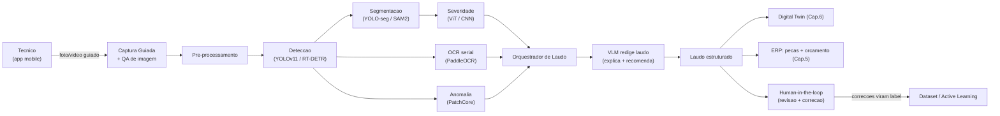
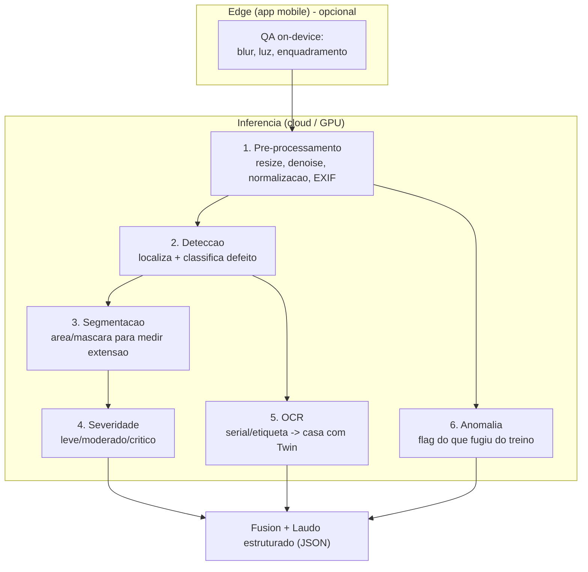
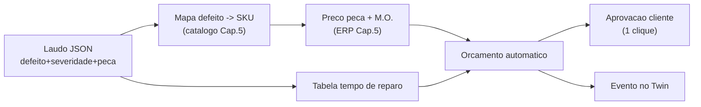
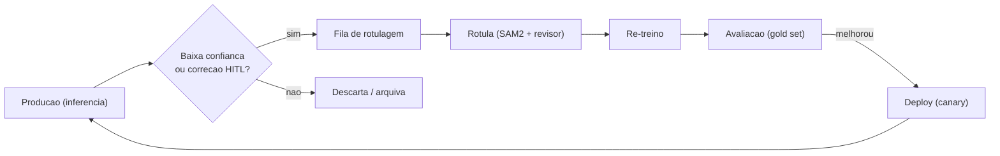
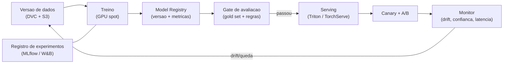

# Capitulo 8 — Computer Vision para Inspecao

> **Escopo:** Este capitulo especifica o **modulo de Computer Vision (CV) para inspecao** da AeroCortex (nome de trabalho, a validar): a IA de visao que recebe **fotos e frames de video** enviados pelo tecnico (via app mobile ou upload web) e **reconhece automaticamente** defeitos em drones agricolas — rachaduras, trincas, oxidacao, parafusos frouxos, cabos danificados, desgaste de helices, vazamentos, residuos quimicos, corrosao, umidade, superaquecimento, pecas quebradas, componentes ausentes, deformacoes, danos estruturais, amassados, desgaste de conectores, componentes queimados, defeitos em placas eletronicas (PCB), soldas frias, oxidacao em PCB, e o estado de sensores, antenas, bombas, mangueiras e reservatorios. A partir da deteccao, a IA **gera laudo, explica o problema, calcula gravidade, informa risco, estima custo e tempo, sugere reparo, lista pecas e gera orcamento automatico** ligado ao ERP/catalogo (Cap. 5) e ao Digital Twin (Cap. 6). Definimos o pipeline completo (pre-processamento -> deteccao -> segmentacao -> severidade -> OCR), a comparacao de arquiteturas, a estrategia de dataset/rotulagem, active learning, human-in-the-loop, augmentation, classes raras, metricas e MLOps de visao.
>
> **Aviso metodologico:** Custos sao **ESTIMATIVAS** de trabalho (dimensionamento bottom-up de esforco de engenharia + GPU/nuvem x precos de lista, com desconto de committed-use). **Cambio de trabalho:** US$ 1,00 = R$ 5,40. Todo valor deve ser validado com **[VALIDAR]** cotacao real (AWS/GCP Pricing, folha de custo de time, cotacao de rotulagem terceirizada) antes de decisao de orcamento. Este capitulo herda decisoes dos Caps. 4 (S3, pgvector, event-driven), 5 (catalogo de pecas/ERP) e 6 (Digital Twin como destino do laudo).

---

## 8.1 Sumario Executivo do Capitulo

O modulo de CV e o **diferencial sensorial** da AeroCortex: transforma o celular do tecnico em um **inspetor especialista assistido por IA**, padronizando um processo hoje 100% subjetivo (o olho e a experiencia do tecnico). O ganho de negocio e triplo — **velocidade** (laudo em segundos, nao horas), **consistencia** (mesmo criterio de severidade para toda a rede) e **monetizacao** (orcamento automatico ligado ao catalogo aumenta conversao de reparo e venda de pecas).

**Decisao mestra:** adotamos um **pipeline multi-estagio hibrido** — nao um unico modelo "faz-tudo". Cada estagio usa a arquitetura de melhor custo-beneficio: **YOLOv11** para deteccao (com **YOLOv11-seg** cobrindo tambem a segmentacao de instancia no MVP), **RT-DETR** como upgrade de precisao no GA, **SAM 2** para rotulagem assistida e mascaras finas de defeitos difusos (corrosao, umidade, residuo), **ViT/ConvNeXt** para classificacao de severidade, **PaddleOCR/TrOCR** para leitura de seriais, **modelos de deteccao de anomalia (PatchCore/EfficientAD)** para classes raras e defeitos nunca vistos, e um **VLM (Claude com visao)** para redigir o laudo em linguagem natural e fazer deteccao open-vocabulary de cauda longa. A orquestracao gera o laudo estruturado que abastece Twin, ERP e o orcamento.

**Custo de construcao estimado:** **~R$ 620 mil - R$ 1,15 mi (US$ 115 mil - US$ 213 mil)** ao longo de MVP+GA, mais **~R$ 4-14 mil/mes** de infra de inferencia (GPU) escalavel. **Prioridade P0** para o subconjunto visual de maior valor (helices, estrutura, bomba/mangueira/reservatorio, conectores) e **P1** para PCB/microdefeitos e OCR robusto. Fator critico de sucesso: **dados rotulados** — a arquitetura e commodity, o dataset proprietario e o moat.

---

## 8.2 Papel do CV na Plataforma e Fluxo de Valor

O CV nao vive isolado: ele **le** do catalogo de pecas (para mapear defeito -> peca), **escreve** no Twin (evento "laudo emitido") e **dispara** o orcamento no ERP. O loop de correcao do tecnico (HITL) realimenta o dataset — cada inspecao melhora o modelo.

---

## 8.3 Taxonomia de Defeitos — O Que a IA Reconhece

Organizamos os ~25 defeitos-alvo em **grupos por tecnica de deteccao dominante**, porque isso define qual modelo resolve cada um e o custo de rotulagem.

| Grupo | Defeitos | Tecnica dominante | Dificuldade CV | Dado necessario |
|---|---|---|---|---|
| **Estrutural macro** | rachaduras, trincas, quebras, deformacoes, amassados, danos estruturais, componentes ausentes | Deteccao + segmentacao (bbox/mask) | 2-3 | Fotos rotuladas por regiao |
| **Superficie/quimico** | oxidacao, corrosao, residuo quimico, umidade, vazamento | Segmentacao semantica (area difusa) + cor/textura | 3-4 | Mascaras + variacao de iluminacao |
| **Helices/desgaste** | desgaste de helice, laminas lascadas, empenamento | Deteccao + classificacao de severidade | 2-3 | Fotos padronizadas da helice |
| **Fixacao/conexao** | parafusos frouxos/faltando, cabos danificados, desgaste de conectores | Deteccao fina (objeto pequeno) + estado | 4 | Close-ups anotados |
| **Termico** | superaquecimento, componentes queimados | Classificacao (marca de queima) + termografia opcional | 3 | RGB + (opcional) camera termica |
| **PCB/eletronica** | soldas frias, oxidacao em PCB, trilhas queimadas, capacitor estufado | Deteccao micro + anomalia | 5 | Macro-fotos de alta resolucao |
| **Hidraulico/fluidico** | bomba, mangueiras (rachadura/ressecamento), reservatorio (trinca/vazamento) | Deteccao + segmentacao de vazamento | 3 | Fotos + video de operacao |
| **Sensores/antenas** | dano, sujeira, obstrucao, desalinhamento | Deteccao + presenca/ausencia | 3 | Fotos por posicao conhecida |

**Decisao:** priorizar no MVP os grupos **Estrutural, Helices, Hidraulico e Fixacao** (alto volume de inspecao, defeitos visiveis, ROI rapido) e deixar **PCB (dificuldade 5)** e **termografia** para GA/Scale — exigem hardware/macro e dataset mais caro.

---

## 8.4 Pipeline de Visao — Arquitetura End-to-End

O pipeline e **modular e assincrono**: a foto entra por fila (Cap. 4), passa por estagios independentes e versionaveis. Cada estagio pode rodar em modelo diferente e ser atualizado sem quebrar os demais.

**Por que multi-estagio e nao um modelo unico?** Um detector unico "end-to-end" seria mais simples, mas: (a) severidade exige raciocinio de area/textura que bbox nao captura; (b) OCR e problema separado; (c) classes raras precisam de anomalia nao-supervisionada; (d) modularidade permite atualizar so a peca fraca. O custo e latencia maior (~0,8-2,5 s/imagem em GPU) — aceitavel para inspecao assincrona.

---

## 8.5 Pre-processamento e Captura Guiada

A **maior fonte de erro em CV de campo e a qualidade da foto** (borrao, sombra, angulo, distancia). Investir em captura guiada tem ROI maior que trocar de modelo.

- **QA on-device (edge):** detector de blur (variancia de Laplaciano), checagem de luminancia e de enquadramento — o app so aceita a foto se passar; senao instrui "aproxime", "mais luz", "estabilize".
- **Overlay de guia:** silhueta/mascara na tela por tipo de peca (ex.: contorno da helice, do reservatorio) — padroniza angulo e escala, o que reduz drasticamente o esforco de treino.
- **Pre-processamento cloud:** correcao de orientacao via EXIF, resize para o input do modelo (ex.: 640/1024 px), denoise leve, normalizacao de cor/brilho (importante para oxidacao/umidade), e **tiling** para imagens de PCB de alta resolucao (recorta em blocos para nao perder microdefeito).
- **Escala fisica:** quando ha marcador/dimensao conhecida (ou EXIF de distancia), converter pixels em mm para medir tamanho real da rachadura — insumo direto da severidade.

---

## 8.6 Estagio de Deteccao — Comparacao de Arquiteturas

Deteccao localiza e classifica os defeitos. Comparamos as principais familias considerando **precisao, velocidade, facilidade de treino, licenca e maturidade de tooling**.

| Arquitetura | mAP tipico* | Velocidade (GPU) | Objetos pequenos | Licenca | Tooling/Comunidade | Melhor uso |
|---|---|---|---|---|---|---|
| **YOLOv8** | Alta | Muito rapida | Boa | AGPL-3.0 / comercial paga | Excelente (Ultralytics) | Baseline maduro |
| **YOLOv11** | Alta+ | Muito rapida | Boa+ | AGPL-3.0 / comercial paga | Excelente | **Escolha MVP** |
| **RT-DETR** | Alta++ | Rapida | Muito boa | Apache-2.0 (impl. varia) | Boa e crescente | Upgrade precisao GA |
| **RF-DETR** | Alta++ | Rapida | Muito boa | Apache-2.0 | Boa (Roboflow) | Alternativa DETR aberta |
| **Faster R-CNN** | Media-Alta | Lenta | Boa | BSD/Apache | Madura (Detectron2) | Referencia academica |
| **Grounding DINO** | Open-vocab | Lenta | Media | Apache-2.0 | Boa | Zero-shot / cauda longa |

*mAP "tipico" e qualitativo/comparativo — o mAP real depende do **nosso** dataset e sera medido (secao 8.14). Nao ha numero de mercado confiavel para o dominio "drone agricola". **[VALIDAR]** com benchmark interno.

**Decisao e justificativa:**
- **MVP -> YOLOv11 (via Ultralytics), variante `-seg`.** Motivos: melhor razao precisao/velocidade, tooling de treino/export/deploy sem igual, roda em GPU barata e ate em edge, e a versao `-seg` **entrega deteccao + segmentacao no mesmo modelo**, economizando um estagio. Ponto de atencao: **licenca AGPL-3.0** — como a AeroCortex e SaaS, AGPL pode obrigar disponibilizar codigo; por isso orcamos a **licenca comercial Ultralytics** (custo previsivel) e mantemos RT-DETR/RF-DETR (Apache-2.0) como plano B sem amarra de licenca. **[VALIDAR]** com juridico.
- **GA -> RT-DETR** onde precisao marginal justificar (ex.: rachadura fina em estrutura critica): transformers de deteccao lidam melhor com contexto e reduzem falsos positivos, ao custo de treino mais caro.
- **Cauda longa -> Grounding DINO / VLM open-vocabulary:** para defeitos raros sem dado suficiente, deteccao por texto ("localize corrosao no conector") complementa ate acumularmos labels.

---

## 8.7 Estagio de Segmentacao

Segmentacao delimita a **area** do defeito (nao so a caixa), essencial para **medir extensao** (ex.: % da helice desgastada, area de corrosao) — insumo direto de severidade e custo.

| Abordagem | Tipo | Precisao de borda | Custo treino | Uso na AeroCortex |
|---|---|---|---|---|
| **YOLOv11-seg** | Instancia (supervis.) | Boa | Baixo | **MVP** — mascara junto da deteccao |
| **Mask R-CNN (Detectron2)** | Instancia | Muito boa | Alto | Fallback de alta fidelidade |
| **SAM 2 (Meta)** | Promptable/zero-shot | Excelente | Zero (pre-treinado) | **Rotulagem assistida** + defeitos difusos |
| **SegFormer/DeepLabv3+** | Semantica | Muito boa | Medio | Areas difusas: corrosao, umidade, residuo |

**Decisao:** **YOLOv11-seg** para mascaras de instancia no MVP (unificado com deteccao). **SAM 2** entra em dois papeis de altissimo valor: (1) **acelera a rotulagem** — o rotulador clica, o SAM gera a mascara (reducao estimada de **40-70%** no tempo de anotacao **[VALIDAR]**); (2) segmenta **areas difusas** (corrosao/umidade/vazamento) onde bbox nao serve. Para essas areas continuas, avaliar **SegFormer** (semantica) no GA.

---

## 8.8 Estagio de Classificacao de Severidade

Depois de localizar/segmentar, classificamos a **gravidade** em `leve | moderado | critico` (e um score continuo 0-100). Isso e o que converte "achei uma trinca" em "risco de falha em voo".

| Modelo | Acuracia relativa | Custo inferencia | Dado necessario | Recomendacao |
|---|---|---|---|---|
| **CNN (EfficientNet-B0/ConvNeXt-Tiny)** | Alta | Baixo | Medio | **MVP** — leve, roda barato |
| **ViT (Vision Transformer)** | Alta+ | Medio-alto | Alto (precisa mais dado) | GA, com dataset maduro |
| **DINOv2 (features) + head linear** | Alta | Baixo (features prontas) | **Baixo** (few-shot) | **Classes raras / arranque frio** |

**Decisao:** **ConvNeXt-Tiny / EfficientNet** no MVP (robusto com pouco dado, barato). **DINOv2 como extrator de features** e a jogada mais inteligente para o inicio: embeddings pre-treinados de altissima qualidade permitem um classificador leve com **poucas amostras por classe** — ideal enquanto o dataset e pequeno. **ViT completo** no GA, quando houver volume. A severidade nao e so o modelo: combinamos a **saida do CNN** com **regras deterministicas** (tamanho medido da trinca em mm, % de area corroida, localizacao em componente critico vindo do Twin) num **score hibrido** auditavel — indispensavel para seguranca e para explicar o laudo.

---

## 8.9 Estagio de OCR de Seriais

Ler o **serial/etiqueta** casa a foto com o **Digital Twin correto** automaticamente (sem digitacao) e comprova procedencia da peca.

| Engine | Precisao | Idioma/alfanumerico | Licenca | Recomendacao |
|---|---|---|---|---|
| **PaddleOCR** | Muito boa | Excelente (alfanumerico) | Apache-2.0 | **Escolha** — robusto e livre |
| **TrOCR (transformer)** | Muito boa | Boa (texto denso) | MIT | Casos dificeis/manuscrito |
| **EasyOCR** | Boa | Boa | Apache-2.0 | Prototipo rapido |
| **Tesseract** | Media | Media | Apache-2.0 | Fallback offline |
| **VLM (visao)** | Boa+ (contexto) | Excelente | API paga | Etiquetas danificadas/anguladas |

**Decisao:** **PaddleOCR** como padrao (livre, forte em alfanumerico de etiqueta), com **fallback para VLM** quando a etiqueta esta danificada/oxidada/angulada — o VLM le com contexto ("serial do modelo T50 tem formato X"). Pipeline: deteccao localiza a etiqueta -> recorte -> OCR -> validacao por regex/checksum do formato DJI -> match no Twin.

---

## 8.10 Do Defeito ao Laudo e Orcamento Automatico

Aqui o CV vira **dinheiro**. O orquestrador funde as saidas dos estagios num **laudo estruturado (JSON)** e um **VLM** o transforma em texto tecnico legivel + recomendacao. O laudo dispara o orcamento no ERP.

**Anatomia do laudo (JSON -> ERP + Twin):**

| Campo | Origem | Exemplo |
|---|---|---|
| `defeito` | Deteccao/classificacao | "trinca em braco do motor 3" |
| `localizacao` | Deteccao + guia de captura | "braco M3, face superior" |
| `severidade` + `score` | Severidade hibrida | "critico" / 88 |
| `extensao_medida` | Segmentacao + escala | "42 mm" |
| `risco` | Regras + Twin (horas/criticidade) | "risco de falha estrutural em voo" |
| `causa_provavel` | VLM + base de conhecimento | "fadiga por vibracao / impacto" |
| `pecas_sugeridas[]` | Mapa defeito->SKU (catalogo Cap.5) | ["braco M3", "parafusos"] |
| `custo_estimado` | Catalogo + tabela de M.O. | "R$ 1.240 (peca) + R$ 380 (M.O.)" |
| `tempo_estimado` | Tabela de tempo por reparo | "2,5 h" |
| `reparo_sugerido` | Base de procedimentos | "substituir braco, torquear 3,2 Nm" |
| `confianca` | Score dos modelos | 0,91 |
| `evidencia` | Imagem + heatmap/mask | link S3 |

**Decisao:** o **VLM (Claude com visao) e usado para redigir/explicar, nao para decidir severidade critica sozinho.** A severidade critica passa pelo score hibrido + regras (auditavel) e por **confirmacao humana obrigatoria acima de um limiar de risco** — questao de seguranca e responsabilidade civil. Confianca baixa -> laudo entra como "sugestao" para revisao, nunca como orcamento auto-aprovado. Todo orcamento gerado registra a versao do modelo e a evidencia (rastreabilidade).

---

## 8.11 Estrategia de Dataset e Rotulagem

**O dataset e o moat.** Nenhum dataset publico cobre "drone DJI Agras com corrosao/trinca" — teremos que construi-lo. Estrategia em camadas:

1. **Bootstrap (frio):** coleta interna de fotos em oficinas parceiras + fotos historicas + defeitos induzidos (fotografar pecas danificadas descartadas) + geracao sintetica leve. Meta MVP: **~3.000-8.000 imagens rotuladas [VALIDAR]** cobrindo os grupos prioritarios.
2. **Crescimento (producao):** cada inspecao real vira dado candidato (com consentimento/LGPD, Cap. de seguranca). O HITL do tecnico gera labels "de graca".
3. **Escala:** 50k+ imagens, curadas por active learning.

| Estrategia de rotulagem | Custo | Qualidade | Velocidade | Uso |
|---|---|---|---|---|
| **Time interno especialista** | Alto | Muito alta | Baixa | Gold set / classes criticas |
| **BPO/terceirizado (com guia)** | Medio | Media-alta | Alta | Volume geral |
| **Rotulagem assistida por SAM 2** | Baixo | Alta | Muito alta | **Padrao** (mascaras) |
| **Auto-label + revisao (modelo atual)** | Muito baixo | Media | Muito alta | Pos-MVP (active learning) |

**Decisao:** **rotulagem assistida por SAM 2 + revisao por especialista de manutencao de drone**, com um **gold set** pequeno (500-1.000 imagens) rotulado em dupla-cega pelo time interno para servir de referencia de qualidade e teste. Ferramenta: **CVOLTs open-source (ex.: CVAT/Label Studio)** self-hosted (dado sensivel, LGPD). Guia de anotacao versionado e treinamento dos rotuladores sao mandatorios — inconsistencia de label e a causa #1 de modelo ruim.

---

## 8.12 Active Learning e Human-in-the-Loop (HITL)

- **HITL:** todo laudo mostra ao tecnico a deteccao; ele **confirma/corrige** (arrasta bbox, muda classe/severidade). A correcao (a) melhora o laudo daquele cliente na hora e (b) vira label de altissimo valor.
- **Active learning:** em vez de rotular tudo, priorizamos rotular o que o modelo mais erra/tem incerteza:
  - **Uncertainty sampling** (baixa confianca), **disagreement** (modelos discordam), **diversity** (embeddings distantes via DINOv2), e **flags de anomalia** (secao 8.13).
- **Loop:** producao -> flag de incerteza/correcao HITL -> fila de rotulagem -> re-treino periodico -> A/B do novo modelo -> promocao. Estimativa: reduz custo de rotulagem para o mesmo ganho de mAP em **~50-70% [VALIDAR]** vs rotular aleatorio.

---

## 8.13 Aumento de Dados e Classes Raras

**Data augmentation** (barato, alto impacto para poucos dados):
- **Geometrico:** flip, rotacao, escala, crop, perspectiva (simula angulos do tecnico).
- **Fotometrico:** brilho, contraste, matiz, ruido, blur, sombra sintetica, simulacao de sujeira/poeira/pulverizacao (dominio agricola!).
- **Composicao:** **Mosaic/MixUp/CutMix/Copy-Paste** — cola defeitos raros (corrosao, componente queimado) em fundos variados: multiplica exemplos de classes raras sem novas fotos.
- **Sintetico:** renderizacao 3D (Blender) de pecas com defeitos parametrizados e **modelos generativos (difusao) para inpainting** de defeitos em pecas boas — util para PCB e defeitos perigosos de coletar. Usar com cautela (gap de dominio) e sempre validar em dado real.

**Classes raras / cauda longa** (o problema mais dificil — muitos defeitos sao raros mas criticos):

| Tecnica | Como ajuda | Prioridade |
|---|---|---|
| **Deteccao de anomalia nao-supervisionada** (PatchCore, PaDiM, EfficientAD) | Treina so com pecas **boas**; flag do que "foge do normal" mesmo sem nunca ter visto o defeito | **Alta** — rede de seguranca para o desconhecido |
| **Few-shot com DINOv2** | Classifica com poucas amostras via features fortes | Alta |
| **Copy-Paste augmentation** | Multiplica raras artificialmente | Alta |
| **Loss ponderada / focal loss** | Corrige desbalanceamento de classe | Media |
| **Open-vocabulary (Grounding DINO/VLM)** | Detecta por texto sem treino | Media |
| **Oversampling + coleta dirigida** | Prioriza coletar as raras | Media |

**Decisao:** combinar **PatchCore/EfficientAD (anomalia) como camada de seguranca** — garante que um defeito nunca-visto ainda seja **sinalizado para revisao humana** ("algo esta estranho aqui"), evitando falso negativo perigoso — com **Copy-Paste + DINOv2 few-shot** para acelerar as classes raras rumo a supervisao plena.

---

## 8.14 Metricas de Avaliacao

Medir bem e o que separa demo de produto. Metricas por estagio, com **alvos por fase** (a validar contra o dataset real).

| Metrica | Estagio | O que mede | Alvo MVP | Alvo GA |
|---|---|---|---|---|
| **mAP@0.5 / mAP@0.5:0.95** | Deteccao | Precisao media de localizacao+classe | mAP@0.5 >= 0,70 | >= 0,85 |
| **IoU / Dice** | Segmentacao | Sobreposicao mascara vs verdade | IoU >= 0,65 | >= 0,80 |
| **F1 / Precision / Recall** | Classificacao/severidade | Equilibrio erro | F1 >= 0,80 | >= 0,90 |
| **Matriz de confusao** | Todos | Onde confunde (ex.: oxidacao x residuo) | Analisada por classe | idem |
| **Recall de defeito critico** | Severidade | **Falso negativo critico** (o pior erro) | **>= 0,95** | **>= 0,98** |
| **CER (Character Error Rate)** | OCR serial | Erro de leitura de serial | <= 5% | <= 2% |
| **Latencia p95 / imagem** | Pipeline | Experiencia | <= 3,0 s | <= 1,5 s |
| **AUROC** | Anomalia | Separacao normal x anomalo | >= 0,90 | >= 0,95 |

**Principio de seguranca:** para defeito critico, **recall > precisao** — preferimos um falso alarme (revisao humana descarta) a deixar passar uma trinca estrutural. Otimizamos o limiar de decisao por classe conforme o **custo do erro**, nao por acuracia global. Reportamos **por classe** (nao so agregado) para nao esconder falha em classe rara critica. Todo modelo tem um **gold set congelado** de teste que nunca entra no treino.

---

## 8.15 MLOps de Visao

Pipeline reprodutivel do dado ao deploy, integrado a stack do Cap. 4.

| Componente | Escolha | Justificativa |
|---|---|---|
| **Versao de dados** | DVC + S3 | Rastreia qual dataset gerou qual modelo (auditoria/reproducao) |
| **Experimentos** | MLflow (self-host) ou W&B | Comparar runs, hiperparametros, metricas |
| **Model Registry** | MLflow Registry | Estagios dev->staging->prod, rollback |
| **Serving** | NVIDIA Triton | Multi-modelo, batching dinamico, GPU eficiente; suporta TensorRT/ONNX |
| **Otimizacao** | ONNX + TensorRT / quantizacao INT8 | 2-4x throughput, custo menor de GPU |
| **Edge (futuro)** | TensorRT / CoreML / TFLite | Pre-triagem no app offline |
| **Monitoramento** | Prometheus/Grafana (Cap.4) + drift de embedding | Detecta degradacao antes do cliente reclamar |
| **CI/CD ML** | GitHub Actions + gate de metricas | So promove modelo que **bate o gold set** |

**Decisoes:** **Triton + TensorRT** pela eficiencia de GPU (reduz custo de inferencia, o maior OPEX do modulo). **Treino em GPU spot** (economia de 60-80% **[VALIDAR]**). **Gate automatico:** nenhum modelo vai a producao sem superar o gold set e sem regressao em nenhuma classe critica. **Monitoramento de drift** (distribuicao de imagens muda com estacao, cultura, modelo de drone) dispara re-treino. **Human-in-the-loop e parte do MLOps**, nao um extra.

---

## 8.16 Custos, Cronograma, Riscos e Prioridade

**Custo de construcao (ESTIMATIVA de trabalho — [VALIDAR]):**

| Bloco | Esforco | Custo R$ | Custo US$ | Fase |
|---|---|---|---|---|
| Coleta + rotulagem dataset MVP | 3-5 meses (BPO+interno) | R$ 120k-260k | US$ 22k-48k | MVP |
| Pipeline deteccao+seg+severidade | 2 eng. CV x 4 meses | R$ 180k-300k | US$ 33k-56k | MVP |
| OCR + orquestrador de laudo + ERP | 1,5 eng. x 3 meses | R$ 90k-150k | US$ 17k-28k | MVP |
| MLOps (Triton, DVC, registry, CI) | 1 eng. MLOps x 3 meses | R$ 80k-140k | US$ 15k-26k | MVP/GA |
| Anomalia + classes raras + PCB | 2 eng. x 4 meses | R$ 130k-260k | US$ 24k-48k | GA |
| Licenca Ultralytics comercial | anual | R$ 20k-40k | US$ 3,7k-7,4k | MVP |
| **Total construcao** | — | **R$ 620k-1,15M** | **US$ 115k-213k** | MVP+GA |
| **Infra inferencia (GPU)** | por mes | R$ 4k-14k/mes | US$ 0,7k-2,6k/mes | escala com uso |

**Riscos e mitigacao:**

| Risco | Prob. | Impacto | Mitigacao |
|---|---|---|---|
| Dataset insuficiente / classes raras | Alta | Alto | Active learning, anomalia, augmentation, coleta em parceiros desde o dia 1 |
| Falso negativo em defeito critico | Media | **Critico** (seguranca) | Recall>=0,95, HITL obrigatorio acima de limiar, camada de anomalia |
| Qualidade de foto ruim no campo | Alta | Medio | Captura guiada + QA on-device |
| Licenca AGPL (Ultralytics) em SaaS | Media | Medio-alto | Licenca comercial ou RT-DETR/RF-DETR (Apache) |
| Custo de GPU escala mal | Media | Medio | TensorRT/quantizacao, batching, spot, edge pre-triagem |
| Drift (nova cultura/modelo drone) | Media | Medio | Monitoramento + re-treino agendado |
| LGPD (fotos/local/serial) | Media | Alto | Consentimento, anonimizacao de fundo, dado self-host (Cap. seguranca) |
| Responsabilidade por laudo errado | Media | Alto | Laudo = "sugestao"; aprovacao humana; rastreabilidade de versao/evidencia |

**Prioridade:** **P0** para pipeline base (deteccao+seg+severidade+OCR+laudo+orcamento) nos grupos de alto valor; **P1** para anomalia/classes raras e OCR robusto; **P2** para PCB/microdefeitos, termografia e edge on-device.

---

## 8.17 Roadmap por Waves (resumo)

- **MVP:** captura guiada + QA; YOLOv11-seg (estrutural, helices, hidraulico, fixacao); ConvNeXt/DINOv2 severidade; PaddleOCR; orquestrador de laudo + orcamento automatico ligado ao ERP/Twin; HITL; dataset v1; MLOps minimo (DVC+MLflow+Triton).
- **GA:** RT-DETR onde precisar; SegFormer para areas difusas; anomalia (EfficientAD) para cauda longa; active learning maduro; ViT severidade; monitoramento de drift; metas de mAP>=0,85.
- **Scale:** PCB/microdefeitos com macro; termografia; edge on-device (TensorRT/TFLite) para pre-triagem offline; auto-label em larga escala.
- **Internacional:** OCR multi-idioma de etiquetas, adaptacao de dominio por regiao/cultura, catalogo de pecas multi-fabricante (XAG, Jacto) no laudo.

> **Nota de fonte:** nomes de arquiteturas/ferramentas (YOLO/Ultralytics, RT-DETR, RF-DETR, SAM 2, ViT, ConvNeXt, DINOv2, PatchCore/PaDiM/EfficientAD, PaddleOCR/TrOCR, Detectron2, Triton, DVC, MLflow, CVAT/Label Studio) sao projetos reais e amplamente conhecidos; numeros de precisao/custo/tempo aqui sao **ESTIMATIVAS** de trabalho a serem confirmadas por **benchmark interno no dataset da AeroCortex** e por **cotacao real** de nuvem e rotulagem antes de decisao de orcamento.
