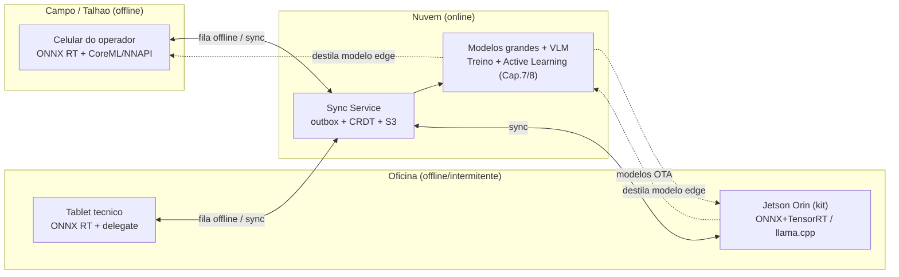
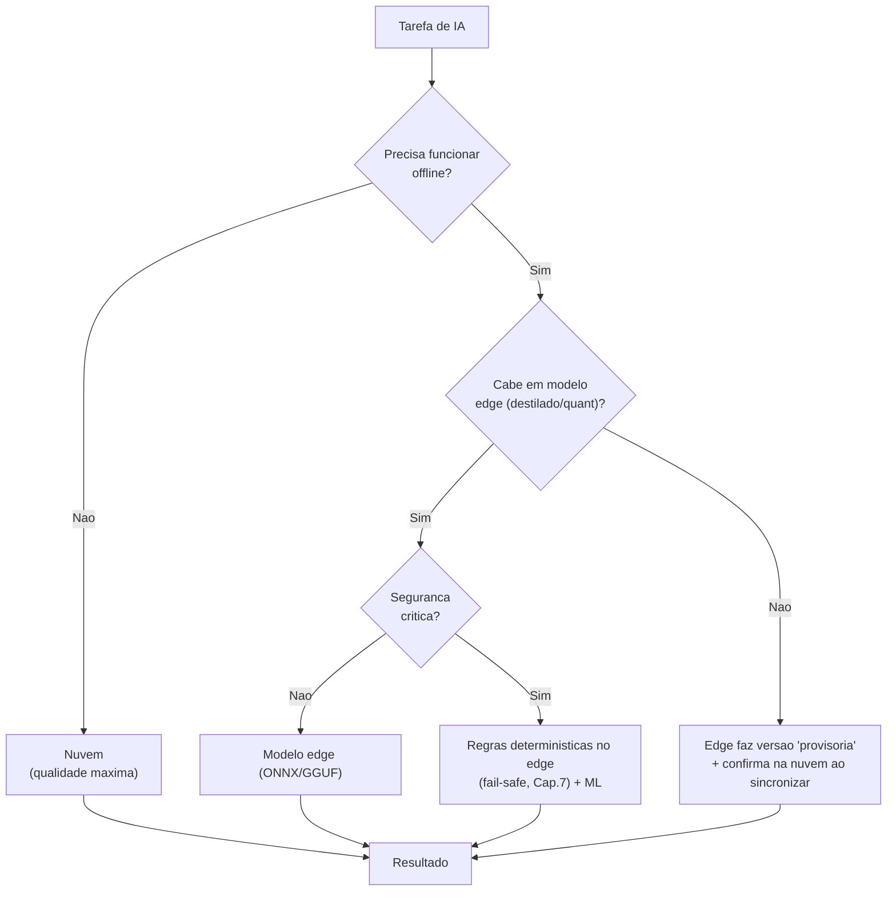
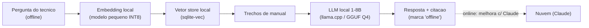
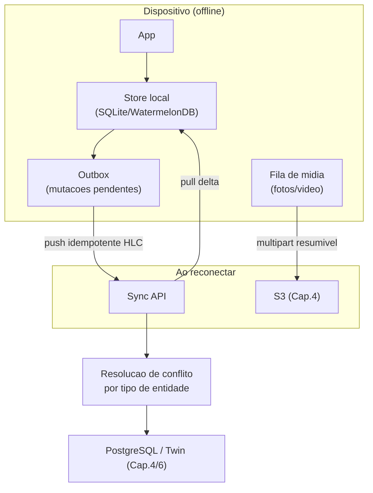
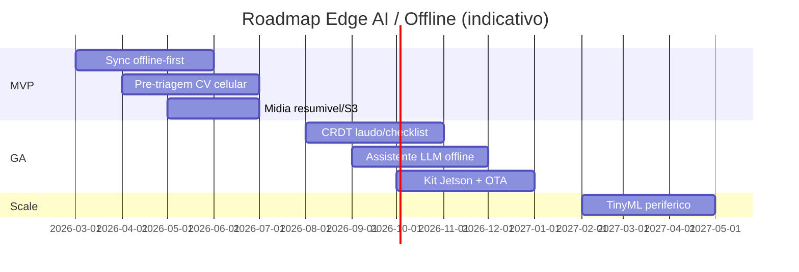

# Capitulo 9 — IA Offline / Edge AI

> **Escopo:** Este capitulo especifica a camada de **IA embarcada (Edge AI) e operacao offline-first** da AeroCortex (nome de trabalho, a validar): como a plataforma continua **inteligente e util sem internet** — no meio do talhao, dentro de um galpao de zinco, numa oficina rural com 3G intermitente. Definimos (1) **por que** offline-first e requisito, nao luxo, no agro brasileiro; (2) a **comparacao tecnica de runtimes de inferencia edge** (ONNX Runtime, TensorFlow Lite/LiteRT, OpenVINO, ExecuTorch, MLC LLM, llama.cpp/GGUF, TinyML) e de **hardware** (Jetson Orin/Nano, Raspberry Pi, Intel NPU, Apple Neural Engine, Snapdragon AI); (3) as **tecnicas de compressao** — quantizacao INT8/INT4, destilacao, pruning; (4) a **arquitetura hibrida** que decide o que roda no dispositivo (CV leve, assistente, deteccao rapida) versus nuvem (modelos grandes, treino); (5) a **sincronizacao automatica offline-first** — fila, outbox pattern, CRDTs, resolucao de conflitos e sync de midia/laudos quando a rede volta; e (6) uma **stack de referencia por classe de dispositivo** (celular, tablet, Jetson na oficina), com custo, dificuldade, risco, cronograma e prioridade.
>
> **Aviso metodologico:** Custos sao **ESTIMATIVAS** de trabalho (dimensionamento bottom-up de esforco de engenharia a custo/hora blended **~R$ 200/h** para perfil senior [VALIDAR] com folha real, + precos de lista de hardware/nuvem). **Cambio de trabalho:** US$ 1,00 = R$ 5,40 [VALIDAR cotacao do dia]. Este capitulo herda decisoes dos Caps. 4 (event-driven, S3, PostgreSQL, Kafka/Redis), 6 (Digital Twin como fonte/destino de estado), 7 (IA Preditiva) e 8 (Computer Vision — a "pre-triagem edge" prometida no Cap. 8 e detalhada aqui). Nomes de projetos/ferramentas citados sao reais e amplamente conhecidos; numeros de latencia/tamanho/custo sao **ESTIMATIVAS** a validar por **benchmark interno** no hardware-alvo.

---

## 9.1 Sumario Executivo do Capitulo

A conectividade e a **premissa mais fragil** de qualquer plataforma agro. O drone opera onde a fibra nao chega; o tecnico inspeciona em galpao metalico que bloqueia sinal; a oficina fica na estrada de terra. Se a AeroCortex so funciona online, ela **falha exatamente no momento de maior valor**. Por isso adotamos **offline-first como principio de arquitetura, nao como recurso opcional**: o app e utilizavel por padrao sem rede, e a nuvem e um acelerador (modelos grandes, treino, consolidacao), nao um pre-requisito de operacao.

**Decisao mestra:** arquitetura **hibrida em tres niveis de inferencia** — (A) **on-device** para tarefas de baixa latencia e alto valor offline: QA de imagem, pre-triagem de defeitos (CV leve), leitura de serial/OCR, regras de seguranca LiPo (deterministicas, do Cap. 7) e um **assistente LLM pequeno** de consulta a manuais; (B) **edge de oficina (Jetson)** para inferencia CV pesada e assistente maior quando ha um mini-servidor local; (C) **nuvem** para os modelos grandes, ensembles, treino, active learning e o VLM que redige laudo (Cap. 8). A regra de roteamento e simples: **se ha rede boa, usa nuvem (melhor qualidade); se nao ha, usa edge com degradacao graciosa e marca o resultado como "provisorio — a confirmar".**

**Decisao de runtime:** padronizamos **ONNX Runtime** como *runtime unificado* de CV/tabular no edge (portabilidade Android/iOS/Linux/Jetson, mesmo modelo em toda a frota de dispositivos), com **delegates nativos** por plataforma (CoreML/ANE no iOS, NNAPI/QNN no Android/Snapdragon, **TensorRT** no Jetson conforme Cap. 8, OpenVINO em edge x86/Intel). Para o **assistente LLM offline**, **llama.cpp + GGUF** (CPU/GPU, maduro, roda ate em tablet e Jetson) como padrao, e **MLC LLM** onde quisermos explorar GPU movel agressivamente. Compressao padrao: **INT8** para CV (quantizacao pos-treino com calibracao) e **INT4** (GGUF Q4_K_M / AWQ) para LLM, com **destilacao** para criar as versoes "edge" dos modelos de nuvem.

**Decisao de sincronizacao:** **outbox pattern + fila local duravel** (SQLite/WatermelonDB no mobile) com **sync incremental idempotente**; **CRDTs (Automerge/Yjs)** apenas para os poucos documentos genuinamente colaborativos/mergeaveis (rascunho de laudo, checklist de inspecao, anotacoes), e **last-write-wins com relogio hibrido (HLC)** para o resto; midia (fotos/video) via **upload multipart resumivel para o S3** (Cap. 4), content-addressed para dedup.

**Investimento estimado:** **~R$ 480 mil - R$ 920 mil (US$ 89 mil - US$ 170 mil)** ao longo de MVP -> GA -> Scale, mais **hardware de kit-oficina** (Jetson) a **~R$ 3,5k-9k por unidade**. **Prioridade P0** para o motor de sincronizacao offline-first e a pre-triagem CV no celular (destravam a operacao de campo); **P1** para assistente LLM offline e kit-Jetson; **P2** para TinyML em periféricos.

---

## 9.2 Por Que Offline-First e Requisito (Contexto)

O Brasil rural tem cobertura celular **desigual e instavel**: talhoes fora de cobertura, galpoes metalicos que atenuam sinal, latencia alta e franquias de dados caras via satelite. Uma inspecao que exige upload de 40 fotos de 8 MP antes de dar qualquer feedback e **inutilizavel** nessas condicoes. O offline-first inverte a logica: **o valor e entregue localmente e imediatamente**; a nuvem recebe/melhora depois, de forma assincrona.

| Cenario | Conectividade tipica | Exigencia offline |
|---|---|---|
| Operador no talhao (pre-voo/pos-voo) | Nenhuma a 3G fraco | **Critica** — checklist, semaforo apto/veta, foto |
| Tecnico em oficina rural | 3G/4G intermitente | **Alta** — inspecao guiada, pre-triagem CV, laudo rascunho |
| Kit-oficina com mini-servidor | LAN local, WAN intermitente | **Media** — inferencia pesada local, sync em janela |
| Gestor no escritorio | 4G/fibra estavel | **Baixa** — usa nuvem plena |

**Principio de design:** *"funciona no avião em modo aviao"*. Toda tela critica de operacao/inspecao deve renderizar, capturar e dar um primeiro veredito **sem uma unica chamada de rede**. Rede e otimizacao, nao dependencia.

---

## 9.3 Comparacao de Runtimes de Inferencia Edge

Runtime e o motor que executa o modelo no dispositivo. A escolha define portabilidade, latencia e quais aceleradores (GPU/NPU) sao aproveitados.

| Runtime | Tamanho binario (aprox.) | Latencia relativa | Hardware suportado | Licenca | Casos de uso | Maturidade |
|---|---|---|---|---|---|---|
| **ONNX Runtime** | ~5-15 MB (mobile build) | Muito boa (com EP nativo) | CPU x86/ARM, GPU CUDA, CoreML/ANE, NNAPI, QNN, TensorRT, OpenVINO, DirectML | MIT | CV, tabular (XGBoost via ONNX), NLP encoder — **runtime unificado cross-platform** | Alta |
| **TensorFlow Lite / LiteRT** | ~1-3 MB core | Muito boa (GPU/NNAPI delegate) | ARM CPU, GPU (OpenGL/Vulkan/Metal), NNAPI, Hexagon/QNN, Coral Edge TPU | Apache 2.0 | CV/audio em **Android** e microcontroladores; ecossistema mobile maduro | Alta |
| **OpenVINO** | ~30-100 MB | Excelente em Intel | Intel CPU, iGPU, **NPU (Core Ultra)**, VPU | Apache 2.0 | Edge **x86/Intel** (kit-oficina alternativo, PC industrial) | Alta |
| **ExecuTorch** | ~1-5 MB | Boa (em evolucao) | ARM CPU, CoreML/ANE, Vulkan, Qualcomm, MediaTek | BSD | Deploy de modelos **PyTorch** direto no edge; futuro do stack PyTorch mobile | Media (novo) |
| **llama.cpp** | ~2-10 MB | Boa p/ LLM (CPU/GPU) | CPU x86/ARM (NEON/AVX), CUDA, Metal, Vulkan | MIT | **LLM offline** (assistente, RAG local) via GGUF | Alta |
| **GGUF (formato)** | — (formato de peso) | — | Consumido por llama.cpp/derivados | MIT (spec) | Formato quantizado padrao de LLM edge (Q4/Q5/Q8) | Alta |
| **MLC LLM** | ~10-30 MB | Muito boa em GPU movel | GPU via TVM (Metal/Vulkan/CUDA), WebGPU | Apache 2.0 | **LLM em GPU de celular/tablet** e browser | Media-alta |
| **TinyML (TFLite Micro / uTensor)** | ~KBs-centenas KB | Ultra-baixa (MCU) | Microcontroladores (Cortex-M, ESP32) | Apache/MIT | Sensor/wake-word/anomalia em **periférico** (dock, sensor) | Media |
| **"Edge AI" (guarda-chuva)** | — | — | — | — | Termo abrangente para IA no dispositivo — engloba os acima | — |

**Recomendacao e por que:**
- **ONNX Runtime = padrao unificado de CV/tabular.** Um unico formato (`.onnx`) roda em iOS (delegate CoreML->ANE), Android (NNAPI/QNN), Jetson (TensorRT EP) e x86 (OpenVINO EP). Isso reduz drasticamente o custo de manter modelos: **exportamos uma vez** do treino (Cap. 7/8) e distribuimos para toda a frota heterogenea. Trade-off: em Android puro, o **LiteRT** as vezes extrai mais performance do GPU/NNAPI — por isso o mantemos como **plano B por plataforma**, nao como padrao global.
- **llama.cpp + GGUF = padrao do assistente offline.** E o caminho mais maduro e portavel para LLM local (roda em CPU de tablet ate GPU de Jetson), com quantizacao INT4/INT5 pronta. **MLC LLM** fica como trilha de P&D para espremer GPU movel.
- **OpenVINO** entra **so** se optarmos por kit-oficina x86/Intel (mini-PC com NPU Core Ultra) em vez de Jetson — decisao de hardware (9.5), nao de app.
- **ExecuTorch** e a aposta de futuro (alinha com PyTorch), mas ainda **imaturo** para producao critica em 2026 — monitorar, nao depender.
- **TinyML** so no P2, para periféricos dedicados (ex.: sensor de temperatura de bateria no dock com deteccao de anomalia local).

---

## 9.4 Comparacao de Hardware Edge

| Hardware | Poder de IA (aprox.) | RAM tipica | Consumo | Onde usamos | Runtime ideal | Custo unit. (ESTIMATIVA) |
|---|---|---|---|---|---|---|
| **Jetson Orin Nano / NX** | ~40-100 TOPS (INT8) | 8-16 GB | 7-25 W | **Kit-oficina** (CV pesada, LLM medio) | ONNX+TensorRT, llama.cpp CUDA | R$ 3,5k-9k / US$ 650-1,7k |
| **Jetson AGX Orin** | ~200-275 TOPS | 32-64 GB | 15-60 W | Hub regional / lab | TensorRT, Triton (Cap.8) | R$ 12k-22k / US$ 2,2k-4,1k |
| **Raspberry Pi 5 (+ acelerador)** | CPU only ~ baixo; +Hailo/Coral = ~13-26 TOPS | 4-8 GB | 5-12 W | Kit-oficina economico, gateway sync | ONNX RT / TFLite + delegate | R$ 0,6k-2k / US$ 110-370 |
| **Intel NPU (Core Ultra "Meteor/Lunar Lake")** | ~10-48 TOPS | 16-32 GB (PC) | 15-28 W | Mini-PC de oficina x86 | **OpenVINO** | R$ 4k-9k (mini-PC) / US$ 740-1,7k |
| **Apple Neural Engine (iPhone/iPad)** | ~16-38 TOPS | 6-16 GB | movel | **App iOS** (operador/tecnico premium) | ONNX RT (CoreML EP) / CoreML | (device do usuario) |
| **Snapdragon AI (Android flagship/mid)** | ~10-45 TOPS (Hexagon NPU) | 6-16 GB | movel | **App Android** (maioria do campo) | ONNX RT (QNN) / LiteRT (NNAPI) | (device do usuario) |

**Recomendacao e por que:**
- **Kit-oficina padrao = Jetson Orin Nano** (melhor custo/TOPS/ecossistema CUDA-TensorRT; reaproveita 100% dos modelos ONNX/TensorRT do Cap. 8; roda LLM 3B-8B em INT4). **Raspberry Pi 5 + Hailo-8L** e a **opcao economica** para oficinas pequenas (so pre-triagem, sem LLM local).
- **Mobile:** projetar para o **meio da tabela Android** (Snapdragon mid-range, NPU Hexagon), nao so para o topo — e onde esta a maioria dos operadores. iOS aproveita ANE automaticamente via CoreML EP.
- **Intel NPU/OpenVINO** so se um cliente ja tiver parque de mini-PCs x86 — evitamos introduzir uma terceira stack sem demanda.

---

## 9.5 Compressao de Modelos — Quantizacao, Destilacao, Pruning

Modelos de nuvem sao grandes demais para o edge. Reduzimos com tres tecnicas complementares:

| Tecnica | O que faz | Ganho tipico (ESTIMATIVA) | Custo de acuracia | Quando usar |
|---|---|---|---|---|
| **Quantizacao INT8 (PTQ)** | FP32->INT8 com calibracao | ~4x menor, ~2-4x mais rapido | Baixo (<1-2% mAP) com bom calib set | **Padrao para CV** no edge |
| **Quantizacao INT4** | pesos em 4 bits (GGUF Q4_K_M, AWQ, GPTQ) | ~8x menor que FP16 | Moderado (aceitavel p/ assistente) | **Padrao para LLM** offline |
| **QAT (quant-aware training)** | treina simulando quantizacao | recupera acuracia perdida | ~esforco extra de treino | Se PTQ INT8 cair demais em classe critica |
| **Destilacao (distillation)** | modelo "aluno" pequeno imita "professor" grande | modelo 5-20x menor | Controlado | Criar a **versao edge** dos modelos de nuvem |
| **Pruning estrutural** | remove canais/filtros redundantes | 20-50% menor/rapido | Baixo-moderado | Combinado com quantizacao |

**Politica AeroCortex:** para CV, o pipeline de treino (Cap. 8) produz **duas saidas por modelo** — a versao *cloud* (FP16, precisao maxima) e a versao *edge* (destilada + INT8, exportada em ONNX). Para o **LLM offline**, partimos de modelos abertos pequenos (**~1B-3B para celular, ~7B-8B para Jetson**), quantizados em **GGUF Q4_K_M**. Regra de aceite: a versao edge nao pode perder **recall em classe critica** (defeito/seguranca) acima de limiar definido — se perder, cai para QAT ou o dispositivo delega a decisao para a nuvem quando reconectar.

---

## 9.6 Arquitetura Hibrida — O Que Roda Onde

A decisao "on-device vs nuvem" segue quatro criterios: **latencia exigida, tamanho do modelo, sensibilidade (seguranca), e disponibilidade offline**.

| Capacidade | Onde roda | Modelo/tecnica | Motivo |
|---|---|---|---|
| QA de imagem (blur/luz/enquadramento) | **On-device** (sempre) | CNN minuscula INT8 / heuristica | Feedback instantaneo na captura, zero rede |
| Pre-triagem de defeito (CV leve) | **On-device** | YOLO-nano/small destilado INT8 (ONNX) | Veredito imediato; nuvem confirma depois |
| OCR de serial | **On-device** | detector leve + PaddleOCR-lite | Casar com Twin offline |
| Regras seguranca LiPo | **On-device** (deterministico) | limiares fisicos (Cap.7) | Nunca pode depender de rede — fail-safe |
| Semaforo pre-voo apto/veta | **On-device** | XGBoost->ONNX + regras | Go/no-go no talhao sem sinal |
| Assistente de manual/duvida | **On-device** (fallback) / **Nuvem** (padrao) | LLM 1-3B GGUF local; Claude na nuvem | Consulta offline com RAG local dos manuais |
| Laudo em linguagem natural (redacao) | **Nuvem** (VLM) / rascunho edge | VLM Cap.8; template local offline | Qualidade de redacao exige modelo grande |
| Deteccao fina (PCB, microdefeito) | **Nuvem** ou **Jetson** | modelos pesados | Nao cabe em celular |
| Ensemble/anomalia de cauda longa | **Nuvem** | PatchCore/EfficientAD (Cap.8) | Precisao e dado; batch |
| Treino / Active learning / drift | **Nuvem** (sempre) | pipeline Cap.7/8 | GPU e dado centralizado |

**Regra de ouro da degradacao graciosa:** todo resultado gerado offline por modelo edge nasce com flag `confidence_source = "edge_provisional"`. Ao sincronizar, se houver rede, a nuvem **re-processa** com o modelo grande e **promove/corrige** o resultado, notificando o usuario apenas se houver divergencia material. Isso da o melhor dos dois mundos: **resposta imediata offline + qualidade final online**.

---

## 9.7 Escolha de Modelo por Classe de Dispositivo

| Classe | Hardware-alvo | CV | LLM offline | Runtime | Orcamento de recursos |
|---|---|---|---|---|---|
| **Celular (maioria)** | Snapdragon mid / ANE | YOLO-nano INT8 (~3-8 MB) | Nenhum ou 1B GGUF Q4 (opcional) | ONNX RT + NNAPI/QNN/CoreML | <100 MB modelos, <300 ms/foto |
| **Celular topo / Tablet** | Snapdragon flagship / iPad | YOLO-small INT8, seg leve | 1-3B GGUF Q4 (assistente) | ONNX RT + delegate; llama.cpp | <500 MB, <150 ms/foto |
| **Kit-oficina Jetson** | Orin Nano/NX | YOLO-M/L, seg, anomalia leve | 7-8B GGUF Q4 (assistente pleno) | ONNX+TensorRT; llama.cpp CUDA | GBs; usa TensorRT do Cap.8 |
| **Kit economico** | RPi5 + Hailo/Coral | YOLO-nano/small INT8 | Nenhum | ONNX RT / TFLite + delegate | pre-triagem apenas |
| **Nuvem** | GPU (Cap.4) | pipeline completo Cap.8 | Claude / VLM | Triton/TensorRT | sem restricao edge |

**Decisao:** projetamos o **modelo edge de CV para o pior caso viavel** (celular mid-range) e deixamos os dispositivos melhores rodarem versoes maiores. Um unico *catalogo de modelos versionados* (no S3/registry, Cap. 4/8) serve variantes por *tier* de dispositivo; o app baixa a variante certa no primeiro login e via OTA.

---

## 9.8 Assistente LLM Offline

O assistente (consulta a manuais, procedimento de reparo, interpretacao de codigo de erro) usa **RAG local**: os manuais/procedimentos sao indexados em um **vetor store embarcado** (SQLite + `sqlite-vec` ou index FAISS-lite) no dispositivo; a consulta recupera trechos e um **LLM pequeno** redige a resposta citando a fonte.

**Decisao:** quando **online, o assistente usa Claude** (qualidade, contexto grande, sempre atualizado — Cap. de IA/plataforma). Quando **offline, cai para o LLM local** com aviso claro de que a resposta e "assistida offline" e pode ser confirmada. Modelo local: **1-3B no mobile** (so tablets/celulares fortes), **7-8B no Jetson**. Isso evita a armadilha de tentar rodar LLM grande em celular fraco — melhor **nao ter assistente offline** naquele device do que ter um que trava e da respostas ruins.

---

## 9.9 Sincronizacao Automatica Offline-First

O coracao do offline-first e o **motor de sync**. Principios: (1) o dispositivo e **fonte de verdade local** enquanto offline; (2) escritas sao **idempotentes** e carregam **ID gerado no cliente** (UUID) + **relogio hibrido (HLC)**; (3) **outbox pattern** garante que nada se perde; (4) sync e **incremental e retomavel**.

### Padroes de sincronizacao

| Padrao | Uso na AeroCortex | Por que |
|---|---|---|
| **Outbox pattern** | toda mutacao offline (OS, inspecao, laudo, estoque) | Durabilidade: mutacao persiste local ate confirmada pelo servidor |
| **Fila duravel + retry com backoff** | envio de mutacoes e midia | Rede intermitente; reenvio automatico sem duplicar (idempotencia) |
| **Idempotencia por client-UUID** | criacao de registros | Evita duplicata se o ACK se perdeu |
| **Relogio hibrido (HLC)** | ordenacao de eventos multi-device | Ordena sem depender de relogio perfeito |
| **CRDT (Automerge/Yjs)** | rascunho de laudo, checklist, anotacoes colaborativas | Merge automatico sem perder edicoes concorrentes |
| **Last-Write-Wins + HLC** | campos simples (status, valores escalares) | Simples e suficiente para a maioria dos campos |
| **Upload multipart resumivel + content-hash** | fotos/videos de inspecao | Retoma upload interrompido; dedup por hash |
| **Delta sync (cursor/updated_at)** | pull de catalogo, precos, modelos | Baixa so o que mudou; economiza dados |

### Resolucao de conflitos por tipo de entidade

Nao existe estrategia unica. Definimos por entidade:

| Entidade | Estrategia | Justificativa |
|---|---|---|
| Rascunho de laudo / anotacao | **CRDT (merge)** | Dois tecnicos podem editar; nao pode perder texto |
| Checklist de inspecao | **CRDT (por item)** | Itens independentes, merge campo a campo |
| Status de OS (aberta/fechada) | **LWW + regra de negocio** | Transicoes validas so avancam (nao "reabre" por conflito) |
| Estoque / contagem de peca | **Servidor autoritativo + reconciliacao** | Numero financeiro: conflito vira tarefa de revisao, nunca merge cego |
| Foto/midia | **Append-only (content-hash)** | Midia nunca conflita; so acumula; dedup por hash |
| Resultado de IA (edge provisional) | **Servidor re-processa e promove** | Qualidade final e da nuvem (Sec. 9.6) |

**Decisao:** usar **CRDT so onde ha real concorrencia de edicao de texto/lista** (laudo, checklist, anotacoes) — CRDT em tudo seria over-engineering, custa memoria e complexidade. Para **numeros financeiros/estoque**, conflito **nunca** e resolvido automaticamente por LWW: gera **tarefa de reconciliacao** para um humano, porque errar aqui e erro de dinheiro. Bibliotecas candidatas: **WatermelonDB/RxDB** (store + sync no React Native/mobile), **Automerge** ou **Yjs** (CRDT), tudo sobre **SQLite** local e o backend event-driven do Cap. 4.

---

## 9.10 Distribuicao e Atualizacao de Modelos (OTA) e Governanca

Modelos edge precisam ser **versionados, assinados e atualizaveis** sem republicar o app.

| Aspecto | Decisao | Motivo |
|---|---|---|
| Distribuicao | catalogo de modelos no S3/CDN, download OTA no 1o login e em janela de rede | Nao inflar o binario da loja; atualizar sem release |
| Versionamento | semver por modelo + tier de device; registry (Cap.8) | Rastreabilidade e rollback |
| Assinatura/integridade | hash + assinatura; app valida antes de carregar | Seguranca: impedir modelo adulterado |
| Rollback | manter versao N-1 no device | Se modelo novo degrada, volta na hora |
| Telemetria de inferencia | logar confianca/latencia/divergencia (quando sincroniza) | Alimenta drift/active learning (Cap.7/8) |
| Privacidade (LGPD) | inferencia local nao envia imagem crua ate consentimento/sync; anonimizar | Cap. de seguranca/LGPD |

---

## 9.11 Stack de Referencia Recomendada por Dispositivo

| Dispositivo | Store local | Sync | Runtime IA | Modelos | Assistente |
|---|---|---|---|---|---|
| **Celular Android (maioria)** | WatermelonDB (SQLite) | outbox + delta + multipart S3 | **ONNX RT + NNAPI/QNN** (LiteRT plano B) | YOLO-nano INT8, XGBoost->ONNX, QA-CNN | (opcional 1B) / Claude online |
| **iPhone/iPad** | WatermelonDB (SQLite) | idem | **ONNX RT + CoreML (ANE)** | idem + seg leve em topo | 1-3B GGUF (iPad Pro) / Claude |
| **Tablet tecnico** | RxDB/WatermelonDB | idem + CRDT (laudo/checklist) | ONNX RT + delegate | YOLO-small, OCR-lite | 3B GGUF / Claude |
| **Kit-oficina Jetson Orin** | SQLite/Postgres local | sync como gateway da oficina | **ONNX + TensorRT; llama.cpp CUDA** | YOLO-M/L, seg, anomalia leve | **7-8B GGUF Q4** |
| **Kit economico RPi5** | SQLite | gateway sync | ONNX RT / TFLite + Hailo/Coral | YOLO-nano/small INT8 | — |
| **Nuvem** | PostgreSQL/Twin (Cap.4/6) | autoridade + reconciliacao | Triton/TensorRT (Cap.8) | pipeline completo + VLM | Claude |

**Justificativa da stack unica de runtime:** um so formato de modelo (**ONNX**) + delegates por plataforma minimiza o custo de manutencao numa frota heterogenea; **llama.cpp/GGUF** cobre LLM offline de forma portavel; **WatermelonDB + outbox + CRDT seletivo** e o padrao offline-first mais provado para mobile. Evitamos multiplicar stacks (nao adotar TFLite *e* ONNX *e* ExecuTorch como padroes concorrentes — escolhemos um padrao e planos B pontuais).

---

## 9.12 Custos, Dificuldade e Cronograma

**Custo de construcao (ESTIMATIVA de trabalho — [VALIDAR]):**

| Bloco | Esforco | Custo R$ | Custo US$ | Fase |
|---|---|---|---|---|
| Motor sync offline-first (outbox, fila, delta, idempotencia) | 2 eng. x 3 meses | R$ 130k-210k | US$ 24k-39k | MVP |
| Pre-triagem CV no celular (export ONNX + delegates + QA) | 1,5 eng. x 3 meses | R$ 90k-150k | US$ 17k-28k | MVP |
| Midia resumivel + dedup + S3 pipeline | 1 eng. x 2 meses | R$ 45k-80k | US$ 8k-15k | MVP |
| CRDT (laudo/checklist) + resolucao de conflito | 1 eng. x 2-3 meses | R$ 55k-95k | US$ 10k-18k | GA |
| Assistente LLM offline + RAG local | 1,5 eng. x 3 meses | R$ 90k-150k | US$ 17k-28k | GA |
| Kit-oficina Jetson (integracao TensorRT + provisionamento) | 1 eng. x 2 meses | R$ 45k-90k | US$ 8k-17k | GA |
| OTA de modelos (assinatura, versionamento, rollback) | 1 eng. x 1,5 mes | R$ 35k-70k | US$ 6k-13k | GA |
| TinyML periférico (P&D) | 1 eng. x 2 meses | R$ 45k-90k | US$ 8k-17k | Scale |
| **Total construcao** | — | **R$ 480k-920k** | **US$ 89k-170k** | MVP->Scale |
| **Hardware kit-oficina** | por unidade | R$ 3,5k-9k | US$ 650-1,7k | por cliente |

**Nivel de dificuldade (1-5):** motor de sync **4** (concorrencia, idempotencia, conflitos), CV edge **3**, CRDT **4**, LLM offline **3-4**, OTA **3**, TinyML **4**.

**Cronograma macro:**

---

## 9.13 Riscos e Mitigacao

| Risco | Prob. | Impacto | Mitigacao |
|---|---|---|---|
| Conflitos de sync corrompem dados (estoque/financeiro) | Media | **Alto** | LWW proibido em dado financeiro; reconciliacao humana; idempotencia + HLC |
| Modelo edge perde recall em defeito critico | Media | **Alto (seguranca)** | Aceite por recall minimo; QAT; degradacao graciosa (confirma na nuvem) |
| Fragmentacao de hardware Android (NPU/driver) | Alta | Medio | ONNX RT com fallback CPU; testar em tier mid-range real; LiteRT plano B |
| Modelo grande demais para celular fraco | Alta | Medio | Variantes por tier; desligar assistente offline em device fraco |
| Upload de midia estoura franquia/dados do cliente | Media | Medio | Compressao, WiFi-only opcional, upload em janela, dedup por hash |
| CRDT explode memoria/uso em docs grandes | Baixa-media | Medio | CRDT so em texto/lista pequenos; nao usar como banco geral |
| Modelo OTA adulterado / seguranca | Baixa | Alto | Assinatura + hash + validacao antes de carregar |
| LGPD: imagem crua/local sensivel no device | Media | Alto | Consentimento, inferencia local sem envio ate sync, anonimizacao |
| ExecuTorch/dependencia imatura | Baixa | Medio | Nao adotar como padrao; ONNX/llama.cpp maduros primeiro |
| Custo/logistica do kit Jetson | Media | Medio | Oferecer tier RPi5 economico; kit opcional, nao obrigatorio |

**Prioridade:** **P0** — motor de sync offline-first + pre-triagem CV no celular + midia resumivel (destravam a operacao de campo, o valor central do capitulo). **P1** — CRDT de laudo/checklist, assistente LLM offline, kit-Jetson + OTA. **P2** — TinyML em periféricos e otimizacoes de GPU movel (MLC LLM).

---

## 9.14 Roadmap por Waves (resumo)

- **MVP:** offline-first de fato — store local (WatermelonDB) + outbox + delta sync idempotente + upload de midia resumivel; pre-triagem CV no celular (YOLO-nano INT8 em ONNX RT com delegate nativo); QA de imagem on-device; regras de seguranca LiPo deterministicas offline (Cap. 7); semaforo pre-voo offline.
- **GA:** CRDT (Automerge/Yjs) para laudo/checklist/anotacoes + resolucao de conflito por entidade; assistente LLM offline (1-3B mobile, RAG local sqlite-vec); kit-oficina Jetson Orin (ONNX+TensorRT + llama.cpp 7-8B); OTA de modelos assinado com rollback; telemetria de inferencia realimentando drift/active learning.
- **Scale:** TinyML em periféricos (dock/sensor de bateria); MLC LLM em GPU movel; kit RPi5+Hailo economico; adaptacao de modelos edge por regiao/cultura.
- **Internacional:** assistente offline multi-idioma; catalogo de modelos por mercado; conformidade de dados por pais (residencia/soberania de dado no sync).

> **Nota de fonte:** ONNX Runtime, TensorFlow Lite/LiteRT, OpenVINO, ExecuTorch, MLC LLM, llama.cpp/GGUF, TFLite Micro, Jetson (Orin/Nano/AGX), Raspberry Pi, Intel Core Ultra/NPU, Apple Neural Engine, Snapdragon/Hexagon, WatermelonDB, RxDB, Automerge, Yjs, sqlite-vec e FAISS sao projetos/produtos reais e amplamente conhecidos. **Numeros de TOPS, tamanho, latencia e custo sao ESTIMATIVAS** de trabalho — devem ser confirmados por **benchmark no hardware-alvo real da AeroCortex** e por **cotacao de mercado** (fornecedor de Jetson/RPi, precos de nuvem) antes de decisao de orcamento.
